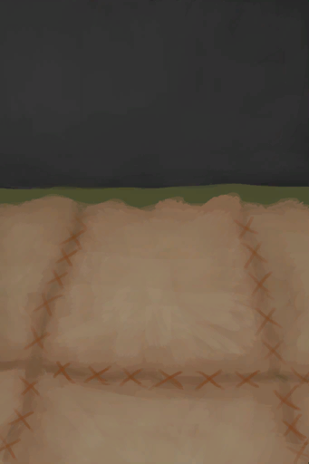

# Stitched-Hide Floor  
> More comfortable than bare wood.  
  
<table class="table table-bordered" data-toggle="table"  data-show-header="false"><thead style="display:none"><tr ><th  style="width:50%;text-align:left;vertical-align:top;"  >title</th><th  style="width:50%;text-align:left;vertical-align:top;"  ></th></tr></thead><tr ><td  style="width:50%;text-align:left;vertical-align:top;"  >** Effect: ** [

[Comfort](Comfort.md)](Comfort.md)<b>+250</b>  ** Unlock By: ** [

[Crafting(Skill)](Skill_Crafting.md)](Skill_Crafting.md): <b>75-150</b>  ** Unlock Require: ** [Raft(Environment)](Env_Raft.md)</td><td  style="width:50%;text-align:left;vertical-align:top;"  >

<a href="Imp_RaftStitchedHideFloor.md" style="color:black">Stitched-Hide Floor</a>

"Adding a layer of hide to the floor can make it feel more <b>Comfortable</b> to the feet as well as easier to <b>Clean</b>.  All you need is enough <b>Cured Hide</td></tr></tbody></table>  
  
## Craft  

<table><tr><td style="width:100px;"><b>Total：</b></td><td>[“Leather(Group)”](GpTag_Leather.md) x 16 , [

[Fiber Cord](CordFiber.md)](CordFiber.md) x 32 , [“Needle(Group)”](GpTag_Needle.md) x 1(Usage-8)</td></tr><tr><td><b>TimeCost：</b></td><td>1h30m/Stage , Total：6h</td></tr><tr><td><b>Require：</b></td><td>[

[Light](Light.md)](Light.md): <b>10-100</b></td></tr><tr><td colspan=2><b>Stage：</b></td></tr><tr><td style="text-align:right"><b>1.</b></td><td>[“Leather(Group)”](GpTag_Leather.md) x 4 + [

[Fiber Cord](CordFiber.md)](CordFiber.md) x 8 + [“Needle(Group)”](GpTag_Needle.md) x 1(Usage-2)</td></tr><tr><td style="text-align:right"><b>2.</b></td><td>[“Leather(Group)”](GpTag_Leather.md) x 4 + [

[Fiber Cord](CordFiber.md)](CordFiber.md) x 8 + [“Needle(Group)”](GpTag_Needle.md) x 1(Usage-2)</td></tr><tr><td style="text-align:right"><b>3.</b></td><td>[“Leather(Group)”](GpTag_Leather.md) x 4 + [

[Fiber Cord](CordFiber.md)](CordFiber.md) x 8 + [“Needle(Group)”](GpTag_Needle.md) x 1(Usage-2)</td></tr><tr><td style="text-align:right"><b>4.</b></td><td>[“Leather(Group)”](GpTag_Leather.md) x 4 + [

[Fiber Cord](CordFiber.md)](CordFiber.md) x 8 + [“Needle(Group)”](GpTag_Needle.md) x 1(Usage-2)</td></tr><tr style="background-color:#fff;font-size:1.2em;"><td></td><td style="text-align:right"><b>Production：</b></td></tr></table>
  
  

