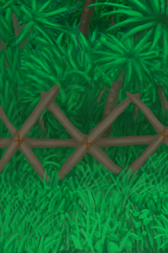

# Trapping Fences  
> Should improve my chances of catching prey in my traps.  
  
<table class="table table-bordered" data-toggle="table"  data-show-header="false"><thead style="display:none"><tr ><th  style="width:50%;text-align:left;vertical-align:top;"  >title</th><th  style="width:50%;text-align:left;vertical-align:top;"  ></th></tr></thead><tr ><td  style="width:50%;text-align:left;vertical-align:top;"  >** Unlock By: ** [

[Trapping(Skill)](Skill_Trapping.md)](Skill_Trapping.md): <b>70-150</b></td><td  style="width:50%;text-align:left;vertical-align:top;"  >

<a href="Imp_TrappingFences.md" style="color:black">Trapping Fences</a>

</td></tr></tbody></table>  
  
## Craft  

<table><tr><td style="width:100px;"><b>Total：</b></td><td>[

[Long Stick](StickLong.md)](StickLong.md) x 50 , [“Shovel(Group)”](GpTag_Shovel.md) x 1(Usage-10)</td></tr><tr><td><b>TimeCost：</b></td><td>1h/Stage , Total：10h</td></tr><tr><td><b>Require：</b></td><td>[

[Light](Light.md)](Light.md): <b>10-100</b></td></tr><tr><td colspan=2><b>Stage：</b></td></tr><tr><td style="text-align:right"><b>1.</b></td><td>[

[Long Stick](StickLong.md)](StickLong.md) x 5 + [“Shovel(Group)”](GpTag_Shovel.md) x 1(Usage-1)</td></tr><tr><td style="text-align:right"><b>2.</b></td><td>[

[Long Stick](StickLong.md)](StickLong.md) x 5 + [“Shovel(Group)”](GpTag_Shovel.md) x 1(Usage-1)</td></tr><tr><td style="text-align:right"><b>3.</b></td><td>[

[Long Stick](StickLong.md)](StickLong.md) x 5 + [“Shovel(Group)”](GpTag_Shovel.md) x 1(Usage-1)</td></tr><tr><td style="text-align:right"><b>4.</b></td><td>[

[Long Stick](StickLong.md)](StickLong.md) x 5 + [“Shovel(Group)”](GpTag_Shovel.md) x 1(Usage-1)</td></tr><tr><td style="text-align:right"><b>5.</b></td><td>[

[Long Stick](StickLong.md)](StickLong.md) x 5 + [“Shovel(Group)”](GpTag_Shovel.md) x 1(Usage-1)</td></tr><tr><td style="text-align:right"><b>6.</b></td><td>[

[Long Stick](StickLong.md)](StickLong.md) x 5 + [“Shovel(Group)”](GpTag_Shovel.md) x 1(Usage-1)</td></tr><tr><td style="text-align:right"><b>7.</b></td><td>[

[Long Stick](StickLong.md)](StickLong.md) x 5 + [“Shovel(Group)”](GpTag_Shovel.md) x 1(Usage-1)</td></tr><tr><td style="text-align:right"><b>8.</b></td><td>[

[Long Stick](StickLong.md)](StickLong.md) x 5 + [“Shovel(Group)”](GpTag_Shovel.md) x 1(Usage-1)</td></tr><tr><td style="text-align:right"><b>9.</b></td><td>[

[Long Stick](StickLong.md)](StickLong.md) x 5 + [“Shovel(Group)”](GpTag_Shovel.md) x 1(Usage-1)</td></tr><tr><td style="text-align:right"><b>10.</b></td><td>[

[Long Stick](StickLong.md)](StickLong.md) x 5 + [“Shovel(Group)”](GpTag_Shovel.md) x 1(Usage-1)</td></tr><tr style="background-color:#fff;font-size:1.2em;"><td></td><td style="text-align:right"><b>Production：</b></td></tr></table>
  
  

