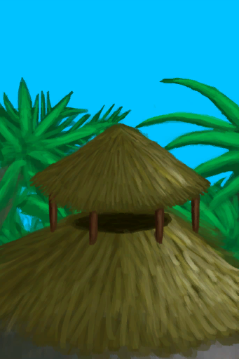

# Wind Tower  
> Helps lower temperature.  
  
<table class="table table-bordered" data-toggle="table"  data-show-header="false"><thead style="display:none"><tr ><th  style="width:50%;text-align:left;vertical-align:top;"  >title</th><th  style="width:50%;text-align:left;vertical-align:top;"  ></th></tr></thead><tr ><td  style="width:50%;text-align:left;vertical-align:top;"  >** Effect: ** [

[Temperature](TemperaturePerceived.md)](TemperaturePerceived.md)<b>-1</b>  ** Unlock Require: ** [Mud Hut(Environment)](Env_MudHut.md) [Mud Hut(Environment)](Env_MudHutRuins.md)</td><td  style="width:50%;text-align:left;vertical-align:top;"  >

<a href="Imp_WindcatcherMudHut.md" style="color:black">Wind Tower</a>

</td></tr></tbody></table>  
  
## Craft  

<table><tr><td style="width:100px;"><b>Total：</b></td><td>[“Hammering Tool(Group)”](GpTag_Hammer.md) x 1 , [

[Mud Brick](MudBrick.md)](MudBrick.md) x 10 , [

[Sticks](Sticks.md)](Sticks.md) x 13 , [

[Clay](Clay.md)](Clay.md) x 4</td></tr><tr><td><b>TimeCost：</b></td><td>1h/Stage , Total：4h</td></tr><tr><td><b>Require：</b></td><td>[

[Light](Light.md)](Light.md): <b>10-100</b></td></tr><tr><td colspan=2><b>Stage：</b></td></tr><tr><td style="text-align:right"><b>1.</b></td><td>[“Hammering Tool(Group)”](GpTag_Hammer.md) x 1</td></tr><tr><td style="text-align:right"><b>2.</b></td><td>[

[Mud Brick](MudBrick.md)](MudBrick.md) x 4 + [

[Sticks](Sticks.md)](Sticks.md) x 5</td></tr><tr><td style="text-align:right"><b>3.</b></td><td>[

[Mud Brick](MudBrick.md)](MudBrick.md) x 4 + [

[Sticks](Sticks.md)](Sticks.md) x 5</td></tr><tr><td style="text-align:right"><b>4.</b></td><td>[

[Mud Brick](MudBrick.md)](MudBrick.md) x 2 + [

[Sticks](Sticks.md)](Sticks.md) x 3 + [

[Clay](Clay.md)](Clay.md) x 4</td></tr><tr style="background-color:#fff;font-size:1.2em;"><td></td><td style="text-align:right"><b>Production：</b></td></tr></table>
  
  

