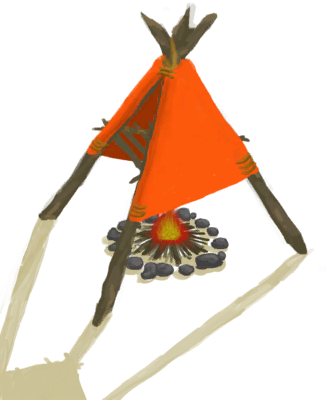
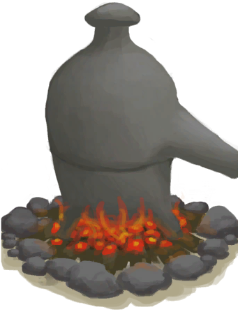

# Cold Insulation  
> Protects you against the effects of Hypothermia.  
  

<b>Base Value: </b> 0 
  

<b>Value Range: </b> 0 ~ 0 
  

<b>Base Rate: </b> - 
  
## Statuses  

<table><tr style="height:2em;"><td style="background-color:#F0F0F0;text-align:center;width:180px;font-size:1.4em;font-weight:bold;vertical-align:middle;">
5 ～ 10

</td><td colspan=2 style="font-size:1.1em;vertical-align:middle;background-color:#F9F9F9;">
<b>

Lvl 1</b>

</td></tr><tr><td colspan=2><b>Effect：</b>[

[Hypothermia](Hypothermia.md)](Hypothermia.md)addition<b>-15</b></td></tr><tr><td colspan=2></td></tr><tr style="height:2em;"><td style="background-color:#F0F0F0;text-align:center;width:180px;font-size:1.4em;font-weight:bold;vertical-align:middle;">
11 ～ 20

</td><td colspan=2 style="font-size:1.1em;vertical-align:middle;background-color:#F9F9F9;">
<b>

Lvl 2</b>

</td></tr><tr><td colspan=2><b>Effect：</b>[

[Hypothermia](Hypothermia.md)](Hypothermia.md)addition<b>-26</b></td></tr><tr><td colspan=2></td></tr><tr style="height:2em;"><td style="background-color:#F0F0F0;text-align:center;width:180px;font-size:1.4em;font-weight:bold;vertical-align:middle;">
21 ～ 30

</td><td colspan=2 style="font-size:1.1em;vertical-align:middle;background-color:#F9F9F9;">
<b>

Lvl 3</b>

</td></tr><tr><td colspan=2><b>Effect：</b>[

[Hypothermia](Hypothermia.md)](Hypothermia.md)addition<b>-28</b></td></tr><tr><td colspan=2></td></tr><tr style="height:2em;"><td style="background-color:#F0F0F0;text-align:center;width:180px;font-size:1.4em;font-weight:bold;vertical-align:middle;">
31 ～ 40

</td><td colspan=2 style="font-size:1.1em;vertical-align:middle;background-color:#F9F9F9;">
<b>

Lvl 4</b>

</td></tr><tr><td colspan=2><b>Effect：</b>[

[Hypothermia](Hypothermia.md)](Hypothermia.md)addition<b>-32</b></td></tr><tr><td colspan=2></td></tr><tr style="height:2em;"><td style="background-color:#F0F0F0;text-align:center;width:180px;font-size:1.4em;font-weight:bold;vertical-align:middle;">
41 ～ 50

</td><td colspan=2 style="font-size:1.1em;vertical-align:middle;background-color:#F9F9F9;">
<b>

Lvl 5</b>

</td></tr><tr><td colspan=2><b>Effect：</b>[

[Hypothermia](Hypothermia.md)](Hypothermia.md)addition<b>-40</b></td></tr><tr><td colspan=2></td></tr></table>
  
## Change By  
<table class="table table-bordered" data-toggle="table"  ><thead style=""><tr ><th  style="text-align:left;vertical-align:top;"  >From</th><th  style="text-align:left;vertical-align:top;"  >Operation</th><th  style="text-align:left;vertical-align:top;"  data-sortable="true"  >Value</th></tr></thead><tr ><td  style="text-align:left;vertical-align:top;"  >[

[Campfire](Campfire.md)](Campfire.md)</td><td  style="text-align:left;vertical-align:top;"  >Passive Effects</td><td  style="text-align:left;vertical-align:top;"  >20</td></tr><tr ><td  style="text-align:left;vertical-align:top;"  >[

[Clay Fire Pit](ClayFirePit.md)](ClayFirePit.md)</td><td  style="text-align:left;vertical-align:top;"  >Passive Effects</td><td  style="text-align:left;vertical-align:top;"  >20</td></tr><tr ><td  style="text-align:left;vertical-align:top;"  >[

[Fire](Fire.md)](Fire.md)</td><td  style="text-align:left;vertical-align:top;"  >Passive Effects</td><td  style="text-align:left;vertical-align:top;"  >20</td></tr><tr ><td  style="text-align:left;vertical-align:top;"  >[

[Smoker](Smoker.md)](Smoker.md)</td><td  style="text-align:left;vertical-align:top;"  >Passive Effects</td><td  style="text-align:left;vertical-align:top;"  >20</td></tr><tr ><td  style="text-align:left;vertical-align:top;"  >[

[Smoker](SmokerPlastic.md)](SmokerPlastic.md)</td><td  style="text-align:left;vertical-align:top;"  >Passive Effects</td><td  style="text-align:left;vertical-align:top;"  >20</td></tr><tr ><td  style="text-align:left;vertical-align:top;"  >[

[Alembic(On)](AlembicOn.md)](AlembicOn.md)</td><td  style="text-align:left;vertical-align:top;"  >Passive Effects</td><td  style="text-align:left;vertical-align:top;"  >15</td></tr><tr ><td  style="text-align:left;vertical-align:top;"  >[

[Stove](Stove.md)](Stove.md)</td><td  style="text-align:left;vertical-align:top;"  >Passive Effects</td><td  style="text-align:left;vertical-align:top;"  >15</td></tr><tr ><td  style="text-align:left;vertical-align:top;"  >

[Permeable Skin](Pk_3_PermeableSkin.md)</td><td  style="text-align:left;vertical-align:top;"  >Perk Effect</td><td  style="text-align:left;vertical-align:top;"  >15</td></tr><tr ><td  style="text-align:left;vertical-align:top;"  >[

[Gas Cooker(On)](GasCookerOn.md)](GasCookerOn.md)</td><td  style="text-align:left;vertical-align:top;"  >Passive Effects</td><td  style="text-align:left;vertical-align:top;"  >10</td></tr><tr ><td  style="text-align:left;vertical-align:top;"  >[

[Shelter](Shelter.md)](Shelter.md)</td><td  style="text-align:left;vertical-align:top;"  >Passive Effects</td><td  style="text-align:left;vertical-align:top;"  >5</td></tr><tr ><td  style="text-align:left;vertical-align:top;"  >[

[Sheltered Leaf Bed](ShelteredLeafBed.md)](ShelteredLeafBed.md)</td><td  style="text-align:left;vertical-align:top;"  >Passive Effects</td><td  style="text-align:left;vertical-align:top;"  >5</td></tr><tr ><td  style="text-align:left;vertical-align:top;"  >[

[Tent](TentDeployed.md)](TentDeployed.md)</td><td  style="text-align:left;vertical-align:top;"  >Passive Effects</td><td  style="text-align:left;vertical-align:top;"  >5</td></tr><tr ><td  style="text-align:left;vertical-align:top;"  >[

[Forge](Forge.md)](Forge.md)</td><td  style="text-align:left;vertical-align:top;"  >Passive Effects</td><td  style="text-align:left;vertical-align:top;"  >5</td></tr><tr ><td  style="text-align:left;vertical-align:top;"  >[

[Kiln](Kiln.md)](Kiln.md)</td><td  style="text-align:left;vertical-align:top;"  >Passive Effects</td><td  style="text-align:left;vertical-align:top;"  >5</td></tr><tr ><td  style="text-align:left;vertical-align:top;"  >[

[Advanced Kiln](KilnAdvanced.md)](KilnAdvanced.md)</td><td  style="text-align:left;vertical-align:top;"  >Passive Effects</td><td  style="text-align:left;vertical-align:top;"  >5</td></tr><tr ><td  style="text-align:left;vertical-align:top;"  >[

[Raft Shelter](RaftShelter.md)](RaftShelter.md)</td><td  style="text-align:left;vertical-align:top;"  >Passive Effects</td><td  style="text-align:left;vertical-align:top;"  >5</td></tr><tr ><td  style="text-align:left;vertical-align:top;"  >[

[Gas Mask](GasMaskRustic.md)](GasMaskRustic.md)</td><td  style="text-align:left;vertical-align:top;"  >Passive Effects</td><td  style="text-align:left;vertical-align:top;"  >2</td></tr><tr ><td  style="text-align:left;vertical-align:top;"  >[

[Makeshift Mask](MaskMakeshift.md)](MaskMakeshift.md)</td><td  style="text-align:left;vertical-align:top;"  >Passive Effects</td><td  style="text-align:left;vertical-align:top;"  >2</td></tr></tbody></table>  
  

