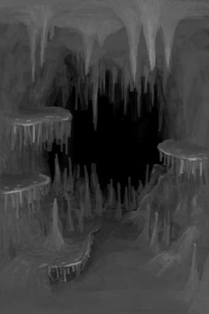
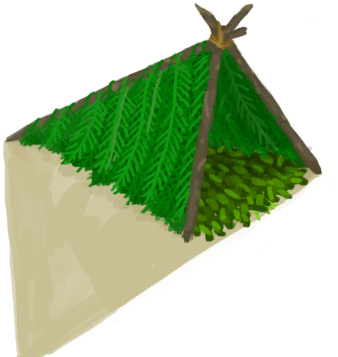
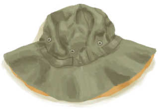

# Heat Insulation  
> Protects you against the effects of Hyperthermia.  
  

<b>Base Value: </b> 0 
  

<b>Value Range: </b> 0 ~ 0 
  

<b>Base Rate: </b> - 
  
## Statuses  

<table><tr style="height:2em;"><td style="background-color:#F0F0F0;text-align:center;width:180px;font-size:1.4em;font-weight:bold;vertical-align:middle;">
5 ～ 10

</td><td colspan=2 style="font-size:1.1em;vertical-align:middle;background-color:#F9F9F9;">
<b>

Lvl 1</b>

</td></tr><tr><td colspan=2><b>Effect：</b>[

[Hyperthermia](Hyperthermia.md)](Hyperthermia.md)addition<b>-24</b></td></tr><tr><td colspan=2></td></tr><tr style="height:2em;"><td style="background-color:#F0F0F0;text-align:center;width:180px;font-size:1.4em;font-weight:bold;vertical-align:middle;">
11 ～ 20

</td><td colspan=2 style="font-size:1.1em;vertical-align:middle;background-color:#F9F9F9;">
<b>

Lvl 2</b>

</td></tr><tr><td colspan=2><b>Effect：</b>[

[Hyperthermia](Hyperthermia.md)](Hyperthermia.md)addition<b>-26</b></td></tr><tr><td colspan=2></td></tr><tr style="height:2em;"><td style="background-color:#F0F0F0;text-align:center;width:180px;font-size:1.4em;font-weight:bold;vertical-align:middle;">
21 ～ 30

</td><td colspan=2 style="font-size:1.1em;vertical-align:middle;background-color:#F9F9F9;">
<b>

Lvl 3</b>

</td></tr><tr><td colspan=2><b>Effect：</b>[

[Hyperthermia](Hyperthermia.md)](Hyperthermia.md)addition<b>-28</b></td></tr><tr><td colspan=2></td></tr><tr style="height:2em;"><td style="background-color:#F0F0F0;text-align:center;width:180px;font-size:1.4em;font-weight:bold;vertical-align:middle;">
31 ～ 40

</td><td colspan=2 style="font-size:1.1em;vertical-align:middle;background-color:#F9F9F9;">
<b>

Lvl 4</b>

</td></tr><tr><td colspan=2><b>Effect：</b>[

[Hyperthermia](Hyperthermia.md)](Hyperthermia.md)addition<b>-30</b></td></tr><tr><td colspan=2></td></tr><tr style="height:2em;"><td style="background-color:#F0F0F0;text-align:center;width:180px;font-size:1.4em;font-weight:bold;vertical-align:middle;">
41 ～ 50

</td><td colspan=2 style="font-size:1.1em;vertical-align:middle;background-color:#F9F9F9;">
<b>

Lvl 5</b>

</td></tr><tr><td colspan=2><b>Effect：</b>[

[Hyperthermia](Hyperthermia.md)](Hyperthermia.md)addition<b>-40</b></td></tr><tr><td colspan=2></td></tr></table>
  
## Addition Change By  
<table class="table table-bordered" data-toggle="table"  ><thead style=""><tr ><th  style="text-align:left;vertical-align:top;"  >From</th><th  style="text-align:left;vertical-align:top;"  >Operation</th><th  style="text-align:left;vertical-align:top;"  >Value</th></tr></thead><tr ><td  style="text-align:left;vertical-align:top;"  >[Volcano(Environment)](Env_AcidLake.md)</td><td  style="text-align:left;vertical-align:top;"  >Passive Effects</td><td  style="text-align:left;vertical-align:top;"  >addition+0</td></tr><tr ><td  style="text-align:left;vertical-align:top;"  >[Eastern Highlands(Environment)](Env_HighlandsEastern.md)</td><td  style="text-align:left;vertical-align:top;"  >Passive Effects</td><td  style="text-align:left;vertical-align:top;"  >addition+0</td></tr><tr ><td  style="text-align:left;vertical-align:top;"  >[Volcano(Environment)](Env_Volcano.md)</td><td  style="text-align:left;vertical-align:top;"  >Passive Effects</td><td  style="text-align:left;vertical-align:top;"  >addition+0</td></tr></tbody></table>  
  
## Change By  
<table class="table table-bordered" data-toggle="table"  ><thead style=""><tr ><th  style="text-align:left;vertical-align:top;"  >From</th><th  style="text-align:left;vertical-align:top;"  >Operation</th><th  style="text-align:left;vertical-align:top;"  data-sortable="true"  >Value</th></tr></thead><tr ><td  style="text-align:left;vertical-align:top;"  >[

[High Chamber(Environment)](Env_CrystalChamber.md)](Env_CrystalChamber.md)</td><td  style="text-align:left;vertical-align:top;"  >Passive Effects</td><td  style="text-align:left;vertical-align:top;"  >6</td></tr><tr ><td  style="text-align:left;vertical-align:top;"  >[

[Damp Chamber(Environment)](Env_DampChamber.md)](Env_DampChamber.md)</td><td  style="text-align:left;vertical-align:top;"  >Passive Effects</td><td  style="text-align:left;vertical-align:top;"  >6</td></tr><tr ><td  style="text-align:left;vertical-align:top;"  >[

[Dark Chamber(Environment)](Env_DarkChamber.md)](Env_DarkChamber.md)</td><td  style="text-align:left;vertical-align:top;"  >Passive Effects</td><td  style="text-align:left;vertical-align:top;"  >6</td></tr><tr ><td  style="text-align:left;vertical-align:top;"  >[

[Flooded Chamber(Environment)](Env_FloodedChamber.md)](Env_FloodedChamber.md)</td><td  style="text-align:left;vertical-align:top;"  >Passive Effects</td><td  style="text-align:left;vertical-align:top;"  >6</td></tr><tr ><td  style="text-align:left;vertical-align:top;"  >[

[High Chamber(Environment)](Env_HighChamber.md)](Env_HighChamber.md)</td><td  style="text-align:left;vertical-align:top;"  >Passive Effects</td><td  style="text-align:left;vertical-align:top;"  >6</td></tr><tr ><td  style="text-align:left;vertical-align:top;"  >[

[High Chamber(Environment)](Env_LowChamber.md)](Env_LowChamber.md)</td><td  style="text-align:left;vertical-align:top;"  >Passive Effects</td><td  style="text-align:left;vertical-align:top;"  >6</td></tr><tr ><td  style="text-align:left;vertical-align:top;"  >[

[High Chamber(Environment)](Env_MidChamber.md)](Env_MidChamber.md)</td><td  style="text-align:left;vertical-align:top;"  >Passive Effects</td><td  style="text-align:left;vertical-align:top;"  >6</td></tr><tr ><td  style="text-align:left;vertical-align:top;"  >[

[High Chamber(Environment)](Env_NarrowTunnel.md)](Env_NarrowTunnel.md)</td><td  style="text-align:left;vertical-align:top;"  >Passive Effects</td><td  style="text-align:left;vertical-align:top;"  >6</td></tr><tr ><td  style="text-align:left;vertical-align:top;"  >[

[Cellar(Environment)](Env_Cellar.md)](Env_Cellar.md)</td><td  style="text-align:left;vertical-align:top;"  >Passive Effects</td><td  style="text-align:left;vertical-align:top;"  >6</td></tr><tr ><td  style="text-align:left;vertical-align:top;"  >[

[Shelter](Shelter.md)](Shelter.md)</td><td  style="text-align:left;vertical-align:top;"  >Passive Effects</td><td  style="text-align:left;vertical-align:top;"  >5</td></tr><tr ><td  style="text-align:left;vertical-align:top;"  >[

[Sheltered Leaf Bed](ShelteredLeafBed.md)](ShelteredLeafBed.md)</td><td  style="text-align:left;vertical-align:top;"  >Passive Effects</td><td  style="text-align:left;vertical-align:top;"  >5</td></tr><tr ><td  style="text-align:left;vertical-align:top;"  >[

[Raft Shelter](RaftShelter.md)](RaftShelter.md)</td><td  style="text-align:left;vertical-align:top;"  >Passive Effects</td><td  style="text-align:left;vertical-align:top;"  >5</td></tr><tr ><td  style="text-align:left;vertical-align:top;"  >[

[Tunnel(Environment)](Env_Tunnel.md)](Env_Tunnel.md)</td><td  style="text-align:left;vertical-align:top;"  >Passive Effects</td><td  style="text-align:left;vertical-align:top;"  >3</td></tr><tr ><td  style="text-align:left;vertical-align:top;"  >[

[Bat Cave(Environment)](Env_CaveBats.md)](Env_CaveBats.md)</td><td  style="text-align:left;vertical-align:top;"  >Passive Effects</td><td  style="text-align:left;vertical-align:top;"  >3</td></tr><tr ><td  style="text-align:left;vertical-align:top;"  >[

[Dark Cave(Environment)](Env_CaveDark.md)](Env_CaveDark.md)</td><td  style="text-align:left;vertical-align:top;"  >Passive Effects</td><td  style="text-align:left;vertical-align:top;"  >3</td></tr><tr ><td  style="text-align:left;vertical-align:top;"  >[Cave(Environment)](Env_CaveGrasslands.md)</td><td  style="text-align:left;vertical-align:top;"  >Passive Effects</td><td  style="text-align:left;vertical-align:top;"  >3</td></tr><tr ><td  style="text-align:left;vertical-align:top;"  >[Cave(Environment)](Env_CaveSea.md)</td><td  style="text-align:left;vertical-align:top;"  >Passive Effects</td><td  style="text-align:left;vertical-align:top;"  >3</td></tr><tr ><td  style="text-align:left;vertical-align:top;"  >[Tidal Cave(Environment)](Env_CaveTidal.md)</td><td  style="text-align:left;vertical-align:top;"  >Passive Effects</td><td  style="text-align:left;vertical-align:top;"  >3</td></tr><tr ><td  style="text-align:left;vertical-align:top;"  >[

[Crashed Plane(Environment)](Env_CrashedPlane.md)](Env_CrashedPlane.md)</td><td  style="text-align:left;vertical-align:top;"  >Passive Effects</td><td  style="text-align:left;vertical-align:top;"  >3</td></tr><tr ><td  style="text-align:left;vertical-align:top;"  >[Hole(Environment)](Env_HighlandHole.md)</td><td  style="text-align:left;vertical-align:top;"  >Passive Effects</td><td  style="text-align:left;vertical-align:top;"  >3</td></tr><tr ><td  style="text-align:left;vertical-align:top;"  >[

[Macaque Den(Environment)](Env_MacaqueDen.md)](Env_MacaqueDen.md)</td><td  style="text-align:left;vertical-align:top;"  >Passive Effects</td><td  style="text-align:left;vertical-align:top;"  >3</td></tr><tr ><td  style="text-align:left;vertical-align:top;"  >[

[Mud Hut(Environment)](Env_MudHut.md)](Env_MudHut.md)</td><td  style="text-align:left;vertical-align:top;"  >Passive Effects</td><td  style="text-align:left;vertical-align:top;"  >3</td></tr><tr ><td  style="text-align:left;vertical-align:top;"  >[

[Mud Hut(Environment)](Env_MudHutRuins.md)](Env_MudHutRuins.md)</td><td  style="text-align:left;vertical-align:top;"  >Passive Effects</td><td  style="text-align:left;vertical-align:top;"  >3</td></tr><tr ><td  style="text-align:left;vertical-align:top;"  >[

[Shed(Environment)](Env_Shed.md)](Env_Shed.md)</td><td  style="text-align:left;vertical-align:top;"  >Passive Effects</td><td  style="text-align:left;vertical-align:top;"  >3</td></tr><tr ><td  style="text-align:left;vertical-align:top;"  >[

[Stone Hut(Environment)](Env_StoneHut.md)](Env_StoneHut.md)</td><td  style="text-align:left;vertical-align:top;"  >Passive Effects</td><td  style="text-align:left;vertical-align:top;"  >3</td></tr><tr ><td  style="text-align:left;vertical-align:top;"  >[

[Wetlands(Environment)](Env_Wetlands.md)](Env_Wetlands.md)</td><td  style="text-align:left;vertical-align:top;"  >Passive Effects</td><td  style="text-align:left;vertical-align:top;"  >3</td></tr><tr ><td  style="text-align:left;vertical-align:top;"  >[

[Survival Hat](HatSurvival.md)](HatSurvival.md)</td><td  style="text-align:left;vertical-align:top;"  >Passive Effects</td><td  style="text-align:left;vertical-align:top;"  >2</td></tr><tr ><td  style="text-align:left;vertical-align:top;"  >[

[Woven Palm Hat](HatWoven.md)](HatWoven.md)</td><td  style="text-align:left;vertical-align:top;"  >Passive Effects</td><td  style="text-align:left;vertical-align:top;"  >2</td></tr><tr ><td  style="text-align:left;vertical-align:top;"  >[

[Jungle(Environment)](Env_DeepJungle.md)](Env_DeepJungle.md)</td><td  style="text-align:left;vertical-align:top;"  >Passive Effects</td><td  style="text-align:left;vertical-align:top;"  >2</td></tr><tr ><td  style="text-align:left;vertical-align:top;"  >[

[Western Highlands(Environment)](Env_HighlandsWestern.md)](Env_HighlandsWestern.md)</td><td  style="text-align:left;vertical-align:top;"  >Passive Effects</td><td  style="text-align:left;vertical-align:top;"  >2</td></tr><tr ><td  style="text-align:left;vertical-align:top;"  >[

[Jungle(Environment)](Env_Jungle.md)](Env_Jungle.md)</td><td  style="text-align:left;vertical-align:top;"  >Passive Effects</td><td  style="text-align:left;vertical-align:top;"  >2</td></tr><tr ><td  style="text-align:left;vertical-align:top;"  >[

[Jungle Highlands(Environment)](Env_JungleHighlands.md)](Env_JungleHighlands.md)</td><td  style="text-align:left;vertical-align:top;"  >Passive Effects</td><td  style="text-align:left;vertical-align:top;"  >2</td></tr><tr ><td  style="text-align:left;vertical-align:top;"  >[

[Mangrove Forest(Environment)](Env_Mangroves.md)](Env_Mangroves.md)</td><td  style="text-align:left;vertical-align:top;"  >Passive Effects</td><td  style="text-align:left;vertical-align:top;"  >2</td></tr><tr ><td  style="text-align:left;vertical-align:top;"  >[

[Outskirts(Environment)](Env_Outskirts.md)](Env_Outskirts.md)</td><td  style="text-align:left;vertical-align:top;"  >Passive Effects</td><td  style="text-align:left;vertical-align:top;"  >2</td></tr><tr ><td  style="text-align:left;vertical-align:top;"  >[

[Collapsed Roof(Mud Hut)](Dmg_RoofCollapsed.md)](Dmg_RoofCollapsed.md)</td><td  style="text-align:left;vertical-align:top;"  >Passive Effects</td><td  style="text-align:left;vertical-align:top;"  >-3</td></tr></tbody></table>  
  

