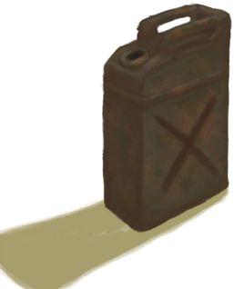

# Fuel Jerrycan  
> It's full of fuel.  
  
<table class="table table-bordered" data-toggle="table"  data-show-header="false"><thead style="display:none"><tr ><th  style="width:50%;text-align:left;vertical-align:top;"  >title</th><th  style="width:50%;text-align:left;vertical-align:top;"  ></th></tr></thead><tr ><td  style="width:50%;text-align:left;vertical-align:top;"  >**Weight：**500  **Tag：**	[“Water Container”](tag_WaterContainer.md), [“Large”](tag_Large.md), [“Heavy”](tag_Heavy.md)</td><td  style="width:50%;text-align:left;vertical-align:top;"  >

<a href="JerrycanFuel.md" style="color:black">Fuel Jerrycan</a>

</td></tr></tbody></table>  
  
## Got From  

Explore the shipwreck

[Shipwreck(Bird Rock)](Shipwreck.md)

Perk Effect

[Plane Crash](Pk_1_PlaneCrash.md)

  
  
## Action  

<table><tr><td rowspan="2" style="width:200px;text-align:center;font-size:1.3em;font-weight:bold">

Empty

</td><td></td></tr><tr><td><b>Self：</b>→ [

[Jerrycan](Jerrycan.md)](Jerrycan.md)</td></tr></table>
  
  
  
## Drag With  

<table style="margin-bottom:0px;"><tr><td style="width:40%;text-align:left; background-color:#FEFEFE"><b>With：</b>[“Fire”](tag_Fire.md)</td><td style="width:40%;font-size:1em;font-weight:bold;background-color:#FEFEFE">Fuel Fire  </td></tr><tr style="background-color:#FFFFFF"><td style=""><b>Receiving：</b>Fuel  <b>+30(31.25%)</b></td><td style=""><b>Self：</b>→ [

[Jerrycan](Jerrycan.md)](Jerrycan.md)</td></tr></table>
  
  
## Drag To  

[Bee Skep](BeeSkep.md)

[Swarming Bee Skep](BeeSkepSwarming.md)

[Trapped Macaque](CageTrapMacaque.md)

[Sow](BoarEnclosureFemale.md)

[Boar](BoarEnclosureMale.md)

[Piglet](BoarEnclosurePiglet.md)

[Sow](BoarTiedFemale.md)

[Boar](BoarTiedMale.md)

[Piglet](BoarTiedPiglet.md)

[Dog Friend](DogFriend.md)

[Goat](GoatEnclosureFemale.md)

[Juvenile Goat](GoatEnclosureKid.md)

[Lactating Goat](GoatEnclosureLactating.md)

[Male Goat](GoatEnclosureMale.md)

[Goat](GoatTiedFemale.md)

[Lactating Goat](GoatTiedFemaleLactating.md)

[Juvenile Goat](GoatTiedKid.md)

[Male Goat](GoatTiedMale.md)

[Grandfather](Grandfather.md)

[Grandfather](GrandfatherHealthy.md)

[Macaque Friend](MacaqueFriend.md)

[Wounded Macaque](MacaqueWounded.md)

[Sago Flatbread](SagoFlatbread.md)

[Water Ration](WaterRation.md)

[Engine (open)](Engine1Open.md)

[Engine (repaired)](Engine1Repaired.md)

[Dry Puddle(Wetlands)](Puddle.md)

[Reservoir](WaterReservoir.md)

[Reservoir(Full)](WaterReservoirFull.md)

[Reservoir (irrigating)](WaterReservoirIrrigating.md)

  
  
## Use To Transform  
<table class="table table-bordered" data-toggle="table"  ><thead style=""><tr ><th  style="text-align:left;vertical-align:top;"  >Transform to</th><th  style="text-align:left;vertical-align:top;"  >Container</th></tr></thead><tr ><td  style="text-align:left;vertical-align:top;"  >[

[BOOOOOM!!(Event)](Event_JerrycanExplosion.md)](Event_JerrycanExplosion.md)</td><td  style="text-align:left;vertical-align:top;"  >[

[Campfire](Campfire.md)](Campfire.md)</td></tr><tr ><td  style="text-align:left;vertical-align:top;"  >[

[BOOOOOM!!(Event)](Event_JerrycanExplosion.md)](Event_JerrycanExplosion.md)</td><td  style="text-align:left;vertical-align:top;"  >[

[Clay Fire Pit](ClayFirePit.md)](ClayFirePit.md)</td></tr><tr ><td  style="text-align:left;vertical-align:top;"  >[

[BOOOOOM!!(Event)](Event_JerrycanExplosion.md)](Event_JerrycanExplosion.md)</td><td  style="text-align:left;vertical-align:top;"  >[

[Fire](Fire.md)](Fire.md)</td></tr><tr ><td  style="text-align:left;vertical-align:top;"  >[

[BOOOOOM!!(Event)](Event_JerrycanExplosion.md)](Event_JerrycanExplosion.md)</td><td  style="text-align:left;vertical-align:top;"  >[

[Gas Cooker(On)](GasCookerOn.md)](GasCookerOn.md)</td></tr><tr ><td  style="text-align:left;vertical-align:top;"  >[

[BOOOOOM!!(Event)](Event_JerrycanExplosion.md)](Event_JerrycanExplosion.md)</td><td  style="text-align:left;vertical-align:top;"  >[

[Stove](Stove.md)](Stove.md)</td></tr></tbody></table>  
  

