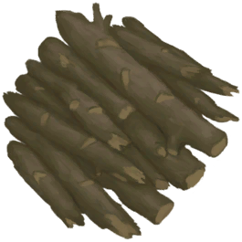
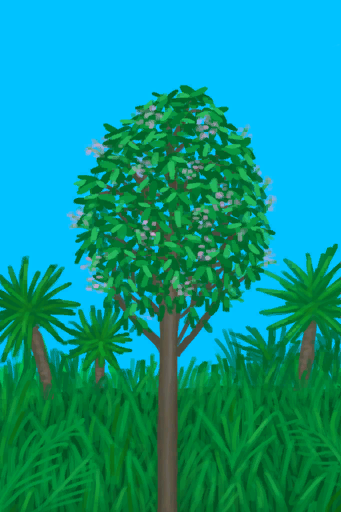
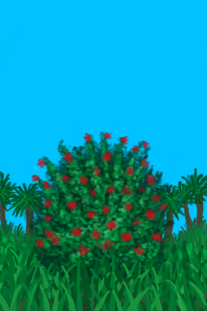

# Jungle Highlands  
> "I should explore it for resources  
  

<a href="JungleHighlands.md" style="color:black">Jungle Highlands</a>

<a href="CaveBats.md" style="color:black">Bat Cave</a>

<a href="MacaqueDen.md" style="color:black">Macaque Den</a>

<a href="DeepJungle.md" style="color:black">Deep Jungle</a>

<a href="Cove.md" style="color:black">Secret Cove</a>

<a href="HighlandsWestern.md" style="color:black">Western Highlands</a>

  
  
<table class="table table-bordered" data-toggle="table"  data-show-header="false"><thead style="display:none"><tr ><th  style="width:50%;text-align:left;vertical-align:top;"  >title</th><th  style="width:50%;text-align:left;vertical-align:top;"  ></th></tr></thead><tr ><td  style="width:50%;text-align:left;vertical-align:top;"  >** Unique On Board **  **Environment：**[Jungle Highlands(Environment)](Env_JungleHighlands.md)  **Tag：**	[“Trees for Snare Traps”](tag_SnareCompatible.md)  ** EnvironmentEffect: ** [

[Rain Protection](RainProtection.md)](RainProtection.md)<b>+2</b> [

[Heat Insulation](InsulationHeat.md)](InsulationHeat.md)<b>+2</b> [

[Sun Protection](SunProtection.md)](SunProtection.md)<b>+2</b> [

[Bug Population](BugPopulation.md)](BugPopulation.md)<b>+3</b>  ** Improvements: ** [Path](Imp_Path.md) , [Irrigation System](Imp_Irrigation.md) , [Trapping Fences](Imp_TrappingFences.md)</td><td  style="width:50%;text-align:left;vertical-align:top;"  >"The Jungle Highlands can be found deep in the Island. This area houses numerous caves and has the highest Macaque population. Many unique and useful plants can also be found here</td></tr></tbody></table>  
  
## Exploration  
<table class="table table-bordered" data-toggle="table"  ><thead style=""><tr ><th  style="text-align:left;vertical-align:top;"  >Progress</th><th  style="text-align:left;vertical-align:top;"  >Target</th></tr></thead><tr ><td  style="text-align:left;vertical-align:top;"  >20%</td><td  style="text-align:left;vertical-align:top;"  >[To Deep Jungle(Jungle Highlands)](Path_JungleHighlandsToDeepJungle.md)</td></tr><tr ><td  style="text-align:left;vertical-align:top;"  >35%</td><td  style="text-align:left;vertical-align:top;"  >[Macaque Den(Jungle Highlands)](MacaqueDenEntrance.md)</td></tr><tr ><td  style="text-align:left;vertical-align:top;"  >50%</td><td  style="text-align:left;vertical-align:top;"  >[To Western Highlands(Jungle Highlands)](Path_JungleHighlandsToHighlandsW.md)</td></tr><tr ><td  style="text-align:left;vertical-align:top;"  >65%</td><td  style="text-align:left;vertical-align:top;"  >[Bat Cave(Jungle Highlands)](CaveBatsEntrance.md)</td></tr><tr ><td  style="text-align:left;vertical-align:top;"  >80%</td><td  style="text-align:left;vertical-align:top;"  >[To Secret Cove(Jungle Highlands)](Path_JungleHighlandsToCove.md)</td></tr><tr ><td  style="text-align:left;vertical-align:top;"  >100%</td><td  style="text-align:left;vertical-align:top;"  >[Area Explored(Event)(Jungle Highlands)](Event_JungleHighlandsExplored.md)</td></tr></tbody></table>  
  
## Action  

<table><tr><td rowspan="2" style="width:200px;text-align:center;font-size:1.3em;font-weight:bold">

Explore

15m

</td><td>[“LegAction(Group)”](LegAction.md)</td></tr><tr><td></td></tr><tr><td colspan="2"><b>Require：</b>[

[Light](Light.md)](Light.md): <b>10-100</b></td></tr><tr><td colspan="2"><b>StatChange：</b>[

[Foot Damage](FootDamage.md)](FootDamage.md)<b>+20</b>, [

[Stamina](Stamina.md)](Stamina.md)<b>-4</b>, [

[Stress](Stress.md)](Stress.md)<b>-10</b>, [

[Filth](Filth.md)](Filth.md)<b>+1</b>, [Exploration Jungle](Exploration_Jungle.md)<b>+1</b>, [TV Jungle - Explore](TV_JungleExplore.md)<b>+1</b></td></tr><tr><td colspan="2">

<table style="margin-bottom:3px;"><tr><td rowspan=2 style="text-align:center" width="80px">
Base Weight

600
</td><td style="font-size:0.6em;line-height:0.6em;font-weight:bold">Dry Leaves</td></tr><tr><td>[

[Dry Leaves](LeavesDry.md)](LeavesDry.md)(<b>+1～+2</b>)</td></tr></table>

<table style="margin-bottom:3px;"><tr><td rowspan=2 style="text-align:center" width="80px">
Base Weight

400
</td><td style="font-size:0.6em;line-height:0.6em;font-weight:bold">Palm Fronds</td></tr><tr><td>[

[Palm Fronds](PalmFronds.md)](PalmFronds.md)(<b>+2～+4</b>)</td></tr></table>

<table style="margin-bottom:3px;"><tr><td rowspan=2 style="text-align:center" width="80px">
Base Weight

800
</td><td style="font-size:0.6em;line-height:0.6em;font-weight:bold">Sticks</td></tr><tr><td>[

[Sticks](Sticks.md)](Sticks.md)(<b>+1～+2</b>)</td></tr></table>

<table style="margin-bottom:3px;"><tr><td rowspan=2 style="text-align:center" width="80px">
Base Weight

600
</td><td style="font-size:0.6em;line-height:0.6em;font-weight:bold">Long Sticks</td></tr><tr><td>[

[Long Stick](StickLong.md)](StickLong.md)(<b>+1</b>)</td></tr></table>

<table style="margin-bottom:3px;"><tr><td rowspan=2 style="text-align:center" width="80px">
Base Weight

200
</td><td style="font-size:0.6em;line-height:0.6em;font-weight:bold">Palm Bush</td></tr><tr><td>[

[Palm Bush](PalmBush.md)](PalmBush.md)(<b>+1</b>)</td></tr></table>

<table style="margin-bottom:3px;"><tr><td rowspan=2 style="text-align:center" width="80px">
Base Weight

800
</td><td style="font-size:0.6em;line-height:0.6em;font-weight:bold">Wood</td></tr><tr><td>[

[Wood](Wood.md)](Wood.md)(<b>+1</b>)</td></tr></table>

<table style="margin-bottom:3px;"><tr><td rowspan=2 style="text-align:center" width="80px">
Base Weight

1000000
</td><td style="font-size:0.6em;line-height:0.6em;font-weight:bold">Wood First❗1 limit</td></tr><tr><td>[

[Wood](Wood.md)](Wood.md)(<b>+1</b>)</td></tr></table>

<table style="margin-bottom:3px;"><tr><td rowspan=2 style="text-align:center" width="80px">
Base Weight

800
</td><td style="font-size:0.6em;line-height:0.6em;font-weight:bold">Stone❗6 limit</td></tr><tr><td>[

[Stone](Stone.md)](Stone.md)(<b>+1</b>)</td></tr></table>

<table style="margin-bottom:3px;"><tr><td rowspan=2 style="text-align:center" width="80px">
Base Weight

400
</td><td style="font-size:0.6em;line-height:0.6em;font-weight:bold">Flint❗3 limit</td></tr><tr><td>[

[Flint](Flint.md)](Flint.md)(<b>+1</b>)</td></tr></table>

<table style="margin-bottom:3px;"><tr><td rowspan=2 style="text-align:center" width="80px">
Base Weight

200
</td><td style="font-size:0.6em;line-height:0.6em;font-weight:bold">Flint Slab❗1 limit</td></tr><tr><td>[

[Flint Slab](FlintSlab.md)](FlintSlab.md)(<b>+1</b>)</td></tr></table>

<table style="margin-bottom:3px;"><tr><td rowspan=2 style="text-align:center" width="80px">
Base Weight

0
</td><td style="font-size:0.6em;line-height:0.6em;font-weight:bold">Supply Crate</td></tr><tr><td>[

[Supply Capsule](TV_SupplyCapsule.md)](TV_SupplyCapsule.md)(<b>+1</b>)</td></tr><tr><td colspan=2><li>[

[TV Jungle](TV_Jungle.md)](TV_Jungle.md) in <b>1</b>, weight<b>+300</b></li><li>[TV Jungle - Explore](TV_JungleExplore.md) in <b>0～9</b>, weight<b>-999</b></li></td></tr></table>

<table style="margin-bottom:3px;"><tr><td rowspan=2 style="text-align:center" width="80px">
Base Weight

300
</td><td style="font-size:0.6em;line-height:0.6em;font-weight:bold">Heavy Stone</td></tr><tr><td>[

[Heavy Stone](StoneHeavy.md)](StoneHeavy.md)(<b>+1</b>)</td></tr></table>

<table style="margin-bottom:3px;"><tr><td rowspan=2 style="text-align:center" width="80px">
Base Weight

200000
</td><td style="font-size:0.6em;line-height:0.6em;font-weight:bold">Small Tree</td></tr><tr><td>[

[Small Tree](SmallTree.md)](SmallTree.md)(<b>+1</b>)</td></tr></table>

<table style="margin-bottom:3px;"><tr><td rowspan=2 style="text-align:center" width="80px">
Base Weight

200000
</td><td style="font-size:0.6em;line-height:0.6em;font-weight:bold">Small Palm</td></tr><tr><td>[

[Small Palm](SmallPalm.md)](SmallPalm.md)(<b>+1</b>)</td></tr></table>

<table style="margin-bottom:3px;"><tr><td rowspan=2 style="text-align:center" width="80px">
Base Weight

500
</td><td style="font-size:0.6em;line-height:0.6em;font-weight:bold">Snake Grass</td></tr><tr><td>[

[Snakegrass Patch](SnakegrassPatch.md)](SnakegrassPatch.md)(<b>+1</b>)</td></tr><tr><td colspan=2><li>[

[Herbology(Skill)](Skill_Herbology.md)](Skill_Herbology.md) in <b>0～150(0%～100%)</b>, weight<b>+0～+200</b></li></td></tr></table>

<table style="margin-bottom:3px;"><tr><td rowspan=2 style="text-align:center" width="80px">
Base Weight

2000
</td><td style="font-size:0.6em;line-height:0.6em;font-weight:bold">Large Tree</td></tr><tr><td>[

[Large Tree](LargeTree.md)](LargeTree.md)(<b>+1</b>)</td></tr></table>

<table style="margin-bottom:3px;"><tr><td rowspan=2 style="text-align:center" width="80px">
Base Weight

0
</td><td style="font-size:0.6em;line-height:0.6em;font-weight:bold">Coffee</td></tr><tr><td>[

[Coffee Bush](CoffeePlant.md)](CoffeePlant.md)(<b>+1</b>)[Jungle Highlands Coffee](Coffee_JungleHighlandsPop.md)<b>-1000</b></td></tr><tr><td colspan=2><li>[

[Herbology(Skill)](Skill_Herbology.md)](Skill_Herbology.md) in <b>0～150(0%～100%)</b>, weight<b>-300～+0</b></li><li>[

[Eyesight](Myopia.md)](Myopia.md) in <b>1～3</b>, weight<b>-100～-300</b></li><li>[Jungle Highlands Coffee](Coffee_JungleHighlandsPop.md) in <b>1000～15000</b>, weight<b>+100～+500</b></li></td></tr></table>

<table style="margin-bottom:3px;"><tr><td rowspan=2 style="text-align:center" width="80px">
Base Weight

0
</td><td style="font-size:0.6em;line-height:0.6em;font-weight:bold">Mango Tree</td></tr><tr><td>[

[Mango Tree](MangoTree.md)](MangoTree.md)(<b>+1</b>)[Jungle Mangos](Mango_JungleHighlandsPop.md)<b>-1000</b></td></tr><tr><td colspan=2><li>[

[Herbology(Skill)](Skill_Herbology.md)](Skill_Herbology.md) in <b>0～150(0%～100%)</b>, weight<b>-300～+0</b></li><li>[

[Eyesight](Myopia.md)](Myopia.md) in <b>1～3</b>, weight<b>-100～-300</b></li><li>[Jungle Mangos](Mango_JungleHighlandsPop.md) in <b>1000～6000</b>, weight<b>+100～+400</b></li></td></tr></table>

<table style="margin-bottom:3px;"><tr><td rowspan=2 style="text-align:center" width="80px">
Base Weight

600
</td><td style="font-size:0.6em;line-height:0.6em;font-weight:bold">Cinchona Tree</td></tr><tr><td>[

[Cinchona Tree](CinchonaTree.md)](CinchonaTree.md)(<b>+1</b>)</td></tr><tr><td colspan=2><li>[

[Herbology(Skill)](Skill_Herbology.md)](Skill_Herbology.md) in <b>0～150(0%～100%)</b>, weight<b>-300～+0</b></li><li>[

[Eyesight](Myopia.md)](Myopia.md) in <b>1～3</b>, weight<b>-100～-300</b></li></td></tr></table>

<table style="margin-bottom:3px;"><tr><td rowspan=2 style="text-align:center" width="80px">
Base Weight

0
</td><td style="font-size:0.6em;line-height:0.6em;font-weight:bold">China Rose</td></tr><tr><td>[

[China Rose](ChinaRosePlant.md)](ChinaRosePlant.md)(<b>+1</b>)[Jungle Highlands China Rose](ChinaRose_JungleHighlandsPop.md)<b>-1000</b></td></tr><tr><td colspan=2><li>[

[Herbology(Skill)](Skill_Herbology.md)](Skill_Herbology.md) in <b>0～150(0%～100%)</b>, weight<b>-300～+0</b></li><li>[

[Eyesight](Myopia.md)](Myopia.md) in <b>1～3</b>, weight<b>-100～-300</b></li><li>[Jungle Highlands China Rose](ChinaRose_JungleHighlandsPop.md) in <b>1000～15000</b>, weight<b>+100～+400</b></li></td></tr></table>

<table style="margin-bottom:3px;"><tr><td rowspan=2 style="text-align:center" width="80px">
Base Weight

0
</td><td style="font-size:0.6em;line-height:0.6em;font-weight:bold">Partridge Spotted</td></tr><tr><td>[

[A partridge!(Event)](Event_PartridgeFight.md)](Event_PartridgeFight.md)(<b>+1</b>)</td></tr><tr><td colspan=2><li>[Population Partridges](Pop_Partridge.md) in <b>1000～30000</b>, weight <b>+100～+200</b></li><li>[

[Eyesight](Myopia.md)](Myopia.md) in <b>1～3</b>, weight <b>-100～-200</b></li></td></tr></table>

<table style="margin-bottom:3px;"><tr><td rowspan=2 style="text-align:center" width="80px">
Base Weight

0
</td><td style="font-size:0.6em;line-height:0.6em;font-weight:bold">Partridge Nest</td></tr><tr><td>[

[A partridge nest!(Event)](Event_PartridgeNest.md)](Event_PartridgeNest.md)(<b>+1</b>)</td></tr><tr><td colspan=2><li>[Population Partridges](Pop_Partridge.md) in <b>2000～30000</b>, weight <b>+10～+100</b></li><li>[

[Eyesight](Myopia.md)](Myopia.md) in <b>1～3</b>, weight <b>-100～-200</b></li></td></tr></table>

<table style="margin-bottom:3px;"><tr><td rowspan=2 style="text-align:center" width="80px">
Base Weight

0
</td><td style="font-size:0.6em;line-height:0.6em;font-weight:bold">Boar Encounter</td></tr><tr><td>[

[I see a Boar!(Event)](Event_BoarFight.md)](Event_BoarFight.md)(<b>+1</b>)</td></tr><tr><td colspan=2><li>[Population Boars](Pop_Boar.md) in <b>1000～12000</b>, weight<b>+50～+200</b></li><li>[

[Eyesight](Myopia.md)](Myopia.md) in <b>1～3</b>, weight<b>-50～-200</b></li><li>[“Fight Event”](tag_FightEvent.md) On *Hand/Board*，Weight<b>-999999</b>(Stackable),</li></td></tr></table>

<table style="margin-bottom:3px;"><tr><td rowspan=2 style="text-align:center" width="80px">
Base Weight

0
</td><td style="font-size:0.6em;line-height:0.6em;font-weight:bold">Macaque Spotted</td></tr><tr><td>[

[A Macaque!(Event)](Event_MacaqueFight.md)](Event_MacaqueFight.md)(<b>+1</b>)</td></tr><tr><td colspan=2><li>[Population Macaques](Pop_Macaque.md) in <b>1000～25000</b>, weight <b>+50～+300</b></li><li>[

[Eyesight](Myopia.md)](Myopia.md) in <b>1～3</b>, weight <b>-100～-150</b></li></td></tr></table>

<table style="margin-bottom:3px;"><tr><td rowspan=2 style="text-align:center" width="80px">
Base Weight

0
</td><td style="font-size:0.6em;line-height:0.6em;font-weight:bold">Drone Encounter</td></tr><tr><td>[

[Attack Drone!(Event)](Event_DroneFight.md)](Event_DroneFight.md)(<b>+1</b>)</td></tr><tr><td colspan=2><li>[Island Drones](Pop_Drone.md) in <b>1000～4000</b>, weight<b>+25～+50</b></li><li>[

[Eyesight](Myopia.md)](Myopia.md) in <b>1～3</b>, weight<b>+0</b></li><li>[“Fight Event”](tag_FightEvent.md) On *Hand/Board*，Weight<b>-999999</b>(Stackable),</li></td></tr></table>

<table style="margin-bottom:3px;"><tr><td rowspan=2 style="text-align:center" width="80px">
Base Weight

50
</td><td style="font-size:0.6em;line-height:0.6em;font-weight:bold">Fallen Tree</td></tr><tr><td>[

[Felled Large Tree](LargeTreeFelled.md)](LargeTreeFelled.md)(<b>+1</b>)</td></tr></table>
<button class="btn btn-secondary btn-sm" style="" data-toggle="modal" onclick="setCollectionDataBase64('eyJ0aXRsZSI6IlNpbXVsYXRvcjogRXhwbG9yZSAoSnVuZ2xlIEhpZ2hsYW5kcykiLCJjb2xsZWN0aW9ucyI6W3siZHJvcCI6IjxkaXYgc3R5bGU9XCJ3aWR0aDoyNXB4O2Rpc3BsYXk6aW5saW5lLWJsb2NrO3RleHQtYWxpZ246Y2VudGVyXCI+PGltZyBkZWNvZGluZz1cImFzeW5jXCIgc3JjPVwiU3ByaXRlL1RpbmRlci5wbmdcIiBocmVmPVwiYS5tZFwiIHN0eWxlPVwibWF4LXdpZHRoOjI1cHg7bWF4LWhlaWdodDoyNXB4O1wiPjwvZGl2PkRyeSBMZWF2ZXMiLCJiYXNlIjo2MDAsImNvbmRpdGlvbiI6W119LHsiZHJvcCI6IjxkaXYgc3R5bGU9XCJ3aWR0aDoyNXB4O2Rpc3BsYXk6aW5saW5lLWJsb2NrO3RleHQtYWxpZ246Y2VudGVyXCI+PGltZyBkZWNvZGluZz1cImFzeW5jXCIgc3JjPVwiU3ByaXRlL1BhbG1UcmVlTGVhdmVzLnBuZ1wiIGhyZWY9XCJhLm1kXCIgc3R5bGU9XCJtYXgtd2lkdGg6MjVweDttYXgtaGVpZ2h0OjI1cHg7XCI+PC9kaXY+UGFsbSBGcm9uZHMiLCJiYXNlIjo0MDAsImNvbmRpdGlvbiI6W119LHsiZHJvcCI6IjxkaXYgc3R5bGU9XCJ3aWR0aDoyNXB4O2Rpc3BsYXk6aW5saW5lLWJsb2NrO3RleHQtYWxpZ246Y2VudGVyXCI+PGltZyBkZWNvZGluZz1cImFzeW5jXCIgc3JjPVwiU3ByaXRlL0tpbmRsaW5nLnBuZ1wiIGhyZWY9XCJhLm1kXCIgc3R5bGU9XCJtYXgtd2lkdGg6MjVweDttYXgtaGVpZ2h0OjI1cHg7XCI+PC9kaXY+U3RpY2tzIiwiYmFzZSI6ODAwLCJjb25kaXRpb24iOltdfSx7ImRyb3AiOiI8ZGl2IHN0eWxlPVwid2lkdGg6MjVweDtkaXNwbGF5OmlubGluZS1ibG9jazt0ZXh0LWFsaWduOmNlbnRlclwiPjxpbWcgZGVjb2Rpbmc9XCJhc3luY1wiIHNyYz1cIlNwcml0ZS9TdGlja0xvbmcucG5nXCIgaHJlZj1cImEubWRcIiBzdHlsZT1cIm1heC13aWR0aDoyNXB4O21heC1oZWlnaHQ6MjVweDtcIj48L2Rpdj5Mb25nIFN0aWNrIiwiYmFzZSI6NjAwLCJjb25kaXRpb24iOltdfSx7ImRyb3AiOiI8ZGl2IHN0eWxlPVwid2lkdGg6MjVweDtkaXNwbGF5OmlubGluZS1ibG9jazt0ZXh0LWFsaWduOmNlbnRlclwiPjxpbWcgZGVjb2Rpbmc9XCJhc3luY1wiIHNyYz1cIlNwcml0ZS9QYWxtQnVzaC5wbmdcIiBocmVmPVwiYS5tZFwiIHN0eWxlPVwibWF4LXdpZHRoOjI1cHg7bWF4LWhlaWdodDoyNXB4O1wiPjwvZGl2PlBhbG0gQnVzaCIsImJhc2UiOjIwMCwiY29uZGl0aW9uIjpbXX0seyJkcm9wIjoiPGRpdiBzdHlsZT1cIndpZHRoOjI1cHg7ZGlzcGxheTppbmxpbmUtYmxvY2s7dGV4dC1hbGlnbjpjZW50ZXJcIj48aW1nIGRlY29kaW5nPVwiYXN5bmNcIiBzcmM9XCJTcHJpdGUvRmlyZXdvb2QucG5nXCIgaHJlZj1cImEubWRcIiBzdHlsZT1cIm1heC13aWR0aDoyNXB4O21heC1oZWlnaHQ6MjVweDtcIj48L2Rpdj5Xb29kIiwiYmFzZSI6ODAwLCJjb25kaXRpb24iOltdfSx7ImRyb3AiOiI8ZGl2IHN0eWxlPVwid2lkdGg6MjVweDtkaXNwbGF5OmlubGluZS1ibG9jazt0ZXh0LWFsaWduOmNlbnRlclwiPjxpbWcgZGVjb2Rpbmc9XCJhc3luY1wiIHNyYz1cIlNwcml0ZS9UVkNyYXRlLnBuZ1wiIGhyZWY9XCJhLm1kXCIgc3R5bGU9XCJtYXgtd2lkdGg6MjVweDttYXgtaGVpZ2h0OjI1cHg7XCI+PC9kaXY+U3VwcGx5IENhcHN1bGUiLCJiYXNlIjowLCJjb25kaXRpb24iOlt7ImtleSI6IlRWX0p1bmdsZSIsInRpdGxlIjoiVFYgSnVuZ2xlIiwidHlwZSI6InJhbmdlIiwibWF4IjpbMCwxXSwicmFuZ2UiOlsxLDFdLCJ3ZWlnaHQiOlszMDAsMzAwXSwiZGVmYXVsdFZhbHVlIjowLCJ3aGVuT3V0T2ZSYW5nZSI6MH0seyJrZXkiOiJUVl9KdW5nbGVFeHBsb3JlIiwidGl0bGUiOiJUViBKdW5nbGUgLSBFeHBsb3JlIiwidHlwZSI6InJhbmdlIiwibWF4IjpbMCwyMF0sInJhbmdlIjpbMCw5XSwid2VpZ2h0IjpbLTk5OSwtOTk5XSwiZGVmYXVsdFZhbHVlIjowLCJ3aGVuT3V0T2ZSYW5nZSI6MH1dfSx7ImRyb3AiOiI8ZGl2IHN0eWxlPVwid2lkdGg6MjVweDtkaXNwbGF5OmlubGluZS1ibG9jazt0ZXh0LWFsaWduOmNlbnRlclwiPjxpbWcgZGVjb2Rpbmc9XCJhc3luY1wiIHNyYz1cIlNwcml0ZS9TYW5kc3RvbmUucG5nXCIgaHJlZj1cImEubWRcIiBzdHlsZT1cIm1heC13aWR0aDoyNXB4O21heC1oZWlnaHQ6MjVweDtcIj48L2Rpdj5IZWF2eSBTdG9uZSIsImJhc2UiOjMwMCwiY29uZGl0aW9uIjpbXX0seyJkcm9wIjoiPGRpdiBzdHlsZT1cIndpZHRoOjI1cHg7ZGlzcGxheTppbmxpbmUtYmxvY2s7dGV4dC1hbGlnbjpjZW50ZXJcIj48aW1nIGRlY29kaW5nPVwiYXN5bmNcIiBzcmM9XCJTcHJpdGUvU21hbGxUcmVlLnBuZ1wiIGhyZWY9XCJhLm1kXCIgc3R5bGU9XCJtYXgtd2lkdGg6MjVweDttYXgtaGVpZ2h0OjI1cHg7XCI+PC9kaXY+U21hbGwgVHJlZSIsImJhc2UiOjIwMDAwMCwiY29uZGl0aW9uIjpbXSwiaXNVbmlxdWUiOnRydWV9LHsiZHJvcCI6IjxkaXYgc3R5bGU9XCJ3aWR0aDoyNXB4O2Rpc3BsYXk6aW5saW5lLWJsb2NrO3RleHQtYWxpZ246Y2VudGVyXCI+PGltZyBkZWNvZGluZz1cImFzeW5jXCIgc3JjPVwiU3ByaXRlL1NtYWxsUGFsbS5wbmdcIiBocmVmPVwiYS5tZFwiIHN0eWxlPVwibWF4LXdpZHRoOjI1cHg7bWF4LWhlaWdodDoyNXB4O1wiPjwvZGl2PlNtYWxsIFBhbG0iLCJiYXNlIjoyMDAwMDAsImNvbmRpdGlvbiI6W10sImlzVW5pcXVlIjp0cnVlfSx7ImRyb3AiOiI8ZGl2IHN0eWxlPVwid2lkdGg6MjVweDtkaXNwbGF5OmlubGluZS1ibG9jazt0ZXh0LWFsaWduOmNlbnRlclwiPjxpbWcgZGVjb2Rpbmc9XCJhc3luY1wiIHNyYz1cIlNwcml0ZS9TbmFrZWdyYXNzUGF0Y2gucG5nXCIgaHJlZj1cImEubWRcIiBzdHlsZT1cIm1heC13aWR0aDoyNXB4O21heC1oZWlnaHQ6MjVweDtcIj48L2Rpdj5TbmFrZWdyYXNzIFBhdGNoIiwiYmFzZSI6NTAwLCJjb25kaXRpb24iOlt7ImtleSI6IlNraWxsX0hlcmJvbG9neSIsInRpdGxlIjoiSGVyYm9sb2d5KFNraWxsKSIsInR5cGUiOiJyYW5nZSIsIm1heCI6WzAsMTUwXSwicmFuZ2UiOlswLDE1MF0sIndlaWdodCI6WzAsMjAwXSwiZGVmYXVsdFZhbHVlIjowLCJ3aGVuT3V0T2ZSYW5nZSI6MH1dfSx7ImRyb3AiOiI8ZGl2IHN0eWxlPVwid2lkdGg6MjVweDtkaXNwbGF5OmlubGluZS1ibG9jazt0ZXh0LWFsaWduOmNlbnRlclwiPjxpbWcgZGVjb2Rpbmc9XCJhc3luY1wiIHNyYz1cIlNwcml0ZS9Db3R0b253b29kVHJlZS5wbmdcIiBocmVmPVwiYS5tZFwiIHN0eWxlPVwibWF4LXdpZHRoOjI1cHg7bWF4LWhlaWdodDoyNXB4O1wiPjwvZGl2PkxhcmdlIFRyZWUiLCJiYXNlIjoyMDAwLCJjb25kaXRpb24iOltdLCJpc1VuaXF1ZSI6dHJ1ZX0seyJkcm9wIjoiPGRpdiBzdHlsZT1cIndpZHRoOjI1cHg7ZGlzcGxheTppbmxpbmUtYmxvY2s7dGV4dC1hbGlnbjpjZW50ZXJcIj48aW1nIGRlY29kaW5nPVwiYXN5bmNcIiBzcmM9XCJTcHJpdGUvQ29mZmVlUGxhbnQucG5nXCIgaHJlZj1cImEubWRcIiBzdHlsZT1cIm1heC13aWR0aDoyNXB4O21heC1oZWlnaHQ6MjVweDtcIj48L2Rpdj5Db2ZmZWUgQnVzaCIsImJhc2UiOjAsImNvbmRpdGlvbiI6W3sia2V5IjoiU2tpbGxfSGVyYm9sb2d5IiwidGl0bGUiOiJIZXJib2xvZ3koU2tpbGwpIiwidHlwZSI6InJhbmdlIiwibWF4IjpbMCwxNTBdLCJyYW5nZSI6WzAsMTUwXSwid2VpZ2h0IjpbLTMwMCwwXSwiZGVmYXVsdFZhbHVlIjowLCJ3aGVuT3V0T2ZSYW5nZSI6MH0seyJrZXkiOiJNeW9waWEiLCJ0aXRsZSI6IkV5ZXNpZ2h0IiwidHlwZSI6InJhbmdlIiwibWF4IjpbMCwzXSwicmFuZ2UiOlsxLDNdLCJ3ZWlnaHQiOlstMTAwLC0zMDBdLCJkZWZhdWx0VmFsdWUiOjAsIndoZW5PdXRPZlJhbmdlIjowfSx7ImtleSI6IkNvZmZlZV9KdW5nbGVIaWdobGFuZHNQb3AiLCJ0aXRsZSI6Ikp1bmdsZSBIaWdobGFuZHMgQ29mZmVlIiwidHlwZSI6InJhbmdlIiwibWF4IjpbMCwxNTAwMF0sInJhbmdlIjpbMTAwMCwxNTAwMF0sIndlaWdodCI6WzEwMCw1MDBdLCJkZWZhdWx0VmFsdWUiOjE1MDAwLCJ3aGVuT3V0T2ZSYW5nZSI6MH1dfSx7ImRyb3AiOiI8ZGl2IHN0eWxlPVwid2lkdGg6MjVweDtkaXNwbGF5OmlubGluZS1ibG9jazt0ZXh0LWFsaWduOmNlbnRlclwiPjxpbWcgZGVjb2Rpbmc9XCJhc3luY1wiIHNyYz1cIlNwcml0ZS9NYW5nb1RyZWUucG5nXCIgaHJlZj1cImEubWRcIiBzdHlsZT1cIm1heC13aWR0aDoyNXB4O21heC1oZWlnaHQ6MjVweDtcIj48L2Rpdj5NYW5nbyBUcmVlIiwiYmFzZSI6MCwiY29uZGl0aW9uIjpbeyJrZXkiOiJTa2lsbF9IZXJib2xvZ3kiLCJ0aXRsZSI6IkhlcmJvbG9neShTa2lsbCkiLCJ0eXBlIjoicmFuZ2UiLCJtYXgiOlswLDE1MF0sInJhbmdlIjpbMCwxNTBdLCJ3ZWlnaHQiOlstMzAwLDBdLCJkZWZhdWx0VmFsdWUiOjAsIndoZW5PdXRPZlJhbmdlIjowfSx7ImtleSI6Ik15b3BpYSIsInRpdGxlIjoiRXllc2lnaHQiLCJ0eXBlIjoicmFuZ2UiLCJtYXgiOlswLDNdLCJyYW5nZSI6WzEsM10sIndlaWdodCI6Wy0xMDAsLTMwMF0sImRlZmF1bHRWYWx1ZSI6MCwid2hlbk91dE9mUmFuZ2UiOjB9LHsia2V5IjoiTWFuZ29fSnVuZ2xlSGlnaGxhbmRzUG9wIiwidGl0bGUiOiJKdW5nbGUgTWFuZ29zIiwidHlwZSI6InJhbmdlIiwibWF4IjpbMCw2MDAwXSwicmFuZ2UiOlsxMDAwLDYwMDBdLCJ3ZWlnaHQiOlsxMDAsNDAwXSwiZGVmYXVsdFZhbHVlIjo2MDAwLCJ3aGVuT3V0T2ZSYW5nZSI6MH1dfSx7ImRyb3AiOiI8ZGl2IHN0eWxlPVwid2lkdGg6MjVweDtkaXNwbGF5OmlubGluZS1ibG9jazt0ZXh0LWFsaWduOmNlbnRlclwiPjxpbWcgZGVjb2Rpbmc9XCJhc3luY1wiIHNyYz1cIlNwcml0ZS9DaW5jaG9uYVRyZWUucG5nXCIgaHJlZj1cImEubWRcIiBzdHlsZT1cIm1heC13aWR0aDoyNXB4O21heC1oZWlnaHQ6MjVweDtcIj48L2Rpdj5DaW5jaG9uYSBUcmVlIiwiYmFzZSI6NjAwLCJjb25kaXRpb24iOlt7ImtleSI6IlNraWxsX0hlcmJvbG9neSIsInRpdGxlIjoiSGVyYm9sb2d5KFNraWxsKSIsInR5cGUiOiJyYW5nZSIsIm1heCI6WzAsMTUwXSwicmFuZ2UiOlswLDE1MF0sIndlaWdodCI6Wy0zMDAsMF0sImRlZmF1bHRWYWx1ZSI6MCwid2hlbk91dE9mUmFuZ2UiOjB9LHsia2V5IjoiTXlvcGlhIiwidGl0bGUiOiJFeWVzaWdodCIsInR5cGUiOiJyYW5nZSIsIm1heCI6WzAsM10sInJhbmdlIjpbMSwzXSwid2VpZ2h0IjpbLTEwMCwtMzAwXSwiZGVmYXVsdFZhbHVlIjowLCJ3aGVuT3V0T2ZSYW5nZSI6MH1dfSx7ImRyb3AiOiI8ZGl2IHN0eWxlPVwid2lkdGg6MjVweDtkaXNwbGF5OmlubGluZS1ibG9jazt0ZXh0LWFsaWduOmNlbnRlclwiPjxpbWcgZGVjb2Rpbmc9XCJhc3luY1wiIHNyYz1cIlNwcml0ZS9DaGluYVJvc2VQbGFudC5wbmdcIiBocmVmPVwiYS5tZFwiIHN0eWxlPVwibWF4LXdpZHRoOjI1cHg7bWF4LWhlaWdodDoyNXB4O1wiPjwvZGl2PkNoaW5hIFJvc2UiLCJiYXNlIjowLCJjb25kaXRpb24iOlt7ImtleSI6IlNraWxsX0hlcmJvbG9neSIsInRpdGxlIjoiSGVyYm9sb2d5KFNraWxsKSIsInR5cGUiOiJyYW5nZSIsIm1heCI6WzAsMTUwXSwicmFuZ2UiOlswLDE1MF0sIndlaWdodCI6Wy0zMDAsMF0sImRlZmF1bHRWYWx1ZSI6MCwid2hlbk91dE9mUmFuZ2UiOjB9LHsia2V5IjoiTXlvcGlhIiwidGl0bGUiOiJFeWVzaWdodCIsInR5cGUiOiJyYW5nZSIsIm1heCI6WzAsM10sInJhbmdlIjpbMSwzXSwid2VpZ2h0IjpbLTEwMCwtMzAwXSwiZGVmYXVsdFZhbHVlIjowLCJ3aGVuT3V0T2ZSYW5nZSI6MH0seyJrZXkiOiJDaGluYVJvc2VfSnVuZ2xlSGlnaGxhbmRzUG9wIiwidGl0bGUiOiJKdW5nbGUgSGlnaGxhbmRzIENoaW5hIFJvc2UiLCJ0eXBlIjoicmFuZ2UiLCJtYXgiOlswLDE1MDAwXSwicmFuZ2UiOlsxMDAwLDE1MDAwXSwid2VpZ2h0IjpbMTAwLDQwMF0sImRlZmF1bHRWYWx1ZSI6MTUwMDAsIndoZW5PdXRPZlJhbmdlIjowfV19LHsiZHJvcCI6IjxkaXYgc3R5bGU9XCJ3aWR0aDoyNXB4O2Rpc3BsYXk6aW5saW5lLWJsb2NrO3RleHQtYWxpZ246Y2VudGVyXCI+PGltZyBkZWNvZGluZz1cImFzeW5jXCIgc3JjPVwiU3ByaXRlL1BhcnRyaWRnZUV2ZW50LnBuZ1wiIGhyZWY9XCJhLm1kXCIgc3R5bGU9XCJtYXgtd2lkdGg6MjVweDttYXgtaGVpZ2h0OjI1cHg7XCI+PC9kaXY+QSBwYXJ0cmlkZ2UhKEV2ZW50KSIsImJhc2UiOjAsImNvbmRpdGlvbiI6W3sia2V5IjoiUG9wX1BhcnRyaWRnZSIsInRpdGxlIjoiUG9wdWxhdGlvbiBQYXJ0cmlkZ2VzIiwidHlwZSI6InJhbmdlIiwibWF4IjpbMCw0MDAwMF0sInJhbmdlIjpbMTAwMCwzMDAwMF0sIndlaWdodCI6WzEwMCwyMDBdLCJkZWZhdWx0VmFsdWUiOjQwMDAwLCJ3aGVuT3V0T2ZSYW5nZSI6MX0seyJrZXkiOiJNeW9waWEiLCJ0aXRsZSI6IkV5ZXNpZ2h0IiwidHlwZSI6InJhbmdlIiwibWF4IjpbMCwzXSwicmFuZ2UiOlsxLDNdLCJ3ZWlnaHQiOlstMTAwLC0yMDBdLCJkZWZhdWx0VmFsdWUiOjAsIndoZW5PdXRPZlJhbmdlIjoxfV19LHsiZHJvcCI6IjxkaXYgc3R5bGU9XCJ3aWR0aDoyNXB4O2Rpc3BsYXk6aW5saW5lLWJsb2NrO3RleHQtYWxpZ246Y2VudGVyXCI+PGltZyBkZWNvZGluZz1cImFzeW5jXCIgc3JjPVwiU3ByaXRlL05lc3QucG5nXCIgaHJlZj1cImEubWRcIiBzdHlsZT1cIm1heC13aWR0aDoyNXB4O21heC1oZWlnaHQ6MjVweDtcIj48L2Rpdj5BIHBhcnRyaWRnZSBuZXN0IShFdmVudCkiLCJiYXNlIjowLCJjb25kaXRpb24iOlt7ImtleSI6IlBvcF9QYXJ0cmlkZ2UiLCJ0aXRsZSI6IlBvcHVsYXRpb24gUGFydHJpZGdlcyIsInR5cGUiOiJyYW5nZSIsIm1heCI6WzAsNDAwMDBdLCJyYW5nZSI6WzIwMDAsMzAwMDBdLCJ3ZWlnaHQiOlsxMCwxMDBdLCJkZWZhdWx0VmFsdWUiOjQwMDAwLCJ3aGVuT3V0T2ZSYW5nZSI6MX0seyJrZXkiOiJNeW9waWEiLCJ0aXRsZSI6IkV5ZXNpZ2h0IiwidHlwZSI6InJhbmdlIiwibWF4IjpbMCwzXSwicmFuZ2UiOlsxLDNdLCJ3ZWlnaHQiOlstMTAwLC0yMDBdLCJkZWZhdWx0VmFsdWUiOjAsIndoZW5PdXRPZlJhbmdlIjoxfV19LHsiZHJvcCI6IjxkaXYgc3R5bGU9XCJ3aWR0aDoyNXB4O2Rpc3BsYXk6aW5saW5lLWJsb2NrO3RleHQtYWxpZ246Y2VudGVyXCI+PGltZyBkZWNvZGluZz1cImFzeW5jXCIgc3JjPVwiU3ByaXRlL0JvYXJFdmVudC5wbmdcIiBocmVmPVwiYS5tZFwiIHN0eWxlPVwibWF4LXdpZHRoOjI1cHg7bWF4LWhlaWdodDoyNXB4O1wiPjwvZGl2Pkkgc2VlIGEgQm9hciEoRXZlbnQpIiwiYmFzZSI6MCwiY29uZGl0aW9uIjpbeyJrZXkiOiJQb3BfQm9hciIsInRpdGxlIjoiUG9wdWxhdGlvbiBCb2FycyIsInR5cGUiOiJyYW5nZSIsIm1heCI6WzAsMTIwMDBdLCJyYW5nZSI6WzEwMDAsMTIwMDBdLCJ3ZWlnaHQiOls1MCwyMDBdLCJkZWZhdWx0VmFsdWUiOjEyMDAwLCJ3aGVuT3V0T2ZSYW5nZSI6MH0seyJrZXkiOiJNeW9waWEiLCJ0aXRsZSI6IkV5ZXNpZ2h0IiwidHlwZSI6InJhbmdlIiwibWF4IjpbMCwzXSwicmFuZ2UiOlsxLDNdLCJ3ZWlnaHQiOlstNTAsLTIwMF0sImRlZmF1bHRWYWx1ZSI6MCwid2hlbk91dE9mUmFuZ2UiOjB9LHsia2V5IjoidGFnX0ZpZ2h0RXZlbnRfYW1vdW50IiwidGl0bGUiOiLigJxGaWdodCBFdmVudOKAnSIsInR5cGUiOiJyYW5nZSIsInJhbmdlIjpbMCwyMF0sIm1heCI6WzAsMjBdLCJ3ZWlnaHQiOlswLC0xOTk5OTk4MF0sImRlZmF1bHRWYWx1ZSI6MCwid2hlbk91dE9mUmFuZ2UiOjAsIm1heFN0YWNrR3JvdXAiOiIifV19LHsiZHJvcCI6IjxkaXYgc3R5bGU9XCJ3aWR0aDoyNXB4O2Rpc3BsYXk6aW5saW5lLWJsb2NrO3RleHQtYWxpZ246Y2VudGVyXCI+PGltZyBkZWNvZGluZz1cImFzeW5jXCIgc3JjPVwiU3ByaXRlL01hY2FxdWVFdmVudC5wbmdcIiBocmVmPVwiYS5tZFwiIHN0eWxlPVwibWF4LXdpZHRoOjI1cHg7bWF4LWhlaWdodDoyNXB4O1wiPjwvZGl2PkEgTWFjYXF1ZSEoRXZlbnQpIiwiYmFzZSI6MCwiY29uZGl0aW9uIjpbeyJrZXkiOiJQb3BfTWFjYXF1ZSIsInRpdGxlIjoiUG9wdWxhdGlvbiBNYWNhcXVlcyIsInR5cGUiOiJyYW5nZSIsIm1heCI6WzAsMjUwMDBdLCJyYW5nZSI6WzEwMDAsMjUwMDBdLCJ3ZWlnaHQiOls1MCwzMDBdLCJkZWZhdWx0VmFsdWUiOjI1MDAwLCJ3aGVuT3V0T2ZSYW5nZSI6MX0seyJrZXkiOiJNeW9waWEiLCJ0aXRsZSI6IkV5ZXNpZ2h0IiwidHlwZSI6InJhbmdlIiwibWF4IjpbMCwzXSwicmFuZ2UiOlsxLDNdLCJ3ZWlnaHQiOlstMTAwLC0xNTBdLCJkZWZhdWx0VmFsdWUiOjAsIndoZW5PdXRPZlJhbmdlIjoxfV19LHsiZHJvcCI6IjxkaXYgc3R5bGU9XCJ3aWR0aDoyNXB4O2Rpc3BsYXk6aW5saW5lLWJsb2NrO3RleHQtYWxpZ246Y2VudGVyXCI+PGltZyBkZWNvZGluZz1cImFzeW5jXCIgc3JjPVwiU3ByaXRlL0Ryb25lLnBuZ1wiIGhyZWY9XCJhLm1kXCIgc3R5bGU9XCJtYXgtd2lkdGg6MjVweDttYXgtaGVpZ2h0OjI1cHg7XCI+PC9kaXY+QXR0YWNrIERyb25lIShFdmVudCkiLCJiYXNlIjowLCJjb25kaXRpb24iOlt7ImtleSI6IlBvcF9Ecm9uZSIsInRpdGxlIjoiSXNsYW5kIERyb25lcyIsInR5cGUiOiJyYW5nZSIsIm1heCI6WzAsNDAwMF0sInJhbmdlIjpbMTAwMCw0MDAwXSwid2VpZ2h0IjpbMjUsNTBdLCJkZWZhdWx0VmFsdWUiOjAsIndoZW5PdXRPZlJhbmdlIjowfSx7ImtleSI6Ik15b3BpYSIsInRpdGxlIjoiRXllc2lnaHQiLCJ0eXBlIjoicmFuZ2UiLCJtYXgiOlswLDNdLCJyYW5nZSI6WzEsM10sIndlaWdodCI6WzAsMF0sImRlZmF1bHRWYWx1ZSI6MCwid2hlbk91dE9mUmFuZ2UiOjB9LHsia2V5IjoidGFnX0ZpZ2h0RXZlbnRfYW1vdW50IiwidGl0bGUiOiLigJxGaWdodCBFdmVudOKAnSIsInR5cGUiOiJyYW5nZSIsInJhbmdlIjpbMCwyMF0sIm1heCI6WzAsMjBdLCJ3ZWlnaHQiOlswLC0xOTk5OTk4MF0sImRlZmF1bHRWYWx1ZSI6MCwid2hlbk91dE9mUmFuZ2UiOjAsIm1heFN0YWNrR3JvdXAiOiIifV19LHsiZHJvcCI6IjxkaXYgc3R5bGU9XCJ3aWR0aDoyNXB4O2Rpc3BsYXk6aW5saW5lLWJsb2NrO3RleHQtYWxpZ246Y2VudGVyXCI+PGltZyBkZWNvZGluZz1cImFzeW5jXCIgc3JjPVwiU3ByaXRlL0xvZy5wbmdcIiBocmVmPVwiYS5tZFwiIHN0eWxlPVwibWF4LXdpZHRoOjI1cHg7bWF4LWhlaWdodDoyNXB4O1wiPjwvZGl2PkZlbGxlZCBMYXJnZSBUcmVlIiwiYmFzZSI6NTAsImNvbmRpdGlvbiI6W119LHsiZHJvcCI6IjxkaXYgc3R5bGU9XCJ3aWR0aDoyNXB4O2Rpc3BsYXk6aW5saW5lLWJsb2NrO3RleHQtYWxpZ246Y2VudGVyXCI+PGltZyBkZWNvZGluZz1cImFzeW5jXCIgc3JjPVwiU3ByaXRlL0ZpcmV3b29kLnBuZ1wiIGhyZWY9XCJhLm1kXCIgc3R5bGU9XCJtYXgtd2lkdGg6MjVweDttYXgtaGVpZ2h0OjI1cHg7XCI+PC9kaXY+V29vZCIsImJhc2UiOjEwMDAwMDAsImNvbmRpdGlvbiI6W10sImlzTGltaXQiOnRydWV9LHsiZHJvcCI6IjxkaXYgc3R5bGU9XCJ3aWR0aDoyNXB4O2Rpc3BsYXk6aW5saW5lLWJsb2NrO3RleHQtYWxpZ246Y2VudGVyXCI+PGltZyBkZWNvZGluZz1cImFzeW5jXCIgc3JjPVwiU3ByaXRlL1N0b25lLnBuZ1wiIGhyZWY9XCJhLm1kXCIgc3R5bGU9XCJtYXgtd2lkdGg6MjVweDttYXgtaGVpZ2h0OjI1cHg7XCI+PC9kaXY+U3RvbmUiLCJiYXNlIjo4MDAsImNvbmRpdGlvbiI6W10sImlzTGltaXQiOnRydWV9LHsiZHJvcCI6IjxkaXYgc3R5bGU9XCJ3aWR0aDoyNXB4O2Rpc3BsYXk6aW5saW5lLWJsb2NrO3RleHQtYWxpZ246Y2VudGVyXCI+PGltZyBkZWNvZGluZz1cImFzeW5jXCIgc3JjPVwiU3ByaXRlL0ZsaW50LnBuZ1wiIGhyZWY9XCJhLm1kXCIgc3R5bGU9XCJtYXgtd2lkdGg6MjVweDttYXgtaGVpZ2h0OjI1cHg7XCI+PC9kaXY+RmxpbnQiLCJiYXNlIjo0MDAsImNvbmRpdGlvbiI6W10sImlzTGltaXQiOnRydWV9LHsiZHJvcCI6IjxkaXYgc3R5bGU9XCJ3aWR0aDoyNXB4O2Rpc3BsYXk6aW5saW5lLWJsb2NrO3RleHQtYWxpZ246Y2VudGVyXCI+PGltZyBkZWNvZGluZz1cImFzeW5jXCIgc3JjPVwiU3ByaXRlL0ZsaW50TGFyZ2UucG5nXCIgaHJlZj1cImEubWRcIiBzdHlsZT1cIm1heC13aWR0aDoyNXB4O21heC1oZWlnaHQ6MjVweDtcIj48L2Rpdj5GbGludCBTbGFiIiwiYmFzZSI6MjAwLCJjb25kaXRpb24iOltdLCJpc0xpbWl0Ijp0cnVlfV19')" data-target="#modelCollectionSimulator">Simulator</button>
</td></tr></table>
  
  
  
## Drag With  

<table style="margin-bottom:0px;"><tr><td style="width:40%;text-align:left; background-color:#FEFEFE"><b>With：</b>[“Hammer”](tag_AxeAdv.md)</td><td style="width:40%;font-size:1em;font-weight:bold;background-color:#FEFEFE">Cut Wood (30m) [“HandAction(Group)”](HandAction.md)</td></tr><tr><td colspan="2"><b>Require：</b>[

[Light](Light.md)](Light.md): <b>10-100</b>, [

[Stamina](Stamina.md)](Stamina.md): <b>11-32</b></td></tr><tr style="background-color:#FFFFFF"><td style=""><b>Receiving：</b>Usage  <b>-1(-2%)</b></td><td style=""><b>Self：</b></td></tr><tr><td colspan="2"><b>StatChange：</b>[

[Stamina](Stamina.md)](Stamina.md)<b>-4</b>, [

[Hand Damage](HandDamage.md)](HandDamage.md)<b>+25</b>, [

[Woodworking(Skill)](Skill_Woodworking.md)](Skill_Woodworking.md)<b>+0.5</b></td></tr><tr><td colspan="2">[

[Wood](Wood.md)](Wood.md)(<b>+2</b>), [

[Sticks](Sticks.md)](Sticks.md)(<b>+4</b>)</td></tr></table>
  

<table style="margin-bottom:0px;"><tr><td style="width:40%;text-align:left; background-color:#FEFEFE"><b>With：</b>[“Axe”](tag_Axe.md)</td><td style="width:40%;font-size:1em;font-weight:bold;background-color:#FEFEFE">Cut Wood (30m) [“HandAction(Group)”](HandAction.md)</td></tr><tr><td colspan="2"><b>Require：</b>[

[Light](Light.md)](Light.md): <b>10-100</b>, [

[Stamina](Stamina.md)](Stamina.md): <b>11-32</b></td></tr><tr style="background-color:#FFFFFF"><td style=""><b>Receiving：</b>Usage  <b>-1(-2%)</b></td><td style=""><b>Self：</b></td></tr><tr><td colspan="2"><b>StatChange：</b>[

[Stamina](Stamina.md)](Stamina.md)<b>-4</b>, [

[Hand Damage](HandDamage.md)](HandDamage.md)<b>+25</b>, [

[Woodworking(Skill)](Skill_Woodworking.md)](Skill_Woodworking.md)<b>+0.5</b></td></tr><tr><td colspan="2">[

[Wood](Wood.md)](Wood.md)(<b>+1</b>), [

[Sticks](Sticks.md)](Sticks.md)(<b>+2</b>)</td></tr></table>
  
  

