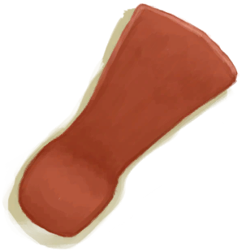
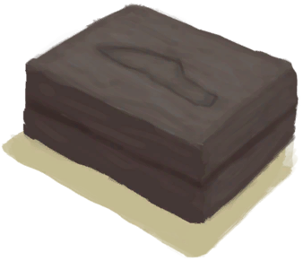

# Advanced Kiln  
> Can fire clay in here once it has reached a high enough temperature.  
  
<table class="table table-bordered" data-toggle="table"  data-show-header="false"><thead style="display:none"><tr ><th  style="width:50%;text-align:left;vertical-align:top;"  >title</th><th  style="width:50%;text-align:left;vertical-align:top;"  ></th></tr></thead><tr ><td  style="width:50%;text-align:left;vertical-align:top;"  >** Cannot Be Trashed **  **Weight：**2500  **Tag：**	[“Fire Source”](tag_FireSource.md)  **Slots：**6  **过滤器：**[“Clay”](tag_Clay.md)  ** Effect: ** [

[Cold Insulation](InsulationCold.md)](InsulationCold.md)<b>+5</b></td><td  style="width:50%;text-align:left;vertical-align:top;"  >

<a href="KilnAdvanced.md" style="color:black">Advanced Kiln</a>

"An advanced earthen kiln used mainly for firing Clay. It heats up faster</td></tr></tbody></table>  
  
## Got From  

** With：**[Lit Tinder](TinderLit.md)Light Fire

[Advanced Kiln(Off)](KilnAdvancedExtinguished.md)

  
  
## Drag With  

<table style="margin-bottom:0px;"><tr><td style="width:40%;text-align:left; background-color:#FEFEFE"><b>With：</b>[

[Coconut Shell](CoconutShell.md)](CoconutShell.md)</td><td style="width:40%;font-size:1em;font-weight:bold;background-color:#FEFEFE">Feed Coconut  </td></tr><tr style="background-color:#FFFFFF"><td style=""><b>Receiving：</b>→Dismiss</td><td style=""><b>Self：</b>Fuel  <b>+3(3.13%)</b></td></tr></table>
  

<table style="margin-bottom:0px;"><tr><td style="width:40%;text-align:left; background-color:#FEFEFE"><b>With：</b>[

[Wood](Wood.md)](Wood.md)</td><td style="width:40%;font-size:1em;font-weight:bold;background-color:#FEFEFE">Feed Firewood  </td></tr><tr style="background-color:#FFFFFF"><td style=""><b>Receiving：</b>→Dismiss</td><td style=""><b>Self：</b>Fuel  <b>+28(29.17%)</b></td></tr></table>
  

<table style="margin-bottom:0px;"><tr><td style="width:40%;text-align:left; background-color:#FEFEFE"><b>With：</b>[“Fuel”](tag_Fuel.md)</td><td style="width:40%;font-size:1em;font-weight:bold;background-color:#FEFEFE">Feed Fuel  </td></tr><tr style="background-color:#FFFFFF"><td style=""><b>Receiving：</b>→Dismiss</td><td style=""><b>Self：</b>Fuel  <b>+7(7.29%)</b></td></tr></table>
  

<table style="margin-bottom:0px;"><tr><td style="width:40%;text-align:left; background-color:#FEFEFE"><b>With：</b>[

[Charcoal](Charcoal.md)](Charcoal.md)</td><td style="width:40%;font-size:1em;font-weight:bold;background-color:#FEFEFE">Feed Charcoal  </td></tr><tr style="background-color:#FFFFFF"><td style=""><b>Receiving：</b>→Dismiss</td><td style=""><b>Self：</b>Fuel  <b>+16(16.67%)</b></td></tr></table>
  

<table style="margin-bottom:0px;"><tr><td style="width:40%;text-align:left; background-color:#FEFEFE"><b>With：</b>[

[Embers](Embers.md)](Embers.md)</td><td style="width:40%;font-size:1em;font-weight:bold;background-color:#FEFEFE">Feed Embers  </td></tr><tr style="background-color:#FFFFFF"><td style=""><b>Receiving：</b>→Dismiss</td><td style=""><b>Self：</b>Fuel  <b>+16(16.67%)</b></td></tr></table>
  

<table style="margin-bottom:0px;"><tr><td style="width:40%;text-align:left; background-color:#FEFEFE"><b>With：</b>[“Tinder”](tag_Tinder.md)</td><td style="width:40%;font-size:1em;font-weight:bold;background-color:#FEFEFE">Light Tinder  </td></tr><tr style="background-color:#FFFFFF"><td style=""><b>Receiving：</b>→ [

[Lit Tinder](TinderLit.md)](TinderLit.md)</td><td style=""><b>Self：</b></td></tr></table>
  

<table style="margin-bottom:0px;"><tr><td style="width:40%;text-align:left; background-color:#FEFEFE"><b>With：</b>[“Leaves”](tag_Leaves.md)</td><td style="width:40%;font-size:1em;font-weight:bold;background-color:#FEFEFE">Feed Leaves  </td></tr><tr style="background-color:#FFFFFF"><td style=""><b>Receiving：</b>→Dismiss</td><td style=""><b>Self：</b>Fuel  <b>+2(2.08%)</b></td></tr></table>
  

<table style="margin-bottom:0px;"><tr><td style="width:40%;text-align:left; background-color:#FEFEFE"><b>With：</b>[

[Bellows](Bellows.md)](Bellows.md)</td><td style="width:40%;font-size:1em;font-weight:bold;background-color:#FEFEFE">Increase Temperature (30m) </td></tr><tr style="background-color:#FFFFFF"><td style=""><b>Receiving：</b>Usage  <b>-1(-3.33%)</b></td><td style=""><b>Self：</b>Temperature

  <b>+300(25%)</b></td></tr></table>
  
  
## Drag To  

[Feathers](Feathers.md)

[Fibers](Fibers.md)

[Dry Leaves](LeavesDry.md)

[Nest](Nest.md)

[Papers](Papers.md)

[Bee Smoker(Off)](BeeSmokerOff.md)

[Citronella Candle(Off)](CandleCitronellaOff.md)

[Jasmine Candle(Off)](CandleJasmineOff.md)

[Candle(Off)](CandleOff.md)

[Dynamite(Off)](DynamiteOff.md)

[Wood Shavings](WoodShavings.md)

  
  
## Transform  

<table style="margin-bottom:0px;"><tr><td  colspan=2 style="font-size:1em;font-weight:bold;background-color:#FEFEFE">Alembic</td><td style="text-align:right; background-color:#FEFEFE"></td></tr><tr style="background-color:#FFFFFF"><td style="width:30%;font-size:1em;text-align:right;vertical-align:middle;">[

[Unfired Alembic](AlembicUnfired.md)](AlembicUnfired.md)</td><td style="text-align:center;width:20%;vertical-align:middle;">
5h

Alembic
</td><td style="text-align:left;vertical-align:middle;">[

[Alembic](AlembicUndeployed.md)](AlembicUndeployed.md)(<b>+1</b>)</td></tr><tr style="text-align:left;background-color:#FEFEFE"><td colspan="3"><b></b>** Require Durability：** Temperature

: <b>800～3000(66.67%～250%)</b></td></tr></table>
  

<table style="margin-bottom:0px;"><tr><td  colspan=2 style="font-size:1em;font-weight:bold;background-color:#FEFEFE">Burn Brimstone Heavy Stone</td><td style="text-align:right; background-color:#FEFEFE"></td></tr><tr style="background-color:#FFFFFF"><td style="width:30%;font-size:1em;text-align:right;vertical-align:middle;">[

[Sulphurous Stone](StoneHeavyBrimstone.md)](StoneHeavyBrimstone.md)</td><td style="text-align:center;width:20%;vertical-align:middle;">
8h

Burn Brimstone Heavy Stone
</td><td style="text-align:left;vertical-align:middle;">[

[Brimstone](Brimstone.md)](Brimstone.md)(<b>+1</b>)</td></tr><tr style="text-align:left;background-color:#FEFEFE"><td colspan="3"><b></b>** Require Durability：** Temperature

: <b>900～3000(75%～250%)</b></td></tr></table>
  

<table style="margin-bottom:0px;"><tr><td  colspan=2 style="font-size:1em;font-weight:bold;background-color:#FEFEFE">Burn Heavy Stone</td><td style="text-align:right; background-color:#FEFEFE"></td></tr><tr style="background-color:#FFFFFF"><td style="width:30%;font-size:1em;text-align:right;vertical-align:middle;">[

[Heavy Stone](StoneHeavy.md)](StoneHeavy.md)</td><td style="text-align:center;width:20%;vertical-align:middle;">
8h

Burn Heavy Stone
</td><td style="text-align:left;vertical-align:middle;">[

[Burnt Heavy Stone](StoneHeavyBurnt.md)](StoneHeavyBurnt.md)(<b>+1</b>)</td></tr><tr style="text-align:left;background-color:#FEFEFE"><td colspan="3"><b></b>** Require Durability：** Temperature

: <b>900～3000(75%～250%)</b></td></tr></table>
  

<table style="margin-bottom:0px;"><tr><td  colspan=2 style="font-size:1em;font-weight:bold;background-color:#FEFEFE">Burn Mortar</td><td style="text-align:right; background-color:#FEFEFE"></td></tr><tr style="background-color:#FFFFFF"><td style="width:30%;font-size:1em;text-align:right;vertical-align:middle;">[

[Dry Mortar](MortarDry.md)](MortarDry.md)</td><td style="text-align:center;width:20%;vertical-align:middle;">
8h

Burn Mortar
</td><td style="text-align:left;vertical-align:middle;">[

[Burnt Mortar](MortarBurnt.md)](MortarBurnt.md)(<b>+1</b>)</td></tr><tr style="text-align:left;background-color:#FEFEFE"><td colspan="3"><b></b>** Require Durability：** Temperature

: <b>900～3000(75%～250%)</b></td></tr></table>
  

<table style="margin-bottom:0px;"><tr><td  colspan=2 style="font-size:1em;font-weight:bold;background-color:#FEFEFE">Burn Stone</td><td style="text-align:right; background-color:#FEFEFE"></td></tr><tr style="background-color:#FFFFFF"><td style="width:30%;font-size:1em;text-align:right;vertical-align:middle;">[

[Stone](Stone.md)](Stone.md) [

[Sharpened Stone](StoneSharpened.md)](StoneSharpened.md)</td><td style="text-align:center;width:20%;vertical-align:middle;">
8h

Burn Stone
</td><td style="text-align:left;vertical-align:middle;">[

[Burnt Stone](StoneBurnt.md)](StoneBurnt.md)(<b>+1</b>)</td></tr><tr style="text-align:left;background-color:#FEFEFE"><td colspan="3"><b></b>** Require Durability：** Temperature

: <b>900～3000(75%～250%)</b></td></tr></table>
  

<table style="margin-bottom:0px;"><tr><td  colspan=2 style="font-size:1em;font-weight:bold;background-color:#FEFEFE">Clay Pot Cooler</td><td style="text-align:right; background-color:#FEFEFE"></td></tr><tr style="background-color:#FFFFFF"><td style="width:30%;font-size:1em;text-align:right;vertical-align:middle;">[

[Unfired Clay Pot Cooler](ClayPotCoolerUnfired.md)](ClayPotCoolerUnfired.md)</td><td style="text-align:center;width:20%;vertical-align:middle;">
6h

Clay Pot Cooler
</td><td style="text-align:left;vertical-align:middle;">[

[Clay Pot Cooler](ClayPotCoolerUndeployed.md)](ClayPotCoolerUndeployed.md)(<b>+1</b>)</td></tr><tr style="text-align:left;background-color:#FEFEFE"><td colspan="3"><b></b>** Require Durability：** Temperature

: <b>800～3000(66.67%～250%)</b></td></tr></table>
  

<table style="margin-bottom:0px;"><tr><td  colspan=2 style="font-size:1em;font-weight:bold;background-color:#FEFEFE">Fire Bee Smoker</td><td style="text-align:right; background-color:#FEFEFE"></td></tr><tr style="background-color:#FFFFFF"><td style="width:30%;font-size:1em;text-align:right;vertical-align:middle;">[

[Unfired Bee Smoker](BeeSmokerUnfired.md)](BeeSmokerUnfired.md)</td><td style="text-align:center;width:20%;vertical-align:middle;">
3h

Fire Bee Smoker
</td><td style="text-align:left;vertical-align:middle;">[

[Bee Smoker(Off)](BeeSmokerOff.md)](BeeSmokerOff.md)(<b>+1</b>)</td></tr><tr style="text-align:left;background-color:#FEFEFE"><td colspan="3"><b></b>** Require Durability：** Temperature

: <b>600～3000(50%～250%)</b></td></tr></table>
  

<table style="margin-bottom:0px;"><tr><td  colspan=2 style="font-size:1em;font-weight:bold;background-color:#FEFEFE">Fire Clay Bowl</td><td style="text-align:right; background-color:#FEFEFE"></td></tr><tr style="background-color:#FFFFFF"><td style="width:30%;font-size:1em;text-align:right;vertical-align:middle;">[

[Unfired Clay Bowl](ClayBowlUnfired.md)](ClayBowlUnfired.md)</td><td style="text-align:center;width:20%;vertical-align:middle;">
4h

Fire Clay Bowl
</td><td style="text-align:left;vertical-align:middle;">[

[Clay Bowl](ClayBowl.md)](ClayBowl.md)(<b>+1</b>)</td></tr></table>
  

<table style="margin-bottom:0px;"><tr><td  colspan=2 style="font-size:1em;font-weight:bold;background-color:#FEFEFE">Fire Clay Fire Pit</td><td style="text-align:right; background-color:#FEFEFE"></td></tr><tr style="background-color:#FFFFFF"><td style="width:30%;font-size:1em;text-align:right;vertical-align:middle;">[

[Unfired Clay Fire Pit](ClayFirePitUnfired.md)](ClayFirePitUnfired.md)</td><td style="text-align:center;width:20%;vertical-align:middle;">
4h

Fire Clay Fire Pit
</td><td style="text-align:left;vertical-align:middle;">[

[Clay Fire Pit(Off)](ClayFirePitExtinguished.md)](ClayFirePitExtinguished.md)(<b>+1</b>)</td></tr><tr style="text-align:left;background-color:#FEFEFE"><td colspan="3"><b></b>** Require Durability：** Temperature

: <b>600～3000(50%～250%)</b></td></tr></table>
  

<table style="margin-bottom:0px;"><tr><td  colspan=2 style="font-size:1em;font-weight:bold;background-color:#FEFEFE">Fire Clay Jar</td><td style="text-align:right; background-color:#FEFEFE"></td></tr><tr style="background-color:#FFFFFF"><td style="width:30%;font-size:1em;text-align:right;vertical-align:middle;">[

[Unfired Clay Jar](ClayJarUnfired.md)](ClayJarUnfired.md)</td><td style="text-align:center;width:20%;vertical-align:middle;">
3h

Fire Clay Jar
</td><td style="text-align:left;vertical-align:middle;">[

[Clay Jar](ClayJar.md)](ClayJar.md)(<b>+1</b>)</td></tr><tr style="text-align:left;background-color:#FEFEFE"><td colspan="3"><b></b>** Require Durability：** Temperature

: <b>600～3000(50%～250%)</b></td></tr></table>
  

<table style="margin-bottom:0px;"><tr><td  colspan=2 style="font-size:1em;font-weight:bold;background-color:#FEFEFE">Fire Clay Vase</td><td style="text-align:right; background-color:#FEFEFE"></td></tr><tr style="background-color:#FFFFFF"><td style="width:30%;font-size:1em;text-align:right;vertical-align:middle;">[

[Unfired Clay Vase](ClayVaseUnfired.md)](ClayVaseUnfired.md)</td><td style="text-align:center;width:20%;vertical-align:middle;">
4h

Fire Clay Vase
</td><td style="text-align:left;vertical-align:middle;">[

[Clay Vase](ClayVase.md)](ClayVase.md)(<b>+1</b>)</td></tr><tr style="text-align:left;background-color:#FEFEFE"><td colspan="3"><b></b>** Require Durability：** Temperature

: <b>600～3000(50%～250%)</b></td></tr></table>
  

<table style="margin-bottom:0px;"><tr><td  colspan=2 style="font-size:1em;font-weight:bold;background-color:#FEFEFE">Fire Cooking Pot</td><td style="text-align:right; background-color:#FEFEFE"></td></tr><tr style="background-color:#FFFFFF"><td style="width:30%;font-size:1em;text-align:right;vertical-align:middle;">[

[Unfired Cooking Pot](CookingPotUnfired.md)](CookingPotUnfired.md)</td><td style="text-align:center;width:20%;vertical-align:middle;">
4h

Fire Cooking Pot
</td><td style="text-align:left;vertical-align:middle;">[

[Cooking Pot](CookingPot.md)](CookingPot.md)(<b>+1</b>)</td></tr><tr style="text-align:left;background-color:#FEFEFE"><td colspan="3"><b></b>** Require Durability：** Temperature

: <b>600～3000(50%～250%)</b></td></tr></table>
  

<table style="margin-bottom:0px;"><tr><td  colspan=2 style="font-size:1em;font-weight:bold;background-color:#FEFEFE">Fire Glazed Vase</td><td style="text-align:right; background-color:#FEFEFE"></td></tr><tr style="background-color:#FFFFFF"><td style="width:30%;font-size:1em;text-align:right;vertical-align:middle;">[

[Unfired Glazed Vase](GlazedVaseUnfired.md)](GlazedVaseUnfired.md)</td><td style="text-align:center;width:20%;vertical-align:middle;">
4h

Fire Glazed Vase
</td><td style="text-align:left;vertical-align:middle;">[

[Glazed Vase](GlazedVase.md)](GlazedVase.md)(<b>+1</b>)</td></tr><tr style="text-align:left;background-color:#FEFEFE"><td colspan="3"><b></b>** Require Durability：** Temperature

: <b>800～3000(66.67%～250%)</b></td></tr></table>
  

<table style="margin-bottom:0px;"><tr><td  colspan=2 style="font-size:1em;font-weight:bold;background-color:#FEFEFE">Make Charcoal</td><td style="text-align:right; background-color:#FEFEFE"></td></tr><tr style="background-color:#FFFFFF"><td style="width:30%;font-size:1em;text-align:right;vertical-align:middle;">[

[Wood](Wood.md)](Wood.md)</td><td style="text-align:center;width:20%;vertical-align:middle;">
4h

Make Charcoal
</td><td style="text-align:left;vertical-align:middle;">[

[Charcoal](Charcoal.md)](Charcoal.md)(<b>+1</b>)</td></tr><tr style="text-align:left;background-color:#FEFEFE"><td colspan="3"><b></b>** Require Durability：** Temperature

: <b>400～3000(33.33%～250%)</b></td></tr></table>
  

<table style="margin-bottom:0px;"><tr><td  colspan=2 style="font-size:1em;font-weight:bold;background-color:#FEFEFE">Make Quicklime</td><td style="text-align:right; background-color:#FEFEFE"></td></tr><tr style="background-color:#FFFFFF"><td style="width:30%;font-size:1em;text-align:right;vertical-align:middle;">[

[Conch](Conch.md)](Conch.md) [

[Crushed Conch](ConchBroken.md)](ConchBroken.md) [

[Pretty Seashells](SeashellsPretty.md)](SeashellsPretty.md)</td><td style="text-align:center;width:20%;vertical-align:middle;">
4h

Make Quicklime
</td><td style="text-align:left;vertical-align:middle;">[

[Quicklime](Quicklime.md)](Quicklime.md)(<b>+1</b>)</td></tr><tr style="text-align:left;background-color:#FEFEFE"><td colspan="3"><b></b>** Require Durability：** Temperature

: <b>900～3000(75%～250%)</b></td></tr></table>
  

<table style="margin-bottom:0px;"><tr><td  colspan=2 style="font-size:1em;font-weight:bold;background-color:#FEFEFE">Make Vitriol</td><td style="text-align:right; background-color:#FEFEFE"></td></tr><tr style="background-color:#FFFFFF"><td style="width:30%;font-size:1em;text-align:right;vertical-align:middle;">[

[Vitriol Mix](LQ_VitriolMix.md)](LQ_VitriolMix.md)</td><td style="text-align:center;width:20%;vertical-align:middle;">
2h

Make Vitriol
</td><td style="text-align:left;vertical-align:middle;">→ [

[Vitriol](LQ_Vitriol.md)](LQ_Vitriol.md)</td></tr><tr style="text-align:left;background-color:#FEFEFE"><td colspan="3"><b></b>** Require Durability：** Temperature

: <b>200～3000(16.67%～250%)</b></td></tr></table>
  

<table style="margin-bottom:0px;"><tr><td  colspan=2 style="font-size:1em;font-weight:bold;background-color:#FEFEFE">Smelt Axe Head</td><td style="text-align:right; background-color:#FEFEFE">[

[Metalworking(Skill)](Skill_Metalworking.md)](Skill_Metalworking.md)<b>+2</b></td></tr><tr style="background-color:#FFFFFF"><td style="width:30%;font-size:1em;text-align:right;vertical-align:middle;">[

[Axe Mold](MoldAxe.md)](MoldAxe.md)</td><td style="text-align:center;width:20%;vertical-align:middle;">
6h

Smelt Axe Head
</td><td style="text-align:left;vertical-align:middle;">[

[Axe Head](AxeHead.md)](AxeHead.md)(<b>+1</b>)</td></tr><tr style="text-align:left;background-color:#FEFEFE"><td colspan="3"><b></b>** Require Durability：** Temperature

: <b>1100～3000(91.67%～250%)</b></td></tr></table>
  

<table style="margin-bottom:0px;"><tr><td  colspan=2 style="font-size:1em;font-weight:bold;background-color:#FEFEFE">Smelt Knife</td><td style="text-align:right; background-color:#FEFEFE"></td></tr><tr style="background-color:#FFFFFF"><td style="width:30%;font-size:1em;text-align:right;vertical-align:middle;">[

[Knife Mold](MoldKnife.md)](MoldKnife.md)</td><td style="text-align:center;width:20%;vertical-align:middle;">
6h

Smelt Knife
</td><td style="text-align:left;vertical-align:middle;">[

[Copper Knife](KnifeCopper.md)](KnifeCopper.md)(<b>+1</b>)</td></tr><tr style="text-align:left;background-color:#FEFEFE"><td colspan="3"><b></b>** Require Durability：** Temperature

: <b>1100～3000(91.67%～250%)</b></td></tr></table>
  

<table style="margin-bottom:0px;"><tr><td  colspan=2 style="font-size:1em;font-weight:bold;background-color:#FEFEFE">Smelt Shovel Head</td><td style="text-align:right; background-color:#FEFEFE"></td></tr><tr style="background-color:#FFFFFF"><td style="width:30%;font-size:1em;text-align:right;vertical-align:middle;">[

[Shovel Mold](MoldShovel.md)](MoldShovel.md)</td><td style="text-align:center;width:20%;vertical-align:middle;">
6h

Smelt Shovel Head
</td><td style="text-align:left;vertical-align:middle;">[

[Shovel Head](ShovelHead.md)](ShovelHead.md)(<b>+1</b>)</td></tr><tr style="text-align:left;background-color:#FEFEFE"><td colspan="3"><b></b>** Require Durability：** Temperature

: <b>1100～3000(91.67%～250%)</b></td></tr></table>
  

<table style="margin-bottom:0px;"><tr><td  colspan=2 style="font-size:1em;font-weight:bold;background-color:#FEFEFE">Smelt Spear Head</td><td style="text-align:right; background-color:#FEFEFE"></td></tr><tr style="background-color:#FFFFFF"><td style="width:30%;font-size:1em;text-align:right;vertical-align:middle;">[

[Spear Mold](MoldSpear.md)](MoldSpear.md)</td><td style="text-align:center;width:20%;vertical-align:middle;">
6h

Smelt Spear Head
</td><td style="text-align:left;vertical-align:middle;">[

[Spear Head](SpearHead.md)](SpearHead.md)(<b>+1</b>)</td></tr><tr style="text-align:left;background-color:#FEFEFE"><td colspan="3"><b></b>** Require Durability：** Temperature

: <b>1100～3000(91.67%～250%)</b></td></tr></table>
  

<table style="margin-bottom:0px;"><tr><td  colspan=2 style="font-size:1em;font-weight:bold;background-color:#FEFEFE">Smelt Copper</td><td style="text-align:right; background-color:#FEFEFE">[

[Metalworking(Skill)](Skill_Metalworking.md)](Skill_Metalworking.md)<b>+1</b></td></tr><tr style="background-color:#FFFFFF"><td style="width:30%;font-size:1em;text-align:right;vertical-align:middle;">[

[Copper Ore](CopperOre.md)](CopperOre.md)</td><td style="text-align:center;width:20%;vertical-align:middle;">
8h

Smelt Copper
</td><td style="text-align:left;vertical-align:middle;">[

[Copper](Copper.md)](Copper.md)(<b>+1</b>)</td></tr><tr style="text-align:left;background-color:#FEFEFE"><td colspan="3"><b></b>** Require Durability：** Temperature

: <b>1100～3000(91.67%～250%)</b></td></tr></table>
  

<table style="margin-bottom:0px;"><tr><td  colspan=2 style="font-size:1em;font-weight:bold;background-color:#FEFEFE">Smelt Small Tool</td><td style="text-align:right; background-color:#FEFEFE">[

[Metalworking(Skill)](Skill_Metalworking.md)](Skill_Metalworking.md)<b>+1</b></td></tr><tr style="background-color:#FFFFFF"><td style="width:30%;font-size:1em;text-align:right;vertical-align:middle;">[“Small Copper Object”](tag_CopperSmall.md)</td><td style="text-align:center;width:20%;vertical-align:middle;">
8h

Smelt Small Tool
</td><td style="text-align:left;vertical-align:middle;">[

[Copper](Copper.md)](Copper.md)(<b>+2</b>)</td></tr><tr style="text-align:left;background-color:#FEFEFE"><td colspan="3"><b></b>** Require Durability：** Temperature

: <b>1100～3000(91.67%～250%)</b></td></tr></table>
  

<table style="margin-bottom:0px;"><tr><td  colspan=2 style="font-size:1em;font-weight:bold;background-color:#FEFEFE">Smelt Large Tool</td><td style="text-align:right; background-color:#FEFEFE">[

[Metalworking(Skill)](Skill_Metalworking.md)](Skill_Metalworking.md)<b>+1</b></td></tr><tr style="background-color:#FFFFFF"><td style="width:30%;font-size:1em;text-align:right;vertical-align:middle;">[“Big Copper Object”](tag_CopperBig.md)</td><td style="text-align:center;width:20%;vertical-align:middle;">
8h

Smelt Large Tool
</td><td style="text-align:left;vertical-align:middle;">[

[Copper](Copper.md)](Copper.md)(<b>+5</b>)</td></tr><tr style="text-align:left;background-color:#FEFEFE"><td colspan="3"><b></b>** Require Durability：** Temperature

: <b>1100～3000(91.67%～250%)</b></td></tr></table>
  

<table style="margin-bottom:0px;"><tr><td  colspan=2 style="font-size:1em;font-weight:bold;background-color:#FEFEFE">Decoration</td><td style="text-align:right; background-color:#FEFEFE">[

[Metalworking(Skill)](Skill_Metalworking.md)](Skill_Metalworking.md)<b>+1</b></td></tr><tr style="background-color:#FFFFFF"><td style="width:30%;font-size:1em;text-align:right;vertical-align:middle;">[

[Decoration Mold](MoldCopperDecoration.md)](MoldCopperDecoration.md)</td><td style="text-align:center;width:20%;vertical-align:middle;">
6h

Decoration
</td><td style="text-align:left;vertical-align:middle;">[

[Copper Decoration](CopperDecoration_Mold.md)](CopperDecoration_Mold.md)(<b>+1</b>)</td></tr><tr style="text-align:left;background-color:#FEFEFE"><td colspan="3"><b></b>** Require Durability：** Temperature

: <b>1100～3000(91.67%～250%)</b></td></tr></table>
  
## Durability   

<table style="margin-bottom:0px;"><tr><td style="width:30%;text-align:left; background-color:#FEFEFE;font-size:1.3em;font-weight:bold;">

Temperature</td><td style="font-size:1em;background-color:#FEFEFE">Starting：0 , Max：1200 +16/TP , Duration ：18h45m</td></tr><tr style="background-color:#FFFFFF"><td colspan=2></td></tr></table>
  

<table style="margin-bottom:0px;"><tr><td style="width:30%;text-align:left; background-color:#FEFEFE;font-size:1.3em;font-weight:bold;">Fuel</td><td style="font-size:1em;background-color:#FEFEFE">Starting：32 , Max：96 -1/TP , Duration ：1d</td></tr><tr style="background-color:#FFFFFF"><td colspan=2>** On Zero： ** Self: → [

[Advanced Kiln(Off)](KilnAdvancedExtinguished.md)](KilnAdvancedExtinguished.md) [

[Ash](Ash.md)](Ash.md)(<b>+1</b>), [

[Charcoal](Charcoal.md)](Charcoal.md)(<b>+0～+1</b>)</td></tr></table>
  

