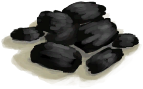

# Kiln  
> I should be able to relight it with some lit tinder.  
  
<table class="table table-bordered" data-toggle="table"  data-show-header="false"><thead style="display:none"><tr ><th  style="width:50%;text-align:left;vertical-align:top;"  >title</th><th  style="width:50%;text-align:left;vertical-align:top;"  ></th></tr></thead><tr ><td  style="width:50%;text-align:left;vertical-align:top;"  >** Cannot Be Trashed **  **Weight：**2500  **Slots：**3  **过滤器：**[“Clay”](tag_Clay.md) , [“Seashell”](tag_Seashell.md) , [“Big Copper Object”](tag_CopperBig.md) , [“Small Copper Object”](tag_CopperSmall.md)</td><td  style="width:50%;text-align:left;vertical-align:top;"  >

<a href="KilnExtinguished.md" style="color:black">Kiln</a>

"A basic earthen kiln used mainly for firing Clay. Once lit it will start increasing its temperature and once hot enough any materials inside will start being processed.  To <b>build</b> one you will first need to make <b>Mud Bricks</b></td></tr></tbody></table>  
  
## Got From  

Transform

[Kiln](Kiln.md)

Craft BluePrint

[Kiln(BluePrint)](Bp_Kiln.md)

Exit

[Exit(Mud Hut)](MudHutExitRuins.md)

  
  
## Action  

<table><tr><td rowspan="2" style="width:200px;text-align:center;font-size:1.3em;font-weight:bold">

Demolish

2h

</td><td>[“ClimbAction(Group)”](ClimbAction.md)</td></tr><tr><td><b>Self：</b>→Dismiss</td></tr><tr><td colspan="2">[

[Dirt Pile](DirtPile.md)](DirtPile.md)(<b>+14</b>)</td></tr></table>
  
  
  
## Drag With  

<table style="margin-bottom:0px;"><tr><td style="width:40%;text-align:left; background-color:#FEFEFE"><b>With：</b>[

[Coconut Shell](CoconutShell.md)](CoconutShell.md)</td><td style="width:40%;font-size:1em;font-weight:bold;background-color:#FEFEFE">Feed Coconut  </td></tr><tr style="background-color:#FFFFFF"><td style=""><b>Receiving：</b>→Dismiss</td><td style=""><b>Self：</b>Fuel  <b>+3(3.13%)</b></td></tr></table>
  

<table style="margin-bottom:0px;"><tr><td style="width:40%;text-align:left; background-color:#FEFEFE"><b>With：</b>[

[Wood](Wood.md)](Wood.md)</td><td style="width:40%;font-size:1em;font-weight:bold;background-color:#FEFEFE">Feed Firewood  </td></tr><tr style="background-color:#FFFFFF"><td style=""><b>Receiving：</b>→Dismiss</td><td style=""><b>Self：</b>Fuel  <b>+28(29.17%)</b></td></tr></table>
  

<table style="margin-bottom:0px;"><tr><td style="width:40%;text-align:left; background-color:#FEFEFE"><b>With：</b>[“Fuel”](tag_Fuel.md)</td><td style="width:40%;font-size:1em;font-weight:bold;background-color:#FEFEFE">Feed Fuel  </td></tr><tr style="background-color:#FFFFFF"><td style=""><b>Receiving：</b>→Dismiss</td><td style=""><b>Self：</b>Fuel  <b>+7(7.29%)</b></td></tr></table>
  

<table style="margin-bottom:0px;"><tr><td style="width:40%;text-align:left; background-color:#FEFEFE"><b>With：</b>[

[Charcoal](Charcoal.md)](Charcoal.md)</td><td style="width:40%;font-size:1em;font-weight:bold;background-color:#FEFEFE">Feed Charcoal  </td></tr><tr style="background-color:#FFFFFF"><td style=""><b>Receiving：</b>→Dismiss</td><td style=""><b>Self：</b>Fuel  <b>+25(26.04%)</b></td></tr></table>
  

<table style="margin-bottom:0px;"><tr><td style="width:40%;text-align:left; background-color:#FEFEFE"><b>With：</b>[“Leaves”](tag_Leaves.md)</td><td style="width:40%;font-size:1em;font-weight:bold;background-color:#FEFEFE">Feed Leaves  </td></tr><tr style="background-color:#FFFFFF"><td style=""><b>Receiving：</b>→Dismiss</td><td style=""><b>Self：</b>Fuel  <b>+2(2.08%)</b></td></tr></table>
  

<table style="margin-bottom:0px;"><tr><td style="width:40%;text-align:left; background-color:#FEFEFE"><b>With：</b>[

[Lit Tinder](TinderLit.md)](TinderLit.md)</td><td style="width:40%;font-size:1em;font-weight:bold;background-color:#FEFEFE">Light Fire  </td></tr><tr style="background-color:#FFFFFF"><td style=""><b>Receiving：</b>→Dismiss</td><td style=""><b>Self：</b>→ [

[Kiln](Kiln.md)](Kiln.md), Fuel  <b>+1(1.04%)</b></td></tr></table>
  

<table style="margin-bottom:0px;"><tr><td style="width:40%;text-align:left; background-color:#FEFEFE"><b>With：</b>[

[Dry Leaves](LeavesDry.md)](LeavesDry.md) | [

[Fibers](Fibers.md)](Fibers.md)</td><td style="width:40%;font-size:1em;font-weight:bold;background-color:#FEFEFE">Feed Tinder  </td></tr><tr style="background-color:#FFFFFF"><td style=""><b>Receiving：</b>→Dismiss</td><td style=""><b>Self：</b>Fuel  <b>+1(1.04%)</b></td></tr></table>
  
  
## Durability   

<table style="margin-bottom:0px;"><tr><td style="width:30%;text-align:left; background-color:#FEFEFE;font-size:1.3em;font-weight:bold;">

Temperature</td><td style="font-size:1em;background-color:#FEFEFE">Starting：0 , Max：800 -8/TP , Duration ：1d1h</td></tr><tr style="background-color:#FFFFFF"><td colspan=2></td></tr></table>
  

<table style="margin-bottom:0px;"><tr><td style="width:30%;text-align:left; background-color:#FEFEFE;font-size:1.3em;font-weight:bold;">Fuel</td><td style="font-size:1em;background-color:#FEFEFE">Starting：0 , Max：96 -</td></tr><tr style="background-color:#FFFFFF"><td colspan=2></td></tr></table>
  

