# Military Knife  
> A sturdy military knife. A very useful tool. Can sharpen it again when it becomes blunt.  
  
<table class="table table-bordered" data-toggle="table"  data-show-header="false"><thead style="display:none"><tr ><th  style="width:50%;text-align:left;vertical-align:top;"  >title</th><th  style="width:50%;text-align:left;vertical-align:top;"  ></th></tr></thead><tr ><td  style="width:50%;text-align:left;vertical-align:top;"  >**Weight：**100  **Tag：**	[“Scraper”](tag_Scraper.md), [“Cutter”](tag_Cutter.md), [“Cutter Advanced”](tag_CutterAdv.md), [“Hammer”](tag_Hammer.md), [“Military”](tag_Military.md), [“Heavy”](tag_Heavy.md), [“Pretty”](tag_Pretty.md)  **Usage：**60</td><td  style="width:50%;text-align:left;vertical-align:top;"  >

<a href="KnifeMilitary.md" style="color:black">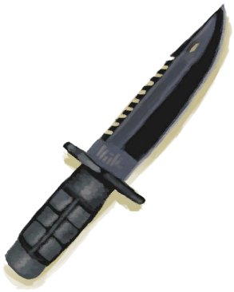Military Knife</a>

</td></tr></tbody></table>  
  
## Got From  

Open

[Supply Capsule](TV_SupplyCapsule.md)

** With：**[Stone](Stone.md)Sharpen

[Military Knife](KnifeMilitary.md)

** With：**[Stone](Stone.md) , [Heavy Stone](StoneHeavy.md)Sharpen

[Blunt Knife](KnifeMilitaryBlunt.md)

Perk Effect

[Military](Pk_2_Military.md)

Perk Effect

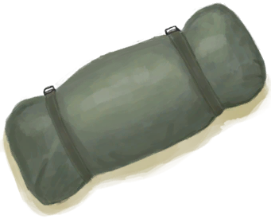
[Survivalist](Pk_2_Survivalist.md)

  
  
## Drag With  

<table style="margin-bottom:0px;"><tr><td style="width:40%;text-align:left; background-color:#FEFEFE"><b>With：</b>[

[Stone](Stone.md)](Stone.md)</td><td style="width:40%;font-size:1em;font-weight:bold;background-color:#FEFEFE">Sharpen (30m) [“HandAction(Group)”](HandAction.md)</td></tr><tr style="background-color:#FFFFFF"><td style=""><b>Receiving：</b></td><td style=""><b>Self：</b>→ [

[Military Knife](KnifeMilitary.md)](KnifeMilitary.md)</td></tr></table>
  
  
## Drag To  

[Tent](TentDeployed.md)

[Packed Tent](TentPacked.md)

[Copper Vein(High Chamber)](CopperVein.md)

[Dirt Pile](DirtPile.md)

[Stove(Off)](StoveExtinguished.md)

[Deflated Life Raft](LifeRaftDeflated.md)

[Mud Pile](MudPile.md)

[Deployed Parachute](ParachuteDeployed.md)

[Watering Trough](WateringTrough.md)

[Bone Splinters](BoneSplinters.md)

[Bones](Bones.md)

[Charcoal](Charcoal.md)

[Coconut](Coconut.md)

[Husked Coconut](CoconutHusked.md)

[Perforated Coconut](CoconutPerforated.md)

[Rotten Coconut](CoconutRotten.md)

[Conch](Conch.md)

[Copper Decoration](CopperDecoration_Mold.md)

[Feathers](Feathers.md)

[Unfinished  Bone Flute](FluteBone_Unfinished.md)

[Unfinished  Wooden Flute](FluteWooden_Unfinished.md)

[Bonefish](Bonefish.md)

[Cooked Bonefish](BonefishCooked.md)

[Bonefish Meat](BonefishMeat.md)

[Smoked Bonefish](BonefishSmoked.md)

[Trapped Macaque](CageTrapMacaque.md)

[Dried Chilies](ChiliesDried.md)

[Dead Cobra](CobraDead.md)

[Conch Meat](ConchMeat.md)

[Dried Fish](FishDried.md)

[Salted Fish](FishSalted.md)

[Drying Salted Fish](FishSaltedDrying.md)

[Ginger](Ginger.md)

[Dried Ginger](GingerDried.md)

[Goatfish](Goatfish.md)

[Cooked Goatfish](GoatfishCooked.md)

[Smoked Goatfish](GoatfishSmoked.md)

[Grouper](Grouper.md)

[Grouper Meat](GrouperMeat.md)

[Cooked Grouper](GrouperMeatCooked.md)

[Smoked Grouper](GrouperMeatSmoked.md)

[Herring](Herring.md)

[Cooked Herring](HerringCooked.md)

[Smoked Herring](HerringSmoked.md)

[Jasmine Flowers](JasmineFlowers.md)

[Kava Root](KavaRoot.md)

[Dried Kava Root](KavaRootDried.md)

[King Threadfin](KingThreadfin.md)

[Boar Carcass](BoarCarcass.md)

[Piglet Carcass](BoarCarcassPiglet.md)

[Sow](BoarEnclosureFemale.md)

[Boar](BoarEnclosureMale.md)

[Piglet](BoarEnclosurePiglet.md)

[Skinned Boar](BoarSkinned.md)

[Skinned Piglet](BoarSkinnedPiglet.md)

[Sow](BoarTiedFemale.md)

[Boar](BoarTiedMale.md)

[Piglet](BoarTiedPiglet.md)

[Dog Friend](DogFriend.md)

[Goat Carcass](GoatCarcassFemale.md)

[Juvenile Goat Carcass](GoatCarcassKid.md)

[Goat Carcass](GoatCarcassMale.md)

[Goat](GoatEnclosureFemale.md)

[Juvenile Goat](GoatEnclosureKid.md)

[Lactating Goat](GoatEnclosureLactating.md)

[Male Goat](GoatEnclosureMale.md)

[Skinned Goat](GoatSkinned.md)

[Skinned Kid](GoatSkinnedKid.md)

[Goat](GoatTiedFemale.md)

[Lactating Goat](GoatTiedFemaleLactating.md)

[Juvenile Goat](GoatTiedKid.md)

[Male Goat](GoatTiedMale.md)

[Macaque Friend](MacaqueFriend.md)

[Sea Hound Carcass](SeahoundCarcass.md)

[Shark Carcass](SharkCarcass.md)

[Lemongrass](LemongrassStalks.md)

[Macaque Carcass](MacaqueCarcass.md)

[Wounded Macaque](MacaqueWounded.md)

[Parrot Fish](ParrotFish.md)

[Cooked Parrot Fish](ParrotFishCooked.md)

[Smoked Parrot Fish](ParrotFishSmoked.md)

[Dead Partridge](PartridgeDead.md)

[Partridge](PartridgeFemaleEnclosure.md)

[Partridge](PartridgeFemaleLive.md)

[Male Partridge](PartridgeMaleEnclosure.md)

[Male Partridge](PartridgeMaleLive.md)

[Dead Sea Krait](SeaKraitDead.md)

[Dead Seagull](SeagullDead.md)

[Cooked Shark](SharkCooked.md)

[Shark Meat](SharkMeat.md)

[Smoked Shark](SharkSmoked.md)

[Snake Grass](SnakeGrass.md)

[Spider Lily Leaves](SpiderLilyLeaves.md)

[Dried Spider Lily Leaves](SpiderLilyLeavesDried.md)

[Cooked Threadfin](ThreadfinCooked.md)

[Threadfin Meat](ThreadfinMeat.md)

[Smoked Threadfin](ThreadfinSmoked.md)

[Yam](Yam.md)

[Geode](Geode.md)

[Giant Conch](GiantConch.md)

[Lizard Carcass](MonitorCarcass.md)

[Skinned Lizard](MonitorSkinned.md)

[Burnt Mortar](MortarBurnt.md)

[Mud Brick](MudBrick.md)

[Nipa Fruit](NipaFruit.md)

[Niter Crystals](NiterCrystals.md)

[Oyster](Oyster.md)

[Fresh Skin](SkinFresh.md)

[Fresh Reptile Skin](SkinFreshReptile.md)

[Long Stick](StickLong.md)

[Sticks](Sticks.md)

[Burnt Stone](StoneBurnt.md)

[Burnt Heavy Stone](StoneHeavyBurnt.md)

[Tropical Almonds](TropicalAlmonds.md)

[Boar Tusk](Tusk.md)

[Urchin](Urchin.md)

[Brimstone Vent(Volcano)](VentBrimstone.md)

[Weston](Weston.md)

[Wood](Wood.md)

[Unfinished Wood Carving](WoodCarving_Unfinished.md)

[Cinchona Tree](CinchonaTree.md)

[Narrow Passage(High Chamber)](CrystalChamberEntranceClosed.md)

[Narrow Passage(Damp Chamber)](DarkCaveCaveEntranceClosed.md)

[Narrow Passage(High Chamber)](DarkChamberCaveEntranceClosed.md)

[Narrow Passage(High Chamber)](FloodedChamberEntranceClosed.md)

[Narrow Passage(Tunnel)](HighChamberEntranceClosed.md)

[Nipa Palm](NipaPalm.md)

[Rice](RicePlant.md)

[Split Log](SagoSplitLog.md)

[Water Filter](WaterFilter.md)

  
  
## Use In BluePrint  

<a href="Bp_AloeGel.md" style="color:black">Aloe Gel</a>

<a href="Bp_Arrow.md" style="color:black">Arrows</a>

<a href="Bp_BedWooden.md" style="color:black">Wooden Bed</a>

<a href="Bp_BoneKnife.md" style="color:black">Bone Knife</a>

<a href="Bp_Bookshelf.md" style="color:black">Bookshelf</a>

<a href="Bp_Bow.md" style="color:black">Bow</a>

<a href="Bp_BowDrill.md" style="color:black">Bow Drill</a>

<a href="Bp_BrimstoneGel.md" style="color:black">Brimstone Gel</a>

<a href="Bp_BugRepellent.md" style="color:black">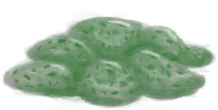Bug Repellant</a>

<a href="Bp_CeremonialDagger.md" style="color:black">Ceremonial Dagger</a>

<a href="Bp_Chair.md" style="color:black">Chair</a>

<a href="Bp_CopperSheet.md" style="color:black">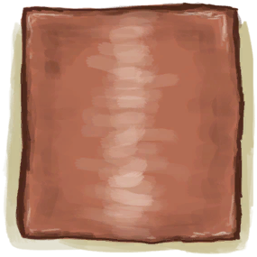Copper Sheet</a>

<a href="Bp_CopperShovel.md" style="color:black">Copper Shovel</a>

<a href="Bp_DeadfallTrap.md" style="color:black">Deadfall Trap</a>

<a href="Bp_Drum.md" style="color:black">Drum</a>

<a href="Bp_EatingUtensilsWooden.md" style="color:black">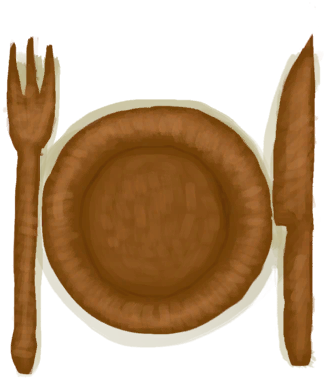Wooden Eating Utensils</a>

<a href="Bp_FishingSpear.md" style="color:black">Fishing Spear</a>

<a href="Bp_FlintAxe.md" style="color:black">Flint Axe</a>

<a href="Bp_FlintSpear.md" style="color:black">Flint Spear</a>

<a href="Bp_FluteBone.md" style="color:black">Bone Flute</a>

<a href="Bp_FluteWooden.md" style="color:black">Wooden Flute</a>

<a href="Bp_Glue.md" style="color:black">Glue</a>

<a href="Bp_HandDrill.md" style="color:black">Hand Drill</a>

<a href="Bp_Harpoon.md" style="color:black">Harpoon</a>

<a href="Bp_Honey.md" style="color:black">Honey</a>

<a href="Bp_LizardDrum.md" style="color:black">Lizard Drum</a>

<a href="Bp_LogTrap.md" style="color:black">Log Trap</a>

<a href="Bp_Mortar.md" style="color:black">Mortar</a>

<a href="Bp_ObsidianSpear.md" style="color:black">Obsidian Spear</a>

<a href="Bp_PesticideBrimstone.md" style="color:black">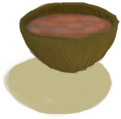Brimstone Pesticide</a>

<a href="Bp_Planks.md" style="color:black">Wooden Planks</a>

<a href="Bp_PotteryWheel.md" style="color:black">Pottery Wheel</a>

<a href="Bp_Quinine.md" style="color:black">Cinchona Powder</a>

<a href="Bp_RusticSpear.md" style="color:black">Rustic Spear</a>

<a href="Bp_ScrapAxe.md" style="color:black">Scrap Axe</a>

<a href="Bp_ScrapKnife.md" style="color:black">Scrap Knife</a>

<a href="Bp_ScrapShovel.md" style="color:black">Scrap Shovel</a>

<a href="Bp_Shelf.md" style="color:black">Shelf</a>

<a href="Bp_Shield.md" style="color:black">Shield</a>

<a href="Bp_SnareTrap.md" style="color:black">Snare Trap</a>

<a href="Bp_Spindle.md" style="color:black">Spindle</a>

<a href="Bp_Splint.md" style="color:black">Splint</a>

<a href="Bp_Table.md" style="color:black">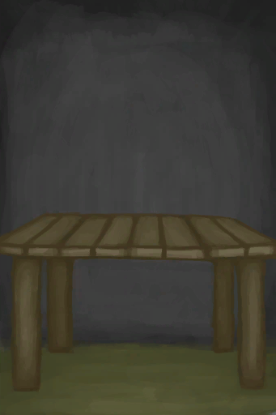Table</a>

<a href="Bp_Treenails.md" style="color:black">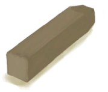Treenails</a>

<a href="Bp_Vitriol.md" style="color:black">Vitriol</a>

<a href="Bp_WoodCarvings.md" style="color:black">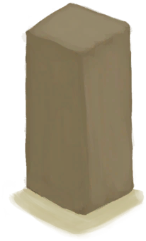Wood Carvings</a>

<a href="Bp_WoodShavings.md" style="color:black">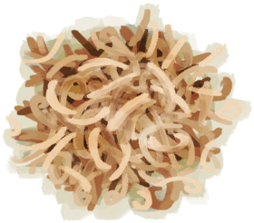Wood Shavings</a>

<a href="Bp_WoodenShovel.md" style="color:black">Wooden Shovel</a>

<a href="Bp_CandiedGinger.md" style="color:black">Candied Ginger</a>

<a href="Bp_CoconutMilk.md" style="color:black">Coconut Milk</a>

<a href="Bp_Bellows.md" style="color:black">Bellows</a>

<a href="Bp_CopperBottle.md" style="color:black">Copper Bottle</a>

<a href="Bp_CopperJar.md" style="color:black">Copper Jar</a>

<a href="Bp_CopperNecklace.md" style="color:black">Copper Necklace</a>

<a href="Bp_CopperNeedles.md" style="color:black">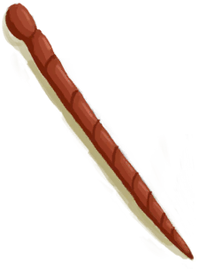Copper Needles</a>

<a href="Bp_EatingUtensilsCopper.md" style="color:black">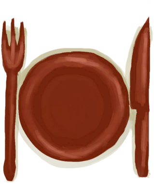Copper Eating Utensils</a>

<a href="Bp_GasMask.md" style="color:black">Gas Mask</a>

<a href="Bp_SharkHeadpiece.md" style="color:black">Shark Headpiece</a>

<a href="Bp_WoodenNeedles.md" style="color:black">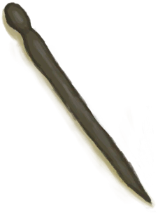Wooden Needles</a>

  
  
  
## Durability   

<table style="margin-bottom:0px;"><tr><td style="width:30%;text-align:left; background-color:#FEFEFE;font-size:1.3em;font-weight:bold;">Usage</td><td style="font-size:1em;background-color:#FEFEFE">Starting：60 -</td></tr><tr style="background-color:#FFFFFF"><td colspan=2>** On Zero： ** Self: → [

[Blunt Knife](KnifeMilitaryBlunt.md)](KnifeMilitaryBlunt.md)</td></tr></table>
  

