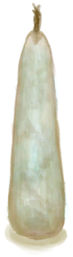
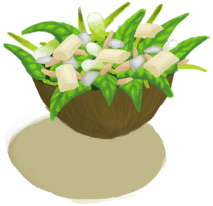

# Jasmine Oil  
> Smells very very good.  
  
<table class="table table-bordered" data-toggle="table"  data-show-header="false"><thead style="display:none"><tr ><th  style="width:50%;text-align:left;vertical-align:top;"  >title</th><th  style="width:50%;text-align:left;vertical-align:top;"  ></th></tr></thead><tr ><td  style="width:50%;text-align:left;vertical-align:top;"  >**Weight：**0.33  **Tag：**	[“Oil”](tag_Oil.md)</td><td  style="width:50%;text-align:left;vertical-align:top;"  >

<a href="LQ_OilJasmine.md" style="color:black">Jasmine Oil</a>

"A nice jasmine-scented oil that can be used to craft <b>Aromatic Candles</b>.  To craft it  you'll need to ground <b>Jasmine Flowers</b></td></tr></tbody></table>  
  
## Got From  

Boiling Jasmine Mix

[Jasmine Oil Mix](LQ_OilJasmineMix.md)

Boiling Jasmine Mix

[Jasmine Oil Mix](LQ_OilJasmineMix.md)

Boiling Jasmine Mix

[Jasmine Oil Mix](LQ_OilJasmineMix.md)

  
  
## Action  

<table><tr><td rowspan="2" style="width:200px;text-align:center;font-size:1.3em;font-weight:bold">

Drink

15m

</td><td>[“NutAction(Group)”](NutAction.md), [“VegetarianAction(Group)”](VegetarianAction.md)</td></tr><tr><td><b>Self：</b>Spoilage  <b>-250(-8.68%)</b></td></tr><tr><td colspan="2"><b>StatChange：</b>[

[Hydration ](Hydration.md)](Hydration.md)<b>+5</b>, [

[Stomach](Stomach.md)](Stomach.md)<b>+45</b>, [

[Saturation Coconuts](SaturationCoconuts.md)](SaturationCoconuts.md)<b>+30</b>, [

[Stool Liquidity](Diarrhoea.md)](Diarrhoea.md)<b>+150</b>, [

[Nausea](Nausea.md)](Nausea.md)<b>+75</b>, [

[Satiation](Satiation.md)](Satiation.md)<b>+40</b>, [

[Morale](Morale.md)](Morale.md)<b>-10</b></td></tr></table>
  
  
  
## Use In BluePrint  

<a href="Bp_CandlesJasmine.md" style="color:black">Jasmine Candles</a>

<a href="Bp_Soap.md" style="color:black">Soap</a>

<a href="Bp_EggFriedRice.md" style="color:black">Egg Fried Rice</a>

<a href="Bp_FishNChips.md" style="color:black">Fish N' Chips</a>

<a href="Bp_FriedBananas.md" style="color:black">Fried Bananas</a>

<a href="Bp_FriedPuffballs.md" style="color:black">Fried Puffballs</a>

<a href="Bp_HeartyFeast.md" style="color:black">Hearty Feast</a>

<a href="Bp_HoneyGlazedPork.md" style="color:black">Honey Glazed Pork</a>

<a href="Bp_IslandChicken.md" style="color:black">Island Chicken</a>

<a href="Bp_JungleSalad.md" style="color:black">Jungle Salad</a>

<a href="Bp_LizardFry.md" style="color:black">Lizard Fry</a>

<a href="Bp_ProteinBar.md" style="color:black">Protein Bar</a>

<a href="Bp_YamCurry.md" style="color:black">Yam Curry</a>

<a href="Bp_YamJam.md" style="color:black">Yam Jam</a>

  
  
  
## Durability   

<table style="margin-bottom:0px;"><tr><td style="width:30%;text-align:left; background-color:#FEFEFE;font-size:1.3em;font-weight:bold;">Spoilage</td><td style="font-size:1em;background-color:#FEFEFE">Starting：2880 , Max：2880 -0.5/TP , Duration ：60d</td></tr><tr style="background-color:#FFFFFF"><td colspan=2>** On Zero： ** Self: →Dismiss</td></tr></table>
  
## Passive Effects  
<table class="table table-bordered" data-toggle="table"  ><thead style=""><tr ><th  style="text-align:left;vertical-align:top;"  >Name</th><th  style="text-align:left;vertical-align:top;"  >Condition</th><th  style="text-align:left;vertical-align:top;"  >Change(Each TP)</th><th  style="text-align:left;vertical-align:top;"  data-sortable="true"  >Status</th></tr></thead><tr ><td  style="text-align:left;vertical-align:top;"  >Evaporation</td><td  style="text-align:left;vertical-align:top;"  >** Require Container：** [“Container Open”](tag_ContainerOpen.md)</td><td  style="text-align:left;vertical-align:top;"  >Spoilage -0.25(-0.01%) LiquidQuantity-1</td><td  style="text-align:left;vertical-align:top;"  ></td></tr></tbody></table>  
  

