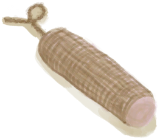

# Water  
> "Fresh  
  
<table class="table table-bordered" data-toggle="table"  data-show-header="false"><thead style="display:none"><tr ><th  style="width:50%;text-align:left;vertical-align:top;"  >title</th><th  style="width:50%;text-align:left;vertical-align:top;"  ></th></tr></thead><tr ><td  style="width:50%;text-align:left;vertical-align:top;"  >**Weight：**0.33  **Tag：**	[“Water for Crops”](tag_WaterFresh.md), [“Weak Cleaner”](tag_CleanerWeak.md), [“Water”](tag_WaterAny.md)</td><td  style="width:50%;text-align:left;vertical-align:top;"  >

<a href="LQ_Water.md" style="color:black">Water</a>

</td></tr></tbody></table>  
  
## Got From  

Start Water

[Alembic(On)](AlembicOn.md)

Collect Rain

[Perforated Coconut](CoconutPerforated.md)

Collect Rain

[Canteen](Canteen.md)

Collect Rain

[Clay Bowl](ClayBowl.md)

Collect Rain

[Clay Jar](ClayJar.md)

Collect Rain

[Jasmine Flowers](ClayJarJasmine.md)

Collect Rain

[Clay Vase](ClayVase.md)

Collect Rain

[Coconut Flask](CoconutFlask.md)(未实装)

Collect Rain

[Coconut Shell](CoconutShell.md)

Collect Rain

[Cooking Pot](CookingPot.md)

Collect Rain

[Copper Bottle](CopperBottle.md)

Collect Rain

[Copper Jar](CopperJar.md)

Collect Rain

[Glazed Vase](GlazedVase.md)

Collect Rain

[Gourd Bottle](GourdBottle.md)

Collect Rain

[Jerrycan](Jerrycan.md)

Collect Rain

[Plastic Bottle](PlasticBottle.md)

Collect Rain

[Plastic Bottle(Full)](PlasticBottleFull.md)

Collect Rain

[Jasmine Flowers](PlasticBottleJasmine.md)

Collect Rain

[Waterskin](Waterskin.md)

** With：**[“Water Container”](tag_WaterContainer.md)Fill

[Water Ration](WaterRation.md)

Transform

[Boiling Water](LQ_WaterBoiling.md)

Replace during Rain

[Salt Water](LQ_WaterSalt.md)

** With：**[Water Purification Tablets](WaterPurificationTablets.md) , [Slaked Lime](LQ_SlakedLime.md)Purify

[Unsafe Water](LQ_WaterUnsafe.md)

Start Filling

[Banana Tree Stump](BananaStump.md)

Start Filling

[Solar Still](SolarStill.md)

Start Filling

[Water Filter](WaterFilter.md)

  
  
## Action  

<table><tr><td rowspan="2" style="width:200px;text-align:center;font-size:1.3em;font-weight:bold">

Drink

3m

</td><td></td></tr><tr><td></td></tr><tr><td colspan="2"><b>StatChange：</b>[

[Hydration ](Hydration.md)](Hydration.md)<b>+40</b></td></tr></table>
  

<table><tr><td rowspan="2" style="width:200px;text-align:center;font-size:1.3em;font-weight:bold">

Wash Yourself

15m

</td><td>[“HandAction(Group)”](HandAction.md)</td></tr><tr><td></td></tr><tr><td colspan="2"><b>Require：</b>LiquidQuantity: 100</td></tr><tr><td colspan="2"><b>CardChanges：</b>装备中的[“Legs (Inner)”](tag_Clothing.md)

  <b>+6(50%)</b>, 所有[Cobra Spit](W_CobraSpit.md)Fuel  <b>-75</b></td></tr><tr><td colspan="2"><b>StatChange：</b>[

[Wetness](Wetness.md)](Wetness.md)<b>+100</b> (/TP), [

[Morale](Morale.md)](Morale.md)<b>+1</b>, [

[Filth](Filth.md)](Filth.md)<b>-150</b>, [

[Mud Protection](MudProtection.md)](MudProtection.md)<b>-50</b>, [

[Aloe Gel Protection](AloeVeraGelProtection.md)](AloeVeraGelProtection.md)<b>-50</b>, [

[Bug Repellent](BugRepellentApplied.md)](BugRepellentApplied.md)<b>-50</b>, [

[Sun Protection](SunProtection.md)](SunProtection.md)<b>-50</b></td></tr></table>
  
  
  
## Drag To  

[Mermaid nest](MermaidNest.md)

[Almond Tree Crop Plot](CropPlotAlmondTree.md)

[Aloe Vera Crop Plot](CropPlotAloeVera.md)

[Banana Crop Plot](CropPlotBananaTree.md)

[Chili Crop Plot](CropPlotChilies.md)

[China Rose Crop Plot](CropPlotChinaRose.md)

[Cinchona Crop Plot](CropPlotCinchonaTree.md)

[Coffee Crop Plot](CropPlotCoffee.md)

[Dry Crop Plot](CropPlotDry.md)

[Empty Crop Plot(Empty)](CropPlotEmpty.md)

[Ginger Crop Plot](CropPlotGinger.md)

[Jasmine Crop Plot](CropPlotJasmine.md)

[Kava Crop Plot](CropPlotKava.md)

[Lemon Grass Crop Plot](CropPlotLemonGrass.md)

[Mango Crop Plot](CropPlotMangoTree.md)

[Nipa Palm Crop Plot](CropPlotNipaPalm.md)

[Palm Bush Crop Plot](CropPlotPalmBush.md)

[Palm Tree Crop Plot](CropPlotPalmTree.md)

[Rice Crop Plot](CropPlotRice.md)

[Ruined Crop Plot](CropPlotRuined.md)

[Sago Palm Crop Plot](CropPlotSagoPalm.md)

[Snake Grass Crop Plot](CropPlotSnakeGrass.md)

[Spider Lily Crop Plot](CropPlotSpiderLily.md)

[Weevil Lily Crop Plot](CropPlotWeevilLily.md)

[Wild Jujube Crop Plot](CropPlotWildJujube.md)

[Yam Crop Plot](CropPlotYam.md)

[Assorted Mushrooms Bed](MushroomBedAssorted.md)

[Dry Mushroom Bed](MushroomBedDry.md)

[Empty Mushroom Bed(Empty)](MushroomBedEmpty.md)

[Magic Mushroom Bed](MushroomBedMagic.md)

[Puffball Bed](MushroomBedPuffballs.md)

[Dirt Pile](DirtPile.md)

[Ash](Ash.md)

[Makeshift Mask](MaskMakeshift.md)

[Fine Dirt](FineDirt.md)

[Honeycomb](BeeHoneycomb.md)

[Ground Kava Root](KavaRootGround.md)

[Rice Grain](RiceGrains.md)

[Sago Sawdust](SagoSawdust.md)

[Sugar](Sugar.md)

[Cut Yam](YamCut.md)

[Clay Pot Cooler(Off)](ClayPotCoolerOff.md)

[Clay Pot Cooler(On)](ClayPotCoolerOn.md)

[Quicklime](Quicklime.md)

[Soap](SoapDry.md)

[Wet Soap](SoapWet.md)

[Abrasion](W_Abrasion.md)

[Arm Laceration](W_ArmLacerationL.md)

[Stitched Arm Laceration](W_ArmLacerationLStitched.md)

[Arm Laceration](W_ArmLacerationR.md)

[Arm Laceration](W_ArmLacerationRStitched.md)

[Cobra Spit](W_CobraSpit.md)

[Dog Bite](W_DogBite.md)

[Leg Laceration](W_LegLacerationL.md)

[Leg Laceration](W_LegLacerationLStitched.md)

[Leg Laceration](W_LegLacerationR.md)

[Leg Laceration](W_LegLacerationRStitched.md)

[Macaque Bite](W_MacaqueBite.md)

[Minor Laceration](W_MinorLaceration.md)

[Minor Laceration](W_MinorLacerationStitched.md)

[Lizard Bite](W_MonitorBite.md)

[Seahound Sting](W_SeahoundSting.md)

[Shark Bite](W_SharkBite.md)

[Spider Bite](W_SpiderBite.md)

[Urchin Wound](W_UrchinWound.md)

[Honey](LQ_Honey.md)

[Unsafe Water](LQ_WaterUnsafe.md)

[Water Filter](WaterFilter.md)

  
  
## Use In BluePrint  

<a href="Bp_Dynamite.md" style="color:black">Dynamite</a>

<a href="Bp_Mortar.md" style="color:black">Mortar</a>

  
  
  
## Passive Effects  
<table class="table table-bordered" data-toggle="table"  ><thead style=""><tr ><th  style="text-align:left;vertical-align:top;"  >Name</th><th  style="text-align:left;vertical-align:top;"  >Condition</th><th  style="text-align:left;vertical-align:top;"  >Change(Each TP)</th><th  style="text-align:left;vertical-align:top;"  data-sortable="true"  >Status</th></tr></thead><tr ><td  style="text-align:left;vertical-align:top;"  >Evaporation</td><td  style="text-align:left;vertical-align:top;"  >** Require Container：** [“Container Open”](tag_ContainerOpen.md)</td><td  style="text-align:left;vertical-align:top;"  >LiquidQuantity-1</td><td  style="text-align:left;vertical-align:top;"  ></td></tr><tr ><td  style="text-align:left;vertical-align:top;"  >Evaporation Large</td><td  style="text-align:left;vertical-align:top;"  >** Require Container：** [“Container Reservoir”](tag_ContainerReservoir.md)</td><td  style="text-align:left;vertical-align:top;"  >LiquidQuantity-3</td><td  style="text-align:left;vertical-align:top;"  ></td></tr><tr ><td  style="text-align:left;vertical-align:top;"  >FillUnderRain</td><td  style="text-align:left;vertical-align:top;"  >** Require Stat：** [

[Rain Value](RainValue.md)](RainValue.md): <b>1-5</b> ** Require Container：** [“Container Open”](tag_ContainerOpen.md)</td><td  style="text-align:left;vertical-align:top;"  >LiquidQuantity+50</td><td  style="text-align:left;vertical-align:top;"  ></td></tr><tr ><td  style="text-align:left;vertical-align:top;"  >FillUnderRain</td><td  style="text-align:left;vertical-align:top;"  >** Require Stat：** [

[Rain Value](RainValue.md)](RainValue.md): <b>1-5</b> ** Require Container：** [“Container Sealed”](tag_ContainerSealed.md)</td><td  style="text-align:left;vertical-align:top;"  >LiquidQuantity+50</td><td  style="text-align:left;vertical-align:top;"  ></td></tr><tr ><td  style="text-align:left;vertical-align:top;"  >FillUnderRainReservoir</td><td  style="text-align:left;vertical-align:top;"  >** Require Stat：** [

[Rain Value](RainValue.md)](RainValue.md): <b>1-5</b> ** Require Container：** [“Container Reservoir”](tag_ContainerReservoir.md)</td><td  style="text-align:left;vertical-align:top;"  >LiquidQuantity+250</td><td  style="text-align:left;vertical-align:top;"  ></td></tr></tbody></table>  
  

