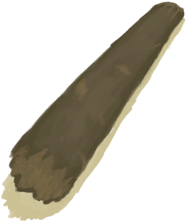

# Large Tree  
> "A light soft wood  
  
<table class="table table-bordered" data-toggle="table"  data-show-header="false"><thead style="display:none"><tr ><th  style="width:50%;text-align:left;vertical-align:top;"  >title</th><th  style="width:50%;text-align:left;vertical-align:top;"  ></th></tr></thead><tr ><td  style="width:50%;text-align:left;vertical-align:top;"  >** Unique On Board **</td><td  style="width:50%;text-align:left;vertical-align:top;"  >

<a href="LargeTree.md" style="color:black">Large Tree</a>

</td></tr></tbody></table>  
  
## Got From  

Explore

[Deep Jungle(Jungle)](DeepJungle.md)

Explore

[Western Highlands](HighlandsWestern.md)

Explore

[Jungle](Jungle.md)

Explore

[Jungle Highlands](JungleHighlands.md)

Explore

[Mangrove Forest](Mangroves.md)

Explore

[Wetland Jungle(Wetlands)](Wetlands.md)

  
  
## Drag With  

<table style="margin-bottom:0px;"><tr><td style="width:40%;text-align:left; background-color:#FEFEFE"><b>With：</b>[

[Stone Axe](StoneAxe.md)](StoneAxe.md)</td><td style="width:40%;font-size:1em;font-weight:bold;background-color:#FEFEFE">Cut Tree (30m) [“HandAction(Group)”](HandAction.md)</td></tr><tr><td colspan="2"><b>Require：</b>[

[Stamina](Stamina.md)](Stamina.md): <b>11-32</b>, [

[Light](Light.md)](Light.md): <b>10-100</b>, [Hand Modifier](ModifierHand.md): <b>0-2</b>, [On Not Axe Adv](OnNotAxeAdv.md): <b>0-0</b></td></tr><tr style="background-color:#FFFFFF"><td style=""><b>Receiving：</b>Usage  <b>-3(-15%)</b></td><td style=""><b>Self：</b>Progress  <b>-10(-20%)</b></td></tr><tr><td colspan="2"><b>StatChange：</b>[

[Stamina](Stamina.md)](Stamina.md)<b>-8</b>, [

[Hand Damage](HandDamage.md)](HandDamage.md)<b>+80</b>, [

[Woodworking(Skill)](Skill_Woodworking.md)](Skill_Woodworking.md)<b>+1</b></td></tr></table>
  

<table style="margin-bottom:0px;"><tr><td style="width:40%;text-align:left; background-color:#FEFEFE"><b>With：</b>[“Hammer”](tag_AxeAdv.md)</td><td style="width:40%;font-size:1em;font-weight:bold;background-color:#FEFEFE">Cut Tree (30m) [“HandAction(Group)”](HandAction.md)</td></tr><tr><td colspan="2"><b>Require：</b>[

[Stamina](Stamina.md)](Stamina.md): <b>11-32</b>, [

[Light](Light.md)](Light.md): <b>10-100</b>, [Hand Modifier](ModifierHand.md): <b>0-2</b></td></tr><tr style="background-color:#FFFFFF"><td style=""><b>Receiving：</b>Usage  <b>-3(-6%)</b></td><td style=""><b>Self：</b>Progress  <b>-25(-50%)</b></td></tr><tr><td colspan="2"><b>StatChange：</b>[

[Stamina](Stamina.md)](Stamina.md)<b>-6</b>, [

[Hand Damage](HandDamage.md)](HandDamage.md)<b>+60</b>, [

[Woodworking(Skill)](Skill_Woodworking.md)](Skill_Woodworking.md)<b>+1</b></td></tr></table>
  
  
## Durability   

<table style="margin-bottom:0px;"><tr><td style="width:30%;text-align:left; background-color:#FEFEFE;font-size:1.3em;font-weight:bold;">Progress</td><td style="font-size:1em;background-color:#FEFEFE">Starting：50 , Max：50 -</td></tr><tr style="background-color:#FFFFFF"><td colspan=2>** On Zero： ** Self: → [

[Felled Large Tree](LargeTreeFelled.md)](LargeTreeFelled.md) [

[Sticks](Sticks.md)](Sticks.md)(<b>+2～+4</b>), [

[Fresh Leaves](LeavesFresh.md)](LeavesFresh.md)(<b>+6～+18</b>)</td></tr></table>
  

