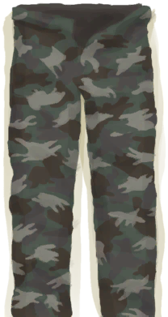

# Leg Protection  
> Protect your legs from different types of damage.  
  

<b>Base Value: </b> 0 
  

<b>Value Range: </b> 0 ~ 10 
  

<b>Base Rate: </b> - 
  
## Change By  
<table class="table table-bordered" data-toggle="table"  ><thead style=""><tr ><th  style="text-align:left;vertical-align:top;"  >From</th><th  style="text-align:left;vertical-align:top;"  >Operation</th><th  style="text-align:left;vertical-align:top;"  data-sortable="true"  >Value</th></tr></thead><tr ><td  style="text-align:left;vertical-align:top;"  >[

[Leather Pants](LeatherPants.md)](LeatherPants.md)</td><td  style="text-align:left;vertical-align:top;"  >Passive Effects</td><td  style="text-align:left;vertical-align:top;"  >6</td></tr><tr ><td  style="text-align:left;vertical-align:top;"  >[

[Military Pants](MilitaryPants.md)](MilitaryPants.md)</td><td  style="text-align:left;vertical-align:top;"  >Passive Effects</td><td  style="text-align:left;vertical-align:top;"  >4</td></tr></tbody></table>  
  
## Required By  
<table class="table table-bordered" data-toggle="table"  ><thead style=""><tr ><th  style="text-align:left;vertical-align:top;"  >From</th><th  style="text-align:left;vertical-align:top;"  >Operation</th><th  style="text-align:left;vertical-align:top;"  data-sortable="true"  >Value</th></tr></thead><tr ><td  style="text-align:left;vertical-align:top;"  >[A Sea Krait!!(Event)](Event_SeaKraitStep.md)</td><td  style="text-align:left;vertical-align:top;"  >Didn't manage to hurt me</td><td  style="text-align:left;vertical-align:top;"  >5 ~ 10</td></tr><tr ><td  style="text-align:left;vertical-align:top;"  >[The Macaques attack!(Event)](Event_MacaqueDenFight.md)</td><td  style="text-align:left;vertical-align:top;"  >影响</td><td  style="text-align:left;vertical-align:top;"  >1 ~ 10</td></tr><tr ><td  style="text-align:left;vertical-align:top;"  >[A Macaque!(Event)](Event_MacaqueFight.md)</td><td  style="text-align:left;vertical-align:top;"  >影响</td><td  style="text-align:left;vertical-align:top;"  >1 ~ 10</td></tr><tr ><td  style="text-align:left;vertical-align:top;"  >[A Macaque!(Event)](Event_MacaqueFightRaid.md)</td><td  style="text-align:left;vertical-align:top;"  >影响</td><td  style="text-align:left;vertical-align:top;"  >1 ~ 10</td></tr><tr ><td  style="text-align:left;vertical-align:top;"  >[A Macaque!(Event)](Event_MacaqueUndeadFight.md)</td><td  style="text-align:left;vertical-align:top;"  >影响</td><td  style="text-align:left;vertical-align:top;"  >1 ~ 10</td></tr><tr ><td  style="text-align:left;vertical-align:top;"  >[A Monitor Lizard!(Event)(Cave)](Event_MonitorFight.md)</td><td  style="text-align:left;vertical-align:top;"  >影响</td><td  style="text-align:left;vertical-align:top;"  >1 ~ 10</td></tr><tr ><td  style="text-align:left;vertical-align:top;"  >[A Seahound!(Event)](Event_SeahoundFight.md)</td><td  style="text-align:left;vertical-align:top;"  >影响</td><td  style="text-align:left;vertical-align:top;"  >1 ~ 10</td></tr><tr ><td  style="text-align:left;vertical-align:top;"  >[A Shark!(Event)](Event_SharkFight.md)</td><td  style="text-align:left;vertical-align:top;"  >影响</td><td  style="text-align:left;vertical-align:top;"  >1 ~ 10</td></tr><tr ><td  style="text-align:left;vertical-align:top;"  >[A Sea Krait!!(Event)](Event_SeaKraitStep.md)</td><td  style="text-align:left;vertical-align:top;"  >Continue...</td><td  style="text-align:left;vertical-align:top;"  >1 ~ 4.9</td></tr><tr ><td  style="text-align:left;vertical-align:top;"  >[Slipped!(Event)](Event_SlipRocks.md)</td><td  style="text-align:left;vertical-align:top;"  >影响</td><td  style="text-align:left;vertical-align:top;"  >1 ~ 10</td></tr><tr ><td  style="text-align:left;vertical-align:top;"  >[Shark](SharkVisitor.md)</td><td  style="text-align:left;vertical-align:top;"  >影响</td><td  style="text-align:left;vertical-align:top;"  >1 ~ 10</td></tr><tr ><td  style="text-align:left;vertical-align:top;"  >[A Sea Krait!!(Event)](Event_SeaKraitStep.md)</td><td  style="text-align:left;vertical-align:top;"  >Continue...</td><td  style="text-align:left;vertical-align:top;"  >0</td></tr></tbody></table>  
  

