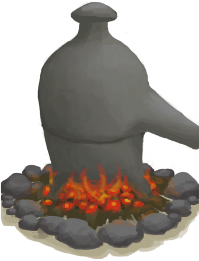
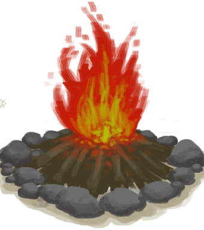
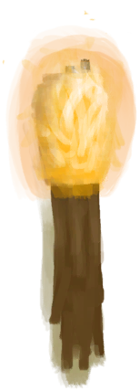

# Light  
  

<b>Base Value: </b> 0 
  

<b>Value Range: </b> 0 ~ 100 
  

<b>Base Rate: </b> - 
  

<b>4时 ~ 20时： </b>+40 
  

<b>6时 ~ 18时： </b>+60 
  
## Statuses  

<table><tr style="height:2em;"><td style="background-color:#F0F0F0;text-align:center;width:180px;font-size:1.4em;font-weight:bold;vertical-align:middle;">
0

0%
</td><td colspan=2 style="font-size:1.1em;vertical-align:middle;background-color:#F9F9F9;">
<b>

Dark</b>

&nbsp;&nbsp;It's too dark to see.
</td></tr><tr><td colspan=2><b>Effect：</b>[

[Wakefulness](Wakefulness.md)](Wakefulness.md)addition<b>-0.25</b>, [

[Mental Structure](Structure.md)](Structure.md)addition<b>-0.5</b></td></tr><tr><td colspan=2></td></tr><tr style="height:2em;"><td style="background-color:#F0F0F0;text-align:center;width:180px;font-size:1.4em;font-weight:bold;vertical-align:middle;">
1 ～ 100

1% ～ 100%
</td><td colspan=2 style="font-size:1.1em;vertical-align:middle;background-color:#F9F9F9;">
<b>Light</b>

</td></tr><tr><td colspan=2><b>Effect：</b>[

[Watcher's Glare](WatchersGlare.md)](WatchersGlare.md)addition<b>-99</b></td></tr><tr><td colspan=2></td></tr></table>
  
## Related Cards  
[Eye Damage](EyeDamage.md)  |  [Venom Krait](VenomKrait.md)  
## Change By  
<table class="table table-bordered" data-toggle="table"  ><thead style=""><tr ><th  style="text-align:left;vertical-align:top;"  >From</th><th  style="text-align:left;vertical-align:top;"  >Operation</th><th  style="text-align:left;vertical-align:top;"  data-sortable="true"  >Value</th></tr></thead><tr ><td  style="text-align:left;vertical-align:top;"  >[

[Alembic(On)](AlembicOn.md)](AlembicOn.md)</td><td  style="text-align:left;vertical-align:top;"  >Passive Effects</td><td  style="text-align:left;vertical-align:top;"  >25</td></tr><tr ><td  style="text-align:left;vertical-align:top;"  >[

[Campfire](Campfire.md)](Campfire.md)</td><td  style="text-align:left;vertical-align:top;"  >Passive Effects</td><td  style="text-align:left;vertical-align:top;"  >25</td></tr><tr ><td  style="text-align:left;vertical-align:top;"  >[

[Clay Fire Pit](ClayFirePit.md)](ClayFirePit.md)</td><td  style="text-align:left;vertical-align:top;"  >Passive Effects</td><td  style="text-align:left;vertical-align:top;"  >25</td></tr><tr ><td  style="text-align:left;vertical-align:top;"  >[

[Fire](Fire.md)](Fire.md)</td><td  style="text-align:left;vertical-align:top;"  >Passive Effects</td><td  style="text-align:left;vertical-align:top;"  >25</td></tr><tr ><td  style="text-align:left;vertical-align:top;"  >[

[Stove](Stove.md)](Stove.md)</td><td  style="text-align:left;vertical-align:top;"  >Passive Effects</td><td  style="text-align:left;vertical-align:top;"  >25</td></tr><tr ><td  style="text-align:left;vertical-align:top;"  >[

[Phone](PhoneOnLight.md)](PhoneOnLight.md)</td><td  style="text-align:left;vertical-align:top;"  >Passive Effects</td><td  style="text-align:left;vertical-align:top;"  >25</td></tr><tr ><td  style="text-align:left;vertical-align:top;"  >[

[Burning Flare(On)](FlareHandOn.md)](FlareHandOn.md)</td><td  style="text-align:left;vertical-align:top;"  >Passive Effects</td><td  style="text-align:left;vertical-align:top;"  >25</td></tr><tr ><td  style="text-align:left;vertical-align:top;"  >[

[Gas Cooker(On)](GasCookerOn.md)](GasCookerOn.md)</td><td  style="text-align:left;vertical-align:top;"  >Passive Effects</td><td  style="text-align:left;vertical-align:top;"  >20</td></tr><tr ><td  style="text-align:left;vertical-align:top;"  >[

[Smoker](Smoker.md)](Smoker.md)</td><td  style="text-align:left;vertical-align:top;"  >Passive Effects</td><td  style="text-align:left;vertical-align:top;"  >20</td></tr><tr ><td  style="text-align:left;vertical-align:top;"  >[

[Smoker](SmokerPlastic.md)](SmokerPlastic.md)</td><td  style="text-align:left;vertical-align:top;"  >Passive Effects</td><td  style="text-align:left;vertical-align:top;"  >20</td></tr><tr ><td  style="text-align:left;vertical-align:top;"  >[

[Bee Smoker(On)](BeeSmokerOn.md)](BeeSmokerOn.md)</td><td  style="text-align:left;vertical-align:top;"  >Passive Effects</td><td  style="text-align:left;vertical-align:top;"  >20</td></tr><tr ><td  style="text-align:left;vertical-align:top;"  >[

[Citronella Candle(On)](CandleCitronellaOn.md)](CandleCitronellaOn.md)</td><td  style="text-align:left;vertical-align:top;"  >Passive Effects</td><td  style="text-align:left;vertical-align:top;"  >20</td></tr><tr ><td  style="text-align:left;vertical-align:top;"  >[

[Jasmine Candle(On)](CandleJasmineOn.md)](CandleJasmineOn.md)</td><td  style="text-align:left;vertical-align:top;"  >Passive Effects</td><td  style="text-align:left;vertical-align:top;"  >20</td></tr><tr ><td  style="text-align:left;vertical-align:top;"  >[

[Candle(On)](CandleOn.md)](CandleOn.md)</td><td  style="text-align:left;vertical-align:top;"  >Passive Effects</td><td  style="text-align:left;vertical-align:top;"  >20</td></tr><tr ><td  style="text-align:left;vertical-align:top;"  >[

[Dynamite(On)](DynamiteOn.md)](DynamiteOn.md)</td><td  style="text-align:left;vertical-align:top;"  >Passive Effects</td><td  style="text-align:left;vertical-align:top;"  >20</td></tr><tr ><td  style="text-align:left;vertical-align:top;"  >[

[Torch(On)](TorchOn.md)](TorchOn.md)</td><td  style="text-align:left;vertical-align:top;"  >Passive Effects</td><td  style="text-align:left;vertical-align:top;"  >20</td></tr><tr ><td  style="text-align:left;vertical-align:top;"  >[

[Atoll(Environment)](Env_Atoll.md)](Env_Atoll.md)</td><td  style="text-align:left;vertical-align:top;"  >Passive Effects</td><td  style="text-align:left;vertical-align:top;"  >10</td></tr><tr ><td  style="text-align:left;vertical-align:top;"  >[

[Bay(Environment)](Env_Bay.md)](Env_Bay.md)</td><td  style="text-align:left;vertical-align:top;"  >Passive Effects</td><td  style="text-align:left;vertical-align:top;"  >10</td></tr><tr ><td  style="text-align:left;vertical-align:top;"  >[

[Beach(Environment)](Env_Beach.md)](Env_Beach.md)</td><td  style="text-align:left;vertical-align:top;"  >Passive Effects</td><td  style="text-align:left;vertical-align:top;"  >10</td></tr><tr ><td  style="text-align:left;vertical-align:top;"  >[

[Bird Rock(Environment)](Env_BirdRock.md)](Env_BirdRock.md)</td><td  style="text-align:left;vertical-align:top;"  >Passive Effects</td><td  style="text-align:left;vertical-align:top;"  >10</td></tr><tr ><td  style="text-align:left;vertical-align:top;"  >[

[Secret Cove(Environment)](Env_Cove.md)](Env_Cove.md)</td><td  style="text-align:left;vertical-align:top;"  >Passive Effects</td><td  style="text-align:left;vertical-align:top;"  >10</td></tr><tr ><td  style="text-align:left;vertical-align:top;"  >[

[Eastern Grasslands(Environment)](Env_GrasslandsE.md)](Env_GrasslandsE.md)</td><td  style="text-align:left;vertical-align:top;"  >Passive Effects</td><td  style="text-align:left;vertical-align:top;"  >10</td></tr><tr ><td  style="text-align:left;vertical-align:top;"  >[

[Western Grasslands(Environment)](Env_GrasslandsW.md)](Env_GrasslandsW.md)</td><td  style="text-align:left;vertical-align:top;"  >Passive Effects</td><td  style="text-align:left;vertical-align:top;"  >10</td></tr><tr ><td  style="text-align:left;vertical-align:top;"  >[

[Raft(Environment)](Env_Raft.md)](Env_Raft.md)</td><td  style="text-align:left;vertical-align:top;"  >Passive Effects</td><td  style="text-align:left;vertical-align:top;"  >10</td></tr><tr ><td  style="text-align:left;vertical-align:top;"  >[

[Secret Valley(Environment)](Env_SecretValley.md)](Env_SecretValley.md)</td><td  style="text-align:left;vertical-align:top;"  >Passive Effects</td><td  style="text-align:left;vertical-align:top;"  >10</td></tr><tr ><td  style="text-align:left;vertical-align:top;"  >[

[Cloudy](TropicalIsland_Cloudy.md)](TropicalIsland_Cloudy.md)</td><td  style="text-align:left;vertical-align:top;"  >Passive Effects</td><td  style="text-align:left;vertical-align:top;"  >-5</td></tr><tr ><td  style="text-align:left;vertical-align:top;"  >[

[Cloudy](TropicalIsland_CloudyStart.md)](TropicalIsland_CloudyStart.md)(未实装)</td><td  style="text-align:left;vertical-align:top;"  >Passive Effects</td><td  style="text-align:left;vertical-align:top;"  >-5</td></tr><tr ><td  style="text-align:left;vertical-align:top;"  >[

[Light Rain](TropicalIsland_LightRain.md)](TropicalIsland_LightRain.md)</td><td  style="text-align:left;vertical-align:top;"  >Passive Effects</td><td  style="text-align:left;vertical-align:top;"  >-5</td></tr><tr ><td  style="text-align:left;vertical-align:top;"  >[

[Light Rain](TropicalIsland_LightRainStart.md)](TropicalIsland_LightRainStart.md)(未实装)</td><td  style="text-align:left;vertical-align:top;"  >Passive Effects</td><td  style="text-align:left;vertical-align:top;"  >-5</td></tr><tr ><td  style="text-align:left;vertical-align:top;"  >[

[Partially Cloudy](TropicalIsland_PartiallyCloudy.md)](TropicalIsland_PartiallyCloudy.md)</td><td  style="text-align:left;vertical-align:top;"  >Passive Effects</td><td  style="text-align:left;vertical-align:top;"  >-5</td></tr><tr ><td  style="text-align:left;vertical-align:top;"  >[

[Favourable Wind](OpenSea_Favourable.md)](OpenSea_Favourable.md)</td><td  style="text-align:left;vertical-align:top;"  >Passive Effects</td><td  style="text-align:left;vertical-align:top;"  >-10</td></tr><tr ><td  style="text-align:left;vertical-align:top;"  >[

[Storm Behind](OpenSea_StormBehind.md)](OpenSea_StormBehind.md)</td><td  style="text-align:left;vertical-align:top;"  >Passive Effects</td><td  style="text-align:left;vertical-align:top;"  >-10</td></tr><tr ><td  style="text-align:left;vertical-align:top;"  >[

[Storm Behind](OpenSea_StormBehindInfinite.md)](OpenSea_StormBehindInfinite.md)</td><td  style="text-align:left;vertical-align:top;"  >Passive Effects</td><td  style="text-align:left;vertical-align:top;"  >-10</td></tr><tr ><td  style="text-align:left;vertical-align:top;"  >[

[Storm Front](OpenSea_StormFront.md)](OpenSea_StormFront.md)</td><td  style="text-align:left;vertical-align:top;"  >Passive Effects</td><td  style="text-align:left;vertical-align:top;"  >-10</td></tr><tr ><td  style="text-align:left;vertical-align:top;"  >[

[Unfavourable Wind](OpenSea_UnFavourable.md)](OpenSea_UnFavourable.md)</td><td  style="text-align:left;vertical-align:top;"  >Passive Effects</td><td  style="text-align:left;vertical-align:top;"  >-10</td></tr><tr ><td  style="text-align:left;vertical-align:top;"  >[

[Very Favourable Wind](OpenSea_VeryFavourable.md)](OpenSea_VeryFavourable.md)</td><td  style="text-align:left;vertical-align:top;"  >Passive Effects</td><td  style="text-align:left;vertical-align:top;"  >-10</td></tr><tr ><td  style="text-align:left;vertical-align:top;"  >[

[Very Favourable Wind](OpenSea_VeryFavourableInfinite.md)](OpenSea_VeryFavourableInfinite.md)</td><td  style="text-align:left;vertical-align:top;"  >Passive Effects</td><td  style="text-align:left;vertical-align:top;"  >-10</td></tr><tr ><td  style="text-align:left;vertical-align:top;"  >[

[Very Unfavourable Wind](OpenSea_VeryUnFavourable.md)](OpenSea_VeryUnFavourable.md)</td><td  style="text-align:left;vertical-align:top;"  >Passive Effects</td><td  style="text-align:left;vertical-align:top;"  >-10</td></tr><tr ><td  style="text-align:left;vertical-align:top;"  >[

[Heavy Rain](TropicalIsland_HeavyRain.md)](TropicalIsland_HeavyRain.md)</td><td  style="text-align:left;vertical-align:top;"  >Passive Effects</td><td  style="text-align:left;vertical-align:top;"  >-10</td></tr><tr ><td  style="text-align:left;vertical-align:top;"  >[

[Heavy Rain](TropicalIsland_HeavyRainInfinite.md)](TropicalIsland_HeavyRainInfinite.md)</td><td  style="text-align:left;vertical-align:top;"  >Passive Effects</td><td  style="text-align:left;vertical-align:top;"  >-10</td></tr><tr ><td  style="text-align:left;vertical-align:top;"  >[

[Heavy Rain](TropicalIsland_HeavyRainLong.md)](TropicalIsland_HeavyRainLong.md)(未实装)</td><td  style="text-align:left;vertical-align:top;"  >Passive Effects</td><td  style="text-align:left;vertical-align:top;"  >-10</td></tr><tr ><td  style="text-align:left;vertical-align:top;"  >[

[Heavy Rain](TropicalIsland_HeavyRainStart.md)](TropicalIsland_HeavyRainStart.md)(未实装)</td><td  style="text-align:left;vertical-align:top;"  >Passive Effects</td><td  style="text-align:left;vertical-align:top;"  >-10</td></tr><tr ><td  style="text-align:left;vertical-align:top;"  >[

[Storm](TropicalIsland_Storm.md)](TropicalIsland_Storm.md)</td><td  style="text-align:left;vertical-align:top;"  >Passive Effects</td><td  style="text-align:left;vertical-align:top;"  >-10</td></tr><tr ><td  style="text-align:left;vertical-align:top;"  >[

[Storm](TropicalIsland_StormInfinite.md)](TropicalIsland_StormInfinite.md)</td><td  style="text-align:left;vertical-align:top;"  >Passive Effects</td><td  style="text-align:left;vertical-align:top;"  >-10</td></tr><tr ><td  style="text-align:left;vertical-align:top;"  >[

[Storm](TropicalIsland_StormStart.md)](TropicalIsland_StormStart.md)(未实装)</td><td  style="text-align:left;vertical-align:top;"  >Passive Effects</td><td  style="text-align:left;vertical-align:top;"  >-10</td></tr><tr ><td  style="text-align:left;vertical-align:top;"  >[

[Cobra Spit](W_CobraSpit.md)](W_CobraSpit.md)</td><td  style="text-align:left;vertical-align:top;"  >Passive</td><td  style="text-align:left;vertical-align:top;"  >-25</td></tr><tr ><td  style="text-align:left;vertical-align:top;"  >[

[Cobra Spit](W_CobraSpit.md)](W_CobraSpit.md)</td><td  style="text-align:left;vertical-align:top;"  >Passive</td><td  style="text-align:left;vertical-align:top;"  >-50</td></tr></tbody></table>  
  
## Required By  
<table class="table table-bordered" data-toggle="table"  ><thead style=""><tr ><th  style="text-align:left;vertical-align:top;"  >From</th><th  style="text-align:left;vertical-align:top;"  >Operation</th><th  style="text-align:left;vertical-align:top;"  data-sortable="true"  >Value</th></tr></thead><tr ><td  style="text-align:left;vertical-align:top;"  >[Dismantled Wooden Bed](BedWoodenDismantled.md)</td><td  style="text-align:left;vertical-align:top;"  >Place</td><td  style="text-align:left;vertical-align:top;"  >10 ~ 100</td></tr><tr ><td  style="text-align:left;vertical-align:top;"  >[Wooden Bed](BedWooden.md)</td><td  style="text-align:left;vertical-align:top;"  >Take apart and Pick Up</td><td  style="text-align:left;vertical-align:top;"  >10 ~ 100</td></tr><tr ><td  style="text-align:left;vertical-align:top;"  >[Hammock](Hammock.md)</td><td  style="text-align:left;vertical-align:top;"  >Dismantle</td><td  style="text-align:left;vertical-align:top;"  >10 ~ 100</td></tr><tr ><td  style="text-align:left;vertical-align:top;"  >[Leaf Bed](LeafBed.md)</td><td  style="text-align:left;vertical-align:top;"  >Repair Bed ** With：**[“Leaves”](tag_Leaves.md)</td><td  style="text-align:left;vertical-align:top;"  >10 ~ 100</td></tr><tr ><td  style="text-align:left;vertical-align:top;"  >[Mermaid nest](MermaidNest.md)</td><td  style="text-align:left;vertical-align:top;"  >Water ** With：**[“Water”](tag_WaterAny.md)</td><td  style="text-align:left;vertical-align:top;"  >10 ~ 100</td></tr><tr ><td  style="text-align:left;vertical-align:top;"  >[Mermaid nest](MermaidNest.md)</td><td  style="text-align:left;vertical-align:top;"  >Water ** With：**[Tide Pool(Tidal Cave)](TidePool.md) , [Flooded Tide Pool](TidePoolFlooded.md)</td><td  style="text-align:left;vertical-align:top;"  >10 ~ 100</td></tr><tr ><td  style="text-align:left;vertical-align:top;"  >[Mermaid nest](MermaidNest.md)</td><td  style="text-align:left;vertical-align:top;"  >Repair Nest ** With：**[Seaweed](Seaweed.md)</td><td  style="text-align:left;vertical-align:top;"  >10 ~ 100</td></tr><tr ><td  style="text-align:left;vertical-align:top;"  >[Shelter](Shelter.md)</td><td  style="text-align:left;vertical-align:top;"  >Deconstruct</td><td  style="text-align:left;vertical-align:top;"  >10 ~ 100</td></tr><tr ><td  style="text-align:left;vertical-align:top;"  >[Shelter](Shelter.md)</td><td  style="text-align:left;vertical-align:top;"  >Repair Shelter ** With：**[Palm Fronds](PalmFronds.md)</td><td  style="text-align:left;vertical-align:top;"  >10 ~ 100</td></tr><tr ><td  style="text-align:left;vertical-align:top;"  >[Shelter](Shelter.md)</td><td  style="text-align:left;vertical-align:top;"  >Combine ** With：**[Leaf Bed](LeafBed.md)</td><td  style="text-align:left;vertical-align:top;"  >10 ~ 100</td></tr><tr ><td  style="text-align:left;vertical-align:top;"  >[Sheltered Leaf Bed](ShelteredLeafBed.md)</td><td  style="text-align:left;vertical-align:top;"  >Deconstruct</td><td  style="text-align:left;vertical-align:top;"  >10 ~ 100</td></tr><tr ><td  style="text-align:left;vertical-align:top;"  >[Sheltered Leaf Bed](ShelteredLeafBed.md)</td><td  style="text-align:left;vertical-align:top;"  >Repair Bed ** With：**[Palm Fronds](PalmFronds.md)</td><td  style="text-align:left;vertical-align:top;"  >10 ~ 100</td></tr><tr ><td  style="text-align:left;vertical-align:top;"  >[Sheltered Leaf Bed](ShelteredLeafBed.md)</td><td  style="text-align:left;vertical-align:top;"  >Repair Bed ** With：**[Snake Grass](SnakeGrass.md) , [Dry Leaves](LeavesDry.md) , [Fresh Leaves](LeavesFresh.md) , [Rice Straw](RiceStraw.md)</td><td  style="text-align:left;vertical-align:top;"  >10 ~ 100</td></tr><tr ><td  style="text-align:left;vertical-align:top;"  >[Tent](TentDeployed.md)</td><td  style="text-align:left;vertical-align:top;"  >Dismantle</td><td  style="text-align:left;vertical-align:top;"  >10 ~ 100</td></tr><tr ><td  style="text-align:left;vertical-align:top;"  >[Tent](TentDeployed.md)</td><td  style="text-align:left;vertical-align:top;"  >Scavenge for Plastic ** With：**[“Cutter”](tag_Cutter.md)</td><td  style="text-align:left;vertical-align:top;"  >10 ~ 100</td></tr><tr ><td  style="text-align:left;vertical-align:top;"  >[Packed Tent](TentPacked.md)</td><td  style="text-align:left;vertical-align:top;"  >Set Up Tent</td><td  style="text-align:left;vertical-align:top;"  >10 ~ 100</td></tr><tr ><td  style="text-align:left;vertical-align:top;"  >[Packed Tent](TentPacked.md)</td><td  style="text-align:left;vertical-align:top;"  >Scavenge for Plastic ** With：**[“Cutter”](tag_Cutter.md)</td><td  style="text-align:left;vertical-align:top;"  >10 ~ 100</td></tr><tr ><td  style="text-align:left;vertical-align:top;"  >[Bee Skep](BeeSkep.md)</td><td  style="text-align:left;vertical-align:top;"  >Harvest</td><td  style="text-align:left;vertical-align:top;"  >10 ~ 100</td></tr><tr ><td  style="text-align:left;vertical-align:top;"  >[Swarming Bee Skep](BeeSkepSwarming.md)</td><td  style="text-align:left;vertical-align:top;"  >Harvest</td><td  style="text-align:left;vertical-align:top;"  >10 ~ 100</td></tr><tr ><td  style="text-align:left;vertical-align:top;"  >[Beehive](Beehive.md)</td><td  style="text-align:left;vertical-align:top;"  >Harvest</td><td  style="text-align:left;vertical-align:top;"  >10 ~ 100</td></tr><tr ><td  style="text-align:left;vertical-align:top;"  >[Dismantled BookShelf](BookShelfDismantled.md)</td><td  style="text-align:left;vertical-align:top;"  >Place</td><td  style="text-align:left;vertical-align:top;"  >10 ~ 100</td></tr><tr ><td  style="text-align:left;vertical-align:top;"  >[Cage Trap](CageTrap.md)</td><td  style="text-align:left;vertical-align:top;"  >Deploy</td><td  style="text-align:left;vertical-align:top;"  >10 ~ 100</td></tr><tr ><td  style="text-align:left;vertical-align:top;"  >[Cage Trap](CageTrap.md)</td><td  style="text-align:left;vertical-align:top;"  >Deconstruct</td><td  style="text-align:left;vertical-align:top;"  >10 ~ 100</td></tr><tr ><td  style="text-align:left;vertical-align:top;"  >[Cage Trap](CageTrapPlaced.md)</td><td  style="text-align:left;vertical-align:top;"  >Pick Up</td><td  style="text-align:left;vertical-align:top;"  >10 ~ 100</td></tr><tr ><td  style="text-align:left;vertical-align:top;"  >[Disarmed Cage Trap](CageTrapPlacedTriggered.md)</td><td  style="text-align:left;vertical-align:top;"  >Rearm Trap</td><td  style="text-align:left;vertical-align:top;"  >10 ~ 100</td></tr><tr ><td  style="text-align:left;vertical-align:top;"  >[Disarmed Cage Trap](CageTrapPlacedTriggered.md)</td><td  style="text-align:left;vertical-align:top;"  >Pick Up</td><td  style="text-align:left;vertical-align:top;"  >10 ~ 100</td></tr><tr ><td  style="text-align:left;vertical-align:top;"  >[Disarmed Cage Trap](CageTrapPlacedTriggeredPartridgeFemale.md)</td><td  style="text-align:left;vertical-align:top;"  >Rearm Trap</td><td  style="text-align:left;vertical-align:top;"  >10 ~ 100</td></tr><tr ><td  style="text-align:left;vertical-align:top;"  >[Disarmed Cage Trap](CageTrapPlacedTriggeredPartridgeFemale.md)</td><td  style="text-align:left;vertical-align:top;"  >Pick Up</td><td  style="text-align:left;vertical-align:top;"  >10 ~ 100</td></tr><tr ><td  style="text-align:left;vertical-align:top;"  >[Disarmed Cage Trap](CageTrapPlacedTriggeredPartridgeMale.md)</td><td  style="text-align:left;vertical-align:top;"  >Rearm Trap</td><td  style="text-align:left;vertical-align:top;"  >10 ~ 100</td></tr><tr ><td  style="text-align:left;vertical-align:top;"  >[Disarmed Cage Trap](CageTrapPlacedTriggeredPartridgeMale.md)</td><td  style="text-align:left;vertical-align:top;"  >Pick Up</td><td  style="text-align:left;vertical-align:top;"  >10 ~ 100</td></tr><tr ><td  style="text-align:left;vertical-align:top;"  >[Disarmed Cage Trap](CageTrapPlacedTriggeredSeagull.md)</td><td  style="text-align:left;vertical-align:top;"  >Rearm Trap</td><td  style="text-align:left;vertical-align:top;"  >10 ~ 100</td></tr><tr ><td  style="text-align:left;vertical-align:top;"  >[Disarmed Cage Trap](CageTrapPlacedTriggeredSeagull.md)</td><td  style="text-align:left;vertical-align:top;"  >Pick Up</td><td  style="text-align:left;vertical-align:top;"  >10 ~ 100</td></tr><tr ><td  style="text-align:left;vertical-align:top;"  >[Copper Vein(High Chamber)](CopperVein.md)</td><td  style="text-align:left;vertical-align:top;"  >Mine ** With：**[“Hammer”](tag_Hammer.md)</td><td  style="text-align:left;vertical-align:top;"  >10 ~ 100</td></tr><tr ><td  style="text-align:left;vertical-align:top;"  >[Deadfall Trap](DeadfallTrap.md)</td><td  style="text-align:left;vertical-align:top;"  >Disassemble trap</td><td  style="text-align:left;vertical-align:top;"  >10 ~ 100</td></tr><tr ><td  style="text-align:left;vertical-align:top;"  >[Deadfall Trap](DeadfallTrapTriggered.md)</td><td  style="text-align:left;vertical-align:top;"  >Rearm Trap</td><td  style="text-align:left;vertical-align:top;"  >10 ~ 100</td></tr><tr ><td  style="text-align:left;vertical-align:top;"  >[Deadfall Trap](DeadfallTrapTriggered.md)</td><td  style="text-align:left;vertical-align:top;"  >Disassemble trap</td><td  style="text-align:left;vertical-align:top;"  >10 ~ 100</td></tr><tr ><td  style="text-align:left;vertical-align:top;"  >[Dirt Pile](DirtPile.md)</td><td  style="text-align:left;vertical-align:top;"  >Crush dirt ** With：**[“Hammer”](tag_Hammer.md)</td><td  style="text-align:left;vertical-align:top;"  >10 ~ 100</td></tr><tr ><td  style="text-align:left;vertical-align:top;"  >[Fish Trap](FishTrap.md)</td><td  style="text-align:left;vertical-align:top;"  >Deploy</td><td  style="text-align:left;vertical-align:top;"  >10 ~ 100</td></tr><tr ><td  style="text-align:left;vertical-align:top;"  >[Fish Trap](FishTrap.md)</td><td  style="text-align:left;vertical-align:top;"  >Deconstruct</td><td  style="text-align:left;vertical-align:top;"  >10 ~ 100</td></tr><tr ><td  style="text-align:left;vertical-align:top;"  >[Fish Trap](FishTrapDeployed.md)</td><td  style="text-align:left;vertical-align:top;"  >Pick up Trap</td><td  style="text-align:left;vertical-align:top;"  >10 ~ 100</td></tr><tr ><td  style="text-align:left;vertical-align:top;"  >[Half Log](HalfLog.md)</td><td  style="text-align:left;vertical-align:top;"  >Cut into Wood ** With：**[Stone Axe](StoneAxe.md)</td><td  style="text-align:left;vertical-align:top;"  >10 ~ 100</td></tr><tr ><td  style="text-align:left;vertical-align:top;"  >[Half Log](HalfLog.md)</td><td  style="text-align:left;vertical-align:top;"  >Cut into Wood ** With：**[“Axe”](tag_Axe.md)</td><td  style="text-align:left;vertical-align:top;"  >10 ~ 100</td></tr><tr ><td  style="text-align:left;vertical-align:top;"  >[Deflated Life Raft](LifeRaftDeflated.md)</td><td  style="text-align:left;vertical-align:top;"  >Cut plastic sheet ** With：**[“Cutter”](tag_Cutter.md)</td><td  style="text-align:left;vertical-align:top;"  >10 ~ 100</td></tr><tr ><td  style="text-align:left;vertical-align:top;"  >[Log](Log.md)</td><td  style="text-align:left;vertical-align:top;"  >Split into two ** With：**[Stone Axe](StoneAxe.md)</td><td  style="text-align:left;vertical-align:top;"  >10 ~ 100</td></tr><tr ><td  style="text-align:left;vertical-align:top;"  >[Log](Log.md)</td><td  style="text-align:left;vertical-align:top;"  >Split into two ** With：**[“Axe”](tag_Axe.md)</td><td  style="text-align:left;vertical-align:top;"  >10 ~ 100</td></tr><tr ><td  style="text-align:left;vertical-align:top;"  >[Log Trap](LogTrap.md)</td><td  style="text-align:left;vertical-align:top;"  >Disassemble trap</td><td  style="text-align:left;vertical-align:top;"  >10 ~ 100</td></tr><tr ><td  style="text-align:left;vertical-align:top;"  >[Log Trap](LogTrapTriggered.md)</td><td  style="text-align:left;vertical-align:top;"  >Rearm Trap</td><td  style="text-align:left;vertical-align:top;"  >10 ~ 100</td></tr><tr ><td  style="text-align:left;vertical-align:top;"  >[Log Trap](LogTrapTriggered.md)</td><td  style="text-align:left;vertical-align:top;"  >Disassemble trap</td><td  style="text-align:left;vertical-align:top;"  >10 ~ 100</td></tr><tr ><td  style="text-align:left;vertical-align:top;"  >[Loom](Loom.md)</td><td  style="text-align:left;vertical-align:top;"  >Make Cloth</td><td  style="text-align:left;vertical-align:top;"  >10 ~ 100</td></tr><tr ><td  style="text-align:left;vertical-align:top;"  >[Loom](Loom.md)</td><td  style="text-align:left;vertical-align:top;"  >Enlarge Cloth ** With：**[Small Cloth](ClothSmall.md)</td><td  style="text-align:left;vertical-align:top;"  >10 ~ 100</td></tr><tr ><td  style="text-align:left;vertical-align:top;"  >[Loom](Loom.md)</td><td  style="text-align:left;vertical-align:top;"  >Enlarge Cloth ** With：**[Cloth](Cloth.md)</td><td  style="text-align:left;vertical-align:top;"  >10 ~ 100</td></tr><tr ><td  style="text-align:left;vertical-align:top;"  >[Loom](Loom.md)</td><td  style="text-align:left;vertical-align:top;"  >Enlarge Cloth ** With：**[Large Cloth](ClothLarge.md)</td><td  style="text-align:left;vertical-align:top;"  >10 ~ 100</td></tr><tr ><td  style="text-align:left;vertical-align:top;"  >[Loom (Empty)(Empty)](LoomEmpty.md)</td><td  style="text-align:left;vertical-align:top;"  >Disassemble Loom</td><td  style="text-align:left;vertical-align:top;"  >10 ~ 100</td></tr><tr ><td  style="text-align:left;vertical-align:top;"  >[Loom (Empty)(Empty)](LoomEmpty.md)</td><td  style="text-align:left;vertical-align:top;"  >Place thread on Loom ** With：**[Yarn](YarnFiber.md)</td><td  style="text-align:left;vertical-align:top;"  >10 ~ 100</td></tr><tr ><td  style="text-align:left;vertical-align:top;"  >[Loom (Empty)(Empty)](LoomEmpty.md)</td><td  style="text-align:left;vertical-align:top;"  >Unweave Cloth ** With：**[Small Cloth](ClothSmall.md)</td><td  style="text-align:left;vertical-align:top;"  >10 ~ 100</td></tr><tr ><td  style="text-align:left;vertical-align:top;"  >[Loom (Empty)(Empty)](LoomEmpty.md)</td><td  style="text-align:left;vertical-align:top;"  >Unweave Cloth ** With：**[Cloth](Cloth.md)</td><td  style="text-align:left;vertical-align:top;"  >10 ~ 100</td></tr><tr ><td  style="text-align:left;vertical-align:top;"  >[Loom (Empty)(Empty)](LoomEmpty.md)</td><td  style="text-align:left;vertical-align:top;"  >Unweave Cloth ** With：**[Large Cloth](ClothLarge.md)</td><td  style="text-align:left;vertical-align:top;"  >10 ~ 100</td></tr><tr ><td  style="text-align:left;vertical-align:top;"  >[Deployed Parachute](ParachuteDeployed.md)</td><td  style="text-align:left;vertical-align:top;"  >Cut plastic sheet ** With：**[“Cutter”](tag_Cutter.md)</td><td  style="text-align:left;vertical-align:top;"  >10 ~ 100</td></tr><tr ><td  style="text-align:left;vertical-align:top;"  >[Pottery Wheel](PotteryWheel.md)</td><td  style="text-align:left;vertical-align:top;"  >Take apart and Pick Up</td><td  style="text-align:left;vertical-align:top;"  >10 ~ 100</td></tr><tr ><td  style="text-align:left;vertical-align:top;"  >[Dismantled PotteryWheel](PotteryWheelDismantled.md)</td><td  style="text-align:left;vertical-align:top;"  >Place</td><td  style="text-align:left;vertical-align:top;"  >10 ~ 100</td></tr><tr ><td  style="text-align:left;vertical-align:top;"  >[Fish Trap](RaftFishTrap.md)</td><td  style="text-align:left;vertical-align:top;"  >Repair ** With：**[Fiber Cord](CordFiber.md)</td><td  style="text-align:left;vertical-align:top;"  >10 ~ 100</td></tr><tr ><td  style="text-align:left;vertical-align:top;"  >[Scarecrow](Scarecrow.md)</td><td  style="text-align:left;vertical-align:top;"  >Deconstruct</td><td  style="text-align:left;vertical-align:top;"  >10 ~ 100</td></tr><tr ><td  style="text-align:left;vertical-align:top;"  >[Scarecrow](Scarecrow.md)</td><td  style="text-align:left;vertical-align:top;"  >Repair ** With：**[Fiber Cord](CordFiber.md)</td><td  style="text-align:left;vertical-align:top;"  >10 ~ 100</td></tr><tr ><td  style="text-align:left;vertical-align:top;"  >[Smoker Frame](SmokerFrame.md)</td><td  style="text-align:left;vertical-align:top;"  >Remove Sticks</td><td  style="text-align:left;vertical-align:top;"  >10 ~ 100</td></tr><tr ><td  style="text-align:left;vertical-align:top;"  >[Smoker Frame](SmokerFrame.md)</td><td  style="text-align:left;vertical-align:top;"  >Cover Smoker</td><td  style="text-align:left;vertical-align:top;"  >10 ~ 100</td></tr><tr ><td  style="text-align:left;vertical-align:top;"  >[Smoker Frame](SmokerFrame.md)</td><td  style="text-align:left;vertical-align:top;"  >Cover Smoker ** With：**[Plastic Sheet](PlasticSheet.md)</td><td  style="text-align:left;vertical-align:top;"  >10 ~ 100</td></tr><tr ><td  style="text-align:left;vertical-align:top;"  >[Smoker](SmokerNoFire.md)</td><td  style="text-align:left;vertical-align:top;"  >Remove Cloth</td><td  style="text-align:left;vertical-align:top;"  >10 ~ 100</td></tr><tr ><td  style="text-align:left;vertical-align:top;"  >[Smoker](SmokerNoFirePlastic.md)</td><td  style="text-align:left;vertical-align:top;"  >Remove Plastic Sheet</td><td  style="text-align:left;vertical-align:top;"  >10 ~ 100</td></tr><tr ><td  style="text-align:left;vertical-align:top;"  >[Snare Trap](SnareTrap.md)</td><td  style="text-align:left;vertical-align:top;"  >Disassemble trap</td><td  style="text-align:left;vertical-align:top;"  >10 ~ 100</td></tr><tr ><td  style="text-align:left;vertical-align:top;"  >[Snare Trap](SnareTrapTriggered.md)</td><td  style="text-align:left;vertical-align:top;"  >Rearm Trap</td><td  style="text-align:left;vertical-align:top;"  >10 ~ 100</td></tr><tr ><td  style="text-align:left;vertical-align:top;"  >[Snare Trap](SnareTrapTriggered.md)</td><td  style="text-align:left;vertical-align:top;"  >Disassemble trap</td><td  style="text-align:left;vertical-align:top;"  >10 ~ 100</td></tr><tr ><td  style="text-align:left;vertical-align:top;"  >[Table](Table.md)</td><td  style="text-align:left;vertical-align:top;"  >Take apart and Pick Up</td><td  style="text-align:left;vertical-align:top;"  >10 ~ 100</td></tr><tr ><td  style="text-align:left;vertical-align:top;"  >[Dismantled Table](TableDismantled.md)</td><td  style="text-align:left;vertical-align:top;"  >Place</td><td  style="text-align:left;vertical-align:top;"  >10 ~ 100</td></tr><tr ><td  style="text-align:left;vertical-align:top;"  >[Trapping Pit](TrappingPit.md)</td><td  style="text-align:left;vertical-align:top;"  >Disassemble trap</td><td  style="text-align:left;vertical-align:top;"  >10 ~ 100</td></tr><tr ><td  style="text-align:left;vertical-align:top;"  >[Trapping Pit](TrappingPitTriggered.md)</td><td  style="text-align:left;vertical-align:top;"  >Rearm Trap</td><td  style="text-align:left;vertical-align:top;"  >10 ~ 100</td></tr><tr ><td  style="text-align:left;vertical-align:top;"  >[Trapping Pit](TrappingPitTriggered.md)</td><td  style="text-align:left;vertical-align:top;"  >Disassemble trap</td><td  style="text-align:left;vertical-align:top;"  >10 ~ 100</td></tr><tr ><td  style="text-align:left;vertical-align:top;"  >[Bone Needle](BoneNeedle.md)</td><td  style="text-align:left;vertical-align:top;"  >Thread ** With：**[Fiber Cord](CordFiber.md)</td><td  style="text-align:left;vertical-align:top;"  >10 ~ 100</td></tr><tr ><td  style="text-align:left;vertical-align:top;"  >[Threaded Needle](BoneNeedleThreaded.md)</td><td  style="text-align:left;vertical-align:top;"  >Remove Cord</td><td  style="text-align:left;vertical-align:top;"  >10 ~ 100</td></tr><tr ><td  style="text-align:left;vertical-align:top;"  >[Bone Splinters](BoneSplinters.md)</td><td  style="text-align:left;vertical-align:top;"  >Craft Hook</td><td  style="text-align:left;vertical-align:top;"  >10 ~ 100</td></tr><tr ><td  style="text-align:left;vertical-align:top;"  >[Bone Splinters](BoneSplinters.md)</td><td  style="text-align:left;vertical-align:top;"  >Craft Needle</td><td  style="text-align:left;vertical-align:top;"  >10 ~ 100</td></tr><tr ><td  style="text-align:left;vertical-align:top;"  >[Bird Bones](BonesBird.md)</td><td  style="text-align:left;vertical-align:top;"  >Craft Hook</td><td  style="text-align:left;vertical-align:top;"  >10 ~ 100</td></tr><tr ><td  style="text-align:left;vertical-align:top;"  >[Bird Bones](BonesBird.md)</td><td  style="text-align:left;vertical-align:top;"  >Craft Needle</td><td  style="text-align:left;vertical-align:top;"  >10 ~ 100</td></tr><tr ><td  style="text-align:left;vertical-align:top;"  >[Rustic Bow](BowRustic.md)</td><td  style="text-align:left;vertical-align:top;"  >Train</td><td  style="text-align:left;vertical-align:top;"  >10 ~ 100</td></tr><tr ><td  style="text-align:left;vertical-align:top;"  >[Charcoal](Charcoal.md)</td><td  style="text-align:left;vertical-align:top;"  >Crush ** With：**[“Hammer”](tag_Hammer.md)</td><td  style="text-align:left;vertical-align:top;"  >10 ~ 100</td></tr><tr ><td  style="text-align:left;vertical-align:top;"  >[Clay](Clay.md)</td><td  style="text-align:left;vertical-align:top;"  >Craft Bowl ** With：**[“Temper”](tag_Temper.md)</td><td  style="text-align:left;vertical-align:top;"  >10 ~ 100</td></tr><tr ><td  style="text-align:left;vertical-align:top;"  >[Cloth](Cloth.md)</td><td  style="text-align:left;vertical-align:top;"  >Craft Tourniquet ** With：**[Sticks](Sticks.md)</td><td  style="text-align:left;vertical-align:top;"  >10 ~ 100</td></tr><tr ><td  style="text-align:left;vertical-align:top;"  >[Small Cloth](ClothSmall.md)</td><td  style="text-align:left;vertical-align:top;"  >Make Ash Dressing ** With：**[Ash](Ash.md)</td><td  style="text-align:left;vertical-align:top;"  >10 ~ 100</td></tr><tr ><td  style="text-align:left;vertical-align:top;"  >[Leather Pants](LeatherPants.md)</td><td  style="text-align:left;vertical-align:top;"  >Dismantle</td><td  style="text-align:left;vertical-align:top;"  >10 ~ 100</td></tr><tr ><td  style="text-align:left;vertical-align:top;"  >[Coconut](Coconut.md)</td><td  style="text-align:left;vertical-align:top;"  >Perforate Coconut ** With：**[“Cutter”](tag_Cutter.md)</td><td  style="text-align:left;vertical-align:top;"  >10 ~ 100</td></tr><tr ><td  style="text-align:left;vertical-align:top;"  >[Coconut](Coconut.md)</td><td  style="text-align:left;vertical-align:top;"  >Crack Coconut open ** With：**[“Hammer”](tag_Hammer.md)</td><td  style="text-align:left;vertical-align:top;"  >10 ~ 100</td></tr><tr ><td  style="text-align:left;vertical-align:top;"  >[Husked Coconut](CoconutHusked.md)</td><td  style="text-align:left;vertical-align:top;"  >Peel ** With：**[“Cutter”](tag_Cutter.md) , [“Spear T1”](tag_Spear.md)</td><td  style="text-align:left;vertical-align:top;"  >10 ~ 100</td></tr><tr ><td  style="text-align:left;vertical-align:top;"  >[Husked Coconut](CoconutHusked.md)</td><td  style="text-align:left;vertical-align:top;"  >Peel ** With：**[“Axe”](tag_Axe.md)</td><td  style="text-align:left;vertical-align:top;"  >10 ~ 100</td></tr><tr ><td  style="text-align:left;vertical-align:top;"  >[Husked Coconut](CoconutHusked.md)</td><td  style="text-align:left;vertical-align:top;"  >Peel ** With：**[“Hammer”](tag_Hammer.md)</td><td  style="text-align:left;vertical-align:top;"  >10 ~ 100</td></tr><tr ><td  style="text-align:left;vertical-align:top;"  >[Perforated Coconut](CoconutPerforated.md)</td><td  style="text-align:left;vertical-align:top;"  >Crack Coconut open ** With：**[“Hammer”](tag_Hammer.md)</td><td  style="text-align:left;vertical-align:top;"  >10 ~ 100</td></tr><tr ><td  style="text-align:left;vertical-align:top;"  >[Rotten Coconut](CoconutRotten.md)</td><td  style="text-align:left;vertical-align:top;"  >Crack open ** With：**[“Hammer”](tag_Hammer.md)</td><td  style="text-align:left;vertical-align:top;"  >10 ~ 100</td></tr><tr ><td  style="text-align:left;vertical-align:top;"  >[Conch](Conch.md)</td><td  style="text-align:left;vertical-align:top;"  >Break Conch ** With：**[“Hammer”](tag_Hammer.md)</td><td  style="text-align:left;vertical-align:top;"  >10 ~ 100</td></tr><tr ><td  style="text-align:left;vertical-align:top;"  >[Unfired Clay Bowl](ClayBowlUnfired.md)</td><td  style="text-align:left;vertical-align:top;"  >Craft Vase</td><td  style="text-align:left;vertical-align:top;"  >10 ~ 100</td></tr><tr ><td  style="text-align:left;vertical-align:top;"  >[Unfinished Clay Vase](ClayVaseUnfinished.md)</td><td  style="text-align:left;vertical-align:top;"  >Finish Vase</td><td  style="text-align:left;vertical-align:top;"  >10 ~ 100</td></tr><tr ><td  style="text-align:left;vertical-align:top;"  >[Copper Decoration](CopperDecoration_Mold.md)</td><td  style="text-align:left;vertical-align:top;"  >Crack Open ** With：**[“Hammer”](tag_Hammer.md)</td><td  style="text-align:left;vertical-align:top;"  >10 ~ 100</td></tr><tr ><td  style="text-align:left;vertical-align:top;"  >[Copper Needle](CopperNeedle.md)</td><td  style="text-align:left;vertical-align:top;"  >Thread ** With：**[Fiber Cord](CordFiber.md)</td><td  style="text-align:left;vertical-align:top;"  >10 ~ 100</td></tr><tr ><td  style="text-align:left;vertical-align:top;"  >[Threaded Needle](CopperNeedleThreaded.md)</td><td  style="text-align:left;vertical-align:top;"  >Remove Cord</td><td  style="text-align:left;vertical-align:top;"  >10 ~ 100</td></tr><tr ><td  style="text-align:left;vertical-align:top;"  >[Fiber Cord](CordFiber.md)</td><td  style="text-align:left;vertical-align:top;"  >Make Yarn ** With：**[Fiber Cord](CordFiber.md)</td><td  style="text-align:left;vertical-align:top;"  >10 ~ 100</td></tr><tr ><td  style="text-align:left;vertical-align:top;"  >[Fibers](Fibers.md)</td><td  style="text-align:left;vertical-align:top;"  >Cord ** With：**[Fibers](Fibers.md)</td><td  style="text-align:left;vertical-align:top;"  >10 ~ 100</td></tr><tr ><td  style="text-align:left;vertical-align:top;"  >[Fine Dirt](FineDirt.md)</td><td  style="text-align:left;vertical-align:top;"  >Mix with Water ** With：**[“Water”](tag_WaterAny.md)</td><td  style="text-align:left;vertical-align:top;"  >10 ~ 100</td></tr><tr ><td  style="text-align:left;vertical-align:top;"  >[Flint](Flint.md)</td><td  style="text-align:left;vertical-align:top;"  >Practice Knapping ** With：**[Stone](Stone.md)</td><td  style="text-align:left;vertical-align:top;"  >10 ~ 100</td></tr><tr ><td  style="text-align:left;vertical-align:top;"  >[Unfinished  Bone Flute](FluteBone_Unfinished.md)</td><td  style="text-align:left;vertical-align:top;"  >Carve ** With：**[“Cutter Advanced”](tag_CutterAdv.md)</td><td  style="text-align:left;vertical-align:top;"  >10 ~ 100</td></tr><tr ><td  style="text-align:left;vertical-align:top;"  >[Unfinished  Wooden Flute](FluteWooden_Unfinished.md)</td><td  style="text-align:left;vertical-align:top;"  >Carve ** With：**[“Cutter Advanced”](tag_CutterAdv.md)</td><td  style="text-align:left;vertical-align:top;"  >10 ~ 100</td></tr><tr ><td  style="text-align:left;vertical-align:top;"  >[Boar Meat](BoarMeat.md)</td><td  style="text-align:left;vertical-align:top;"  >Salt</td><td  style="text-align:left;vertical-align:top;"  >10 ~ 100</td></tr><tr ><td  style="text-align:left;vertical-align:top;"  >[Bonefish](Bonefish.md)</td><td  style="text-align:left;vertical-align:top;"  >Cut Open ** With：**[“Cutter”](tag_Cutter.md)</td><td  style="text-align:left;vertical-align:top;"  >10 ~ 100</td></tr><tr ><td  style="text-align:left;vertical-align:top;"  >[Cooked Bonefish](BonefishCooked.md)</td><td  style="text-align:left;vertical-align:top;"  >Make Bait ** With：**[“Cutter”](tag_Cutter.md)</td><td  style="text-align:left;vertical-align:top;"  >10 ~ 100</td></tr><tr ><td  style="text-align:left;vertical-align:top;"  >[Bonefish Meat](BonefishMeat.md)</td><td  style="text-align:left;vertical-align:top;"  >Salt</td><td  style="text-align:left;vertical-align:top;"  >10 ~ 100</td></tr><tr ><td  style="text-align:left;vertical-align:top;"  >[Bonefish Meat](BonefishMeat.md)</td><td  style="text-align:left;vertical-align:top;"  >Make Bait ** With：**[“Cutter”](tag_Cutter.md)</td><td  style="text-align:left;vertical-align:top;"  >10 ~ 100</td></tr><tr ><td  style="text-align:left;vertical-align:top;"  >[Smoked Bonefish](BonefishSmoked.md)</td><td  style="text-align:left;vertical-align:top;"  >Make Bait ** With：**[“Cutter”](tag_Cutter.md)</td><td  style="text-align:left;vertical-align:top;"  >10 ~ 100</td></tr><tr ><td  style="text-align:left;vertical-align:top;"  >[Trapped Macaque](CageTrapMacaque.md)</td><td  style="text-align:left;vertical-align:top;"  >Put Down ** With：**[“Cutter”](tag_Cutter.md)</td><td  style="text-align:left;vertical-align:top;"  >10 ~ 100</td></tr><tr ><td  style="text-align:left;vertical-align:top;"  >[Conch Meat](ConchMeat.md)</td><td  style="text-align:left;vertical-align:top;"  >Soften ** With：**[“Hammer”](tag_Hammer.md)</td><td  style="text-align:left;vertical-align:top;"  >10 ~ 100</td></tr><tr ><td  style="text-align:left;vertical-align:top;"  >[Dried Fish](FishDried.md)</td><td  style="text-align:left;vertical-align:top;"  >Make Bait ** With：**[“Cutter”](tag_Cutter.md)</td><td  style="text-align:left;vertical-align:top;"  >10 ~ 100</td></tr><tr ><td  style="text-align:left;vertical-align:top;"  >[Salted Fish](FishSalted.md)</td><td  style="text-align:left;vertical-align:top;"  >Make Bait ** With：**[“Cutter”](tag_Cutter.md)</td><td  style="text-align:left;vertical-align:top;"  >10 ~ 100</td></tr><tr ><td  style="text-align:left;vertical-align:top;"  >[Drying Salted Fish](FishSaltedDrying.md)</td><td  style="text-align:left;vertical-align:top;"  >Make Bait ** With：**[“Cutter”](tag_Cutter.md)</td><td  style="text-align:left;vertical-align:top;"  >10 ~ 100</td></tr><tr ><td  style="text-align:left;vertical-align:top;"  >[Ginger](Ginger.md)</td><td  style="text-align:left;vertical-align:top;"  >Grind Root ** With：**[“Hammer”](tag_Hammer.md)</td><td  style="text-align:left;vertical-align:top;"  >10 ~ 100</td></tr><tr ><td  style="text-align:left;vertical-align:top;"  >[Dried Ginger](GingerDried.md)</td><td  style="text-align:left;vertical-align:top;"  >Grind Root ** With：**[“Hammer”](tag_Hammer.md)</td><td  style="text-align:left;vertical-align:top;"  >10 ~ 100</td></tr><tr ><td  style="text-align:left;vertical-align:top;"  >[Goat Meat](GoatMeat.md)</td><td  style="text-align:left;vertical-align:top;"  >Salt</td><td  style="text-align:left;vertical-align:top;"  >10 ~ 100</td></tr><tr ><td  style="text-align:left;vertical-align:top;"  >[Goatfish](Goatfish.md)</td><td  style="text-align:left;vertical-align:top;"  >Salt</td><td  style="text-align:left;vertical-align:top;"  >10 ~ 100</td></tr><tr ><td  style="text-align:left;vertical-align:top;"  >[Goatfish](Goatfish.md)</td><td  style="text-align:left;vertical-align:top;"  >Make Bait ** With：**[“Cutter”](tag_Cutter.md)</td><td  style="text-align:left;vertical-align:top;"  >10 ~ 100</td></tr><tr ><td  style="text-align:left;vertical-align:top;"  >[Cooked Goatfish](GoatfishCooked.md)</td><td  style="text-align:left;vertical-align:top;"  >Make Bait ** With：**[“Cutter”](tag_Cutter.md)</td><td  style="text-align:left;vertical-align:top;"  >10 ~ 100</td></tr><tr ><td  style="text-align:left;vertical-align:top;"  >[Smoked Goatfish](GoatfishSmoked.md)</td><td  style="text-align:left;vertical-align:top;"  >Make Bait ** With：**[“Cutter”](tag_Cutter.md)</td><td  style="text-align:left;vertical-align:top;"  >10 ~ 100</td></tr><tr ><td  style="text-align:left;vertical-align:top;"  >[Grouper](Grouper.md)</td><td  style="text-align:left;vertical-align:top;"  >Cut Meat ** With：**[“Cutter”](tag_Cutter.md)</td><td  style="text-align:left;vertical-align:top;"  >10 ~ 100</td></tr><tr ><td  style="text-align:left;vertical-align:top;"  >[Grouper Meat](GrouperMeat.md)</td><td  style="text-align:left;vertical-align:top;"  >Salt Grouper ** With：**[Salt](Salt.md)</td><td  style="text-align:left;vertical-align:top;"  >10 ~ 100</td></tr><tr ><td  style="text-align:left;vertical-align:top;"  >[Grouper Meat](GrouperMeat.md)</td><td  style="text-align:left;vertical-align:top;"  >Cut into slices ** With：**[“Cutter”](tag_Cutter.md)</td><td  style="text-align:left;vertical-align:top;"  >10 ~ 100</td></tr><tr ><td  style="text-align:left;vertical-align:top;"  >[Cooked Grouper](GrouperMeatCooked.md)</td><td  style="text-align:left;vertical-align:top;"  >Cut into slices ** With：**[“Cutter”](tag_Cutter.md)</td><td  style="text-align:left;vertical-align:top;"  >10 ~ 100</td></tr><tr ><td  style="text-align:left;vertical-align:top;"  >[Smoked Grouper](GrouperMeatSmoked.md)</td><td  style="text-align:left;vertical-align:top;"  >Cut into slices ** With：**[“Cutter”](tag_Cutter.md)</td><td  style="text-align:left;vertical-align:top;"  >10 ~ 100</td></tr><tr ><td  style="text-align:left;vertical-align:top;"  >[Herring](Herring.md)</td><td  style="text-align:left;vertical-align:top;"  >Salt</td><td  style="text-align:left;vertical-align:top;"  >10 ~ 100</td></tr><tr ><td  style="text-align:left;vertical-align:top;"  >[Herring](Herring.md)</td><td  style="text-align:left;vertical-align:top;"  >Make Bait ** With：**[“Cutter”](tag_Cutter.md)</td><td  style="text-align:left;vertical-align:top;"  >10 ~ 100</td></tr><tr ><td  style="text-align:left;vertical-align:top;"  >[Cooked Herring](HerringCooked.md)</td><td  style="text-align:left;vertical-align:top;"  >Make Bait ** With：**[“Cutter”](tag_Cutter.md)</td><td  style="text-align:left;vertical-align:top;"  >10 ~ 100</td></tr><tr ><td  style="text-align:left;vertical-align:top;"  >[Smoked Herring](HerringSmoked.md)</td><td  style="text-align:left;vertical-align:top;"  >Make Bait ** With：**[“Cutter”](tag_Cutter.md)</td><td  style="text-align:left;vertical-align:top;"  >10 ~ 100</td></tr><tr ><td  style="text-align:left;vertical-align:top;"  >[Jasmine Flowers](JasmineFlowers.md)</td><td  style="text-align:left;vertical-align:top;"  >Grind ** With：**[“Hammer”](tag_Hammer.md)</td><td  style="text-align:left;vertical-align:top;"  >10 ~ 100</td></tr><tr ><td  style="text-align:left;vertical-align:top;"  >[Kava Root](KavaRoot.md)</td><td  style="text-align:left;vertical-align:top;"  >Grind Root ** With：**[“Hammer”](tag_Hammer.md)</td><td  style="text-align:left;vertical-align:top;"  >10 ~ 100</td></tr><tr ><td  style="text-align:left;vertical-align:top;"  >[Dried Kava Root](KavaRootDried.md)</td><td  style="text-align:left;vertical-align:top;"  >Grind Root ** With：**[“Hammer”](tag_Hammer.md)</td><td  style="text-align:left;vertical-align:top;"  >10 ~ 100</td></tr><tr ><td  style="text-align:left;vertical-align:top;"  >[King Threadfin](KingThreadfin.md)</td><td  style="text-align:left;vertical-align:top;"  >Cut Meat ** With：**[“Cutter”](tag_Cutter.md)</td><td  style="text-align:left;vertical-align:top;"  >10 ~ 100</td></tr><tr ><td  style="text-align:left;vertical-align:top;"  >[Boar Carcass](BoarCarcass.md)</td><td  style="text-align:left;vertical-align:top;"  >Skin ** With：**[Obsidian Knife](KnifeObsidian.md)</td><td  style="text-align:left;vertical-align:top;"  >10 ~ 100</td></tr><tr ><td  style="text-align:left;vertical-align:top;"  >[Boar Carcass](BoarCarcass.md)</td><td  style="text-align:left;vertical-align:top;"  >Skin ** With：**[“Cutter”](tag_Cutter.md)</td><td  style="text-align:left;vertical-align:top;"  >10 ~ 100</td></tr><tr ><td  style="text-align:left;vertical-align:top;"  >[Piglet Carcass](BoarCarcassPiglet.md)</td><td  style="text-align:left;vertical-align:top;"  >Skin ** With：**[Obsidian Knife](KnifeObsidian.md)</td><td  style="text-align:left;vertical-align:top;"  >10 ~ 100</td></tr><tr ><td  style="text-align:left;vertical-align:top;"  >[Piglet Carcass](BoarCarcassPiglet.md)</td><td  style="text-align:left;vertical-align:top;"  >Skin ** With：**[“Cutter”](tag_Cutter.md)</td><td  style="text-align:left;vertical-align:top;"  >10 ~ 100</td></tr><tr ><td  style="text-align:left;vertical-align:top;"  >[Sow](BoarEnclosureFemale.md)</td><td  style="text-align:left;vertical-align:top;"  >Pick Up</td><td  style="text-align:left;vertical-align:top;"  >10 ~ 100</td></tr><tr ><td  style="text-align:left;vertical-align:top;"  >[Sow](BoarEnclosureFemale.md)</td><td  style="text-align:left;vertical-align:top;"  >Kill ** With：**[Heavy Stone](StoneHeavy.md) , [“Cutter”](tag_Cutter.md) , [“Axe”](tag_Axe.md) , [“Spear T1”](tag_Spear.md)</td><td  style="text-align:left;vertical-align:top;"  >10 ~ 100</td></tr><tr ><td  style="text-align:left;vertical-align:top;"  >[Boar](BoarEnclosureMale.md)</td><td  style="text-align:left;vertical-align:top;"  >Pick Up</td><td  style="text-align:left;vertical-align:top;"  >10 ~ 100</td></tr><tr ><td  style="text-align:left;vertical-align:top;"  >[Boar](BoarEnclosureMale.md)</td><td  style="text-align:left;vertical-align:top;"  >Kill ** With：**[Heavy Stone](StoneHeavy.md) , [“Cutter”](tag_Cutter.md) , [“Axe”](tag_Axe.md) , [“Spear T1”](tag_Spear.md)</td><td  style="text-align:left;vertical-align:top;"  >10 ~ 100</td></tr><tr ><td  style="text-align:left;vertical-align:top;"  >[Piglet](BoarEnclosurePiglet.md)</td><td  style="text-align:left;vertical-align:top;"  >Pick Up</td><td  style="text-align:left;vertical-align:top;"  >10 ~ 100</td></tr><tr ><td  style="text-align:left;vertical-align:top;"  >[Piglet](BoarEnclosurePiglet.md)</td><td  style="text-align:left;vertical-align:top;"  >Kill ** With：**[Heavy Stone](StoneHeavy.md) , [“Cutter”](tag_Cutter.md) , [“Axe”](tag_Axe.md) , [“Spear T1”](tag_Spear.md)</td><td  style="text-align:left;vertical-align:top;"  >10 ~ 100</td></tr><tr ><td  style="text-align:left;vertical-align:top;"  >[Skinned Boar](BoarSkinned.md)</td><td  style="text-align:left;vertical-align:top;"  >Butcher ** With：**[Obsidian Knife](KnifeObsidian.md)</td><td  style="text-align:left;vertical-align:top;"  >10 ~ 100</td></tr><tr ><td  style="text-align:left;vertical-align:top;"  >[Skinned Boar](BoarSkinned.md)</td><td  style="text-align:left;vertical-align:top;"  >Butcher ** With：**[“Cutter”](tag_Cutter.md)</td><td  style="text-align:left;vertical-align:top;"  >10 ~ 100</td></tr><tr ><td  style="text-align:left;vertical-align:top;"  >[Skinned Piglet](BoarSkinnedPiglet.md)</td><td  style="text-align:left;vertical-align:top;"  >Butcher ** With：**[Obsidian Knife](KnifeObsidian.md)</td><td  style="text-align:left;vertical-align:top;"  >10 ~ 100</td></tr><tr ><td  style="text-align:left;vertical-align:top;"  >[Skinned Piglet](BoarSkinnedPiglet.md)</td><td  style="text-align:left;vertical-align:top;"  >Butcher ** With：**[“Cutter”](tag_Cutter.md)</td><td  style="text-align:left;vertical-align:top;"  >10 ~ 100</td></tr><tr ><td  style="text-align:left;vertical-align:top;"  >[Sow](BoarTiedFemale.md)</td><td  style="text-align:left;vertical-align:top;"  >Kill ** With：**[Heavy Stone](StoneHeavy.md) , [“Cutter”](tag_Cutter.md) , [“Axe”](tag_Axe.md) , [“Spear T1”](tag_Spear.md)</td><td  style="text-align:left;vertical-align:top;"  >10 ~ 100</td></tr><tr ><td  style="text-align:left;vertical-align:top;"  >[Boar](BoarTiedMale.md)</td><td  style="text-align:left;vertical-align:top;"  >Kill ** With：**[Heavy Stone](StoneHeavy.md) , [“Cutter”](tag_Cutter.md) , [“Axe”](tag_Axe.md) , [“Spear T1”](tag_Spear.md)</td><td  style="text-align:left;vertical-align:top;"  >10 ~ 100</td></tr><tr ><td  style="text-align:left;vertical-align:top;"  >[Piglet](BoarTiedPiglet.md)</td><td  style="text-align:left;vertical-align:top;"  >Kill ** With：**[Heavy Stone](StoneHeavy.md) , [“Cutter”](tag_Cutter.md) , [“Axe”](tag_Axe.md) , [“Spear T1”](tag_Spear.md)</td><td  style="text-align:left;vertical-align:top;"  >10 ~ 100</td></tr><tr ><td  style="text-align:left;vertical-align:top;"  >[Dog Friend](DogFriend.md)</td><td  style="text-align:left;vertical-align:top;"  >Murder! ** With：**[“Cutter”](tag_Cutter.md) , [“Spear T1”](tag_Spear.md)</td><td  style="text-align:left;vertical-align:top;"  >10 ~ 100</td></tr><tr ><td  style="text-align:left;vertical-align:top;"  >[Goat Carcass](GoatCarcassFemale.md)</td><td  style="text-align:left;vertical-align:top;"  >Skin ** With：**[Obsidian Knife](KnifeObsidian.md)</td><td  style="text-align:left;vertical-align:top;"  >10 ~ 100</td></tr><tr ><td  style="text-align:left;vertical-align:top;"  >[Goat Carcass](GoatCarcassFemale.md)</td><td  style="text-align:left;vertical-align:top;"  >Skin ** With：**[“Cutter”](tag_Cutter.md)</td><td  style="text-align:left;vertical-align:top;"  >10 ~ 100</td></tr><tr ><td  style="text-align:left;vertical-align:top;"  >[Juvenile Goat Carcass](GoatCarcassKid.md)</td><td  style="text-align:left;vertical-align:top;"  >Skin ** With：**[Obsidian Knife](KnifeObsidian.md)</td><td  style="text-align:left;vertical-align:top;"  >10 ~ 100</td></tr><tr ><td  style="text-align:left;vertical-align:top;"  >[Juvenile Goat Carcass](GoatCarcassKid.md)</td><td  style="text-align:left;vertical-align:top;"  >Skin ** With：**[“Cutter”](tag_Cutter.md)</td><td  style="text-align:left;vertical-align:top;"  >10 ~ 100</td></tr><tr ><td  style="text-align:left;vertical-align:top;"  >[Goat Carcass](GoatCarcassMale.md)</td><td  style="text-align:left;vertical-align:top;"  >Skin ** With：**[Obsidian Knife](KnifeObsidian.md)</td><td  style="text-align:left;vertical-align:top;"  >10 ~ 100</td></tr><tr ><td  style="text-align:left;vertical-align:top;"  >[Goat Carcass](GoatCarcassMale.md)</td><td  style="text-align:left;vertical-align:top;"  >Skin ** With：**[“Cutter”](tag_Cutter.md)</td><td  style="text-align:left;vertical-align:top;"  >10 ~ 100</td></tr><tr ><td  style="text-align:left;vertical-align:top;"  >[Goat](GoatEnclosureFemale.md)</td><td  style="text-align:left;vertical-align:top;"  >Pick Up</td><td  style="text-align:left;vertical-align:top;"  >10 ~ 100</td></tr><tr ><td  style="text-align:left;vertical-align:top;"  >[Goat](GoatEnclosureFemale.md)</td><td  style="text-align:left;vertical-align:top;"  >Kill ** With：**[Heavy Stone](StoneHeavy.md) , [“Cutter”](tag_Cutter.md) , [“Axe”](tag_Axe.md) , [“Spear T1”](tag_Spear.md)</td><td  style="text-align:left;vertical-align:top;"  >10 ~ 100</td></tr><tr ><td  style="text-align:left;vertical-align:top;"  >[Juvenile Goat](GoatEnclosureKid.md)</td><td  style="text-align:left;vertical-align:top;"  >Pick Up</td><td  style="text-align:left;vertical-align:top;"  >10 ~ 100</td></tr><tr ><td  style="text-align:left;vertical-align:top;"  >[Juvenile Goat](GoatEnclosureKid.md)</td><td  style="text-align:left;vertical-align:top;"  >Kill ** With：**[Heavy Stone](StoneHeavy.md) , [“Cutter”](tag_Cutter.md) , [“Axe”](tag_Axe.md) , [“Spear T1”](tag_Spear.md)</td><td  style="text-align:left;vertical-align:top;"  >10 ~ 100</td></tr><tr ><td  style="text-align:left;vertical-align:top;"  >[Lactating Goat](GoatEnclosureLactating.md)</td><td  style="text-align:left;vertical-align:top;"  >Pick Up</td><td  style="text-align:left;vertical-align:top;"  >10 ~ 100</td></tr><tr ><td  style="text-align:left;vertical-align:top;"  >[Lactating Goat](GoatEnclosureLactating.md)</td><td  style="text-align:left;vertical-align:top;"  >Kill ** With：**[Heavy Stone](StoneHeavy.md) , [“Cutter”](tag_Cutter.md) , [“Axe”](tag_Axe.md) , [“Spear T1”](tag_Spear.md)</td><td  style="text-align:left;vertical-align:top;"  >10 ~ 100</td></tr><tr ><td  style="text-align:left;vertical-align:top;"  >[Lactating Goat](GoatEnclosureLactating.md)</td><td  style="text-align:left;vertical-align:top;"  >Milk ** With：**[“Water Container”](tag_WaterContainer.md)</td><td  style="text-align:left;vertical-align:top;"  >10 ~ 100</td></tr><tr ><td  style="text-align:left;vertical-align:top;"  >[Male Goat](GoatEnclosureMale.md)</td><td  style="text-align:left;vertical-align:top;"  >Pick Up</td><td  style="text-align:left;vertical-align:top;"  >10 ~ 100</td></tr><tr ><td  style="text-align:left;vertical-align:top;"  >[Male Goat](GoatEnclosureMale.md)</td><td  style="text-align:left;vertical-align:top;"  >Kill ** With：**[Heavy Stone](StoneHeavy.md) , [“Cutter”](tag_Cutter.md) , [“Axe”](tag_Axe.md) , [“Spear T1”](tag_Spear.md)</td><td  style="text-align:left;vertical-align:top;"  >10 ~ 100</td></tr><tr ><td  style="text-align:left;vertical-align:top;"  >[Skinned Goat](GoatSkinned.md)</td><td  style="text-align:left;vertical-align:top;"  >Butcher ** With：**[Obsidian Knife](KnifeObsidian.md)</td><td  style="text-align:left;vertical-align:top;"  >10 ~ 100</td></tr><tr ><td  style="text-align:left;vertical-align:top;"  >[Skinned Goat](GoatSkinned.md)</td><td  style="text-align:left;vertical-align:top;"  >Butcher ** With：**[“Cutter”](tag_Cutter.md)</td><td  style="text-align:left;vertical-align:top;"  >10 ~ 100</td></tr><tr ><td  style="text-align:left;vertical-align:top;"  >[Skinned Kid](GoatSkinnedKid.md)</td><td  style="text-align:left;vertical-align:top;"  >Butcher ** With：**[Obsidian Knife](KnifeObsidian.md)</td><td  style="text-align:left;vertical-align:top;"  >10 ~ 100</td></tr><tr ><td  style="text-align:left;vertical-align:top;"  >[Skinned Kid](GoatSkinnedKid.md)</td><td  style="text-align:left;vertical-align:top;"  >Butcher ** With：**[“Cutter”](tag_Cutter.md)</td><td  style="text-align:left;vertical-align:top;"  >10 ~ 100</td></tr><tr ><td  style="text-align:left;vertical-align:top;"  >[Goat](GoatTiedFemale.md)</td><td  style="text-align:left;vertical-align:top;"  >Kill ** With：**[Heavy Stone](StoneHeavy.md) , [“Cutter”](tag_Cutter.md) , [“Axe”](tag_Axe.md) , [“Spear T1”](tag_Spear.md)</td><td  style="text-align:left;vertical-align:top;"  >10 ~ 100</td></tr><tr ><td  style="text-align:left;vertical-align:top;"  >[Lactating Goat](GoatTiedFemaleLactating.md)</td><td  style="text-align:left;vertical-align:top;"  >Kill ** With：**[Heavy Stone](StoneHeavy.md) , [“Cutter”](tag_Cutter.md) , [“Axe”](tag_Axe.md) , [“Spear T1”](tag_Spear.md)</td><td  style="text-align:left;vertical-align:top;"  >10 ~ 100</td></tr><tr ><td  style="text-align:left;vertical-align:top;"  >[Juvenile Goat](GoatTiedKid.md)</td><td  style="text-align:left;vertical-align:top;"  >Kill ** With：**[Heavy Stone](StoneHeavy.md) , [“Cutter”](tag_Cutter.md) , [“Axe”](tag_Axe.md) , [“Spear T1”](tag_Spear.md)</td><td  style="text-align:left;vertical-align:top;"  >10 ~ 100</td></tr><tr ><td  style="text-align:left;vertical-align:top;"  >[Male Goat](GoatTiedMale.md)</td><td  style="text-align:left;vertical-align:top;"  >Kill ** With：**[Heavy Stone](StoneHeavy.md) , [“Cutter”](tag_Cutter.md) , [“Axe”](tag_Axe.md) , [“Spear T1”](tag_Spear.md)</td><td  style="text-align:left;vertical-align:top;"  >10 ~ 100</td></tr><tr ><td  style="text-align:left;vertical-align:top;"  >[Macaque Friend](MacaqueFriend.md)</td><td  style="text-align:left;vertical-align:top;"  >Murder! ** With：**[“Cutter”](tag_Cutter.md) , [“Spear T1”](tag_Spear.md)</td><td  style="text-align:left;vertical-align:top;"  >10 ~ 100</td></tr><tr ><td  style="text-align:left;vertical-align:top;"  >[Sea Hound Carcass](SeahoundCarcass.md)</td><td  style="text-align:left;vertical-align:top;"  >Cut Meat ** With：**[Obsidian Knife](KnifeObsidian.md)</td><td  style="text-align:left;vertical-align:top;"  >10 ~ 100</td></tr><tr ><td  style="text-align:left;vertical-align:top;"  >[Sea Hound Carcass](SeahoundCarcass.md)</td><td  style="text-align:left;vertical-align:top;"  >Cut Meat ** With：**[“Cutter”](tag_Cutter.md)</td><td  style="text-align:left;vertical-align:top;"  >10 ~ 100</td></tr><tr ><td  style="text-align:left;vertical-align:top;"  >[Shark Carcass](SharkCarcass.md)</td><td  style="text-align:left;vertical-align:top;"  >Cut Meat ** With：**[Obsidian Knife](KnifeObsidian.md)</td><td  style="text-align:left;vertical-align:top;"  >10 ~ 100</td></tr><tr ><td  style="text-align:left;vertical-align:top;"  >[Shark Carcass](SharkCarcass.md)</td><td  style="text-align:left;vertical-align:top;"  >Cut Meat ** With：**[“Cutter”](tag_Cutter.md)</td><td  style="text-align:left;vertical-align:top;"  >10 ~ 100</td></tr><tr ><td  style="text-align:left;vertical-align:top;"  >[Lemongrass](LemongrassStalks.md)</td><td  style="text-align:left;vertical-align:top;"  >Grind ** With：**[“Hammer”](tag_Hammer.md)</td><td  style="text-align:left;vertical-align:top;"  >10 ~ 100</td></tr><tr ><td  style="text-align:left;vertical-align:top;"  >[Macaque Carcass](MacaqueCarcass.md)</td><td  style="text-align:left;vertical-align:top;"  >Butcher ** With：**[Obsidian Knife](KnifeObsidian.md)</td><td  style="text-align:left;vertical-align:top;"  >10 ~ 100</td></tr><tr ><td  style="text-align:left;vertical-align:top;"  >[Macaque Carcass](MacaqueCarcass.md)</td><td  style="text-align:left;vertical-align:top;"  >Butcher ** With：**[“Cutter”](tag_Cutter.md)</td><td  style="text-align:left;vertical-align:top;"  >10 ~ 100</td></tr><tr ><td  style="text-align:left;vertical-align:top;"  >[Macaque Meat](MacaqueMeat.md)</td><td  style="text-align:left;vertical-align:top;"  >Salt</td><td  style="text-align:left;vertical-align:top;"  >10 ~ 100</td></tr><tr ><td  style="text-align:left;vertical-align:top;"  >[Wounded Macaque](MacaqueWounded.md)</td><td  style="text-align:left;vertical-align:top;"  >Put Down ** With：**[“Cutter”](tag_Cutter.md)</td><td  style="text-align:left;vertical-align:top;"  >10 ~ 100</td></tr><tr ><td  style="text-align:left;vertical-align:top;"  >[Parrot Fish](ParrotFish.md)</td><td  style="text-align:left;vertical-align:top;"  >Salt</td><td  style="text-align:left;vertical-align:top;"  >10 ~ 100</td></tr><tr ><td  style="text-align:left;vertical-align:top;"  >[Parrot Fish](ParrotFish.md)</td><td  style="text-align:left;vertical-align:top;"  >Make Bait ** With：**[“Cutter”](tag_Cutter.md)</td><td  style="text-align:left;vertical-align:top;"  >10 ~ 100</td></tr><tr ><td  style="text-align:left;vertical-align:top;"  >[Cooked Parrot Fish](ParrotFishCooked.md)</td><td  style="text-align:left;vertical-align:top;"  >Make Bait ** With：**[“Cutter”](tag_Cutter.md)</td><td  style="text-align:left;vertical-align:top;"  >10 ~ 100</td></tr><tr ><td  style="text-align:left;vertical-align:top;"  >[Smoked Parrot Fish](ParrotFishSmoked.md)</td><td  style="text-align:left;vertical-align:top;"  >Make Bait ** With：**[“Cutter”](tag_Cutter.md)</td><td  style="text-align:left;vertical-align:top;"  >10 ~ 100</td></tr><tr ><td  style="text-align:left;vertical-align:top;"  >[Partridge Carcass](PartridgeCarcass.md)</td><td  style="text-align:left;vertical-align:top;"  >Harvest</td><td  style="text-align:left;vertical-align:top;"  >10 ~ 100</td></tr><tr ><td  style="text-align:left;vertical-align:top;"  >[Chick](PartridgeChick.md)</td><td  style="text-align:left;vertical-align:top;"  >Kill</td><td  style="text-align:left;vertical-align:top;"  >10 ~ 100</td></tr><tr ><td  style="text-align:left;vertical-align:top;"  >[Dead Partridge](PartridgeDead.md)</td><td  style="text-align:left;vertical-align:top;"  >Cut Open ** With：**[Obsidian Knife](KnifeObsidian.md)</td><td  style="text-align:left;vertical-align:top;"  >10 ~ 100</td></tr><tr ><td  style="text-align:left;vertical-align:top;"  >[Dead Partridge](PartridgeDead.md)</td><td  style="text-align:left;vertical-align:top;"  >Cut Open ** With：**[“Cutter”](tag_Cutter.md)</td><td  style="text-align:left;vertical-align:top;"  >10 ~ 100</td></tr><tr ><td  style="text-align:left;vertical-align:top;"  >[Partridge](PartridgeFemaleEnclosure.md)</td><td  style="text-align:left;vertical-align:top;"  >Kill</td><td  style="text-align:left;vertical-align:top;"  >10 ~ 100</td></tr><tr ><td  style="text-align:left;vertical-align:top;"  >[Partridge](PartridgeFemaleEnclosure.md)</td><td  style="text-align:left;vertical-align:top;"  >Pick Up</td><td  style="text-align:left;vertical-align:top;"  >10 ~ 100</td></tr><tr ><td  style="text-align:left;vertical-align:top;"  >[Partridge](PartridgeFemaleEnclosure.md)</td><td  style="text-align:left;vertical-align:top;"  >Cut Open ** With：**[“Cutter”](tag_Cutter.md)</td><td  style="text-align:left;vertical-align:top;"  >10 ~ 100</td></tr><tr ><td  style="text-align:left;vertical-align:top;"  >[Partridge](PartridgeFemaleLive.md)</td><td  style="text-align:left;vertical-align:top;"  >Cut Open ** With：**[“Cutter”](tag_Cutter.md)</td><td  style="text-align:left;vertical-align:top;"  >10 ~ 100</td></tr><tr ><td  style="text-align:left;vertical-align:top;"  >[Male Partridge](PartridgeMaleEnclosure.md)</td><td  style="text-align:left;vertical-align:top;"  >Kill</td><td  style="text-align:left;vertical-align:top;"  >10 ~ 100</td></tr><tr ><td  style="text-align:left;vertical-align:top;"  >[Male Partridge](PartridgeMaleEnclosure.md)</td><td  style="text-align:left;vertical-align:top;"  >Pick Up</td><td  style="text-align:left;vertical-align:top;"  >10 ~ 100</td></tr><tr ><td  style="text-align:left;vertical-align:top;"  >[Male Partridge](PartridgeMaleEnclosure.md)</td><td  style="text-align:left;vertical-align:top;"  >Cut Open ** With：**[“Cutter”](tag_Cutter.md)</td><td  style="text-align:left;vertical-align:top;"  >10 ~ 100</td></tr><tr ><td  style="text-align:left;vertical-align:top;"  >[Male Partridge](PartridgeMaleLive.md)</td><td  style="text-align:left;vertical-align:top;"  >Cut Open ** With：**[“Cutter”](tag_Cutter.md)</td><td  style="text-align:left;vertical-align:top;"  >10 ~ 100</td></tr><tr ><td  style="text-align:left;vertical-align:top;"  >[Seagull Carcass](SeagullCarcass.md)</td><td  style="text-align:left;vertical-align:top;"  >Harvest</td><td  style="text-align:left;vertical-align:top;"  >10 ~ 100</td></tr><tr ><td  style="text-align:left;vertical-align:top;"  >[Dead Seagull](SeagullDead.md)</td><td  style="text-align:left;vertical-align:top;"  >Cut Open ** With：**[Obsidian Knife](KnifeObsidian.md)</td><td  style="text-align:left;vertical-align:top;"  >10 ~ 100</td></tr><tr ><td  style="text-align:left;vertical-align:top;"  >[Dead Seagull](SeagullDead.md)</td><td  style="text-align:left;vertical-align:top;"  >Cut Open ** With：**[“Cutter”](tag_Cutter.md)</td><td  style="text-align:left;vertical-align:top;"  >10 ~ 100</td></tr><tr ><td  style="text-align:left;vertical-align:top;"  >[Cooked Shark](SharkCooked.md)</td><td  style="text-align:left;vertical-align:top;"  >Make Bait ** With：**[“Cutter”](tag_Cutter.md)</td><td  style="text-align:left;vertical-align:top;"  >10 ~ 100</td></tr><tr ><td  style="text-align:left;vertical-align:top;"  >[Shark Meat](SharkMeat.md)</td><td  style="text-align:left;vertical-align:top;"  >Salt</td><td  style="text-align:left;vertical-align:top;"  >10 ~ 100</td></tr><tr ><td  style="text-align:left;vertical-align:top;"  >[Shark Meat](SharkMeat.md)</td><td  style="text-align:left;vertical-align:top;"  >Make Bait ** With：**[“Cutter”](tag_Cutter.md)</td><td  style="text-align:left;vertical-align:top;"  >10 ~ 100</td></tr><tr ><td  style="text-align:left;vertical-align:top;"  >[Smoked Shark](SharkSmoked.md)</td><td  style="text-align:left;vertical-align:top;"  >Make Bait ** With：**[“Cutter”](tag_Cutter.md)</td><td  style="text-align:left;vertical-align:top;"  >10 ~ 100</td></tr><tr ><td  style="text-align:left;vertical-align:top;"  >[Snake Grass](SnakeGrass.md)</td><td  style="text-align:left;vertical-align:top;"  >Extract Fibers</td><td  style="text-align:left;vertical-align:top;"  >10 ~ 100</td></tr><tr ><td  style="text-align:left;vertical-align:top;"  >[Snake Grass](SnakeGrass.md)</td><td  style="text-align:left;vertical-align:top;"  >Grind ** With：**[“Hammer”](tag_Hammer.md)</td><td  style="text-align:left;vertical-align:top;"  >10 ~ 100</td></tr><tr ><td  style="text-align:left;vertical-align:top;"  >[Spider Lily Leaves](SpiderLilyLeaves.md)</td><td  style="text-align:left;vertical-align:top;"  >Grind Leaves ** With：**[“Hammer”](tag_Hammer.md)</td><td  style="text-align:left;vertical-align:top;"  >10 ~ 100</td></tr><tr ><td  style="text-align:left;vertical-align:top;"  >[Dried Spider Lily Leaves](SpiderLilyLeavesDried.md)</td><td  style="text-align:left;vertical-align:top;"  >Grind Leaves ** With：**[“Hammer”](tag_Hammer.md)</td><td  style="text-align:left;vertical-align:top;"  >10 ~ 100</td></tr><tr ><td  style="text-align:left;vertical-align:top;"  >[Cooked Threadfin](ThreadfinCooked.md)</td><td  style="text-align:left;vertical-align:top;"  >Make Bait ** With：**[“Cutter”](tag_Cutter.md)</td><td  style="text-align:left;vertical-align:top;"  >10 ~ 100</td></tr><tr ><td  style="text-align:left;vertical-align:top;"  >[Threadfin Meat](ThreadfinMeat.md)</td><td  style="text-align:left;vertical-align:top;"  >Salt</td><td  style="text-align:left;vertical-align:top;"  >10 ~ 100</td></tr><tr ><td  style="text-align:left;vertical-align:top;"  >[Threadfin Meat](ThreadfinMeat.md)</td><td  style="text-align:left;vertical-align:top;"  >Make Bait ** With：**[“Cutter”](tag_Cutter.md)</td><td  style="text-align:left;vertical-align:top;"  >10 ~ 100</td></tr><tr ><td  style="text-align:left;vertical-align:top;"  >[Smoked Threadfin](ThreadfinSmoked.md)</td><td  style="text-align:left;vertical-align:top;"  >Make Bait ** With：**[“Cutter”](tag_Cutter.md)</td><td  style="text-align:left;vertical-align:top;"  >10 ~ 100</td></tr><tr ><td  style="text-align:left;vertical-align:top;"  >[Weevil Lily Leaves](WeevilLilyLeaves.md)</td><td  style="text-align:left;vertical-align:top;"  >Make bandage</td><td  style="text-align:left;vertical-align:top;"  >10 ~ 100</td></tr><tr ><td  style="text-align:left;vertical-align:top;"  >[Yam](Yam.md)</td><td  style="text-align:left;vertical-align:top;"  >Peel & Cut  ** With：**[“Cutter”](tag_Cutter.md)</td><td  style="text-align:left;vertical-align:top;"  >10 ~ 150</td></tr><tr ><td  style="text-align:left;vertical-align:top;"  >[Geode](Geode.md)</td><td  style="text-align:left;vertical-align:top;"  >Crack ** With：**[“Hammer”](tag_Hammer.md)</td><td  style="text-align:left;vertical-align:top;"  >10 ~ 100</td></tr><tr ><td  style="text-align:left;vertical-align:top;"  >[Giant Conch](GiantConch.md)</td><td  style="text-align:left;vertical-align:top;"  >Break Conch ** With：**[“Hammer”](tag_Hammer.md)</td><td  style="text-align:left;vertical-align:top;"  >10 ~ 100</td></tr><tr ><td  style="text-align:left;vertical-align:top;"  >[Wood Handle](HandleWood.md)</td><td  style="text-align:left;vertical-align:top;"  >Craft Stone Axe ** With：**[Sharpened Stone](StoneSharpened.md)</td><td  style="text-align:left;vertical-align:top;"  >10 ~ 100</td></tr><tr ><td  style="text-align:left;vertical-align:top;"  >[Bookshelf](Bookshelf.md)</td><td  style="text-align:left;vertical-align:top;"  >Take apart and Pick Up</td><td  style="text-align:left;vertical-align:top;"  >10 ~ 100</td></tr><tr ><td  style="text-align:left;vertical-align:top;"  >[Supply Chest](SupplyChestRaft.md)</td><td  style="text-align:left;vertical-align:top;"  >Repair ** With：**[Fiber Cord](CordFiber.md)</td><td  style="text-align:left;vertical-align:top;"  >10 ~ 100</td></tr><tr ><td  style="text-align:left;vertical-align:top;"  >[Basic Steps](LiferaftBasics.md)</td><td  style="text-align:left;vertical-align:top;"  >Read Leaflet</td><td  style="text-align:left;vertical-align:top;"  >10 ~ 100</td></tr><tr ><td  style="text-align:left;vertical-align:top;"  >[Lizard Carcass](MonitorCarcass.md)</td><td  style="text-align:left;vertical-align:top;"  >Skin ** With：**[Obsidian Knife](KnifeObsidian.md)</td><td  style="text-align:left;vertical-align:top;"  >10 ~ 100</td></tr><tr ><td  style="text-align:left;vertical-align:top;"  >[Lizard Carcass](MonitorCarcass.md)</td><td  style="text-align:left;vertical-align:top;"  >Skin ** With：**[“Cutter”](tag_Cutter.md)</td><td  style="text-align:left;vertical-align:top;"  >10 ~ 100</td></tr><tr ><td  style="text-align:left;vertical-align:top;"  >[Skinned Lizard](MonitorSkinned.md)</td><td  style="text-align:left;vertical-align:top;"  >Butcher ** With：**[Obsidian Knife](KnifeObsidian.md)</td><td  style="text-align:left;vertical-align:top;"  >10 ~ 100</td></tr><tr ><td  style="text-align:left;vertical-align:top;"  >[Skinned Lizard](MonitorSkinned.md)</td><td  style="text-align:left;vertical-align:top;"  >Butcher ** With：**[“Cutter”](tag_Cutter.md)</td><td  style="text-align:left;vertical-align:top;"  >10 ~ 100</td></tr><tr ><td  style="text-align:left;vertical-align:top;"  >[Nipa Fruit](NipaFruit.md)</td><td  style="text-align:left;vertical-align:top;"  >Extract Seeds ** With：**[“Axe”](tag_Axe.md)</td><td  style="text-align:left;vertical-align:top;"  >10 ~ 100</td></tr><tr ><td  style="text-align:left;vertical-align:top;"  >[Nipa Fruit](NipaFruit.md)</td><td  style="text-align:left;vertical-align:top;"  >Extract Seeds ** With：**[“Cutter”](tag_Cutter.md)</td><td  style="text-align:left;vertical-align:top;"  >10 ~ 100</td></tr><tr ><td  style="text-align:left;vertical-align:top;"  >[Obsidian](Obsidian.md)</td><td  style="text-align:left;vertical-align:top;"  >Practice Knapping ** With：**[Stone](Stone.md)</td><td  style="text-align:left;vertical-align:top;"  >10 ~ 100</td></tr><tr ><td  style="text-align:left;vertical-align:top;"  >[Oyster](Oyster.md)</td><td  style="text-align:left;vertical-align:top;"  >Open ** With：**[“Hammer”](tag_Hammer.md) , [“Cutter”](tag_Cutter.md)</td><td  style="text-align:left;vertical-align:top;"  >10 ~ 100</td></tr><tr ><td  style="text-align:left;vertical-align:top;"  >[Palm Fronds](PalmFronds.md)</td><td  style="text-align:left;vertical-align:top;"  >Weave ** With：**[Palm Fronds](PalmFronds.md)</td><td  style="text-align:left;vertical-align:top;"  >10 ~ 100</td></tr><tr ><td  style="text-align:left;vertical-align:top;"  >[Rope](Rope.md)</td><td  style="text-align:left;vertical-align:top;"  >Unbraid</td><td  style="text-align:left;vertical-align:top;"  >10 ~ 100</td></tr><tr ><td  style="text-align:left;vertical-align:top;"  >[Fresh Skin](SkinFresh.md)</td><td  style="text-align:left;vertical-align:top;"  >Flesh Skin ** With：**[Obsidian Knife](KnifeObsidian.md)</td><td  style="text-align:left;vertical-align:top;"  >10 ~ 100</td></tr><tr ><td  style="text-align:left;vertical-align:top;"  >[Fresh Skin](SkinFresh.md)</td><td  style="text-align:left;vertical-align:top;"  >Flesh Skin ** With：**[“Cutter”](tag_Cutter.md)</td><td  style="text-align:left;vertical-align:top;"  >10 ~ 100</td></tr><tr ><td  style="text-align:left;vertical-align:top;"  >[Fresh Reptile Skin](SkinFreshReptile.md)</td><td  style="text-align:left;vertical-align:top;"  >Flesh Skin ** With：**[Obsidian Knife](KnifeObsidian.md)</td><td  style="text-align:left;vertical-align:top;"  >10 ~ 100</td></tr><tr ><td  style="text-align:left;vertical-align:top;"  >[Fresh Reptile Skin](SkinFreshReptile.md)</td><td  style="text-align:left;vertical-align:top;"  >Flesh Skin ** With：**[“Cutter”](tag_Cutter.md)</td><td  style="text-align:left;vertical-align:top;"  >10 ~ 100</td></tr><tr ><td  style="text-align:left;vertical-align:top;"  >[Long Stick](StickLong.md)</td><td  style="text-align:left;vertical-align:top;"  >Break Long Stick</td><td  style="text-align:left;vertical-align:top;"  >10 ~ 100</td></tr><tr ><td  style="text-align:left;vertical-align:top;"  >[Long Stick](StickLong.md)</td><td  style="text-align:left;vertical-align:top;"  >Craft Rustic Spear ** With：**[“Cutter”](tag_Cutter.md)</td><td  style="text-align:left;vertical-align:top;"  >10 ~ 100</td></tr><tr ><td  style="text-align:left;vertical-align:top;"  >[Sticks](Sticks.md)</td><td  style="text-align:left;vertical-align:top;"  >Craft Hand Drill ** With：**[“Cutter”](tag_Cutter.md)</td><td  style="text-align:left;vertical-align:top;"  >10 ~ 100</td></tr><tr ><td  style="text-align:left;vertical-align:top;"  >[Sticks](Sticks.md)</td><td  style="text-align:left;vertical-align:top;"  >Craft Tourniquet ** With：**[Fiber Cord](CordFiber.md)</td><td  style="text-align:left;vertical-align:top;"  >10 ~ 100</td></tr><tr ><td  style="text-align:left;vertical-align:top;"  >[Stone](Stone.md)</td><td  style="text-align:left;vertical-align:top;"  >Sharpen Stone ** With：**[Stone](Stone.md)</td><td  style="text-align:left;vertical-align:top;"  >10 ~ 100</td></tr><tr ><td  style="text-align:left;vertical-align:top;"  >[Heavy Stone](StoneHeavy.md)</td><td  style="text-align:left;vertical-align:top;"  >Sharpen Stone ** With：**[Stone](Stone.md)</td><td  style="text-align:left;vertical-align:top;"  >10 ~ 100</td></tr><tr ><td  style="text-align:left;vertical-align:top;"  >[Sulphurous Stone](StoneHeavyBrimstone.md)</td><td  style="text-align:left;vertical-align:top;"  >Sharpen Stone ** With：**[Stone](Stone.md)</td><td  style="text-align:left;vertical-align:top;"  >10 ~ 100</td></tr><tr ><td  style="text-align:left;vertical-align:top;"  >[Survival Guide](SurvivalGuide.md)</td><td  style="text-align:left;vertical-align:top;"  >Read Guide</td><td  style="text-align:left;vertical-align:top;"  >10 ~ 100</td></tr><tr ><td  style="text-align:left;vertical-align:top;"  >[Spindle](Spindle.md)</td><td  style="text-align:left;vertical-align:top;"  >Spin Cord ** With：**[Fibers](Fibers.md)</td><td  style="text-align:left;vertical-align:top;"  >10 ~ 100</td></tr><tr ><td  style="text-align:left;vertical-align:top;"  >[Spindle](Spindle.md)</td><td  style="text-align:left;vertical-align:top;"  >Spin Cord ** With：**[Yarn](YarnFiber.md)</td><td  style="text-align:left;vertical-align:top;"  >10 ~ 100</td></tr><tr ><td  style="text-align:left;vertical-align:top;"  >[Tropical Almonds](TropicalAlmonds.md)</td><td  style="text-align:left;vertical-align:top;"  >Crack Almond open ** With：**[“Hammer”](tag_Hammer.md)</td><td  style="text-align:left;vertical-align:top;"  >10 ~ 100</td></tr><tr ><td  style="text-align:left;vertical-align:top;"  >[Boar Tusk](Tusk.md)</td><td  style="text-align:left;vertical-align:top;"  >Carve ** With：**[“Cutter Advanced”](tag_CutterAdv.md)</td><td  style="text-align:left;vertical-align:top;"  >10 ~ 100</td></tr><tr ><td  style="text-align:left;vertical-align:top;"  >[Urchin](Urchin.md)</td><td  style="text-align:left;vertical-align:top;"  >Break Urchin ** With：**[“Hammer”](tag_Hammer.md)</td><td  style="text-align:left;vertical-align:top;"  >10 ~ 100</td></tr><tr ><td  style="text-align:left;vertical-align:top;"  >[Unfinished Wood Carving](WoodCarving_Unfinished.md)</td><td  style="text-align:left;vertical-align:top;"  >Carve ** With：**[“Cutter Advanced”](tag_CutterAdv.md)</td><td  style="text-align:left;vertical-align:top;"  >10 ~ 100</td></tr><tr ><td  style="text-align:left;vertical-align:top;"  >[Wooden Needle](WoodenNeedle.md)</td><td  style="text-align:left;vertical-align:top;"  >Thread ** With：**[Fiber Cord](CordFiber.md)</td><td  style="text-align:left;vertical-align:top;"  >10 ~ 100</td></tr><tr ><td  style="text-align:left;vertical-align:top;"  >[Threaded Needle](WoodenNeedleThreaded.md)</td><td  style="text-align:left;vertical-align:top;"  >Remove Cord</td><td  style="text-align:left;vertical-align:top;"  >10 ~ 100</td></tr><tr ><td  style="text-align:left;vertical-align:top;"  >[Arm Laceration](W_ArmLacerationL.md)</td><td  style="text-align:left;vertical-align:top;"  >Stitch ** With：**[“Threaded Needle”](tag_ThreadedNeedle.md)</td><td  style="text-align:left;vertical-align:top;"  >10 ~ 100</td></tr><tr ><td  style="text-align:left;vertical-align:top;"  >[Arm Laceration](W_ArmLacerationR.md)</td><td  style="text-align:left;vertical-align:top;"  >Stitch ** With：**[“Threaded Needle”](tag_ThreadedNeedle.md)</td><td  style="text-align:left;vertical-align:top;"  >10 ~ 100</td></tr><tr ><td  style="text-align:left;vertical-align:top;"  >[Leg Laceration](W_LegLacerationL.md)</td><td  style="text-align:left;vertical-align:top;"  >Stitch ** With：**[“Threaded Needle”](tag_ThreadedNeedle.md)</td><td  style="text-align:left;vertical-align:top;"  >10 ~ 100</td></tr><tr ><td  style="text-align:left;vertical-align:top;"  >[Leg Laceration](W_LegLacerationR.md)</td><td  style="text-align:left;vertical-align:top;"  >Stitch ** With：**[“Threaded Needle”](tag_ThreadedNeedle.md)</td><td  style="text-align:left;vertical-align:top;"  >10 ~ 100</td></tr><tr ><td  style="text-align:left;vertical-align:top;"  >[Minor Laceration](W_MinorLaceration.md)</td><td  style="text-align:left;vertical-align:top;"  >Stitch ** With：**[“Threaded Needle”](tag_ThreadedNeedle.md)</td><td  style="text-align:left;vertical-align:top;"  >10 ~ 100</td></tr><tr ><td  style="text-align:left;vertical-align:top;"  >[Yarn](YarnFiber.md)</td><td  style="text-align:left;vertical-align:top;"  >Divide into cords</td><td  style="text-align:left;vertical-align:top;"  >10 ~ 100</td></tr><tr ><td  style="text-align:left;vertical-align:top;"  >[Yarn](YarnFiber.md)</td><td  style="text-align:left;vertical-align:top;"  >Make rope ** With：**[Yarn](YarnFiber.md)</td><td  style="text-align:left;vertical-align:top;"  >10 ~ 100</td></tr><tr ><td  style="text-align:left;vertical-align:top;"  >[Soaked Sago](LQ_SoakedSago.md)</td><td  style="text-align:left;vertical-align:top;"  >Grind Sago</td><td  style="text-align:left;vertical-align:top;"  >10 ~ 100</td></tr><tr ><td  style="text-align:left;vertical-align:top;"  >[Blooming Alien Growth](AlienGrowth.md)</td><td  style="text-align:left;vertical-align:top;"  >Cut Down ** With：**[“Axe”](tag_Axe.md)</td><td  style="text-align:left;vertical-align:top;"  >10 ~ 100</td></tr><tr ><td  style="text-align:left;vertical-align:top;"  >[Alien Growth](AlienGrowthCleared.md)</td><td  style="text-align:left;vertical-align:top;"  >Cut Down ** With：**[“Axe”](tag_Axe.md)</td><td  style="text-align:left;vertical-align:top;"  >10 ~ 100</td></tr><tr ><td  style="text-align:left;vertical-align:top;"  >[Cinchona Tree](CinchonaTree.md)</td><td  style="text-align:left;vertical-align:top;"  >Cut Tree ** With：**[“Axe”](tag_Axe.md)</td><td  style="text-align:left;vertical-align:top;"  >10 ~ 100</td></tr><tr ><td  style="text-align:left;vertical-align:top;"  >[Cinchona Tree](CinchonaTree.md)</td><td  style="text-align:left;vertical-align:top;"  >Harvest Bark ** With：**[“Cutter”](tag_Cutter.md)</td><td  style="text-align:left;vertical-align:top;"  >10 ~ 100</td></tr><tr ><td  style="text-align:left;vertical-align:top;"  >[Cleared Cinchona Tree](CinchonaTreeCleared.md)</td><td  style="text-align:left;vertical-align:top;"  >Cut Tree ** With：**[“Axe”](tag_Axe.md)</td><td  style="text-align:left;vertical-align:top;"  >10 ~ 100</td></tr><tr ><td  style="text-align:left;vertical-align:top;"  >[Debris(Mud Hut)](Debris.md)</td><td  style="text-align:left;vertical-align:top;"  >Clear</td><td  style="text-align:left;vertical-align:top;"  >10 ~ 100</td></tr><tr ><td  style="text-align:left;vertical-align:top;"  >[Debris(Mud Hut)](Debris.md)</td><td  style="text-align:left;vertical-align:top;"  >Clear ** With：**[“Shovel”](tag_Shovel.md)</td><td  style="text-align:left;vertical-align:top;"  >10 ~ 100</td></tr><tr ><td  style="text-align:left;vertical-align:top;"  >[Floating Debris](FloatingDebris.md)</td><td  style="text-align:left;vertical-align:top;"  >Harvest</td><td  style="text-align:left;vertical-align:top;"  >10 ~ 100</td></tr><tr ><td  style="text-align:left;vertical-align:top;"  >[Narrow Passage(High Chamber)](CrystalChamberEntranceClosed.md)</td><td  style="text-align:left;vertical-align:top;"  >Dig ** With：**[“Hammer”](tag_Hammer.md)</td><td  style="text-align:left;vertical-align:top;"  >10 ~ 100</td></tr><tr ><td  style="text-align:left;vertical-align:top;"  >[Narrow Passage(Damp Chamber)](DarkCaveCaveEntranceClosed.md)</td><td  style="text-align:left;vertical-align:top;"  >Dig ** With：**[“Hammer”](tag_Hammer.md)</td><td  style="text-align:left;vertical-align:top;"  >10 ~ 100</td></tr><tr ><td  style="text-align:left;vertical-align:top;"  >[Narrow Passage(High Chamber)](DarkChamberCaveEntranceClosed.md)</td><td  style="text-align:left;vertical-align:top;"  >Dig ** With：**[“Hammer”](tag_Hammer.md)</td><td  style="text-align:left;vertical-align:top;"  >10 ~ 100</td></tr><tr ><td  style="text-align:left;vertical-align:top;"  >[Narrow Passage(High Chamber)](FloodedChamberEntranceClosed.md)</td><td  style="text-align:left;vertical-align:top;"  >Dig ** With：**[“Hammer”](tag_Hammer.md)</td><td  style="text-align:left;vertical-align:top;"  >10 ~ 100</td></tr><tr ><td  style="text-align:left;vertical-align:top;"  >[Narrow Passage(Tunnel)](HighChamberEntranceClosed.md)</td><td  style="text-align:left;vertical-align:top;"  >Dig ** With：**[“Hammer”](tag_Hammer.md)</td><td  style="text-align:left;vertical-align:top;"  >10 ~ 100</td></tr><tr ><td  style="text-align:left;vertical-align:top;"  >[Seawater(Flooded Chamber)](Sea_Cave.md)</td><td  style="text-align:left;vertical-align:top;"  >Dive</td><td  style="text-align:left;vertical-align:top;"  >10 ~ 100</td></tr><tr ><td  style="text-align:left;vertical-align:top;"  >[Shaft](ShaftFloodedChamberToCrystalChamber.md)</td><td  style="text-align:left;vertical-align:top;"  >Train Climbing</td><td  style="text-align:left;vertical-align:top;"  >10 ~ 100</td></tr><tr ><td  style="text-align:left;vertical-align:top;"  >[Shaft](ShaftLowChamberToMidChamber.md)</td><td  style="text-align:left;vertical-align:top;"  >Train Climbing</td><td  style="text-align:left;vertical-align:top;"  >10 ~ 100</td></tr><tr ><td  style="text-align:left;vertical-align:top;"  >[Collapsed Tunnel Entrance(Eastern Highlands)](TunnelEntranceClosed.md)</td><td  style="text-align:left;vertical-align:top;"  >Dig</td><td  style="text-align:left;vertical-align:top;"  >10 ~ 100</td></tr><tr ><td  style="text-align:left;vertical-align:top;"  >[Hole](HighlandHoleEntrance.md)</td><td  style="text-align:left;vertical-align:top;"  >Climb down</td><td  style="text-align:left;vertical-align:top;"  >10 ~ 100</td></tr><tr ><td  style="text-align:left;vertical-align:top;"  >[Exit](HighlandHoleExit.md)</td><td  style="text-align:left;vertical-align:top;"  >Climb Up</td><td  style="text-align:left;vertical-align:top;"  >10 ~ 100</td></tr><tr ><td  style="text-align:left;vertical-align:top;"  >[Skeleton(Hole)](Skeleton.md)</td><td  style="text-align:left;vertical-align:top;"  >Harvest</td><td  style="text-align:left;vertical-align:top;"  >10 ~ 100</td></tr><tr ><td  style="text-align:left;vertical-align:top;"  >[Young Mango Tree](MangoTreeYoung.md)</td><td  style="text-align:left;vertical-align:top;"  >Cut Tree ** With：**[“Axe”](tag_Axe.md)</td><td  style="text-align:left;vertical-align:top;"  >10 ~ 100</td></tr><tr ><td  style="text-align:left;vertical-align:top;"  >[Mud Deposit](MudDeposit.md)</td><td  style="text-align:left;vertical-align:top;"  >Dig up Mud</td><td  style="text-align:left;vertical-align:top;"  >10 ~ 100</td></tr><tr ><td  style="text-align:left;vertical-align:top;"  >[Acid Lake(Volcano)](AcidLake.md)</td><td  style="text-align:left;vertical-align:top;"  >Explore</td><td  style="text-align:left;vertical-align:top;"  >10 ~ 100</td></tr><tr ><td  style="text-align:left;vertical-align:top;"  >[Atoll](Atoll.md)</td><td  style="text-align:left;vertical-align:top;"  >Explore</td><td  style="text-align:left;vertical-align:top;"  >10 ~ 100</td></tr><tr ><td  style="text-align:left;vertical-align:top;"  >[Bay](Bay.md)</td><td  style="text-align:left;vertical-align:top;"  >Go for a Walk</td><td  style="text-align:left;vertical-align:top;"  >10 ~ 100</td></tr><tr ><td  style="text-align:left;vertical-align:top;"  >[Beach](Beach.md)</td><td  style="text-align:left;vertical-align:top;"  >Go for a Walk</td><td  style="text-align:left;vertical-align:top;"  >10 ~ 100</td></tr><tr ><td  style="text-align:left;vertical-align:top;"  >[Bird Rock](BirdRock.md)</td><td  style="text-align:left;vertical-align:top;"  >Explore</td><td  style="text-align:left;vertical-align:top;"  >10 ~ 100</td></tr><tr ><td  style="text-align:left;vertical-align:top;"  >[Secret Cove](Cove.md)</td><td  style="text-align:left;vertical-align:top;"  >Explore</td><td  style="text-align:left;vertical-align:top;"  >10 ~ 100</td></tr><tr ><td  style="text-align:left;vertical-align:top;"  >[Deep Jungle(Jungle)](DeepJungle.md)</td><td  style="text-align:left;vertical-align:top;"  >Explore</td><td  style="text-align:left;vertical-align:top;"  >10 ~ 100</td></tr><tr ><td  style="text-align:left;vertical-align:top;"  >[Deep Jungle(Jungle)](DeepJungle.md)</td><td  style="text-align:left;vertical-align:top;"  >Cut Wood ** With：**[“Hammer”](tag_AxeAdv.md)</td><td  style="text-align:left;vertical-align:top;"  >10 ~ 100</td></tr><tr ><td  style="text-align:left;vertical-align:top;"  >[Deep Jungle(Jungle)](DeepJungle.md)</td><td  style="text-align:left;vertical-align:top;"  >Cut Wood ** With：**[“Axe”](tag_Axe.md)</td><td  style="text-align:left;vertical-align:top;"  >10 ~ 100</td></tr><tr ><td  style="text-align:left;vertical-align:top;"  >[Desolate Beach](DesolateBeach.md)</td><td  style="text-align:left;vertical-align:top;"  >Explore</td><td  style="text-align:left;vertical-align:top;"  >10 ~ 100</td></tr><tr ><td  style="text-align:left;vertical-align:top;"  >[Eastern Grasslands](GrasslandsE.md)</td><td  style="text-align:left;vertical-align:top;"  >Explore</td><td  style="text-align:left;vertical-align:top;"  >10 ~ 100</td></tr><tr ><td  style="text-align:left;vertical-align:top;"  >[Eastern Grasslands](GrasslandsE.md)</td><td  style="text-align:left;vertical-align:top;"  >Dig Up Soil ** With：**[“Shovel”](tag_Shovel.md)</td><td  style="text-align:left;vertical-align:top;"  >10 ~ 100</td></tr><tr ><td  style="text-align:left;vertical-align:top;"  >[Western Grasslands](GrasslandsW.md)</td><td  style="text-align:left;vertical-align:top;"  >Explore</td><td  style="text-align:left;vertical-align:top;"  >10 ~ 100</td></tr><tr ><td  style="text-align:left;vertical-align:top;"  >[Western Grasslands](GrasslandsW.md)</td><td  style="text-align:left;vertical-align:top;"  >Dig Up Soil ** With：**[“Shovel”](tag_Shovel.md)</td><td  style="text-align:left;vertical-align:top;"  >10 ~ 100</td></tr><tr ><td  style="text-align:left;vertical-align:top;"  >[High Point](HighPoint.md)</td><td  style="text-align:left;vertical-align:top;"  >Survey</td><td  style="text-align:left;vertical-align:top;"  >10 ~ 100</td></tr><tr ><td  style="text-align:left;vertical-align:top;"  >[Eastern Highlands](HighlandsEastern.md)</td><td  style="text-align:left;vertical-align:top;"  >Explore</td><td  style="text-align:left;vertical-align:top;"  >10 ~ 100</td></tr><tr ><td  style="text-align:left;vertical-align:top;"  >[Eastern Highlands](HighlandsEastern.md)</td><td  style="text-align:left;vertical-align:top;"  >Cut Wood ** With：**[“Hammer”](tag_AxeAdv.md)</td><td  style="text-align:left;vertical-align:top;"  >10 ~ 100</td></tr><tr ><td  style="text-align:left;vertical-align:top;"  >[Eastern Highlands](HighlandsEastern.md)</td><td  style="text-align:left;vertical-align:top;"  >Cut Wood ** With：**[“Axe”](tag_Axe.md)</td><td  style="text-align:left;vertical-align:top;"  >10 ~ 100</td></tr><tr ><td  style="text-align:left;vertical-align:top;"  >[Western Highlands](HighlandsWestern.md)</td><td  style="text-align:left;vertical-align:top;"  >Explore</td><td  style="text-align:left;vertical-align:top;"  >10 ~ 100</td></tr><tr ><td  style="text-align:left;vertical-align:top;"  >[Western Highlands](HighlandsWestern.md)</td><td  style="text-align:left;vertical-align:top;"  >Cut Wood ** With：**[“Hammer”](tag_AxeAdv.md)</td><td  style="text-align:left;vertical-align:top;"  >10 ~ 100</td></tr><tr ><td  style="text-align:left;vertical-align:top;"  >[Western Highlands](HighlandsWestern.md)</td><td  style="text-align:left;vertical-align:top;"  >Cut Wood ** With：**[“Axe”](tag_Axe.md)</td><td  style="text-align:left;vertical-align:top;"  >10 ~ 100</td></tr><tr ><td  style="text-align:left;vertical-align:top;"  >[Jungle](Jungle.md)</td><td  style="text-align:left;vertical-align:top;"  >Explore</td><td  style="text-align:left;vertical-align:top;"  >10 ~ 100</td></tr><tr ><td  style="text-align:left;vertical-align:top;"  >[Jungle](Jungle.md)</td><td  style="text-align:left;vertical-align:top;"  >Cut Wood ** With：**[“Hammer”](tag_AxeAdv.md)</td><td  style="text-align:left;vertical-align:top;"  >10 ~ 100</td></tr><tr ><td  style="text-align:left;vertical-align:top;"  >[Jungle](Jungle.md)</td><td  style="text-align:left;vertical-align:top;"  >Cut Wood ** With：**[“Axe”](tag_Axe.md)</td><td  style="text-align:left;vertical-align:top;"  >10 ~ 100</td></tr><tr ><td  style="text-align:left;vertical-align:top;"  >[Jungle Highlands](JungleHighlands.md)</td><td  style="text-align:left;vertical-align:top;"  >Explore</td><td  style="text-align:left;vertical-align:top;"  >10 ~ 100</td></tr><tr ><td  style="text-align:left;vertical-align:top;"  >[Jungle Highlands](JungleHighlands.md)</td><td  style="text-align:left;vertical-align:top;"  >Cut Wood ** With：**[“Hammer”](tag_AxeAdv.md)</td><td  style="text-align:left;vertical-align:top;"  >10 ~ 100</td></tr><tr ><td  style="text-align:left;vertical-align:top;"  >[Jungle Highlands](JungleHighlands.md)</td><td  style="text-align:left;vertical-align:top;"  >Cut Wood ** With：**[“Axe”](tag_Axe.md)</td><td  style="text-align:left;vertical-align:top;"  >10 ~ 100</td></tr><tr ><td  style="text-align:left;vertical-align:top;"  >[Mangrove Forest](Mangroves.md)</td><td  style="text-align:left;vertical-align:top;"  >Explore</td><td  style="text-align:left;vertical-align:top;"  >10 ~ 100</td></tr><tr ><td  style="text-align:left;vertical-align:top;"  >[Mangrove Forest](Mangroves.md)</td><td  style="text-align:left;vertical-align:top;"  >Cut Wood ** With：**[“Hammer”](tag_AxeAdv.md)</td><td  style="text-align:left;vertical-align:top;"  >10 ~ 100</td></tr><tr ><td  style="text-align:left;vertical-align:top;"  >[Mangrove Forest](Mangroves.md)</td><td  style="text-align:left;vertical-align:top;"  >Cut Wood ** With：**[“Axe”](tag_Axe.md)</td><td  style="text-align:left;vertical-align:top;"  >10 ~ 100</td></tr><tr ><td  style="text-align:left;vertical-align:top;"  >[Jungle Outskirts(Outskirts)](Outskirts.md)</td><td  style="text-align:left;vertical-align:top;"  >Explore</td><td  style="text-align:left;vertical-align:top;"  >10 ~ 100</td></tr><tr ><td  style="text-align:left;vertical-align:top;"  >[Jungle Outskirts(Outskirts)](Outskirts.md)</td><td  style="text-align:left;vertical-align:top;"  >Cut Wood ** With：**[“Hammer”](tag_AxeAdv.md)</td><td  style="text-align:left;vertical-align:top;"  >10 ~ 100</td></tr><tr ><td  style="text-align:left;vertical-align:top;"  >[Jungle Outskirts(Outskirts)](Outskirts.md)</td><td  style="text-align:left;vertical-align:top;"  >Cut Wood ** With：**[“Axe”](tag_Axe.md)</td><td  style="text-align:left;vertical-align:top;"  >10 ~ 100</td></tr><tr ><td  style="text-align:left;vertical-align:top;"  >[Rocks](Rocks.md)</td><td  style="text-align:left;vertical-align:top;"  >Explore</td><td  style="text-align:left;vertical-align:top;"  >10 ~ 100</td></tr><tr ><td  style="text-align:left;vertical-align:top;"  >[Sand(Atoll)](SandSource.md)</td><td  style="text-align:left;vertical-align:top;"  >Build a Sand Castle</td><td  style="text-align:left;vertical-align:top;"  >10 ~ 100</td></tr><tr ><td  style="text-align:left;vertical-align:top;"  >[Sea(Atoll)](Sea_Atoll.md)</td><td  style="text-align:left;vertical-align:top;"  >Dive</td><td  style="text-align:left;vertical-align:top;"  >10 ~ 100</td></tr><tr ><td  style="text-align:left;vertical-align:top;"  >[Sea(Atoll)](Sea_Atoll.md)</td><td  style="text-align:left;vertical-align:top;"  >Spear Fish ** With：**[“Spear T1”](tag_Spear.md)</td><td  style="text-align:left;vertical-align:top;"  >10 ~ 100</td></tr><tr ><td  style="text-align:left;vertical-align:top;"  >[Sea(Atoll)](Sea_Atoll.md)</td><td  style="text-align:left;vertical-align:top;"  >Deploy ** With：**[Fish Trap](FishTrap.md)</td><td  style="text-align:left;vertical-align:top;"  >10 ~ 100</td></tr><tr ><td  style="text-align:left;vertical-align:top;"  >[Sea(Bay)](Sea_Bay.md)</td><td  style="text-align:left;vertical-align:top;"  >Dive</td><td  style="text-align:left;vertical-align:top;"  >10 ~ 100</td></tr><tr ><td  style="text-align:left;vertical-align:top;"  >[Sea(Bay)](Sea_Bay.md)</td><td  style="text-align:left;vertical-align:top;"  >Spear Fish ** With：**[“Spear T1”](tag_Spear.md)</td><td  style="text-align:left;vertical-align:top;"  >10 ~ 100</td></tr><tr ><td  style="text-align:left;vertical-align:top;"  >[Sea(Bay)](Sea_Bay.md)</td><td  style="text-align:left;vertical-align:top;"  >Deploy ** With：**[Fish Trap](FishTrap.md)</td><td  style="text-align:left;vertical-align:top;"  >10 ~ 100</td></tr><tr ><td  style="text-align:left;vertical-align:top;"  >[Sea(Beach)](Sea_Beach.md)</td><td  style="text-align:left;vertical-align:top;"  >Dive</td><td  style="text-align:left;vertical-align:top;"  >10 ~ 100</td></tr><tr ><td  style="text-align:left;vertical-align:top;"  >[Sea(Beach)](Sea_Beach.md)</td><td  style="text-align:left;vertical-align:top;"  >Spear Fish ** With：**[“Spear T1”](tag_Spear.md)</td><td  style="text-align:left;vertical-align:top;"  >10 ~ 100</td></tr><tr ><td  style="text-align:left;vertical-align:top;"  >[Sea(Beach)](Sea_Beach.md)</td><td  style="text-align:left;vertical-align:top;"  >Deploy ** With：**[Fish Trap](FishTrap.md)</td><td  style="text-align:left;vertical-align:top;"  >10 ~ 100</td></tr><tr ><td  style="text-align:left;vertical-align:top;"  >[Sea(Secret Cove)](Sea_Cove.md)</td><td  style="text-align:left;vertical-align:top;"  >Dive</td><td  style="text-align:left;vertical-align:top;"  >10 ~ 100</td></tr><tr ><td  style="text-align:left;vertical-align:top;"  >[Sea(Secret Cove)](Sea_Cove.md)</td><td  style="text-align:left;vertical-align:top;"  >Spear Fish ** With：**[“Spear T1”](tag_Spear.md)</td><td  style="text-align:left;vertical-align:top;"  >10 ~ 100</td></tr><tr ><td  style="text-align:left;vertical-align:top;"  >[Sea(Secret Cove)](Sea_Cove.md)</td><td  style="text-align:left;vertical-align:top;"  >Deploy ** With：**[Fish Trap](FishTrap.md)</td><td  style="text-align:left;vertical-align:top;"  >10 ~ 100</td></tr><tr ><td  style="text-align:left;vertical-align:top;"  >[Sea(Desolate Beach)](Sea_DesolateBeach.md)</td><td  style="text-align:left;vertical-align:top;"  >Dive</td><td  style="text-align:left;vertical-align:top;"  >10 ~ 100</td></tr><tr ><td  style="text-align:left;vertical-align:top;"  >[Sea(Desolate Beach)](Sea_DesolateBeach.md)</td><td  style="text-align:left;vertical-align:top;"  >Spear Fish ** With：**[“Spear T1”](tag_Spear.md)</td><td  style="text-align:left;vertical-align:top;"  >10 ~ 100</td></tr><tr ><td  style="text-align:left;vertical-align:top;"  >[Sea(Mangrove Forest)](Sea_Mangroves.md)</td><td  style="text-align:left;vertical-align:top;"  >Dive</td><td  style="text-align:left;vertical-align:top;"  >10 ~ 100</td></tr><tr ><td  style="text-align:left;vertical-align:top;"  >[Sea(Mangrove Forest)](Sea_Mangroves.md)</td><td  style="text-align:left;vertical-align:top;"  >Spear Fish ** With：**[“Spear T1”](tag_Spear.md)</td><td  style="text-align:left;vertical-align:top;"  >10 ~ 100</td></tr><tr ><td  style="text-align:left;vertical-align:top;"  >[Sea](Sea_Raft.md)</td><td  style="text-align:left;vertical-align:top;"  >Dive</td><td  style="text-align:left;vertical-align:top;"  >10 ~ 100</td></tr><tr ><td  style="text-align:left;vertical-align:top;"  >[Sea](Sea_Raft.md)</td><td  style="text-align:left;vertical-align:top;"  >Spear Fish ** With：**[Harpoon](HarpoonBone.md)</td><td  style="text-align:left;vertical-align:top;"  >10 ~ 100</td></tr><tr ><td  style="text-align:left;vertical-align:top;"  >[Sea(Bird Rock)](Sea_Rocks.md)</td><td  style="text-align:left;vertical-align:top;"  >Dive</td><td  style="text-align:left;vertical-align:top;"  >10 ~ 100</td></tr><tr ><td  style="text-align:left;vertical-align:top;"  >[Sea(Bird Rock)](Sea_Rocks.md)</td><td  style="text-align:left;vertical-align:top;"  >Spear Fish ** With：**[“Spear T1”](tag_Spear.md)</td><td  style="text-align:left;vertical-align:top;"  >10 ~ 100</td></tr><tr ><td  style="text-align:left;vertical-align:top;"  >[Secret Valley](SecretValley.md)</td><td  style="text-align:left;vertical-align:top;"  >Explore</td><td  style="text-align:left;vertical-align:top;"  >10 ~ 100</td></tr><tr ><td  style="text-align:left;vertical-align:top;"  >[Secret Valley](SecretValley.md)</td><td  style="text-align:left;vertical-align:top;"  >Dig Up Soil ** With：**[“Shovel”](tag_Shovel.md)</td><td  style="text-align:left;vertical-align:top;"  >10 ~ 100</td></tr><tr ><td  style="text-align:left;vertical-align:top;"  >[Shipwreck(Bird Rock)](Shipwreck.md)</td><td  style="text-align:left;vertical-align:top;"  >Explore the shipwreck</td><td  style="text-align:left;vertical-align:top;"  >10 ~ 100</td></tr><tr ><td  style="text-align:left;vertical-align:top;"  >[Volcano](Volcano.md)</td><td  style="text-align:left;vertical-align:top;"  >Explore</td><td  style="text-align:left;vertical-align:top;"  >10 ~ 100</td></tr><tr ><td  style="text-align:left;vertical-align:top;"  >[Wetland Jungle(Wetlands)](Wetlands.md)</td><td  style="text-align:left;vertical-align:top;"  >Explore</td><td  style="text-align:left;vertical-align:top;"  >10 ~ 100</td></tr><tr ><td  style="text-align:left;vertical-align:top;"  >[Wetland Jungle(Wetlands)](Wetlands.md)</td><td  style="text-align:left;vertical-align:top;"  >Cut Wood ** With：**[“Hammer”](tag_AxeAdv.md)</td><td  style="text-align:left;vertical-align:top;"  >10 ~ 100</td></tr><tr ><td  style="text-align:left;vertical-align:top;"  >[Wetland Jungle(Wetlands)](Wetlands.md)</td><td  style="text-align:left;vertical-align:top;"  >Cut Wood ** With：**[“Axe”](tag_Axe.md)</td><td  style="text-align:left;vertical-align:top;"  >10 ~ 100</td></tr><tr ><td  style="text-align:left;vertical-align:top;"  >[Young palm Tree](PalmTreeYoung.md)</td><td  style="text-align:left;vertical-align:top;"  >Cut Tree ** With：**[“Axe”](tag_Axe.md)</td><td  style="text-align:left;vertical-align:top;"  >10 ~ 100</td></tr><tr ><td  style="text-align:left;vertical-align:top;"  >[To Volcano](Path_AcidLakeToVolcano.md)</td><td  style="text-align:left;vertical-align:top;"  >Go</td><td  style="text-align:left;vertical-align:top;"  >10 ~ 100</td></tr><tr ><td  style="text-align:left;vertical-align:top;"  >[To Jungle Path(Bay)](Path_BayToJungle.md)</td><td  style="text-align:left;vertical-align:top;"  >Go</td><td  style="text-align:left;vertical-align:top;"  >10 ~ 100</td></tr><tr ><td  style="text-align:left;vertical-align:top;"  >[To Jungle Highlands(Secret Cove)](Path_CoveToJungleHighlands.md)</td><td  style="text-align:left;vertical-align:top;"  >Climb Up</td><td  style="text-align:left;vertical-align:top;"  >10 ~ 100</td></tr><tr ><td  style="text-align:left;vertical-align:top;"  >[To Jungle Highlands(Secret Cove)](Path_CoveToJungleHighlands.md)</td><td  style="text-align:left;vertical-align:top;"  >Train Climbing</td><td  style="text-align:left;vertical-align:top;"  >10 ~ 100</td></tr><tr ><td  style="text-align:left;vertical-align:top;"  >[To Jungle Highlands(Jungle)](Path_DeepJungleToJungleHighlands.md)</td><td  style="text-align:left;vertical-align:top;"  >Go</td><td  style="text-align:left;vertical-align:top;"  >10 ~ 100</td></tr><tr ><td  style="text-align:left;vertical-align:top;"  >[To Secret Valley(Jungle)](Path_DeepJungleToValley.md)</td><td  style="text-align:left;vertical-align:top;"  >Go</td><td  style="text-align:left;vertical-align:top;"  >10 ~ 100</td></tr><tr ><td  style="text-align:left;vertical-align:top;"  >[To Wetlands(Jungle)](Path_DeepJungleToWetlands.md)</td><td  style="text-align:left;vertical-align:top;"  >Go</td><td  style="text-align:left;vertical-align:top;"  >10 ~ 100</td></tr><tr ><td  style="text-align:left;vertical-align:top;"  >[To Western Grasslands(Eastern Grasslands)](Path_GrasslandsEToGrasslandsW.md)</td><td  style="text-align:left;vertical-align:top;"  >Go</td><td  style="text-align:left;vertical-align:top;"  >10 ~ 100</td></tr><tr ><td  style="text-align:left;vertical-align:top;"  >[To Eastern Highlands(Eastern Grasslands)](Path_GrasslandsEToHighlandsE.md)</td><td  style="text-align:left;vertical-align:top;"  >Go</td><td  style="text-align:left;vertical-align:top;"  >10 ~ 100</td></tr><tr ><td  style="text-align:left;vertical-align:top;"  >[To Eastern Grasslands(Western Grasslands)](Path_GrasslandsWToGrasslandsE.md)</td><td  style="text-align:left;vertical-align:top;"  >Go</td><td  style="text-align:left;vertical-align:top;"  >10 ~ 100</td></tr><tr ><td  style="text-align:left;vertical-align:top;"  >[To Western Highlands(Western Grasslands)](Path_GrasslandsWToHighlandsW.md)</td><td  style="text-align:left;vertical-align:top;"  >Go</td><td  style="text-align:left;vertical-align:top;"  >10 ~ 100</td></tr><tr ><td  style="text-align:left;vertical-align:top;"  >[To Jungle Path](Path_GrasslandsWToJungle.md)</td><td  style="text-align:left;vertical-align:top;"  >Go</td><td  style="text-align:left;vertical-align:top;"  >10 ~ 100</td></tr><tr ><td  style="text-align:left;vertical-align:top;"  >[To Eastern Grasslands(Eastern Highlands)](Path_HighlandsEToGrasslandsE.md)</td><td  style="text-align:left;vertical-align:top;"  >Go</td><td  style="text-align:left;vertical-align:top;"  >10 ~ 100</td></tr><tr ><td  style="text-align:left;vertical-align:top;"  >[To Western Highlands](Path_HighlandsEToHighlandsW.md)</td><td  style="text-align:left;vertical-align:top;"  >Go</td><td  style="text-align:left;vertical-align:top;"  >10 ~ 100</td></tr><tr ><td  style="text-align:left;vertical-align:top;"  >[To Volcano(Eastern Highlands)](Path_HighlandsEToVolcano.md)</td><td  style="text-align:left;vertical-align:top;"  >Go</td><td  style="text-align:left;vertical-align:top;"  >10 ~ 100</td></tr><tr ><td  style="text-align:left;vertical-align:top;"  >[To Western Grasslands(Western Highlands)](Path_HighlandsWToGrasslandsW.md)</td><td  style="text-align:left;vertical-align:top;"  >Go</td><td  style="text-align:left;vertical-align:top;"  >10 ~ 100</td></tr><tr ><td  style="text-align:left;vertical-align:top;"  >[To Eastern Highlands(Western Highlands)](Path_HighlandsWToHighlandsE.md)</td><td  style="text-align:left;vertical-align:top;"  >Go</td><td  style="text-align:left;vertical-align:top;"  >10 ~ 100</td></tr><tr ><td  style="text-align:left;vertical-align:top;"  >[To Jungle Highlands(Western Highlands)](Path_HighlandsWToJungleHighlands.md)</td><td  style="text-align:left;vertical-align:top;"  >Go</td><td  style="text-align:left;vertical-align:top;"  >10 ~ 100</td></tr><tr ><td  style="text-align:left;vertical-align:top;"  >[To Secret Cove(Jungle Highlands)](Path_JungleHighlandsToCove.md)</td><td  style="text-align:left;vertical-align:top;"  >Climb Down</td><td  style="text-align:left;vertical-align:top;"  >10 ~ 100</td></tr><tr ><td  style="text-align:left;vertical-align:top;"  >[To Deep Jungle(Jungle Highlands)](Path_JungleHighlandsToDeepJungle.md)</td><td  style="text-align:left;vertical-align:top;"  >Go</td><td  style="text-align:left;vertical-align:top;"  >10 ~ 100</td></tr><tr ><td  style="text-align:left;vertical-align:top;"  >[To Western Highlands(Jungle Highlands)](Path_JungleHighlandsToHighlandsW.md)</td><td  style="text-align:left;vertical-align:top;"  >Go</td><td  style="text-align:left;vertical-align:top;"  >10 ~ 100</td></tr><tr ><td  style="text-align:left;vertical-align:top;"  >[To Valley Cliffs](Path_JungleHighlandsToValley.md)</td><td  style="text-align:left;vertical-align:top;"  >Climb Down</td><td  style="text-align:left;vertical-align:top;"  >10 ~ 100</td></tr><tr ><td  style="text-align:left;vertical-align:top;"  >[To Wetlands Cliff](Path_JungleHighlandsToWetlands.md)</td><td  style="text-align:left;vertical-align:top;"  >Climb</td><td  style="text-align:left;vertical-align:top;"  >10 ~ 100</td></tr><tr ><td  style="text-align:left;vertical-align:top;"  >[To Bay(Jungle)](Path_JungleToBay.md)</td><td  style="text-align:left;vertical-align:top;"  >Go</td><td  style="text-align:left;vertical-align:top;"  >10 ~ 100</td></tr><tr ><td  style="text-align:left;vertical-align:top;"  >[To Western Grasslands(Jungle)](Path_JungleToGrasslandsW.md)</td><td  style="text-align:left;vertical-align:top;"  >Go</td><td  style="text-align:left;vertical-align:top;"  >10 ~ 100</td></tr><tr ><td  style="text-align:left;vertical-align:top;"  >[To Jungle Outskirts(Jungle)](Path_JungleToOutskirts.md)</td><td  style="text-align:left;vertical-align:top;"  >Go</td><td  style="text-align:left;vertical-align:top;"  >10 ~ 100</td></tr><tr ><td  style="text-align:left;vertical-align:top;"  >[To Wetlands(Jungle)](Path_JungleToWetlands.md)</td><td  style="text-align:left;vertical-align:top;"  >Go</td><td  style="text-align:left;vertical-align:top;"  >10 ~ 100</td></tr><tr ><td  style="text-align:left;vertical-align:top;"  >[To Grasslands(Mangrove Forest)](Path_MangrovesToGrasslandsW.md)</td><td  style="text-align:left;vertical-align:top;"  >Go</td><td  style="text-align:left;vertical-align:top;"  >10 ~ 100</td></tr><tr ><td  style="text-align:left;vertical-align:top;"  >[To Jungle Path](Path_OutskirtsToJungle.md)</td><td  style="text-align:left;vertical-align:top;"  >Go</td><td  style="text-align:left;vertical-align:top;"  >10 ~ 100</td></tr><tr ><td  style="text-align:left;vertical-align:top;"  >[To Deep Jungle(Secret Valley)](Path_ValleyToDeepJungle.md)</td><td  style="text-align:left;vertical-align:top;"  >Go</td><td  style="text-align:left;vertical-align:top;"  >10 ~ 100</td></tr><tr ><td  style="text-align:left;vertical-align:top;"  >[To Jungle Highlands](Path_ValleyToJungleHighlands.md)</td><td  style="text-align:left;vertical-align:top;"  >Climb Up</td><td  style="text-align:left;vertical-align:top;"  >10 ~ 100</td></tr><tr ><td  style="text-align:left;vertical-align:top;"  >[To Jungle Highlands](Path_ValleyToJungleHighlands.md)</td><td  style="text-align:left;vertical-align:top;"  >Train Climbing</td><td  style="text-align:left;vertical-align:top;"  >10 ~ 100</td></tr><tr ><td  style="text-align:left;vertical-align:top;"  >[To Acid Lake(Volcano)](Path_VolcanoToAcidLake.md)</td><td  style="text-align:left;vertical-align:top;"  >Go</td><td  style="text-align:left;vertical-align:top;"  >10 ~ 100</td></tr><tr ><td  style="text-align:left;vertical-align:top;"  >[To Eastern Highlands(Volcano)](Path_VolcanoToHighlandsE.md)</td><td  style="text-align:left;vertical-align:top;"  >Go</td><td  style="text-align:left;vertical-align:top;"  >10 ~ 100</td></tr><tr ><td  style="text-align:left;vertical-align:top;"  >[To Deep Jungle(Wetlands)](Path_WetlandsToDeepJungle.md)</td><td  style="text-align:left;vertical-align:top;"  >Go</td><td  style="text-align:left;vertical-align:top;"  >10 ~ 100</td></tr><tr ><td  style="text-align:left;vertical-align:top;"  >[To Jungle Path(Wetlands)](Path_WetlandsToJungle.md)</td><td  style="text-align:left;vertical-align:top;"  >Go</td><td  style="text-align:left;vertical-align:top;"  >10 ~ 100</td></tr><tr ><td  style="text-align:left;vertical-align:top;"  >[To Jungle Highlands(Wetlands)](Path_WetlandsToJungleHighlands.md)</td><td  style="text-align:left;vertical-align:top;"  >Climb Up</td><td  style="text-align:left;vertical-align:top;"  >10 ~ 100</td></tr><tr ><td  style="text-align:left;vertical-align:top;"  >[To Jungle Highlands(Wetlands)](Path_WetlandsToJungleHighlands.md)</td><td  style="text-align:left;vertical-align:top;"  >Train Climbing</td><td  style="text-align:left;vertical-align:top;"  >10 ~ 100</td></tr><tr ><td  style="text-align:left;vertical-align:top;"  >[Banana Tree](BananaTree.md)</td><td  style="text-align:left;vertical-align:top;"  >Collect Bananas</td><td  style="text-align:left;vertical-align:top;"  >10 ~ 100</td></tr><tr ><td  style="text-align:left;vertical-align:top;"  >[Cleared Banana Tree](BananaTreeCleared.md)</td><td  style="text-align:left;vertical-align:top;"  >Cut Down Tree ** With：**[Stone Axe](StoneAxe.md)</td><td  style="text-align:left;vertical-align:top;"  >10 ~ 100</td></tr><tr ><td  style="text-align:left;vertical-align:top;"  >[Cleared Banana Tree](BananaTreeCleared.md)</td><td  style="text-align:left;vertical-align:top;"  >Cut Down Tree ** With：**[“Axe”](tag_Axe.md)</td><td  style="text-align:left;vertical-align:top;"  >10 ~ 100</td></tr><tr ><td  style="text-align:left;vertical-align:top;"  >[Chilli Plant](ChiliPlant.md)</td><td  style="text-align:left;vertical-align:top;"  >Harvest Chilies</td><td  style="text-align:left;vertical-align:top;"  >10 ~ 100</td></tr><tr ><td  style="text-align:left;vertical-align:top;"  >[China Rose](ChinaRosePlant.md)</td><td  style="text-align:left;vertical-align:top;"  >Harvest Flowers</td><td  style="text-align:left;vertical-align:top;"  >10 ~ 100</td></tr><tr ><td  style="text-align:left;vertical-align:top;"  >[Coffee Bush](CoffeePlant.md)</td><td  style="text-align:left;vertical-align:top;"  >Harvest</td><td  style="text-align:left;vertical-align:top;"  >10 ~ 100</td></tr><tr ><td  style="text-align:left;vertical-align:top;"  >[Ginger Plant](GingerPlant.md)</td><td  style="text-align:left;vertical-align:top;"  >Harvest Roots</td><td  style="text-align:left;vertical-align:top;"  >10 ~ 100</td></tr><tr ><td  style="text-align:left;vertical-align:top;"  >[Jasmine Flowers](JasminePlant.md)</td><td  style="text-align:left;vertical-align:top;"  >Harvest Flowers</td><td  style="text-align:left;vertical-align:top;"  >10 ~ 100</td></tr><tr ><td  style="text-align:left;vertical-align:top;"  >[Kava Plant](KavaPlant.md)</td><td  style="text-align:left;vertical-align:top;"  >Harvest Roots</td><td  style="text-align:left;vertical-align:top;"  >10 ~ 100</td></tr><tr ><td  style="text-align:left;vertical-align:top;"  >[Large Tree](LargeTree.md)</td><td  style="text-align:left;vertical-align:top;"  >Cut Tree ** With：**[Stone Axe](StoneAxe.md)</td><td  style="text-align:left;vertical-align:top;"  >10 ~ 100</td></tr><tr ><td  style="text-align:left;vertical-align:top;"  >[Large Tree](LargeTree.md)</td><td  style="text-align:left;vertical-align:top;"  >Cut Tree ** With：**[“Hammer”](tag_AxeAdv.md)</td><td  style="text-align:left;vertical-align:top;"  >10 ~ 100</td></tr><tr ><td  style="text-align:left;vertical-align:top;"  >[Felled Large Tree](LargeTreeFelled.md)</td><td  style="text-align:left;vertical-align:top;"  >Clean Log of braches ** With：**[Stone Axe](StoneAxe.md)</td><td  style="text-align:left;vertical-align:top;"  >10 ~ 100</td></tr><tr ><td  style="text-align:left;vertical-align:top;"  >[Felled Large Tree](LargeTreeFelled.md)</td><td  style="text-align:left;vertical-align:top;"  >Clean Log of braches ** With：**[“Axe”](tag_Axe.md)</td><td  style="text-align:left;vertical-align:top;"  >10 ~ 100</td></tr><tr ><td  style="text-align:left;vertical-align:top;"  >[Mango Tree](MangoTree.md)</td><td  style="text-align:left;vertical-align:top;"  >Harvest</td><td  style="text-align:left;vertical-align:top;"  >10 ~ 100</td></tr><tr ><td  style="text-align:left;vertical-align:top;"  >[Cleared Mango Tree](MangoTreeCleared.md)</td><td  style="text-align:left;vertical-align:top;"  >Cut Down Tree ** With：**[Stone Axe](StoneAxe.md)</td><td  style="text-align:left;vertical-align:top;"  >10 ~ 100</td></tr><tr ><td  style="text-align:left;vertical-align:top;"  >[Cleared Mango Tree](MangoTreeCleared.md)</td><td  style="text-align:left;vertical-align:top;"  >Cut Down Tree ** With：**[“Hammer”](tag_AxeAdv.md)</td><td  style="text-align:left;vertical-align:top;"  >10 ~ 100</td></tr><tr ><td  style="text-align:left;vertical-align:top;"  >[Palm Bush](PalmBush.md)</td><td  style="text-align:left;vertical-align:top;"  >Harvest</td><td  style="text-align:left;vertical-align:top;"  >10 ~ 100</td></tr><tr ><td  style="text-align:left;vertical-align:top;"  >[Cleared Palm Tree](PalmTreeCleared.md)</td><td  style="text-align:left;vertical-align:top;"  >Train Climbing</td><td  style="text-align:left;vertical-align:top;"  >10 ~ 100</td></tr><tr ><td  style="text-align:left;vertical-align:top;"  >[Cleared Palm Tree](PalmTreeCleared.md)</td><td  style="text-align:left;vertical-align:top;"  >Cut Down ** With：**[Stone Axe](StoneAxe.md)</td><td  style="text-align:left;vertical-align:top;"  >10 ~ 100</td></tr><tr ><td  style="text-align:left;vertical-align:top;"  >[Cleared Palm Tree](PalmTreeCleared.md)</td><td  style="text-align:left;vertical-align:top;"  >Cut Down ** With：**[“Hammer”](tag_AxeAdv.md)</td><td  style="text-align:left;vertical-align:top;"  >10 ~ 100</td></tr><tr ><td  style="text-align:left;vertical-align:top;"  >[Felled Palm Tree](PalmTreeFelled.md)</td><td  style="text-align:left;vertical-align:top;"  >Clear ** With：**[Stone Axe](StoneAxe.md)</td><td  style="text-align:left;vertical-align:top;"  >10 ~ 100</td></tr><tr ><td  style="text-align:left;vertical-align:top;"  >[Felled Palm Tree](PalmTreeFelled.md)</td><td  style="text-align:left;vertical-align:top;"  >Clear ** With：**[“Axe”](tag_Axe.md)</td><td  style="text-align:left;vertical-align:top;"  >10 ~ 100</td></tr><tr ><td  style="text-align:left;vertical-align:top;"  >[Palm Tree](PalmTreeNew.md)</td><td  style="text-align:left;vertical-align:top;"  >Climb</td><td  style="text-align:left;vertical-align:top;"  >10 ~ 100</td></tr><tr ><td  style="text-align:left;vertical-align:top;"  >[Palm Tree](PalmTreeNew.md)</td><td  style="text-align:left;vertical-align:top;"  >Train Climbing</td><td  style="text-align:left;vertical-align:top;"  >10 ~ 100</td></tr><tr ><td  style="text-align:left;vertical-align:top;"  >[Palm Tree](PalmTreeNew.md)</td><td  style="text-align:left;vertical-align:top;"  >Cut Down ** With：**[Stone Axe](StoneAxe.md)</td><td  style="text-align:left;vertical-align:top;"  >10 ~ 100</td></tr><tr ><td  style="text-align:left;vertical-align:top;"  >[Palm Tree](PalmTreeNew.md)</td><td  style="text-align:left;vertical-align:top;"  >Cut Down ** With：**[“Hammer”](tag_AxeAdv.md)</td><td  style="text-align:left;vertical-align:top;"  >10 ~ 100</td></tr><tr ><td  style="text-align:left;vertical-align:top;"  >[Palm Tree](PalmTreeNew.md)</td><td  style="text-align:left;vertical-align:top;"  >Throw Rock ** With：**[Stone](Stone.md)</td><td  style="text-align:left;vertical-align:top;"  >10 ~ 100</td></tr><tr ><td  style="text-align:left;vertical-align:top;"  >[Palm Tree](PalmTreeNew.md)</td><td  style="text-align:left;vertical-align:top;"  >Send Macaque ** With：**[Macaque Friend](MacaqueFriend.md)</td><td  style="text-align:left;vertical-align:top;"  >10 ~ 100</td></tr><tr ><td  style="text-align:left;vertical-align:top;"  >[Palm Tree](PalmTreeNewMultiEventOld.md)</td><td  style="text-align:left;vertical-align:top;"  >Climb</td><td  style="text-align:left;vertical-align:top;"  >10 ~ 100</td></tr><tr ><td  style="text-align:left;vertical-align:top;"  >[Palm Tree](PalmTreeNewMultiEventOld.md)</td><td  style="text-align:left;vertical-align:top;"  >Train Climbing</td><td  style="text-align:left;vertical-align:top;"  >10 ~ 100</td></tr><tr ><td  style="text-align:left;vertical-align:top;"  >[Palm Tree](PalmTreeNewMultiEventOld.md)</td><td  style="text-align:left;vertical-align:top;"  >Cut Down ** With：**[Stone Axe](StoneAxe.md)</td><td  style="text-align:left;vertical-align:top;"  >10 ~ 100</td></tr><tr ><td  style="text-align:left;vertical-align:top;"  >[Palm Tree](PalmTreeNewMultiEventOld.md)</td><td  style="text-align:left;vertical-align:top;"  >Cut Down ** With：**[“Hammer”](tag_AxeAdv.md)</td><td  style="text-align:left;vertical-align:top;"  >10 ~ 100</td></tr><tr ><td  style="text-align:left;vertical-align:top;"  >[Palm Tree](PalmTreeOld.md)</td><td  style="text-align:left;vertical-align:top;"  >Climb</td><td  style="text-align:left;vertical-align:top;"  >10 ~ 100</td></tr><tr ><td  style="text-align:left;vertical-align:top;"  >[Palm Tree](PalmTreeOld.md)</td><td  style="text-align:left;vertical-align:top;"  >Train Climbing</td><td  style="text-align:left;vertical-align:top;"  >10 ~ 100</td></tr><tr ><td  style="text-align:left;vertical-align:top;"  >[Palm Tree](PalmTreeOld.md)</td><td  style="text-align:left;vertical-align:top;"  >Cut Down ** With：**[Stone Axe](StoneAxe.md)</td><td  style="text-align:left;vertical-align:top;"  >10 ~ 100</td></tr><tr ><td  style="text-align:left;vertical-align:top;"  >[Palm Tree](PalmTreeOld.md)</td><td  style="text-align:left;vertical-align:top;"  >Cut Down ** With：**[“Hammer”](tag_AxeAdv.md)</td><td  style="text-align:left;vertical-align:top;"  >10 ~ 100</td></tr><tr ><td  style="text-align:left;vertical-align:top;"  >[Sap Station](PalmTreeSapStation.md)</td><td  style="text-align:left;vertical-align:top;"  >Climb</td><td  style="text-align:left;vertical-align:top;"  >10 ~ 100</td></tr><tr ><td  style="text-align:left;vertical-align:top;"  >[Sap Station](PalmTreeSapStation.md)</td><td  style="text-align:left;vertical-align:top;"  >Train Climbing</td><td  style="text-align:left;vertical-align:top;"  >10 ~ 100</td></tr><tr ><td  style="text-align:left;vertical-align:top;"  >[Sap Station](PalmTreeSapStation.md)</td><td  style="text-align:left;vertical-align:top;"  >Cut Down ** With：**[Stone Axe](StoneAxe.md)</td><td  style="text-align:left;vertical-align:top;"  >10 ~ 100</td></tr><tr ><td  style="text-align:left;vertical-align:top;"  >[Sap Station](PalmTreeSapStation.md)</td><td  style="text-align:left;vertical-align:top;"  >Cut Down ** With：**[“Axe”](tag_Axe.md)</td><td  style="text-align:left;vertical-align:top;"  >10 ~ 100</td></tr><tr ><td  style="text-align:left;vertical-align:top;"  >[Empty Sap Station(Empty)](PalmTreeSapStationEmpty.md)</td><td  style="text-align:left;vertical-align:top;"  >Climb</td><td  style="text-align:left;vertical-align:top;"  >10 ~ 100</td></tr><tr ><td  style="text-align:left;vertical-align:top;"  >[Empty Sap Station(Empty)](PalmTreeSapStationEmpty.md)</td><td  style="text-align:left;vertical-align:top;"  >Train Climbing</td><td  style="text-align:left;vertical-align:top;"  >10 ~ 100</td></tr><tr ><td  style="text-align:left;vertical-align:top;"  >[Empty Sap Station(Empty)](PalmTreeSapStationEmpty.md)</td><td  style="text-align:left;vertical-align:top;"  >Cut Down ** With：**[Stone Axe](StoneAxe.md)</td><td  style="text-align:left;vertical-align:top;"  >10 ~ 100</td></tr><tr ><td  style="text-align:left;vertical-align:top;"  >[Empty Sap Station(Empty)](PalmTreeSapStationEmpty.md)</td><td  style="text-align:left;vertical-align:top;"  >Cut Down ** With：**[“Axe”](tag_Axe.md)</td><td  style="text-align:left;vertical-align:top;"  >10 ~ 100</td></tr><tr ><td  style="text-align:left;vertical-align:top;"  >[Palm Tree](PalmTree_IH.md)</td><td  style="text-align:left;vertical-align:top;"  >Climb</td><td  style="text-align:left;vertical-align:top;"  >10 ~ 100</td></tr><tr ><td  style="text-align:left;vertical-align:top;"  >[Palm Tree](PalmTree_IH.md)</td><td  style="text-align:left;vertical-align:top;"  >Cut Down ** With：**[Stone Axe](StoneAxe.md)</td><td  style="text-align:left;vertical-align:top;"  >10 ~ 100</td></tr><tr ><td  style="text-align:left;vertical-align:top;"  >[Palm Tree](PalmTree_IH.md)</td><td  style="text-align:left;vertical-align:top;"  >Cut Down ** With：**[Copper Axe](AxeCopper.md)</td><td  style="text-align:left;vertical-align:top;"  >10 ~ 100</td></tr><tr ><td  style="text-align:left;vertical-align:top;"  >[Sago Palm](SagoPalm.md)</td><td  style="text-align:left;vertical-align:top;"  >Cut Tree ** With：**[Stone Axe](StoneAxe.md)</td><td  style="text-align:left;vertical-align:top;"  >10 ~ 100</td></tr><tr ><td  style="text-align:left;vertical-align:top;"  >[Sago Palm](SagoPalm.md)</td><td  style="text-align:left;vertical-align:top;"  >Cut Tree ** With：**[“Axe”](tag_Axe.md)</td><td  style="text-align:left;vertical-align:top;"  >10 ~ 100</td></tr><tr ><td  style="text-align:left;vertical-align:top;"  >[Felled Sago Palm](SagoPalmFelled.md)</td><td  style="text-align:left;vertical-align:top;"  >Split Log ** With：**[Stone Axe](StoneAxe.md)</td><td  style="text-align:left;vertical-align:top;"  >10 ~ 100</td></tr><tr ><td  style="text-align:left;vertical-align:top;"  >[Felled Sago Palm](SagoPalmFelled.md)</td><td  style="text-align:left;vertical-align:top;"  >Split Log ** With：**[“Axe”](tag_Axe.md)</td><td  style="text-align:left;vertical-align:top;"  >10 ~ 100</td></tr><tr ><td  style="text-align:left;vertical-align:top;"  >[Split Log](SagoSplitLog.md)</td><td  style="text-align:left;vertical-align:top;"  >Extract Sawdust ** With：**[“Cutter”](tag_Cutter.md) , [“Axe”](tag_Axe.md)</td><td  style="text-align:left;vertical-align:top;"  >10 ~ 100</td></tr><tr ><td  style="text-align:left;vertical-align:top;"  >[Snakegrass Patch](SnakegrassPatch.md)</td><td  style="text-align:left;vertical-align:top;"  >Harvest</td><td  style="text-align:left;vertical-align:top;"  >10 ~ 100</td></tr><tr ><td  style="text-align:left;vertical-align:top;"  >[Spider Lily](SpiderLily.md)</td><td  style="text-align:left;vertical-align:top;"  >Harvest Leaves</td><td  style="text-align:left;vertical-align:top;"  >10 ~ 100</td></tr><tr ><td  style="text-align:left;vertical-align:top;"  >[Tropical Almond Tree](TropicalAlmondTree.md)</td><td  style="text-align:left;vertical-align:top;"  >Collect Tropical Almonds</td><td  style="text-align:left;vertical-align:top;"  >10 ~ 100</td></tr><tr ><td  style="text-align:left;vertical-align:top;"  >[Cleared Tropical Almond Tree](TropicalAlmondTreeCleared.md)</td><td  style="text-align:left;vertical-align:top;"  >Cut Down Tree ** With：**[Stone Axe](StoneAxe.md)</td><td  style="text-align:left;vertical-align:top;"  >10 ~ 100</td></tr><tr ><td  style="text-align:left;vertical-align:top;"  >[Cleared Tropical Almond Tree](TropicalAlmondTreeCleared.md)</td><td  style="text-align:left;vertical-align:top;"  >Cut Down Tree ** With：**[“Hammer”](tag_AxeAdv.md)</td><td  style="text-align:left;vertical-align:top;"  >10 ~ 100</td></tr><tr ><td  style="text-align:left;vertical-align:top;"  >[Felled Tropical Almond Tree](TropicalAlmondTreeFelled.md)</td><td  style="text-align:left;vertical-align:top;"  >Clean Branches ** With：**[Stone Axe](StoneAxe.md)</td><td  style="text-align:left;vertical-align:top;"  >10 ~ 100</td></tr><tr ><td  style="text-align:left;vertical-align:top;"  >[Felled Tropical Almond Tree](TropicalAlmondTreeFelled.md)</td><td  style="text-align:left;vertical-align:top;"  >Clean Branches ** With：**[“Axe”](tag_Axe.md)</td><td  style="text-align:left;vertical-align:top;"  >10 ~ 100</td></tr><tr ><td  style="text-align:left;vertical-align:top;"  >[Weevil Lily](WeevilLily.md)</td><td  style="text-align:left;vertical-align:top;"  >Harvest Leaves</td><td  style="text-align:left;vertical-align:top;"  >10 ~ 100</td></tr><tr ><td  style="text-align:left;vertical-align:top;"  >[Wild Yam](YamPlant.md)</td><td  style="text-align:left;vertical-align:top;"  >Dig Up Tubers</td><td  style="text-align:left;vertical-align:top;"  >10 ~ 100</td></tr><tr ><td  style="text-align:left;vertical-align:top;"  >[Broken Sail](SailBroken_Raft.md)</td><td  style="text-align:left;vertical-align:top;"  >Repair Sail ** With：**[Fiber Cord](CordFiber.md)</td><td  style="text-align:left;vertical-align:top;"  >10 ~ 100</td></tr><tr ><td  style="text-align:left;vertical-align:top;"  >[Lowered Sail](SailDown_Raft.md)</td><td  style="text-align:left;vertical-align:top;"  >Repair Sail ** With：**[Fiber Cord](CordFiber.md)</td><td  style="text-align:left;vertical-align:top;"  >10 ~ 100</td></tr><tr ><td  style="text-align:left;vertical-align:top;"  >[Rain Catcher](RainCatcher.md)</td><td  style="text-align:left;vertical-align:top;"  >Dismantle</td><td  style="text-align:left;vertical-align:top;"  >10 ~ 100</td></tr><tr ><td  style="text-align:left;vertical-align:top;"  >[Seagull Nest](SeagullNest.md)</td><td  style="text-align:left;vertical-align:top;"  >Climb</td><td  style="text-align:left;vertical-align:top;"  >10 ~ 100</td></tr><tr ><td  style="text-align:left;vertical-align:top;"  >[Small Palm](SmallPalm.md)</td><td  style="text-align:left;vertical-align:top;"  >Cut Tree ** With：**[“Axe”](tag_Axe.md)</td><td  style="text-align:left;vertical-align:top;"  >10 ~ 100</td></tr><tr ><td  style="text-align:left;vertical-align:top;"  >[Small Tree](SmallTree.md)</td><td  style="text-align:left;vertical-align:top;"  >Cut Tree ** With：**[“Axe”](tag_Axe.md)</td><td  style="text-align:left;vertical-align:top;"  >10 ~ 100</td></tr><tr ><td  style="text-align:left;vertical-align:top;"  >[Solar Still](SolarStill.md)</td><td  style="text-align:left;vertical-align:top;"  >Dismantle</td><td  style="text-align:left;vertical-align:top;"  >10 ~ 100</td></tr><tr ><td  style="text-align:left;vertical-align:top;"  >[Young Almond Tree](TropicalAlmondTreeYoung.md)</td><td  style="text-align:left;vertical-align:top;"  >Cut Tree ** With：**[“Axe”](tag_Axe.md)</td><td  style="text-align:left;vertical-align:top;"  >10 ~ 100</td></tr><tr ><td  style="text-align:left;vertical-align:top;"  >[Wild Jujube](WildJujube.md)</td><td  style="text-align:left;vertical-align:top;"  >Cut Down ** With：**[“Axe”](tag_Axe.md)</td><td  style="text-align:left;vertical-align:top;"  >10 ~ 100</td></tr><tr ><td  style="text-align:left;vertical-align:top;"  >[Cleared Wild Jujube](WildJujubeCleared.md)</td><td  style="text-align:left;vertical-align:top;"  >Cut Down ** With：**[“Axe”](tag_Axe.md)</td><td  style="text-align:left;vertical-align:top;"  >10 ~ 100</td></tr><tr ><td  style="text-align:left;vertical-align:top;"  >[Journal](Tmp_StrandedJournal.md)</td><td  style="text-align:left;vertical-align:top;"  >Read Journal</td><td  style="text-align:left;vertical-align:top;"  >10 ~ 100</td></tr><tr ><td  style="text-align:left;vertical-align:top;"  >[Satchel](Satchel.md)</td><td  style="text-align:left;vertical-align:top;"  >Dismantle</td><td  style="text-align:left;vertical-align:top;"  >5 ~ 100</td></tr><tr ><td  style="text-align:left;vertical-align:top;"  >[Satchel](SatchelHunter.md)</td><td  style="text-align:left;vertical-align:top;"  >Dismantle</td><td  style="text-align:left;vertical-align:top;"  >5 ~ 100</td></tr><tr ><td  style="text-align:left;vertical-align:top;"  >[Bat Cave](CaveBats.md)</td><td  style="text-align:left;vertical-align:top;"  >Clean ** With：**[Broom](Broom.md)</td><td  style="text-align:left;vertical-align:top;"  >5 ~ 100</td></tr><tr ><td  style="text-align:left;vertical-align:top;"  >[Grasslands Cave(Cave)](CaveGrasslands.md)</td><td  style="text-align:left;vertical-align:top;"  >Clean ** With：**[Broom](Broom.md)</td><td  style="text-align:left;vertical-align:top;"  >5 ~ 100</td></tr><tr ><td  style="text-align:left;vertical-align:top;"  >[Sea Cave(Cave)](CaveSea.md)</td><td  style="text-align:left;vertical-align:top;"  >Clean ** With：**[Broom](Broom.md)</td><td  style="text-align:left;vertical-align:top;"  >5 ~ 100</td></tr><tr ><td  style="text-align:left;vertical-align:top;"  >[Crystal Chamber(High Chamber)](CrystalChamber.md)</td><td  style="text-align:left;vertical-align:top;"  >Explore</td><td  style="text-align:left;vertical-align:top;"  >5 ~ 100</td></tr><tr ><td  style="text-align:left;vertical-align:top;"  >[Crystal Chamber(High Chamber)](CrystalChamber.md)</td><td  style="text-align:left;vertical-align:top;"  >Clean ** With：**[Broom](Broom.md)</td><td  style="text-align:left;vertical-align:top;"  >5 ~ 100</td></tr><tr ><td  style="text-align:left;vertical-align:top;"  >[Damp Chamber](DampChamber.md)</td><td  style="text-align:left;vertical-align:top;"  >Explore</td><td  style="text-align:left;vertical-align:top;"  >5 ~ 100</td></tr><tr ><td  style="text-align:left;vertical-align:top;"  >[Damp Chamber](DampChamber.md)</td><td  style="text-align:left;vertical-align:top;"  >Clean ** With：**[Broom](Broom.md)</td><td  style="text-align:left;vertical-align:top;"  >5 ~ 100</td></tr><tr ><td  style="text-align:left;vertical-align:top;"  >[Darkness(Dark Chamber)](DarkChamber.md)</td><td  style="text-align:left;vertical-align:top;"  >Clean ** With：**[Broom](Broom.md)</td><td  style="text-align:left;vertical-align:top;"  >5 ~ 100</td></tr><tr ><td  style="text-align:left;vertical-align:top;"  >[Flooded Chamber](FloodedChamber.md)</td><td  style="text-align:left;vertical-align:top;"  >Explore</td><td  style="text-align:left;vertical-align:top;"  >5 ~ 100</td></tr><tr ><td  style="text-align:left;vertical-align:top;"  >[Flooded Chamber](FloodedChamber.md)</td><td  style="text-align:left;vertical-align:top;"  >Clean ** With：**[Broom](Broom.md)</td><td  style="text-align:left;vertical-align:top;"  >5 ~ 100</td></tr><tr ><td  style="text-align:left;vertical-align:top;"  >[High Chamber](HighChamber.md)</td><td  style="text-align:left;vertical-align:top;"  >Explore</td><td  style="text-align:left;vertical-align:top;"  >5 ~ 100</td></tr><tr ><td  style="text-align:left;vertical-align:top;"  >[High Chamber](HighChamber.md)</td><td  style="text-align:left;vertical-align:top;"  >Clean ** With：**[Broom](Broom.md)</td><td  style="text-align:left;vertical-align:top;"  >5 ~ 100</td></tr><tr ><td  style="text-align:left;vertical-align:top;"  >[Low Chamber(High Chamber)](LowChamber.md)</td><td  style="text-align:left;vertical-align:top;"  >Explore</td><td  style="text-align:left;vertical-align:top;"  >5 ~ 100</td></tr><tr ><td  style="text-align:left;vertical-align:top;"  >[Low Chamber(High Chamber)](LowChamber.md)</td><td  style="text-align:left;vertical-align:top;"  >Clean ** With：**[Broom](Broom.md)</td><td  style="text-align:left;vertical-align:top;"  >5 ~ 100</td></tr><tr ><td  style="text-align:left;vertical-align:top;"  >[Medium Chamber(High Chamber)](MidChamber.md)</td><td  style="text-align:left;vertical-align:top;"  >Explore</td><td  style="text-align:left;vertical-align:top;"  >5 ~ 100</td></tr><tr ><td  style="text-align:left;vertical-align:top;"  >[Medium Chamber(High Chamber)](MidChamber.md)</td><td  style="text-align:left;vertical-align:top;"  >Clean ** With：**[Broom](Broom.md)</td><td  style="text-align:left;vertical-align:top;"  >5 ~ 100</td></tr><tr ><td  style="text-align:left;vertical-align:top;"  >[Narrow Tunnel(High Chamber)](NarrowTunnel.md)</td><td  style="text-align:left;vertical-align:top;"  >Explore</td><td  style="text-align:left;vertical-align:top;"  >5 ~ 100</td></tr><tr ><td  style="text-align:left;vertical-align:top;"  >[Narrow Tunnel(High Chamber)](NarrowTunnel.md)</td><td  style="text-align:left;vertical-align:top;"  >Clean ** With：**[Broom](Broom.md)</td><td  style="text-align:left;vertical-align:top;"  >5 ~ 100</td></tr><tr ><td  style="text-align:left;vertical-align:top;"  >[Tunnel](Tunnel.md)</td><td  style="text-align:left;vertical-align:top;"  >Clean ** With：**[Broom](Broom.md)</td><td  style="text-align:left;vertical-align:top;"  >5 ~ 100</td></tr><tr ><td  style="text-align:left;vertical-align:top;"  >[Tidal Cave](CaveTidal.md)</td><td  style="text-align:left;vertical-align:top;"  >Clean ** With：**[Broom](Broom.md)</td><td  style="text-align:left;vertical-align:top;"  >5 ~ 100</td></tr><tr ><td  style="text-align:left;vertical-align:top;"  >[Cellar](Cellar.md)</td><td  style="text-align:left;vertical-align:top;"  >Clean ** With：**[Broom](Broom.md)</td><td  style="text-align:left;vertical-align:top;"  >5 ~ 100</td></tr><tr ><td  style="text-align:left;vertical-align:top;"  >[Dark Cave](DarkCave.md)</td><td  style="text-align:left;vertical-align:top;"  >Explore</td><td  style="text-align:left;vertical-align:top;"  >5 ~ 100</td></tr><tr ><td  style="text-align:left;vertical-align:top;"  >[Dark Cave](DarkCave.md)</td><td  style="text-align:left;vertical-align:top;"  >Clean ** With：**[Broom](Broom.md)</td><td  style="text-align:left;vertical-align:top;"  >5 ~ 100</td></tr><tr ><td  style="text-align:left;vertical-align:top;"  >[Enclosure](Enclosure.md)</td><td  style="text-align:left;vertical-align:top;"  >Clean ** With：**[Broom](Broom.md)</td><td  style="text-align:left;vertical-align:top;"  >5 ~ 100</td></tr><tr ><td  style="text-align:left;vertical-align:top;"  >[Macaque Den](MacaqueDen.md)</td><td  style="text-align:left;vertical-align:top;"  >Clean ** With：**[Broom](Broom.md)</td><td  style="text-align:left;vertical-align:top;"  >5 ~ 100</td></tr><tr ><td  style="text-align:left;vertical-align:top;"  >[Mud Hut](MudHut.md)</td><td  style="text-align:left;vertical-align:top;"  >Clean ** With：**[Broom](Broom.md)</td><td  style="text-align:left;vertical-align:top;"  >5 ~ 100</td></tr><tr ><td  style="text-align:left;vertical-align:top;"  >[Mud Hut](MudHutRuins.md)</td><td  style="text-align:left;vertical-align:top;"  >Clean ** With：**[Broom](Broom.md)</td><td  style="text-align:left;vertical-align:top;"  >5 ~ 100</td></tr><tr ><td  style="text-align:left;vertical-align:top;"  >[Plane Crash(Crashed Plane)](PlaneCrash.md)</td><td  style="text-align:left;vertical-align:top;"  >Clean ** With：**[Broom](Broom.md)</td><td  style="text-align:left;vertical-align:top;"  >5 ~ 100</td></tr><tr ><td  style="text-align:left;vertical-align:top;"  >[Shed](Shed.md)</td><td  style="text-align:left;vertical-align:top;"  >Clean ** With：**[Broom](Broom.md)</td><td  style="text-align:left;vertical-align:top;"  >5 ~ 100</td></tr><tr ><td  style="text-align:left;vertical-align:top;"  >[Stone Hut](StoneHut.md)</td><td  style="text-align:left;vertical-align:top;"  >Clean ** With：**[Broom](Broom.md)</td><td  style="text-align:left;vertical-align:top;"  >5 ~ 100</td></tr><tr ><td  style="text-align:left;vertical-align:top;"  >[Assorted Mushrooms](AssortedMushroomsPlant.md)</td><td  style="text-align:left;vertical-align:top;"  >Harvest</td><td  style="text-align:left;vertical-align:top;"  >5 ~ 100</td></tr><tr ><td  style="text-align:left;vertical-align:top;"  >[Mud Pile](MudPile.md)</td><td  style="text-align:left;vertical-align:top;"  >Make Clay</td><td  style="text-align:left;vertical-align:top;"  >1 ~ 100</td></tr><tr ><td  style="text-align:left;vertical-align:top;"  >[Mud Pile](MudPile.md)</td><td  style="text-align:left;vertical-align:top;"  >Make a Mud Brick ** With：**[“Temper”](tag_Temper.md)</td><td  style="text-align:left;vertical-align:top;"  >1 ~ 100</td></tr><tr ><td  style="text-align:left;vertical-align:top;"  >[Mud Pile](MudPile.md)</td><td  style="text-align:left;vertical-align:top;"  >Make Clay ** With：**[“Hammer”](tag_Hammer.md)</td><td  style="text-align:left;vertical-align:top;"  >1 ~ 100</td></tr><tr ><td  style="text-align:left;vertical-align:top;"  >[Seat](Seat.md)</td><td  style="text-align:left;vertical-align:top;"  >Take Apart ** With：**[“Axe”](tag_Axe.md)</td><td  style="text-align:left;vertical-align:top;"  >1 ~ 100</td></tr><tr ><td  style="text-align:left;vertical-align:top;"  >[Seat](SeatAttached.md)</td><td  style="text-align:left;vertical-align:top;"  >Detach</td><td  style="text-align:left;vertical-align:top;"  >1 ~ 100</td></tr><tr ><td  style="text-align:left;vertical-align:top;"  >[Seat](SeatPlaced.md)</td><td  style="text-align:left;vertical-align:top;"  >Take Apart ** With：**[“Axe”](tag_Axe.md) , [“Axe”](tag_Axe.md)</td><td  style="text-align:left;vertical-align:top;"  >1 ~ 100</td></tr><tr ><td  style="text-align:left;vertical-align:top;"  >[Tide Pool(Rocks)](TidePool.md)</td><td  style="text-align:left;vertical-align:top;"  >Forage</td><td  style="text-align:left;vertical-align:top;"  >1 ~ 100</td></tr><tr ><td  style="text-align:left;vertical-align:top;"  >[Bird Rock(Secret Cove)](Path_CoveToBirdRock.md)</td><td  style="text-align:left;vertical-align:top;"  >Swim</td><td  style="text-align:left;vertical-align:top;"  >1 ~ 100</td></tr><tr ><td  style="text-align:left;vertical-align:top;"  >[Bird Rock(Desolate Beach)](Path_DesolateBeachToBirdRock.md)</td><td  style="text-align:left;vertical-align:top;"  >Swim</td><td  style="text-align:left;vertical-align:top;"  >1 ~ 100</td></tr><tr ><td  style="text-align:left;vertical-align:top;"  >[Bird Rock](Path_RocksToBirdRock.md)</td><td  style="text-align:left;vertical-align:top;"  >Swim</td><td  style="text-align:left;vertical-align:top;"  >1 ~ 100</td></tr><tr ><td  style="text-align:left;vertical-align:top;"  >[Old Trail(Event)](Event_BoarTrailOld.md)</td><td  style="text-align:left;vertical-align:top;"  >影响</td><td  style="text-align:left;vertical-align:top;"  >0</td></tr><tr ><td  style="text-align:left;vertical-align:top;"  >[Recent Trail(Event)](Event_BoarTrailRecent.md)</td><td  style="text-align:left;vertical-align:top;"  >影响</td><td  style="text-align:left;vertical-align:top;"  >0</td></tr><tr ><td  style="text-align:left;vertical-align:top;"  >[Lizard Drum](LizardDrum.md)</td><td  style="text-align:left;vertical-align:top;"  >Summoning Rhythm</td><td  style="text-align:left;vertical-align:top;"  >0</td></tr></tbody></table>  
  

