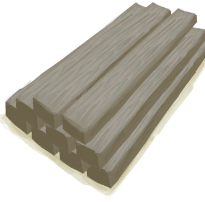

# Log  
> Perfect for building structures or rafts.  
  
<table class="table table-bordered" data-toggle="table"  data-show-header="false"><thead style="display:none"><tr ><th  style="width:50%;text-align:left;vertical-align:top;"  >title</th><th  style="width:50%;text-align:left;vertical-align:top;"  ></th></tr></thead><tr ><td  style="width:50%;text-align:left;vertical-align:top;"  >** Cannot Be Trashed **  **Weight：**2500  **Tag：**	[“Large”](tag_Large.md), [“Heavy”](tag_Heavy.md)</td><td  style="width:50%;text-align:left;vertical-align:top;"  >

<a href="Log.md" style="color:black">Log</a>

</td></tr></tbody></table>  
  
## Got From  

Disassemble trap

[Log Trap](LogTrap.md)

Disassemble trap

[Log Trap](LogTrapTriggered.md)

** With：**[Stone Axe](StoneAxe.md)Clean Log of braches

[Felled Large Tree](LargeTreeFelled.md)

** With：**[“Axe”](tag_Axe.md)Clean Log of braches

[Felled Large Tree](LargeTreeFelled.md)

** With：**[Stone Axe](StoneAxe.md)Clear

[Felled Palm Tree](PalmTreeFelled.md)

** With：**[“Axe”](tag_Axe.md)Clear

[Felled Palm Tree](PalmTreeFelled.md)

** With：**[Stone Axe](StoneAxe.md)Cut Down

[Palm Tree](PalmTree_IH.md)(未实装)

** With：**[Copper Axe](AxeCopper.md)Cut Down

[Palm Tree](PalmTree_IH.md)(未实装)

** With：**[Stone Axe](StoneAxe.md)Clean Branches

[Felled Tropical Almond Tree](TropicalAlmondTreeFelled.md)(未实装)

** With：**[“Axe”](tag_Axe.md)Clean Branches

[Felled Tropical Almond Tree](TropicalAlmondTreeFelled.md)(未实装)

  
  
## Drag With  

<table style="margin-bottom:0px;"><tr><td style="width:40%;text-align:left; background-color:#FEFEFE"><b>With：</b>[

[Stone Axe](StoneAxe.md)](StoneAxe.md)</td><td style="width:40%;font-size:1em;font-weight:bold;background-color:#FEFEFE">Split into two (2h) [“HandAction(Group)”](HandAction.md)</td></tr><tr><td colspan="2"><b>Require：</b>[

[Light](Light.md)](Light.md): <b>10-100</b></td></tr><tr style="background-color:#FFFFFF"><td style=""><b>Receiving：</b>Usage  <b>-2(-10%)</b></td><td style=""><b>Self：</b>→Dismiss</td></tr><tr><td colspan="2"><b>StatChange：</b>[

[Weight](Weight.md)](Weight.md)<b>-8</b>, [

[Stamina](Stamina.md)](Stamina.md)<b>-16</b>, [

[Hand Damage](HandDamage.md)](HandDamage.md)<b>+80</b>, [

[Woodworking(Skill)](Skill_Woodworking.md)](Skill_Woodworking.md)<b>+0.5</b></td></tr><tr><td colspan="2">[

[Half Log](HalfLog.md)](HalfLog.md)(<b>+2</b>)</td></tr></table>
  

<table style="margin-bottom:0px;"><tr><td style="width:40%;text-align:left; background-color:#FEFEFE"><b>With：</b>[“Axe”](tag_Axe.md)</td><td style="width:40%;font-size:1em;font-weight:bold;background-color:#FEFEFE">Split into two (1h30m) </td></tr><tr><td colspan="2"><b>Require：</b>[

[Light](Light.md)](Light.md): <b>10-100</b></td></tr><tr style="background-color:#FFFFFF"><td style=""><b>Receiving：</b>Usage  <b>-2(-4%)</b></td><td style=""><b>Self：</b>→Dismiss</td></tr><tr><td colspan="2"><b>StatChange：</b>[

[Weight](Weight.md)](Weight.md)<b>-6</b>, [

[Stamina](Stamina.md)](Stamina.md)<b>-12</b>, [

[Hand Damage](HandDamage.md)](HandDamage.md)<b>+60</b></td></tr><tr><td colspan="2">[

[Half Log](HalfLog.md)](HalfLog.md)(<b>+2</b>)</td></tr></table>
  
  
## Use In BluePrint  

<a href="Bp_BoarFeeder.md" style="color:black">Boar Feeder</a>

<a href="Bp_Cellar.md" style="color:black">Cellar</a>

<a href="Bp_LogTrap.md" style="color:black">Log Trap</a>

<a href="Bp_MudHut.md" style="color:black">Mud Hut</a>

<a href="Bp_Planks.md" style="color:black">Wooden Planks</a>

<a href="Bp_Raft.md" style="color:black">Raft</a>

  
  
  

