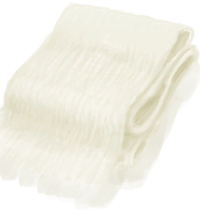

# Loom  
> I could remove the cloth or enlarge it by combining it with more cloth.  
  
<table class="table table-bordered" data-toggle="table"  data-show-header="false"><thead style="display:none"><tr ><th  style="width:50%;text-align:left;vertical-align:top;"  >title</th><th  style="width:50%;text-align:left;vertical-align:top;"  ></th></tr></thead><tr ><td  style="width:50%;text-align:left;vertical-align:top;"  >** Unique On Board **  ** Cannot Be Trashed **</td><td  style="width:50%;text-align:left;vertical-align:top;"  >

<a href="Loom.md" style="color:black">Loom</a>

A Loom is a device used to weave <b>Fiber Cord</b> into <b>Cloth</b>.  Combine 2 <b>Fibers</b> together to get a <b>Cord</b>. Combine 2 <b>Cords</b> together to get a <b>Yarn</b>.  Yarns can be dragged onto an <b>Empty Loom</b> to create cloth which can then be <b>extracted</b> or enlarged by dragging already crafted <b>Cloth</b> onto the <b>Loom</b>.</td></tr></tbody></table>  
  
## Got From  

** With：**[Yarn](YarnFiber.md)Place thread on Loom

[Loom (Empty)(Empty)](LoomEmpty.md)

  
  
## Action  

<table><tr><td rowspan="2" style="width:200px;text-align:center;font-size:1.3em;font-weight:bold">

Make Cloth

30m

</td><td>[“HandAction(Group)”](HandAction.md)</td></tr><tr><td><b>Self：</b>→ [

[Loom (Empty)(Empty)](LoomEmpty.md)](LoomEmpty.md)</td></tr><tr><td colspan="2"><b>Require：</b>[

[Light](Light.md)](Light.md): <b>10-100</b></td></tr><tr><td colspan="2"><b>StatChange：</b>[

[Tailoring(Skill)](Skill_Tailoring.md)](Skill_Tailoring.md)<b>+0.5</b></td></tr><tr><td colspan="2">[

[Small Cloth](ClothSmall.md)](ClothSmall.md)(<b>+1</b>)</td></tr></table>
  
  
  
## Drag With  

<table style="margin-bottom:0px;"><tr><td style="width:40%;text-align:left; background-color:#FEFEFE"><b>With：</b>[

[Small Cloth](ClothSmall.md)](ClothSmall.md)</td><td style="width:40%;font-size:1em;font-weight:bold;background-color:#FEFEFE">Enlarge Cloth (30m) [“HandAction(Group)”](HandAction.md)</td></tr><tr><td colspan="2"><b>Require：</b>[

[Light](Light.md)](Light.md): <b>10-100</b></td></tr><tr style="background-color:#FFFFFF"><td style=""><b>Receiving：</b>→Dismiss</td><td style=""><b>Self：</b>→ [

[Loom (Empty)(Empty)](LoomEmpty.md)](LoomEmpty.md)</td></tr><tr><td colspan="2"><b>StatChange：</b>[

[Tailoring(Skill)](Skill_Tailoring.md)](Skill_Tailoring.md)<b>+0.5</b></td></tr><tr><td colspan="2">[

[Cloth](Cloth.md)](Cloth.md)(<b>+1</b>)</td></tr></table>
  

<table style="margin-bottom:0px;"><tr><td style="width:40%;text-align:left; background-color:#FEFEFE"><b>With：</b>[

[Cloth](Cloth.md)](Cloth.md)</td><td style="width:40%;font-size:1em;font-weight:bold;background-color:#FEFEFE">Enlarge Cloth (30m) [“HandAction(Group)”](HandAction.md)</td></tr><tr><td colspan="2"><b>Require：</b>[

[Light](Light.md)](Light.md): <b>10-100</b></td></tr><tr style="background-color:#FFFFFF"><td style=""><b>Receiving：</b>→Dismiss</td><td style=""><b>Self：</b>→ [

[Loom (Empty)(Empty)](LoomEmpty.md)](LoomEmpty.md)</td></tr><tr><td colspan="2"><b>StatChange：</b>[

[Tailoring(Skill)](Skill_Tailoring.md)](Skill_Tailoring.md)<b>+0.5</b></td></tr><tr><td colspan="2">[

[Large Cloth](ClothLarge.md)](ClothLarge.md)(<b>+1</b>)</td></tr></table>
  

<table style="margin-bottom:0px;"><tr><td style="width:40%;text-align:left; background-color:#FEFEFE"><b>With：</b>[

[Large Cloth](ClothLarge.md)](ClothLarge.md)</td><td style="width:40%;font-size:1em;font-weight:bold;background-color:#FEFEFE">Enlarge Cloth (30m) [“HandAction(Group)”](HandAction.md)</td></tr><tr><td colspan="2"><b>Require：</b>[

[Light](Light.md)](Light.md): <b>10-100</b></td></tr><tr style="background-color:#FFFFFF"><td style=""><b>Receiving：</b>→Dismiss</td><td style=""><b>Self：</b>→ [

[Loom (Empty)(Empty)](LoomEmpty.md)](LoomEmpty.md)</td></tr><tr><td colspan="2"><b>StatChange：</b>[

[Tailoring(Skill)](Skill_Tailoring.md)](Skill_Tailoring.md)<b>+0.5</b></td></tr><tr><td colspan="2">[

[Very Large Cloth](ClothVeryLarge.md)](ClothVeryLarge.md)(<b>+1</b>)</td></tr></table>
  
  

