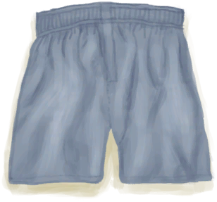
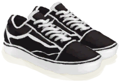
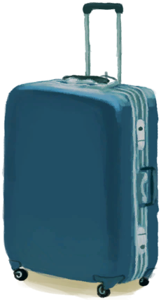

# Luggage(未实装)  
> I can store things inside.  
  
<table class="table table-bordered" data-toggle="table"  data-show-header="false"><thead style="display:none"><tr ><th  style="width:50%;text-align:left;vertical-align:top;"  >title</th><th  style="width:50%;text-align:left;vertical-align:top;"  ></th></tr></thead><tr ><td  style="width:50%;text-align:left;vertical-align:top;"  >** DoseNotPile **  **Weight：**500  **Tag：**	[“Bag”](tag_Bag.md)  **Slots：**9  **Starting Cards：**

[

[Underwear](Underwear.md)](Underwear.md)(2)

[

[Socks](Socks.md)](Socks.md)(2)

[

[Sneakers](Sneakers.md)](Sneakers.md)

[

[Papers](Papers.md)](Papers.md)(2)

[

[Chocolate](Chocolate.md)](Chocolate.md)(2)

  
  
  **过滤器：**~~[“Bag”](tag_Bag.md)~~ , ~~[“Large”](tag_Large.md)~~ , ~~[“Fire Source”](tag_FireSource.md)~~ , ~~[“Fire”](tag_Fire.md)~~ , ~~[“Spillable”](tag_Spillable.md)~~  **WeightCapacity：**1000  **WeightRedution：**-1000</td><td  style="width:50%;text-align:left;vertical-align:top;"  >

<a href="LuggageB.md" style="color:black">Luggage</a>

</td></tr></tbody></table>  
  

