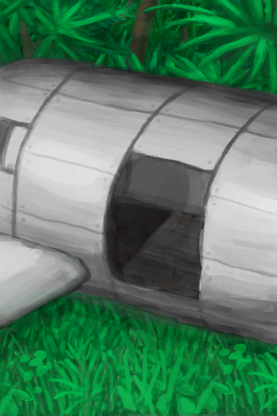

# Luggage  
> I can store things inside.  
  
<table class="table table-bordered" data-toggle="table"  data-show-header="false"><thead style="display:none"><tr ><th  style="width:50%;text-align:left;vertical-align:top;"  >title</th><th  style="width:50%;text-align:left;vertical-align:top;"  ></th></tr></thead><tr ><td  style="width:50%;text-align:left;vertical-align:top;"  >** DoseNotPile **  **Weight：**500  **Tag：**	[“Bag”](tag_Bag.md)  **Slots：**13  **Starting Cards：**

[

[Papers](Papers.md)](Papers.md)(6)

[

[Glasses](Glasses.md)](Glasses.md)

[

[Chocolate](Chocolate.md)](Chocolate.md)(3)

[

[T-Shirt](T-Shirt.md)](T-Shirt.md)

[

[Socks](Socks.md)](Socks.md)(2)

  
  
  **过滤器：**~~[“Bag”](tag_Bag.md)~~ , ~~[“Large”](tag_Large.md)~~ , ~~[“Fire Source”](tag_FireSource.md)~~ , ~~[“Fire”](tag_Fire.md)~~ , ~~[“Spillable”](tag_Spillable.md)~~  **WeightCapacity：**1000  **WeightRedution：**-1000</td><td  style="width:50%;text-align:left;vertical-align:top;"  >

<a href="LuggageC.md" style="color:black">Luggage</a>

</td></tr></tbody></table>  
  
## Got From  

Pick Up

[Luggage](LuggageCPlaced.md)

Perk Effect

[Plane Crash](Pk_1_PlaneCrash.md)

  
  
## Action  

<table><tr><td rowspan="2" style="width:200px;text-align:center;font-size:1.3em;font-weight:bold">

Place

</td><td></td></tr><tr><td><b>Self：</b>→ [

[Luggage](LuggageCPlaced.md)](LuggageCPlaced.md)</td></tr></table>
  
  
  

