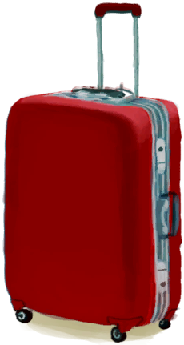

# Luggage  
> I can store things inside.  
  
<table class="table table-bordered" data-toggle="table"  data-show-header="false"><thead style="display:none"><tr ><th  style="width:50%;text-align:left;vertical-align:top;"  >title</th><th  style="width:50%;text-align:left;vertical-align:top;"  ></th></tr></thead><tr ><td  style="width:50%;text-align:left;vertical-align:top;"  >** DoseNotPile **  **Weight：**500  **Tag：**	[“Bag”](tag_Bag.md)  **WeightCapacity：**1000  **WeightRedution：**-1000</td><td  style="width:50%;text-align:left;vertical-align:top;"  >

<a href="LuggageCPlaced.md" style="color:black">Luggage</a>

</td></tr></tbody></table>  
  
## Got From  

Place

[Luggage](LuggageC.md)

  
  
## Action  

<table><tr><td rowspan="2" style="width:200px;text-align:center;font-size:1.3em;font-weight:bold">

Pick Up

</td><td></td></tr><tr><td><b>Self：</b>→ [

[Luggage](LuggageC.md)](LuggageC.md)</td></tr></table>
  
  
  

