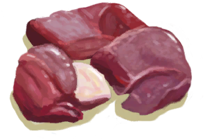

# Macaque Carcass  
> A dead Macaque. Need a knife or sharpened stone to access its meat.  
  
<table class="table table-bordered" data-toggle="table"  data-show-header="false"><thead style="display:none"><tr ><th  style="width:50%;text-align:left;vertical-align:top;"  >title</th><th  style="width:50%;text-align:left;vertical-align:top;"  ></th></tr></thead><tr ><td  style="width:50%;text-align:left;vertical-align:top;"  >**Weight：**750  **Tag：**	[“Feed”](tag_Meat.md)</td><td  style="width:50%;text-align:left;vertical-align:top;"  >

<a href="MacaqueCarcass.md" style="color:black">Macaque Carcass</a>

"Macaques can be found in the densely forested areas of the Island and have a tendency to <b>Steal</b> your things</td></tr></tbody></table>  
  
## Got From  

Catch Prey

[Log Trap](LogTrap.md)

Continue

["I made it(Event)](Event_MacaqueDenFightMixedSuccess.md)

Continue

[I made it!(Event)](Event_MacaqueDenFightSuccess.md)

Continue

["I got it(Event)](Event_MacaqueFightMixedSuccess.md)

Continue

[The Macaque is down!(Event)](Event_MacaqueFightSuccess.md)

Continue

[The Macaque is down!(Event)](Event_MacaqueUndeadFightSuccess.md)(未实装)

** With：**[“Cutter”](tag_Cutter.md)Put Down

[Trapped Macaque](CageTrapMacaque.md)

Transform

[Trapped Macaque](CageTrapMacaque.md)

Dead of Thirst

[Trapped Macaque](CageTrapMacaque.md)

** With：**[“Cutter”](tag_Cutter.md) , [“Spear T1”](tag_Spear.md)Murder!

[Macaque Friend](MacaqueFriend.md)

Transform

[Macaque Friend](MacaqueFriend.md)

Dead of Thirst

[Macaque Friend](MacaqueFriend.md)

** With：**[“Cutter”](tag_Cutter.md)Put Down

[Wounded Macaque](MacaqueWounded.md)

Transform

[Wounded Macaque](MacaqueWounded.md)

Dead of Thirst

[Wounded Macaque](MacaqueWounded.md)

** With：**[Dynamite(On)](DynamiteOn.md)Revenge!

[Macaque Den(Jungle Highlands)](MacaqueDenEntrance.md)

  
  
## Drag With  

<table style="margin-bottom:0px;"><tr><td style="width:40%;text-align:left; background-color:#FEFEFE"><b>With：</b>[

[Obsidian Knife](KnifeObsidian.md)](KnifeObsidian.md)</td><td style="width:40%;font-size:1em;font-weight:bold;background-color:#FEFEFE">Butcher (30m) [“HandAction(Group)”](HandAction.md)</td></tr><tr><td colspan="2"><b>Require：</b>[

[Light](Light.md)](Light.md): <b>10-100</b></td></tr><tr style="background-color:#FFFFFF"><td style=""><b>Receiving：</b>Usage  <b>-1</b></td><td style=""><b>Self：</b>→Dismiss</td></tr><tr><td colspan="2"><b>StatChange：</b>[

[Filth](Filth.md)](Filth.md)<b>+35</b></td></tr><tr><td colspan="2">[

[Fresh Skin](SkinFresh.md)](SkinFresh.md)(<b>+1</b>), [

[Macaque Meat](MacaqueMeat.md)](MacaqueMeat.md)(<b>+2</b>), [

[Bones](Bones.md)](Bones.md)(<b>+1</b>)</td></tr></table>
  

<table style="margin-bottom:0px;"><tr><td style="width:40%;text-align:left; background-color:#FEFEFE"><b>With：</b>[“Cutter”](tag_Cutter.md)</td><td style="width:40%;font-size:1em;font-weight:bold;background-color:#FEFEFE">Butcher (45m) [“HandAction(Group)”](HandAction.md)</td></tr><tr><td colspan="2"><b>Require：</b>[

[Light](Light.md)](Light.md): <b>10-100</b></td></tr><tr style="background-color:#FFFFFF"><td style=""><b>Receiving：</b>Usage  <b>-1(-0.67%)</b></td><td style=""><b>Self：</b>→Dismiss</td></tr><tr><td colspan="2"><b>StatChange：</b>[

[Filth](Filth.md)](Filth.md)<b>+35</b></td></tr><tr><td colspan="2">[

[Fresh Skin](SkinFresh.md)](SkinFresh.md)(<b>+1</b>), [

[Macaque Meat](MacaqueMeat.md)](MacaqueMeat.md)(<b>+2</b>), [

[Bones](Bones.md)](Bones.md)(<b>+1</b>)</td></tr></table>
  
  
## Drag To  

[Dog Friend](DogFriend.md)

  
  
## Durability   

<table style="margin-bottom:0px;"><tr><td style="width:30%;text-align:left; background-color:#FEFEFE;font-size:1.3em;font-weight:bold;">Spoilage</td><td style="font-size:1em;background-color:#FEFEFE">Starting：192 , Max：192 -1/TP , Duration ：2d</td></tr><tr style="background-color:#FFFFFF"><td colspan=2>** On Zero： ** Self: →Dismiss [

[Rotten Remains](RottenRemains.md)](RottenRemains.md)(<b>+3</b>)</td></tr></table>
  

