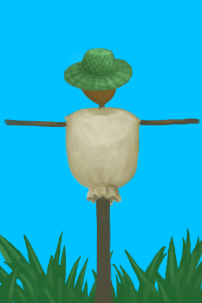

# Macaque Fear  
  

<b>Base Value: </b> 0 
  

<b>Value Range: </b> 0 ~ 10000 
  

<b>Base Rate: </b> -1 / /TP 
  
## Statuses  

<table><tr style="height:2em;"><td style="background-color:#F0F0F0;text-align:center;width:180px;font-size:1.4em;font-weight:bold;vertical-align:middle;">
0 ～ 500

0% ～ 5%
</td><td colspan=2 style="font-size:1.1em;vertical-align:middle;background-color:#F9F9F9;">
<b>Comfortable</b>

</td></tr><tr><td colspan=2></td></tr><tr style="height:2em;"><td style="background-color:#F0F0F0;text-align:center;width:180px;font-size:1.4em;font-weight:bold;vertical-align:middle;">
501 ～ 1000

5% ～ 10%
</td><td colspan=2 style="font-size:1.1em;vertical-align:middle;background-color:#F9F9F9;">
<b>Brave</b>

</td></tr><tr><td colspan=2></td></tr><tr style="height:2em;"><td style="background-color:#F0F0F0;text-align:center;width:180px;font-size:1.4em;font-weight:bold;vertical-align:middle;">
1001 ～ 1500

10% ～ 15%
</td><td colspan=2 style="font-size:1.1em;vertical-align:middle;background-color:#F9F9F9;">
<b>Cautious</b>

</td></tr><tr><td colspan=2></td></tr><tr style="height:2em;"><td style="background-color:#F0F0F0;text-align:center;width:180px;font-size:1.4em;font-weight:bold;vertical-align:middle;">
1501 ～ 2000

15% ～ 20%
</td><td colspan=2 style="font-size:1.1em;vertical-align:middle;background-color:#F9F9F9;">
<b>Scared</b>

</td></tr><tr><td colspan=2></td></tr><tr style="height:2em;"><td style="background-color:#F0F0F0;text-align:center;width:180px;font-size:1.4em;font-weight:bold;vertical-align:middle;">
2001 ～ 10000

20% ～ 100%
</td><td colspan=2 style="font-size:1.1em;vertical-align:middle;background-color:#F9F9F9;">
<b>Terrified</b>

</td></tr><tr><td colspan=2></td></tr></table>
  
## Addition Change By  
<table class="table table-bordered" data-toggle="table"  ><thead style=""><tr ><th  style="text-align:left;vertical-align:top;"  >From</th><th  style="text-align:left;vertical-align:top;"  >Operation</th><th  style="text-align:left;vertical-align:top;"  >Value</th></tr></thead><tr ><td  style="text-align:left;vertical-align:top;"  >

[Macaque Curse](Pk_1_MacaqueCurse.md)</td><td  style="text-align:left;vertical-align:top;"  >Perk Effect</td><td  style="text-align:left;vertical-align:top;"  >addition-10</td></tr></tbody></table>  
  
## Change By  
<table class="table table-bordered" data-toggle="table"  ><thead style=""><tr ><th  style="text-align:left;vertical-align:top;"  >From</th><th  style="text-align:left;vertical-align:top;"  >Operation</th><th  style="text-align:left;vertical-align:top;"  data-sortable="true"  >Value</th></tr></thead><tr ><td  style="text-align:left;vertical-align:top;"  >[

[Macaque Den(Jungle Highlands)](MacaqueDenEntrance.md)](MacaqueDenEntrance.md)</td><td  style="text-align:left;vertical-align:top;"  >Revenge! ** With：**[Dynamite(On)](DynamiteOn.md)</td><td  style="text-align:left;vertical-align:top;"  >10000</td></tr><tr ><td  style="text-align:left;vertical-align:top;"  >[

[Scarecrow](Scarecrow.md)](Scarecrow.md)</td><td  style="text-align:left;vertical-align:top;"  >Passive Effects</td><td  style="text-align:left;vertical-align:top;"  >1000</td></tr><tr ><td  style="text-align:left;vertical-align:top;"  >[

[A Macaque!(Event)](Event_MacaqueFightRaid.md)](Event_MacaqueFightRaid.md)</td><td  style="text-align:left;vertical-align:top;"  >Attack with Spear!</td><td  style="text-align:left;vertical-align:top;"  >1000</td></tr><tr ><td  style="text-align:left;vertical-align:top;"  >[

[A Macaque!(Event)](Event_MacaqueFightRaid.md)](Event_MacaqueFightRaid.md)</td><td  style="text-align:left;vertical-align:top;"  >Attack with Bow!</td><td  style="text-align:left;vertical-align:top;"  >1000</td></tr><tr ><td  style="text-align:left;vertical-align:top;"  >[

[I made it!(Event)](Event_MacaqueDenFightSuccess.md)](Event_MacaqueDenFightSuccess.md)</td><td  style="text-align:left;vertical-align:top;"  >Continue</td><td  style="text-align:left;vertical-align:top;"  >750</td></tr><tr ><td  style="text-align:left;vertical-align:top;"  >[

[Dog Friend](DogFriend.md)](DogFriend.md)</td><td  style="text-align:left;vertical-align:top;"  >Passive Effects</td><td  style="text-align:left;vertical-align:top;"  >500</td></tr><tr ><td  style="text-align:left;vertical-align:top;"  >[

[A Macaque!(Event)](Event_MacaqueFightRaid.md)](Event_MacaqueFightRaid.md)</td><td  style="text-align:left;vertical-align:top;"  >Attack with Spear!</td><td  style="text-align:left;vertical-align:top;"  >500</td></tr><tr ><td  style="text-align:left;vertical-align:top;"  >[

[A Macaque!(Event)](Event_MacaqueFightRaid.md)](Event_MacaqueFightRaid.md)</td><td  style="text-align:left;vertical-align:top;"  >Attack with Bow!</td><td  style="text-align:left;vertical-align:top;"  >500</td></tr><tr ><td  style="text-align:left;vertical-align:top;"  >[

[The Macaque is down!(Event)](Event_MacaqueFightSuccess.md)](Event_MacaqueFightSuccess.md)</td><td  style="text-align:left;vertical-align:top;"  >Continue</td><td  style="text-align:left;vertical-align:top;"  >500</td></tr><tr ><td  style="text-align:left;vertical-align:top;"  >[

["I made it(Event)](Event_MacaqueDenFightMixedSuccess.md)](Event_MacaqueDenFightMixedSuccess.md)</td><td  style="text-align:left;vertical-align:top;"  >Continue</td><td  style="text-align:left;vertical-align:top;"  >250</td></tr><tr ><td  style="text-align:left;vertical-align:top;"  >[

["I got it(Event)](Event_MacaqueFightMixedSuccess.md)](Event_MacaqueFightMixedSuccess.md)</td><td  style="text-align:left;vertical-align:top;"  >Continue</td><td  style="text-align:left;vertical-align:top;"  >250</td></tr><tr ><td  style="text-align:left;vertical-align:top;"  >[

[A Macaque!(Event)](Event_MacaqueFightRaid.md)](Event_MacaqueFightRaid.md)</td><td  style="text-align:left;vertical-align:top;"  >Attack with Spear!</td><td  style="text-align:left;vertical-align:top;"  >250</td></tr><tr ><td  style="text-align:left;vertical-align:top;"  >[

[Macaque(Event)](Event_MacaqueRaidRummaging.md)](Event_MacaqueRaidRummaging.md)</td><td  style="text-align:left;vertical-align:top;"  >Watch impotently...</td><td  style="text-align:left;vertical-align:top;"  >-250</td></tr><tr ><td  style="text-align:left;vertical-align:top;"  >[

[Ouch!(Event)](Event_MacaqueDenFightBadFailure.md)](Event_MacaqueDenFightBadFailure.md)</td><td  style="text-align:left;vertical-align:top;"  >Continue</td><td  style="text-align:left;vertical-align:top;"  >-500</td></tr><tr ><td  style="text-align:left;vertical-align:top;"  >[

[Ouch!(Event)](Event_MacaqueDenFightFailedRetreat.md)](Event_MacaqueDenFightFailedRetreat.md)</td><td  style="text-align:left;vertical-align:top;"  >Continue</td><td  style="text-align:left;vertical-align:top;"  >-500</td></tr><tr ><td  style="text-align:left;vertical-align:top;"  >[

[I can't get in!(Event)](Event_MacaqueDenFightFailure.md)](Event_MacaqueDenFightFailure.md)</td><td  style="text-align:left;vertical-align:top;"  >Continue</td><td  style="text-align:left;vertical-align:top;"  >-500</td></tr><tr ><td  style="text-align:left;vertical-align:top;"  >[

[Ouch!(Event)](Event_MacaqueFightBadFailure.md)](Event_MacaqueFightBadFailure.md)</td><td  style="text-align:left;vertical-align:top;"  >Continue</td><td  style="text-align:left;vertical-align:top;"  >-500</td></tr><tr ><td  style="text-align:left;vertical-align:top;"  >[

[Ouch!(Event)](Event_MacaqueFightFailedRetreat.md)](Event_MacaqueFightFailedRetreat.md)</td><td  style="text-align:left;vertical-align:top;"  >Continue</td><td  style="text-align:left;vertical-align:top;"  >-500</td></tr><tr ><td  style="text-align:left;vertical-align:top;"  >[

[It Escaped!(Event)](Event_MacaqueFightFailure.md)](Event_MacaqueFightFailure.md)</td><td  style="text-align:left;vertical-align:top;"  >Continue</td><td  style="text-align:left;vertical-align:top;"  >-500</td></tr><tr ><td  style="text-align:left;vertical-align:top;"  >[

[A Macaque!(Event)](Event_MacaqueFightRaid.md)](Event_MacaqueFightRaid.md)</td><td  style="text-align:left;vertical-align:top;"  >Attack with Spear!</td><td  style="text-align:left;vertical-align:top;"  >-500</td></tr><tr ><td  style="text-align:left;vertical-align:top;"  >[

[A Macaque!(Event)](Event_MacaqueFightRaid.md)](Event_MacaqueFightRaid.md)</td><td  style="text-align:left;vertical-align:top;"  >Attack with Bow!</td><td  style="text-align:left;vertical-align:top;"  >-500</td></tr><tr ><td  style="text-align:left;vertical-align:top;"  >[

[A Macaque!(Event)](Event_MacaqueFightRaid.md)](Event_MacaqueFightRaid.md)</td><td  style="text-align:left;vertical-align:top;"  >Attack with Gun!</td><td  style="text-align:left;vertical-align:top;"  >-500</td></tr><tr ><td  style="text-align:left;vertical-align:top;"  >[

[A Macaque!(Event)](Event_MacaqueFightRaid.md)](Event_MacaqueFightRaid.md)</td><td  style="text-align:left;vertical-align:top;"  >Attack with Sling!</td><td  style="text-align:left;vertical-align:top;"  >-500</td></tr><tr ><td  style="text-align:left;vertical-align:top;"  >[

[It Escaped!(Event)](Event_MacaqueUndeadFightFailure.md)](Event_MacaqueUndeadFightFailure.md)(未实装)</td><td  style="text-align:left;vertical-align:top;"  >Continue</td><td  style="text-align:left;vertical-align:top;"  >-500</td></tr></tbody></table>  
  

