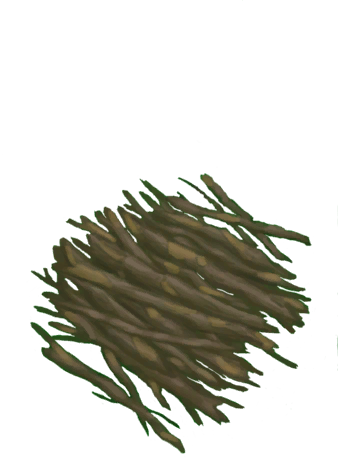

# Mangrove Forest  
> A flooded forest of twisted roots and mangrove trees.  
  

<a href="Mangroves.md" style="color:black">Mangrove Forest</a>

<a href="Bay.md" style="color:black">Bay</a>

<a href="DesolateBeach.md" style="color:black">Desolate Beach</a>

<a href="GrasslandsW.md" style="color:black">Western Grasslands</a>

<a href="Sea_Mangroves.md" style="color:black">Sea</a>

  
  
<table class="table table-bordered" data-toggle="table"  data-show-header="false"><thead style="display:none"><tr ><th  style="width:50%;text-align:left;vertical-align:top;"  >title</th><th  style="width:50%;text-align:left;vertical-align:top;"  data-sortable="true"  ></th></tr></thead><tr ><td  style="width:50%;text-align:left;vertical-align:top;"  >** Unique On Board **  **Environment：**[Mangrove Forest(Environment)](Env_Mangroves.md)  ** EnvironmentEffect: ** [

[Rain Protection](RainProtection.md)](RainProtection.md)<b>+2</b> [

[Heat Insulation](InsulationHeat.md)](InsulationHeat.md)<b>+2</b> [

[Sun Protection](SunProtection.md)](SunProtection.md)<b>+2</b> [

[Bug Population](BugPopulation.md)](BugPopulation.md)<b>+2</b> [

[Hunter's Proximity](HuntersProximity.md)](HuntersProximity.md)<b>-0.5</b> [

[Land Sickness](LandSickness.md)](LandSickness.md)addition<b>-8</b></td><td  style="width:50%;text-align:left;vertical-align:top;"  ></td></tr></tbody></table>  
  
## Exploration  
<table class="table table-bordered" data-toggle="table"  ><thead style=""><tr ><th  style="text-align:left;vertical-align:top;"  >Progress</th><th  style="text-align:left;vertical-align:top;"  >Target</th></tr></thead><tr ><td  style="text-align:left;vertical-align:top;"  >50%</td><td  style="text-align:left;vertical-align:top;"  >[To Grasslands(Mangrove Forest)](Path_MangrovesToGrasslandsW.md)</td></tr><tr ><td  style="text-align:left;vertical-align:top;"  >100%</td><td  style="text-align:left;vertical-align:top;"  >[Area Explored(Event)(Mangrove Forest)](Event_MangrovesExplored.md)</td></tr></tbody></table>  
  
## Action  

<table><tr><td rowspan="2" style="width:200px;text-align:center;font-size:1.3em;font-weight:bold">

Explore

15m

</td><td>[“LegAction(Group)”](LegAction.md)</td></tr><tr><td></td></tr><tr><td colspan="2"><b>Require：</b>[

[Light](Light.md)](Light.md): <b>10-100</b></td></tr><tr><td colspan="2"><b>StatChange：</b>[

[Foot Damage](FootDamage.md)](FootDamage.md)<b>+8</b>, [

[Stamina](Stamina.md)](Stamina.md)<b>-4</b>, [

[Stress](Stress.md)](Stress.md)<b>-10</b>, [Exploration Mangroves](Exploration_Mangroves.md)<b>+1</b>, [TV Mangroves - Explore](TV_MangrovesExplore.md)<b>+1</b></td></tr><tr><td colspan="2">

<table style="margin-bottom:3px;"><tr><td rowspan=2 style="text-align:center" width="80px">
Base Weight

300
</td><td style="font-size:0.6em;line-height:0.6em;font-weight:bold">Palm Fronds</td></tr><tr><td>[

[Palm Fronds](PalmFronds.md)](PalmFronds.md)(<b>+3～+6</b>)</td></tr></table>

<table style="margin-bottom:3px;"><tr><td rowspan=2 style="text-align:center" width="80px">
Base Weight

200000
</td><td style="font-size:0.6em;line-height:0.6em;font-weight:bold">Small Tree</td></tr><tr><td>[

[Small Tree](SmallTree.md)](SmallTree.md)(<b>+1</b>)</td></tr></table>

<table style="margin-bottom:3px;"><tr><td rowspan=2 style="text-align:center" width="80px">
Base Weight

200000
</td><td style="font-size:0.6em;line-height:0.6em;font-weight:bold">Small Palm</td></tr><tr><td>[

[Small Palm](SmallPalm.md)](SmallPalm.md)(<b>+1</b>)</td></tr></table>

<table style="margin-bottom:3px;"><tr><td rowspan=2 style="text-align:center" width="80px">
Base Weight

100
</td><td style="font-size:0.6em;line-height:0.6em;font-weight:bold">Stone❗5 limit</td></tr><tr><td>[

[Stone](Stone.md)](Stone.md)(<b>+1</b>)</td></tr></table>

<table style="margin-bottom:3px;"><tr><td rowspan=2 style="text-align:center" width="80px">
Base Weight

0
</td><td style="font-size:0.6em;line-height:0.6em;font-weight:bold">Supply Crate</td></tr><tr><td>[

[Supply Capsule](TV_SupplyCapsule.md)](TV_SupplyCapsule.md)(<b>+1</b>)</td></tr><tr><td colspan=2><li>[

[TV Mangroves](TV_Mangroves.md)](TV_Mangroves.md) in <b>1</b>, weight<b>+50</b></li><li>[TV Mangroves - Explore](TV_MangrovesExplore.md) in <b>0～9</b>, weight<b>-999</b></li></td></tr></table>

<table style="margin-bottom:3px;"><tr><td rowspan=2 style="text-align:center" width="80px">
Base Weight

200000
</td><td style="font-size:0.6em;line-height:0.6em;font-weight:bold">Tree</td></tr><tr><td>[

[Large Tree](LargeTree.md)](LargeTree.md)(<b>+1</b>)</td></tr></table>

<table style="margin-bottom:3px;"><tr><td rowspan=2 style="text-align:center" width="80px">
Base Weight

50
</td><td style="font-size:0.6em;line-height:0.6em;font-weight:bold">Heavy Stone❗2 limit</td></tr><tr><td>[

[Heavy Stone](StoneHeavy.md)](StoneHeavy.md)(<b>+1</b>)</td></tr></table>

<table style="margin-bottom:3px;"><tr><td rowspan=2 style="text-align:center" width="80px">
Base Weight

200
</td><td style="font-size:0.6em;line-height:0.6em;font-weight:bold">Mud Deposit</td></tr><tr><td>[

[Mud Deposit](MudDeposit.md)](MudDeposit.md)(<b>+1</b>)</td></tr></table>

<table style="margin-bottom:3px;"><tr><td rowspan=2 style="text-align:center" width="80px">
Base Weight

0
</td><td style="font-size:0.6em;line-height:0.6em;font-weight:bold">Crab</td></tr><tr><td>[

[Crab](Crab.md)](Crab.md)(<b>+1</b>)[Population Crab](Pop_Crab.md)<b>-1000</b></td></tr><tr><td colspan=2><li>[Population Crab](Pop_Crab.md) in <b>1000～60000</b>, weight<b>+100～+300</b></li><li>[

[Eyesight](Myopia.md)](Myopia.md) in <b>1～3</b>, weight<b>-100～-200</b></li></td></tr></table>

<table style="margin-bottom:3px;"><tr><td rowspan=2 style="text-align:center" width="80px">
Base Weight

0
</td><td style="font-size:0.6em;line-height:0.6em;font-weight:bold">Nipa</td></tr><tr><td>[

[Nipa Palm](NipaPalm.md)](NipaPalm.md)(<b>+1</b>)[Mangroves Nipa Palms](Nipa_MangrovesPop.md)<b>-1000</b></td></tr><tr><td colspan=2><li>[Mangroves Nipa Palms](Nipa_MangrovesPop.md) in <b>1000～8000</b>, weight<b>+25～+200</b></li><li>[

[Eyesight](Myopia.md)](Myopia.md) in <b>1～3</b>, weight<b>-50～-100</b></li><li>[

[Herbology(Skill)](Skill_Herbology.md)](Skill_Herbology.md) in <b>0～150</b>, weight<b>-100～+0</b></li></td></tr></table>

<table style="margin-bottom:3px;"><tr><td rowspan=2 style="text-align:center" width="80px">
Base Weight

400
</td><td style="font-size:0.6em;line-height:0.6em;font-weight:bold">Snake Grass</td></tr><tr><td>[

[Snakegrass Patch](SnakegrassPatch.md)](SnakegrassPatch.md)(<b>+1</b>)</td></tr><tr><td colspan=2><li>[

[Herbology(Skill)](Skill_Herbology.md)](Skill_Herbology.md) in <b>0～150</b>, weight<b>+0～+200</b></li></td></tr></table>

<table style="margin-bottom:3px;"><tr><td rowspan=2 style="text-align:center" width="80px">
Base Weight

0
</td><td style="font-size:0.6em;line-height:0.6em;font-weight:bold">Ginger</td></tr><tr><td>[

[Ginger Plant](GingerPlant.md)](GingerPlant.md)(<b>+1</b>)[Mangroves Ginger](Ginger_MangrovesPop.md)<b>-1000</b></td></tr><tr><td colspan=2><li>[Mangroves Ginger](Ginger_MangrovesPop.md) in <b>1000～15000</b>, weight<b>+25～+150</b></li><li>[

[Eyesight](Myopia.md)](Myopia.md) in <b>1～3</b>, weight<b>-20～-50</b></li><li>[

[Herbology(Skill)](Skill_Herbology.md)](Skill_Herbology.md) in <b>0～150</b>, weight<b>-100～+0</b></li></td></tr></table>

<table style="margin-bottom:3px;"><tr><td rowspan=2 style="text-align:center" width="80px">
Base Weight

100
</td><td style="font-size:0.6em;line-height:0.6em;font-weight:bold">Krait</td></tr><tr><td>[

[A Sea Krait!!(Event)](Event_SeaKraitStep.md)](Event_SeaKraitStep.md)(<b>+1</b>)</td></tr><tr><td colspan=2><li>[

[Eyesight](Myopia.md)](Myopia.md) in <b>1～3</b>, weight<b>+20～+60</b></li></td></tr></table>

<table style="margin-bottom:3px;"><tr><td rowspan=2 style="text-align:center" width="80px">
Base Weight

0
</td><td style="font-size:0.6em;line-height:0.6em;font-weight:bold">Monitor Encounter</td></tr><tr><td>[

[A Monitor Lizard!(Event)(Cave)](Event_MonitorFight.md)](Event_MonitorFight.md)(<b>+1</b>)</td></tr><tr><td colspan=2><li>[First Month Counter](FirstMonthCounter.md) in <b>0～672</b>, weight<b>-1000</b></li><li>[Population Monitors](Pop_Monitor.md) in <b>1000～14000</b>, weight<b>+10～+25</b></li><li>[

[Eyesight](Myopia.md)](Myopia.md) in <b>1～3</b>, weight<b>+0</b></li><li>[Exploration Mangroves](Exploration_Mangroves.md) in <b>0～4</b>, weight<b>-1000</b></li><li>[“Fight Event”](tag_FightEvent.md) On *Hand/Board*，Weight<b>-999999</b>(Stackable),</li></td></tr></table>

<table style="margin-bottom:3px;"><tr><td rowspan=2 style="text-align:center" width="80px">
Base Weight

0
</td><td style="font-size:0.6em;line-height:0.6em;font-weight:bold">Drone Encounter</td></tr><tr><td>[

[Attack Drone!(Event)](Event_DroneFight.md)](Event_DroneFight.md)(<b>+1</b>)</td></tr><tr><td colspan=2><li>[Island Drones](Pop_Drone.md) in <b>1000～4000</b>, weight<b>+10～+75</b></li><li>[

[Eyesight](Myopia.md)](Myopia.md) in <b>1～3</b>, weight<b>+0</b></li><li>[“Fight Event”](tag_FightEvent.md) On *Hand/Board*，Weight<b>-999999</b>(Stackable),</li></td></tr></table>
<button class="btn btn-secondary btn-sm" style="" data-toggle="modal" onclick="setCollectionDataBase64('eyJ0aXRsZSI6IlNpbXVsYXRvcjogRXhwbG9yZSAoTWFuZ3JvdmUgRm9yZXN0KSIsImNvbGxlY3Rpb25zIjpbeyJkcm9wIjoiPGRpdiBzdHlsZT1cIndpZHRoOjI1cHg7ZGlzcGxheTppbmxpbmUtYmxvY2s7dGV4dC1hbGlnbjpjZW50ZXJcIj48aW1nIGRlY29kaW5nPVwiYXN5bmNcIiBzcmM9XCJTcHJpdGUvUGFsbVRyZWVMZWF2ZXMucG5nXCIgaHJlZj1cImEubWRcIiBzdHlsZT1cIm1heC13aWR0aDoyNXB4O21heC1oZWlnaHQ6MjVweDtcIj48L2Rpdj5QYWxtIEZyb25kcyIsImJhc2UiOjMwMCwiY29uZGl0aW9uIjpbXX0seyJkcm9wIjoiPGRpdiBzdHlsZT1cIndpZHRoOjI1cHg7ZGlzcGxheTppbmxpbmUtYmxvY2s7dGV4dC1hbGlnbjpjZW50ZXJcIj48aW1nIGRlY29kaW5nPVwiYXN5bmNcIiBzcmM9XCJTcHJpdGUvU21hbGxUcmVlLnBuZ1wiIGhyZWY9XCJhLm1kXCIgc3R5bGU9XCJtYXgtd2lkdGg6MjVweDttYXgtaGVpZ2h0OjI1cHg7XCI+PC9kaXY+U21hbGwgVHJlZSIsImJhc2UiOjIwMDAwMCwiY29uZGl0aW9uIjpbXSwiaXNVbmlxdWUiOnRydWV9LHsiZHJvcCI6IjxkaXYgc3R5bGU9XCJ3aWR0aDoyNXB4O2Rpc3BsYXk6aW5saW5lLWJsb2NrO3RleHQtYWxpZ246Y2VudGVyXCI+PGltZyBkZWNvZGluZz1cImFzeW5jXCIgc3JjPVwiU3ByaXRlL1NtYWxsUGFsbS5wbmdcIiBocmVmPVwiYS5tZFwiIHN0eWxlPVwibWF4LXdpZHRoOjI1cHg7bWF4LWhlaWdodDoyNXB4O1wiPjwvZGl2PlNtYWxsIFBhbG0iLCJiYXNlIjoyMDAwMDAsImNvbmRpdGlvbiI6W10sImlzVW5pcXVlIjp0cnVlfSx7ImRyb3AiOiI8ZGl2IHN0eWxlPVwid2lkdGg6MjVweDtkaXNwbGF5OmlubGluZS1ibG9jazt0ZXh0LWFsaWduOmNlbnRlclwiPjxpbWcgZGVjb2Rpbmc9XCJhc3luY1wiIHNyYz1cIlNwcml0ZS9UVkNyYXRlLnBuZ1wiIGhyZWY9XCJhLm1kXCIgc3R5bGU9XCJtYXgtd2lkdGg6MjVweDttYXgtaGVpZ2h0OjI1cHg7XCI+PC9kaXY+U3VwcGx5IENhcHN1bGUiLCJiYXNlIjowLCJjb25kaXRpb24iOlt7ImtleSI6IlRWX01hbmdyb3ZlcyIsInRpdGxlIjoiVFYgTWFuZ3JvdmVzIiwidHlwZSI6InJhbmdlIiwibWF4IjpbMCwxXSwicmFuZ2UiOlsxLDFdLCJ3ZWlnaHQiOls1MCw1MF0sImRlZmF1bHRWYWx1ZSI6MCwid2hlbk91dE9mUmFuZ2UiOjB9LHsia2V5IjoiVFZfTWFuZ3JvdmVzRXhwbG9yZSIsInRpdGxlIjoiVFYgTWFuZ3JvdmVzIC0gRXhwbG9yZSIsInR5cGUiOiJyYW5nZSIsIm1heCI6WzAsMjBdLCJyYW5nZSI6WzAsOV0sIndlaWdodCI6Wy05OTksLTk5OV0sImRlZmF1bHRWYWx1ZSI6MCwid2hlbk91dE9mUmFuZ2UiOjB9XX0seyJkcm9wIjoiPGRpdiBzdHlsZT1cIndpZHRoOjI1cHg7ZGlzcGxheTppbmxpbmUtYmxvY2s7dGV4dC1hbGlnbjpjZW50ZXJcIj48aW1nIGRlY29kaW5nPVwiYXN5bmNcIiBzcmM9XCJTcHJpdGUvQ290dG9ud29vZFRyZWUucG5nXCIgaHJlZj1cImEubWRcIiBzdHlsZT1cIm1heC13aWR0aDoyNXB4O21heC1oZWlnaHQ6MjVweDtcIj48L2Rpdj5MYXJnZSBUcmVlIiwiYmFzZSI6MjAwMDAwLCJjb25kaXRpb24iOltdLCJpc1VuaXF1ZSI6dHJ1ZX0seyJkcm9wIjoiPGRpdiBzdHlsZT1cIndpZHRoOjI1cHg7ZGlzcGxheTppbmxpbmUtYmxvY2s7dGV4dC1hbGlnbjpjZW50ZXJcIj48aW1nIGRlY29kaW5nPVwiYXN5bmNcIiBzcmM9XCJTcHJpdGUvUHVkZGxlRHJ5LnBuZ1wiIGhyZWY9XCJhLm1kXCIgc3R5bGU9XCJtYXgtd2lkdGg6MjVweDttYXgtaGVpZ2h0OjI1cHg7XCI+PC9kaXY+TXVkIERlcG9zaXQiLCJiYXNlIjoyMDAsImNvbmRpdGlvbiI6W119LHsiZHJvcCI6IjxkaXYgc3R5bGU9XCJ3aWR0aDoyNXB4O2Rpc3BsYXk6aW5saW5lLWJsb2NrO3RleHQtYWxpZ246Y2VudGVyXCI+PGltZyBkZWNvZGluZz1cImFzeW5jXCIgc3JjPVwiU3ByaXRlL0NyYWIucG5nXCIgaHJlZj1cImEubWRcIiBzdHlsZT1cIm1heC13aWR0aDoyNXB4O21heC1oZWlnaHQ6MjVweDtcIj48L2Rpdj5DcmFiIiwiYmFzZSI6MCwiY29uZGl0aW9uIjpbeyJrZXkiOiJQb3BfQ3JhYiIsInRpdGxlIjoiUG9wdWxhdGlvbiBDcmFiIiwidHlwZSI6InJhbmdlIiwibWF4IjpbMCw2MDAwMF0sInJhbmdlIjpbMTAwMCw2MDAwMF0sIndlaWdodCI6WzEwMCwzMDBdLCJkZWZhdWx0VmFsdWUiOjYwMDAwLCJ3aGVuT3V0T2ZSYW5nZSI6MH0seyJrZXkiOiJNeW9waWEiLCJ0aXRsZSI6IkV5ZXNpZ2h0IiwidHlwZSI6InJhbmdlIiwibWF4IjpbMCwzXSwicmFuZ2UiOlsxLDNdLCJ3ZWlnaHQiOlstMTAwLC0yMDBdLCJkZWZhdWx0VmFsdWUiOjAsIndoZW5PdXRPZlJhbmdlIjowfV19LHsiZHJvcCI6IjxkaXYgc3R5bGU9XCJ3aWR0aDoyNXB4O2Rpc3BsYXk6aW5saW5lLWJsb2NrO3RleHQtYWxpZ246Y2VudGVyXCI+PGltZyBkZWNvZGluZz1cImFzeW5jXCIgc3JjPVwiU3ByaXRlL05pcGFQYWxtLnBuZ1wiIGhyZWY9XCJhLm1kXCIgc3R5bGU9XCJtYXgtd2lkdGg6MjVweDttYXgtaGVpZ2h0OjI1cHg7XCI+PC9kaXY+TmlwYSBQYWxtIiwiYmFzZSI6MCwiY29uZGl0aW9uIjpbeyJrZXkiOiJOaXBhX01hbmdyb3Zlc1BvcCIsInRpdGxlIjoiTWFuZ3JvdmVzIE5pcGEgUGFsbXMiLCJ0eXBlIjoicmFuZ2UiLCJtYXgiOlswLDgwMDBdLCJyYW5nZSI6WzEwMDAsODAwMF0sIndlaWdodCI6WzI1LDIwMF0sImRlZmF1bHRWYWx1ZSI6ODAwMCwid2hlbk91dE9mUmFuZ2UiOjB9LHsia2V5IjoiTXlvcGlhIiwidGl0bGUiOiJFeWVzaWdodCIsInR5cGUiOiJyYW5nZSIsIm1heCI6WzAsM10sInJhbmdlIjpbMSwzXSwid2VpZ2h0IjpbLTUwLC0xMDBdLCJkZWZhdWx0VmFsdWUiOjAsIndoZW5PdXRPZlJhbmdlIjowfSx7ImtleSI6IlNraWxsX0hlcmJvbG9neSIsInRpdGxlIjoiSGVyYm9sb2d5KFNraWxsKSIsInR5cGUiOiJyYW5nZSIsIm1heCI6WzAsMTUwXSwicmFuZ2UiOlswLDE1MF0sIndlaWdodCI6Wy0xMDAsMF0sImRlZmF1bHRWYWx1ZSI6MCwid2hlbk91dE9mUmFuZ2UiOjB9XX0seyJkcm9wIjoiPGRpdiBzdHlsZT1cIndpZHRoOjI1cHg7ZGlzcGxheTppbmxpbmUtYmxvY2s7dGV4dC1hbGlnbjpjZW50ZXJcIj48aW1nIGRlY29kaW5nPVwiYXN5bmNcIiBzcmM9XCJTcHJpdGUvU25ha2VncmFzc1BhdGNoLnBuZ1wiIGhyZWY9XCJhLm1kXCIgc3R5bGU9XCJtYXgtd2lkdGg6MjVweDttYXgtaGVpZ2h0OjI1cHg7XCI+PC9kaXY+U25ha2VncmFzcyBQYXRjaCIsImJhc2UiOjQwMCwiY29uZGl0aW9uIjpbeyJrZXkiOiJTa2lsbF9IZXJib2xvZ3kiLCJ0aXRsZSI6IkhlcmJvbG9neShTa2lsbCkiLCJ0eXBlIjoicmFuZ2UiLCJtYXgiOlswLDE1MF0sInJhbmdlIjpbMCwxNTBdLCJ3ZWlnaHQiOlswLDIwMF0sImRlZmF1bHRWYWx1ZSI6MCwid2hlbk91dE9mUmFuZ2UiOjB9XX0seyJkcm9wIjoiPGRpdiBzdHlsZT1cIndpZHRoOjI1cHg7ZGlzcGxheTppbmxpbmUtYmxvY2s7dGV4dC1hbGlnbjpjZW50ZXJcIj48aW1nIGRlY29kaW5nPVwiYXN5bmNcIiBzcmM9XCJTcHJpdGUvR2luZ2VyUGxhbnQucG5nXCIgaHJlZj1cImEubWRcIiBzdHlsZT1cIm1heC13aWR0aDoyNXB4O21heC1oZWlnaHQ6MjVweDtcIj48L2Rpdj5HaW5nZXIgUGxhbnQiLCJiYXNlIjowLCJjb25kaXRpb24iOlt7ImtleSI6Ikdpbmdlcl9NYW5ncm92ZXNQb3AiLCJ0aXRsZSI6Ik1hbmdyb3ZlcyBHaW5nZXIiLCJ0eXBlIjoicmFuZ2UiLCJtYXgiOlswLDE1MDAwXSwicmFuZ2UiOlsxMDAwLDE1MDAwXSwid2VpZ2h0IjpbMjUsMTUwXSwiZGVmYXVsdFZhbHVlIjoxNTAwMCwid2hlbk91dE9mUmFuZ2UiOjB9LHsia2V5IjoiTXlvcGlhIiwidGl0bGUiOiJFeWVzaWdodCIsInR5cGUiOiJyYW5nZSIsIm1heCI6WzAsM10sInJhbmdlIjpbMSwzXSwid2VpZ2h0IjpbLTIwLC01MF0sImRlZmF1bHRWYWx1ZSI6MCwid2hlbk91dE9mUmFuZ2UiOjB9LHsia2V5IjoiU2tpbGxfSGVyYm9sb2d5IiwidGl0bGUiOiJIZXJib2xvZ3koU2tpbGwpIiwidHlwZSI6InJhbmdlIiwibWF4IjpbMCwxNTBdLCJyYW5nZSI6WzAsMTUwXSwid2VpZ2h0IjpbLTEwMCwwXSwiZGVmYXVsdFZhbHVlIjowLCJ3aGVuT3V0T2ZSYW5nZSI6MH1dfSx7ImRyb3AiOiI8ZGl2IHN0eWxlPVwid2lkdGg6MjVweDtkaXNwbGF5OmlubGluZS1ibG9jazt0ZXh0LWFsaWduOmNlbnRlclwiPjxpbWcgZGVjb2Rpbmc9XCJhc3luY1wiIHNyYz1cIlNwcml0ZS9TZWFLcmFpdC5wbmdcIiBocmVmPVwiYS5tZFwiIHN0eWxlPVwibWF4LXdpZHRoOjI1cHg7bWF4LWhlaWdodDoyNXB4O1wiPjwvZGl2PkEgU2VhIEtyYWl0ISEoRXZlbnQpIiwiYmFzZSI6MTAwLCJjb25kaXRpb24iOlt7ImtleSI6Ik15b3BpYSIsInRpdGxlIjoiRXllc2lnaHQiLCJ0eXBlIjoicmFuZ2UiLCJtYXgiOlswLDNdLCJyYW5nZSI6WzEsM10sIndlaWdodCI6WzIwLDYwXSwiZGVmYXVsdFZhbHVlIjowLCJ3aGVuT3V0T2ZSYW5nZSI6MH1dfSx7ImRyb3AiOiI8ZGl2IHN0eWxlPVwid2lkdGg6MjVweDtkaXNwbGF5OmlubGluZS1ibG9jazt0ZXh0LWFsaWduOmNlbnRlclwiPjxpbWcgZGVjb2Rpbmc9XCJhc3luY1wiIHNyYz1cIlNwcml0ZS9Nb25pdG9yRXZlbnQucG5nXCIgaHJlZj1cImEubWRcIiBzdHlsZT1cIm1heC13aWR0aDoyNXB4O21heC1oZWlnaHQ6MjVweDtcIj48L2Rpdj5BIE1vbml0b3IgTGl6YXJkIShFdmVudCkoQ2F2ZSkiLCJiYXNlIjowLCJjb25kaXRpb24iOlt7ImtleSI6IkZpcnN0TW9udGhDb3VudGVyIiwidGl0bGUiOiJGaXJzdCBNb250aCBDb3VudGVyIiwidHlwZSI6InJhbmdlIiwibWF4IjpbMCw1NzYwXSwicmFuZ2UiOlswLDY3Ml0sIndlaWdodCI6Wy0xMDAwLC0xMDAwXSwiZGVmYXVsdFZhbHVlIjowLCJ3aGVuT3V0T2ZSYW5nZSI6MH0seyJrZXkiOiJQb3BfTW9uaXRvciIsInRpdGxlIjoiUG9wdWxhdGlvbiBNb25pdG9ycyIsInR5cGUiOiJyYW5nZSIsIm1heCI6WzAsMTQwMDBdLCJyYW5nZSI6WzEwMDAsMTQwMDBdLCJ3ZWlnaHQiOlsxMCwyNV0sImRlZmF1bHRWYWx1ZSI6MTQwMDAsIndoZW5PdXRPZlJhbmdlIjowfSx7ImtleSI6Ik15b3BpYSIsInRpdGxlIjoiRXllc2lnaHQiLCJ0eXBlIjoicmFuZ2UiLCJtYXgiOlswLDNdLCJyYW5nZSI6WzEsM10sIndlaWdodCI6WzAsMF0sImRlZmF1bHRWYWx1ZSI6MCwid2hlbk91dE9mUmFuZ2UiOjB9LHsia2V5IjoiRXhwbG9yYXRpb25fTWFuZ3JvdmVzIiwidGl0bGUiOiJFeHBsb3JhdGlvbiBNYW5ncm92ZXMiLCJ0eXBlIjoicmFuZ2UiLCJtYXgiOlswLDVdLCJyYW5nZSI6WzAsNF0sIndlaWdodCI6Wy0xMDAwLC0xMDAwXSwiZGVmYXVsdFZhbHVlIjowLCJ3aGVuT3V0T2ZSYW5nZSI6MH0seyJrZXkiOiJ0YWdfRmlnaHRFdmVudF9hbW91bnQiLCJ0aXRsZSI6IuKAnEZpZ2h0IEV2ZW504oCdIiwidHlwZSI6InJhbmdlIiwicmFuZ2UiOlswLDIwXSwibWF4IjpbMCwyMF0sIndlaWdodCI6WzAsLTE5OTk5OTgwXSwiZGVmYXVsdFZhbHVlIjowLCJ3aGVuT3V0T2ZSYW5nZSI6MCwibWF4U3RhY2tHcm91cCI6IiJ9XX0seyJkcm9wIjoiPGRpdiBzdHlsZT1cIndpZHRoOjI1cHg7ZGlzcGxheTppbmxpbmUtYmxvY2s7dGV4dC1hbGlnbjpjZW50ZXJcIj48aW1nIGRlY29kaW5nPVwiYXN5bmNcIiBzcmM9XCJTcHJpdGUvRHJvbmUucG5nXCIgaHJlZj1cImEubWRcIiBzdHlsZT1cIm1heC13aWR0aDoyNXB4O21heC1oZWlnaHQ6MjVweDtcIj48L2Rpdj5BdHRhY2sgRHJvbmUhKEV2ZW50KSIsImJhc2UiOjAsImNvbmRpdGlvbiI6W3sia2V5IjoiUG9wX0Ryb25lIiwidGl0bGUiOiJJc2xhbmQgRHJvbmVzIiwidHlwZSI6InJhbmdlIiwibWF4IjpbMCw0MDAwXSwicmFuZ2UiOlsxMDAwLDQwMDBdLCJ3ZWlnaHQiOlsxMCw3NV0sImRlZmF1bHRWYWx1ZSI6MCwid2hlbk91dE9mUmFuZ2UiOjB9LHsia2V5IjoiTXlvcGlhIiwidGl0bGUiOiJFeWVzaWdodCIsInR5cGUiOiJyYW5nZSIsIm1heCI6WzAsM10sInJhbmdlIjpbMSwzXSwid2VpZ2h0IjpbMCwwXSwiZGVmYXVsdFZhbHVlIjowLCJ3aGVuT3V0T2ZSYW5nZSI6MH0seyJrZXkiOiJ0YWdfRmlnaHRFdmVudF9hbW91bnQiLCJ0aXRsZSI6IuKAnEZpZ2h0IEV2ZW504oCdIiwidHlwZSI6InJhbmdlIiwicmFuZ2UiOlswLDIwXSwibWF4IjpbMCwyMF0sIndlaWdodCI6WzAsLTE5OTk5OTgwXSwiZGVmYXVsdFZhbHVlIjowLCJ3aGVuT3V0T2ZSYW5nZSI6MCwibWF4U3RhY2tHcm91cCI6IiJ9XX0seyJkcm9wIjoiPGRpdiBzdHlsZT1cIndpZHRoOjI1cHg7ZGlzcGxheTppbmxpbmUtYmxvY2s7dGV4dC1hbGlnbjpjZW50ZXJcIj48aW1nIGRlY29kaW5nPVwiYXN5bmNcIiBzcmM9XCJTcHJpdGUvU3RvbmUucG5nXCIgaHJlZj1cImEubWRcIiBzdHlsZT1cIm1heC13aWR0aDoyNXB4O21heC1oZWlnaHQ6MjVweDtcIj48L2Rpdj5TdG9uZSIsImJhc2UiOjEwMCwiY29uZGl0aW9uIjpbXSwiaXNMaW1pdCI6dHJ1ZX0seyJkcm9wIjoiPGRpdiBzdHlsZT1cIndpZHRoOjI1cHg7ZGlzcGxheTppbmxpbmUtYmxvY2s7dGV4dC1hbGlnbjpjZW50ZXJcIj48aW1nIGRlY29kaW5nPVwiYXN5bmNcIiBzcmM9XCJTcHJpdGUvU2FuZHN0b25lLnBuZ1wiIGhyZWY9XCJhLm1kXCIgc3R5bGU9XCJtYXgtd2lkdGg6MjVweDttYXgtaGVpZ2h0OjI1cHg7XCI+PC9kaXY+SGVhdnkgU3RvbmUiLCJiYXNlIjo1MCwiY29uZGl0aW9uIjpbXSwiaXNMaW1pdCI6dHJ1ZX1dfQ==')" data-target="#modelCollectionSimulator">Simulator</button>
</td></tr></table>
  
  
  
## Drag With  

<table style="margin-bottom:0px;"><tr><td style="width:40%;text-align:left; background-color:#FEFEFE"><b>With：</b>[“Hammer”](tag_AxeAdv.md)</td><td style="width:40%;font-size:1em;font-weight:bold;background-color:#FEFEFE">Cut Wood (30m) [“HandAction(Group)”](HandAction.md)</td></tr><tr><td colspan="2"><b>Require：</b>[

[Light](Light.md)](Light.md): <b>10-100</b>, [

[Stamina](Stamina.md)](Stamina.md): <b>11-32</b></td></tr><tr style="background-color:#FFFFFF"><td style=""><b>Receiving：</b>Usage  <b>-1(-2%)</b></td><td style=""><b>Self：</b></td></tr><tr><td colspan="2"><b>StatChange：</b>[

[Stamina](Stamina.md)](Stamina.md)<b>-4</b>, [

[Hand Damage](HandDamage.md)](HandDamage.md)<b>+25</b>, [

[Woodworking(Skill)](Skill_Woodworking.md)](Skill_Woodworking.md)<b>+0.25</b></td></tr><tr><td colspan="2">[

[Wood](Wood.md)](Wood.md)(<b>+2</b>), [

[Sticks](Sticks.md)](Sticks.md)(<b>+4</b>)</td></tr></table>
  

<table style="margin-bottom:0px;"><tr><td style="width:40%;text-align:left; background-color:#FEFEFE"><b>With：</b>[“Axe”](tag_Axe.md)</td><td style="width:40%;font-size:1em;font-weight:bold;background-color:#FEFEFE">Cut Wood (30m) [“HandAction(Group)”](HandAction.md)</td></tr><tr><td colspan="2"><b>Require：</b>[

[Light](Light.md)](Light.md): <b>10-100</b>, [

[Stamina](Stamina.md)](Stamina.md): <b>11-32</b></td></tr><tr style="background-color:#FFFFFF"><td style=""><b>Receiving：</b>Usage  <b>-1(-2%)</b></td><td style=""><b>Self：</b></td></tr><tr><td colspan="2"><b>StatChange：</b>[

[Stamina](Stamina.md)](Stamina.md)<b>-4</b>, [

[Hand Damage](HandDamage.md)](HandDamage.md)<b>+25</b>, [

[Woodworking(Skill)](Skill_Woodworking.md)](Skill_Woodworking.md)<b>+0.25</b></td></tr><tr><td colspan="2">[

[Wood](Wood.md)](Wood.md)(<b>+1</b>), [

[Sticks](Sticks.md)](Sticks.md)(<b>+2</b>)</td></tr></table>
  
  

