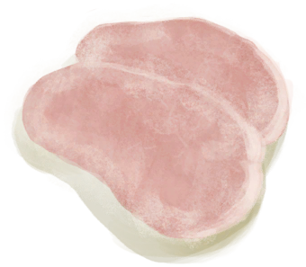
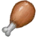
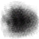
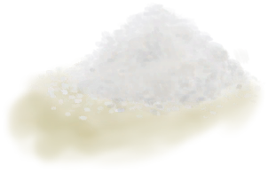

# Cured Meat  
> "Salty  
  
<table class="table table-bordered" data-toggle="table"  data-show-header="false"><thead style="display:none"><tr ><th  style="width:50%;text-align:left;vertical-align:top;"  >title</th><th  style="width:50%;text-align:left;vertical-align:top;"  ></th></tr></thead><tr ><td  style="width:50%;text-align:left;vertical-align:top;"  >**Weight：**100  **Tag：**	[“Cookable”](tag_Cookable.md), [“Feed”](tag_Feed.md), [“Feed”](tag_Meat.md), [“Human Food”](tag_HumanFood.md), [“Rich Proteins”](tag_ProteinsRich.md)</td><td  style="width:50%;text-align:left;vertical-align:top;"  >

<a href="MeatSaltedDried.md" style="color:black">Cured Meat</a>

</td></tr></tbody></table>  
  
## Got From  

Transform

[Drying Meat](MeatSaltedDrying.md)

  
  
## Action  

<table><tr><td rowspan="2" style="width:200px;text-align:center;font-size:1.3em;font-weight:bold">

Eat

15m

</td><td>[“CarnivorousAction(Group)”](CarnivorousAction.md), [“EatingAction(Group)”](EatingAction.md)</td></tr><tr><td><b>Self：</b>→Dismiss</td></tr><tr><td colspan="2"><b>StatChange：</b>[

[Satiation](Satiation.md)](Satiation.md)<b>+30</b>, [

[Stomach](Stomach.md)](Stomach.md)<b>+50</b>, [

[Hydration ](Hydration.md)](Hydration.md)<b>+4</b>, [

[Morale](Morale.md)](Morale.md)<b>+7</b>, [

[Saturation Meat](SaturationMeat.md)](SaturationMeat.md)<b>+45</b>, [

[Filth](Filth.md)](Filth.md)<b>+5</b>, [

[Sodium](Sodium.md)](Sodium.md)<b>+50</b></td></tr></table>
  
  
  
## Drag To  

[Boar Feeder](BoarFeeder.md)

[Boar Feeder(Empty)](BoarFeederEmpty.md)

[Compost Bin](CompostBin.md)

[Partridge Feeder](PartridgeFeeder.md)

[Partridge Feeder(Empty)](PartridgeFeederEmpty.md)

[Trapped Macaque](CageTrapMacaque.md)

[Sow](BoarEnclosureFemale.md)

[Boar](BoarEnclosureMale.md)

[Piglet](BoarEnclosurePiglet.md)

[Sow](BoarTiedFemale.md)

[Boar](BoarTiedMale.md)

[Piglet](BoarTiedPiglet.md)

[Dog Friend](DogFriend.md)

[Grandfather](Grandfather.md)

[Grandfather](GrandfatherHealthy.md)

[Macaque Friend](MacaqueFriend.md)

[Wounded Macaque](MacaqueWounded.md)

[Chick](PartridgeChick.md)

[Partridge](PartridgeFemaleEnclosure.md)

[Partridge](PartridgeFemaleLive.md)

[Male Partridge](PartridgeMaleEnclosure.md)

[Male Partridge](PartridgeMaleLive.md)

  
  

