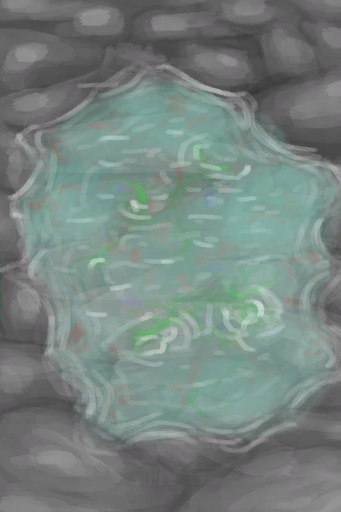
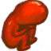

## Mermaid  

<table style="margin-bottom:0px;"><tr><td rowspan=2 style="width:160px"></td><td style="font-size:1.8em"><b>Mermaid</b></td><td style="width:50%">UnlockPrice：3🌙</td></tr><tr><td  colspan=2 style=""><i>"From the waves you emerge</i></td><tr><td colspan=2><b>Environment：</b>[

[Beach](Beach.md)](Beach.md)<td colspan=1><b>Weather：</b>[

[Clear](TropicalIsland_ClearStart.md)](TropicalIsland_ClearStart.md)</tr></tr><tr><td colspan=3><b>Starting Status：</b>[

[Hydration ](Hydration.md)](Hydration.md)<b>+90</b></tr><tr><td colspan=3><b>Perks：</b>

[Desolate Beach](Pk_1_LocationDesolateBeach.md)

[Seahounds](Pk_1_Seahounds.md)

[Night Vision](Pk_3_NightVision.md)

[Night Start](Pk_1_NightStart.md)

[Specialized Kidneys](Pk_3_SpecializedKidneys.md)

[Permeable Skin](Pk_3_PermeableSkin.md)

[Sun Allergy](Pk_3_SunAllergy.md)

[Feral](Pk_4_Feral.md)

[Gluttonous](Pk_4_Gluttonous.md)

[Hyper Metabolism](Pk_4_HyperMetabolism.md)

[Strong Immune System](Pk_4_ImmuneSystemStrong.md)

[Land Sickness](Pk_4_LandSickness.md)

[Carnivore](Pk_4_Carnivore.md)

[Pregnant](Pk_6_Pregnancy.md)

[Swimmer](Pk_5_Swimmer.md)

[Spearfisher](Pk_5_SpearFisher.md)

  
  
</tr><tr><td colspan=3><b>Clothes：</b> 

  
  
</tr><tr><td colspan=3><b>Starting Cards：</b> 

  
  
</tr><tr><td colspan=3><b>初始蓝图：</b> 

<a href="Bp_MermaidNest.md" style="color:black">Mermaid Nest</a>

<a href="Bp_FishingSpear.md" style="color:black">Fishing Spear</a>

<a href="Bp_Harpoon.md" style="color:black">Harpoon</a>

<a href="Bp_MermaidNest.md" style="color:black">Mermaid Nest</a>

  
  
</tr></table>
    
  
## 目标  

<b>LIFE ABOVE THE SEAS</b>

<table style="margin-bottom:0px;"><tr><td rowSpan=3 style="width:50px;max-height:100px;text-align:center;vertical-align:top"></td><td colspan=2 >
<b>Drink Salt Water</b>
<i>To quench your thirst.</i></td></tr><tr style=""><td><b>Require：</b>Drink [

[Sea(Atoll)](Sea_Atoll.md)](Sea_Atoll.md)&nbsp;&nbsp;&nbsp;&nbsp;Drink [

[Sea(Bay)](Sea_Bay.md)](Sea_Bay.md)&nbsp;&nbsp;&nbsp;&nbsp;Drink [

[Sea(Beach)](Sea_Beach.md)](Sea_Beach.md)&nbsp;&nbsp;&nbsp;&nbsp;Drink [

[Seawater(Flooded Chamber)](Sea_Cave.md)](Sea_Cave.md)&nbsp;&nbsp;&nbsp;&nbsp;Drink [

[Sea(Secret Cove)](Sea_Cove.md)](Sea_Cove.md)&nbsp;&nbsp;&nbsp;&nbsp;Drink [

[Sea(Desolate Beach)](Sea_DesolateBeach.md)](Sea_DesolateBeach.md)&nbsp;&nbsp;&nbsp;&nbsp;Drink [

[Sea(Mangrove Forest)](Sea_Mangroves.md)](Sea_Mangroves.md)&nbsp;&nbsp;&nbsp;&nbsp;Drink [

[Sea](Sea_Raft.md)](Sea_Raft.md)&nbsp;&nbsp;&nbsp;&nbsp;Drink [

[Sea(Bird Rock)](Sea_Rocks.md)](Sea_Rocks.md)&nbsp;&nbsp;&nbsp;&nbsp;Drink [

[Tide Pool(Rocks)](TidePool.md)](TidePool.md)&nbsp;&nbsp;&nbsp;&nbsp;Drink [

[Flooded Tide Pool(Rocks)](TidePoolFlooded.md)](TidePoolFlooded.md)&nbsp;&nbsp;&nbsp;&nbsp;Drink [

[Salt Water](LQ_WaterSalt.md)](LQ_WaterSalt.md) </td></tr><tr style=""><td ><b>Reward：</b>[

[Determination](Determination.md)](Determination.md)<b>+50</b>&nbsp;&nbsp;&nbsp;&nbsp;[

[Stress](Stress.md)](Stress.md)<b>-48</b></td></tr><tr style="border-bottom:2px solid #CCC;height:1px;"></tr><tr><td rowSpan=3 style="width:50px;max-height:100px;text-align:center;vertical-align:top"></td><td colspan=2 >
<b>Wet your Skin</b>
<i>To keep it healthy and moist.</i></td></tr><tr style=""><td><b>Require：</b>[

[Wetness](Wetness.md)](Wetness.md): <b>1～100</b> </td></tr><tr style=""><td ><b>Reward：</b>[

[Determination](Determination.md)](Determination.md)<b>+50</b>&nbsp;&nbsp;&nbsp;&nbsp;[

[Stress](Stress.md)](Stress.md)<b>-48</b></td></tr><tr style="border-bottom:2px solid #CCC;height:1px;"></tr><tr><td rowSpan=3 style="width:50px;max-height:100px;text-align:center;vertical-align:top"></td><td colspan=2 >
<b>Find a Cave before Sunrise</b>
<i>Or the Sun will burn you.</i></td></tr><tr style=""><td><b>Require：</b>[“Cave”](tag_Cave.md)x1 </td></tr><tr style=""><td ><b>Reward：</b>[

[Determination](Determination.md)](Determination.md)<b>+50</b>&nbsp;&nbsp;&nbsp;&nbsp;[

[Stress](Stress.md)](Stress.md)<b>-48</b></td></tr><tr style="border-bottom:2px solid #CCC;height:1px;"></tr></table>
 
<b>RECOVERING STRENGTH</b>

<table style="margin-bottom:0px;"><tr><td rowSpan=3 style="width:50px;max-height:100px;text-align:center;vertical-align:top"></td><td colspan=2 >
<b>Craft a Fishing Spear</b>
<i>to keep yourself reliably fed.</i></td></tr><tr style=""><td><b>Require：</b>[

[Fishing Spear](SpearFishing.md)](SpearFishing.md)x1 </td></tr><tr style=""><td ><b>Reward：</b>[

[Determination](Determination.md)](Determination.md)<b>+50</b>&nbsp;&nbsp;&nbsp;&nbsp;[

[Stress](Stress.md)](Stress.md)<b>-48</b></td></tr><tr style="border-bottom:2px solid #CCC;height:1px;"></tr><tr><td rowSpan=3 style="width:50px;max-height:100px;text-align:center;vertical-align:top"></td><td colspan=2 >
<b>Cook some Fish</b>
<i>To get extra nutrition</i></td></tr><tr style=""><td><b>Require：</b>[

[Cooked Bonefish](BonefishCooked.md)](BonefishCooked.md)x1&nbsp;&nbsp;&nbsp;&nbsp;[

[Cooked Goatfish](GoatfishCooked.md)](GoatfishCooked.md)x1&nbsp;&nbsp;&nbsp;&nbsp;[

[Cooked Grouper](GrouperMeatCooked.md)](GrouperMeatCooked.md)x1&nbsp;&nbsp;&nbsp;&nbsp;[

[Cooked Parrot Fish](ParrotFishCooked.md)](ParrotFishCooked.md)x1&nbsp;&nbsp;&nbsp;&nbsp;[

[Cooked Threadfin](ThreadfinCooked.md)](ThreadfinCooked.md)x1&nbsp;&nbsp;&nbsp;&nbsp;[

[Cooked Shark](SharkCooked.md)](SharkCooked.md)x1 </td></tr><tr style=""><td ><b>Reward：</b>[

[Determination](Determination.md)](Determination.md)<b>+100</b>&nbsp;&nbsp;&nbsp;&nbsp;[

[Stress](Stress.md)](Stress.md)<b>-48</b></td></tr><tr style="border-bottom:2px solid #CCC;height:1px;"></tr><tr><td rowSpan=3 style="width:50px;max-height:100px;text-align:center;vertical-align:top"></td><td colspan=2 >
<b>Make a Seaweed Nest</b>
<i>To feel more at home.</i></td></tr><tr style=""><td><b>Require：</b>[

[Mermaid nest](MermaidNest.md)](MermaidNest.md)x1 </td></tr><tr style=""><td ><b>Reward：</b>[

[Determination](Determination.md)](Determination.md)<b>+50</b>&nbsp;&nbsp;&nbsp;&nbsp;[

[Stress](Stress.md)](Stress.md)<b>-48</b></td></tr><tr style="border-bottom:2px solid #CCC;height:1px;"></tr></table>
 
<b>FACING DESTINY</b>

<table style="margin-bottom:0px;"><tr><td rowSpan=3 style="width:50px;max-height:100px;text-align:center;vertical-align:top"></td><td colspan=2 >
<b>Give birth</b>
</td></tr><tr style=""><td><b>Require：</b>[

[Pregnancy](Pregnancy.md)](Pregnancy.md): <b>8640</b> </td></tr><tr style=""><td ><b>Reward：</b>[

[Determination](Determination.md)](Determination.md)<b>+50</b>&nbsp;&nbsp;&nbsp;&nbsp;[

[Stress](Stress.md)](Stress.md)<b>-48</b></td></tr><tr style="border-bottom:2px solid #CCC;height:1px;"></tr><tr><td rowSpan=3 style="width:50px;max-height:100px;text-align:center;vertical-align:top"></td><td colspan=2 >
<b>Return to the sea</b>
</td></tr><tr style=""><td>
<table style="margin-bottom:0px;"><tr><td rowSpan=3 style="width:50px;max-height:100px;text-align:center;vertical-align:top"></td><td colspan=2 >
<b>Kill 4 Seahounds</b>
<i>To clear the way before going back to the sea</i></td></tr><tr style=""><td><b>Require：</b>[Seahound Kills](SeaHoundKills.md): <b>4～9999</b> </td></tr><tr style=""><td ><b>Reward：</b>[Mermaid Final Action](MermaidFinalAction.md)<b>+1</b></td></tr><tr style="border-bottom:2px solid #CCC;height:1px;"></tr><tr><td rowSpan=3 style="width:50px;max-height:100px;text-align:center;vertical-align:top"></td><td colspan=2 >
<b>Store enough body fat</b>
<i>To survive the journey back into the depths</i></td></tr><tr style=""><td><b>Require：</b>[

[Weight](Weight.md)](Weight.md): <b>4033～99999</b> </td></tr><tr style=""><td ><b>Reward：</b>[Mermaid Final Action](MermaidFinalAction.md)<b>+1</b></td></tr><tr style="border-bottom:2px solid #CCC;height:1px;"></tr></table>
  </td></tr><tr style="border-bottom:2px solid #CCC;height:1px;"></tr><tr><td rowSpan=3 style="width:50px;max-height:100px;text-align:center;vertical-align:top"></td><td colspan=2 >
<b>Make the Island your Home</b>
</td></tr><tr style=""><td>
<table style="margin-bottom:0px;"><tr><td rowSpan=3 style="width:50px;max-height:100px;text-align:center;vertical-align:top"></td><td colspan=2 >
<b>Survive in the Island for 120 days</b>
<i>to become familiar with it.</i></td></tr><tr style=""><td><b>Require：</b>[Counter](Counter.md): <b>11520～999999</b> </td></tr><tr style="border-bottom:2px solid #CCC;height:1px;"></tr><tr><td rowSpan=3 style="width:50px;max-height:100px;text-align:center;vertical-align:top"></td><td colspan=2 >
<b>Reach Maximum Comfort</b>
<i>To turn your house into your home.</i></td></tr><tr style=""><td><b>Require：</b>[

[Comfort](Comfort.md)](Comfort.md): <b>1751～2500</b> </td></tr><tr style="border-bottom:2px solid #CCC;height:1px;"></tr></table>
  </td></tr><tr style="border-bottom:2px solid #CCC;height:1px;"></tr></table>
   

