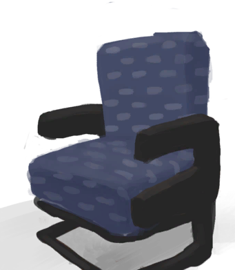

# Altered Mind State  
> Can trigger spiritual/mental events and lengthen the duration of your actions if it gets too high.  
> "When your <b>Mental Structure</b> gets too low you will start getting altered mind states. This can also be done on purpose through <b>Trance  
  

<b>Base Value: </b> 0 
  

<b>Value Range: </b> 0 ~ 300 
  

<b>Base Rate: </b> -1 / /TP 
  

<b>Staleness: </b>Staleness multiplier 50% in 1d(stack:2) 
  
## Statuses  

<table><tr style="height:2em;"><td style="background-color:#F0F0F0;text-align:center;width:180px;font-size:1.4em;font-weight:bold;vertical-align:middle;">
51 ～ 100

17% ～ 33%
</td><td colspan=2 style="font-size:1.1em;vertical-align:middle;background-color:#F9F9F9;">
<b>

Altered Mind State</b>

&nbsp;&nbsp;Something's a bit off.
</td></tr><tr><td colspan=2><b>Effect：</b>[

[Altered Mind State](MindState.md)](MindState.md)addition<b>-1</b></td></tr><tr><td colspan=2></td></tr><tr style="height:2em;"><td style="background-color:#F0F0F0;text-align:center;width:180px;font-size:1.4em;font-weight:bold;vertical-align:middle;">
101 ～ 150

33% ～ 50%
</td><td colspan=2 style="font-size:1.1em;vertical-align:middle;background-color:#F9F9F9;">
<b>

Altered Mind State</b>

&nbsp;&nbsp;Something's definitely off.
</td></tr><tr><td colspan=2><b>Effect：</b>[

[Relational Layer](RelationalLayer.md)](RelationalLayer.md)<b>+1</b>, [

[Altered Mind State](MindState.md)](MindState.md)addition<b>-2</b></td></tr><tr><td colspan=2></td></tr><tr style="height:2em;"><td style="background-color:#F0F0F0;text-align:center;width:180px;font-size:1.4em;font-weight:bold;vertical-align:middle;">
151 ～ 250

50% ～ 83%
</td><td colspan=2 style="font-size:1.1em;vertical-align:middle;background-color:#F9F9F9;">
<b>

Altered Mind State</b>

&nbsp;&nbsp;Everything feels different.
</td></tr><tr><td colspan=2><b>Effect：</b>[

[Relational Layer](RelationalLayer.md)](RelationalLayer.md)<b>+1</b>, [

[Altered Mind State](MindState.md)](MindState.md)addition<b>-4</b></td></tr><tr><td colspan=2></td></tr><tr style="height:2em;"><td style="background-color:#F0F0F0;text-align:center;width:180px;font-size:1.4em;font-weight:bold;vertical-align:middle;">
251 ～ 300

83% ～ 100%
</td><td colspan=2 style="font-size:1.1em;vertical-align:middle;background-color:#F9F9F9;">
<b>

Altered Mind State</b>

&nbsp;&nbsp;...
</td></tr><tr><td colspan=2><b>Effect：</b>[

[Relational Layer](RelationalLayer.md)](RelationalLayer.md)addition<b>+2</b>, [

[Altered Mind State](MindState.md)](MindState.md)addition<b>-6</b></td></tr><tr><td colspan=2><b>Effect on Action：</b>[“HandAction(Group)”](HandAction.md): , [“LegAction(Group)”](LegAction.md): , TimeCost+1</td></tr><tr><td colspan=2></td></tr></table>
  
## Related Cards  
[Pain](Pain.md)  |  [Fever](Fever.md)  |  [Mental Structure](Structure.md)  |  [Derealization](Derealization.md)  |  [Mania](Mania.md)  |  [Wakefulness](Wakefulness.md)  |  [Camp Fever](BacteriaTyphus.md)  |  [Loneliness](Loneliness.md)  |  [Watcher's Glare](WatchersGlare.md)  |  [Hunter's Proximity](HuntersProximity.md)  |  [Isolation](Isolation.md)  |  [Psylocibin](Psylocibin.md)  
## Addition Change By  
<table class="table table-bordered" data-toggle="table"  ><thead style=""><tr ><th  style="text-align:left;vertical-align:top;"  >From</th><th  style="text-align:left;vertical-align:top;"  >Operation</th><th  style="text-align:left;vertical-align:top;"  >Value</th></tr></thead><tr ><td  style="text-align:left;vertical-align:top;"  >[Darkness(Dark Chamber)](DarkChamber.md)</td><td  style="text-align:left;vertical-align:top;"  >Passive</td><td  style="text-align:left;vertical-align:top;"  >addition+2</td></tr></tbody></table>  
  
## Change By  
<table class="table table-bordered" data-toggle="table"  ><thead style=""><tr ><th  style="text-align:left;vertical-align:top;"  >From</th><th  style="text-align:left;vertical-align:top;"  >Operation</th><th  style="text-align:left;vertical-align:top;"  >Value</th></tr></thead><tr ><td  style="text-align:left;vertical-align:top;"  >[

[Weston(Special1e)(Event)](Event_WestonSpecial1e.md)](Event_WestonSpecial1e.md)</td><td  style="text-align:left;vertical-align:top;"  >Continue</td><td  style="text-align:left;vertical-align:top;"  >100</td></tr><tr ><td  style="text-align:left;vertical-align:top;"  >[

[Captain(Special1f)(Event)](Event_CaptainSpecial1f.md)](Event_CaptainSpecial1f.md)</td><td  style="text-align:left;vertical-align:top;"  >The feeling is mutual!</td><td  style="text-align:left;vertical-align:top;"  >50</td></tr><tr ><td  style="text-align:left;vertical-align:top;"  >[

[Divine Insight(Event)](Event_GodExperience1g.md)](Event_GodExperience1g.md)</td><td  style="text-align:left;vertical-align:top;"  >HOLD ON TIGHT!</td><td  style="text-align:left;vertical-align:top;"  >50</td></tr><tr ><td  style="text-align:left;vertical-align:top;"  >[

[Divine Insight(Event)](Event_HuntedExperience1g.md)](Event_HuntedExperience1g.md)(未实装)</td><td  style="text-align:left;vertical-align:top;"  >HOLD ON TIGHT!</td><td  style="text-align:left;vertical-align:top;"  >50</td></tr><tr ><td  style="text-align:left;vertical-align:top;"  >[

[Nightmare!(Event)](Event_Nightmare.md)](Event_Nightmare.md)</td><td  style="text-align:left;vertical-align:top;"  >Try to calm down...</td><td  style="text-align:left;vertical-align:top;"  >50</td></tr><tr ><td  style="text-align:left;vertical-align:top;"  >[

[Void Insight(Event)](Event_SpiritsEverywhere1g.md)](Event_SpiritsEverywhere1g.md)(未实装)</td><td  style="text-align:left;vertical-align:top;"  >UNBEARABLE MIND PAIN!</td><td  style="text-align:left;vertical-align:top;"  >50</td></tr><tr ><td  style="text-align:left;vertical-align:top;"  >[

[Void Insight(Event)](Event_VoidExperience1g.md)](Event_VoidExperience1g.md)</td><td  style="text-align:left;vertical-align:top;"  >My mind is breaking!</td><td  style="text-align:left;vertical-align:top;"  >50</td></tr><tr ><td  style="text-align:left;vertical-align:top;"  >[

[Watcher(Event)](Event_WatchedExperience1gGod.md)](Event_WatchedExperience1gGod.md)</td><td  style="text-align:left;vertical-align:top;"  >Become the Watcher</td><td  style="text-align:left;vertical-align:top;"  >50</td></tr><tr ><td  style="text-align:left;vertical-align:top;"  >[

[Watcher(Event)](Event_WatchedExperience1gVoid.md)](Event_WatchedExperience1gVoid.md)</td><td  style="text-align:left;vertical-align:top;"  >Nothing is watching you</td><td  style="text-align:left;vertical-align:top;"  >50</td></tr><tr ><td  style="text-align:left;vertical-align:top;"  >[

[Lizard Drum](LizardDrum.md)](LizardDrum.md)</td><td  style="text-align:left;vertical-align:top;"  >Summoning Rhythm</td><td  style="text-align:left;vertical-align:top;"  >50 / /TP</td></tr><tr ><td  style="text-align:left;vertical-align:top;"  >[

[Drum](Drum.md)](Drum.md)</td><td  style="text-align:left;vertical-align:top;"  >Drum Trance</td><td  style="text-align:left;vertical-align:top;"  >16 / /TP</td></tr><tr ><td  style="text-align:left;vertical-align:top;"  >[

[Lizard Drum](LizardDrum.md)](LizardDrum.md)</td><td  style="text-align:left;vertical-align:top;"  >Drum Trance</td><td  style="text-align:left;vertical-align:top;"  >16 / /TP</td></tr><tr ><td  style="text-align:left;vertical-align:top;"  >[

[Drum](Drum.md)](Drum.md)</td><td  style="text-align:left;vertical-align:top;"  >Intense Rhythm</td><td  style="text-align:left;vertical-align:top;"  >8 / /TP</td></tr><tr ><td  style="text-align:left;vertical-align:top;"  >[

[Lizard Drum](LizardDrum.md)](LizardDrum.md)</td><td  style="text-align:left;vertical-align:top;"  >Intense Rhythm</td><td  style="text-align:left;vertical-align:top;"  >8 / /TP</td></tr><tr ><td  style="text-align:left;vertical-align:top;"  >[

[Darkness(Dark Chamber)](DarkChamber.md)](DarkChamber.md)</td><td  style="text-align:left;vertical-align:top;"  >Meditate</td><td  style="text-align:left;vertical-align:top;"  >5 / /TP</td></tr><tr ><td  style="text-align:left;vertical-align:top;"  >[

[Drum](Drum.md)](Drum.md)</td><td  style="text-align:left;vertical-align:top;"  >Flowing Rhythm</td><td  style="text-align:left;vertical-align:top;"  >4 / /TP</td></tr><tr ><td  style="text-align:left;vertical-align:top;"  >[

[Lizard Drum](LizardDrum.md)](LizardDrum.md)</td><td  style="text-align:left;vertical-align:top;"  >Flowing Rhythm</td><td  style="text-align:left;vertical-align:top;"  >4 / /TP</td></tr><tr ><td  style="text-align:left;vertical-align:top;"  >[

[Drum(Event)](Event_DrumMenu.md)](Event_DrumMenu.md)(未实装)</td><td  style="text-align:left;vertical-align:top;"  >Intense Rythm</td><td  style="text-align:left;vertical-align:top;"  >3 / /TP</td></tr><tr ><td  style="text-align:left;vertical-align:top;"  >[

[Drum(Event)](Event_DrumMenu.md)](Event_DrumMenu.md)(未实装)</td><td  style="text-align:left;vertical-align:top;"  >Flowing Rythm</td><td  style="text-align:left;vertical-align:top;"  >2 / /TP</td></tr><tr ><td  style="text-align:left;vertical-align:top;"  >[

[Darkness(Dark Chamber)](DarkChamber.md)](DarkChamber.md)</td><td  style="text-align:left;vertical-align:top;"  >Meditate</td><td  style="text-align:left;vertical-align:top;"  >2 / /TP</td></tr><tr ><td  style="text-align:left;vertical-align:top;"  >[

[Chair](ChairPlaced.md)](ChairPlaced.md)</td><td  style="text-align:left;vertical-align:top;"  >Meditate</td><td  style="text-align:left;vertical-align:top;"  >1 / /TP</td></tr><tr ><td  style="text-align:left;vertical-align:top;"  >[

[Seat](SeatAttached.md)](SeatAttached.md)</td><td  style="text-align:left;vertical-align:top;"  >Meditate</td><td  style="text-align:left;vertical-align:top;"  >1 / /TP</td></tr><tr ><td  style="text-align:left;vertical-align:top;"  >[

[Seat](SeatPlaced.md)](SeatPlaced.md)</td><td  style="text-align:left;vertical-align:top;"  >Meditate</td><td  style="text-align:left;vertical-align:top;"  >1 / /TP</td></tr><tr ><td  style="text-align:left;vertical-align:top;"  >

[Down To Earth](Pk_4_DownToEarth.md)</td><td  style="text-align:left;vertical-align:top;"  >Perk Effect</td><td  style="text-align:left;vertical-align:top;"  >-1000</td></tr></tbody></table>  
  
## Required By  
<table class="table table-bordered" data-toggle="table"  ><thead style=""><tr ><th  style="text-align:left;vertical-align:top;"  >From</th><th  style="text-align:left;vertical-align:top;"  >Operation</th><th  style="text-align:left;vertical-align:top;"  data-sortable="true"  >Value</th></tr></thead><tr ><td  style="text-align:left;vertical-align:top;"  >[Lizard Drum](LizardDrum.md)</td><td  style="text-align:left;vertical-align:top;"  >Summoning Rhythm</td><td  style="text-align:left;vertical-align:top;"  >151 ~ 300</td></tr><tr ><td  style="text-align:left;vertical-align:top;"  >[Divine Insight(Event)](Event_GodExperience1a.md)</td><td  style="text-align:left;vertical-align:top;"  >Event</td><td  style="text-align:left;vertical-align:top;"  >150 ~ 300</td></tr><tr ><td  style="text-align:left;vertical-align:top;"  >[Void Insight(Event)](Event_VoidExperience1a.md)</td><td  style="text-align:left;vertical-align:top;"  >Event</td><td  style="text-align:left;vertical-align:top;"  >150 ~ 300</td></tr><tr ><td  style="text-align:left;vertical-align:top;"  >[Chair](ChairPlaced.md)</td><td  style="text-align:left;vertical-align:top;"  >Meditate</td><td  style="text-align:left;vertical-align:top;"  >100 ~ 300</td></tr><tr ><td  style="text-align:left;vertical-align:top;"  >[Seat](SeatAttached.md)</td><td  style="text-align:left;vertical-align:top;"  >Meditate</td><td  style="text-align:left;vertical-align:top;"  >100 ~ 300</td></tr><tr ><td  style="text-align:left;vertical-align:top;"  >[Seat](SeatPlaced.md)</td><td  style="text-align:left;vertical-align:top;"  >Meditate</td><td  style="text-align:left;vertical-align:top;"  >100 ~ 300</td></tr><tr ><td  style="text-align:left;vertical-align:top;"  >[Darkness(Dark Chamber)](DarkChamber.md)</td><td  style="text-align:left;vertical-align:top;"  >Meditate</td><td  style="text-align:left;vertical-align:top;"  >100 ~ 300</td></tr><tr ><td  style="text-align:left;vertical-align:top;"  >[Chair](ChairPlaced.md)</td><td  style="text-align:left;vertical-align:top;"  >Meditate</td><td  style="text-align:left;vertical-align:top;"  >0 ~ 99</td></tr><tr ><td  style="text-align:left;vertical-align:top;"  >[Seat](SeatAttached.md)</td><td  style="text-align:left;vertical-align:top;"  >Meditate</td><td  style="text-align:left;vertical-align:top;"  >0 ~ 99</td></tr><tr ><td  style="text-align:left;vertical-align:top;"  >[Seat](SeatPlaced.md)</td><td  style="text-align:left;vertical-align:top;"  >Meditate</td><td  style="text-align:left;vertical-align:top;"  >0 ~ 99</td></tr><tr ><td  style="text-align:left;vertical-align:top;"  >[Darkness(Dark Chamber)](DarkChamber.md)</td><td  style="text-align:left;vertical-align:top;"  >Meditate</td><td  style="text-align:left;vertical-align:top;"  >0 ~ 99</td></tr></tbody></table>  
  

