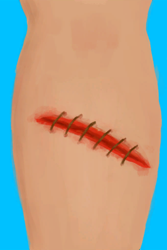
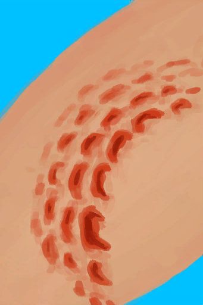

# Leg Modifier  
  

<b>Base Value: </b> 0 
  

<b>Value Range: </b> 0 ~ 3 
  

<b>Base Rate: </b> - 
  
## Statuses  

<table><tr style="height:2em;"><td style="background-color:#F0F0F0;text-align:center;width:180px;font-size:1.4em;font-weight:bold;vertical-align:middle;">
1

33%
</td><td colspan=2 style="font-size:1.1em;vertical-align:middle;background-color:#F9F9F9;">
<b>Leg Modifier 1</b>

</td></tr><tr><td colspan=2><b>Effect on Action：</b>[“LegAction(Group)”](LegAction.md): , [

[Stamina](Stamina.md)](Stamina.md)<b>-2</b> (/TP), TimeCost+1</td></tr><tr><td colspan=2></td></tr><tr style="height:2em;"><td style="background-color:#F0F0F0;text-align:center;width:180px;font-size:1.4em;font-weight:bold;vertical-align:middle;">
2

66%
</td><td colspan=2 style="font-size:1.1em;vertical-align:middle;background-color:#F9F9F9;">
<b>Leg Modifier 2</b>

</td></tr><tr><td colspan=2><b>Effect on Action：</b>[“LegAction(Group)”](LegAction.md): , [

[Stamina](Stamina.md)](Stamina.md)<b>-4</b> (/TP), TimeCost+2</td></tr><tr><td colspan=2></td></tr><tr style="height:2em;"><td style="background-color:#F0F0F0;text-align:center;width:180px;font-size:1.4em;font-weight:bold;vertical-align:middle;">
3

100%
</td><td colspan=2 style="font-size:1.1em;vertical-align:middle;background-color:#F9F9F9;">
<b>Leg Modifier 3</b>

</td></tr><tr><td colspan=2><b>Effect on Action：</b>[“LegAction(Group)”](LegAction.md): , [

[Stamina](Stamina.md)](Stamina.md)<b>-8</b> (/TP), TimeCost+4</td></tr><tr><td colspan=2></td></tr></table>
  
## Related Cards  
[Weight](Weight.md)  |  [Pregnancy](Pregnancy.md)  |  [TV Lives](TV_Lives.md)  |  [Venom Krait](VenomKrait.md)  
## Change By  
<table class="table table-bordered" data-toggle="table"  ><thead style=""><tr ><th  style="text-align:left;vertical-align:top;"  >From</th><th  style="text-align:left;vertical-align:top;"  >Operation</th><th  style="text-align:left;vertical-align:top;"  data-sortable="true"  >Value</th></tr></thead><tr ><td  style="text-align:left;vertical-align:top;"  >[

[Urchin Wound](W_UrchinWoundSpines.md)](W_UrchinWoundSpines.md)</td><td  style="text-align:left;vertical-align:top;"  >Passive</td><td  style="text-align:left;vertical-align:top;"  >3</td></tr><tr ><td  style="text-align:left;vertical-align:top;"  >[

[Leg Fracture](W_LegFractureL.md)](W_LegFractureL.md)</td><td  style="text-align:left;vertical-align:top;"  >Passive</td><td  style="text-align:left;vertical-align:top;"  >2</td></tr><tr ><td  style="text-align:left;vertical-align:top;"  >[

[Leg Fracture](W_LegFractureR.md)](W_LegFractureR.md)</td><td  style="text-align:left;vertical-align:top;"  >Passive</td><td  style="text-align:left;vertical-align:top;"  >2</td></tr><tr ><td  style="text-align:left;vertical-align:top;"  >[

[Leg Laceration](W_LegLacerationL.md)](W_LegLacerationL.md)</td><td  style="text-align:left;vertical-align:top;"  >Passive</td><td  style="text-align:left;vertical-align:top;"  >2</td></tr><tr ><td  style="text-align:left;vertical-align:top;"  >[

[Leg Laceration](W_LegLacerationLStitched.md)](W_LegLacerationLStitched.md)</td><td  style="text-align:left;vertical-align:top;"  >Passive</td><td  style="text-align:left;vertical-align:top;"  >2</td></tr><tr ><td  style="text-align:left;vertical-align:top;"  >[

[Leg Laceration](W_LegLacerationR.md)](W_LegLacerationR.md)</td><td  style="text-align:left;vertical-align:top;"  >Passive</td><td  style="text-align:left;vertical-align:top;"  >2</td></tr><tr ><td  style="text-align:left;vertical-align:top;"  >[

[Leg Laceration](W_LegLacerationRStitched.md)](W_LegLacerationRStitched.md)</td><td  style="text-align:left;vertical-align:top;"  >Passive</td><td  style="text-align:left;vertical-align:top;"  >2</td></tr><tr ><td  style="text-align:left;vertical-align:top;"  >[

[Leg Fracture](W_LegFractureL.md)](W_LegFractureL.md)</td><td  style="text-align:left;vertical-align:top;"  >Passive</td><td  style="text-align:left;vertical-align:top;"  >1</td></tr><tr ><td  style="text-align:left;vertical-align:top;"  >[

[Leg Fracture](W_LegFractureR.md)](W_LegFractureR.md)</td><td  style="text-align:left;vertical-align:top;"  >Passive</td><td  style="text-align:left;vertical-align:top;"  >1</td></tr><tr ><td  style="text-align:left;vertical-align:top;"  >[

[Leg Laceration](W_LegLacerationL.md)](W_LegLacerationL.md)</td><td  style="text-align:left;vertical-align:top;"  >Passive</td><td  style="text-align:left;vertical-align:top;"  >1</td></tr><tr ><td  style="text-align:left;vertical-align:top;"  >[

[Leg Laceration](W_LegLacerationLStitched.md)](W_LegLacerationLStitched.md)</td><td  style="text-align:left;vertical-align:top;"  >Passive</td><td  style="text-align:left;vertical-align:top;"  >1</td></tr><tr ><td  style="text-align:left;vertical-align:top;"  >[

[Leg Laceration](W_LegLacerationR.md)](W_LegLacerationR.md)</td><td  style="text-align:left;vertical-align:top;"  >Passive</td><td  style="text-align:left;vertical-align:top;"  >1</td></tr><tr ><td  style="text-align:left;vertical-align:top;"  >[

[Leg Laceration](W_LegLacerationRStitched.md)](W_LegLacerationRStitched.md)</td><td  style="text-align:left;vertical-align:top;"  >Passive</td><td  style="text-align:left;vertical-align:top;"  >1</td></tr><tr ><td  style="text-align:left;vertical-align:top;"  >[

[Sprained Ankle](W_LegSprainedL.md)](W_LegSprainedL.md)</td><td  style="text-align:left;vertical-align:top;"  >Passive</td><td  style="text-align:left;vertical-align:top;"  >1</td></tr><tr ><td  style="text-align:left;vertical-align:top;"  >[

[Sprained Ankle](W_LegSprainedR.md)](W_LegSprainedR.md)</td><td  style="text-align:left;vertical-align:top;"  >Passive</td><td  style="text-align:left;vertical-align:top;"  >1</td></tr><tr ><td  style="text-align:left;vertical-align:top;"  >[

[Lizard Bite](W_MonitorBite.md)](W_MonitorBite.md)</td><td  style="text-align:left;vertical-align:top;"  >Passive</td><td  style="text-align:left;vertical-align:top;"  >1</td></tr><tr ><td  style="text-align:left;vertical-align:top;"  >[

[Shark Bite](W_SharkBite.md)](W_SharkBite.md)</td><td  style="text-align:left;vertical-align:top;"  >Passive</td><td  style="text-align:left;vertical-align:top;"  >1</td></tr><tr ><td  style="text-align:left;vertical-align:top;"  >[

[Spider Bite](W_SpiderBite.md)](W_SpiderBite.md)</td><td  style="text-align:left;vertical-align:top;"  >Passive</td><td  style="text-align:left;vertical-align:top;"  >1</td></tr><tr ><td  style="text-align:left;vertical-align:top;"  >[

[Urchin Wound](W_UrchinWound.md)](W_UrchinWound.md)</td><td  style="text-align:left;vertical-align:top;"  >Passive</td><td  style="text-align:left;vertical-align:top;"  >1</td></tr><tr ><td  style="text-align:left;vertical-align:top;"  >[

[Leg Fracture](W_LegFractureL.md)](W_LegFractureL.md)</td><td  style="text-align:left;vertical-align:top;"  >Passive</td><td  style="text-align:left;vertical-align:top;"  >0.5</td></tr><tr ><td  style="text-align:left;vertical-align:top;"  >[

[Leg Fracture](W_LegFractureR.md)](W_LegFractureR.md)</td><td  style="text-align:left;vertical-align:top;"  >Passive</td><td  style="text-align:left;vertical-align:top;"  >0.5</td></tr><tr ><td  style="text-align:left;vertical-align:top;"  >[

[Leg Laceration](W_LegLacerationL.md)](W_LegLacerationL.md)</td><td  style="text-align:left;vertical-align:top;"  >Passive</td><td  style="text-align:left;vertical-align:top;"  >0.5</td></tr><tr ><td  style="text-align:left;vertical-align:top;"  >[

[Leg Laceration](W_LegLacerationLStitched.md)](W_LegLacerationLStitched.md)</td><td  style="text-align:left;vertical-align:top;"  >Passive</td><td  style="text-align:left;vertical-align:top;"  >0.5</td></tr><tr ><td  style="text-align:left;vertical-align:top;"  >[

[Leg Laceration](W_LegLacerationR.md)](W_LegLacerationR.md)</td><td  style="text-align:left;vertical-align:top;"  >Passive</td><td  style="text-align:left;vertical-align:top;"  >0.5</td></tr><tr ><td  style="text-align:left;vertical-align:top;"  >[

[Leg Laceration](W_LegLacerationRStitched.md)](W_LegLacerationRStitched.md)</td><td  style="text-align:left;vertical-align:top;"  >Passive</td><td  style="text-align:left;vertical-align:top;"  >0.5</td></tr></tbody></table>  
  

