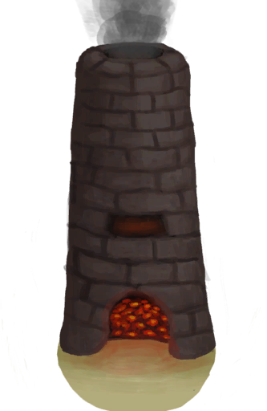

# Decoration Mold  
> I should put it in a Forge or Advanced Kiln.  
  
<table class="table table-bordered" data-toggle="table"  data-show-header="false"><thead style="display:none"><tr ><th  style="width:50%;text-align:left;vertical-align:top;"  >title</th><th  style="width:50%;text-align:left;vertical-align:top;"  ></th></tr></thead><tr ><td  style="width:50%;text-align:left;vertical-align:top;"  >**Weight：**250  **Tag：**	[“Clay”](tag_Clay.md), [“Heavy”](tag_Heavy.md)</td><td  style="width:50%;text-align:left;vertical-align:top;"  >

<a href="MoldCopperDecoration.md" style="color:black">Decoration Mold</a>

</td></tr></tbody></table>  
  
## Got From  

Craft BluePrint

[Decoration Mold(BluePrint)](Bp_MoldDecoration.md)

  
  
## Action  

<table><tr><td rowspan="2" style="width:200px;text-align:center;font-size:1.3em;font-weight:bold">

Scrap

3m

</td><td></td></tr><tr><td><b>Self：</b>→Dismiss</td></tr><tr><td colspan="2">[

[Clay](Clay.md)](Clay.md)(<b>+2</b>), [

[Copper](Copper.md)](Copper.md)(<b>+2</b>)</td></tr></table>
  
  
  
## Use To Transform  
<table class="table table-bordered" data-toggle="table"  ><thead style=""><tr ><th  style="text-align:left;vertical-align:top;"  >Transform to</th><th  style="text-align:left;vertical-align:top;"  >Container</th></tr></thead><tr ><td  style="text-align:left;vertical-align:top;"  >[

[Copper Decoration](CopperDecoration_Mold.md)](CopperDecoration_Mold.md)</td><td  style="text-align:left;vertical-align:top;"  >[

[Forge](Forge.md)](Forge.md)</td></tr><tr ><td  style="text-align:left;vertical-align:top;"  >[

[Copper Decoration](CopperDecoration_Mold.md)](CopperDecoration_Mold.md)</td><td  style="text-align:left;vertical-align:top;"  >[

[Advanced Kiln](KilnAdvanced.md)](KilnAdvanced.md)</td></tr></tbody></table>  
  

