# Morale  
> Shows your general mood. Affects your immune system and can help trigger depressive and manic states at the extremes.  
> "Your morale represents how well you feel at a given moment.  At low levels your morale can compromise your <b>Immune System</b>  
  

<b>Base Value: </b> 0 
  

<b>Value Range: </b> -350 ~ 350 
  

<b>Base Rate: </b> - 
  

<b>Staleness: </b>Staleness multiplier 50% in 1d(stack:2) 
  
## Statuses  

<table><tr style="height:2em;"><td style="background-color:#F0F0F0;text-align:center;width:180px;font-size:1.4em;font-weight:bold;vertical-align:middle;">
326 ～ 350

93% ～ 100%
</td><td colspan=2 style="font-size:1.1em;vertical-align:middle;background-color:#F9F9F9;">
<b>

Euphoric</b>

&nbsp;&nbsp;I'm very happy with life
</td></tr><tr><td colspan=2><b>Effect：</b>[

[Immune System](ImmuneSystem.md)](ImmuneSystem.md)<b>+100</b>, [

[Morale](Morale.md)](Morale.md)addition<b>-3</b>, [

[Mental Structure](Structure.md)](Structure.md)addition<b>-4</b>, [

[Loneliness](Loneliness.md)](Loneliness.md)addition<b>-1</b>, [

[Mania](Mania.md)](Mania.md)addition<b>+0.75</b>, [

[Derealization](Derealization.md)](Derealization.md)addition<b>-100</b></td></tr><tr><td colspan=2></td></tr><tr style="height:2em;"><td style="background-color:#F0F0F0;text-align:center;width:180px;font-size:1.4em;font-weight:bold;vertical-align:middle;">
251 ～ 325

71% ～ 92%
</td><td colspan=2 style="font-size:1.1em;vertical-align:middle;background-color:#F9F9F9;">
<b>

Happy</b>

&nbsp;&nbsp;I'm very happy with life
</td></tr><tr><td colspan=2><b>Effect：</b>[

[Immune System](ImmuneSystem.md)](ImmuneSystem.md)<b>+75</b>, [

[Morale](Morale.md)](Morale.md)addition<b>-2</b>, [

[Loneliness](Loneliness.md)](Loneliness.md)addition<b>-0.5</b>, [

[Mania](Mania.md)](Mania.md)addition<b>+0.5</b>, [

[Derealization](Derealization.md)](Derealization.md)addition<b>-50</b></td></tr><tr><td colspan=2></td></tr><tr style="height:2em;"><td style="background-color:#F0F0F0;text-align:center;width:180px;font-size:1.4em;font-weight:bold;vertical-align:middle;">
100 ～ 250

28% ～ 71%
</td><td colspan=2 style="font-size:1.1em;vertical-align:middle;background-color:#F9F9F9;">
<b>

Content</b>

&nbsp;&nbsp;I'm content with life
</td></tr><tr><td colspan=2><b>Effect：</b>[

[Immune System](ImmuneSystem.md)](ImmuneSystem.md)<b>+50</b>, [

[Morale](Morale.md)](Morale.md)addition<b>-1</b>, [

[Derealization](Derealization.md)](Derealization.md)addition<b>-25</b></td></tr><tr><td colspan=2></td></tr><tr style="height:2em;"><td style="background-color:#F0F0F0;text-align:center;width:180px;font-size:1.4em;font-weight:bold;vertical-align:middle;">
-250 ～ -100

-72% ～ -29%
</td><td colspan=2 style="font-size:1.1em;vertical-align:middle;background-color:#F9F9F9;">
<b>

Feeling down</b>

&nbsp;&nbsp;I'm feeling a bit sad
</td></tr><tr><td colspan=2><b>Effect：</b>[

[Immune System](ImmuneSystem.md)](ImmuneSystem.md)<b>-25</b>, [

[Appetite](Appetite.md)](Appetite.md)<b>-25</b>, [

[Morale](Morale.md)](Morale.md)addition<b>+0.5</b>, [

[Derealization](Derealization.md)](Derealization.md)addition<b>-10</b></td></tr><tr><td colspan=2></td></tr><tr style="height:2em;"><td style="background-color:#F0F0F0;text-align:center;width:180px;font-size:1.4em;font-weight:bold;vertical-align:middle;">
-300 ～ -251

-86% ～ -72%
</td><td colspan=2 style="font-size:1.1em;vertical-align:middle;background-color:#F9F9F9;">
<b>

Depressed</b>

&nbsp;&nbsp;It's hard to go on...
</td></tr><tr><td colspan=2><b>Effect：</b>[

[Immune System](ImmuneSystem.md)](ImmuneSystem.md)<b>-50</b>, [

[Appetite](Appetite.md)](Appetite.md)<b>-50</b>, [

[Morale](Morale.md)](Morale.md)addition<b>+1</b>, [

[Mental Structure](Structure.md)](Structure.md)addition<b>-1</b></td></tr><tr><td colspan=2><b>Effect on Action：</b>[“SleepAction(Group)”](SleepAction.md): , [Sleep Clock](SleepClock.md)<b>+2</b>, TimeCost+2</td></tr><tr><td colspan=2></td></tr><tr style="height:2em;"><td style="background-color:#F0F0F0;text-align:center;width:180px;font-size:1.4em;font-weight:bold;vertical-align:middle;">
-349 ～ -301

-100% ～ -86%
</td><td colspan=2 style="font-size:1.1em;vertical-align:middle;background-color:#F9F9F9;">
<b>

Seriously Depressed</b>

&nbsp;&nbsp;What is the point...
</td></tr><tr><td colspan=2><b>Effect：</b>[

[Immune System](ImmuneSystem.md)](ImmuneSystem.md)<b>-75</b>, [

[Appetite](Appetite.md)](Appetite.md)<b>-75</b>, [

[Morale](Morale.md)](Morale.md)addition<b>+1.5</b>, [

[Mental Structure](Structure.md)](Structure.md)addition<b>-2</b>, [

[Derealization](Derealization.md)](Derealization.md)addition<b>+0.75</b></td></tr><tr><td colspan=2><b>Effect on Action：</b>[“HandAction(Group)”](HandAction.md): , [“LegAction(Group)”](LegAction.md): , TimeCost+1, , [“SleepAction(Group)”](SleepAction.md): , [Sleep Clock](SleepClock.md)<b>+4</b>, TimeCost+4</td></tr><tr><td colspan=2></td></tr><tr style="height:2em;"><td style="background-color:#F0F0F0;text-align:center;width:180px;font-size:1.4em;font-weight:bold;vertical-align:middle;">
-350

-100%
</td><td colspan=2 style="font-size:1.1em;vertical-align:middle;background-color:#F9F9F9;">
<b>

Self Destructive</b>

&nbsp;&nbsp;What is the point...
</td></tr><tr><td colspan=2><b>Effect：</b>[

[Immune System](ImmuneSystem.md)](ImmuneSystem.md)<b>-100</b>, [

[Appetite](Appetite.md)](Appetite.md)<b>-100</b>, [

[Morale](Morale.md)](Morale.md)addition<b>+2</b>, [

[Mental Structure](Structure.md)](Structure.md)addition<b>-2</b>, [

[Derealization](Derealization.md)](Derealization.md)addition<b>+1.5</b></td></tr><tr><td colspan=2><b>Effect on Action：</b>[“HandAction(Group)”](HandAction.md): , [“LegAction(Group)”](LegAction.md): , TimeCost+1, , [“SleepAction(Group)”](SleepAction.md): , [Sleep Clock](SleepClock.md)<b>+6</b>, TimeCost+6</td></tr><tr><td colspan=2></td></tr></table>
  
## Related Cards  
[Pain](Pain.md)  |  [Fever](Fever.md)  |  [Hydration ](Hydration.md)  |  [Stress](Stress.md)  |  [Mania](Mania.md)  |  [Nausea](Nausea.md)  |  [Stool Liquidity](Diarrhoea.md)  |  [Wakefulness](Wakefulness.md)  |  [Satiation](Satiation.md)  |  [Saturation Bananas](SaturationBananas.md)  |  [Saturation Bird](SaturationBird.md)  |  [Saturation Coconuts](SaturationCoconuts.md)  |  [Saturation Crustaceans](SaturationCrustaceans.md)  |  [Saturation Dairy](SaturationDairy.md)  |  [Saturation Eggs](SaturationEggs.md)  |  [Saturation Fish](SaturationFish.md)  |  [Saturation Fruits](SaturationFruits.md)  |  [Saturation Meat](SaturationMeat.md)  |  [Saturation Mollusks](SaturationMollusks.md)  |  [Saturation Mushrooms](SaturationMushrooms.md)  |  [Saturation Nuts](SaturationNuts.md)  |  [Saturation Rations](SaturationRations.md)  |  [Saturation Rice](SaturationRice.md)  |  [Saturation Reptile](SaturationReptile.md)  |  [Saturation Sago](SaturationSago.md)  |  [Saturation Sugar](SaturationSugar.md)  |  [Saturation Vegetables](SaturationVegetables.md)  |  [Saturation Yam](SaturationYam.md)  |  [Hyperthermia](Hyperthermia.md)  |  [Hypothermia](Hypothermia.md)  |  [Alien Cravings](AlienCravings.md)  |  [Loneliness](Loneliness.md)  |  [Alcohol](Alcohol.md)  |  [Blood Loss](BloodLoss.md)  |  [Captain Company](CaptainCompany.md)  |  [Chine Rose Effect](ChinaRoseEffect.md)  |  [Mood Oscillator](MoodOscillator.md)  |  [Jasmine](JasmineEffect.md)  |  [Comfort](Comfort.md)  |  [Entertainment](Entertainment.md)  |  [God Insight](GodInsight.md)  |  [Isolation](Isolation.md)  |  [Mourning](Mourning.md)  |  [Psylocibin](Psylocibin.md)  
## Addition Change By  
<table class="table table-bordered" data-toggle="table"  ><thead style=""><tr ><th  style="text-align:left;vertical-align:top;"  >From</th><th  style="text-align:left;vertical-align:top;"  >Operation</th><th  style="text-align:left;vertical-align:top;"  >Value</th></tr></thead><tr ><td  style="text-align:left;vertical-align:top;"  >

[Optimist](Pk_4_Optimist.md)</td><td  style="text-align:left;vertical-align:top;"  >Perk Effect</td><td  style="text-align:left;vertical-align:top;"  >addition+0.75</td></tr><tr ><td  style="text-align:left;vertical-align:top;"  >[Jasmine Candle(On)](CandleJasmineOn.md)</td><td  style="text-align:left;vertical-align:top;"  >Passive Effects</td><td  style="text-align:left;vertical-align:top;"  >addition+0.5</td></tr><tr ><td  style="text-align:left;vertical-align:top;"  >[Copper Necklace](CopperNecklace.md)</td><td  style="text-align:left;vertical-align:top;"  >Passive Effects</td><td  style="text-align:left;vertical-align:top;"  >addition+0.25</td></tr><tr ><td  style="text-align:left;vertical-align:top;"  >[Flower Necklace](FlowerNecklace.md)</td><td  style="text-align:left;vertical-align:top;"  >Passive Effects</td><td  style="text-align:left;vertical-align:top;"  >addition+0.25</td></tr><tr ><td  style="text-align:left;vertical-align:top;"  >[Hawaiian Shirt](HawaiianShirt.md)</td><td  style="text-align:left;vertical-align:top;"  >Passive Effects</td><td  style="text-align:left;vertical-align:top;"  >addition+0.25</td></tr><tr ><td  style="text-align:left;vertical-align:top;"  >[Hoodie](HoodieRetromation.md)</td><td  style="text-align:left;vertical-align:top;"  >Passive Effects</td><td  style="text-align:left;vertical-align:top;"  >addition+0.25</td></tr><tr ><td  style="text-align:left;vertical-align:top;"  >[Leaf Skirt](LeafSKirt.md)</td><td  style="text-align:left;vertical-align:top;"  >Passive Effects</td><td  style="text-align:left;vertical-align:top;"  >addition+0.25</td></tr><tr ><td  style="text-align:left;vertical-align:top;"  >[Pearl Necklace](PearlNecklace.md)</td><td  style="text-align:left;vertical-align:top;"  >Passive Effects</td><td  style="text-align:left;vertical-align:top;"  >addition+0.25</td></tr><tr ><td  style="text-align:left;vertical-align:top;"  >[Seagull Charm](SeagullCharm.md)</td><td  style="text-align:left;vertical-align:top;"  >Passive Effects</td><td  style="text-align:left;vertical-align:top;"  >addition+0.25</td></tr><tr ><td  style="text-align:left;vertical-align:top;"  >[Seashell Necklace](SeashellNecklace.md)</td><td  style="text-align:left;vertical-align:top;"  >Passive Effects</td><td  style="text-align:left;vertical-align:top;"  >addition+0.25</td></tr><tr ><td  style="text-align:left;vertical-align:top;"  >[China Rose](ChinaRoseFlowers.md)</td><td  style="text-align:left;vertical-align:top;"  >Passive Effects</td><td  style="text-align:left;vertical-align:top;"  >addition+0.25</td></tr><tr ><td  style="text-align:left;vertical-align:top;"  >[Citronella Candle(On)](CandleCitronellaOn.md)</td><td  style="text-align:left;vertical-align:top;"  >Passive Effects</td><td  style="text-align:left;vertical-align:top;"  >addition+0.25</td></tr><tr ><td  style="text-align:left;vertical-align:top;"  >[Dried Chilies](ChiliesDried.md)</td><td  style="text-align:left;vertical-align:top;"  >Eat</td><td  style="text-align:left;vertical-align:top;"  >addition+0</td></tr><tr ><td  style="text-align:left;vertical-align:top;"  >[China Rose](ChinaRoseFlowers.md)</td><td  style="text-align:left;vertical-align:top;"  >Eat</td><td  style="text-align:left;vertical-align:top;"  >addition+0</td></tr><tr ><td  style="text-align:left;vertical-align:top;"  >[Dried Fish](FishDried.md)</td><td  style="text-align:left;vertical-align:top;"  >Eat Fish</td><td  style="text-align:left;vertical-align:top;"  >addition+0</td></tr><tr ><td  style="text-align:left;vertical-align:top;"  >[Salted Fish](FishSalted.md)</td><td  style="text-align:left;vertical-align:top;"  >Eat Fish</td><td  style="text-align:left;vertical-align:top;"  >addition+0</td></tr><tr ><td  style="text-align:left;vertical-align:top;"  >[Lemongrass](LemongrassStalks.md)</td><td  style="text-align:left;vertical-align:top;"  >Eat</td><td  style="text-align:left;vertical-align:top;"  >addition+0</td></tr><tr ><td  style="text-align:left;vertical-align:top;"  >[Prawns](Prawns.md)</td><td  style="text-align:left;vertical-align:top;"  >Eat</td><td  style="text-align:left;vertical-align:top;"  >addition+0</td></tr><tr ><td  style="text-align:left;vertical-align:top;"  >[Boiled Yam](YamBoiled.md)</td><td  style="text-align:left;vertical-align:top;"  >Eat</td><td  style="text-align:left;vertical-align:top;"  >addition+0</td></tr><tr ><td  style="text-align:left;vertical-align:top;"  >[Cobra Spit](W_CobraSpit.md)</td><td  style="text-align:left;vertical-align:top;"  >Clean (seawater) ** With：**[Salt Water](LQ_WaterSalt.md)</td><td  style="text-align:left;vertical-align:top;"  >addition+0</td></tr><tr ><td  style="text-align:left;vertical-align:top;"  >[Honey Water](LQ_HoneyWater.md)</td><td  style="text-align:left;vertical-align:top;"  >Drink</td><td  style="text-align:left;vertical-align:top;"  >addition+0</td></tr><tr ><td  style="text-align:left;vertical-align:top;"  >[Sugar Water](LQ_SugarWater.md)</td><td  style="text-align:left;vertical-align:top;"  >Drink</td><td  style="text-align:left;vertical-align:top;"  >addition+0</td></tr><tr ><td  style="text-align:left;vertical-align:top;"  >[Hunter Mark](W_HunterMark.md)</td><td  style="text-align:left;vertical-align:top;"  >Passive</td><td  style="text-align:left;vertical-align:top;"  >addition-1</td></tr><tr ><td  style="text-align:left;vertical-align:top;"  >[Unravelling Mark](W_UnravellingMark.md)</td><td  style="text-align:left;vertical-align:top;"  >Passive</td><td  style="text-align:left;vertical-align:top;"  >addition-1</td></tr><tr ><td  style="text-align:left;vertical-align:top;"  >

[Pessimistic](Pk_4_Pessimistic.md)</td><td  style="text-align:left;vertical-align:top;"  >Perk Effect</td><td  style="text-align:left;vertical-align:top;"  >addition-2</td></tr></tbody></table>  
  
## Change By  
<table class="table table-bordered" data-toggle="table"  ><thead style=""><tr ><th  style="text-align:left;vertical-align:top;"  >From</th><th  style="text-align:left;vertical-align:top;"  >Operation</th><th  style="text-align:left;vertical-align:top;"  >Value</th></tr></thead><tr ><td  style="text-align:left;vertical-align:top;"  >[

[It's time!(Event)](Event_Pregnancy.md)](Event_Pregnancy.md)</td><td  style="text-align:left;vertical-align:top;"  >Give Birth!</td><td  style="text-align:left;vertical-align:top;"  >250</td></tr><tr ><td  style="text-align:left;vertical-align:top;"  >[

[Raft(BluePrint)](Bp_Raft.md)](Bp_Raft.md)</td><td  style="text-align:left;vertical-align:top;"  >Craft BluePrint</td><td  style="text-align:left;vertical-align:top;"  >100</td></tr><tr ><td  style="text-align:left;vertical-align:top;"  >[

[The Enemy has been defeated!(Event)](Event_EnemyFightSuccess.md)](Event_EnemyFightSuccess.md)</td><td  style="text-align:left;vertical-align:top;"  >Victory!</td><td  style="text-align:left;vertical-align:top;"  >100</td></tr><tr ><td  style="text-align:left;vertical-align:top;"  >[

[The Hunter was defeated!(Event)](Event_HunterFightSuccess.md)](Event_HunterFightSuccess.md)</td><td  style="text-align:left;vertical-align:top;"  >Victory!</td><td  style="text-align:left;vertical-align:top;"  >100</td></tr><tr ><td  style="text-align:left;vertical-align:top;"  >[

[Archery Improved!(Event)](Event_SkillArchery1.md)](Event_SkillArchery1.md)</td><td  style="text-align:left;vertical-align:top;"  >Nice!</td><td  style="text-align:left;vertical-align:top;"  >100</td></tr><tr ><td  style="text-align:left;vertical-align:top;"  >[

[Archery Improved!(Event)](Event_SkillArchery2.md)](Event_SkillArchery2.md)</td><td  style="text-align:left;vertical-align:top;"  >Nice!</td><td  style="text-align:left;vertical-align:top;"  >100</td></tr><tr ><td  style="text-align:left;vertical-align:top;"  >[

[Archery Improved!(Event)](Event_SkillArchery3.md)](Event_SkillArchery3.md)</td><td  style="text-align:left;vertical-align:top;"  >Nice!</td><td  style="text-align:left;vertical-align:top;"  >100</td></tr><tr ><td  style="text-align:left;vertical-align:top;"  >[

[Archery Improved!(Event)](Event_SkillArchery4.md)](Event_SkillArchery4.md)</td><td  style="text-align:left;vertical-align:top;"  >Nice!</td><td  style="text-align:left;vertical-align:top;"  >100</td></tr><tr ><td  style="text-align:left;vertical-align:top;"  >[

[Cooking Improved!(Event)](Event_SkillCooking1.md)](Event_SkillCooking1.md)</td><td  style="text-align:left;vertical-align:top;"  >Nice!</td><td  style="text-align:left;vertical-align:top;"  >100</td></tr><tr ><td  style="text-align:left;vertical-align:top;"  >[

[Cooking Improved!(Event)](Event_SkillCooking2.md)](Event_SkillCooking2.md)</td><td  style="text-align:left;vertical-align:top;"  >Nice!</td><td  style="text-align:left;vertical-align:top;"  >100</td></tr><tr ><td  style="text-align:left;vertical-align:top;"  >[

[Cooking Improved!(Event)](Event_SkillCooking3.md)](Event_SkillCooking3.md)</td><td  style="text-align:left;vertical-align:top;"  >Nice!</td><td  style="text-align:left;vertical-align:top;"  >100</td></tr><tr ><td  style="text-align:left;vertical-align:top;"  >[

[Cooking Improved!(Event)](Event_SkillCooking4.md)](Event_SkillCooking4.md)</td><td  style="text-align:left;vertical-align:top;"  >Nice!</td><td  style="text-align:left;vertical-align:top;"  >100</td></tr><tr ><td  style="text-align:left;vertical-align:top;"  >[

[Crafting Improved!(Event)](Event_SkillCrafting1.md)](Event_SkillCrafting1.md)</td><td  style="text-align:left;vertical-align:top;"  >Nice!</td><td  style="text-align:left;vertical-align:top;"  >100</td></tr><tr ><td  style="text-align:left;vertical-align:top;"  >[

[Crafting Improved!(Event)](Event_SkillCrafting2.md)](Event_SkillCrafting2.md)</td><td  style="text-align:left;vertical-align:top;"  >Nice!</td><td  style="text-align:left;vertical-align:top;"  >100</td></tr><tr ><td  style="text-align:left;vertical-align:top;"  >[

[Crafting Improved!(Event)](Event_SkillCrafting3.md)](Event_SkillCrafting3.md)</td><td  style="text-align:left;vertical-align:top;"  >Nice!</td><td  style="text-align:left;vertical-align:top;"  >100</td></tr><tr ><td  style="text-align:left;vertical-align:top;"  >[

[Crafting Improved!(Event)](Event_SkillCrafting4.md)](Event_SkillCrafting4.md)</td><td  style="text-align:left;vertical-align:top;"  >Nice!</td><td  style="text-align:left;vertical-align:top;"  >100</td></tr><tr ><td  style="text-align:left;vertical-align:top;"  >[

[Fishing Improved!(Event)](Event_SkillFishing1.md)](Event_SkillFishing1.md)</td><td  style="text-align:left;vertical-align:top;"  >Nice!</td><td  style="text-align:left;vertical-align:top;"  >100</td></tr><tr ><td  style="text-align:left;vertical-align:top;"  >[

[Fishing Improved!(Event)](Event_SkillFishing2.md)](Event_SkillFishing2.md)</td><td  style="text-align:left;vertical-align:top;"  >Nice!</td><td  style="text-align:left;vertical-align:top;"  >100</td></tr><tr ><td  style="text-align:left;vertical-align:top;"  >[

[Fishing Improved!(Event)](Event_SkillFishing3.md)](Event_SkillFishing3.md)</td><td  style="text-align:left;vertical-align:top;"  >Nice!</td><td  style="text-align:left;vertical-align:top;"  >100</td></tr><tr ><td  style="text-align:left;vertical-align:top;"  >[

[Fishing Improved!(Event)](Event_SkillFishing4.md)](Event_SkillFishing4.md)</td><td  style="text-align:left;vertical-align:top;"  >Nice!</td><td  style="text-align:left;vertical-align:top;"  >100</td></tr><tr ><td  style="text-align:left;vertical-align:top;"  >[

[Herbology Improved!(Event)](Event_SkillHerbology1.md)](Event_SkillHerbology1.md)</td><td  style="text-align:left;vertical-align:top;"  >Nice!</td><td  style="text-align:left;vertical-align:top;"  >100</td></tr><tr ><td  style="text-align:left;vertical-align:top;"  >[

[Herbology Improved!(Event)](Event_SkillHerbology2.md)](Event_SkillHerbology2.md)</td><td  style="text-align:left;vertical-align:top;"  >Nice!</td><td  style="text-align:left;vertical-align:top;"  >100</td></tr><tr ><td  style="text-align:left;vertical-align:top;"  >[

[Herbology Improved!(Event)](Event_SkillHerbology3.md)](Event_SkillHerbology3.md)</td><td  style="text-align:left;vertical-align:top;"  >Nice!</td><td  style="text-align:left;vertical-align:top;"  >100</td></tr><tr ><td  style="text-align:left;vertical-align:top;"  >[

[Herbology Improved!(Event)](Event_SkillHerbology4.md)](Event_SkillHerbology4.md)</td><td  style="text-align:left;vertical-align:top;"  >Nice!</td><td  style="text-align:left;vertical-align:top;"  >100</td></tr><tr ><td  style="text-align:left;vertical-align:top;"  >[

[You had an epiphany!(Event)](Event_SkillInsight1.md)](Event_SkillInsight1.md)</td><td  style="text-align:left;vertical-align:top;"  >Continue</td><td  style="text-align:left;vertical-align:top;"  >100</td></tr><tr ><td  style="text-align:left;vertical-align:top;"  >[

[You had an epiphany!(Event)](Event_SkillInsight2.md)](Event_SkillInsight2.md)</td><td  style="text-align:left;vertical-align:top;"  >Continue</td><td  style="text-align:left;vertical-align:top;"  >100</td></tr><tr ><td  style="text-align:left;vertical-align:top;"  >[

[You had an epiphany!(Event)](Event_SkillInsight3.md)](Event_SkillInsight3.md)</td><td  style="text-align:left;vertical-align:top;"  >Continue</td><td  style="text-align:left;vertical-align:top;"  >100</td></tr><tr ><td  style="text-align:left;vertical-align:top;"  >[

[You had an epiphany!(Event)](Event_SkillInsight4.md)](Event_SkillInsight4.md)</td><td  style="text-align:left;vertical-align:top;"  >Continue</td><td  style="text-align:left;vertical-align:top;"  >100</td></tr><tr ><td  style="text-align:left;vertical-align:top;"  >[

[Knapping Improved!(Event)](Event_SkillKnapping1.md)](Event_SkillKnapping1.md)</td><td  style="text-align:left;vertical-align:top;"  >Nice!</td><td  style="text-align:left;vertical-align:top;"  >100</td></tr><tr ><td  style="text-align:left;vertical-align:top;"  >[

[Knapping Improved!(Event)](Event_SkillKnapping2.md)](Event_SkillKnapping2.md)</td><td  style="text-align:left;vertical-align:top;"  >Nice!</td><td  style="text-align:left;vertical-align:top;"  >100</td></tr><tr ><td  style="text-align:left;vertical-align:top;"  >[

[Knapping Improved!(Event)](Event_SkillKnapping3.md)](Event_SkillKnapping3.md)</td><td  style="text-align:left;vertical-align:top;"  >Nice!</td><td  style="text-align:left;vertical-align:top;"  >100</td></tr><tr ><td  style="text-align:left;vertical-align:top;"  >[

[Knapping Improved!(Event)](Event_SkillKnapping4.md)](Event_SkillKnapping4.md)</td><td  style="text-align:left;vertical-align:top;"  >Nice!</td><td  style="text-align:left;vertical-align:top;"  >100</td></tr><tr ><td  style="text-align:left;vertical-align:top;"  >[

[Metalworking Improved!(Event)](Event_SkillMetalworking1.md)](Event_SkillMetalworking1.md)</td><td  style="text-align:left;vertical-align:top;"  >Nice!</td><td  style="text-align:left;vertical-align:top;"  >100</td></tr><tr ><td  style="text-align:left;vertical-align:top;"  >[

[Metalworking Improved!(Event)](Event_SkillMetalworking2.md)](Event_SkillMetalworking2.md)</td><td  style="text-align:left;vertical-align:top;"  >Nice!</td><td  style="text-align:left;vertical-align:top;"  >100</td></tr><tr ><td  style="text-align:left;vertical-align:top;"  >[

[Crafting Improved!(Event)](Event_SkillMetalworking3.md)](Event_SkillMetalworking3.md)</td><td  style="text-align:left;vertical-align:top;"  >Nice!</td><td  style="text-align:left;vertical-align:top;"  >100</td></tr><tr ><td  style="text-align:left;vertical-align:top;"  >[

[Metalworking Improved!(Event)](Event_SkillMetalworking4.md)](Event_SkillMetalworking4.md)</td><td  style="text-align:left;vertical-align:top;"  >Nice!</td><td  style="text-align:left;vertical-align:top;"  >100</td></tr><tr ><td  style="text-align:left;vertical-align:top;"  >[

[Percussion Improved!(Event)](Event_SkillPercussion1.md)](Event_SkillPercussion1.md)</td><td  style="text-align:left;vertical-align:top;"  >Nice!</td><td  style="text-align:left;vertical-align:top;"  >100</td></tr><tr ><td  style="text-align:left;vertical-align:top;"  >[

[Percussion Improved!(Event)](Event_SkillPercussion2.md)](Event_SkillPercussion2.md)</td><td  style="text-align:left;vertical-align:top;"  >Nice!</td><td  style="text-align:left;vertical-align:top;"  >100</td></tr><tr ><td  style="text-align:left;vertical-align:top;"  >[

[Percussion Improved!(Event)](Event_SkillPercussion3.md)](Event_SkillPercussion3.md)</td><td  style="text-align:left;vertical-align:top;"  >Nice!</td><td  style="text-align:left;vertical-align:top;"  >100</td></tr><tr ><td  style="text-align:left;vertical-align:top;"  >[

[Percussion Improved!(Event)](Event_SkillPercussion4.md)](Event_SkillPercussion4.md)</td><td  style="text-align:left;vertical-align:top;"  >Nice!</td><td  style="text-align:left;vertical-align:top;"  >100</td></tr><tr ><td  style="text-align:left;vertical-align:top;"  >[

[Spear Fighting Improved!(Event)](Event_SkillSpearFighting1.md)](Event_SkillSpearFighting1.md)</td><td  style="text-align:left;vertical-align:top;"  >Nice!</td><td  style="text-align:left;vertical-align:top;"  >100</td></tr><tr ><td  style="text-align:left;vertical-align:top;"  >[

[Spear Fighting Improved!(Event)](Event_SkillSpearFighting2.md)](Event_SkillSpearFighting2.md)</td><td  style="text-align:left;vertical-align:top;"  >Nice!</td><td  style="text-align:left;vertical-align:top;"  >100</td></tr><tr ><td  style="text-align:left;vertical-align:top;"  >[

[Spear Fighting Improved!(Event)](Event_SkillSpearFighting3.md)](Event_SkillSpearFighting3.md)</td><td  style="text-align:left;vertical-align:top;"  >Nice!</td><td  style="text-align:left;vertical-align:top;"  >100</td></tr><tr ><td  style="text-align:left;vertical-align:top;"  >[

[Spear Fighting Improved!(Event)](Event_SkillSpearFighting4.md)](Event_SkillSpearFighting4.md)</td><td  style="text-align:left;vertical-align:top;"  >Nice!</td><td  style="text-align:left;vertical-align:top;"  >100</td></tr><tr ><td  style="text-align:left;vertical-align:top;"  >[

[Spear Fishing Improved!(Event)](Event_SkillSpearFishing1.md)](Event_SkillSpearFishing1.md)</td><td  style="text-align:left;vertical-align:top;"  >Nice!</td><td  style="text-align:left;vertical-align:top;"  >100</td></tr><tr ><td  style="text-align:left;vertical-align:top;"  >[

[Spear Fishing Improved!(Event)](Event_SkillSpearFishing2.md)](Event_SkillSpearFishing2.md)</td><td  style="text-align:left;vertical-align:top;"  >Nice!</td><td  style="text-align:left;vertical-align:top;"  >100</td></tr><tr ><td  style="text-align:left;vertical-align:top;"  >[

[Spear Fishing Improved!(Event)](Event_SkillSpearFishing3.md)](Event_SkillSpearFishing3.md)</td><td  style="text-align:left;vertical-align:top;"  >Nice!</td><td  style="text-align:left;vertical-align:top;"  >100</td></tr><tr ><td  style="text-align:left;vertical-align:top;"  >[

[Spear Fishing Improved!(Event)](Event_SkillSpearFishing4.md)](Event_SkillSpearFishing4.md)</td><td  style="text-align:left;vertical-align:top;"  >Nice!</td><td  style="text-align:left;vertical-align:top;"  >100</td></tr><tr ><td  style="text-align:left;vertical-align:top;"  >[
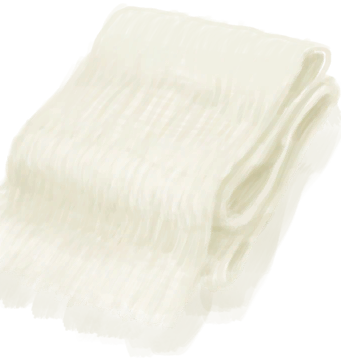
[Tailoring Improved!(Event)](Event_SkillTailoring1.md)](Event_SkillTailoring1.md)</td><td  style="text-align:left;vertical-align:top;"  >Nice!</td><td  style="text-align:left;vertical-align:top;"  >100</td></tr><tr ><td  style="text-align:left;vertical-align:top;"  >[

[Tailoring Improved!(Event)](Event_SkillTailoring2.md)](Event_SkillTailoring2.md)</td><td  style="text-align:left;vertical-align:top;"  >Nice!</td><td  style="text-align:left;vertical-align:top;"  >100</td></tr><tr ><td  style="text-align:left;vertical-align:top;"  >[

[Tailoring Improved!(Event)](Event_SkillTailoring3.md)](Event_SkillTailoring3.md)</td><td  style="text-align:left;vertical-align:top;"  >Nice!</td><td  style="text-align:left;vertical-align:top;"  >100</td></tr><tr ><td  style="text-align:left;vertical-align:top;"  >[

[Tailoring Improved!(Event)](Event_SkillTailoring4.md)](Event_SkillTailoring4.md)</td><td  style="text-align:left;vertical-align:top;"  >Nice!</td><td  style="text-align:left;vertical-align:top;"  >100</td></tr><tr ><td  style="text-align:left;vertical-align:top;"  >[

[Trapping Improved!(Event)](Event_SkillTrapping1.md)](Event_SkillTrapping1.md)</td><td  style="text-align:left;vertical-align:top;"  >Nice!</td><td  style="text-align:left;vertical-align:top;"  >100</td></tr><tr ><td  style="text-align:left;vertical-align:top;"  >[

[Trapping Improved!(Event)](Event_SkillTrapping2.md)](Event_SkillTrapping2.md)</td><td  style="text-align:left;vertical-align:top;"  >Nice!</td><td  style="text-align:left;vertical-align:top;"  >100</td></tr><tr ><td  style="text-align:left;vertical-align:top;"  >[

[Trapping Improved!(Event)](Event_SkillTrapping3.md)](Event_SkillTrapping3.md)</td><td  style="text-align:left;vertical-align:top;"  >Nice!</td><td  style="text-align:left;vertical-align:top;"  >100</td></tr><tr ><td  style="text-align:left;vertical-align:top;"  >[

[Trapping Improved!(Event)](Event_SkillTrapping4.md)](Event_SkillTrapping4.md)</td><td  style="text-align:left;vertical-align:top;"  >Nice!</td><td  style="text-align:left;vertical-align:top;"  >100</td></tr><tr ><td  style="text-align:left;vertical-align:top;"  >[

[Wind Instruments Improved!(Event)](Event_SkillWindInstruments1.md)](Event_SkillWindInstruments1.md)</td><td  style="text-align:left;vertical-align:top;"  >Nice!</td><td  style="text-align:left;vertical-align:top;"  >100</td></tr><tr ><td  style="text-align:left;vertical-align:top;"  >[

[Wind Instruments Improved!(Event)](Event_SkillWindInstruments2.md)](Event_SkillWindInstruments2.md)</td><td  style="text-align:left;vertical-align:top;"  >Nice!</td><td  style="text-align:left;vertical-align:top;"  >100</td></tr><tr ><td  style="text-align:left;vertical-align:top;"  >[

[Wind Instruments Improved!(Event)](Event_SkillWindInstruments3.md)](Event_SkillWindInstruments3.md)</td><td  style="text-align:left;vertical-align:top;"  >Nice!</td><td  style="text-align:left;vertical-align:top;"  >100</td></tr><tr ><td  style="text-align:left;vertical-align:top;"  >[

[Wind Instruments Improved!(Event)](Event_SkillWindInstruments4.md)](Event_SkillWindInstruments4.md)</td><td  style="text-align:left;vertical-align:top;"  >Nice!</td><td  style="text-align:left;vertical-align:top;"  >100</td></tr><tr ><td  style="text-align:left;vertical-align:top;"  >[

[Woodworking Improved!(Event)](Event_SkillWoodworking1.md)](Event_SkillWoodworking1.md)</td><td  style="text-align:left;vertical-align:top;"  >Nice!</td><td  style="text-align:left;vertical-align:top;"  >100</td></tr><tr ><td  style="text-align:left;vertical-align:top;"  >[

[Woodworking Improved!(Event)](Event_SkillWoodworking2.md)](Event_SkillWoodworking2.md)</td><td  style="text-align:left;vertical-align:top;"  >Nice!</td><td  style="text-align:left;vertical-align:top;"  >100</td></tr><tr ><td  style="text-align:left;vertical-align:top;"  >[

[Woodworking Improved!(Event)](Event_SkillWoodworking3.md)](Event_SkillWoodworking3.md)</td><td  style="text-align:left;vertical-align:top;"  >Nice!</td><td  style="text-align:left;vertical-align:top;"  >100</td></tr><tr ><td  style="text-align:left;vertical-align:top;"  >[

[Woodworking Improved!(Event)](Event_SkillWoodworking4.md)](Event_SkillWoodworking4.md)</td><td  style="text-align:left;vertical-align:top;"  >Nice!</td><td  style="text-align:left;vertical-align:top;"  >100</td></tr><tr ><td  style="text-align:left;vertical-align:top;"  >[

[Watcher(Event)](Event_WatchedExperience1gGod.md)](Event_WatchedExperience1gGod.md)</td><td  style="text-align:left;vertical-align:top;"  >Become the Watcher</td><td  style="text-align:left;vertical-align:top;"  >100</td></tr><tr ><td  style="text-align:left;vertical-align:top;"  >[

[Macaque Den(Jungle Highlands)](MacaqueDenEntrance.md)](MacaqueDenEntrance.md)</td><td  style="text-align:left;vertical-align:top;"  >Revenge! ** With：**[Dynamite(On)](DynamiteOn.md)</td><td  style="text-align:left;vertical-align:top;"  >100</td></tr><tr ><td  style="text-align:left;vertical-align:top;"  >[

[Mud Hut(BluePrint)](Bp_MudHut.md)](Bp_MudHut.md)</td><td  style="text-align:left;vertical-align:top;"  >Craft BluePrint</td><td  style="text-align:left;vertical-align:top;"  >50</td></tr><tr ><td  style="text-align:left;vertical-align:top;"  >[

[Stone Hut(BluePrint)](Bp_StoneHut.md)](Bp_StoneHut.md)</td><td  style="text-align:left;vertical-align:top;"  >Craft BluePrint</td><td  style="text-align:left;vertical-align:top;"  >50</td></tr><tr ><td  style="text-align:left;vertical-align:top;"  >[

[Weston(Special1e)(Event)](Event_WestonSpecial1e.md)](Event_WestonSpecial1e.md)</td><td  style="text-align:left;vertical-align:top;"  >Continue</td><td  style="text-align:left;vertical-align:top;"  >50</td></tr><tr ><td  style="text-align:left;vertical-align:top;"  >[

[Honey Glazed Pork](HoneyGlazedPork.md)](HoneyGlazedPork.md)</td><td  style="text-align:left;vertical-align:top;"  >Eat</td><td  style="text-align:left;vertical-align:top;"  >35</td></tr><tr ><td  style="text-align:left;vertical-align:top;"  >[

[Advanced Tune(Event)](Event_NewTuneAdvanced.md)](Event_NewTuneAdvanced.md)</td><td  style="text-align:left;vertical-align:top;"  >Continue</td><td  style="text-align:left;vertical-align:top;"  >30</td></tr><tr ><td  style="text-align:left;vertical-align:top;"  >[

[Cave Tune(Event)](Event_NewTuneCave.md)](Event_NewTuneCave.md)</td><td  style="text-align:left;vertical-align:top;"  >Continue</td><td  style="text-align:left;vertical-align:top;"  >30</td></tr><tr ><td  style="text-align:left;vertical-align:top;"  >[

[Happy Tune(Event)](Event_NewTuneHappy.md)](Event_NewTuneHappy.md)</td><td  style="text-align:left;vertical-align:top;"  >Continue</td><td  style="text-align:left;vertical-align:top;"  >30</td></tr><tr ><td  style="text-align:left;vertical-align:top;"  >[

[Jungle Tune(Event)](Event_NewTuneJungle.md)](Event_NewTuneJungle.md)</td><td  style="text-align:left;vertical-align:top;"  >Continue</td><td  style="text-align:left;vertical-align:top;"  >30</td></tr><tr ><td  style="text-align:left;vertical-align:top;"  >[

[Lonely Tune(Event)](Event_NewTuneLonely.md)](Event_NewTuneLonely.md)</td><td  style="text-align:left;vertical-align:top;"  >Continue</td><td  style="text-align:left;vertical-align:top;"  >30</td></tr><tr ><td  style="text-align:left;vertical-align:top;"  >[

[Sad Tune(Event)](Event_NewTuneSad.md)](Event_NewTuneSad.md)</td><td  style="text-align:left;vertical-align:top;"  >Continue</td><td  style="text-align:left;vertical-align:top;"  >30</td></tr><tr ><td  style="text-align:left;vertical-align:top;"  >[

[Sea Tune(Event)](Event_NewTuneSea.md)](Event_NewTuneSea.md)</td><td  style="text-align:left;vertical-align:top;"  >Continue</td><td  style="text-align:left;vertical-align:top;"  >30</td></tr><tr ><td  style="text-align:left;vertical-align:top;"  >[

[Simple Tune(Event)](Event_NewTuneSimple.md)](Event_NewTuneSimple.md)</td><td  style="text-align:left;vertical-align:top;"  >Continue</td><td  style="text-align:left;vertical-align:top;"  >30</td></tr><tr ><td  style="text-align:left;vertical-align:top;"  >[

[Weston's Tune(Event)](Event_NewTuneWeston.md)](Event_NewTuneWeston.md)</td><td  style="text-align:left;vertical-align:top;"  >Continue</td><td  style="text-align:left;vertical-align:top;"  >30</td></tr><tr ><td  style="text-align:left;vertical-align:top;"  >[

[Wooden Bed(BluePrint)](Bp_BedWooden.md)](Bp_BedWooden.md)</td><td  style="text-align:left;vertical-align:top;"  >Craft BluePrint</td><td  style="text-align:left;vertical-align:top;"  >25</td></tr><tr ><td  style="text-align:left;vertical-align:top;"  >[

[Chair(BluePrint)](Bp_Chair.md)](Bp_Chair.md)</td><td  style="text-align:left;vertical-align:top;"  >Craft BluePrint</td><td  style="text-align:left;vertical-align:top;"  >25</td></tr><tr ><td  style="text-align:left;vertical-align:top;"  >[

[Drum(BluePrint)](Bp_Drum.md)](Bp_Drum.md)</td><td  style="text-align:left;vertical-align:top;"  >Craft BluePrint</td><td  style="text-align:left;vertical-align:top;"  >25</td></tr><tr ><td  style="text-align:left;vertical-align:top;"  >[

[Enclosure(BluePrint)](Bp_Enclosure.md)](Bp_Enclosure.md)</td><td  style="text-align:left;vertical-align:top;"  >Craft BluePrint</td><td  style="text-align:left;vertical-align:top;"  >25</td></tr><tr ><td  style="text-align:left;vertical-align:top;"  >[

[Bone Flute(BluePrint)](Bp_FluteBone.md)](Bp_FluteBone.md)</td><td  style="text-align:left;vertical-align:top;"  >Craft BluePrint</td><td  style="text-align:left;vertical-align:top;"  >25</td></tr><tr ><td  style="text-align:left;vertical-align:top;"  >[

[Wooden Flute(BluePrint)](Bp_FluteWooden.md)](Bp_FluteWooden.md)</td><td  style="text-align:left;vertical-align:top;"  >Craft BluePrint</td><td  style="text-align:left;vertical-align:top;"  >25</td></tr><tr ><td  style="text-align:left;vertical-align:top;"  >[

[Lizard Drum(BluePrint)](Bp_LizardDrum.md)](Bp_LizardDrum.md)</td><td  style="text-align:left;vertical-align:top;"  >Craft BluePrint</td><td  style="text-align:left;vertical-align:top;"  >25</td></tr><tr ><td  style="text-align:left;vertical-align:top;"  >[

[Pottery Wheel(BluePrint)](Bp_PotteryWheel.md)](Bp_PotteryWheel.md)</td><td  style="text-align:left;vertical-align:top;"  >Craft BluePrint</td><td  style="text-align:left;vertical-align:top;"  >25</td></tr><tr ><td  style="text-align:left;vertical-align:top;"  >[

[Table(BluePrint)](Bp_Table.md)](Bp_Table.md)</td><td  style="text-align:left;vertical-align:top;"  >Craft BluePrint</td><td  style="text-align:left;vertical-align:top;"  >25</td></tr><tr ><td  style="text-align:left;vertical-align:top;"  >[

[Area Explored(Event)](Event_AcidLakeExplored.md)](Event_AcidLakeExplored.md)</td><td  style="text-align:left;vertical-align:top;"  >Continue</td><td  style="text-align:left;vertical-align:top;"  >25</td></tr><tr ><td  style="text-align:left;vertical-align:top;"  >[

[Area Explored(Event)(Bay)](Event_BayExplored.md)](Event_BayExplored.md)</td><td  style="text-align:left;vertical-align:top;"  >Continue</td><td  style="text-align:left;vertical-align:top;"  >25</td></tr><tr ><td  style="text-align:left;vertical-align:top;"  >[

[Area Explored(Event)(Beach)](Event_BeachExplored.md)](Event_BeachExplored.md)</td><td  style="text-align:left;vertical-align:top;"  >Continue</td><td  style="text-align:left;vertical-align:top;"  >25</td></tr><tr ><td  style="text-align:left;vertical-align:top;"  >[

[Area Explored(Event)(Bird Rock)](Event_BirdRockExplored.md)](Event_BirdRockExplored.md)</td><td  style="text-align:left;vertical-align:top;"  >Continue</td><td  style="text-align:left;vertical-align:top;"  >25</td></tr><tr ><td  style="text-align:left;vertical-align:top;"  >[

[Area Explored(Event)](Event_CoveExplored.md)](Event_CoveExplored.md)</td><td  style="text-align:left;vertical-align:top;"  >Continue</td><td  style="text-align:left;vertical-align:top;"  >25</td></tr><tr ><td  style="text-align:left;vertical-align:top;"  >[

[Area Explored(Event)(Jungle)](Event_DeepJungleExplored.md)](Event_DeepJungleExplored.md)</td><td  style="text-align:left;vertical-align:top;"  >Continue</td><td  style="text-align:left;vertical-align:top;"  >25</td></tr><tr ><td  style="text-align:left;vertical-align:top;"  >[

[Area Explored(Event)(Desolate Beach)](Event_DesolateBeachExplored.md)](Event_DesolateBeachExplored.md)</td><td  style="text-align:left;vertical-align:top;"  >Continue</td><td  style="text-align:left;vertical-align:top;"  >25</td></tr><tr ><td  style="text-align:left;vertical-align:top;"  >[

[Area Explored(Event)(Eastern Grasslands)](Event_GrasslandsEExplored.md)](Event_GrasslandsEExplored.md)</td><td  style="text-align:left;vertical-align:top;"  >Continue</td><td  style="text-align:left;vertical-align:top;"  >25</td></tr><tr ><td  style="text-align:left;vertical-align:top;"  >[

[Area Explored(Event)(Western Grasslands)](Event_GrasslandsWExplored.md)](Event_GrasslandsWExplored.md)</td><td  style="text-align:left;vertical-align:top;"  >Continue</td><td  style="text-align:left;vertical-align:top;"  >25</td></tr><tr ><td  style="text-align:left;vertical-align:top;"  >[

[Area Explored(Event)(Eastern Highlands)](Event_HighlandsEExplored.md)](Event_HighlandsEExplored.md)</td><td  style="text-align:left;vertical-align:top;"  >Continue</td><td  style="text-align:left;vertical-align:top;"  >25</td></tr><tr ><td  style="text-align:left;vertical-align:top;"  >[

[Area Explored(Event)(Western Highlands)](Event_HighlandsWExplored.md)](Event_HighlandsWExplored.md)</td><td  style="text-align:left;vertical-align:top;"  >Continue</td><td  style="text-align:left;vertical-align:top;"  >25</td></tr><tr ><td  style="text-align:left;vertical-align:top;"  >[

[Area Explored(Event)](Event_JungleExplored.md)](Event_JungleExplored.md)</td><td  style="text-align:left;vertical-align:top;"  >Continue</td><td  style="text-align:left;vertical-align:top;"  >25</td></tr><tr ><td  style="text-align:left;vertical-align:top;"  >[

[Area Explored(Event)(Jungle Highlands)](Event_JungleHighlandsExplored.md)](Event_JungleHighlandsExplored.md)</td><td  style="text-align:left;vertical-align:top;"  >Continue</td><td  style="text-align:left;vertical-align:top;"  >25</td></tr><tr ><td  style="text-align:left;vertical-align:top;"  >[

[Area Explored(Event)(Mangrove Forest)](Event_MangrovesExplored.md)](Event_MangrovesExplored.md)</td><td  style="text-align:left;vertical-align:top;"  >Continue</td><td  style="text-align:left;vertical-align:top;"  >25</td></tr><tr ><td  style="text-align:left;vertical-align:top;"  >[

[Area Explored(Event)](Event_OutskirtsExplored.md)](Event_OutskirtsExplored.md)</td><td  style="text-align:left;vertical-align:top;"  >Continue</td><td  style="text-align:left;vertical-align:top;"  >25</td></tr><tr ><td  style="text-align:left;vertical-align:top;"  >[

[Floating Debris!(Event)](Event_Raft_FloatingDebris.md)](Event_Raft_FloatingDebris.md)</td><td  style="text-align:left;vertical-align:top;"  >Continue</td><td  style="text-align:left;vertical-align:top;"  >25</td></tr><tr ><td  style="text-align:left;vertical-align:top;"  >[

[A Passing Ship!(Event)](Event_Raft_PassingShip.md)](Event_Raft_PassingShip.md)</td><td  style="text-align:left;vertical-align:top;"  >Continue</td><td  style="text-align:left;vertical-align:top;"  >25</td></tr><tr ><td  style="text-align:left;vertical-align:top;"  >[

[A Shark!(Event)](Event_Raft_SharkVisitor.md)](Event_Raft_SharkVisitor.md)</td><td  style="text-align:left;vertical-align:top;"  >Continue</td><td  style="text-align:left;vertical-align:top;"  >25</td></tr><tr ><td  style="text-align:left;vertical-align:top;"  >[

[Area Explored(Event)](Event_RocksExplored.md)](Event_RocksExplored.md)</td><td  style="text-align:left;vertical-align:top;"  >Continue</td><td  style="text-align:left;vertical-align:top;"  >25</td></tr><tr ><td  style="text-align:left;vertical-align:top;"  >[

[Area Explored(Event)(Secret Valley)](Event_SecretValleyExplored.md)](Event_SecretValleyExplored.md)</td><td  style="text-align:left;vertical-align:top;"  >Continue</td><td  style="text-align:left;vertical-align:top;"  >25</td></tr><tr ><td  style="text-align:left;vertical-align:top;"  >[

[Area Explored(Event)](Event_VolcanoExplored.md)](Event_VolcanoExplored.md)</td><td  style="text-align:left;vertical-align:top;"  >Continue</td><td  style="text-align:left;vertical-align:top;"  >25</td></tr><tr ><td  style="text-align:left;vertical-align:top;"  >[

[Area Explored(Event)(Wetlands)](Event_WetlandsExplored.md)](Event_WetlandsExplored.md)</td><td  style="text-align:left;vertical-align:top;"  >Continue</td><td  style="text-align:left;vertical-align:top;"  >25</td></tr><tr ><td  style="text-align:left;vertical-align:top;"  >[

[Copper Decoration](CopperDecoration_Mold.md)](CopperDecoration_Mold.md)</td><td  style="text-align:left;vertical-align:top;"  >Crack Open ** With：**[“Hammer”](tag_Hammer.md)</td><td  style="text-align:left;vertical-align:top;"  >25</td></tr><tr ><td  style="text-align:left;vertical-align:top;"  >[

[Hearty Feast](HeartyFeast.md)](HeartyFeast.md)</td><td  style="text-align:left;vertical-align:top;"  >Eat</td><td  style="text-align:left;vertical-align:top;"  >25</td></tr><tr ><td  style="text-align:left;vertical-align:top;"  >[

[Boar Tusk](Tusk.md)](Tusk.md)</td><td  style="text-align:left;vertical-align:top;"  >Carve ** With：**[“Cutter Advanced”](tag_CutterAdv.md)</td><td  style="text-align:left;vertical-align:top;"  >25</td></tr><tr ><td  style="text-align:left;vertical-align:top;"  >[

[Shed(BluePrint)](Bp_Shed.md)](Bp_Shed.md)</td><td  style="text-align:left;vertical-align:top;"  >Craft BluePrint</td><td  style="text-align:left;vertical-align:top;"  >20</td></tr><tr ><td  style="text-align:left;vertical-align:top;"  >[

[The Boar is down!(Event)](Event_BoarFightSuccess.md)](Event_BoarFightSuccess.md)</td><td  style="text-align:left;vertical-align:top;"  >Continue</td><td  style="text-align:left;vertical-align:top;"  >20</td></tr><tr ><td  style="text-align:left;vertical-align:top;"  >[

[Success!(Event)](Event_CobraFightSuccess.md)](Event_CobraFightSuccess.md)</td><td  style="text-align:left;vertical-align:top;"  >Continue</td><td  style="text-align:left;vertical-align:top;"  >20</td></tr><tr ><td  style="text-align:left;vertical-align:top;"  >[

[Success!(Event)](Event_DroneFightSuccess.md)](Event_DroneFightSuccess.md)</td><td  style="text-align:left;vertical-align:top;"  >Continue</td><td  style="text-align:left;vertical-align:top;"  >20</td></tr><tr ><td  style="text-align:left;vertical-align:top;"  >[

[I made it!(Event)](Event_MacaqueDenFightSuccess.md)](Event_MacaqueDenFightSuccess.md)</td><td  style="text-align:left;vertical-align:top;"  >Continue</td><td  style="text-align:left;vertical-align:top;"  >20</td></tr><tr ><td  style="text-align:left;vertical-align:top;"  >[

[I scared the Macaque away!(Event)](Event_MacaqueFightEscape.md)](Event_MacaqueFightEscape.md)</td><td  style="text-align:left;vertical-align:top;"  >Continue</td><td  style="text-align:left;vertical-align:top;"  >20</td></tr><tr ><td  style="text-align:left;vertical-align:top;"  >[

[The Macaque is down!(Event)](Event_MacaqueFightSuccess.md)](Event_MacaqueFightSuccess.md)</td><td  style="text-align:left;vertical-align:top;"  >Continue</td><td  style="text-align:left;vertical-align:top;"  >20</td></tr><tr ><td  style="text-align:left;vertical-align:top;"  >[

[The Macaque is down!(Event)](Event_MacaqueUndeadFightSuccess.md)](Event_MacaqueUndeadFightSuccess.md)(未实装)</td><td  style="text-align:left;vertical-align:top;"  >Continue</td><td  style="text-align:left;vertical-align:top;"  >20</td></tr><tr ><td  style="text-align:left;vertical-align:top;"  >[

[The Lizard is down!(Event)](Event_MonitorFightSuccess.md)](Event_MonitorFightSuccess.md)</td><td  style="text-align:left;vertical-align:top;"  >Continue</td><td  style="text-align:left;vertical-align:top;"  >20</td></tr><tr ><td  style="text-align:left;vertical-align:top;"  >[

[The Seahound is down!(Event)](Event_SeahoundFightSuccess.md)](Event_SeahoundFightSuccess.md)</td><td  style="text-align:left;vertical-align:top;"  >Continue</td><td  style="text-align:left;vertical-align:top;"  >20</td></tr><tr ><td  style="text-align:left;vertical-align:top;"  >[

[The Shark is down!(Event)](Event_SharkFightSuccess.md)](Event_SharkFightSuccess.md)</td><td  style="text-align:left;vertical-align:top;"  >Continue</td><td  style="text-align:left;vertical-align:top;"  >20</td></tr><tr ><td  style="text-align:left;vertical-align:top;"  >[

[Coconut Fish](CoconutFish.md)](CoconutFish.md)</td><td  style="text-align:left;vertical-align:top;"  >Eat</td><td  style="text-align:left;vertical-align:top;"  >15</td></tr><tr ><td  style="text-align:left;vertical-align:top;"  >[

[Drunken Crab](DrunkenCrab.md)](DrunkenCrab.md)</td><td  style="text-align:left;vertical-align:top;"  >Eat</td><td  style="text-align:left;vertical-align:top;"  >15</td></tr><tr ><td  style="text-align:left;vertical-align:top;"  >[

[Egg Fried Rice](EggFriedRice.md)](EggFriedRice.md)</td><td  style="text-align:left;vertical-align:top;"  >Eat</td><td  style="text-align:left;vertical-align:top;"  >15</td></tr><tr ><td  style="text-align:left;vertical-align:top;"  >[

[Fish N' Chips](FishNChips.md)](FishNChips.md)</td><td  style="text-align:left;vertical-align:top;"  >Eat</td><td  style="text-align:left;vertical-align:top;"  >15</td></tr><tr ><td  style="text-align:left;vertical-align:top;"  >[

[Fried Puffballs](FriedPuffballs.md)](FriedPuffballs.md)</td><td  style="text-align:left;vertical-align:top;"  >Eat</td><td  style="text-align:left;vertical-align:top;"  >15</td></tr><tr ><td  style="text-align:left;vertical-align:top;"  >[

[Island Chicken](IslandChicken.md)](IslandChicken.md)</td><td  style="text-align:left;vertical-align:top;"  >Eat</td><td  style="text-align:left;vertical-align:top;"  >15</td></tr><tr ><td  style="text-align:left;vertical-align:top;"  >[

[Lizard Fry](LizardFry.md)](LizardFry.md)</td><td  style="text-align:left;vertical-align:top;"  >Eat</td><td  style="text-align:left;vertical-align:top;"  >15</td></tr><tr ><td  style="text-align:left;vertical-align:top;"  >[

[Seafood Cup](SeafoodCup.md)](SeafoodCup.md)</td><td  style="text-align:left;vertical-align:top;"  >Eat</td><td  style="text-align:left;vertical-align:top;"  >15</td></tr><tr ><td  style="text-align:left;vertical-align:top;"  >[

[Yam Curry](YamCurry.md)](YamCurry.md)</td><td  style="text-align:left;vertical-align:top;"  >Eat</td><td  style="text-align:left;vertical-align:top;"  >15</td></tr><tr ><td  style="text-align:left;vertical-align:top;"  >[

[Sago Cake](SagoCake.md)](SagoCake.md)</td><td  style="text-align:left;vertical-align:top;"  >Eat</td><td  style="text-align:left;vertical-align:top;"  >12</td></tr><tr ><td  style="text-align:left;vertical-align:top;"  >[

[Rustic Bed(BluePrint)](Bp_BedRustic.md)](Bp_BedRustic.md)</td><td  style="text-align:left;vertical-align:top;"  >Craft BluePrint</td><td  style="text-align:left;vertical-align:top;"  >10</td></tr><tr ><td  style="text-align:left;vertical-align:top;"  >[

[Empty Skep(BluePrint)(Empty)](Bp_BeeSkepEmpty.md)](Bp_BeeSkepEmpty.md)</td><td  style="text-align:left;vertical-align:top;"  >Craft BluePrint</td><td  style="text-align:left;vertical-align:top;"  >10</td></tr><tr ><td  style="text-align:left;vertical-align:top;"  >[

[Bookshelf(BluePrint)](Bp_Bookshelf.md)](Bp_Bookshelf.md)</td><td  style="text-align:left;vertical-align:top;"  >Craft BluePrint</td><td  style="text-align:left;vertical-align:top;"  >10</td></tr><tr ><td  style="text-align:left;vertical-align:top;"  >[

[Cellar(BluePrint)](Bp_Cellar.md)](Bp_Cellar.md)</td><td  style="text-align:left;vertical-align:top;"  >Craft BluePrint</td><td  style="text-align:left;vertical-align:top;"  >10</td></tr><tr ><td  style="text-align:left;vertical-align:top;"  >[

[Cistern(BluePrint)](Bp_Cistern.md)](Bp_Cistern.md)</td><td  style="text-align:left;vertical-align:top;"  >Craft BluePrint</td><td  style="text-align:left;vertical-align:top;"  >10</td></tr><tr ><td  style="text-align:left;vertical-align:top;"  >[

[Forge(BluePrint)](Bp_Forge.md)](Bp_Forge.md)</td><td  style="text-align:left;vertical-align:top;"  >Craft BluePrint</td><td  style="text-align:left;vertical-align:top;"  >10</td></tr><tr ><td  style="text-align:left;vertical-align:top;"  >[

[Advanced Kiln(BluePrint)](Bp_KilnAdvanced.md)](Bp_KilnAdvanced.md)</td><td  style="text-align:left;vertical-align:top;"  >Craft BluePrint</td><td  style="text-align:left;vertical-align:top;"  >10</td></tr><tr ><td  style="text-align:left;vertical-align:top;"  >[

[Salt Bed(BluePrint)](Bp_SaltBed.md)](Bp_SaltBed.md)</td><td  style="text-align:left;vertical-align:top;"  >Craft BluePrint</td><td  style="text-align:left;vertical-align:top;"  >10</td></tr><tr ><td  style="text-align:left;vertical-align:top;"  >[

[Shower(BluePrint)](Bp_Shower.md)](Bp_Shower.md)</td><td  style="text-align:left;vertical-align:top;"  >Craft BluePrint</td><td  style="text-align:left;vertical-align:top;"  >10</td></tr><tr ><td  style="text-align:left;vertical-align:top;"  >[

[Stove(BluePrint)](Bp_Stove.md)](Bp_Stove.md)</td><td  style="text-align:left;vertical-align:top;"  >Craft BluePrint</td><td  style="text-align:left;vertical-align:top;"  >10</td></tr><tr ><td  style="text-align:left;vertical-align:top;"  >[

[Supply Chest(BluePrint)](Bp_SupplyChest.md)](Bp_SupplyChest.md)</td><td  style="text-align:left;vertical-align:top;"  >Craft BluePrint</td><td  style="text-align:left;vertical-align:top;"  >10</td></tr><tr ><td  style="text-align:left;vertical-align:top;"  >[

[Water Reservoir(BluePrint)](Bp_WaterReservoir.md)](Bp_WaterReservoir.md)</td><td  style="text-align:left;vertical-align:top;"  >Craft BluePrint</td><td  style="text-align:left;vertical-align:top;"  >10</td></tr><tr ><td  style="text-align:left;vertical-align:top;"  >[

[Watering Trough(BluePrint)](Bp_WateringTrough.md)](Bp_WateringTrough.md)</td><td  style="text-align:left;vertical-align:top;"  >Craft BluePrint</td><td  style="text-align:left;vertical-align:top;"  >10</td></tr><tr ><td  style="text-align:left;vertical-align:top;"  >[

[Well(BluePrint)](Bp_Well.md)](Bp_Well.md)</td><td  style="text-align:left;vertical-align:top;"  >Craft BluePrint</td><td  style="text-align:left;vertical-align:top;"  >10</td></tr><tr ><td  style="text-align:left;vertical-align:top;"  >[

[Bedroll(BluePrint)](Bp_Bedroll.md)](Bp_Bedroll.md)</td><td  style="text-align:left;vertical-align:top;"  >Craft BluePrint</td><td  style="text-align:left;vertical-align:top;"  >10</td></tr><tr ><td  style="text-align:left;vertical-align:top;"  >[

[Bee Suit(BluePrint)](Bp_BeeSuit.md)](Bp_BeeSuit.md)</td><td  style="text-align:left;vertical-align:top;"  >Craft BluePrint</td><td  style="text-align:left;vertical-align:top;"  >10</td></tr><tr ><td  style="text-align:left;vertical-align:top;"  >[

[Bellows(BluePrint)](Bp_Bellows.md)](Bp_Bellows.md)</td><td  style="text-align:left;vertical-align:top;"  >Craft BluePrint</td><td  style="text-align:left;vertical-align:top;"  >10</td></tr><tr ><td  style="text-align:left;vertical-align:top;"  >[

[Copper Bottle(BluePrint)](Bp_CopperBottle.md)](Bp_CopperBottle.md)</td><td  style="text-align:left;vertical-align:top;"  >Craft BluePrint</td><td  style="text-align:left;vertical-align:top;"  >10</td></tr><tr ><td  style="text-align:left;vertical-align:top;"  >[

[Copper Jar(BluePrint)](Bp_CopperJar.md)](Bp_CopperJar.md)</td><td  style="text-align:left;vertical-align:top;"  >Craft BluePrint</td><td  style="text-align:left;vertical-align:top;"  >10</td></tr><tr ><td  style="text-align:left;vertical-align:top;"  >[

[Copper Necklace(BluePrint)](Bp_CopperNecklace.md)](Bp_CopperNecklace.md)</td><td  style="text-align:left;vertical-align:top;"  >Craft BluePrint</td><td  style="text-align:left;vertical-align:top;"  >10</td></tr><tr ><td  style="text-align:left;vertical-align:top;"  >[

[Copper Needles(BluePrint)](Bp_CopperNeedles.md)](Bp_CopperNeedles.md)</td><td  style="text-align:left;vertical-align:top;"  >Craft BluePrint</td><td  style="text-align:left;vertical-align:top;"  >10</td></tr><tr ><td  style="text-align:left;vertical-align:top;"  >[

[Copper Eating Utensils(BluePrint)](Bp_EatingUtensilsCopper.md)](Bp_EatingUtensilsCopper.md)</td><td  style="text-align:left;vertical-align:top;"  >Craft BluePrint</td><td  style="text-align:left;vertical-align:top;"  >10</td></tr><tr ><td  style="text-align:left;vertical-align:top;"  >[

[Flower Necklace(BluePrint)](Bp_FlowerNecklace.md)](Bp_FlowerNecklace.md)</td><td  style="text-align:left;vertical-align:top;"  >Craft BluePrint</td><td  style="text-align:left;vertical-align:top;"  >10</td></tr><tr ><td  style="text-align:left;vertical-align:top;"  >[

[Gas Mask(BluePrint)](Bp_GasMask.md)](Bp_GasMask.md)</td><td  style="text-align:left;vertical-align:top;"  >Craft BluePrint</td><td  style="text-align:left;vertical-align:top;"  >10</td></tr><tr ><td  style="text-align:left;vertical-align:top;"  >[

[Leather Backpack(BluePrint)](Bp_LeatherBackpack.md)](Bp_LeatherBackpack.md)</td><td  style="text-align:left;vertical-align:top;"  >Craft BluePrint</td><td  style="text-align:left;vertical-align:top;"  >10</td></tr><tr ><td  style="text-align:left;vertical-align:top;"  >[

[Leather Pants(BluePrint)](Bp_LeatherPants.md)](Bp_LeatherPants.md)</td><td  style="text-align:left;vertical-align:top;"  >Craft BluePrint</td><td  style="text-align:left;vertical-align:top;"  >10</td></tr><tr ><td  style="text-align:left;vertical-align:top;"  >[

[Pearl Necklace(BluePrint)](Bp_PearlNecklace.md)](Bp_PearlNecklace.md)</td><td  style="text-align:left;vertical-align:top;"  >Craft BluePrint</td><td  style="text-align:left;vertical-align:top;"  >10</td></tr><tr ><td  style="text-align:left;vertical-align:top;"  >[

[Raincoat(BluePrint)](Bp_Raincoat.md)](Bp_Raincoat.md)</td><td  style="text-align:left;vertical-align:top;"  >Craft BluePrint</td><td  style="text-align:left;vertical-align:top;"  >10</td></tr><tr ><td  style="text-align:left;vertical-align:top;"  >[
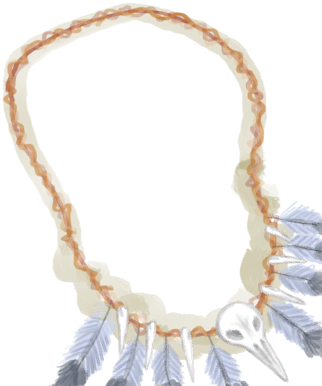
[Seagull Charm(BluePrint)](Bp_SeagullCharm.md)](Bp_SeagullCharm.md)</td><td  style="text-align:left;vertical-align:top;"  >Craft BluePrint</td><td  style="text-align:left;vertical-align:top;"  >10</td></tr><tr ><td  style="text-align:left;vertical-align:top;"  >[

[Seashell Necklace(BluePrint)](Bp_SeashellNecklace.md)](Bp_SeashellNecklace.md)</td><td  style="text-align:left;vertical-align:top;"  >Craft BluePrint</td><td  style="text-align:left;vertical-align:top;"  >10</td></tr><tr ><td  style="text-align:left;vertical-align:top;"  >[

[Shark Headpiece(BluePrint)](Bp_SharkHeadpiece.md)](Bp_SharkHeadpiece.md)</td><td  style="text-align:left;vertical-align:top;"  >Craft BluePrint</td><td  style="text-align:left;vertical-align:top;"  >10</td></tr><tr ><td  style="text-align:left;vertical-align:top;"  >[

[Straw Cape(BluePrint)](Bp_StrawCape.md)](Bp_StrawCape.md)</td><td  style="text-align:left;vertical-align:top;"  >Craft BluePrint</td><td  style="text-align:left;vertical-align:top;"  >10</td></tr><tr ><td  style="text-align:left;vertical-align:top;"  >[

[Waterskin(BluePrint)](Bp_Waterskin.md)](Bp_Waterskin.md)</td><td  style="text-align:left;vertical-align:top;"  >Craft BluePrint</td><td  style="text-align:left;vertical-align:top;"  >10</td></tr><tr ><td  style="text-align:left;vertical-align:top;"  >[

[Wooden Needles(BluePrint)](Bp_WoodenNeedles.md)](Bp_WoodenNeedles.md)</td><td  style="text-align:left;vertical-align:top;"  >Craft BluePrint</td><td  style="text-align:left;vertical-align:top;"  >10</td></tr><tr ><td  style="text-align:left;vertical-align:top;"  >[

[Got it!(Event)](Event_GoatFightSuccess.md)](Event_GoatFightSuccess.md)</td><td  style="text-align:left;vertical-align:top;"  >Continue</td><td  style="text-align:left;vertical-align:top;"  >10</td></tr><tr ><td  style="text-align:left;vertical-align:top;"  >[
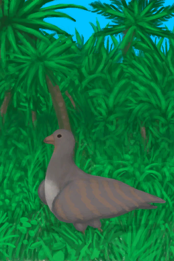
[Got it!(Event)](Event_PartridgeFightSuccess.md)](Event_PartridgeFightSuccess.md)</td><td  style="text-align:left;vertical-align:top;"  >Continue</td><td  style="text-align:left;vertical-align:top;"  >10</td></tr><tr ><td  style="text-align:left;vertical-align:top;"  >[

[Got it!(Event)](Event_SeagullFightSuccess.md)](Event_SeagullFightSuccess.md)</td><td  style="text-align:left;vertical-align:top;"  >Continue</td><td  style="text-align:left;vertical-align:top;"  >10</td></tr><tr ><td  style="text-align:left;vertical-align:top;"  >[

[Cave(Event)(Wetlands)](Event_CaveDarkFound.md)](Event_CaveDarkFound.md)</td><td  style="text-align:left;vertical-align:top;"  >Continue</td><td  style="text-align:left;vertical-align:top;"  >10</td></tr><tr ><td  style="text-align:left;vertical-align:top;"  >[

[Cave(Event)(Rocks)](Event_CaveFound.md)](Event_CaveFound.md)</td><td  style="text-align:left;vertical-align:top;"  >Continue</td><td  style="text-align:left;vertical-align:top;"  >10</td></tr><tr ><td  style="text-align:left;vertical-align:top;"  >[

[Secret Cove(Event)](Event_CoveFound.md)](Event_CoveFound.md)</td><td  style="text-align:left;vertical-align:top;"  >Continue</td><td  style="text-align:left;vertical-align:top;"  >10</td></tr><tr ><td  style="text-align:left;vertical-align:top;"  >[

[A gift!(Event)](Event_DogFriendGift.md)](Event_DogFriendGift.md)</td><td  style="text-align:left;vertical-align:top;"  >Check Gift</td><td  style="text-align:left;vertical-align:top;"  >10</td></tr><tr ><td  style="text-align:left;vertical-align:top;"  >[

[Jungle Path(Event)](Event_JunglePathFound.md)](Event_JunglePathFound.md)</td><td  style="text-align:left;vertical-align:top;"  >Continue</td><td  style="text-align:left;vertical-align:top;"  >10</td></tr><tr ><td  style="text-align:left;vertical-align:top;"  >[

[A gift!(Event)](Event_MacaqueFriendGift.md)](Event_MacaqueFriendGift.md)</td><td  style="text-align:left;vertical-align:top;"  >Check Gift</td><td  style="text-align:left;vertical-align:top;"  >10</td></tr><tr ><td  style="text-align:left;vertical-align:top;"  >[

[Jungle Outskirts(Event)](Event_OutskirtsFoundFromBeach.md)](Event_OutskirtsFoundFromBeach.md)</td><td  style="text-align:left;vertical-align:top;"  >Continue</td><td  style="text-align:left;vertical-align:top;"  >10</td></tr><tr ><td  style="text-align:left;vertical-align:top;"  >[

[Rocks(Event)](Event_RocksFound.md)](Event_RocksFound.md)</td><td  style="text-align:left;vertical-align:top;"  >Continue</td><td  style="text-align:left;vertical-align:top;"  >10</td></tr><tr ><td  style="text-align:left;vertical-align:top;"  >[

[Shipwreck(Event)](Event_ShipwreckFound.md)](Event_ShipwreckFound.md)</td><td  style="text-align:left;vertical-align:top;"  >Continue</td><td  style="text-align:left;vertical-align:top;"  >10</td></tr><tr ><td  style="text-align:left;vertical-align:top;"  >[

[Unfinished  Bone Flute](FluteBone_Unfinished.md)](FluteBone_Unfinished.md)</td><td  style="text-align:left;vertical-align:top;"  >Finished!</td><td  style="text-align:left;vertical-align:top;"  >10</td></tr><tr ><td  style="text-align:left;vertical-align:top;"  >[

[Unfinished  Wooden Flute](FluteWooden_Unfinished.md)](FluteWooden_Unfinished.md)</td><td  style="text-align:left;vertical-align:top;"  >Finished!</td><td  style="text-align:left;vertical-align:top;"  >10</td></tr><tr ><td  style="text-align:left;vertical-align:top;"  >[

[Candied Ginger](CandiedGinger.md)](CandiedGinger.md)</td><td  style="text-align:left;vertical-align:top;"  >Eat</td><td  style="text-align:left;vertical-align:top;"  >10</td></tr><tr ><td  style="text-align:left;vertical-align:top;"  >[

[Chocolate](Chocolate.md)](Chocolate.md)</td><td  style="text-align:left;vertical-align:top;"  >Eat</td><td  style="text-align:left;vertical-align:top;"  >10</td></tr><tr ><td  style="text-align:left;vertical-align:top;"  >[

[Fish Omelette](FishOmelette.md)](FishOmelette.md)</td><td  style="text-align:left;vertical-align:top;"  >Eat</td><td  style="text-align:left;vertical-align:top;"  >10</td></tr><tr ><td  style="text-align:left;vertical-align:top;"  >[

[Macaque Skewers](MacaqueSkewers.md)](MacaqueSkewers.md)</td><td  style="text-align:left;vertical-align:top;"  >Eat</td><td  style="text-align:left;vertical-align:top;"  >10</td></tr><tr ><td  style="text-align:left;vertical-align:top;"  >[

[Fried Banana](FriedBanana.md)](FriedBanana.md)</td><td  style="text-align:left;vertical-align:top;"  >Eat</td><td  style="text-align:left;vertical-align:top;"  >10</td></tr><tr ><td  style="text-align:left;vertical-align:top;"  >[

[Honey Candy](HoneyCandy.md)](HoneyCandy.md)</td><td  style="text-align:left;vertical-align:top;"  >Eat</td><td  style="text-align:left;vertical-align:top;"  >10</td></tr><tr ><td  style="text-align:left;vertical-align:top;"  >[

[Sushi](Sushi.md)](Sushi.md)</td><td  style="text-align:left;vertical-align:top;"  >Eat</td><td  style="text-align:left;vertical-align:top;"  >10</td></tr><tr ><td  style="text-align:left;vertical-align:top;"  >[

[Unfinished Wood Carving](WoodCarving_Unfinished.md)](WoodCarving_Unfinished.md)</td><td  style="text-align:left;vertical-align:top;"  >Finished!</td><td  style="text-align:left;vertical-align:top;"  >10</td></tr><tr ><td  style="text-align:left;vertical-align:top;"  >[

[Honey](LQ_Honey.md)](LQ_Honey.md)</td><td  style="text-align:left;vertical-align:top;"  >Drink</td><td  style="text-align:left;vertical-align:top;"  >10</td></tr><tr ><td  style="text-align:left;vertical-align:top;"  >[

[Kava](LQ_Kava.md)](LQ_Kava.md)</td><td  style="text-align:left;vertical-align:top;"  >Drink</td><td  style="text-align:left;vertical-align:top;"  >10</td></tr><tr ><td  style="text-align:left;vertical-align:top;"  >[

[Dried Boar Meat](BoarMeatDried.md)](BoarMeatDried.md)</td><td  style="text-align:left;vertical-align:top;"  >Eat</td><td  style="text-align:left;vertical-align:top;"  >7</td></tr><tr ><td  style="text-align:left;vertical-align:top;"  >[

[Cured Boar Meat](BoarMeatSalted.md)](BoarMeatSalted.md)</td><td  style="text-align:left;vertical-align:top;"  >Eat</td><td  style="text-align:left;vertical-align:top;"  >7</td></tr><tr ><td  style="text-align:left;vertical-align:top;"  >[

[Cured Meat](MeatSaltedDried.md)](MeatSaltedDried.md)</td><td  style="text-align:left;vertical-align:top;"  >Eat</td><td  style="text-align:left;vertical-align:top;"  >7</td></tr><tr ><td  style="text-align:left;vertical-align:top;"  >[

[Dried Lizard Meat](MonitorMeatDried.md)](MonitorMeatDried.md)(未实装)</td><td  style="text-align:left;vertical-align:top;"  >Eat</td><td  style="text-align:left;vertical-align:top;"  >7</td></tr><tr ><td  style="text-align:left;vertical-align:top;"  >[

[Cured Lizard Meat](MonitorMeatSalted.md)](MonitorMeatSalted.md)(未实装)</td><td  style="text-align:left;vertical-align:top;"  >Eat</td><td  style="text-align:left;vertical-align:top;"  >7</td></tr><tr ><td  style="text-align:left;vertical-align:top;"  >[
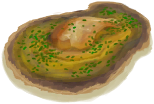
[Butter Baked Oyster](OysterMeatBaked.md)](OysterMeatBaked.md)</td><td  style="text-align:left;vertical-align:top;"  >Eat</td><td  style="text-align:left;vertical-align:top;"  >7</td></tr><tr ><td  style="text-align:left;vertical-align:top;"  >[

[Bee Skep(BluePrint)](Bp_BeeSkep.md)](Bp_BeeSkep.md)</td><td  style="text-align:left;vertical-align:top;"  >Craft BluePrint</td><td  style="text-align:left;vertical-align:top;"  >5</td></tr><tr ><td  style="text-align:left;vertical-align:top;"  >[

[Bee Smoker(BluePrint)](Bp_BeeSmoker.md)](Bp_BeeSmoker.md)</td><td  style="text-align:left;vertical-align:top;"  >Craft BluePrint</td><td  style="text-align:left;vertical-align:top;"  >5</td></tr><tr ><td  style="text-align:left;vertical-align:top;"  >[

[Boar Feeder(BluePrint)](Bp_BoarFeeder.md)](Bp_BoarFeeder.md)</td><td  style="text-align:left;vertical-align:top;"  >Craft BluePrint</td><td  style="text-align:left;vertical-align:top;"  >5</td></tr><tr ><td  style="text-align:left;vertical-align:top;"  >[

[Chest(BluePrint)](Bp_Chest.md)](Bp_Chest.md)</td><td  style="text-align:left;vertical-align:top;"  >Craft BluePrint</td><td  style="text-align:left;vertical-align:top;"  >5</td></tr><tr ><td  style="text-align:left;vertical-align:top;"  >[

[Compost Bin(BluePrint)](Bp_CompostBin.md)](Bp_CompostBin.md)</td><td  style="text-align:left;vertical-align:top;"  >Craft BluePrint</td><td  style="text-align:left;vertical-align:top;"  >5</td></tr><tr ><td  style="text-align:left;vertical-align:top;"  >[

[Flint Axe(BluePrint)](Bp_FlintAxe.md)](Bp_FlintAxe.md)</td><td  style="text-align:left;vertical-align:top;"  >Craft BluePrint</td><td  style="text-align:left;vertical-align:top;"  >5</td></tr><tr ><td  style="text-align:left;vertical-align:top;"  >[

[Goat Feeder(BluePrint)](Bp_GoatFeeder.md)](Bp_GoatFeeder.md)</td><td  style="text-align:left;vertical-align:top;"  >Craft BluePrint</td><td  style="text-align:left;vertical-align:top;"  >5</td></tr><tr ><td  style="text-align:left;vertical-align:top;"  >[

[Harpoon(BluePrint)](Bp_Harpoon.md)](Bp_Harpoon.md)</td><td  style="text-align:left;vertical-align:top;"  >Craft BluePrint</td><td  style="text-align:left;vertical-align:top;"  >5</td></tr><tr ><td  style="text-align:left;vertical-align:top;"  >[

[Kiln(BluePrint)](Bp_Kiln.md)](Bp_Kiln.md)</td><td  style="text-align:left;vertical-align:top;"  >Craft BluePrint</td><td  style="text-align:left;vertical-align:top;"  >5</td></tr><tr ><td  style="text-align:left;vertical-align:top;"  >[

[Loom(BluePrint)](Bp_Loom.md)](Bp_Loom.md)</td><td  style="text-align:left;vertical-align:top;"  >Craft BluePrint</td><td  style="text-align:left;vertical-align:top;"  >5</td></tr><tr ><td  style="text-align:left;vertical-align:top;"  >[

[Partridge Feeder(BluePrint)](Bp_PartridgeFeeder.md)](Bp_PartridgeFeeder.md)</td><td  style="text-align:left;vertical-align:top;"  >Craft BluePrint</td><td  style="text-align:left;vertical-align:top;"  >5</td></tr><tr ><td  style="text-align:left;vertical-align:top;"  >[

[Rice Paddy(BluePrint)](Bp_RicePaddy.md)](Bp_RicePaddy.md)</td><td  style="text-align:left;vertical-align:top;"  >Craft BluePrint</td><td  style="text-align:left;vertical-align:top;"  >5</td></tr><tr ><td  style="text-align:left;vertical-align:top;"  >[

[Scrap Axe(BluePrint)](Bp_ScrapAxe.md)](Bp_ScrapAxe.md)</td><td  style="text-align:left;vertical-align:top;"  >Craft BluePrint</td><td  style="text-align:left;vertical-align:top;"  >5</td></tr><tr ><td  style="text-align:left;vertical-align:top;"  >[

[Scrap Knife(BluePrint)](Bp_ScrapKnife.md)](Bp_ScrapKnife.md)</td><td  style="text-align:left;vertical-align:top;"  >Craft BluePrint</td><td  style="text-align:left;vertical-align:top;"  >5</td></tr><tr ><td  style="text-align:left;vertical-align:top;"  >[

[Scrap Shovel(BluePrint)](Bp_ScrapShovel.md)](Bp_ScrapShovel.md)</td><td  style="text-align:left;vertical-align:top;"  >Craft BluePrint</td><td  style="text-align:left;vertical-align:top;"  >5</td></tr><tr ><td  style="text-align:left;vertical-align:top;"  >[

[Sling(BluePrint)](Bp_Sling.md)](Bp_Sling.md)</td><td  style="text-align:left;vertical-align:top;"  >Craft BluePrint</td><td  style="text-align:left;vertical-align:top;"  >5</td></tr><tr ><td  style="text-align:left;vertical-align:top;"  >[

[Stone Axe(BluePrint)](Bp_StoneAxe.md)](Bp_StoneAxe.md)</td><td  style="text-align:left;vertical-align:top;"  >Craft BluePrint</td><td  style="text-align:left;vertical-align:top;"  >5</td></tr><tr ><td  style="text-align:left;vertical-align:top;"  >[

[Torch(BluePrint)](Bp_Torch.md)](Bp_Torch.md)</td><td  style="text-align:left;vertical-align:top;"  >Craft BluePrint</td><td  style="text-align:left;vertical-align:top;"  >5</td></tr><tr ><td  style="text-align:left;vertical-align:top;"  >[

[Trapping Pit(BluePrint)](Bp_TrappingPit.md)](Bp_TrappingPit.md)</td><td  style="text-align:left;vertical-align:top;"  >Craft BluePrint</td><td  style="text-align:left;vertical-align:top;"  >5</td></tr><tr ><td  style="text-align:left;vertical-align:top;"  >[

[Travois(BluePrint)](Bp_Travois.md)](Bp_Travois.md)</td><td  style="text-align:left;vertical-align:top;"  >Craft BluePrint</td><td  style="text-align:left;vertical-align:top;"  >5</td></tr><tr ><td  style="text-align:left;vertical-align:top;"  >[

[Treenails(BluePrint)](Bp_Treenails.md)](Bp_Treenails.md)</td><td  style="text-align:left;vertical-align:top;"  >Craft BluePrint</td><td  style="text-align:left;vertical-align:top;"  >5</td></tr><tr ><td  style="text-align:left;vertical-align:top;"  >[

[Water Filter(BluePrint)](Bp_WaterFilter.md)](Bp_WaterFilter.md)</td><td  style="text-align:left;vertical-align:top;"  >Craft BluePrint</td><td  style="text-align:left;vertical-align:top;"  >5</td></tr><tr ><td  style="text-align:left;vertical-align:top;"  >[

[Wood Carvings(BluePrint)](Bp_WoodCarvings.md)](Bp_WoodCarvings.md)</td><td  style="text-align:left;vertical-align:top;"  >Craft BluePrint</td><td  style="text-align:left;vertical-align:top;"  >5</td></tr><tr ><td  style="text-align:left;vertical-align:top;"  >[

[Woven Backpack(BluePrint)](Bp_WovenBackpack.md)](Bp_WovenBackpack.md)</td><td  style="text-align:left;vertical-align:top;"  >Craft BluePrint</td><td  style="text-align:left;vertical-align:top;"  >5</td></tr><tr ><td  style="text-align:left;vertical-align:top;"  >[

[Woven Basket(BluePrint)](Bp_WovenBasket.md)](Bp_WovenBasket.md)</td><td  style="text-align:left;vertical-align:top;"  >Craft BluePrint</td><td  style="text-align:left;vertical-align:top;"  >5</td></tr><tr ><td  style="text-align:left;vertical-align:top;"  >[

[Woven Hat(BluePrint)](Bp_WovenHat.md)](Bp_WovenHat.md)</td><td  style="text-align:left;vertical-align:top;"  >Craft BluePrint</td><td  style="text-align:left;vertical-align:top;"  >5</td></tr><tr ><td  style="text-align:left;vertical-align:top;"  >[

[Alembic(BluePrint)](Bp_Alembic.md)](Bp_Alembic.md)</td><td  style="text-align:left;vertical-align:top;"  >Craft BluePrint</td><td  style="text-align:left;vertical-align:top;"  >5</td></tr><tr ><td  style="text-align:left;vertical-align:top;"  >[

[Clay Pot Cooler(BluePrint)](Bp_ClayPotCooler.md)](Bp_ClayPotCooler.md)</td><td  style="text-align:left;vertical-align:top;"  >Craft BluePrint</td><td  style="text-align:left;vertical-align:top;"  >5</td></tr><tr ><td  style="text-align:left;vertical-align:top;"  >[

[Hammock(BluePrint)](Bp_Hammock.md)](Bp_Hammock.md)</td><td  style="text-align:left;vertical-align:top;"  >Craft BluePrint</td><td  style="text-align:left;vertical-align:top;"  >5</td></tr><tr ><td  style="text-align:left;vertical-align:top;"  >[

[Quiver(BluePrint)](Bp_Quiver.md)](Bp_Quiver.md)</td><td  style="text-align:left;vertical-align:top;"  >Craft BluePrint</td><td  style="text-align:left;vertical-align:top;"  >5</td></tr><tr ><td  style="text-align:left;vertical-align:top;"  >[

[Satchel(BluePrint)](Bp_Satchel.md)](Bp_Satchel.md)</td><td  style="text-align:left;vertical-align:top;"  >Craft BluePrint</td><td  style="text-align:left;vertical-align:top;"  >5</td></tr><tr ><td  style="text-align:left;vertical-align:top;"  >[
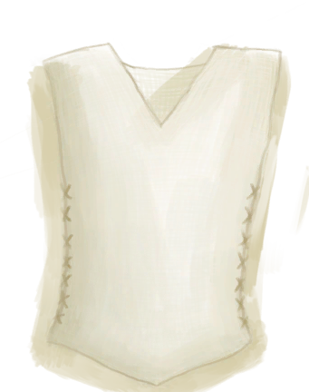
[Shirt(BluePrint)](Bp_Shirt.md)](Bp_Shirt.md)</td><td  style="text-align:left;vertical-align:top;"  >Craft BluePrint</td><td  style="text-align:left;vertical-align:top;"  >5</td></tr><tr ><td  style="text-align:left;vertical-align:top;"  >[

[Beach(Event)](Event_BeachFoundFromMangroves.md)](Event_BeachFoundFromMangroves.md)</td><td  style="text-align:left;vertical-align:top;"  >Continue</td><td  style="text-align:left;vertical-align:top;"  >5</td></tr><tr ><td  style="text-align:left;vertical-align:top;"  >[

[Beach(Event)](Event_BeachFoundFromOutskirts.md)](Event_BeachFoundFromOutskirts.md)</td><td  style="text-align:left;vertical-align:top;"  >Continue</td><td  style="text-align:left;vertical-align:top;"  >5</td></tr><tr ><td  style="text-align:left;vertical-align:top;"  >[

[Copper Vein(Event)](Event_CopperFound.md)](Event_CopperFound.md)</td><td  style="text-align:left;vertical-align:top;"  >Continue</td><td  style="text-align:left;vertical-align:top;"  >5</td></tr><tr ><td  style="text-align:left;vertical-align:top;"  >[

[Highlands(Event)](Event_HighlandsFound.md)](Event_HighlandsFound.md)</td><td  style="text-align:left;vertical-align:top;"  >Continue</td><td  style="text-align:left;vertical-align:top;"  >5</td></tr><tr ><td  style="text-align:left;vertical-align:top;"  >[

[Jungle(Event)](Event_JungleFound.md)](Event_JungleFound.md)</td><td  style="text-align:left;vertical-align:top;"  >Continue</td><td  style="text-align:left;vertical-align:top;"  >5</td></tr><tr ><td  style="text-align:left;vertical-align:top;"  >[

[Outskirts(Event)](Event_JungleFoundFromWetlands.md)](Event_JungleFoundFromWetlands.md)</td><td  style="text-align:left;vertical-align:top;"  >Continue</td><td  style="text-align:left;vertical-align:top;"  >5</td></tr><tr ><td  style="text-align:left;vertical-align:top;"  >[

[Mangrove Forest(Event)](Event_MangrovesFoundFromBeach.md)](Event_MangrovesFoundFromBeach.md)</td><td  style="text-align:left;vertical-align:top;"  >Continue</td><td  style="text-align:left;vertical-align:top;"  >5</td></tr><tr ><td  style="text-align:left;vertical-align:top;"  >[

[Mangrove Forest(Event)](Event_MangrovesFoundFromWetlands.md)](Event_MangrovesFoundFromWetlands.md)</td><td  style="text-align:left;vertical-align:top;"  >Continue</td><td  style="text-align:left;vertical-align:top;"  >5</td></tr><tr ><td  style="text-align:left;vertical-align:top;"  >[

[Mountain Path(Event)](Event_MountainsFound.md)](Event_MountainsFound.md)</td><td  style="text-align:left;vertical-align:top;"  >Continue</td><td  style="text-align:left;vertical-align:top;"  >5</td></tr><tr ><td  style="text-align:left;vertical-align:top;"  >[

[Outskirts(Event)](Event_OutskirtsFoundFromJungle.md)](Event_OutskirtsFoundFromJungle.md)</td><td  style="text-align:left;vertical-align:top;"  >Continue</td><td  style="text-align:left;vertical-align:top;"  >5</td></tr><tr ><td  style="text-align:left;vertical-align:top;"  >[

[Plane Crash(Event)](Event_PlaneCrashFound.md)](Event_PlaneCrashFound.md)</td><td  style="text-align:left;vertical-align:top;"  >Continue</td><td  style="text-align:left;vertical-align:top;"  >5</td></tr><tr ><td  style="text-align:left;vertical-align:top;"  >[

[Wetlands(Event)](Event_WetlandsFound.md)](Event_WetlandsFound.md)</td><td  style="text-align:left;vertical-align:top;"  >Continue</td><td  style="text-align:left;vertical-align:top;"  >5</td></tr><tr ><td  style="text-align:left;vertical-align:top;"  >[

[Wetlands(Event)](Event_WetlandsFoundFromMangroves.md)](Event_WetlandsFoundFromMangroves.md)</td><td  style="text-align:left;vertical-align:top;"  >Continue</td><td  style="text-align:left;vertical-align:top;"  >5</td></tr><tr ><td  style="text-align:left;vertical-align:top;"  >[

[Unfinished  Bone Flute](FluteBone_Unfinished.md)](FluteBone_Unfinished.md)</td><td  style="text-align:left;vertical-align:top;"  >Carve ** With：**[“Cutter Advanced”](tag_CutterAdv.md)</td><td  style="text-align:left;vertical-align:top;"  >5</td></tr><tr ><td  style="text-align:left;vertical-align:top;"  >[

[Unfinished  Wooden Flute](FluteWooden_Unfinished.md)](FluteWooden_Unfinished.md)</td><td  style="text-align:left;vertical-align:top;"  >Carve ** With：**[“Cutter Advanced”](tag_CutterAdv.md)</td><td  style="text-align:left;vertical-align:top;"  >5</td></tr><tr ><td  style="text-align:left;vertical-align:top;"  >[

[Alien Nodule](AlienNodule.md)](AlienNodule.md)</td><td  style="text-align:left;vertical-align:top;"  >Eat</td><td  style="text-align:left;vertical-align:top;"  >5</td></tr><tr ><td  style="text-align:left;vertical-align:top;"  >[

[Cooked Boar Meat](BoarMeatCooked.md)](BoarMeatCooked.md)</td><td  style="text-align:left;vertical-align:top;"  >Eat</td><td  style="text-align:left;vertical-align:top;"  >5</td></tr><tr ><td  style="text-align:left;vertical-align:top;"  >[

[Drying Boar Meat](BoarMeatSaltedDrying.md)](BoarMeatSaltedDrying.md)</td><td  style="text-align:left;vertical-align:top;"  >Eat</td><td  style="text-align:left;vertical-align:top;"  >5</td></tr><tr ><td  style="text-align:left;vertical-align:top;"  >[

[Smoked Boar Meat](BoarMeatSmoked.md)](BoarMeatSmoked.md)</td><td  style="text-align:left;vertical-align:top;"  >Eat</td><td  style="text-align:left;vertical-align:top;"  >5</td></tr><tr ><td  style="text-align:left;vertical-align:top;"  >[

[Goat Cheese](Cheese.md)](Cheese.md)</td><td  style="text-align:left;vertical-align:top;"  >Eat</td><td  style="text-align:left;vertical-align:top;"  >5</td></tr><tr ><td  style="text-align:left;vertical-align:top;"  >[

[Chicken Sandwich](ChickenSandwich.md)](ChickenSandwich.md)</td><td  style="text-align:left;vertical-align:top;"  >Eat</td><td  style="text-align:left;vertical-align:top;"  >5</td></tr><tr ><td  style="text-align:left;vertical-align:top;"  >[

[Goat Stew](GoatStew.md)](GoatStew.md)</td><td  style="text-align:left;vertical-align:top;"  >Eat</td><td  style="text-align:left;vertical-align:top;"  >5</td></tr><tr ><td  style="text-align:left;vertical-align:top;"  >[

[Jungle Salad](JungleSalad.md)](JungleSalad.md)</td><td  style="text-align:left;vertical-align:top;"  >Eat</td><td  style="text-align:left;vertical-align:top;"  >5</td></tr><tr ><td  style="text-align:left;vertical-align:top;"  >[

[Cooked Goat Meat](GoatMeatCooked.md)](GoatMeatCooked.md)</td><td  style="text-align:left;vertical-align:top;"  >Eat</td><td  style="text-align:left;vertical-align:top;"  >5</td></tr><tr ><td  style="text-align:left;vertical-align:top;"  >[
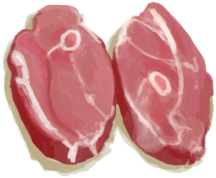
[Dried Goat Meat](GoatMeatDried.md)](GoatMeatDried.md)</td><td  style="text-align:left;vertical-align:top;"  >Eat</td><td  style="text-align:left;vertical-align:top;"  >5</td></tr><tr ><td  style="text-align:left;vertical-align:top;"  >[

[Cured Goat Meat](GoatMeatSalted.md)](GoatMeatSalted.md)</td><td  style="text-align:left;vertical-align:top;"  >Eat</td><td  style="text-align:left;vertical-align:top;"  >5</td></tr><tr ><td  style="text-align:left;vertical-align:top;"  >[

[Drying Goat Meat](GoatMeatSaltedDrying.md)](GoatMeatSaltedDrying.md)</td><td  style="text-align:left;vertical-align:top;"  >Eat</td><td  style="text-align:left;vertical-align:top;"  >5</td></tr><tr ><td  style="text-align:left;vertical-align:top;"  >[

[Smoked Goat Meat](GoatMeatSmoked.md)](GoatMeatSmoked.md)</td><td  style="text-align:left;vertical-align:top;"  >Eat</td><td  style="text-align:left;vertical-align:top;"  >5</td></tr><tr ><td  style="text-align:left;vertical-align:top;"  >[

[Grandfather](Grandfather.md)](Grandfather.md)</td><td  style="text-align:left;vertical-align:top;"  >Feed ** With：**[“Cookable”](tag_MealCoconutShell.md)</td><td  style="text-align:left;vertical-align:top;"  >5</td></tr><tr ><td  style="text-align:left;vertical-align:top;"  >[

[Grandfather](Grandfather.md)](Grandfather.md)</td><td  style="text-align:left;vertical-align:top;"  >Feed ** With：**[“Cookable”](tag_MealCookingpot.md)</td><td  style="text-align:left;vertical-align:top;"  >5</td></tr><tr ><td  style="text-align:left;vertical-align:top;"  >[

[Grandfather](GrandfatherHealthy.md)](GrandfatherHealthy.md)</td><td  style="text-align:left;vertical-align:top;"  >Feed ** With：**[“Cookable”](tag_MealCoconutShell.md)</td><td  style="text-align:left;vertical-align:top;"  >5</td></tr><tr ><td  style="text-align:left;vertical-align:top;"  >[

[Grandfather](GrandfatherHealthy.md)](GrandfatherHealthy.md)</td><td  style="text-align:left;vertical-align:top;"  >Feed ** With：**[“Cookable”](tag_MealCookingpot.md)</td><td  style="text-align:left;vertical-align:top;"  >5</td></tr><tr ><td  style="text-align:left;vertical-align:top;"  >[

[Cooked Macaque Meat](MacaqueMeatCooked.md)](MacaqueMeatCooked.md)</td><td  style="text-align:left;vertical-align:top;"  >Eat</td><td  style="text-align:left;vertical-align:top;"  >5</td></tr><tr ><td  style="text-align:left;vertical-align:top;"  >[

[Dried Macaque Meat](MacaqueMeatDried.md)](MacaqueMeatDried.md)</td><td  style="text-align:left;vertical-align:top;"  >Eat</td><td  style="text-align:left;vertical-align:top;"  >5</td></tr><tr ><td  style="text-align:left;vertical-align:top;"  >[

[Cured Macaque Meat](MacaqueMeatSalted.md)](MacaqueMeatSalted.md)</td><td  style="text-align:left;vertical-align:top;"  >Eat</td><td  style="text-align:left;vertical-align:top;"  >5</td></tr><tr ><td  style="text-align:left;vertical-align:top;"  >[

[Drying Macaque Meat](MacaqueMeatSaltedDrying.md)](MacaqueMeatSaltedDrying.md)</td><td  style="text-align:left;vertical-align:top;"  >Eat</td><td  style="text-align:left;vertical-align:top;"  >5</td></tr><tr ><td  style="text-align:left;vertical-align:top;"  >[

[Smoked Macaque Meat](MacaqueMeatSmoked.md)](MacaqueMeatSmoked.md)</td><td  style="text-align:left;vertical-align:top;"  >Eat</td><td  style="text-align:left;vertical-align:top;"  >5</td></tr><tr ><td  style="text-align:left;vertical-align:top;"  >[

[Drying Meat](MeatSaltedDrying.md)](MeatSaltedDrying.md)</td><td  style="text-align:left;vertical-align:top;"  >Eat</td><td  style="text-align:left;vertical-align:top;"  >5</td></tr><tr ><td  style="text-align:left;vertical-align:top;"  >[

[Cooked Lizard Meat](MonitorMeatCooked.md)](MonitorMeatCooked.md)</td><td  style="text-align:left;vertical-align:top;"  >Eat</td><td  style="text-align:left;vertical-align:top;"  >5</td></tr><tr ><td  style="text-align:left;vertical-align:top;"  >[

[Drying Lizard Meat](MonitorMeatSaltedDrying.md)](MonitorMeatSaltedDrying.md)(未实装)</td><td  style="text-align:left;vertical-align:top;"  >Eat</td><td  style="text-align:left;vertical-align:top;"  >5</td></tr><tr ><td  style="text-align:left;vertical-align:top;"  >[

[Smoked Lizard Meat](MonitorMeatSmoked.md)](MonitorMeatSmoked.md)</td><td  style="text-align:left;vertical-align:top;"  >Eat</td><td  style="text-align:left;vertical-align:top;"  >5</td></tr><tr ><td  style="text-align:left;vertical-align:top;"  >[

[Protein Bar](ProteinBar.md)](ProteinBar.md)</td><td  style="text-align:left;vertical-align:top;"  >Eat</td><td  style="text-align:left;vertical-align:top;"  >5</td></tr><tr ><td  style="text-align:left;vertical-align:top;"  >[

[Sago Flatbread with Honey](SagoFlatbreadHoney.md)](SagoFlatbreadHoney.md)</td><td  style="text-align:left;vertical-align:top;"  >Eat</td><td  style="text-align:left;vertical-align:top;"  >5</td></tr><tr ><td  style="text-align:left;vertical-align:top;"  >[

[Sago Flatbread with Jam](SagoFlatbreadJam.md)](SagoFlatbreadJam.md)</td><td  style="text-align:left;vertical-align:top;"  >Eat</td><td  style="text-align:left;vertical-align:top;"  >5</td></tr><tr ><td  style="text-align:left;vertical-align:top;"  >[

[Cooked Seahound](SeahoundCooked.md)](SeahoundCooked.md)</td><td  style="text-align:left;vertical-align:top;"  >Eat</td><td  style="text-align:left;vertical-align:top;"  >5</td></tr><tr ><td  style="text-align:left;vertical-align:top;"  >[

[Yam Jam](YamJam.md)](YamJam.md)</td><td  style="text-align:left;vertical-align:top;"  >Eat</td><td  style="text-align:left;vertical-align:top;"  >5</td></tr><tr ><td  style="text-align:left;vertical-align:top;"  >[
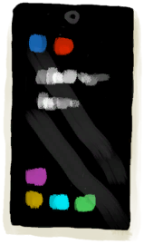
[Phone(On)](PhoneOn.md)](PhoneOn.md)</td><td  style="text-align:left;vertical-align:top;"  >Play Game</td><td  style="text-align:left;vertical-align:top;"  >5</td></tr><tr ><td  style="text-align:left;vertical-align:top;"  >[

[Phone](PhoneOnLight.md)](PhoneOnLight.md)</td><td  style="text-align:left;vertical-align:top;"  >Play Game</td><td  style="text-align:left;vertical-align:top;"  >5</td></tr><tr ><td  style="text-align:left;vertical-align:top;"  >[

[Unfinished Wood Carving](WoodCarving_Unfinished.md)](WoodCarving_Unfinished.md)</td><td  style="text-align:left;vertical-align:top;"  >Carve ** With：**[“Cutter Advanced”](tag_CutterAdv.md)</td><td  style="text-align:left;vertical-align:top;"  >5</td></tr><tr ><td  style="text-align:left;vertical-align:top;"  >[

[Mead](LQ_Mead.md)](LQ_Mead.md)</td><td  style="text-align:left;vertical-align:top;"  >Drink</td><td  style="text-align:left;vertical-align:top;"  >5</td></tr><tr ><td  style="text-align:left;vertical-align:top;"  >[

[Palm Wine](LQ_PalmWine.md)](LQ_PalmWine.md)</td><td  style="text-align:left;vertical-align:top;"  >Drink</td><td  style="text-align:left;vertical-align:top;"  >5</td></tr><tr ><td  style="text-align:left;vertical-align:top;"  >[

[Bat Cave](CaveBats.md)](CaveBats.md)</td><td  style="text-align:left;vertical-align:top;"  >Clean ** With：**[Broom](Broom.md)</td><td  style="text-align:left;vertical-align:top;"  >5</td></tr><tr ><td  style="text-align:left;vertical-align:top;"  >[
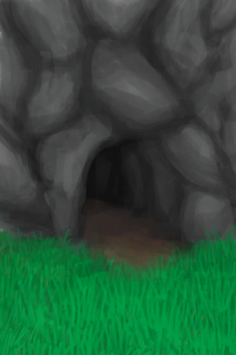
[Grasslands Cave(Cave)](CaveGrasslands.md)](CaveGrasslands.md)</td><td  style="text-align:left;vertical-align:top;"  >Clean ** With：**[Broom](Broom.md)</td><td  style="text-align:left;vertical-align:top;"  >5</td></tr><tr ><td  style="text-align:left;vertical-align:top;"  >[

[Sea Cave(Cave)](CaveSea.md)](CaveSea.md)</td><td  style="text-align:left;vertical-align:top;"  >Clean ** With：**[Broom](Broom.md)</td><td  style="text-align:left;vertical-align:top;"  >5</td></tr><tr ><td  style="text-align:left;vertical-align:top;"  >[

[Crystal Chamber(High Chamber)](CrystalChamber.md)](CrystalChamber.md)</td><td  style="text-align:left;vertical-align:top;"  >Clean ** With：**[Broom](Broom.md)</td><td  style="text-align:left;vertical-align:top;"  >5</td></tr><tr ><td  style="text-align:left;vertical-align:top;"  >[

[Damp Chamber](DampChamber.md)](DampChamber.md)</td><td  style="text-align:left;vertical-align:top;"  >Clean ** With：**[Broom](Broom.md)</td><td  style="text-align:left;vertical-align:top;"  >5</td></tr><tr ><td  style="text-align:left;vertical-align:top;"  >[

[Darkness(Dark Chamber)](DarkChamber.md)](DarkChamber.md)</td><td  style="text-align:left;vertical-align:top;"  >Clean ** With：**[Broom](Broom.md)</td><td  style="text-align:left;vertical-align:top;"  >5</td></tr><tr ><td  style="text-align:left;vertical-align:top;"  >[

[Flooded Chamber](FloodedChamber.md)](FloodedChamber.md)</td><td  style="text-align:left;vertical-align:top;"  >Clean ** With：**[Broom](Broom.md)</td><td  style="text-align:left;vertical-align:top;"  >5</td></tr><tr ><td  style="text-align:left;vertical-align:top;"  >[

[High Chamber](HighChamber.md)](HighChamber.md)</td><td  style="text-align:left;vertical-align:top;"  >Clean ** With：**[Broom](Broom.md)</td><td  style="text-align:left;vertical-align:top;"  >5</td></tr><tr ><td  style="text-align:left;vertical-align:top;"  >[

[Low Chamber(High Chamber)](LowChamber.md)](LowChamber.md)</td><td  style="text-align:left;vertical-align:top;"  >Clean ** With：**[Broom](Broom.md)</td><td  style="text-align:left;vertical-align:top;"  >5</td></tr><tr ><td  style="text-align:left;vertical-align:top;"  >[

[Medium Chamber(High Chamber)](MidChamber.md)](MidChamber.md)</td><td  style="text-align:left;vertical-align:top;"  >Clean ** With：**[Broom](Broom.md)</td><td  style="text-align:left;vertical-align:top;"  >5</td></tr><tr ><td  style="text-align:left;vertical-align:top;"  >[

[Narrow Tunnel(High Chamber)](NarrowTunnel.md)](NarrowTunnel.md)</td><td  style="text-align:left;vertical-align:top;"  >Clean ** With：**[Broom](Broom.md)</td><td  style="text-align:left;vertical-align:top;"  >5</td></tr><tr ><td  style="text-align:left;vertical-align:top;"  >[

[Tunnel](Tunnel.md)](Tunnel.md)</td><td  style="text-align:left;vertical-align:top;"  >Clean ** With：**[Broom](Broom.md)</td><td  style="text-align:left;vertical-align:top;"  >5</td></tr><tr ><td  style="text-align:left;vertical-align:top;"  >[
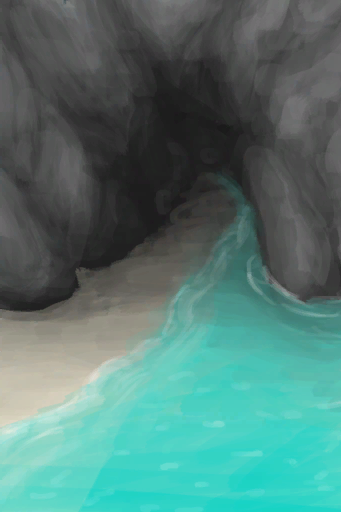
[Tidal Cave](CaveTidal.md)](CaveTidal.md)</td><td  style="text-align:left;vertical-align:top;"  >Clean ** With：**[Broom](Broom.md)</td><td  style="text-align:left;vertical-align:top;"  >5</td></tr><tr ><td  style="text-align:left;vertical-align:top;"  >[

[Cellar](Cellar.md)](Cellar.md)</td><td  style="text-align:left;vertical-align:top;"  >Clean ** With：**[Broom](Broom.md)</td><td  style="text-align:left;vertical-align:top;"  >5</td></tr><tr ><td  style="text-align:left;vertical-align:top;"  >[

[Dark Cave](DarkCave.md)](DarkCave.md)</td><td  style="text-align:left;vertical-align:top;"  >Clean ** With：**[Broom](Broom.md)</td><td  style="text-align:left;vertical-align:top;"  >5</td></tr><tr ><td  style="text-align:left;vertical-align:top;"  >[

[Enclosure](Enclosure.md)](Enclosure.md)</td><td  style="text-align:left;vertical-align:top;"  >Clean ** With：**[Broom](Broom.md)</td><td  style="text-align:left;vertical-align:top;"  >5</td></tr><tr ><td  style="text-align:left;vertical-align:top;"  >[

[Macaque Den](MacaqueDen.md)](MacaqueDen.md)</td><td  style="text-align:left;vertical-align:top;"  >Clean ** With：**[Broom](Broom.md)</td><td  style="text-align:left;vertical-align:top;"  >5</td></tr><tr ><td  style="text-align:left;vertical-align:top;"  >[

[Mud Hut](MudHut.md)](MudHut.md)</td><td  style="text-align:left;vertical-align:top;"  >Clean ** With：**[Broom](Broom.md)</td><td  style="text-align:left;vertical-align:top;"  >5</td></tr><tr ><td  style="text-align:left;vertical-align:top;"  >[

[Mud Hut](MudHutRuins.md)](MudHutRuins.md)</td><td  style="text-align:left;vertical-align:top;"  >Clean ** With：**[Broom](Broom.md)</td><td  style="text-align:left;vertical-align:top;"  >5</td></tr><tr ><td  style="text-align:left;vertical-align:top;"  >[

[Plane Crash(Crashed Plane)](PlaneCrash.md)](PlaneCrash.md)</td><td  style="text-align:left;vertical-align:top;"  >Clean ** With：**[Broom](Broom.md)</td><td  style="text-align:left;vertical-align:top;"  >5</td></tr><tr ><td  style="text-align:left;vertical-align:top;"  >[

[Shed](Shed.md)](Shed.md)</td><td  style="text-align:left;vertical-align:top;"  >Clean ** With：**[Broom](Broom.md)</td><td  style="text-align:left;vertical-align:top;"  >5</td></tr><tr ><td  style="text-align:left;vertical-align:top;"  >[

[Stone Hut](StoneHut.md)](StoneHut.md)</td><td  style="text-align:left;vertical-align:top;"  >Clean ** With：**[Broom](Broom.md)</td><td  style="text-align:left;vertical-align:top;"  >5</td></tr><tr ><td  style="text-align:left;vertical-align:top;"  >[

[Shower](Shower.md)](Shower.md)</td><td  style="text-align:left;vertical-align:top;"  >Take a Shower</td><td  style="text-align:left;vertical-align:top;"  >5</td></tr><tr ><td  style="text-align:left;vertical-align:top;"  >[

[Baby](Baby.md)](Baby.md)</td><td  style="text-align:left;vertical-align:top;"  >Play</td><td  style="text-align:left;vertical-align:top;"  >4</td></tr><tr ><td  style="text-align:left;vertical-align:top;"  >[

[Fish Taco](FishTaco.md)](FishTaco.md)</td><td  style="text-align:left;vertical-align:top;"  >Eat</td><td  style="text-align:left;vertical-align:top;"  >4</td></tr><tr ><td  style="text-align:left;vertical-align:top;"  >[

[Cooked Urchin](UrchinMeatCooked.md)](UrchinMeatCooked.md)</td><td  style="text-align:left;vertical-align:top;"  >Eat</td><td  style="text-align:left;vertical-align:top;"  >4</td></tr><tr ><td  style="text-align:left;vertical-align:top;"  >[

[Coconut Milk](LQ_CoconutMilk.md)](LQ_CoconutMilk.md)</td><td  style="text-align:left;vertical-align:top;"  >Drink</td><td  style="text-align:left;vertical-align:top;"  >4</td></tr><tr ><td  style="text-align:left;vertical-align:top;"  >[

[Skimmed Milk](LQ_MilkSkimmed.md)](LQ_MilkSkimmed.md)(未实装)</td><td  style="text-align:left;vertical-align:top;"  >Drink</td><td  style="text-align:left;vertical-align:top;"  >4</td></tr><tr ><td  style="text-align:left;vertical-align:top;"  >[

[Whey](LQ_MilkWhey.md)](LQ_MilkWhey.md)</td><td  style="text-align:left;vertical-align:top;"  >Drink</td><td  style="text-align:left;vertical-align:top;"  >4</td></tr><tr ><td  style="text-align:left;vertical-align:top;"  >[

[Whole Milk](LQ_MilkWhole.md)](LQ_MilkWhole.md)</td><td  style="text-align:left;vertical-align:top;"  >Drink</td><td  style="text-align:left;vertical-align:top;"  >4</td></tr><tr ><td  style="text-align:left;vertical-align:top;"  >[

[Seawater(Flooded Chamber)](Sea_Cave.md)](Sea_Cave.md)</td><td  style="text-align:left;vertical-align:top;"  >Dive</td><td  style="text-align:left;vertical-align:top;"  >4</td></tr><tr ><td  style="text-align:left;vertical-align:top;"  >[

[Sand(Atoll)](SandSource.md)](SandSource.md)</td><td  style="text-align:left;vertical-align:top;"  >Build a Sand Castle</td><td  style="text-align:left;vertical-align:top;"  >4</td></tr><tr ><td  style="text-align:left;vertical-align:top;"  >[

[Sea(Atoll)](Sea_Atoll.md)](Sea_Atoll.md)</td><td  style="text-align:left;vertical-align:top;"  >Dive</td><td  style="text-align:left;vertical-align:top;"  >4</td></tr><tr ><td  style="text-align:left;vertical-align:top;"  >[

[Sea(Bay)](Sea_Bay.md)](Sea_Bay.md)</td><td  style="text-align:left;vertical-align:top;"  >Dive</td><td  style="text-align:left;vertical-align:top;"  >4</td></tr><tr ><td  style="text-align:left;vertical-align:top;"  >[

[Sea(Beach)](Sea_Beach.md)](Sea_Beach.md)</td><td  style="text-align:left;vertical-align:top;"  >Dive</td><td  style="text-align:left;vertical-align:top;"  >4</td></tr><tr ><td  style="text-align:left;vertical-align:top;"  >[

[Sea(Secret Cove)](Sea_Cove.md)](Sea_Cove.md)</td><td  style="text-align:left;vertical-align:top;"  >Dive</td><td  style="text-align:left;vertical-align:top;"  >4</td></tr><tr ><td  style="text-align:left;vertical-align:top;"  >[

[Sea(Desolate Beach)](Sea_DesolateBeach.md)](Sea_DesolateBeach.md)</td><td  style="text-align:left;vertical-align:top;"  >Dive</td><td  style="text-align:left;vertical-align:top;"  >4</td></tr><tr ><td  style="text-align:left;vertical-align:top;"  >[

[Sea(Mangrove Forest)](Sea_Mangroves.md)](Sea_Mangroves.md)</td><td  style="text-align:left;vertical-align:top;"  >Dive</td><td  style="text-align:left;vertical-align:top;"  >4</td></tr><tr ><td  style="text-align:left;vertical-align:top;"  >[

[Sea](Sea_Raft.md)](Sea_Raft.md)</td><td  style="text-align:left;vertical-align:top;"  >Dive</td><td  style="text-align:left;vertical-align:top;"  >4</td></tr><tr ><td  style="text-align:left;vertical-align:top;"  >[

[Sea(Bird Rock)](Sea_Rocks.md)](Sea_Rocks.md)</td><td  style="text-align:left;vertical-align:top;"  >Dive</td><td  style="text-align:left;vertical-align:top;"  >4</td></tr><tr ><td  style="text-align:left;vertical-align:top;"  >[

[Drum(Event)](Event_DrumMenu.md)](Event_DrumMenu.md)(未实装)</td><td  style="text-align:left;vertical-align:top;"  >Flowing Rythm</td><td  style="text-align:left;vertical-align:top;"  >3 / /TP</td></tr><tr ><td  style="text-align:left;vertical-align:top;"  >[

[Drum(Event)](Event_DrumMenu.md)](Event_DrumMenu.md)(未实装)</td><td  style="text-align:left;vertical-align:top;"  >Intense Rythm</td><td  style="text-align:left;vertical-align:top;"  >3 / /TP</td></tr><tr ><td  style="text-align:left;vertical-align:top;"  >[

[Page 1(Event)](Event_FluteTunes1.md)](Event_FluteTunes1.md)</td><td  style="text-align:left;vertical-align:top;"  >Simple Tune</td><td  style="text-align:left;vertical-align:top;"  >3 / /TP</td></tr><tr ><td  style="text-align:left;vertical-align:top;"  >[

[Page 1(Event)](Event_FluteTunes1.md)](Event_FluteTunes1.md)</td><td  style="text-align:left;vertical-align:top;"  >Happy Tune</td><td  style="text-align:left;vertical-align:top;"  >3 / /TP</td></tr><tr ><td  style="text-align:left;vertical-align:top;"  >[

[Page 1(Event)](Event_FluteTunes1.md)](Event_FluteTunes1.md)</td><td  style="text-align:left;vertical-align:top;"  >Sad Tune</td><td  style="text-align:left;vertical-align:top;"  >3 / /TP</td></tr><tr ><td  style="text-align:left;vertical-align:top;"  >[

[Page 2(Event)](Event_FluteTunes2.md)](Event_FluteTunes2.md)</td><td  style="text-align:left;vertical-align:top;"  >Lonely Tune</td><td  style="text-align:left;vertical-align:top;"  >3 / /TP</td></tr><tr ><td  style="text-align:left;vertical-align:top;"  >[

[Page 2(Event)](Event_FluteTunes2.md)](Event_FluteTunes2.md)</td><td  style="text-align:left;vertical-align:top;"  >Weston's Tune</td><td  style="text-align:left;vertical-align:top;"  >3 / /TP</td></tr><tr ><td  style="text-align:left;vertical-align:top;"  >[

[Page 2(Event)](Event_FluteTunes2.md)](Event_FluteTunes2.md)</td><td  style="text-align:left;vertical-align:top;"  >Advanced Tune</td><td  style="text-align:left;vertical-align:top;"  >3 / /TP</td></tr><tr ><td  style="text-align:left;vertical-align:top;"  >[

[Page 3(Event)](Event_FluteTunes3.md)](Event_FluteTunes3.md)</td><td  style="text-align:left;vertical-align:top;"  >Sea Tune</td><td  style="text-align:left;vertical-align:top;"  >3 / /TP</td></tr><tr ><td  style="text-align:left;vertical-align:top;"  >[

[Page 3(Event)](Event_FluteTunes3.md)](Event_FluteTunes3.md)</td><td  style="text-align:left;vertical-align:top;"  >Jungle Tune</td><td  style="text-align:left;vertical-align:top;"  >3 / /TP</td></tr><tr ><td  style="text-align:left;vertical-align:top;"  >[

[Page 3(Event)](Event_FluteTunes3.md)](Event_FluteTunes3.md)</td><td  style="text-align:left;vertical-align:top;"  >Cave Tune</td><td  style="text-align:left;vertical-align:top;"  >3 / /TP</td></tr><tr ><td  style="text-align:left;vertical-align:top;"  >[

[Drum](Drum.md)](Drum.md)</td><td  style="text-align:left;vertical-align:top;"  >Flowing Rhythm</td><td  style="text-align:left;vertical-align:top;"  >3 / /TP</td></tr><tr ><td  style="text-align:left;vertical-align:top;"  >[

[Drum](Drum.md)](Drum.md)</td><td  style="text-align:left;vertical-align:top;"  >Intense Rhythm</td><td  style="text-align:left;vertical-align:top;"  >3 / /TP</td></tr><tr ><td  style="text-align:left;vertical-align:top;"  >[

[Drum](Drum.md)](Drum.md)</td><td  style="text-align:left;vertical-align:top;"  >Drum Trance</td><td  style="text-align:left;vertical-align:top;"  >3 / /TP</td></tr><tr ><td  style="text-align:left;vertical-align:top;"  >[

[Cooked Bird Meat](BirdMeatCooked.md)](BirdMeatCooked.md)</td><td  style="text-align:left;vertical-align:top;"  >Eat</td><td  style="text-align:left;vertical-align:top;"  >3</td></tr><tr ><td  style="text-align:left;vertical-align:top;"  >[

[Smoked Bird Meat](BirdMeatSmoked.md)](BirdMeatSmoked.md)</td><td  style="text-align:left;vertical-align:top;"  >Eat</td><td  style="text-align:left;vertical-align:top;"  >3</td></tr><tr ><td  style="text-align:left;vertical-align:top;"  >[

[Cooked Bonefish](BonefishCooked.md)](BonefishCooked.md)</td><td  style="text-align:left;vertical-align:top;"  >Eat Fish</td><td  style="text-align:left;vertical-align:top;"  >3</td></tr><tr ><td  style="text-align:left;vertical-align:top;"  >[

[Smoked Bonefish](BonefishSmoked.md)](BonefishSmoked.md)</td><td  style="text-align:left;vertical-align:top;"  >Eat Fish</td><td  style="text-align:left;vertical-align:top;"  >3</td></tr><tr ><td  style="text-align:left;vertical-align:top;"  >[

[Cooked Soft Conch Meat](ConchMeatSoftCooked.md)](ConchMeatSoftCooked.md)</td><td  style="text-align:left;vertical-align:top;"  >Eat</td><td  style="text-align:left;vertical-align:top;"  >3</td></tr><tr ><td  style="text-align:left;vertical-align:top;"  >[

[Cooked Goatfish](GoatfishCooked.md)](GoatfishCooked.md)</td><td  style="text-align:left;vertical-align:top;"  >Eat Fish</td><td  style="text-align:left;vertical-align:top;"  >3</td></tr><tr ><td  style="text-align:left;vertical-align:top;"  >[

[Smoked Goatfish](GoatfishSmoked.md)](GoatfishSmoked.md)</td><td  style="text-align:left;vertical-align:top;"  >Eat Fish</td><td  style="text-align:left;vertical-align:top;"  >3</td></tr><tr ><td  style="text-align:left;vertical-align:top;"  >[

[Cooked Grouper](GrouperMeatCooked.md)](GrouperMeatCooked.md)</td><td  style="text-align:left;vertical-align:top;"  >Eat Cooked Goatfish</td><td  style="text-align:left;vertical-align:top;"  >3</td></tr><tr ><td  style="text-align:left;vertical-align:top;"  >[

[Smoked Grouper](GrouperMeatSmoked.md)](GrouperMeatSmoked.md)</td><td  style="text-align:left;vertical-align:top;"  >Eat Smoked Goatfish</td><td  style="text-align:left;vertical-align:top;"  >3</td></tr><tr ><td  style="text-align:left;vertical-align:top;"  >[

[Cooked Herring](HerringCooked.md)](HerringCooked.md)</td><td  style="text-align:left;vertical-align:top;"  >Eat Fish</td><td  style="text-align:left;vertical-align:top;"  >3</td></tr><tr ><td  style="text-align:left;vertical-align:top;"  >[

[Smoked Herring](HerringSmoked.md)](HerringSmoked.md)(未实装)</td><td  style="text-align:left;vertical-align:top;"  >Eat Fish</td><td  style="text-align:left;vertical-align:top;"  >3</td></tr><tr ><td  style="text-align:left;vertical-align:top;"  >[

[Mango](Mango.md)](Mango.md)</td><td  style="text-align:left;vertical-align:top;"  >Eat</td><td  style="text-align:left;vertical-align:top;"  >3</td></tr><tr ><td  style="text-align:left;vertical-align:top;"  >[

[Cooked Oyster](OysterMeatCooked.md)](OysterMeatCooked.md)</td><td  style="text-align:left;vertical-align:top;"  >Eat</td><td  style="text-align:left;vertical-align:top;"  >3</td></tr><tr ><td  style="text-align:left;vertical-align:top;"  >[
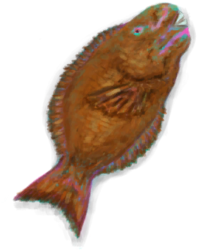
[Cooked Parrot Fish](ParrotFishCooked.md)](ParrotFishCooked.md)</td><td  style="text-align:left;vertical-align:top;"  >Eat Fish</td><td  style="text-align:left;vertical-align:top;"  >3</td></tr><tr ><td  style="text-align:left;vertical-align:top;"  >[

[Smoked Parrot Fish](ParrotFishSmoked.md)](ParrotFishSmoked.md)</td><td  style="text-align:left;vertical-align:top;"  >Eat Fish</td><td  style="text-align:left;vertical-align:top;"  >3</td></tr><tr ><td  style="text-align:left;vertical-align:top;"  >[

[Cooked Shark](SharkCooked.md)](SharkCooked.md)</td><td  style="text-align:left;vertical-align:top;"  >Eat</td><td  style="text-align:left;vertical-align:top;"  >3</td></tr><tr ><td  style="text-align:left;vertical-align:top;"  >[

[Smoked Shark](SharkSmoked.md)](SharkSmoked.md)</td><td  style="text-align:left;vertical-align:top;"  >Eat</td><td  style="text-align:left;vertical-align:top;"  >3</td></tr><tr ><td  style="text-align:left;vertical-align:top;"  >[

[Cooked Snake Meat](SnakeCooked.md)](SnakeCooked.md)</td><td  style="text-align:left;vertical-align:top;"  >Eat</td><td  style="text-align:left;vertical-align:top;"  >3</td></tr><tr ><td  style="text-align:left;vertical-align:top;"  >[

[Cooked Threadfin](ThreadfinCooked.md)](ThreadfinCooked.md)</td><td  style="text-align:left;vertical-align:top;"  >Eat</td><td  style="text-align:left;vertical-align:top;"  >3</td></tr><tr ><td  style="text-align:left;vertical-align:top;"  >[

[Smoked Threadfin](ThreadfinSmoked.md)](ThreadfinSmoked.md)</td><td  style="text-align:left;vertical-align:top;"  >Eat</td><td  style="text-align:left;vertical-align:top;"  >3</td></tr><tr ><td  style="text-align:left;vertical-align:top;"  >[

[Lizard Drum](LizardDrum.md)](LizardDrum.md)</td><td  style="text-align:left;vertical-align:top;"  >Flowing Rhythm</td><td  style="text-align:left;vertical-align:top;"  >3 / /TP</td></tr><tr ><td  style="text-align:left;vertical-align:top;"  >[

[Lizard Drum](LizardDrum.md)](LizardDrum.md)</td><td  style="text-align:left;vertical-align:top;"  >Intense Rhythm</td><td  style="text-align:left;vertical-align:top;"  >3 / /TP</td></tr><tr ><td  style="text-align:left;vertical-align:top;"  >[

[Lizard Drum](LizardDrum.md)](LizardDrum.md)</td><td  style="text-align:left;vertical-align:top;"  >Drum Trance</td><td  style="text-align:left;vertical-align:top;"  >3 / /TP</td></tr><tr ><td  style="text-align:left;vertical-align:top;"  >[

[Lizard Drum](LizardDrum.md)](LizardDrum.md)</td><td  style="text-align:left;vertical-align:top;"  >Summoning Rhythm</td><td  style="text-align:left;vertical-align:top;"  >3 / /TP</td></tr><tr ><td  style="text-align:left;vertical-align:top;"  >[

[Wooden Bed](BedWooden.md)](BedWooden.md)</td><td  style="text-align:left;vertical-align:top;"  >Nap</td><td  style="text-align:left;vertical-align:top;"  >2 / /TP</td></tr><tr ><td  style="text-align:left;vertical-align:top;"  >[

[Wooden Bed](BedWooden.md)](BedWooden.md)</td><td  style="text-align:left;vertical-align:top;"  >Sleep</td><td  style="text-align:left;vertical-align:top;"  >2 / /TP</td></tr><tr ><td  style="text-align:left;vertical-align:top;"  >[

[Smoker](Smoker.md)](Smoker.md)</td><td  style="text-align:left;vertical-align:top;"  >Cook Clay Vase ** With：**[Unfired Clay Vase](ClayVaseUnfired.md)</td><td  style="text-align:left;vertical-align:top;"  >2</td></tr><tr ><td  style="text-align:left;vertical-align:top;"  >[

[Smoker](SmokerPlastic.md)](SmokerPlastic.md)</td><td  style="text-align:left;vertical-align:top;"  >Cook Clay Vase ** With：**[Unfired Clay Vase](ClayVaseUnfired.md)</td><td  style="text-align:left;vertical-align:top;"  >2</td></tr><tr ><td  style="text-align:left;vertical-align:top;"  >[

[Fish Bait(BluePrint)](Bp_FishBait.md)](Bp_FishBait.md)</td><td  style="text-align:left;vertical-align:top;"  >Craft BluePrint</td><td  style="text-align:left;vertical-align:top;"  >2</td></tr><tr ><td  style="text-align:left;vertical-align:top;"  >[

[Raft Shelter(BluePrint)](Bp_RaftShelter.md)](Bp_RaftShelter.md)</td><td  style="text-align:left;vertical-align:top;"  >Craft BluePrint</td><td  style="text-align:left;vertical-align:top;"  >2</td></tr><tr ><td  style="text-align:left;vertical-align:top;"  >[

[Scarecrow(BluePrint)](Bp_Scarecrow.md)](Bp_Scarecrow.md)</td><td  style="text-align:left;vertical-align:top;"  >Craft BluePrint</td><td  style="text-align:left;vertical-align:top;"  >2</td></tr><tr ><td  style="text-align:left;vertical-align:top;"  >[
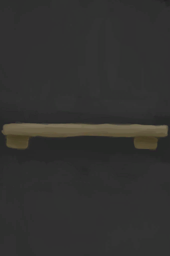
[Shelf(BluePrint)](Bp_Shelf.md)](Bp_Shelf.md)</td><td  style="text-align:left;vertical-align:top;"  >Craft BluePrint</td><td  style="text-align:left;vertical-align:top;"  >2</td></tr><tr ><td  style="text-align:left;vertical-align:top;"  >[

[Shelter(BluePrint)](Bp_Shelter.md)](Bp_Shelter.md)</td><td  style="text-align:left;vertical-align:top;"  >Craft BluePrint</td><td  style="text-align:left;vertical-align:top;"  >2</td></tr><tr ><td  style="text-align:left;vertical-align:top;"  >[

[Clay Bowl(BluePrint)](Bp_ClayBowl.md)](Bp_ClayBowl.md)</td><td  style="text-align:left;vertical-align:top;"  >Craft BluePrint</td><td  style="text-align:left;vertical-align:top;"  >2</td></tr><tr ><td  style="text-align:left;vertical-align:top;"  >[

[Clay Jar(BluePrint)](Bp_ClayJar.md)](Bp_ClayJar.md)</td><td  style="text-align:left;vertical-align:top;"  >Craft BluePrint</td><td  style="text-align:left;vertical-align:top;"  >2</td></tr><tr ><td  style="text-align:left;vertical-align:top;"  >[

[Clay Vase(BluePrint)](Bp_ClayVase.md)](Bp_ClayVase.md)</td><td  style="text-align:left;vertical-align:top;"  >Craft BluePrint</td><td  style="text-align:left;vertical-align:top;"  >2</td></tr><tr ><td  style="text-align:left;vertical-align:top;"  >[

[Cooking Pot(BluePrint)](Bp_CookingPot.md)](Bp_CookingPot.md)</td><td  style="text-align:left;vertical-align:top;"  >Craft BluePrint</td><td  style="text-align:left;vertical-align:top;"  >2</td></tr><tr ><td  style="text-align:left;vertical-align:top;"  >[

[Glazed Vase(BluePrint)](Bp_GlazedVase.md)](Bp_GlazedVase.md)</td><td  style="text-align:left;vertical-align:top;"  >Craft BluePrint</td><td  style="text-align:left;vertical-align:top;"  >2</td></tr><tr ><td  style="text-align:left;vertical-align:top;"  >[

[Sack(BluePrint)](Bp_Sack.md)](Bp_Sack.md)</td><td  style="text-align:left;vertical-align:top;"  >Craft BluePrint</td><td  style="text-align:left;vertical-align:top;"  >2</td></tr><tr ><td  style="text-align:left;vertical-align:top;"  >[Left Foot (Inner)(BluePrint)](InnerLeftFootBlueprint.md)</td><td  style="text-align:left;vertical-align:top;"  >Craft Foot Wrappings ** With：**[Cloth](Cloth.md)</td><td  style="text-align:left;vertical-align:top;"  >2</td></tr><tr ><td  style="text-align:left;vertical-align:top;"  >[Left Foot (Outer)(BluePrint)](OuterLeftFootBlueprint.md)</td><td  style="text-align:left;vertical-align:top;"  >Craft Foot Wrappings</td><td  style="text-align:left;vertical-align:top;"  >2</td></tr><tr ><td  style="text-align:left;vertical-align:top;"  >[

[Drum(Event)](Event_DrumMenu.md)](Event_DrumMenu.md)(未实装)</td><td  style="text-align:left;vertical-align:top;"  >Practice</td><td  style="text-align:left;vertical-align:top;"  >2 / /TP</td></tr><tr ><td  style="text-align:left;vertical-align:top;"  >[

[Cloth](Cloth.md)](Cloth.md)</td><td  style="text-align:left;vertical-align:top;"  >Craft Bandage</td><td  style="text-align:left;vertical-align:top;"  >2</td></tr><tr ><td  style="text-align:left;vertical-align:top;"  >[

[Cloth](Cloth.md)](Cloth.md)</td><td  style="text-align:left;vertical-align:top;"  >Craft Foot Wrappings</td><td  style="text-align:left;vertical-align:top;"  >2</td></tr><tr ><td  style="text-align:left;vertical-align:top;"  >[

[Cloth](Cloth.md)](Cloth.md)</td><td  style="text-align:left;vertical-align:top;"  >Craft Hand Wrappings</td><td  style="text-align:left;vertical-align:top;"  >2</td></tr><tr ><td  style="text-align:left;vertical-align:top;"  >[

[Baby](Baby.md)](Baby.md)</td><td  style="text-align:left;vertical-align:top;"  >Feed</td><td  style="text-align:left;vertical-align:top;"  >2</td></tr><tr ><td  style="text-align:left;vertical-align:top;"  >[

[Baby](Baby.md)](Baby.md)</td><td  style="text-align:left;vertical-align:top;"  >Talk</td><td  style="text-align:left;vertical-align:top;"  >2</td></tr><tr ><td  style="text-align:left;vertical-align:top;"  >[

[Drum](Drum.md)](Drum.md)</td><td  style="text-align:left;vertical-align:top;"  >Practice</td><td  style="text-align:left;vertical-align:top;"  >2 / /TP</td></tr><tr ><td  style="text-align:left;vertical-align:top;"  >[

[Bone Flute](FluteBone.md)](FluteBone.md)</td><td  style="text-align:left;vertical-align:top;"  >Practice</td><td  style="text-align:left;vertical-align:top;"  >2 / /TP</td></tr><tr ><td  style="text-align:left;vertical-align:top;"  >[

[Bone Flute](FluteBone.md)](FluteBone.md)</td><td  style="text-align:left;vertical-align:top;"  >Compose</td><td  style="text-align:left;vertical-align:top;"  >2 / /TP</td></tr><tr ><td  style="text-align:left;vertical-align:top;"  >[

[Wooden Flute](FluteWooden.md)](FluteWooden.md)</td><td  style="text-align:left;vertical-align:top;"  >Practice</td><td  style="text-align:left;vertical-align:top;"  >2 / /TP</td></tr><tr ><td  style="text-align:left;vertical-align:top;"  >[

[Wooden Flute](FluteWooden.md)](FluteWooden.md)</td><td  style="text-align:left;vertical-align:top;"  >Compose</td><td  style="text-align:left;vertical-align:top;"  >2 / /TP</td></tr><tr ><td  style="text-align:left;vertical-align:top;"  >[

[Banana](Banana.md)](Banana.md)</td><td  style="text-align:left;vertical-align:top;"  >Eat</td><td  style="text-align:left;vertical-align:top;"  >2</td></tr><tr ><td  style="text-align:left;vertical-align:top;"  >[

[Roasted Bat](BatCooked.md)](BatCooked.md)</td><td  style="text-align:left;vertical-align:top;"  >Eat</td><td  style="text-align:left;vertical-align:top;"  >2</td></tr><tr ><td  style="text-align:left;vertical-align:top;"  >[

[Bird Meat](BirdMeat.md)](BirdMeat.md)</td><td  style="text-align:left;vertical-align:top;"  >Eat</td><td  style="text-align:left;vertical-align:top;"  >2</td></tr><tr ><td  style="text-align:left;vertical-align:top;"  >[

[Chillies](Chilies.md)](Chilies.md)</td><td  style="text-align:left;vertical-align:top;"  >Eat</td><td  style="text-align:left;vertical-align:top;"  >2</td></tr><tr ><td  style="text-align:left;vertical-align:top;"  >[

[Coconut Meat](CoconutMeat.md)](CoconutMeat.md)</td><td  style="text-align:left;vertical-align:top;"  >Eat</td><td  style="text-align:left;vertical-align:top;"  >2</td></tr><tr ><td  style="text-align:left;vertical-align:top;"  >[

[Roasted Coconut Meat](CoconutMeatCooked.md)](CoconutMeatCooked.md)</td><td  style="text-align:left;vertical-align:top;"  >Eat</td><td  style="text-align:left;vertical-align:top;"  >2</td></tr><tr ><td  style="text-align:left;vertical-align:top;"  >[

[Cooked Crab](CrabCooked.md)](CrabCooked.md)</td><td  style="text-align:left;vertical-align:top;"  >Eat Crab</td><td  style="text-align:left;vertical-align:top;"  >2</td></tr><tr ><td  style="text-align:left;vertical-align:top;"  >[

[Roasted Egg](EggCooked.md)](EggCooked.md)</td><td  style="text-align:left;vertical-align:top;"  >Eat</td><td  style="text-align:left;vertical-align:top;"  >2</td></tr><tr ><td  style="text-align:left;vertical-align:top;"  >[

[Jujube Fruits](JujubeFruits.md)](JujubeFruits.md)</td><td  style="text-align:left;vertical-align:top;"  >Eat</td><td  style="text-align:left;vertical-align:top;"  >2</td></tr><tr ><td  style="text-align:left;vertical-align:top;"  >[

[Ground Kava Root](KavaRootGround.md)](KavaRootGround.md)</td><td  style="text-align:left;vertical-align:top;"  >Eat Ground Root</td><td  style="text-align:left;vertical-align:top;"  >2</td></tr><tr ><td  style="text-align:left;vertical-align:top;"  >[

[Roasted Lizard](LizardCooked.md)](LizardCooked.md)</td><td  style="text-align:left;vertical-align:top;"  >Eat</td><td  style="text-align:left;vertical-align:top;"  >2</td></tr><tr ><td  style="text-align:left;vertical-align:top;"  >[
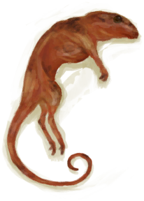
[Roasted Mouse](MouseCooked.md)](MouseCooked.md)</td><td  style="text-align:left;vertical-align:top;"  >Eat</td><td  style="text-align:left;vertical-align:top;"  >2</td></tr><tr ><td  style="text-align:left;vertical-align:top;"  >[

[Roasted Mudskipper](MudskipperCooked.md)](MudskipperCooked.md)</td><td  style="text-align:left;vertical-align:top;"  >Eat</td><td  style="text-align:left;vertical-align:top;"  >2</td></tr><tr ><td  style="text-align:left;vertical-align:top;"  >[

[Roasted Tropical Almond](TropicalAlmondsRoasted.md)](TropicalAlmondsRoasted.md)</td><td  style="text-align:left;vertical-align:top;"  >Eat</td><td  style="text-align:left;vertical-align:top;"  >2</td></tr><tr ><td  style="text-align:left;vertical-align:top;"  >[

[Wood Handle](HandleWood.md)](HandleWood.md)</td><td  style="text-align:left;vertical-align:top;"  >Craft Stone Axe ** With：**[Sharpened Stone](StoneSharpened.md)</td><td  style="text-align:left;vertical-align:top;"  >2</td></tr><tr ><td  style="text-align:left;vertical-align:top;"  >[

[Lizard Drum](LizardDrum.md)](LizardDrum.md)</td><td  style="text-align:left;vertical-align:top;"  >Practice</td><td  style="text-align:left;vertical-align:top;"  >2 / /TP</td></tr><tr ><td  style="text-align:left;vertical-align:top;"  >[

[China Rose Tea](LQ_ChinaRoseTea.md)](LQ_ChinaRoseTea.md)</td><td  style="text-align:left;vertical-align:top;"  >Drink</td><td  style="text-align:left;vertical-align:top;"  >2</td></tr><tr ><td  style="text-align:left;vertical-align:top;"  >[

[Jasmine Tea](LQ_JasmineTea.md)](LQ_JasmineTea.md)</td><td  style="text-align:left;vertical-align:top;"  >Drink</td><td  style="text-align:left;vertical-align:top;"  >2</td></tr><tr ><td  style="text-align:left;vertical-align:top;"  >[

[High Point](HighPoint.md)](HighPoint.md)(未实装)</td><td  style="text-align:left;vertical-align:top;"  >Survey</td><td  style="text-align:left;vertical-align:top;"  >2</td></tr><tr ><td  style="text-align:left;vertical-align:top;"  >[

[Shipwreck(Bird Rock)](Shipwreck.md)](Shipwreck.md)</td><td  style="text-align:left;vertical-align:top;"  >Explore the shipwreck</td><td  style="text-align:left;vertical-align:top;"  >2</td></tr><tr ><td  style="text-align:left;vertical-align:top;"  >[

[Hammock](Hammock.md)](Hammock.md)</td><td  style="text-align:left;vertical-align:top;"  >Nap</td><td  style="text-align:left;vertical-align:top;"  >1.75 / /TP</td></tr><tr ><td  style="text-align:left;vertical-align:top;"  >[

[Hammock](Hammock.md)](Hammock.md)</td><td  style="text-align:left;vertical-align:top;"  >Sleep</td><td  style="text-align:left;vertical-align:top;"  >1.75 / /TP</td></tr><tr ><td  style="text-align:left;vertical-align:top;"  >[

[Rustic Bed](BedRustic.md)](BedRustic.md)</td><td  style="text-align:left;vertical-align:top;"  >Nap</td><td  style="text-align:left;vertical-align:top;"  >1.5 / /TP</td></tr><tr ><td  style="text-align:left;vertical-align:top;"  >[

[Rustic Bed](BedRustic.md)](BedRustic.md)</td><td  style="text-align:left;vertical-align:top;"  >Sleep</td><td  style="text-align:left;vertical-align:top;"  >1.5 / /TP</td></tr><tr ><td  style="text-align:left;vertical-align:top;"  >[

[Bedroll](BedRoll.md)](BedRoll.md)</td><td  style="text-align:left;vertical-align:top;"  >Nap</td><td  style="text-align:left;vertical-align:top;"  >1.25 / /TP</td></tr><tr ><td  style="text-align:left;vertical-align:top;"  >[

[Bedroll](BedRoll.md)](BedRoll.md)</td><td  style="text-align:left;vertical-align:top;"  >Sleep</td><td  style="text-align:left;vertical-align:top;"  >1.25 / /TP</td></tr><tr ><td  style="text-align:left;vertical-align:top;"  >[

[Leaf Bed](LeafBed.md)](LeafBed.md)</td><td  style="text-align:left;vertical-align:top;"  >Nap</td><td  style="text-align:left;vertical-align:top;"  >1.25 / /TP</td></tr><tr ><td  style="text-align:left;vertical-align:top;"  >[

[Leaf Bed](LeafBed.md)](LeafBed.md)</td><td  style="text-align:left;vertical-align:top;"  >Sleep</td><td  style="text-align:left;vertical-align:top;"  >1.25 / /TP</td></tr><tr ><td  style="text-align:left;vertical-align:top;"  >[

[Mermaid nest](MermaidNest.md)](MermaidNest.md)</td><td  style="text-align:left;vertical-align:top;"  >Nap</td><td  style="text-align:left;vertical-align:top;"  >1.25 / /TP</td></tr><tr ><td  style="text-align:left;vertical-align:top;"  >[

[Mermaid nest](MermaidNest.md)](MermaidNest.md)</td><td  style="text-align:left;vertical-align:top;"  >Sleep</td><td  style="text-align:left;vertical-align:top;"  >1.25 / /TP</td></tr><tr ><td  style="text-align:left;vertical-align:top;"  >[

[Shelter](Shelter.md)](Shelter.md)</td><td  style="text-align:left;vertical-align:top;"  >Nap</td><td  style="text-align:left;vertical-align:top;"  >1.25 / /TP</td></tr><tr ><td  style="text-align:left;vertical-align:top;"  >[

[Shelter](Shelter.md)](Shelter.md)</td><td  style="text-align:left;vertical-align:top;"  >Sleep</td><td  style="text-align:left;vertical-align:top;"  >1.25 / /TP</td></tr><tr ><td  style="text-align:left;vertical-align:top;"  >[

[Sheltered Leaf Bed](ShelteredLeafBed.md)](ShelteredLeafBed.md)</td><td  style="text-align:left;vertical-align:top;"  >Nap</td><td  style="text-align:left;vertical-align:top;"  >1.25 / /TP</td></tr><tr ><td  style="text-align:left;vertical-align:top;"  >[

[Sheltered Leaf Bed](ShelteredLeafBed.md)](ShelteredLeafBed.md)</td><td  style="text-align:left;vertical-align:top;"  >Sleep</td><td  style="text-align:left;vertical-align:top;"  >1.25 / /TP</td></tr><tr ><td  style="text-align:left;vertical-align:top;"  >[

[Tent](TentDeployed.md)](TentDeployed.md)</td><td  style="text-align:left;vertical-align:top;"  >Nap</td><td  style="text-align:left;vertical-align:top;"  >1.25 / /TP</td></tr><tr ><td  style="text-align:left;vertical-align:top;"  >[

[Tent](TentDeployed.md)](TentDeployed.md)</td><td  style="text-align:left;vertical-align:top;"  >Sleep</td><td  style="text-align:left;vertical-align:top;"  >1.25 / /TP</td></tr><tr ><td  style="text-align:left;vertical-align:top;"  >[

[Raft Shelter](RaftShelter.md)](RaftShelter.md)</td><td  style="text-align:left;vertical-align:top;"  >Nap</td><td  style="text-align:left;vertical-align:top;"  >1.25 / /TP</td></tr><tr ><td  style="text-align:left;vertical-align:top;"  >[

[Raft Shelter](RaftShelter.md)](RaftShelter.md)</td><td  style="text-align:left;vertical-align:top;"  >Sleep</td><td  style="text-align:left;vertical-align:top;"  >1.25 / /TP</td></tr><tr ><td  style="text-align:left;vertical-align:top;"  >[

[Campfire](Campfire.md)](Campfire.md)</td><td  style="text-align:left;vertical-align:top;"  >Make Rustic Spear ** With：**[Long Stick](StickLong.md)</td><td  style="text-align:left;vertical-align:top;"  >1</td></tr><tr ><td  style="text-align:left;vertical-align:top;"  >[

[Clay Fire Pit](ClayFirePit.md)](ClayFirePit.md)</td><td  style="text-align:left;vertical-align:top;"  >Make Rustic Spear ** With：**[Long Stick](StickLong.md)</td><td  style="text-align:left;vertical-align:top;"  >1</td></tr><tr ><td  style="text-align:left;vertical-align:top;"  >[
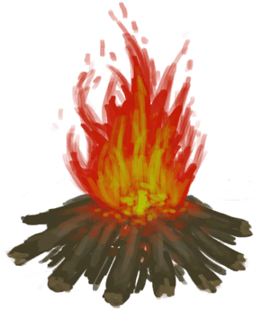
[Fire](Fire.md)](Fire.md)</td><td  style="text-align:left;vertical-align:top;"  >Make Rustic Spear ** With：**[Long Stick](StickLong.md)</td><td  style="text-align:left;vertical-align:top;"  >1</td></tr><tr ><td  style="text-align:left;vertical-align:top;"  >[

[Smoker](Smoker.md)](Smoker.md)</td><td  style="text-align:left;vertical-align:top;"  >Make Rustic Spear ** With：**[Long Stick](StickLong.md)</td><td  style="text-align:left;vertical-align:top;"  >1</td></tr><tr ><td  style="text-align:left;vertical-align:top;"  >[

[Smoker](Smoker.md)](Smoker.md)</td><td  style="text-align:left;vertical-align:top;"  >Cook Goatfish ** With：**[Goatfish](Goatfish.md)</td><td  style="text-align:left;vertical-align:top;"  >1</td></tr><tr ><td  style="text-align:left;vertical-align:top;"  >[

[Smoker](Smoker.md)](Smoker.md)</td><td  style="text-align:left;vertical-align:top;"  >Cook Egg ** With：**[Egg](Egg.md)</td><td  style="text-align:left;vertical-align:top;"  >1</td></tr><tr ><td  style="text-align:left;vertical-align:top;"  >[

[Smoker](Smoker.md)](Smoker.md)</td><td  style="text-align:left;vertical-align:top;"  >Cook Grouper ** With：**[Grouper Meat](GrouperMeat.md)</td><td  style="text-align:left;vertical-align:top;"  >1</td></tr><tr ><td  style="text-align:left;vertical-align:top;"  >[

[Smoker](Smoker.md)](Smoker.md)</td><td  style="text-align:left;vertical-align:top;"  >Cook Boar Meat ** With：**[Boar Meat](BoarMeat.md)</td><td  style="text-align:left;vertical-align:top;"  >1</td></tr><tr ><td  style="text-align:left;vertical-align:top;"  >[

[Smoker](Smoker.md)](Smoker.md)</td><td  style="text-align:left;vertical-align:top;"  >Cook Bonefish ** With：**[Bonefish Meat](BonefishMeat.md)</td><td  style="text-align:left;vertical-align:top;"  >1</td></tr><tr ><td  style="text-align:left;vertical-align:top;"  >[

[Smoker](Smoker.md)](Smoker.md)</td><td  style="text-align:left;vertical-align:top;"  >Cook Crab ** With：**[Crab](Crab.md)</td><td  style="text-align:left;vertical-align:top;"  >1</td></tr><tr ><td  style="text-align:left;vertical-align:top;"  >[

[Smoker](Smoker.md)](Smoker.md)</td><td  style="text-align:left;vertical-align:top;"  >Cook Conch Meat ** With：**[Conch Meat](ConchMeat.md)</td><td  style="text-align:left;vertical-align:top;"  >1</td></tr><tr ><td  style="text-align:left;vertical-align:top;"  >[

[Smoker](Smoker.md)](Smoker.md)</td><td  style="text-align:left;vertical-align:top;"  >Cook Soft Conch Meat ** With：**[Soft Conch Meat](ConchMeatSoft.md)</td><td  style="text-align:left;vertical-align:top;"  >1</td></tr><tr ><td  style="text-align:left;vertical-align:top;"  >[

[Smoker](Smoker.md)](Smoker.md)</td><td  style="text-align:left;vertical-align:top;"  >Cook Clay Bowl ** With：**[Unfired Clay Bowl](ClayBowlUnfired.md)</td><td  style="text-align:left;vertical-align:top;"  >1</td></tr><tr ><td  style="text-align:left;vertical-align:top;"  >[

[Smoker](Smoker.md)](Smoker.md)</td><td  style="text-align:left;vertical-align:top;"  >Cook Parrot Fish ** With：**[Parrot Fish](ParrotFish.md)</td><td  style="text-align:left;vertical-align:top;"  >1</td></tr><tr ><td  style="text-align:left;vertical-align:top;"  >[

[Smoker](Smoker.md)](Smoker.md)</td><td  style="text-align:left;vertical-align:top;"  >Cook Almonds ** With：**[Tropical Almond Kernels](TropicalAlmondKernels.md)</td><td  style="text-align:left;vertical-align:top;"  >1</td></tr><tr ><td  style="text-align:left;vertical-align:top;"  >[

[Smoker](Smoker.md)](Smoker.md)</td><td  style="text-align:left;vertical-align:top;"  >Cook Cake</td><td  style="text-align:left;vertical-align:top;"  >1</td></tr><tr ><td  style="text-align:left;vertical-align:top;"  >[

[Smoker](Smoker.md)](Smoker.md)</td><td  style="text-align:left;vertical-align:top;"  >Cook Sago Slime</td><td  style="text-align:left;vertical-align:top;"  >1</td></tr><tr ><td  style="text-align:left;vertical-align:top;"  >[

[Smoker](SmokerPlastic.md)](SmokerPlastic.md)</td><td  style="text-align:left;vertical-align:top;"  >Make Rustic Spear ** With：**[Long Stick](StickLong.md)</td><td  style="text-align:left;vertical-align:top;"  >1</td></tr><tr ><td  style="text-align:left;vertical-align:top;"  >[

[Smoker](SmokerPlastic.md)](SmokerPlastic.md)</td><td  style="text-align:left;vertical-align:top;"  >Cook Egg ** With：**[Egg](Egg.md)</td><td  style="text-align:left;vertical-align:top;"  >1</td></tr><tr ><td  style="text-align:left;vertical-align:top;"  >[

[Smoker](SmokerPlastic.md)](SmokerPlastic.md)</td><td  style="text-align:left;vertical-align:top;"  >Cook Goatfish ** With：**[Goatfish](Goatfish.md)</td><td  style="text-align:left;vertical-align:top;"  >1</td></tr><tr ><td  style="text-align:left;vertical-align:top;"  >[

[Smoker](SmokerPlastic.md)](SmokerPlastic.md)</td><td  style="text-align:left;vertical-align:top;"  >Cook Grouper ** With：**[Grouper Meat](GrouperMeat.md)</td><td  style="text-align:left;vertical-align:top;"  >1</td></tr><tr ><td  style="text-align:left;vertical-align:top;"  >[

[Smoker](SmokerPlastic.md)](SmokerPlastic.md)</td><td  style="text-align:left;vertical-align:top;"  >Cook Boar Meat ** With：**[Boar Meat](BoarMeat.md)</td><td  style="text-align:left;vertical-align:top;"  >1</td></tr><tr ><td  style="text-align:left;vertical-align:top;"  >[

[Smoker](SmokerPlastic.md)](SmokerPlastic.md)</td><td  style="text-align:left;vertical-align:top;"  >Cook Bonefish ** With：**[Bonefish Meat](BonefishMeat.md)</td><td  style="text-align:left;vertical-align:top;"  >1</td></tr><tr ><td  style="text-align:left;vertical-align:top;"  >[

[Smoker](SmokerPlastic.md)](SmokerPlastic.md)</td><td  style="text-align:left;vertical-align:top;"  >Cook Crab ** With：**[Crab](Crab.md)</td><td  style="text-align:left;vertical-align:top;"  >1</td></tr><tr ><td  style="text-align:left;vertical-align:top;"  >[

[Smoker](SmokerPlastic.md)](SmokerPlastic.md)</td><td  style="text-align:left;vertical-align:top;"  >Cook Conch Meat ** With：**[Conch Meat](ConchMeat.md)</td><td  style="text-align:left;vertical-align:top;"  >1</td></tr><tr ><td  style="text-align:left;vertical-align:top;"  >[

[Smoker](SmokerPlastic.md)](SmokerPlastic.md)</td><td  style="text-align:left;vertical-align:top;"  >Cook Soft Conch Meat ** With：**[Soft Conch Meat](ConchMeatSoft.md)</td><td  style="text-align:left;vertical-align:top;"  >1</td></tr><tr ><td  style="text-align:left;vertical-align:top;"  >[

[Smoker](SmokerPlastic.md)](SmokerPlastic.md)</td><td  style="text-align:left;vertical-align:top;"  >Cook Clay Bowl ** With：**[Unfired Clay Bowl](ClayBowlUnfired.md)</td><td  style="text-align:left;vertical-align:top;"  >1</td></tr><tr ><td  style="text-align:left;vertical-align:top;"  >[

[Smoker](SmokerPlastic.md)](SmokerPlastic.md)</td><td  style="text-align:left;vertical-align:top;"  >Cook Parrot Fish ** With：**[Parrot Fish](ParrotFish.md)</td><td  style="text-align:left;vertical-align:top;"  >1</td></tr><tr ><td  style="text-align:left;vertical-align:top;"  >[

[Smoker](SmokerPlastic.md)](SmokerPlastic.md)</td><td  style="text-align:left;vertical-align:top;"  >Cook Almonds ** With：**[Tropical Almond Kernels](TropicalAlmondKernels.md)</td><td  style="text-align:left;vertical-align:top;"  >1</td></tr><tr ><td  style="text-align:left;vertical-align:top;"  >[

[Coconut Sandals(BluePrint)](Bp_CoconutSandals.md)](Bp_CoconutSandals.md)</td><td  style="text-align:left;vertical-align:top;"  >Craft BluePrint</td><td  style="text-align:left;vertical-align:top;"  >1</td></tr><tr ><td  style="text-align:left;vertical-align:top;"  >[

[Unfired Clay Bowl](ClayBowlUnfired.md)](ClayBowlUnfired.md)</td><td  style="text-align:left;vertical-align:top;"  >Craft Vase</td><td  style="text-align:left;vertical-align:top;"  >1</td></tr><tr ><td  style="text-align:left;vertical-align:top;"  >[

[Unfinished Clay Vase](ClayVaseUnfinished.md)](ClayVaseUnfinished.md)(未实装)</td><td  style="text-align:left;vertical-align:top;"  >Finish Vase</td><td  style="text-align:left;vertical-align:top;"  >1</td></tr><tr ><td  style="text-align:left;vertical-align:top;"  >[

[Feathers](Feathers.md)](Feathers.md)</td><td  style="text-align:left;vertical-align:top;"  >Light with Hand Drill ** With：**[Hand Drill](HandDrill.md)</td><td  style="text-align:left;vertical-align:top;"  >1</td></tr><tr ><td  style="text-align:left;vertical-align:top;"  >[

[Feathers](Feathers.md)](Feathers.md)</td><td  style="text-align:left;vertical-align:top;"  >Light with Bow Drill ** With：**[Bow Drill](BowDrill.md)</td><td  style="text-align:left;vertical-align:top;"  >1</td></tr><tr ><td  style="text-align:left;vertical-align:top;"  >[

[Feathers](Feathers.md)](Feathers.md)</td><td  style="text-align:left;vertical-align:top;"  >Light Tinder ** With：**[“Fire Source”](tag_FireSource.md)</td><td  style="text-align:left;vertical-align:top;"  >1</td></tr><tr ><td  style="text-align:left;vertical-align:top;"  >[

[Fibers](Fibers.md)](Fibers.md)</td><td  style="text-align:left;vertical-align:top;"  >Light with Hand Drill ** With：**[Hand Drill](HandDrill.md)</td><td  style="text-align:left;vertical-align:top;"  >1</td></tr><tr ><td  style="text-align:left;vertical-align:top;"  >[

[Fibers](Fibers.md)](Fibers.md)</td><td  style="text-align:left;vertical-align:top;"  >Light with Bow Drill ** With：**[Bow Drill](BowDrill.md)</td><td  style="text-align:left;vertical-align:top;"  >1</td></tr><tr ><td  style="text-align:left;vertical-align:top;"  >[

[Fibers](Fibers.md)](Fibers.md)</td><td  style="text-align:left;vertical-align:top;"  >Light Tinder ** With：**[“Fire Source”](tag_FireSource.md)</td><td  style="text-align:left;vertical-align:top;"  >1</td></tr><tr ><td  style="text-align:left;vertical-align:top;"  >[

[Fibers](Fibers.md)](Fibers.md)</td><td  style="text-align:left;vertical-align:top;"  >Light Tinder ** With：**[Signaling Mirror](SignalingMirror.md) , [Glasses](Glasses.md)</td><td  style="text-align:left;vertical-align:top;"  >1</td></tr><tr ><td  style="text-align:left;vertical-align:top;"  >[

[Honeycomb](BeeHoneycomb.md)](BeeHoneycomb.md)</td><td  style="text-align:left;vertical-align:top;"  >Eat</td><td  style="text-align:left;vertical-align:top;"  >1</td></tr><tr ><td  style="text-align:left;vertical-align:top;"  >[

[Coffee Berries](CoffeeBerries.md)](CoffeeBerries.md)</td><td  style="text-align:left;vertical-align:top;"  >Eat</td><td  style="text-align:left;vertical-align:top;"  >1</td></tr><tr ><td  style="text-align:left;vertical-align:top;"  >[

[Coffee Berry Pulp](CoffeeBerryPulp.md)](CoffeeBerryPulp.md)</td><td  style="text-align:left;vertical-align:top;"  >Eat</td><td  style="text-align:left;vertical-align:top;"  >1</td></tr><tr ><td  style="text-align:left;vertical-align:top;"  >[

[Boiled Egg](EggBoiled.md)](EggBoiled.md)(未实装)</td><td  style="text-align:left;vertical-align:top;"  >Eat</td><td  style="text-align:left;vertical-align:top;"  >1</td></tr><tr ><td  style="text-align:left;vertical-align:top;"  >[

[Kava Root](KavaRoot.md)](KavaRoot.md)</td><td  style="text-align:left;vertical-align:top;"  >Eat Root</td><td  style="text-align:left;vertical-align:top;"  >1</td></tr><tr ><td  style="text-align:left;vertical-align:top;"  >[

[Dog Friend](DogFriend.md)](DogFriend.md)</td><td  style="text-align:left;vertical-align:top;"  >Give Bones ** With：**[Bones](Bones.md)</td><td  style="text-align:left;vertical-align:top;"  >1</td></tr><tr ><td  style="text-align:left;vertical-align:top;"  >[

[Nipa Seeds](NipaSeeds.md)](NipaSeeds.md)</td><td  style="text-align:left;vertical-align:top;"  >Eat</td><td  style="text-align:left;vertical-align:top;"  >1</td></tr><tr ><td  style="text-align:left;vertical-align:top;"  >[

[Roasted Prawns](PrawnsCooked.md)](PrawnsCooked.md)</td><td  style="text-align:left;vertical-align:top;"  >Eat</td><td  style="text-align:left;vertical-align:top;"  >1</td></tr><tr ><td  style="text-align:left;vertical-align:top;"  >[

[Puffballs](Puffballs.md)](Puffballs.md)</td><td  style="text-align:left;vertical-align:top;"  >Eat</td><td  style="text-align:left;vertical-align:top;"  >1</td></tr><tr ><td  style="text-align:left;vertical-align:top;"  >[

[Rice](RiceCooked.md)](RiceCooked.md)</td><td  style="text-align:left;vertical-align:top;"  >Eat</td><td  style="text-align:left;vertical-align:top;"  >1</td></tr><tr ><td  style="text-align:left;vertical-align:top;"  >[

[Sago Flatbread](SagoFlatbread.md)](SagoFlatbread.md)</td><td  style="text-align:left;vertical-align:top;"  >Eat</td><td  style="text-align:left;vertical-align:top;"  >1</td></tr><tr ><td  style="text-align:left;vertical-align:top;"  >[

[Sugar](Sugar.md)](Sugar.md)</td><td  style="text-align:left;vertical-align:top;"  >Eat</td><td  style="text-align:left;vertical-align:top;"  >1</td></tr><tr ><td  style="text-align:left;vertical-align:top;"  >[

[Tropical Almond Kernels](TropicalAlmondKernels.md)](TropicalAlmondKernels.md)</td><td  style="text-align:left;vertical-align:top;"  >Eat</td><td  style="text-align:left;vertical-align:top;"  >1</td></tr><tr ><td  style="text-align:left;vertical-align:top;"  >[

[Dry Leaves](LeavesDry.md)](LeavesDry.md)</td><td  style="text-align:left;vertical-align:top;"  >Light with Hand Drill ** With：**[Hand Drill](HandDrill.md)</td><td  style="text-align:left;vertical-align:top;"  >1</td></tr><tr ><td  style="text-align:left;vertical-align:top;"  >[

[Dry Leaves](LeavesDry.md)](LeavesDry.md)</td><td  style="text-align:left;vertical-align:top;"  >Light with Bow Drill ** With：**[Bow Drill](BowDrill.md)</td><td  style="text-align:left;vertical-align:top;"  >1</td></tr><tr ><td  style="text-align:left;vertical-align:top;"  >[

[Dry Leaves](LeavesDry.md)](LeavesDry.md)</td><td  style="text-align:left;vertical-align:top;"  >Light Tinder ** With：**[“Fire Source”](tag_FireSource.md)</td><td  style="text-align:left;vertical-align:top;"  >1</td></tr><tr ><td  style="text-align:left;vertical-align:top;"  >[

[Dry Leaves](LeavesDry.md)](LeavesDry.md)</td><td  style="text-align:left;vertical-align:top;"  >Light Tinder ** With：**[Signaling Mirror](SignalingMirror.md) , [Glasses](Glasses.md)</td><td  style="text-align:left;vertical-align:top;"  >1</td></tr><tr ><td  style="text-align:left;vertical-align:top;"  >[

[Nest](Nest.md)](Nest.md)</td><td  style="text-align:left;vertical-align:top;"  >Light with Hand Drill ** With：**[Hand Drill](HandDrill.md)</td><td  style="text-align:left;vertical-align:top;"  >1</td></tr><tr ><td  style="text-align:left;vertical-align:top;"  >[

[Nest](Nest.md)](Nest.md)</td><td  style="text-align:left;vertical-align:top;"  >Light with Bow Drill ** With：**[Bow Drill](BowDrill.md)</td><td  style="text-align:left;vertical-align:top;"  >1</td></tr><tr ><td  style="text-align:left;vertical-align:top;"  >[

[Nest](Nest.md)](Nest.md)</td><td  style="text-align:left;vertical-align:top;"  >Light Tinder ** With：**[“Fire Source”](tag_FireSource.md)</td><td  style="text-align:left;vertical-align:top;"  >1</td></tr><tr ><td  style="text-align:left;vertical-align:top;"  >[

[Nest](Nest.md)](Nest.md)</td><td  style="text-align:left;vertical-align:top;"  >Light Tinder ** With：**[Signaling Mirror](SignalingMirror.md) , [Glasses](Glasses.md)</td><td  style="text-align:left;vertical-align:top;"  >1</td></tr><tr ><td  style="text-align:left;vertical-align:top;"  >[

[Papers](Papers.md)](Papers.md)</td><td  style="text-align:left;vertical-align:top;"  >Light with Hand Drill ** With：**[Hand Drill](HandDrill.md)</td><td  style="text-align:left;vertical-align:top;"  >1</td></tr><tr ><td  style="text-align:left;vertical-align:top;"  >[

[Papers](Papers.md)](Papers.md)</td><td  style="text-align:left;vertical-align:top;"  >Light with Bow Drill ** With：**[Bow Drill](BowDrill.md)</td><td  style="text-align:left;vertical-align:top;"  >1</td></tr><tr ><td  style="text-align:left;vertical-align:top;"  >[

[Papers](Papers.md)](Papers.md)</td><td  style="text-align:left;vertical-align:top;"  >Light Tinder ** With：**[“Fire Source”](tag_FireSource.md)</td><td  style="text-align:left;vertical-align:top;"  >1</td></tr><tr ><td  style="text-align:left;vertical-align:top;"  >[

[Papers](Papers.md)](Papers.md)</td><td  style="text-align:left;vertical-align:top;"  >Light Tinder ** With：**[Signaling Mirror](SignalingMirror.md) , [Glasses](Glasses.md)</td><td  style="text-align:left;vertical-align:top;"  >1</td></tr><tr ><td  style="text-align:left;vertical-align:top;"  >[

[Tide Pool(Rocks)](TidePool.md)](TidePool.md)</td><td  style="text-align:left;vertical-align:top;"  >Wash yourself</td><td  style="text-align:left;vertical-align:top;"  >1</td></tr><tr ><td  style="text-align:left;vertical-align:top;"  >[

[Flooded Tide Pool(Rocks)](TidePoolFlooded.md)](TidePoolFlooded.md)</td><td  style="text-align:left;vertical-align:top;"  >Wash yourself</td><td  style="text-align:left;vertical-align:top;"  >1</td></tr><tr ><td  style="text-align:left;vertical-align:top;"  >[

[Wood Shavings](WoodShavings.md)](WoodShavings.md)</td><td  style="text-align:left;vertical-align:top;"  >Light with Hand Drill ** With：**[Hand Drill](HandDrill.md)</td><td  style="text-align:left;vertical-align:top;"  >1</td></tr><tr ><td  style="text-align:left;vertical-align:top;"  >[

[Wood Shavings](WoodShavings.md)](WoodShavings.md)</td><td  style="text-align:left;vertical-align:top;"  >Light with Bow Drill ** With：**[Bow Drill](BowDrill.md)</td><td  style="text-align:left;vertical-align:top;"  >1</td></tr><tr ><td  style="text-align:left;vertical-align:top;"  >[

[Wood Shavings](WoodShavings.md)](WoodShavings.md)</td><td  style="text-align:left;vertical-align:top;"  >Light Tinder ** With：**[“Fire Source”](tag_FireSource.md)</td><td  style="text-align:left;vertical-align:top;"  >1</td></tr><tr ><td  style="text-align:left;vertical-align:top;"  >[

[Wood Shavings](WoodShavings.md)](WoodShavings.md)</td><td  style="text-align:left;vertical-align:top;"  >Light Tinder ** With：**[Signaling Mirror](SignalingMirror.md) , [Glasses](Glasses.md)</td><td  style="text-align:left;vertical-align:top;"  >1</td></tr><tr ><td  style="text-align:left;vertical-align:top;"  >[

[Ginger Tea](LQ_GingerTea.md)](LQ_GingerTea.md)</td><td  style="text-align:left;vertical-align:top;"  >Drink</td><td  style="text-align:left;vertical-align:top;"  >1</td></tr><tr ><td  style="text-align:left;vertical-align:top;"  >[

[Sap](LQ_Sap.md)](LQ_Sap.md)</td><td  style="text-align:left;vertical-align:top;"  >Drink</td><td  style="text-align:left;vertical-align:top;"  >1</td></tr><tr ><td  style="text-align:left;vertical-align:top;"  >[

[Water](LQ_Water.md)](LQ_Water.md)</td><td  style="text-align:left;vertical-align:top;"  >Wash Yourself</td><td  style="text-align:left;vertical-align:top;"  >1</td></tr><tr ><td  style="text-align:left;vertical-align:top;"  >[

[Salt Water](LQ_WaterSalt.md)](LQ_WaterSalt.md)</td><td  style="text-align:left;vertical-align:top;"  >Wash Yourself</td><td  style="text-align:left;vertical-align:top;"  >1</td></tr><tr ><td  style="text-align:left;vertical-align:top;"  >[

[Toxic Water](LQ_WaterToxic.md)](LQ_WaterToxic.md)</td><td  style="text-align:left;vertical-align:top;"  >Wash Yourself</td><td  style="text-align:left;vertical-align:top;"  >1</td></tr><tr ><td  style="text-align:left;vertical-align:top;"  >[

[Unsafe Water](LQ_WaterUnsafe.md)](LQ_WaterUnsafe.md)</td><td  style="text-align:left;vertical-align:top;"  >Wash Yourself</td><td  style="text-align:left;vertical-align:top;"  >1</td></tr><tr ><td  style="text-align:left;vertical-align:top;"  >[

[Seawater(Flooded Chamber)](Sea_Cave.md)](Sea_Cave.md)</td><td  style="text-align:left;vertical-align:top;"  >Wash yourself</td><td  style="text-align:left;vertical-align:top;"  >1</td></tr><tr ><td  style="text-align:left;vertical-align:top;"  >[

[Seawater(Flooded Chamber)](Sea_Cave.md)](Sea_Cave.md)</td><td  style="text-align:left;vertical-align:top;"  >Fish ** With：**[“Fishing Line”](tag_FishingLine.md)</td><td  style="text-align:left;vertical-align:top;"  >1</td></tr><tr ><td  style="text-align:left;vertical-align:top;"  >[

[Seawater(Flooded Chamber)](Sea_Cave.md)](Sea_Cave.md)</td><td  style="text-align:left;vertical-align:top;"  >Fish ** With：**[“Fishing Line Bait”](tag_FishingLineBait.md)</td><td  style="text-align:left;vertical-align:top;"  >1</td></tr><tr ><td  style="text-align:left;vertical-align:top;"  >[

[Sea(Atoll)](Sea_Atoll.md)](Sea_Atoll.md)</td><td  style="text-align:left;vertical-align:top;"  >Wash yourself</td><td  style="text-align:left;vertical-align:top;"  >1</td></tr><tr ><td  style="text-align:left;vertical-align:top;"  >[

[Sea(Atoll)](Sea_Atoll.md)](Sea_Atoll.md)</td><td  style="text-align:left;vertical-align:top;"  >Spear Fish ** With：**[“Spear T1”](tag_Spear.md)</td><td  style="text-align:left;vertical-align:top;"  >1</td></tr><tr ><td  style="text-align:left;vertical-align:top;"  >[

[Sea(Atoll)](Sea_Atoll.md)](Sea_Atoll.md)</td><td  style="text-align:left;vertical-align:top;"  >Fish ** With：**[“Fishing Line”](tag_FishingLine.md)</td><td  style="text-align:left;vertical-align:top;"  >1</td></tr><tr ><td  style="text-align:left;vertical-align:top;"  >[

[Sea(Atoll)](Sea_Atoll.md)](Sea_Atoll.md)</td><td  style="text-align:left;vertical-align:top;"  >Fish ** With：**[“Fishing Line Bait”](tag_FishingLineBait.md)</td><td  style="text-align:left;vertical-align:top;"  >1</td></tr><tr ><td  style="text-align:left;vertical-align:top;"  >[

[Sea(Bay)](Sea_Bay.md)](Sea_Bay.md)</td><td  style="text-align:left;vertical-align:top;"  >Wash yourself</td><td  style="text-align:left;vertical-align:top;"  >1</td></tr><tr ><td  style="text-align:left;vertical-align:top;"  >[

[Sea(Bay)](Sea_Bay.md)](Sea_Bay.md)</td><td  style="text-align:left;vertical-align:top;"  >Spear Fish ** With：**[“Spear T1”](tag_Spear.md)</td><td  style="text-align:left;vertical-align:top;"  >1</td></tr><tr ><td  style="text-align:left;vertical-align:top;"  >[

[Sea(Bay)](Sea_Bay.md)](Sea_Bay.md)</td><td  style="text-align:left;vertical-align:top;"  >Fish ** With：**[“Fishing Line”](tag_FishingLine.md)</td><td  style="text-align:left;vertical-align:top;"  >1</td></tr><tr ><td  style="text-align:left;vertical-align:top;"  >[

[Sea(Bay)](Sea_Bay.md)](Sea_Bay.md)</td><td  style="text-align:left;vertical-align:top;"  >Fish ** With：**[“Fishing Line Bait”](tag_FishingLineBait.md)</td><td  style="text-align:left;vertical-align:top;"  >1</td></tr><tr ><td  style="text-align:left;vertical-align:top;"  >[

[Sea(Beach)](Sea_Beach.md)](Sea_Beach.md)</td><td  style="text-align:left;vertical-align:top;"  >Wash yourself</td><td  style="text-align:left;vertical-align:top;"  >1</td></tr><tr ><td  style="text-align:left;vertical-align:top;"  >[

[Sea(Beach)](Sea_Beach.md)](Sea_Beach.md)</td><td  style="text-align:left;vertical-align:top;"  >Spear Fish ** With：**[“Spear T1”](tag_Spear.md)</td><td  style="text-align:left;vertical-align:top;"  >1</td></tr><tr ><td  style="text-align:left;vertical-align:top;"  >[

[Sea(Beach)](Sea_Beach.md)](Sea_Beach.md)</td><td  style="text-align:left;vertical-align:top;"  >Fish ** With：**[“Fishing Line”](tag_FishingLine.md)</td><td  style="text-align:left;vertical-align:top;"  >1</td></tr><tr ><td  style="text-align:left;vertical-align:top;"  >[

[Sea(Beach)](Sea_Beach.md)](Sea_Beach.md)</td><td  style="text-align:left;vertical-align:top;"  >Fish ** With：**[“Fishing Line Bait”](tag_FishingLineBait.md)</td><td  style="text-align:left;vertical-align:top;"  >1</td></tr><tr ><td  style="text-align:left;vertical-align:top;"  >[

[Sea(Secret Cove)](Sea_Cove.md)](Sea_Cove.md)</td><td  style="text-align:left;vertical-align:top;"  >Wash yourself</td><td  style="text-align:left;vertical-align:top;"  >1</td></tr><tr ><td  style="text-align:left;vertical-align:top;"  >[

[Sea(Secret Cove)](Sea_Cove.md)](Sea_Cove.md)</td><td  style="text-align:left;vertical-align:top;"  >Spear Fish ** With：**[“Spear T1”](tag_Spear.md)</td><td  style="text-align:left;vertical-align:top;"  >1</td></tr><tr ><td  style="text-align:left;vertical-align:top;"  >[

[Sea(Secret Cove)](Sea_Cove.md)](Sea_Cove.md)</td><td  style="text-align:left;vertical-align:top;"  >Fish ** With：**[“Fishing Line”](tag_FishingLine.md)</td><td  style="text-align:left;vertical-align:top;"  >1</td></tr><tr ><td  style="text-align:left;vertical-align:top;"  >[

[Sea(Secret Cove)](Sea_Cove.md)](Sea_Cove.md)</td><td  style="text-align:left;vertical-align:top;"  >Fish ** With：**[“Fishing Line Bait”](tag_FishingLineBait.md)</td><td  style="text-align:left;vertical-align:top;"  >1</td></tr><tr ><td  style="text-align:left;vertical-align:top;"  >[

[Sea(Desolate Beach)](Sea_DesolateBeach.md)](Sea_DesolateBeach.md)</td><td  style="text-align:left;vertical-align:top;"  >Wash yourself</td><td  style="text-align:left;vertical-align:top;"  >1</td></tr><tr ><td  style="text-align:left;vertical-align:top;"  >[

[Sea(Desolate Beach)](Sea_DesolateBeach.md)](Sea_DesolateBeach.md)</td><td  style="text-align:left;vertical-align:top;"  >Spear Fish ** With：**[“Spear T1”](tag_Spear.md)</td><td  style="text-align:left;vertical-align:top;"  >1</td></tr><tr ><td  style="text-align:left;vertical-align:top;"  >[

[Sea(Desolate Beach)](Sea_DesolateBeach.md)](Sea_DesolateBeach.md)</td><td  style="text-align:left;vertical-align:top;"  >Fish ** With：**[“Fishing Line”](tag_FishingLine.md)</td><td  style="text-align:left;vertical-align:top;"  >1</td></tr><tr ><td  style="text-align:left;vertical-align:top;"  >[

[Sea(Desolate Beach)](Sea_DesolateBeach.md)](Sea_DesolateBeach.md)</td><td  style="text-align:left;vertical-align:top;"  >Fish ** With：**[“Fishing Line Bait”](tag_FishingLineBait.md)</td><td  style="text-align:left;vertical-align:top;"  >1</td></tr><tr ><td  style="text-align:left;vertical-align:top;"  >[

[Sea(Mangrove Forest)](Sea_Mangroves.md)](Sea_Mangroves.md)</td><td  style="text-align:left;vertical-align:top;"  >Wash yourself</td><td  style="text-align:left;vertical-align:top;"  >1</td></tr><tr ><td  style="text-align:left;vertical-align:top;"  >[

[Sea(Mangrove Forest)](Sea_Mangroves.md)](Sea_Mangroves.md)</td><td  style="text-align:left;vertical-align:top;"  >Spear Fish ** With：**[“Spear T1”](tag_Spear.md)</td><td  style="text-align:left;vertical-align:top;"  >1</td></tr><tr ><td  style="text-align:left;vertical-align:top;"  >[

[Sea(Mangrove Forest)](Sea_Mangroves.md)](Sea_Mangroves.md)</td><td  style="text-align:left;vertical-align:top;"  >Fish ** With：**[“Fishing Line”](tag_FishingLine.md)</td><td  style="text-align:left;vertical-align:top;"  >1</td></tr><tr ><td  style="text-align:left;vertical-align:top;"  >[

[Sea(Mangrove Forest)](Sea_Mangroves.md)](Sea_Mangroves.md)</td><td  style="text-align:left;vertical-align:top;"  >Fish ** With：**[“Fishing Line Bait”](tag_FishingLineBait.md)</td><td  style="text-align:left;vertical-align:top;"  >1</td></tr><tr ><td  style="text-align:left;vertical-align:top;"  >[

[Sea](Sea_Raft.md)](Sea_Raft.md)</td><td  style="text-align:left;vertical-align:top;"  >Wash yourself</td><td  style="text-align:left;vertical-align:top;"  >1</td></tr><tr ><td  style="text-align:left;vertical-align:top;"  >[

[Sea](Sea_Raft.md)](Sea_Raft.md)</td><td  style="text-align:left;vertical-align:top;"  >Spear Fish ** With：**[Harpoon](HarpoonBone.md)</td><td  style="text-align:left;vertical-align:top;"  >1</td></tr><tr ><td  style="text-align:left;vertical-align:top;"  >[

[Sea](Sea_Raft.md)](Sea_Raft.md)</td><td  style="text-align:left;vertical-align:top;"  >Fish ** With：**[“Fishing Line”](tag_FishingLine.md)</td><td  style="text-align:left;vertical-align:top;"  >1</td></tr><tr ><td  style="text-align:left;vertical-align:top;"  >[

[Sea](Sea_Raft.md)](Sea_Raft.md)</td><td  style="text-align:left;vertical-align:top;"  >Fish ** With：**[“Fishing Line Bait”](tag_FishingLineBait.md)</td><td  style="text-align:left;vertical-align:top;"  >1</td></tr><tr ><td  style="text-align:left;vertical-align:top;"  >[

[Sea(Bird Rock)](Sea_Rocks.md)](Sea_Rocks.md)</td><td  style="text-align:left;vertical-align:top;"  >Wash yourself</td><td  style="text-align:left;vertical-align:top;"  >1</td></tr><tr ><td  style="text-align:left;vertical-align:top;"  >[

[Sea(Bird Rock)](Sea_Rocks.md)](Sea_Rocks.md)</td><td  style="text-align:left;vertical-align:top;"  >Spear Fish ** With：**[“Spear T1”](tag_Spear.md)</td><td  style="text-align:left;vertical-align:top;"  >1</td></tr><tr ><td  style="text-align:left;vertical-align:top;"  >[

[Sea(Bird Rock)](Sea_Rocks.md)](Sea_Rocks.md)</td><td  style="text-align:left;vertical-align:top;"  >Fish ** With：**[“Fishing Line”](tag_FishingLine.md)</td><td  style="text-align:left;vertical-align:top;"  >1</td></tr><tr ><td  style="text-align:left;vertical-align:top;"  >[

[Sea(Bird Rock)](Sea_Rocks.md)](Sea_Rocks.md)</td><td  style="text-align:left;vertical-align:top;"  >Fish ** With：**[“Fishing Line Bait”](tag_FishingLineBait.md)</td><td  style="text-align:left;vertical-align:top;"  >1</td></tr><tr ><td  style="text-align:left;vertical-align:top;"  >[

[Flint](Flint.md)](Flint.md)</td><td  style="text-align:left;vertical-align:top;"  >Practice Rock Throwing</td><td  style="text-align:left;vertical-align:top;"  >0.25</td></tr><tr ><td  style="text-align:left;vertical-align:top;"  >[

[Sling](Sling.md)](Sling.md)</td><td  style="text-align:left;vertical-align:top;"  >Train</td><td  style="text-align:left;vertical-align:top;"  >0.25</td></tr><tr ><td  style="text-align:left;vertical-align:top;"  >[

[Stone](Stone.md)](Stone.md)</td><td  style="text-align:left;vertical-align:top;"  >Practice Rock Throwing</td><td  style="text-align:left;vertical-align:top;"  >0.25</td></tr><tr ><td  style="text-align:left;vertical-align:top;"  >[

[Assorted Mushrooms](AssortedMushrooms.md)](AssortedMushrooms.md)</td><td  style="text-align:left;vertical-align:top;"  >Eat</td><td  style="text-align:left;vertical-align:top;"  >-1</td></tr><tr ><td  style="text-align:left;vertical-align:top;"  >[

[Conch Meat](ConchMeat.md)](ConchMeat.md)</td><td  style="text-align:left;vertical-align:top;"  >Eat</td><td  style="text-align:left;vertical-align:top;"  >-1</td></tr><tr ><td  style="text-align:left;vertical-align:top;"  >[

[Egg](Egg.md)](Egg.md)</td><td  style="text-align:left;vertical-align:top;"  >Eat</td><td  style="text-align:left;vertical-align:top;"  >-1</td></tr><tr ><td  style="text-align:left;vertical-align:top;"  >[

[Fertilized Egg](EggPartridgeFertilized.md)](EggPartridgeFertilized.md)</td><td  style="text-align:left;vertical-align:top;"  >Eat</td><td  style="text-align:left;vertical-align:top;"  >-1</td></tr><tr ><td  style="text-align:left;vertical-align:top;"  >[

[Dried Kava Root](KavaRootDried.md)](KavaRootDried.md)</td><td  style="text-align:left;vertical-align:top;"  >Eat Root</td><td  style="text-align:left;vertical-align:top;"  >-1</td></tr><tr ><td  style="text-align:left;vertical-align:top;"  >[
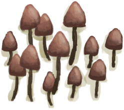
[Magic Mushrooms](MagicMushrooms.md)](MagicMushrooms.md)</td><td  style="text-align:left;vertical-align:top;"  >Eat</td><td  style="text-align:left;vertical-align:top;"  >-1</td></tr><tr ><td  style="text-align:left;vertical-align:top;"  >[

[Urchin Meat](UrchinMeat.md)](UrchinMeat.md)</td><td  style="text-align:left;vertical-align:top;"  >Eat</td><td  style="text-align:left;vertical-align:top;"  >-1</td></tr><tr ><td  style="text-align:left;vertical-align:top;"  >[

[You got nothing!(Event)](Event_FishNothing.md)](Event_FishNothing.md)(未实装)</td><td  style="text-align:left;vertical-align:top;"  >...</td><td  style="text-align:left;vertical-align:top;"  >-2</td></tr><tr ><td  style="text-align:left;vertical-align:top;"  >[

[Aloe Vera Gel](AloeVeraGel.md)](AloeVeraGel.md)</td><td  style="text-align:left;vertical-align:top;"  >Eat</td><td  style="text-align:left;vertical-align:top;"  >-2</td></tr><tr ><td  style="text-align:left;vertical-align:top;"  >[

[Boar Meat](BoarMeat.md)](BoarMeat.md)</td><td  style="text-align:left;vertical-align:top;"  >Eat</td><td  style="text-align:left;vertical-align:top;"  >-2</td></tr><tr ><td  style="text-align:left;vertical-align:top;"  >[

[Bonefish Meat](BonefishMeat.md)](BonefishMeat.md)</td><td  style="text-align:left;vertical-align:top;"  >Eat Fish</td><td  style="text-align:left;vertical-align:top;"  >-2</td></tr><tr ><td  style="text-align:left;vertical-align:top;"  >[

[Goat Meat](GoatMeat.md)](GoatMeat.md)</td><td  style="text-align:left;vertical-align:top;"  >Eat</td><td  style="text-align:left;vertical-align:top;"  >-2</td></tr><tr ><td  style="text-align:left;vertical-align:top;"  >[

[Goatfish](Goatfish.md)](Goatfish.md)</td><td  style="text-align:left;vertical-align:top;"  >Eat Fish</td><td  style="text-align:left;vertical-align:top;"  >-2</td></tr><tr ><td  style="text-align:left;vertical-align:top;"  >[

[Grouper Meat](GrouperMeat.md)](GrouperMeat.md)(未实装)</td><td  style="text-align:left;vertical-align:top;"  >Eat Grouper meat</td><td  style="text-align:left;vertical-align:top;"  >-2</td></tr><tr ><td  style="text-align:left;vertical-align:top;"  >[

[Herring](Herring.md)](Herring.md)</td><td  style="text-align:left;vertical-align:top;"  >Eat Fish</td><td  style="text-align:left;vertical-align:top;"  >-2</td></tr><tr ><td  style="text-align:left;vertical-align:top;"  >[

[Macaque Meat](MacaqueMeat.md)](MacaqueMeat.md)</td><td  style="text-align:left;vertical-align:top;"  >Eat</td><td  style="text-align:left;vertical-align:top;"  >-2</td></tr><tr ><td  style="text-align:left;vertical-align:top;"  >[

[Lizard Meat](MonitorMeat.md)](MonitorMeat.md)</td><td  style="text-align:left;vertical-align:top;"  >Eat</td><td  style="text-align:left;vertical-align:top;"  >-2</td></tr><tr ><td  style="text-align:left;vertical-align:top;"  >[

[Parrot Fish](ParrotFish.md)](ParrotFish.md)</td><td  style="text-align:left;vertical-align:top;"  >Eat Fish</td><td  style="text-align:left;vertical-align:top;"  >-2</td></tr><tr ><td  style="text-align:left;vertical-align:top;"  >[

[Seahound Meat](Seahoundmeat.md)](Seahoundmeat.md)</td><td  style="text-align:left;vertical-align:top;"  >Eat</td><td  style="text-align:left;vertical-align:top;"  >-2</td></tr><tr ><td  style="text-align:left;vertical-align:top;"  >[
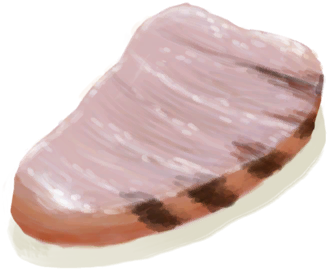
[Shark Meat](SharkMeat.md)](SharkMeat.md)</td><td  style="text-align:left;vertical-align:top;"  >Eat</td><td  style="text-align:left;vertical-align:top;"  >-2</td></tr><tr ><td  style="text-align:left;vertical-align:top;"  >[

[Skinned Snake](SnakeSkinned.md)](SnakeSkinned.md)</td><td  style="text-align:left;vertical-align:top;"  >Eat</td><td  style="text-align:left;vertical-align:top;"  >-2</td></tr><tr ><td  style="text-align:left;vertical-align:top;"  >[

[Threadfin Meat](ThreadfinMeat.md)](ThreadfinMeat.md)</td><td  style="text-align:left;vertical-align:top;"  >Eat</td><td  style="text-align:left;vertical-align:top;"  >-2</td></tr><tr ><td  style="text-align:left;vertical-align:top;"  >[

[It Escaped!(Event)](Event_GoatFightFailure.md)](Event_GoatFightFailure.md)</td><td  style="text-align:left;vertical-align:top;"  >Continue</td><td  style="text-align:left;vertical-align:top;"  >-3</td></tr><tr ><td  style="text-align:left;vertical-align:top;"  >[

[It Escaped!(Event)](Event_PartridgeFightFailure.md)](Event_PartridgeFightFailure.md)</td><td  style="text-align:left;vertical-align:top;"  >Continue</td><td  style="text-align:left;vertical-align:top;"  >-3</td></tr><tr ><td  style="text-align:left;vertical-align:top;"  >[

[It Escaped!(Event)](Event_SeagullFightFailure.md)](Event_SeagullFightFailure.md)</td><td  style="text-align:left;vertical-align:top;"  >Continue</td><td  style="text-align:left;vertical-align:top;"  >-3</td></tr><tr ><td  style="text-align:left;vertical-align:top;"  >[

[Butter](Butter.md)](Butter.md)</td><td  style="text-align:left;vertical-align:top;"  >Eat</td><td  style="text-align:left;vertical-align:top;"  >-3</td></tr><tr ><td  style="text-align:left;vertical-align:top;"  >[

[Fat](Fat.md)](Fat.md)</td><td  style="text-align:left;vertical-align:top;"  >Eat</td><td  style="text-align:left;vertical-align:top;"  >-3</td></tr><tr ><td  style="text-align:left;vertical-align:top;"  >[

[Cooked Fish Scraps](FishScrapsCooked.md)](FishScrapsCooked.md)</td><td  style="text-align:left;vertical-align:top;"  >Eat Scraps</td><td  style="text-align:left;vertical-align:top;"  >-3</td></tr><tr ><td  style="text-align:left;vertical-align:top;"  >[

[Jasmine Flowers](JasmineFlowers.md)](JasmineFlowers.md)</td><td  style="text-align:left;vertical-align:top;"  >Eat</td><td  style="text-align:left;vertical-align:top;"  >-3</td></tr><tr ><td  style="text-align:left;vertical-align:top;"  >[

[Ground Jasmine Flowers](JasmineFlowersGround.md)](JasmineFlowersGround.md)</td><td  style="text-align:left;vertical-align:top;"  >Eat</td><td  style="text-align:left;vertical-align:top;"  >-3</td></tr><tr ><td  style="text-align:left;vertical-align:top;"  >[

[Sago Pulp](SagoPulp.md)](SagoPulp.md)</td><td  style="text-align:left;vertical-align:top;"  >Eat</td><td  style="text-align:left;vertical-align:top;"  >-3</td></tr><tr ><td  style="text-align:left;vertical-align:top;"  >[

[I'm not going to make it....(Event)](Event_SwimFail.md)](Event_SwimFail.md)</td><td  style="text-align:left;vertical-align:top;"  >Swim back</td><td  style="text-align:left;vertical-align:top;"  >-5</td></tr><tr ><td  style="text-align:left;vertical-align:top;"  >[

[Sago Flour](SagoFlour.md)](SagoFlour.md)</td><td  style="text-align:left;vertical-align:top;"  >Eat</td><td  style="text-align:left;vertical-align:top;"  >-5</td></tr><tr ><td  style="text-align:left;vertical-align:top;"  >[

[Cinchona Powder](QuininePowder.md)](QuininePowder.md)</td><td  style="text-align:left;vertical-align:top;"  >Eat</td><td  style="text-align:left;vertical-align:top;"  >-5</td></tr><tr ><td  style="text-align:left;vertical-align:top;"  >[

[Quinine Sulfate](QuinineSulfate.md)](QuinineSulfate.md)</td><td  style="text-align:left;vertical-align:top;"  >Eat</td><td  style="text-align:left;vertical-align:top;"  >-5</td></tr><tr ><td  style="text-align:left;vertical-align:top;"  >[

[Abrasion](W_Abrasion.md)](W_Abrasion.md)</td><td  style="text-align:left;vertical-align:top;"  >Clean (seawater) ** With：**[Salt Water](LQ_WaterSalt.md)</td><td  style="text-align:left;vertical-align:top;"  >-5</td></tr><tr ><td  style="text-align:left;vertical-align:top;"  >[

[Arm Laceration](W_ArmLacerationL.md)](W_ArmLacerationL.md)</td><td  style="text-align:left;vertical-align:top;"  >Clean (seawater) ** With：**[Salt Water](LQ_WaterSalt.md)</td><td  style="text-align:left;vertical-align:top;"  >-5</td></tr><tr ><td  style="text-align:left;vertical-align:top;"  >[

[Stitched Arm Laceration](W_ArmLacerationLStitched.md)](W_ArmLacerationLStitched.md)</td><td  style="text-align:left;vertical-align:top;"  >Clean (seawater) ** With：**[Salt Water](LQ_WaterSalt.md)</td><td  style="text-align:left;vertical-align:top;"  >-5</td></tr><tr ><td  style="text-align:left;vertical-align:top;"  >[

[Arm Laceration](W_ArmLacerationR.md)](W_ArmLacerationR.md)</td><td  style="text-align:left;vertical-align:top;"  >Clean (seawater) ** With：**[Salt Water](LQ_WaterSalt.md)</td><td  style="text-align:left;vertical-align:top;"  >-5</td></tr><tr ><td  style="text-align:left;vertical-align:top;"  >[

[Arm Laceration](W_ArmLacerationRStitched.md)](W_ArmLacerationRStitched.md)</td><td  style="text-align:left;vertical-align:top;"  >Clean (seawater) ** With：**[Salt Water](LQ_WaterSalt.md)</td><td  style="text-align:left;vertical-align:top;"  >-5</td></tr><tr ><td  style="text-align:left;vertical-align:top;"  >[

[Dog Bite](W_DogBite.md)](W_DogBite.md)</td><td  style="text-align:left;vertical-align:top;"  >Clean (seawater) ** With：**[Salt Water](LQ_WaterSalt.md)</td><td  style="text-align:left;vertical-align:top;"  >-5</td></tr><tr ><td  style="text-align:left;vertical-align:top;"  >[

[Leg Laceration](W_LegLacerationL.md)](W_LegLacerationL.md)</td><td  style="text-align:left;vertical-align:top;"  >Clean (seawater) ** With：**[Salt Water](LQ_WaterSalt.md)</td><td  style="text-align:left;vertical-align:top;"  >-5</td></tr><tr ><td  style="text-align:left;vertical-align:top;"  >[

[Leg Laceration](W_LegLacerationLStitched.md)](W_LegLacerationLStitched.md)</td><td  style="text-align:left;vertical-align:top;"  >Clean (seawater) ** With：**[Salt Water](LQ_WaterSalt.md)</td><td  style="text-align:left;vertical-align:top;"  >-5</td></tr><tr ><td  style="text-align:left;vertical-align:top;"  >[

[Leg Laceration](W_LegLacerationR.md)](W_LegLacerationR.md)</td><td  style="text-align:left;vertical-align:top;"  >Clean (seawater) ** With：**[Salt Water](LQ_WaterSalt.md)</td><td  style="text-align:left;vertical-align:top;"  >-5</td></tr><tr ><td  style="text-align:left;vertical-align:top;"  >[

[Leg Laceration](W_LegLacerationRStitched.md)](W_LegLacerationRStitched.md)</td><td  style="text-align:left;vertical-align:top;"  >Clean (seawater) ** With：**[Salt Water](LQ_WaterSalt.md)</td><td  style="text-align:left;vertical-align:top;"  >-5</td></tr><tr ><td  style="text-align:left;vertical-align:top;"  >[

[Macaque Bite](W_MacaqueBite.md)](W_MacaqueBite.md)</td><td  style="text-align:left;vertical-align:top;"  >Clean (seawater) ** With：**[Salt Water](LQ_WaterSalt.md)</td><td  style="text-align:left;vertical-align:top;"  >-5</td></tr><tr ><td  style="text-align:left;vertical-align:top;"  >[

[Minor Laceration](W_MinorLaceration.md)](W_MinorLaceration.md)</td><td  style="text-align:left;vertical-align:top;"  >Clean (seawater) ** With：**[Salt Water](LQ_WaterSalt.md)</td><td  style="text-align:left;vertical-align:top;"  >-5</td></tr><tr ><td  style="text-align:left;vertical-align:top;"  >[

[Minor Laceration](W_MinorLacerationStitched.md)](W_MinorLacerationStitched.md)</td><td  style="text-align:left;vertical-align:top;"  >Clean (seawater) ** With：**[Salt Water](LQ_WaterSalt.md)</td><td  style="text-align:left;vertical-align:top;"  >-5</td></tr><tr ><td  style="text-align:left;vertical-align:top;"  >[

[Lizard Bite](W_MonitorBite.md)](W_MonitorBite.md)</td><td  style="text-align:left;vertical-align:top;"  >Clean (seawater) ** With：**[Salt Water](LQ_WaterSalt.md)</td><td  style="text-align:left;vertical-align:top;"  >-5</td></tr><tr ><td  style="text-align:left;vertical-align:top;"  >[

[Seahound Sting](W_SeahoundSting.md)](W_SeahoundSting.md)</td><td  style="text-align:left;vertical-align:top;"  >Clean (seawater) ** With：**[Salt Water](LQ_WaterSalt.md)</td><td  style="text-align:left;vertical-align:top;"  >-5</td></tr><tr ><td  style="text-align:left;vertical-align:top;"  >[

[Shark Bite](W_SharkBite.md)](W_SharkBite.md)</td><td  style="text-align:left;vertical-align:top;"  >Clean (seawater) ** With：**[Salt Water](LQ_WaterSalt.md)</td><td  style="text-align:left;vertical-align:top;"  >-5</td></tr><tr ><td  style="text-align:left;vertical-align:top;"  >[

[Spider Bite](W_SpiderBite.md)](W_SpiderBite.md)</td><td  style="text-align:left;vertical-align:top;"  >Clean (seawater) ** With：**[Salt Water](LQ_WaterSalt.md)</td><td  style="text-align:left;vertical-align:top;"  >-5</td></tr><tr ><td  style="text-align:left;vertical-align:top;"  >[

[Urchin Wound](W_UrchinWound.md)](W_UrchinWound.md)</td><td  style="text-align:left;vertical-align:top;"  >Clean (seawater) ** With：**[Salt Water](LQ_WaterSalt.md)</td><td  style="text-align:left;vertical-align:top;"  >-5</td></tr><tr ><td  style="text-align:left;vertical-align:top;"  >[

[Sugar Wine](LQ_SugarWine.md)](LQ_SugarWine.md)</td><td  style="text-align:left;vertical-align:top;"  >Drink</td><td  style="text-align:left;vertical-align:top;"  >-5</td></tr><tr ><td  style="text-align:left;vertical-align:top;"  >[

[Fish Scraps](FishScraps.md)](FishScraps.md)</td><td  style="text-align:left;vertical-align:top;"  >Eat Scraps</td><td  style="text-align:left;vertical-align:top;"  >-6</td></tr><tr ><td  style="text-align:left;vertical-align:top;"  >[

[Lizard](Lizard.md)](Lizard.md)</td><td  style="text-align:left;vertical-align:top;"  >Eat</td><td  style="text-align:left;vertical-align:top;"  >-6</td></tr><tr ><td  style="text-align:left;vertical-align:top;"  >[

[Mudskipper](Mudskipper.md)](Mudskipper.md)</td><td  style="text-align:left;vertical-align:top;"  >Eat</td><td  style="text-align:left;vertical-align:top;"  >-6</td></tr><tr ><td  style="text-align:left;vertical-align:top;"  >[

[Dead Chick](PartridgeChickDead.md)](PartridgeChickDead.md)</td><td  style="text-align:left;vertical-align:top;"  >Eat</td><td  style="text-align:left;vertical-align:top;"  >-6</td></tr><tr ><td  style="text-align:left;vertical-align:top;"  >[

[Sago Sawdust](SagoSawdust.md)](SagoSawdust.md)</td><td  style="text-align:left;vertical-align:top;"  >Eat</td><td  style="text-align:left;vertical-align:top;"  >-6</td></tr><tr ><td  style="text-align:left;vertical-align:top;"  >[

[It Escaped!(Event)](Event_BoarArcheryFailure.md)](Event_BoarArcheryFailure.md)(未实装)</td><td  style="text-align:left;vertical-align:top;"  >Continue</td><td  style="text-align:left;vertical-align:top;"  >-10</td></tr><tr ><td  style="text-align:left;vertical-align:top;"  >[

[It Escaped!(Event)](Event_BoarFightFailure.md)](Event_BoarFightFailure.md)</td><td  style="text-align:left;vertical-align:top;"  >Continue</td><td  style="text-align:left;vertical-align:top;"  >-10</td></tr><tr ><td  style="text-align:left;vertical-align:top;"  >[

[It got me...(Event)](Event_CobraFightBadFailure.md)](Event_CobraFightBadFailure.md)</td><td  style="text-align:left;vertical-align:top;"  >Continue</td><td  style="text-align:left;vertical-align:top;"  >-10</td></tr><tr ><td  style="text-align:left;vertical-align:top;"  >[

[It Escaped!(Event)](Event_CobraFightFailure.md)](Event_CobraFightFailure.md)</td><td  style="text-align:left;vertical-align:top;"  >Continue</td><td  style="text-align:left;vertical-align:top;"  >-10</td></tr><tr ><td  style="text-align:left;vertical-align:top;"  >[

[It retreated!(Event)](Event_DroneFightFailure.md)](Event_DroneFightFailure.md)</td><td  style="text-align:left;vertical-align:top;"  >Continue</td><td  style="text-align:left;vertical-align:top;"  >-10</td></tr><tr ><td  style="text-align:left;vertical-align:top;"  >[

[I can't get in!(Event)](Event_MacaqueDenFightFailure.md)](Event_MacaqueDenFightFailure.md)</td><td  style="text-align:left;vertical-align:top;"  >Continue</td><td  style="text-align:left;vertical-align:top;"  >-10</td></tr><tr ><td  style="text-align:left;vertical-align:top;"  >[

[It Escaped!(Event)](Event_MacaqueFightFailure.md)](Event_MacaqueFightFailure.md)</td><td  style="text-align:left;vertical-align:top;"  >Continue</td><td  style="text-align:left;vertical-align:top;"  >-10</td></tr><tr ><td  style="text-align:left;vertical-align:top;"  >[

[It Escaped!(Event)](Event_MacaqueUndeadFightFailure.md)](Event_MacaqueUndeadFightFailure.md)(未实装)</td><td  style="text-align:left;vertical-align:top;"  >Continue</td><td  style="text-align:left;vertical-align:top;"  >-10</td></tr><tr ><td  style="text-align:left;vertical-align:top;"  >[

[It Escaped!(Event)](Event_MonitorFightFailure.md)](Event_MonitorFightFailure.md)</td><td  style="text-align:left;vertical-align:top;"  >Continue</td><td  style="text-align:left;vertical-align:top;"  >-10</td></tr><tr ><td  style="text-align:left;vertical-align:top;"  >[

[I fought it off!(Event)](Event_SeahoundFightFailure.md)](Event_SeahoundFightFailure.md)</td><td  style="text-align:left;vertical-align:top;"  >Continue</td><td  style="text-align:left;vertical-align:top;"  >-10</td></tr><tr ><td  style="text-align:left;vertical-align:top;"  >[

[It Escaped!(Event)](Event_SharkFightFailure.md)](Event_SharkFightFailure.md)</td><td  style="text-align:left;vertical-align:top;"  >Continue</td><td  style="text-align:left;vertical-align:top;"  >-10</td></tr><tr ><td  style="text-align:left;vertical-align:top;"  >[

[Mouse Damage(Event)](Event_MouseDamage.md)](Event_MouseDamage.md)</td><td  style="text-align:left;vertical-align:top;"  >Assess the damage</td><td  style="text-align:left;vertical-align:top;"  >-10</td></tr><tr ><td  style="text-align:left;vertical-align:top;"  >[

[Seagull(Event)](Event_SeagullRaidCropDestruction.md)](Event_SeagullRaidCropDestruction.md)(未实装)</td><td  style="text-align:left;vertical-align:top;"  >Watch impotently...</td><td  style="text-align:left;vertical-align:top;"  >-10</td></tr><tr ><td  style="text-align:left;vertical-align:top;"  >[

[Seagull(Event)](Event_SeagullRaidRummaging.md)](Event_SeagullRaidRummaging.md)</td><td  style="text-align:left;vertical-align:top;"  >Watch impotently...</td><td  style="text-align:left;vertical-align:top;"  >-10</td></tr><tr ><td  style="text-align:left;vertical-align:top;"  >[

[Vomit!(Event)](Event_Vomit.md)](Event_Vomit.md)</td><td  style="text-align:left;vertical-align:top;"  >Eughhh.....</td><td  style="text-align:left;vertical-align:top;"  >-10</td></tr><tr ><td  style="text-align:left;vertical-align:top;"  >[

[Charcoal](Charcoal.md)](Charcoal.md)</td><td  style="text-align:left;vertical-align:top;"  >Eat</td><td  style="text-align:left;vertical-align:top;"  >-10</td></tr><tr ><td  style="text-align:left;vertical-align:top;"  >[

[Bugs](Bugs.md)](Bugs.md)</td><td  style="text-align:left;vertical-align:top;"  >Eat</td><td  style="text-align:left;vertical-align:top;"  >-10</td></tr><tr ><td  style="text-align:left;vertical-align:top;"  >[

[Drying Salted Fish](FishSaltedDrying.md)](FishSaltedDrying.md)</td><td  style="text-align:left;vertical-align:top;"  >Eat Fish</td><td  style="text-align:left;vertical-align:top;"  >-10</td></tr><tr ><td  style="text-align:left;vertical-align:top;"  >[

[Ground Lemongrass](LemonGrassGround.md)](LemonGrassGround.md)</td><td  style="text-align:left;vertical-align:top;"  >Eat</td><td  style="text-align:left;vertical-align:top;"  >-10</td></tr><tr ><td  style="text-align:left;vertical-align:top;"  >[

[Ground Snake Grass](SnakeGrassGround.md)](SnakeGrassGround.md)</td><td  style="text-align:left;vertical-align:top;"  >Eat</td><td  style="text-align:left;vertical-align:top;"  >-10</td></tr><tr ><td  style="text-align:left;vertical-align:top;"  >[

[Ground Spider Lily](SpiderLilyGround.md)](SpiderLilyGround.md)</td><td  style="text-align:left;vertical-align:top;"  >Eat</td><td  style="text-align:left;vertical-align:top;"  >-10</td></tr><tr ><td  style="text-align:left;vertical-align:top;"  >[

[Spider Lily Leaves](SpiderLilyLeaves.md)](SpiderLilyLeaves.md)</td><td  style="text-align:left;vertical-align:top;"  >Eat</td><td  style="text-align:left;vertical-align:top;"  >-10</td></tr><tr ><td  style="text-align:left;vertical-align:top;"  >[

[Dried Spider Lily Leaves](SpiderLilyLeavesDried.md)](SpiderLilyLeavesDried.md)</td><td  style="text-align:left;vertical-align:top;"  >Eat</td><td  style="text-align:left;vertical-align:top;"  >-10</td></tr><tr ><td  style="text-align:left;vertical-align:top;"  >[

[Cut Yam](YamCut.md)](YamCut.md)</td><td  style="text-align:left;vertical-align:top;"  >Eat</td><td  style="text-align:left;vertical-align:top;"  >-10</td></tr><tr ><td  style="text-align:left;vertical-align:top;"  >[

[Urchin Wound](W_UrchinWoundSpines.md)](W_UrchinWoundSpines.md)</td><td  style="text-align:left;vertical-align:top;"  >Remove Spines</td><td  style="text-align:left;vertical-align:top;"  >-10</td></tr><tr ><td  style="text-align:left;vertical-align:top;"  >[

[Ash Water](LQ_AshWater.md)](LQ_AshWater.md)</td><td  style="text-align:left;vertical-align:top;"  >Drink</td><td  style="text-align:left;vertical-align:top;"  >-10</td></tr><tr ><td  style="text-align:left;vertical-align:top;"  >[

[Oil](LQ_Oil.md)](LQ_Oil.md)</td><td  style="text-align:left;vertical-align:top;"  >Drink</td><td  style="text-align:left;vertical-align:top;"  >-10</td></tr><tr ><td  style="text-align:left;vertical-align:top;"  >[

[Citronella Oil](LQ_OilCitronella.md)](LQ_OilCitronella.md)</td><td  style="text-align:left;vertical-align:top;"  >Drink</td><td  style="text-align:left;vertical-align:top;"  >-10</td></tr><tr ><td  style="text-align:left;vertical-align:top;"  >[

[Citronella Oil Mix](LQ_OilCitronellaMix.md)](LQ_OilCitronellaMix.md)</td><td  style="text-align:left;vertical-align:top;"  >Drink</td><td  style="text-align:left;vertical-align:top;"  >-10</td></tr><tr ><td  style="text-align:left;vertical-align:top;"  >[

[Jasmine Oil](LQ_OilJasmine.md)](LQ_OilJasmine.md)</td><td  style="text-align:left;vertical-align:top;"  >Drink</td><td  style="text-align:left;vertical-align:top;"  >-10</td></tr><tr ><td  style="text-align:left;vertical-align:top;"  >[

[Jasmine Oil Mix](LQ_OilJasmineMix.md)](LQ_OilJasmineMix.md)</td><td  style="text-align:left;vertical-align:top;"  >Drink</td><td  style="text-align:left;vertical-align:top;"  >-10</td></tr><tr ><td  style="text-align:left;vertical-align:top;"  >[

[Soaked Sago](LQ_SoakedSago.md)](LQ_SoakedSago.md)</td><td  style="text-align:left;vertical-align:top;"  >Eat</td><td  style="text-align:left;vertical-align:top;"  >-10</td></tr><tr ><td  style="text-align:left;vertical-align:top;"  >[

[Soaked Yam](LQ_SoakedYam.md)](LQ_SoakedYam.md)</td><td  style="text-align:left;vertical-align:top;"  >Eat</td><td  style="text-align:left;vertical-align:top;"  >-10</td></tr><tr ><td  style="text-align:left;vertical-align:top;"  >[

[Toxic Water](LQ_WaterToxic.md)](LQ_WaterToxic.md)</td><td  style="text-align:left;vertical-align:top;"  >Drink</td><td  style="text-align:left;vertical-align:top;"  >-10</td></tr><tr ><td  style="text-align:left;vertical-align:top;"  >[

[Ouch!!!!(Event)](Event_DogFriendAnger.md)](Event_DogFriendAnger.md)</td><td  style="text-align:left;vertical-align:top;"  >Continue</td><td  style="text-align:left;vertical-align:top;"  >-15</td></tr><tr ><td  style="text-align:left;vertical-align:top;"  >[

[Ouch!!!!(Event)](Event_MacaqueFoeAnger.md)](Event_MacaqueFoeAnger.md)(未实装)</td><td  style="text-align:left;vertical-align:top;"  >Continue</td><td  style="text-align:left;vertical-align:top;"  >-15</td></tr><tr ><td  style="text-align:left;vertical-align:top;"  >[

[Ouch!!!!(Event)](Event_MacaqueFriendAnger.md)](Event_MacaqueFriendAnger.md)</td><td  style="text-align:left;vertical-align:top;"  >Continue</td><td  style="text-align:left;vertical-align:top;"  >-15</td></tr><tr ><td  style="text-align:left;vertical-align:top;"  >[

[Dead Bat](Bat.md)](Bat.md)</td><td  style="text-align:left;vertical-align:top;"  >Eat</td><td  style="text-align:left;vertical-align:top;"  >-15</td></tr><tr ><td  style="text-align:left;vertical-align:top;"  >[

[Charred Remains](CharredRemains.md)](CharredRemains.md)</td><td  style="text-align:left;vertical-align:top;"  >Eat Charred Remains</td><td  style="text-align:left;vertical-align:top;"  >-15</td></tr><tr ><td  style="text-align:left;vertical-align:top;"  >[

[Dead Mouse](Mouse.md)](Mouse.md)</td><td  style="text-align:left;vertical-align:top;"  >Eat</td><td  style="text-align:left;vertical-align:top;"  >-15</td></tr><tr ><td  style="text-align:left;vertical-align:top;"  >[

[Skinned Mouse](MouseSkinned.md)](MouseSkinned.md)(未实装)</td><td  style="text-align:left;vertical-align:top;"  >Eat</td><td  style="text-align:left;vertical-align:top;"  >-15</td></tr><tr ><td  style="text-align:left;vertical-align:top;"  >[

[Rotten Remains](RottenRemains.md)](RottenRemains.md)</td><td  style="text-align:left;vertical-align:top;"  >Eat</td><td  style="text-align:left;vertical-align:top;"  >-15</td></tr><tr ><td  style="text-align:left;vertical-align:top;"  >[

[It got me...(Event)](Event_BoarFightBadFailure.md)](Event_BoarFightBadFailure.md)</td><td  style="text-align:left;vertical-align:top;"  >Continue</td><td  style="text-align:left;vertical-align:top;"  >-20</td></tr><tr ><td  style="text-align:left;vertical-align:top;"  >[

[The Cobra Spat!(Event)](Event_CobraFightFailedRetreat.md)](Event_CobraFightFailedRetreat.md)</td><td  style="text-align:left;vertical-align:top;"  >Continue</td><td  style="text-align:left;vertical-align:top;"  >-20</td></tr><tr ><td  style="text-align:left;vertical-align:top;"  >[

[It got me...(Event)](Event_DroneFightBadFailure.md)](Event_DroneFightBadFailure.md)</td><td  style="text-align:left;vertical-align:top;"  >Continue</td><td  style="text-align:left;vertical-align:top;"  >-20</td></tr><tr ><td  style="text-align:left;vertical-align:top;"  >[

[The Drone attacked!(Event)](Event_DroneFightFailedRetreat.md)](Event_DroneFightFailedRetreat.md)</td><td  style="text-align:left;vertical-align:top;"  >Continue</td><td  style="text-align:left;vertical-align:top;"  >-20</td></tr><tr ><td  style="text-align:left;vertical-align:top;"  >[

[Mixed Success(Event)](Event_DroneFightMixedSuccess.md)](Event_DroneFightMixedSuccess.md)</td><td  style="text-align:left;vertical-align:top;"  >Continue</td><td  style="text-align:left;vertical-align:top;"  >-20</td></tr><tr ><td  style="text-align:left;vertical-align:top;"  >[

[I failed to escape!(Event)](Event_EnemyFightFailedRetreat.md)](Event_EnemyFightFailedRetreat.md)</td><td  style="text-align:left;vertical-align:top;"  >Close your eyes</td><td  style="text-align:left;vertical-align:top;"  >-20</td></tr><tr ><td  style="text-align:left;vertical-align:top;"  >[

[I failed!(Event)](Event_EnemyFightFailure.md)](Event_EnemyFightFailure.md)</td><td  style="text-align:left;vertical-align:top;"  >Close your eyes</td><td  style="text-align:left;vertical-align:top;"  >-20</td></tr><tr ><td  style="text-align:left;vertical-align:top;"  >[

[I failed!(Event)](Event_HunterFightBadFailure.md)](Event_HunterFightBadFailure.md)</td><td  style="text-align:left;vertical-align:top;"  >Close your eyes</td><td  style="text-align:left;vertical-align:top;"  >-20</td></tr><tr ><td  style="text-align:left;vertical-align:top;"  >[

[I failed to escape!(Event)](Event_HunterFightFailedRetreat.md)](Event_HunterFightFailedRetreat.md)</td><td  style="text-align:left;vertical-align:top;"  >Close your eyes</td><td  style="text-align:left;vertical-align:top;"  >-20</td></tr><tr ><td  style="text-align:left;vertical-align:top;"  >[

[Ouch!(Event)](Event_MacaqueDenFightBadFailure.md)](Event_MacaqueDenFightBadFailure.md)</td><td  style="text-align:left;vertical-align:top;"  >Continue</td><td  style="text-align:left;vertical-align:top;"  >-20</td></tr><tr ><td  style="text-align:left;vertical-align:top;"  >[

[Ouch!(Event)](Event_MacaqueDenFightFailedRetreat.md)](Event_MacaqueDenFightFailedRetreat.md)</td><td  style="text-align:left;vertical-align:top;"  >Continue</td><td  style="text-align:left;vertical-align:top;"  >-20</td></tr><tr ><td  style="text-align:left;vertical-align:top;"  >[

[Ouch!(Event)](Event_MacaqueFightBadFailure.md)](Event_MacaqueFightBadFailure.md)</td><td  style="text-align:left;vertical-align:top;"  >Continue</td><td  style="text-align:left;vertical-align:top;"  >-20</td></tr><tr ><td  style="text-align:left;vertical-align:top;"  >[

[Ouch!(Event)](Event_MacaqueFightFailedRetreat.md)](Event_MacaqueFightFailedRetreat.md)</td><td  style="text-align:left;vertical-align:top;"  >Continue</td><td  style="text-align:left;vertical-align:top;"  >-20</td></tr><tr ><td  style="text-align:left;vertical-align:top;"  >[

[It got me...(Event)](Event_MonitorFightBadFailure.md)](Event_MonitorFightBadFailure.md)</td><td  style="text-align:left;vertical-align:top;"  >Continue</td><td  style="text-align:left;vertical-align:top;"  >-20</td></tr><tr ><td  style="text-align:left;vertical-align:top;"  >[

[The lizard attacked!(Event)](Event_MonitorFightFailedRetreat.md)](Event_MonitorFightFailedRetreat.md)</td><td  style="text-align:left;vertical-align:top;"  >Continue</td><td  style="text-align:left;vertical-align:top;"  >-20</td></tr><tr ><td  style="text-align:left;vertical-align:top;"  >[

[It got me...(Event)](Event_SeahoundFightBadFailure.md)](Event_SeahoundFightBadFailure.md)</td><td  style="text-align:left;vertical-align:top;"  >Continue</td><td  style="text-align:left;vertical-align:top;"  >-20</td></tr><tr ><td  style="text-align:left;vertical-align:top;"  >[

[The Seahound attacked!(Event)](Event_SeahoundFightFailedRetreat.md)](Event_SeahoundFightFailedRetreat.md)</td><td  style="text-align:left;vertical-align:top;"  >Continue</td><td  style="text-align:left;vertical-align:top;"  >-20</td></tr><tr ><td  style="text-align:left;vertical-align:top;"  >[

[It got me...(Event)](Event_SharkFightBadFailure.md)](Event_SharkFightBadFailure.md)</td><td  style="text-align:left;vertical-align:top;"  >Continue</td><td  style="text-align:left;vertical-align:top;"  >-20</td></tr><tr ><td  style="text-align:left;vertical-align:top;"  >[

[The shark attacked!(Event)](Event_SharkFightFailedRetreat.md)](Event_SharkFightFailedRetreat.md)</td><td  style="text-align:left;vertical-align:top;"  >Continue</td><td  style="text-align:left;vertical-align:top;"  >-20</td></tr><tr ><td  style="text-align:left;vertical-align:top;"  >[

[I can feel a presence here...(Event)](Event_EnemyPresence.md)](Event_EnemyPresence.md)</td><td  style="text-align:left;vertical-align:top;"  >I'm not ready yet</td><td  style="text-align:left;vertical-align:top;"  >-50</td></tr><tr ><td  style="text-align:left;vertical-align:top;"  >[

[Captain(Special1f)(Event)](Event_CaptainSpecial1f.md)](Event_CaptainSpecial1f.md)</td><td  style="text-align:left;vertical-align:top;"  >The feeling is mutual!</td><td  style="text-align:left;vertical-align:top;"  >-50</td></tr><tr ><td  style="text-align:left;vertical-align:top;"  >[

[A Sea Krait!!(Event)](Event_SeaKraitStep.md)](Event_SeaKraitStep.md)</td><td  style="text-align:left;vertical-align:top;"  >Continue...</td><td  style="text-align:left;vertical-align:top;"  >-50</td></tr><tr ><td  style="text-align:left;vertical-align:top;"  >[

[A Skeleton!(Event)(Hole)](Event_SkeletonSeen.md)](Event_SkeletonSeen.md)</td><td  style="text-align:left;vertical-align:top;"  >Continue</td><td  style="text-align:left;vertical-align:top;"  >-50</td></tr><tr ><td  style="text-align:left;vertical-align:top;"  >[

[Nightmare!(Event)](Event_Nightmare.md)](Event_Nightmare.md)</td><td  style="text-align:left;vertical-align:top;"  >Try to calm down...</td><td  style="text-align:left;vertical-align:top;"  >-50</td></tr><tr ><td  style="text-align:left;vertical-align:top;"  >[

[A Spider bit me!(Event)](Event_SpiderNight.md)](Event_SpiderNight.md)</td><td  style="text-align:left;vertical-align:top;"  >Push Spider away!</td><td  style="text-align:left;vertical-align:top;"  >-50</td></tr><tr ><td  style="text-align:left;vertical-align:top;"  >[

[Dog Friend](DogFriend.md)](DogFriend.md)</td><td  style="text-align:left;vertical-align:top;"  >Murder! ** With：**[“Cutter”](tag_Cutter.md) , [“Spear T1”](tag_Spear.md)</td><td  style="text-align:left;vertical-align:top;"  >-100</td></tr><tr ><td  style="text-align:left;vertical-align:top;"  >[

[Macaque Friend](MacaqueFriend.md)](MacaqueFriend.md)</td><td  style="text-align:left;vertical-align:top;"  >Murder! ** With：**[“Cutter”](tag_Cutter.md) , [“Spear T1”](tag_Spear.md)</td><td  style="text-align:left;vertical-align:top;"  >-100</td></tr><tr ><td  style="text-align:left;vertical-align:top;"  >[

[Weston](Weston.md)](Weston.md)</td><td  style="text-align:left;vertical-align:top;"  >Murder! ** With：**[“Hammer”](tag_Hammer.md)</td><td  style="text-align:left;vertical-align:top;"  >-100</td></tr><tr ><td  style="text-align:left;vertical-align:top;"  >

[Carnivore](Pk_4_Carnivore.md)</td><td  style="text-align:left;vertical-align:top;"  >“VegetarianAction(Group)”</td><td  style="text-align:left;vertical-align:top;"  >-100</td></tr><tr ><td  style="text-align:left;vertical-align:top;"  >

[Vegetarian](Pk_4_Vegetarian.md)</td><td  style="text-align:left;vertical-align:top;"  >“CarnivorousAction(Group)”</td><td  style="text-align:left;vertical-align:top;"  >-100</td></tr><tr ><td  style="text-align:left;vertical-align:top;"  >[

[Watcher(Event)](Event_WatchedExperience1a.md)](Event_WatchedExperience1a.md)</td><td  style="text-align:left;vertical-align:top;"  >Scream in Horror</td><td  style="text-align:left;vertical-align:top;"  >-200 / /TP</td></tr><tr ><td  style="text-align:left;vertical-align:top;"  >[

[Watcher(Event)](Event_WatchedExperience1b.md)](Event_WatchedExperience1b.md)</td><td  style="text-align:left;vertical-align:top;"  >Scream in Horror</td><td  style="text-align:left;vertical-align:top;"  >-200 / /TP</td></tr><tr ><td  style="text-align:left;vertical-align:top;"  >[

[Watcher(Event)](Event_WatchedExperience1c.md)](Event_WatchedExperience1c.md)</td><td  style="text-align:left;vertical-align:top;"  >Scream in Horror</td><td  style="text-align:left;vertical-align:top;"  >-200 / /TP</td></tr><tr ><td  style="text-align:left;vertical-align:top;"  >[

[Watcher(Event)](Event_WatchedExperience1d.md)](Event_WatchedExperience1d.md)</td><td  style="text-align:left;vertical-align:top;"  >Scream in Horror</td><td  style="text-align:left;vertical-align:top;"  >-200 / /TP</td></tr><tr ><td  style="text-align:left;vertical-align:top;"  >[

[Watcher(Event)](Event_WatchedExperience1e.md)](Event_WatchedExperience1e.md)</td><td  style="text-align:left;vertical-align:top;"  >Scream in Horror</td><td  style="text-align:left;vertical-align:top;"  >-200 / /TP</td></tr><tr ><td  style="text-align:left;vertical-align:top;"  >[

[Watcher(Event)](Event_WatchedExperience1f.md)](Event_WatchedExperience1f.md)</td><td  style="text-align:left;vertical-align:top;"  >Scream in Horror</td><td  style="text-align:left;vertical-align:top;"  >-200 / /TP</td></tr></tbody></table>  
  
## Required By  
<table class="table table-bordered" data-toggle="table"  ><thead style=""><tr ><th  style="text-align:left;vertical-align:top;"  >From</th><th  style="text-align:left;vertical-align:top;"  >Operation</th><th  style="text-align:left;vertical-align:top;"  data-sortable="true"  >Value</th></tr></thead><tr ><td  style="text-align:left;vertical-align:top;"  >[Divine Insight(Event)](Event_GodExperience1a.md)</td><td  style="text-align:left;vertical-align:top;"  >Event</td><td  style="text-align:left;vertical-align:top;"  >350</td></tr><tr ><td  style="text-align:left;vertical-align:top;"  >[Bone Flute](FluteBone.md)</td><td  style="text-align:left;vertical-align:top;"  >影响</td><td  style="text-align:left;vertical-align:top;"  >-350 ~ 350</td></tr><tr ><td  style="text-align:left;vertical-align:top;"  >[Wooden Flute](FluteWooden.md)</td><td  style="text-align:left;vertical-align:top;"  >影响</td><td  style="text-align:left;vertical-align:top;"  >-350 ~ 350</td></tr></tbody></table>  
  

