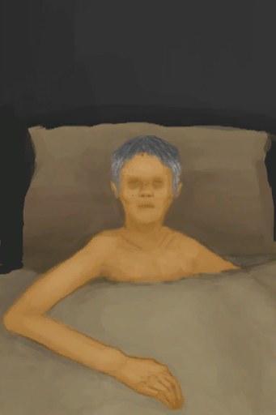
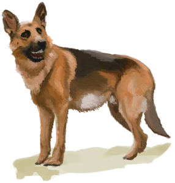
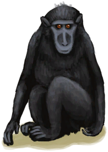

# Mourning  
> You are mourning the death of a loved one. Lowers your morale and mental structure.  
  

<b>Base Value: </b> 0 
  

<b>Value Range: </b> 0 ~ 2880 
  

<b>Base Rate: </b> -1 / /TP 
  
## Statuses  

<table><tr style="height:2em;"><td style="background-color:#F0F0F0;text-align:center;width:180px;font-size:1.4em;font-weight:bold;vertical-align:middle;">
1 ～ 2880

0% ～ 100%
</td><td colspan=2 style="font-size:1.1em;vertical-align:middle;background-color:#F9F9F9;">
<b>

Mourning</b>

&nbsp;&nbsp;You are mourning the death of a loved one.
</td></tr><tr><td colspan=2><b>Effect：</b>[

[Morale](Morale.md)](Morale.md)addition<b>-1.5</b>, [

[Mental Structure](Structure.md)](Structure.md)addition<b>-1</b></td></tr><tr><td colspan=2></td></tr></table>
  
## Change By  
<table class="table table-bordered" data-toggle="table"  ><thead style=""><tr ><th  style="text-align:left;vertical-align:top;"  >From</th><th  style="text-align:left;vertical-align:top;"  >Operation</th><th  style="text-align:left;vertical-align:top;"  data-sortable="true"  >Value</th></tr></thead><tr ><td  style="text-align:left;vertical-align:top;"  >[

[Baby](Baby.md)](Baby.md)</td><td  style="text-align:left;vertical-align:top;"  >Transform</td><td  style="text-align:left;vertical-align:top;"  >2880</td></tr><tr ><td  style="text-align:left;vertical-align:top;"  >[

[Grandfather](Grandfather.md)](Grandfather.md)</td><td  style="text-align:left;vertical-align:top;"  >Tragedy!</td><td  style="text-align:left;vertical-align:top;"  >2880</td></tr><tr ><td  style="text-align:left;vertical-align:top;"  >[

[Dog Friend](DogFriend.md)](DogFriend.md)</td><td  style="text-align:left;vertical-align:top;"  >Dead of Hunger</td><td  style="text-align:left;vertical-align:top;"  >672</td></tr><tr ><td  style="text-align:left;vertical-align:top;"  >[

[Dog Friend](DogFriend.md)](DogFriend.md)</td><td  style="text-align:left;vertical-align:top;"  >Dead of Thirst</td><td  style="text-align:left;vertical-align:top;"  >672</td></tr><tr ><td  style="text-align:left;vertical-align:top;"  >[

[Macaque Friend](MacaqueFriend.md)](MacaqueFriend.md)</td><td  style="text-align:left;vertical-align:top;"  >Transform</td><td  style="text-align:left;vertical-align:top;"  >336</td></tr><tr ><td  style="text-align:left;vertical-align:top;"  >[

[Macaque Friend](MacaqueFriend.md)](MacaqueFriend.md)</td><td  style="text-align:left;vertical-align:top;"  >Dead of Thirst</td><td  style="text-align:left;vertical-align:top;"  >336</td></tr><tr ><td  style="text-align:left;vertical-align:top;"  >[

[Dog Friend](DogFriend.md)](DogFriend.md)</td><td  style="text-align:left;vertical-align:top;"  >Murder! ** With：**[“Cutter”](tag_Cutter.md) , [“Spear T1”](tag_Spear.md)</td><td  style="text-align:left;vertical-align:top;"  >288</td></tr><tr ><td  style="text-align:left;vertical-align:top;"  >[

[Macaque Friend](MacaqueFriend.md)](MacaqueFriend.md)</td><td  style="text-align:left;vertical-align:top;"  >Murder! ** With：**[“Cutter”](tag_Cutter.md) , [“Spear T1”](tag_Spear.md)</td><td  style="text-align:left;vertical-align:top;"  >288</td></tr><tr ><td  style="text-align:left;vertical-align:top;"  >[

[Weston](Weston.md)](Weston.md)</td><td  style="text-align:left;vertical-align:top;"  >Murder! ** With：**[“Hammer”](tag_Hammer.md)</td><td  style="text-align:left;vertical-align:top;"  >288</td></tr></tbody></table>  
  

