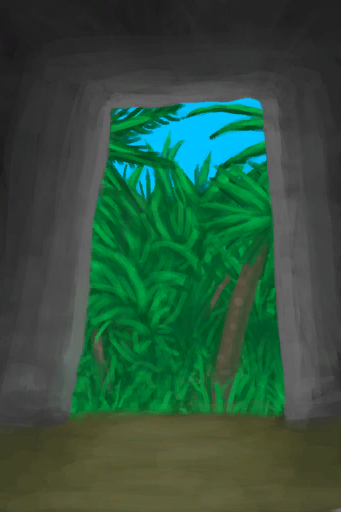

# Mud Hut  
> Into the Hut  
  
<table class="table table-bordered" data-toggle="table"  data-show-header="false"><thead style="display:none"><tr ><th  style="width:50%;text-align:left;vertical-align:top;"  >title</th><th  style="width:50%;text-align:left;vertical-align:top;"  ></th></tr></thead><tr ><td  style="width:50%;text-align:left;vertical-align:top;"  >** Can Be Renamed **</td><td  style="width:50%;text-align:left;vertical-align:top;"  >

<a href="MudHutEntranceRuins.md" style="color:black">Mud Hut</a>

"A house made of <b>Mud Bricks</td></tr></tbody></table>  
  
## Got From  

Exit

[Exit(Mud Hut)](MudHutExitRuins.md)

  
  
## Action  

<table><tr><td rowspan="2" style="width:200px;text-align:center;font-size:1.3em;font-weight:bold">

Enter

3m

</td><td></td></tr><tr><td></td></tr><tr><td colspan="2">[

[Mud Hut(Environment)](Env_MudHutRuins.md)](Env_MudHutRuins.md)(<b>+1</b>), [

[Exit(Mud Hut)](MudHutExitRuins.md)](MudHutExitRuins.md)(<b>+1</b>), [

[Mud Hut](MudHutRuins.md)](MudHutRuins.md)(<b>+1</b>)</td></tr></table>
  
  
  

