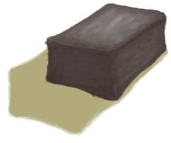

# Mud Pile  
> "Could mix it with temper to make a brick. Sand  
  
<table class="table table-bordered" data-toggle="table"  data-show-header="false"><thead style="display:none"><tr ><th  style="width:50%;text-align:left;vertical-align:top;"  >title</th><th  style="width:50%;text-align:left;vertical-align:top;"  ></th></tr></thead><tr ><td  style="width:50%;text-align:left;vertical-align:top;"  >**Weight：**150  **Tag：**	[“Water Container”](tag_WaterContainer.md), [“Heavy”](tag_Heavy.md)</td><td  style="width:50%;text-align:left;vertical-align:top;"  >

<a href="MudPile.md" style="color:black">Mud Pile</a>

</td></tr></tbody></table>  
  
## Got From  

Make Mud

[Dirt Pile](DirtPile.md)

** With：**[“Water”](tag_WaterAny.md)Make Mud

[Dirt Pile](DirtPile.md)

Craft BluePrint

[Well(BluePrint)](Bp_Well.md)

Dig up Mud

[Mud Deposit](MudDeposit.md)

** With：**[“Shovel”](tag_Shovel.md)Dig Up Mud

[Mud Deposit](MudDeposit.md)

Dig up Mud

[Dry Puddle(Wetlands)](Puddle.md)

** With：**[“Shovel”](tag_Shovel.md)Dig Up Mud

[Dry Puddle(Wetlands)](Puddle.md)

  
  
## Action  

<table><tr><td rowspan="2" style="width:200px;text-align:center;font-size:1.3em;font-weight:bold">

Make Clay

30m

</td><td>[“HandAction(Group)”](HandAction.md)</td></tr><tr><td><b>Self：</b>→ [

[Clay](Clay.md)](Clay.md)</td></tr><tr><td colspan="2"><b>Require：</b>[

[Light](Light.md)](Light.md): <b>1-100</b></td></tr><tr><td colspan="2"><b>StatChange：</b>[

[Filth](Filth.md)](Filth.md)<b>+15</b></td></tr></table>
  

<table><tr><td rowspan="2" style="width:200px;text-align:center;font-size:1.3em;font-weight:bold">

Apply to Body

15m

</td><td>[“HandAction(Group)”](HandAction.md)</td></tr><tr><td></td></tr><tr><td colspan="2"><b>StatChange：</b>[

[Filth](Filth.md)](Filth.md)<b>+500</b>, [

[Mud Protection](MudProtection.md)](MudProtection.md)<b>+50</b></td></tr></table>
  
  
  
## Drag With  

<table style="margin-bottom:0px;"><tr><td style="width:40%;text-align:left; background-color:#FEFEFE"><b>With：</b>[“Temper”](tag_Temper.md)</td><td style="width:40%;font-size:1em;font-weight:bold;background-color:#FEFEFE">Make a Mud Brick (15m) [“HandAction(Group)”](HandAction.md)</td></tr><tr><td colspan="2"><b>Require：</b>[

[Light](Light.md)](Light.md): <b>1-100</b></td></tr><tr style="background-color:#FFFFFF"><td style=""><b>Receiving：</b>→Dismiss</td><td style=""><b>Self：</b>→ [

[Mud Brick](MudBrick.md)](MudBrick.md)</td></tr><tr><td colspan="2"><b>StatChange：</b>[

[Filth](Filth.md)](Filth.md)<b>+15</b></td></tr></table>
  

<table style="margin-bottom:0px;"><tr><td style="width:40%;text-align:left; background-color:#FEFEFE"><b>With：</b>[“Hammer”](tag_Hammer.md)</td><td style="width:40%;font-size:1em;font-weight:bold;background-color:#FEFEFE">Make Clay (30m) [“HandAction(Group)”](HandAction.md)</td></tr><tr><td colspan="2"><b>Require：</b>[

[Light](Light.md)](Light.md): <b>1-100</b></td></tr><tr style="background-color:#FFFFFF"><td style=""><b>Receiving：</b></td><td style=""><b>Self：</b>→ [

[Clay](Clay.md)](Clay.md)</td></tr><tr><td colspan="2"><b>StatChange：</b>[

[Filth](Filth.md)](Filth.md)<b>+10</b></td></tr></table>
  
  
## Drag To  

[Bee Skep](BeeSkep.md)

[Swarming Bee Skep](BeeSkepSwarming.md)

[Trapped Macaque](CageTrapMacaque.md)

[Sow](BoarEnclosureFemale.md)

[Boar](BoarEnclosureMale.md)

[Piglet](BoarEnclosurePiglet.md)

[Sow](BoarTiedFemale.md)

[Boar](BoarTiedMale.md)

[Piglet](BoarTiedPiglet.md)

[Dog Friend](DogFriend.md)

[Goat](GoatEnclosureFemale.md)

[Juvenile Goat](GoatEnclosureKid.md)

[Lactating Goat](GoatEnclosureLactating.md)

[Male Goat](GoatEnclosureMale.md)

[Goat](GoatTiedFemale.md)

[Lactating Goat](GoatTiedFemaleLactating.md)

[Juvenile Goat](GoatTiedKid.md)

[Male Goat](GoatTiedMale.md)

[Grandfather](Grandfather.md)

[Grandfather](GrandfatherHealthy.md)

[Macaque Friend](MacaqueFriend.md)

[Wounded Macaque](MacaqueWounded.md)

[Sago Flatbread](SagoFlatbread.md)

[Water Ration](WaterRation.md)

[Dry Puddle(Wetlands)](Puddle.md)

[Reservoir](WaterReservoir.md)

[Reservoir(Full)](WaterReservoirFull.md)

[Reservoir (irrigating)](WaterReservoirIrrigating.md)

  
  
## Use In BluePrint  

<a href="Bp_BeeSkepEmpty.md" style="color:black">Empty Skep</a>

<a href="Bp_CropPlot.md" style="color:black">Crop Plot</a>

<a href="Bp_MoldAxe.md" style="color:black">Axe Mold</a>

<a href="Bp_MoldKnife.md" style="color:black">Knife Mold</a>

<a href="Bp_MoldShovel.md" style="color:black">Shovel Mold</a>

<a href="Bp_MoldSpear.md" style="color:black">Spear Mold</a>

<a href="Bp_RicePaddy.md" style="color:black">Rice Paddy</a>

  
  
  
## Use To Transform  
<table class="table table-bordered" data-toggle="table"  ><thead style=""><tr ><th  style="text-align:left;vertical-align:top;"  >Transform to</th><th  style="text-align:left;vertical-align:top;"  >Container</th></tr></thead><tr ><td  style="text-align:left;vertical-align:top;"  >[

[Dirt Pile](DirtPile.md)](DirtPile.md)</td><td  style="text-align:left;vertical-align:top;"  >[

[Campfire](Campfire.md)](Campfire.md)</td></tr><tr ><td  style="text-align:left;vertical-align:top;"  >[

[Dirt Pile](DirtPile.md)](DirtPile.md)</td><td  style="text-align:left;vertical-align:top;"  >[

[Clay Fire Pit](ClayFirePit.md)](ClayFirePit.md)</td></tr><tr ><td  style="text-align:left;vertical-align:top;"  >[

[Dirt Pile](DirtPile.md)](DirtPile.md)</td><td  style="text-align:left;vertical-align:top;"  >[

[Fire](Fire.md)](Fire.md)</td></tr><tr ><td  style="text-align:left;vertical-align:top;"  >[

[Dirt Pile](DirtPile.md)](DirtPile.md)</td><td  style="text-align:left;vertical-align:top;"  >[

[Gas Cooker(On)](GasCookerOn.md)](GasCookerOn.md)</td></tr></tbody></table>  
  
## Durability   

<table style="margin-bottom:0px;"><tr><td style="width:30%;text-align:left; background-color:#FEFEFE;font-size:1.3em;font-weight:bold;">Spoilage</td><td style="font-size:1em;background-color:#FEFEFE">Starting：180 , Max：180 -1/TP , Duration ：1d21h</td></tr><tr style="background-color:#FFFFFF"><td colspan=2>** On Zero： ** Self: → [

[Dirt Pile](DirtPile.md)](DirtPile.md)</td></tr></table>
  
## Passive Effects  
<table class="table table-bordered" data-toggle="table"  ><thead style=""><tr ><th  style="text-align:left;vertical-align:top;"  >Name</th><th  style="text-align:left;vertical-align:top;"  >Condition</th><th  style="text-align:left;vertical-align:top;"  >Change(Each TP)</th><th  style="text-align:left;vertical-align:top;"  data-sortable="true"  >Status</th></tr></thead><tr ><td  style="text-align:left;vertical-align:top;"  >Rain</td><td  style="text-align:left;vertical-align:top;"  >** Require Stat：** [

[Rain Value](RainValue.md)](RainValue.md): <b>1-5</b></td><td  style="text-align:left;vertical-align:top;"  >Spoilage +10(5.55%)</td><td  style="text-align:left;vertical-align:top;"  ></td></tr></tbody></table>  
  

