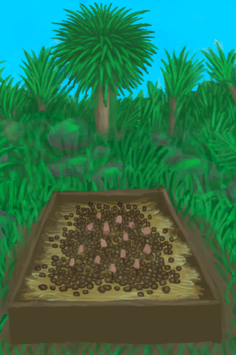
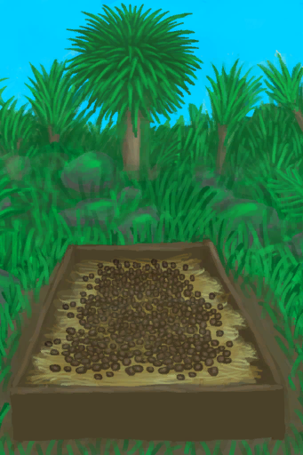

# Assorted Mushrooms Bed  
> I should keep it hydrated and wait for them to grow.  
  
<table class="table table-bordered" data-toggle="table"  data-show-header="false"><thead style="display:none"><tr ><th  style="width:50%;text-align:left;vertical-align:top;"  >title</th><th  style="width:50%;text-align:left;vertical-align:top;"  ></th></tr></thead><tr ><td  style="width:50%;text-align:left;vertical-align:top;"  >** DoseNotPile **  **Weight：**2500  **Tag：**	[“Crop”](tag_Crop.md)  **Usage：**0  ** Effect: ** [

[Discomfort](Discomfort.md)](Discomfort.md)<b>+300</b></td><td  style="width:50%;text-align:left;vertical-align:top;"  >

<a href="MushroomBedAssorted.md" style="color:black">Assorted Mushrooms Bed</a>

</td></tr></tbody></table>  
  
## Got From  

** With：**[Assorted Mushrooms](AssortedMushrooms.md)Plant Assorted Mushrooms

[Empty Mushroom Bed(Empty)](MushroomBedEmpty.md)

  
  
## Drag With  

<table style="margin-bottom:0px;"><tr><td style="width:40%;text-align:left; background-color:#FEFEFE"><b>With：</b>[

[Coconut Water](LQ_CoconutWater.md)](LQ_CoconutWater.md) | [“Water for Crops”](tag_WaterFresh.md)</td><td style="width:40%;font-size:1em;font-weight:bold;background-color:#FEFEFE">Water  </td></tr><tr style="background-color:#FFFFFF"><td style=""><b>Receiving：</b></td><td style=""><b>Self：</b>Water

  <b>+96(33.33%)</b></td></tr></table>
  

<table style="margin-bottom:0px;"><tr><td style="width:40%;text-align:left; background-color:#FEFEFE"><b>With：</b>[“Fertilizer”](tag_Fertilizer.md)</td><td style="width:40%;font-size:1em;font-weight:bold;background-color:#FEFEFE">Fertilize (15m) </td></tr><tr style="background-color:#FFFFFF"><td style=""><b>Receiving：</b>→Dismiss</td><td style=""><b>Self：</b>Fertilizer

  <b>+384(100%)</b></td></tr></table>
  

<table style="margin-bottom:0px;"><tr><td style="width:40%;text-align:left; background-color:#FEFEFE"><b>With：</b>[“Weak Fertilizer”](tag_FertilizerWeak.md)</td><td style="width:40%;font-size:1em;font-weight:bold;background-color:#FEFEFE">Fertilize (15m) </td></tr><tr style="background-color:#FFFFFF"><td style=""><b>Receiving：</b>→Dismiss</td><td style=""><b>Self：</b>Fertilizer

  <b>+96(25%)</b></td></tr></table>
  
  
## Drag To  

[Brimstone Pesticide](LQ_PesticideBrimstone.md)

[Chilli Pesticide](LQ_PesticideChilli.md)

  
  
## Durability   

<table style="margin-bottom:0px;"><tr><td style="width:30%;text-align:left; background-color:#FEFEFE;font-size:1.3em;font-weight:bold;">

Fertilizer</td><td style="font-size:1em;background-color:#FEFEFE">Starting：0 , Max：384 -1/TP , Duration ：4d</td></tr><tr style="background-color:#FFFFFF"><td colspan=2></td></tr></table>
  

<table style="margin-bottom:0px;"><tr><td style="width:30%;text-align:left; background-color:#FEFEFE;font-size:1.3em;font-weight:bold;">Usage</td><td style="font-size:1em;background-color:#FEFEFE">Starting：0 , Max：384 -1/TP , Duration ：4d</td></tr><tr style="background-color:#FFFFFF"><td colspan=2></td></tr></table>
  

<table style="margin-bottom:0px;"><tr><td style="width:30%;text-align:left; background-color:#FEFEFE;font-size:1.3em;font-weight:bold;">

Water</td><td style="font-size:1em;background-color:#FEFEFE">Starting：192 , Max：288 -1/TP , Duration ：3d</td></tr><tr style="background-color:#FFFFFF"><td colspan=2>** On Zero： ** Self: → [

[Dry Mushroom Bed](MushroomBedDry.md)](MushroomBedDry.md)</td></tr></table>
  

<table style="margin-bottom:0px;"><tr><td style="width:30%;text-align:left; background-color:#FEFEFE;font-size:1.3em;font-weight:bold;">Progress</td><td style="font-size:1em;background-color:#FEFEFE">Starting：0 , Max：672 +1/TP , Duration ：7d</td></tr><tr style="background-color:#FFFFFF"><td colspan=2>** On Full： ** Self: →Dismiss [

[Assorted Mushrooms](AssortedMushroomsPlant.md)](AssortedMushroomsPlant.md)(<b>+12～+20</b>), [

[Wooden Plank](Plank.md)](Plank.md)(<b>+4</b>)</td></tr></table>
  
## Passive Effects  
<table class="table table-bordered" data-toggle="table"  ><thead style=""><tr ><th  style="text-align:left;vertical-align:top;"  >Name</th><th  style="text-align:left;vertical-align:top;"  >Condition</th><th  style="text-align:left;vertical-align:top;"  >Change(Each TP)</th><th  style="text-align:left;vertical-align:top;"  data-sortable="true"  >Status</th></tr></thead><tr ><td  style="text-align:left;vertical-align:top;"  >Fertilizer</td><td  style="text-align:left;vertical-align:top;"  >** Require Durability：** Fertilizer

: <b>1～384(0.26%～100%)</b></td><td  style="text-align:left;vertical-align:top;"  >Progress+0.5(0.07%)</td><td  style="text-align:left;vertical-align:top;"  ></td></tr><tr ><td  style="text-align:left;vertical-align:top;"  >Humid</td><td  style="text-align:left;vertical-align:top;"  >** Require Card：** [“Humid Environment”](tag_EnvHumid.md)</td><td  style="text-align:left;vertical-align:top;"  >Progress+0.25(0.03%)</td><td  style="text-align:left;vertical-align:top;"  ></td></tr><tr ><td  style="text-align:left;vertical-align:top;"  >Dry</td><td  style="text-align:left;vertical-align:top;"  >** Require Card：** [“Dry Environment”](tag_EnvDry.md)</td><td  style="text-align:left;vertical-align:top;"  >Progress-0.5(-0.08%)</td><td  style="text-align:left;vertical-align:top;"  ></td></tr><tr ><td  style="text-align:left;vertical-align:top;"  >Dark</td><td  style="text-align:left;vertical-align:top;"  >** Require Stat：** [

[Light](Light.md)](Light.md): <b>0-0</b></td><td  style="text-align:left;vertical-align:top;"  >Progress+0.25(0.03%)</td><td  style="text-align:left;vertical-align:top;"  ></td></tr><tr ><td  style="text-align:left;vertical-align:top;"  >Rain</td><td  style="text-align:left;vertical-align:top;"  >** Require Stat：** [

[Rain Value](RainValue.md)](RainValue.md): <b>1-5</b></td><td  style="text-align:left;vertical-align:top;"  >Water

 +25(8.68%)</td><td  style="text-align:left;vertical-align:top;"  ></td></tr></tbody></table>  
  

