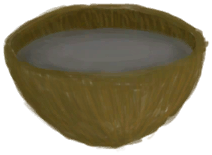

# Nausea  
> Lowers your morale and makes you throw up if it gets too high.  
  

<b>Base Value: </b> 0 
  

<b>Value Range: </b> 0 ~ 24 
  

<b>Base Rate: </b> -1 / /TP 
  

<b>Rate Range: </b> -10 ~ +10 / /TP
                
  
## Statuses  

<table><tr style="height:2em;"><td style="background-color:#F0F0F0;text-align:center;width:180px;font-size:1.4em;font-weight:bold;vertical-align:middle;">
8 ～ 12

33% ～ 50%
</td><td colspan=2 style="font-size:1.1em;vertical-align:middle;background-color:#F9F9F9;">
<b>

Nauseous</b>

&nbsp;&nbsp;I'm not feeling that well.
</td></tr><tr><td colspan=2><b>Effect：</b>[

[Morale](Morale.md)](Morale.md)addition<b>-0.5</b></td></tr><tr><td colspan=2></td></tr><tr style="height:2em;"><td style="background-color:#F0F0F0;text-align:center;width:180px;font-size:1.4em;font-weight:bold;vertical-align:middle;">
13 ～ 19

54% ～ 79%
</td><td colspan=2 style="font-size:1.1em;vertical-align:middle;background-color:#F9F9F9;">
<b>

Nauseous</b>

&nbsp;&nbsp;I feel like throwing up.
</td></tr><tr><td colspan=2><b>Effect：</b>[

[Morale](Morale.md)](Morale.md)addition<b>-1</b></td></tr><tr><td colspan=2></td></tr><tr style="height:2em;"><td style="background-color:#F0F0F0;text-align:center;width:180px;font-size:1.4em;font-weight:bold;vertical-align:middle;">
20 ～ 24

83% ～ 100%
</td><td colspan=2 style="font-size:1.1em;vertical-align:middle;background-color:#F9F9F9;">
<b>

Nauseous</b>

&nbsp;&nbsp;I'm going to throw up!
</td></tr><tr><td colspan=2><b>Effect：</b>[

[Morale](Morale.md)](Morale.md)addition<b>-2</b></td></tr><tr><td colspan=2></td></tr></table>
  
## Related Cards  
[Stress](Stress.md)  |  [Satiation](Satiation.md)  |  [Saturation Bananas](SaturationBananas.md)  |  [Saturation Bird](SaturationBird.md)  |  [Saturation Coconuts](SaturationCoconuts.md)  |  [Saturation Crustaceans](SaturationCrustaceans.md)  |  [Saturation Dairy](SaturationDairy.md)  |  [Saturation Eggs](SaturationEggs.md)  |  [Saturation Fish](SaturationFish.md)  |  [Saturation Fruits](SaturationFruits.md)  |  [Saturation Meat](SaturationMeat.md)  |  [Saturation Mollusks](SaturationMollusks.md)  |  [Saturation Mushrooms](SaturationMushrooms.md)  |  [Saturation Nuts](SaturationNuts.md)  |  [Saturation Rations](SaturationRations.md)  |  [Saturation Rice](SaturationRice.md)  |  [Saturation Reptile](SaturationReptile.md)  |  [Saturation Sago](SaturationSago.md)  |  [Saturation Sugar](SaturationSugar.md)  |  [Saturation Vegetables](SaturationVegetables.md)  |  [Saturation Yam](SaturationYam.md)  |  [Bacteria Cholera](BacteriaCholera.md)  |  [Land Sickness](LandSickness.md)  |  [Alien Cravings](AlienCravings.md)  |  [Alcohol](Alcohol.md)  |  [Bee Stings](BeeStings.md)  |  [Anti-Seasickness](AntiSeasickness.md)  |  [Capsaicin](Capsaicin.md)  |  [Food Poisoning](FoodPoisoning.md)  |  [Ginger](GingerEffect.md)  |  [Discomfort](Discomfort.md)  |  [Pregnancy](Pregnancy.md)  |  [Psylocibin](Psylocibin.md)  |  [Quinine](Quinine.md)  |  [Rice Effect](RiceEffect.md)  |  [Sea Sickness](SeaSickness.md)  |  [Sodium](Sodium.md)  
## Change By  
<table class="table table-bordered" data-toggle="table"  ><thead style=""><tr ><th  style="text-align:left;vertical-align:top;"  >From</th><th  style="text-align:left;vertical-align:top;"  >Operation</th><th  style="text-align:left;vertical-align:top;"  >Value</th></tr></thead><tr ><td  style="text-align:left;vertical-align:top;"  >[

[Toxic Water](LQ_WaterToxic.md)](LQ_WaterToxic.md)</td><td  style="text-align:left;vertical-align:top;"  >Drink</td><td  style="text-align:left;vertical-align:top;"  >100</td></tr><tr ><td  style="text-align:left;vertical-align:top;"  >[

[Oil](LQ_Oil.md)](LQ_Oil.md)</td><td  style="text-align:left;vertical-align:top;"  >Drink</td><td  style="text-align:left;vertical-align:top;"  >75</td></tr><tr ><td  style="text-align:left;vertical-align:top;"  >[

[Citronella Oil](LQ_OilCitronella.md)](LQ_OilCitronella.md)</td><td  style="text-align:left;vertical-align:top;"  >Drink</td><td  style="text-align:left;vertical-align:top;"  >75</td></tr><tr ><td  style="text-align:left;vertical-align:top;"  >[

[Citronella Oil Mix](LQ_OilCitronellaMix.md)](LQ_OilCitronellaMix.md)</td><td  style="text-align:left;vertical-align:top;"  >Drink</td><td  style="text-align:left;vertical-align:top;"  >75</td></tr><tr ><td  style="text-align:left;vertical-align:top;"  >[

[Jasmine Oil](LQ_OilJasmine.md)](LQ_OilJasmine.md)</td><td  style="text-align:left;vertical-align:top;"  >Drink</td><td  style="text-align:left;vertical-align:top;"  >75</td></tr><tr ><td  style="text-align:left;vertical-align:top;"  >[

[Jasmine Oil Mix](LQ_OilJasmineMix.md)](LQ_OilJasmineMix.md)</td><td  style="text-align:left;vertical-align:top;"  >Drink</td><td  style="text-align:left;vertical-align:top;"  >75</td></tr><tr ><td  style="text-align:left;vertical-align:top;"  >[

[Ash Water](LQ_AshWater.md)](LQ_AshWater.md)</td><td  style="text-align:left;vertical-align:top;"  >Drink</td><td  style="text-align:left;vertical-align:top;"  >50</td></tr><tr ><td  style="text-align:left;vertical-align:top;"  >

[Carnivore](Pk_4_Carnivore.md)</td><td  style="text-align:left;vertical-align:top;"  >“VegetarianAction(Group)”</td><td  style="text-align:left;vertical-align:top;"  >24</td></tr><tr ><td  style="text-align:left;vertical-align:top;"  >

[Vegetarian](Pk_4_Vegetarian.md)</td><td  style="text-align:left;vertical-align:top;"  >“CarnivorousAction(Group)”</td><td  style="text-align:left;vertical-align:top;"  >24</td></tr><tr ><td  style="text-align:left;vertical-align:top;"  >[

[Hammock](Hammock.md)](Hammock.md)</td><td  style="text-align:left;vertical-align:top;"  >Sleep</td><td  style="text-align:left;vertical-align:top;"  >-1 / /TP</td></tr><tr ><td  style="text-align:left;vertical-align:top;"  >[

[Bedroll](BedRoll.md)](BedRoll.md)</td><td  style="text-align:left;vertical-align:top;"  >Nap</td><td  style="text-align:left;vertical-align:top;"  >-1.5 / /TP</td></tr><tr ><td  style="text-align:left;vertical-align:top;"  >[

[Bedroll](BedRoll.md)](BedRoll.md)</td><td  style="text-align:left;vertical-align:top;"  >Sleep</td><td  style="text-align:left;vertical-align:top;"  >-1.5 / /TP</td></tr><tr ><td  style="text-align:left;vertical-align:top;"  >[

[Hammock](Hammock.md)](Hammock.md)</td><td  style="text-align:left;vertical-align:top;"  >Nap</td><td  style="text-align:left;vertical-align:top;"  >-1.5 / /TP</td></tr><tr ><td  style="text-align:left;vertical-align:top;"  >[

[Leaf Bed](LeafBed.md)](LeafBed.md)</td><td  style="text-align:left;vertical-align:top;"  >Nap</td><td  style="text-align:left;vertical-align:top;"  >-1.5 / /TP</td></tr><tr ><td  style="text-align:left;vertical-align:top;"  >[

[Leaf Bed](LeafBed.md)](LeafBed.md)</td><td  style="text-align:left;vertical-align:top;"  >Sleep</td><td  style="text-align:left;vertical-align:top;"  >-1.5 / /TP</td></tr><tr ><td  style="text-align:left;vertical-align:top;"  >[

[Mermaid nest](MermaidNest.md)](MermaidNest.md)</td><td  style="text-align:left;vertical-align:top;"  >Nap</td><td  style="text-align:left;vertical-align:top;"  >-1.5 / /TP</td></tr><tr ><td  style="text-align:left;vertical-align:top;"  >[

[Mermaid nest](MermaidNest.md)](MermaidNest.md)</td><td  style="text-align:left;vertical-align:top;"  >Sleep</td><td  style="text-align:left;vertical-align:top;"  >-1.5 / /TP</td></tr><tr ><td  style="text-align:left;vertical-align:top;"  >[

[Shelter](Shelter.md)](Shelter.md)</td><td  style="text-align:left;vertical-align:top;"  >Nap</td><td  style="text-align:left;vertical-align:top;"  >-1.5 / /TP</td></tr><tr ><td  style="text-align:left;vertical-align:top;"  >[

[Shelter](Shelter.md)](Shelter.md)</td><td  style="text-align:left;vertical-align:top;"  >Sleep</td><td  style="text-align:left;vertical-align:top;"  >-1.5 / /TP</td></tr><tr ><td  style="text-align:left;vertical-align:top;"  >[

[Sheltered Leaf Bed](ShelteredLeafBed.md)](ShelteredLeafBed.md)</td><td  style="text-align:left;vertical-align:top;"  >Nap</td><td  style="text-align:left;vertical-align:top;"  >-1.5 / /TP</td></tr><tr ><td  style="text-align:left;vertical-align:top;"  >[

[Sheltered Leaf Bed](ShelteredLeafBed.md)](ShelteredLeafBed.md)</td><td  style="text-align:left;vertical-align:top;"  >Sleep</td><td  style="text-align:left;vertical-align:top;"  >-1.5 / /TP</td></tr><tr ><td  style="text-align:left;vertical-align:top;"  >[

[Tent](TentDeployed.md)](TentDeployed.md)</td><td  style="text-align:left;vertical-align:top;"  >Nap</td><td  style="text-align:left;vertical-align:top;"  >-1.5 / /TP</td></tr><tr ><td  style="text-align:left;vertical-align:top;"  >[

[Tent](TentDeployed.md)](TentDeployed.md)</td><td  style="text-align:left;vertical-align:top;"  >Sleep</td><td  style="text-align:left;vertical-align:top;"  >-1.5 / /TP</td></tr><tr ><td  style="text-align:left;vertical-align:top;"  >[

[Raft Shelter](RaftShelter.md)](RaftShelter.md)</td><td  style="text-align:left;vertical-align:top;"  >Nap</td><td  style="text-align:left;vertical-align:top;"  >-1.5 / /TP</td></tr><tr ><td  style="text-align:left;vertical-align:top;"  >[

[Raft Shelter](RaftShelter.md)](RaftShelter.md)</td><td  style="text-align:left;vertical-align:top;"  >Sleep</td><td  style="text-align:left;vertical-align:top;"  >-1.5 / /TP</td></tr><tr ><td  style="text-align:left;vertical-align:top;"  >[

[Rustic Bed](BedRustic.md)](BedRustic.md)</td><td  style="text-align:left;vertical-align:top;"  >Nap</td><td  style="text-align:left;vertical-align:top;"  >-1.75 / /TP</td></tr><tr ><td  style="text-align:left;vertical-align:top;"  >[

[Rustic Bed](BedRustic.md)](BedRustic.md)</td><td  style="text-align:left;vertical-align:top;"  >Sleep</td><td  style="text-align:left;vertical-align:top;"  >-1.75 / /TP</td></tr><tr ><td  style="text-align:left;vertical-align:top;"  >[

[Wooden Bed](BedWooden.md)](BedWooden.md)</td><td  style="text-align:left;vertical-align:top;"  >Nap</td><td  style="text-align:left;vertical-align:top;"  >-2 / /TP</td></tr><tr ><td  style="text-align:left;vertical-align:top;"  >[

[Wooden Bed](BedWooden.md)](BedWooden.md)</td><td  style="text-align:left;vertical-align:top;"  >Sleep</td><td  style="text-align:left;vertical-align:top;"  >-2 / /TP</td></tr><tr ><td  style="text-align:left;vertical-align:top;"  >[

[Vomit!(Event)](Event_Vomit.md)](Event_Vomit.md)</td><td  style="text-align:left;vertical-align:top;"  >Eughhh.....</td><td  style="text-align:left;vertical-align:top;"  >-12</td></tr></tbody></table>  
  
## Required By  
<table class="table table-bordered" data-toggle="table"  ><thead style=""><tr ><th  style="text-align:left;vertical-align:top;"  >From</th><th  style="text-align:left;vertical-align:top;"  >Operation</th><th  style="text-align:left;vertical-align:top;"  data-sortable="true"  >Value</th></tr></thead><tr ><td  style="text-align:left;vertical-align:top;"  >[Bedroll](BedRoll.md)</td><td  style="text-align:left;vertical-align:top;"  >Nap</td><td  style="text-align:left;vertical-align:top;"  >20 ~ 24</td></tr><tr ><td  style="text-align:left;vertical-align:top;"  >[Bedroll](BedRoll.md)</td><td  style="text-align:left;vertical-align:top;"  >Sleep</td><td  style="text-align:left;vertical-align:top;"  >20 ~ 24</td></tr><tr ><td  style="text-align:left;vertical-align:top;"  >[Rustic Bed](BedRustic.md)</td><td  style="text-align:left;vertical-align:top;"  >Nap</td><td  style="text-align:left;vertical-align:top;"  >20 ~ 24</td></tr><tr ><td  style="text-align:left;vertical-align:top;"  >[Rustic Bed](BedRustic.md)</td><td  style="text-align:left;vertical-align:top;"  >Sleep</td><td  style="text-align:left;vertical-align:top;"  >20 ~ 24</td></tr><tr ><td  style="text-align:left;vertical-align:top;"  >[Wooden Bed](BedWooden.md)</td><td  style="text-align:left;vertical-align:top;"  >Nap</td><td  style="text-align:left;vertical-align:top;"  >20 ~ 24</td></tr><tr ><td  style="text-align:left;vertical-align:top;"  >[Wooden Bed](BedWooden.md)</td><td  style="text-align:left;vertical-align:top;"  >Sleep</td><td  style="text-align:left;vertical-align:top;"  >20 ~ 24</td></tr><tr ><td  style="text-align:left;vertical-align:top;"  >[Leaf Bed](LeafBed.md)</td><td  style="text-align:left;vertical-align:top;"  >Nap</td><td  style="text-align:left;vertical-align:top;"  >20 ~ 24</td></tr><tr ><td  style="text-align:left;vertical-align:top;"  >[Leaf Bed](LeafBed.md)</td><td  style="text-align:left;vertical-align:top;"  >Sleep</td><td  style="text-align:left;vertical-align:top;"  >20 ~ 24</td></tr><tr ><td  style="text-align:left;vertical-align:top;"  >[Mermaid nest](MermaidNest.md)</td><td  style="text-align:left;vertical-align:top;"  >Nap</td><td  style="text-align:left;vertical-align:top;"  >20 ~ 24</td></tr><tr ><td  style="text-align:left;vertical-align:top;"  >[Mermaid nest](MermaidNest.md)</td><td  style="text-align:left;vertical-align:top;"  >Sleep</td><td  style="text-align:left;vertical-align:top;"  >20 ~ 24</td></tr><tr ><td  style="text-align:left;vertical-align:top;"  >[Shelter](Shelter.md)</td><td  style="text-align:left;vertical-align:top;"  >Nap</td><td  style="text-align:left;vertical-align:top;"  >20 ~ 24</td></tr><tr ><td  style="text-align:left;vertical-align:top;"  >[Shelter](Shelter.md)</td><td  style="text-align:left;vertical-align:top;"  >Sleep</td><td  style="text-align:left;vertical-align:top;"  >20 ~ 24</td></tr><tr ><td  style="text-align:left;vertical-align:top;"  >[Sheltered Leaf Bed](ShelteredLeafBed.md)</td><td  style="text-align:left;vertical-align:top;"  >Nap</td><td  style="text-align:left;vertical-align:top;"  >20 ~ 24</td></tr><tr ><td  style="text-align:left;vertical-align:top;"  >[Sheltered Leaf Bed](ShelteredLeafBed.md)</td><td  style="text-align:left;vertical-align:top;"  >Sleep</td><td  style="text-align:left;vertical-align:top;"  >20 ~ 24</td></tr><tr ><td  style="text-align:left;vertical-align:top;"  >[Tent](TentDeployed.md)</td><td  style="text-align:left;vertical-align:top;"  >Nap</td><td  style="text-align:left;vertical-align:top;"  >20 ~ 24</td></tr><tr ><td  style="text-align:left;vertical-align:top;"  >[Tent](TentDeployed.md)</td><td  style="text-align:left;vertical-align:top;"  >Sleep</td><td  style="text-align:left;vertical-align:top;"  >20 ~ 24</td></tr><tr ><td  style="text-align:left;vertical-align:top;"  >[You fell asleep!(Event)](Event_FallingAsleep.md)</td><td  style="text-align:left;vertical-align:top;"  >Zzz...</td><td  style="text-align:left;vertical-align:top;"  >20 ~ 24</td></tr><tr ><td  style="text-align:left;vertical-align:top;"  >[Raft Shelter](RaftShelter.md)</td><td  style="text-align:left;vertical-align:top;"  >Nap</td><td  style="text-align:left;vertical-align:top;"  >20 ~ 24</td></tr><tr ><td  style="text-align:left;vertical-align:top;"  >[Raft Shelter](RaftShelter.md)</td><td  style="text-align:left;vertical-align:top;"  >Sleep</td><td  style="text-align:left;vertical-align:top;"  >20 ~ 24</td></tr><tr ><td  style="text-align:left;vertical-align:top;"  >[Vomit!(Event)](Event_Vomit.md)</td><td  style="text-align:left;vertical-align:top;"  >Event</td><td  style="text-align:left;vertical-align:top;"  >20 ~ 24</td></tr><tr ><td  style="text-align:left;vertical-align:top;"  >[Hammock](Hammock.md)</td><td  style="text-align:left;vertical-align:top;"  >Nap</td><td  style="text-align:left;vertical-align:top;"  >13 ~ 24</td></tr><tr ><td  style="text-align:left;vertical-align:top;"  >[Hammock](Hammock.md)</td><td  style="text-align:left;vertical-align:top;"  >Sleep</td><td  style="text-align:left;vertical-align:top;"  >13 ~ 24</td></tr></tbody></table>  
  

