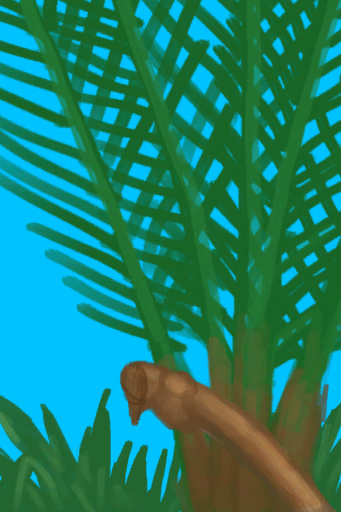
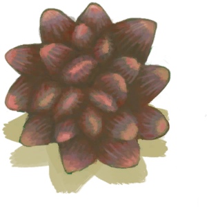

# Nipa Palm  
> I could get nipa fruits from it and make sugar or wine with its sap.  
  
<table class="table table-bordered" data-toggle="table"  data-show-header="false"><thead style="display:none"><tr ><th  style="width:50%;text-align:left;vertical-align:top;"  data-sortable="true"  >title</th><th  style="width:50%;text-align:left;vertical-align:top;"  ></th></tr></thead><tr ><td  style="width:50%;text-align:left;vertical-align:top;"  ></td><td  style="width:50%;text-align:left;vertical-align:top;"  >

<a href="NipaPalm.md" style="color:black">Nipa Palm</a>

"This useful plant can be found in the <b>Mangroves</b> to the south of the island. Its fruits can be eaten and its sap can be used to make <b>Palm Wine and Sugar</b>.  To gather its sap just cut the fruit from the palm with a <b>Cutting Tool or Axe</b> and place any <b>Container</b> inside its inventory.  Once you are ready to collect it</td></tr></tbody></table>  
  
## Got From  

Transform

[Nipa Palm Crop Plot](CropPlotNipaPalm.md)

Explore

[Mangrove Forest](Mangroves.md)

  
  
## Drag With  

<table style="margin-bottom:0px;"><tr><td style="width:40%;text-align:left; background-color:#FEFEFE"><b>With：</b>[“Cutter”](tag_Cutter.md) | [“Axe”](tag_Axe.md)</td><td style="width:40%;font-size:1em;font-weight:bold;background-color:#FEFEFE">Cut Nipa Fruit (15m) </td></tr><tr style="background-color:#FFFFFF"><td style=""><b>Receiving：</b></td><td style=""><b>Self：</b>→ [

[Nipa Palm](NipaSapStation.md)](NipaSapStation.md)</td></tr><tr><td colspan="2"><b>StatChange：</b>[

[Herbology(Skill)](Skill_Herbology.md)](Skill_Herbology.md)<b>+0.5</b></td></tr><tr><td colspan="2">[

[Nipa Fruit](NipaFruit.md)](NipaFruit.md)(<b>+1</b>)</td></tr></table>
  
  

