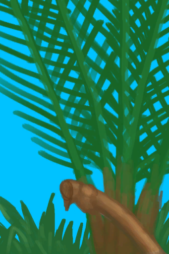

# Nipa Palm  
> I can place a container here it to fill it with sap.  
  
<table class="table table-bordered" data-toggle="table"  data-show-header="false"><thead style="display:none"><tr ><th  style="width:50%;text-align:left;vertical-align:top;"  >title</th><th  style="width:50%;text-align:left;vertical-align:top;"  ></th></tr></thead><tr ><td  style="width:50%;text-align:left;vertical-align:top;"  >**Slots：**1  **过滤器：**[“Water Container”](tag_WaterContainer.md)</td><td  style="width:50%;text-align:left;vertical-align:top;"  >

<a href="NipaSapStation.md" style="color:black">Nipa Palm</a>

"This useful plant can be found in the <b>Mangroves</b> to the south of the island. Its fruits can be eaten and its sap can be used to make <b>Palm Wine and Sugar</b>.  To gather its sap just cut the fruit from the palm with a <b>Cutting Tool or Axe</b> and place any <b>Container</b> inside its inventory.  Once you are ready to collect it</td></tr></tbody></table>  
  
## Got From  

** With：**[“Cutter”](tag_Cutter.md) , [“Axe”](tag_Axe.md)Cut Nipa Fruit

[Nipa Palm](NipaPalm.md)

  
  
## Transform  

<table style="margin-bottom:0px;"><tr><td  colspan=2 style="font-size:1em;font-weight:bold;background-color:#FEFEFE">Maintain</td><td style="text-align:right; background-color:#FEFEFE"></td></tr><tr style="background-color:#FFFFFF"><td style="width:30%;font-size:1em;text-align:right;vertical-align:middle;">[

[Sap](LQ_Sap.md)](LQ_Sap.md) [

[Palm Wine](LQ_PalmWine.md)](LQ_PalmWine.md)</td><td style="text-align:center;width:20%;vertical-align:middle;">
15m

Maintain
</td><td style="text-align:left;vertical-align:middle;">Spoilage  <b>+2</b></td></tr></table>
  

<table style="margin-bottom:0px;"><tr><td  colspan=2 style="font-size:1em;font-weight:bold;background-color:#FEFEFE">Sap</td><td style="text-align:right; background-color:#FEFEFE"></td></tr><tr style="background-color:#FFFFFF"><td style="width:30%;font-size:1em;text-align:right;vertical-align:middle;">[“Water Container”](tag_WaterContainer.md)</td><td style="text-align:center;width:20%;vertical-align:middle;">
15m

Sap
</td><td style="text-align:left;vertical-align:middle;"></td></tr><tr><td colspan="3">[Sap](LQ_Sap.md)(<b>+9.5</b>)</td></tr></table>
  
## Durability   

<table style="margin-bottom:0px;"><tr><td style="width:30%;text-align:left; background-color:#FEFEFE;font-size:1.3em;font-weight:bold;">Spoilage</td><td style="font-size:1em;background-color:#FEFEFE">Starting：288 , Max：288 -1/TP , Duration ：3d</td></tr><tr style="background-color:#FFFFFF"><td colspan=2>** On Zero： ** Self: →Dismiss [

[Palm Fronds](PalmFronds.md)](PalmFronds.md)(<b>+8～+16</b>)</td></tr></table>
  

