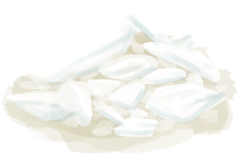

# Niter Bed  
> Should keep adding lye to it until it's ready.  
  
<table class="table table-bordered" data-toggle="table"  data-show-header="false"><thead style="display:none"><tr ><th  style="width:50%;text-align:left;vertical-align:top;"  >title</th><th  style="width:50%;text-align:left;vertical-align:top;"  ></th></tr></thead><tr ><td  style="width:50%;text-align:left;vertical-align:top;"  >** DoseNotPile **  ** Effect: ** [

[Discomfort](Discomfort.md)](Discomfort.md)<b>+750</b></td><td  style="width:50%;text-align:left;vertical-align:top;"  >

<a href="NiterBed.md" style="color:black">Niter Bed</a>

"Made by piling Manure on a layer of Clay to prevent seepage and adding Lye.  A niter bed has to be regularly watered with <b>Lye</b> and will eventually produce <b>Niter Crystals</b></td></tr></tbody></table>  
  
## Got From  

Craft BluePrint

[Niter Bed(BluePrint)](Bp_NiterBed.md)

  
  
## Drag With  

<table style="margin-bottom:0px;"><tr><td style="width:40%;text-align:left; background-color:#FEFEFE"><b>With：</b>[

[Lye](LQ_Lye.md)](LQ_Lye.md)</td><td style="width:40%;font-size:1em;font-weight:bold;background-color:#FEFEFE">Pour Lye  </td></tr><tr style="background-color:#FFFFFF"><td style=""><b>Receiving：</b></td><td style=""><b>Self：</b>

  <b>+480(100%)</b></td></tr></table>
  
  
## Durability   

<table style="margin-bottom:0px;"><tr><td style="width:30%;text-align:left; background-color:#FEFEFE;font-size:1.3em;font-weight:bold;">

</td><td style="font-size:1em;background-color:#FEFEFE">Starting：480 , Max：480 -1/TP , Duration ：5d</td></tr><tr style="background-color:#FFFFFF"><td colspan=2></td></tr></table>
  

<table style="margin-bottom:0px;"><tr><td style="width:30%;text-align:left; background-color:#FEFEFE;font-size:1.3em;font-weight:bold;">Progress</td><td style="font-size:1em;background-color:#FEFEFE">Starting：0 , Max：1440 -</td></tr><tr style="background-color:#FFFFFF"><td colspan=2>** On Full： ** Self: → [

[Cesspool](Cesspool.md)](Cesspool.md) [

[Niter Crystals](NiterCrystals.md)](NiterCrystals.md)(<b>+3</b>)</td></tr></table>
  
## Passive Effects  
<table class="table table-bordered" data-toggle="table"  ><thead style=""><tr ><th  style="text-align:left;vertical-align:top;"  >Name</th><th  style="text-align:left;vertical-align:top;"  >Condition</th><th  style="text-align:left;vertical-align:top;"  >Change(Each TP)</th><th  style="text-align:left;vertical-align:top;"  data-sortable="true"  >Status</th></tr></thead><tr ><td  style="text-align:left;vertical-align:top;"  >Lye</td><td  style="text-align:left;vertical-align:top;"  >** Require Durability：** 

: <b>1～480(0.21%～100%)</b></td><td  style="text-align:left;vertical-align:top;"  >Progress+1(0.06%)</td><td  style="text-align:left;vertical-align:top;"  ></td></tr></tbody></table>  
  

