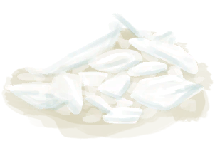

# Niter Crystals  
> Could grind  them to get saltpeter.  
  
<table class="table table-bordered" data-toggle="table"  data-show-header="false"><thead style="display:none"><tr ><th  style="width:50%;text-align:left;vertical-align:top;"  >title</th><th  style="width:50%;text-align:left;vertical-align:top;"  ></th></tr></thead><tr ><td  style="width:50%;text-align:left;vertical-align:top;"  >**Environment：**[Bat Cave(Environment)](Env_CaveBats.md)  **Weight：**50</td><td  style="width:50%;text-align:left;vertical-align:top;"  >

<a href="NiterCrystals.md" style="color:black">Niter Crystals</a>

"Created by grinding the <b>Niter Crystals</b> produced by a <b>Niter Bed</b>.  This chemical is not only useful as fertilizer</td></tr></tbody></table>  
  
## Got From  

Transform

[Niter Bed](NiterBed.md)

  
  
## Drag With  

<table style="margin-bottom:0px;"><tr><td style="width:40%;text-align:left; background-color:#FEFEFE"><b>With：</b>[“Hammer”](tag_Hammer.md)</td><td style="width:40%;font-size:1em;font-weight:bold;background-color:#FEFEFE">Ground (1h) [“HandAction(Group)”](HandAction.md), [“CraftAction(Group)”](CraftAction.md)</td></tr><tr style="background-color:#FFFFFF"><td style=""><b>Receiving：</b></td><td style=""><b>Self：</b>→Dismiss</td></tr><tr><td colspan="2">[

[Saltpeter](Saltpeter.md)](Saltpeter.md)(<b>+3</b>)</td></tr></table>
  
  

