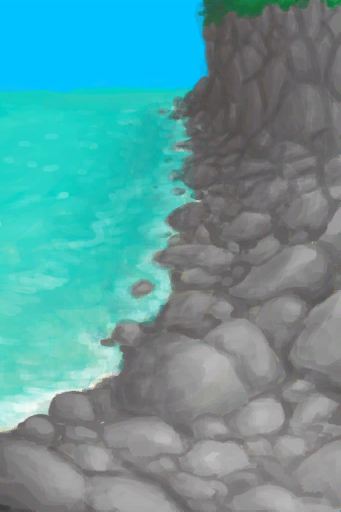
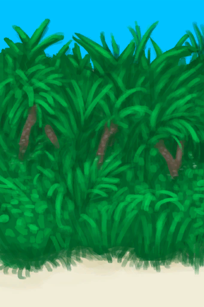
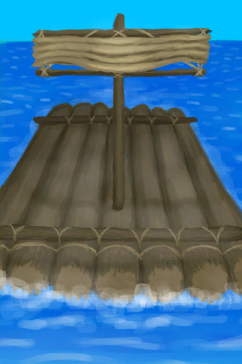

## Normal Guy  

<table style="margin-bottom:0px;"><tr><td rowspan=2 style="width:160px"></td><td style="font-size:1.8em"><b>Normal Guy</b></td><td style="width:50%">UnlockPrice：Free</td></tr><tr><td  colspan=2 style=""><i>"A completely ordinary and very average human. Nothing special</i></td><tr><td colspan=2><b>Environment：</b>[

[Beach](Beach.md)](Beach.md)<td colspan=1><b>Weather：</b>[

[Clear](TropicalIsland_ClearStart.md)](TropicalIsland_ClearStart.md)</tr></tr><tr><td colspan=3><b>Perks：</b>

  
  
</tr><tr><td colspan=3><b>Clothes：</b> 

<a href="T-Shirt.md" style="color:black">T-Shirt</a>

<a href="Socks.md" style="color:black">Socks</a>

<a href="Underwear.md" style="color:black">Underwear</a>

<a href="Shorts.md" style="color:black">Shorts</a>

  
  
</tr><tr><td colspan=3><b>Starting Cards：</b> 

  
  
</tr><tr><td colspan=3><b>初始蓝图：</b> 

  
  
</tr></table>
    
  
## 目标  

<b>PREPARATIONS</b>

<table style="margin-bottom:0px;"><tr><td rowSpan=3 style="width:50px;max-height:100px;text-align:center;vertical-align:top"></td><td colspan=2 >
<b>"Discover the island</b>
<i>Completing these <b>Optional</b> objectives raises your <b>Determination</b>.</i></td></tr><tr style=""></tr><tr style=""><td ><b>Reward：</b>[

[Stress](Stress.md)](Stress.md)<b>-48</b>&nbsp;&nbsp;&nbsp;&nbsp;[

[Determination](Determination.md)](Determination.md)<b>+100</b></td></tr><tr style="border-bottom:2px solid #CCC;height:1px;"></tr><tr><td rowSpan=3 style="width:50px;max-height:100px;text-align:center;vertical-align:top"></td><td colspan=2 >
<b>Exploration</b>
</td></tr><tr style=""><td>
<table style="margin-bottom:0px;"><tr><td rowSpan=3 style="width:50px;max-height:100px;text-align:center;vertical-align:top"></td><td colspan=2 >
<b>Explore the Island</b>
</td></tr><tr style=""></tr><tr style=""><td ><b>Reward：</b>[

[Stress](Stress.md)](Stress.md)<b>-48</b></td></tr><tr style="border-bottom:2px solid #CCC;height:1px;"></tr><tr><td rowSpan=3 style="width:50px;max-height:100px;text-align:center;vertical-align:top"></td><td colspan=2 >
<b>Beach</b>
</td></tr><tr style=""><td><b>Require：</b>[

[Area Explored(Event)(Beach)](Event_BeachExplored.md)](Event_BeachExplored.md)x1 </td></tr><tr style=""><td ><b>Reward：</b>[

[Stress](Stress.md)](Stress.md)<b>-48</b>&nbsp;&nbsp;&nbsp;&nbsp;[

[Determination](Determination.md)](Determination.md)<b>+100</b></td></tr><tr style="border-bottom:2px solid #CCC;height:1px;"></tr><tr><td rowSpan=3 style="width:50px;max-height:100px;text-align:center;vertical-align:top"></td><td colspan=2 >
<b>Rocks</b>
</td></tr><tr style=""><td><b>Require：</b>[

[Area Explored(Event)](Event_RocksExplored.md)](Event_RocksExplored.md)x1 </td></tr><tr style=""><td ><b>Reward：</b>[

[Stress](Stress.md)](Stress.md)<b>-48</b>&nbsp;&nbsp;&nbsp;&nbsp;[

[Determination](Determination.md)](Determination.md)<b>+100</b></td></tr><tr style="border-bottom:2px solid #CCC;height:1px;"></tr><tr><td rowSpan=3 style="width:50px;max-height:100px;text-align:center;vertical-align:top"></td><td colspan=2 >
<b>Outskirts</b>
</td></tr><tr style=""><td><b>Require：</b>[

[Area Explored(Event)](Event_OutskirtsExplored.md)](Event_OutskirtsExplored.md)x1 </td></tr><tr style=""><td ><b>Reward：</b>[

[Stress](Stress.md)](Stress.md)<b>-48</b>&nbsp;&nbsp;&nbsp;&nbsp;[

[Determination](Determination.md)](Determination.md)<b>+100</b></td></tr><tr style="border-bottom:2px solid #CCC;height:1px;"></tr><tr><td rowSpan=3 style="width:50px;max-height:100px;text-align:center;vertical-align:top"></td><td colspan=2 >
<b>Bay</b>
</td></tr><tr style=""><td><b>Require：</b>[

[Area Explored(Event)(Bay)](Event_BayExplored.md)](Event_BayExplored.md)x1 </td></tr><tr style=""><td ><b>Reward：</b>[

[Stress](Stress.md)](Stress.md)<b>-48</b>&nbsp;&nbsp;&nbsp;&nbsp;[

[Determination](Determination.md)](Determination.md)<b>+100</b></td></tr><tr style="border-bottom:2px solid #CCC;height:1px;"></tr><tr><td rowSpan=3 style="width:50px;max-height:100px;text-align:center;vertical-align:top"></td><td colspan=2 >
<b>Jungle</b>
</td></tr><tr style=""><td><b>Require：</b>[

[Area Explored(Event)](Event_JungleExplored.md)](Event_JungleExplored.md)x1 </td></tr><tr style=""><td ><b>Reward：</b>[

[Stress](Stress.md)](Stress.md)<b>-48</b>&nbsp;&nbsp;&nbsp;&nbsp;[

[Determination](Determination.md)](Determination.md)<b>+100</b></td></tr><tr style="border-bottom:2px solid #CCC;height:1px;"></tr><tr><td rowSpan=3 style="width:50px;max-height:100px;text-align:center;vertical-align:top"></td><td colspan=2 >
<b>Wetlands</b>
</td></tr><tr style=""><td><b>Require：</b>[

[Area Explored(Event)(Wetlands)](Event_WetlandsExplored.md)](Event_WetlandsExplored.md)x1 </td></tr><tr style=""><td ><b>Reward：</b>[

[Stress](Stress.md)](Stress.md)<b>-48</b>&nbsp;&nbsp;&nbsp;&nbsp;[

[Determination](Determination.md)](Determination.md)<b>+100</b></td></tr><tr style="border-bottom:2px solid #CCC;height:1px;"></tr><tr><td rowSpan=3 style="width:50px;max-height:100px;text-align:center;vertical-align:top"></td><td colspan=2 >
<b>Mangroves</b>
</td></tr><tr style=""><td><b>Require：</b>[

[Area Explored(Event)(Mangrove Forest)](Event_MangrovesExplored.md)](Event_MangrovesExplored.md)x1 </td></tr><tr style=""><td ><b>Reward：</b>[

[Stress](Stress.md)](Stress.md)<b>-48</b>&nbsp;&nbsp;&nbsp;&nbsp;[

[Determination](Determination.md)](Determination.md)<b>+100</b></td></tr><tr style="border-bottom:2px solid #CCC;height:1px;"></tr><tr><td rowSpan=3 style="width:50px;max-height:100px;text-align:center;vertical-align:top"></td><td colspan=2 >
<b>Western Grasslands</b>
</td></tr><tr style=""><td><b>Require：</b>[

[Area Explored(Event)(Western Grasslands)](Event_GrasslandsWExplored.md)](Event_GrasslandsWExplored.md)x1 </td></tr><tr style=""><td ><b>Reward：</b>[

[Stress](Stress.md)](Stress.md)<b>-48</b>&nbsp;&nbsp;&nbsp;&nbsp;[

[Determination](Determination.md)](Determination.md)<b>+100</b></td></tr><tr style="border-bottom:2px solid #CCC;height:1px;"></tr><tr><td rowSpan=3 style="width:50px;max-height:100px;text-align:center;vertical-align:top"></td><td colspan=2 >
<b>Western Highlands</b>
</td></tr><tr style=""><td><b>Require：</b>[

[Area Explored(Event)(Western Highlands)](Event_HighlandsWExplored.md)](Event_HighlandsWExplored.md)x1 </td></tr><tr style=""><td ><b>Reward：</b>[

[Stress](Stress.md)](Stress.md)<b>-48</b>&nbsp;&nbsp;&nbsp;&nbsp;[

[Determination](Determination.md)](Determination.md)<b>+100</b></td></tr><tr style="border-bottom:2px solid #CCC;height:1px;"></tr></table>
  </td></tr><tr style=""><td ><b>Reward：</b>[

[Stress](Stress.md)](Stress.md)<b>-48</b></td></tr><tr style="border-bottom:2px solid #CCC;height:1px;"></tr><tr><td rowSpan=3 style="width:50px;max-height:100px;text-align:center;vertical-align:top"></td><td colspan=2 >
<b>Skills</b>
</td></tr><tr style=""><td>
<table style="margin-bottom:0px;"><tr><td rowSpan=3 style="width:50px;max-height:100px;text-align:center;vertical-align:top"></td><td colspan=2 >
<b>Master your skills</b>
<i>So you can secure your survival.</i></td></tr><tr style=""></tr><tr style=""><td ><b>Reward：</b>[

[Stress](Stress.md)](Stress.md)<b>-48</b>&nbsp;&nbsp;&nbsp;&nbsp;[

[Determination](Determination.md)](Determination.md)<b>+100</b></td></tr><tr style="border-bottom:2px solid #CCC;height:1px;"></tr><tr><td rowSpan=3 style="width:50px;max-height:100px;text-align:center;vertical-align:top"></td><td colspan=2 >
<b>Hunting</b>
</td></tr><tr style=""></tr><tr style=""><td ><b>Reward：</b>[

[Stress](Stress.md)](Stress.md)<b>-48</b></td></tr><tr style="border-bottom:2px solid #CCC;height:1px;"></tr><tr><td rowSpan=3 style="width:50px;max-height:100px;text-align:center;vertical-align:top"></td><td colspan=2 >
<b>Fishing</b>
</td></tr><tr style=""></tr><tr style=""><td ><b>Reward：</b>[

[Stress](Stress.md)](Stress.md)<b>-48</b></td></tr><tr style="border-bottom:2px solid #CCC;height:1px;"></tr><tr><td rowSpan=3 style="width:50px;max-height:100px;text-align:center;vertical-align:top"></td><td colspan=2 >
<b>Cooking</b>
</td></tr><tr style=""><td><b>Require：</b>[

[Cooking(Skill)](Skill_Cooking.md)](Skill_Cooking.md): <b>150</b> </td></tr><tr style=""><td ><b>Reward：</b>[

[Stress](Stress.md)](Stress.md)<b>-48</b>&nbsp;&nbsp;&nbsp;&nbsp;[

[Determination](Determination.md)](Determination.md)<b>+250</b></td></tr><tr style="border-bottom:2px solid #CCC;height:1px;"></tr><tr><td rowSpan=3 style="width:50px;max-height:100px;text-align:center;vertical-align:top"></td><td colspan=2 >
<b>Crafting</b>
</td></tr><tr style=""><td><b>Require：</b>[

[Crafting(Skill)](Skill_Crafting.md)](Skill_Crafting.md): <b>150</b> </td></tr><tr style=""><td ><b>Reward：</b>[

[Stress](Stress.md)](Stress.md)<b>-48</b>&nbsp;&nbsp;&nbsp;&nbsp;[

[Determination](Determination.md)](Determination.md)<b>+250</b></td></tr><tr style="border-bottom:2px solid #CCC;height:1px;"></tr><tr><td rowSpan=3 style="width:50px;max-height:100px;text-align:center;vertical-align:top"></td><td colspan=2 >
<b>Tailoring</b>
</td></tr><tr style=""><td><b>Require：</b>[

[Tailoring(Skill)](Skill_Tailoring.md)](Skill_Tailoring.md): <b>150</b> </td></tr><tr style=""><td ><b>Reward：</b>[

[Stress](Stress.md)](Stress.md)<b>-48</b>&nbsp;&nbsp;&nbsp;&nbsp;[

[Determination](Determination.md)](Determination.md)<b>+250</b></td></tr><tr style="border-bottom:2px solid #CCC;height:1px;"></tr><tr><td rowSpan=3 style="width:50px;max-height:100px;text-align:center;vertical-align:top"></td><td colspan=2 >
<b>Woodworking</b>
</td></tr><tr style=""><td><b>Require：</b>[

[Woodworking(Skill)](Skill_Woodworking.md)](Skill_Woodworking.md): <b>150</b> </td></tr><tr style=""><td ><b>Reward：</b>[

[Stress](Stress.md)](Stress.md)<b>-48</b>&nbsp;&nbsp;&nbsp;&nbsp;[

[Determination](Determination.md)](Determination.md)<b>+250</b></td></tr><tr style="border-bottom:2px solid #CCC;height:1px;"></tr><tr><td rowSpan=3 style="width:50px;max-height:100px;text-align:center;vertical-align:top"></td><td colspan=2 >
<b>Herbology</b>
</td></tr><tr style=""><td><b>Require：</b>[

[Herbology(Skill)](Skill_Herbology.md)](Skill_Herbology.md): <b>150</b> </td></tr><tr style=""><td ><b>Reward：</b>[

[Stress](Stress.md)](Stress.md)<b>-48</b>&nbsp;&nbsp;&nbsp;&nbsp;[

[Determination](Determination.md)](Determination.md)<b>+250</b></td></tr><tr style="border-bottom:2px solid #CCC;height:1px;"></tr><tr><td rowSpan=3 style="width:50px;max-height:100px;text-align:center;vertical-align:top"></td><td colspan=2 >
<b>Climbing</b>
</td></tr><tr style=""><td><b>Require：</b>[

[Climbing(Skill)](Skill_Climbing.md)](Skill_Climbing.md): <b>150</b> </td></tr><tr style=""><td ><b>Reward：</b>[

[Stress](Stress.md)](Stress.md)<b>-48</b>&nbsp;&nbsp;&nbsp;&nbsp;[

[Determination](Determination.md)](Determination.md)<b>+250</b></td></tr><tr style="border-bottom:2px solid #CCC;height:1px;"></tr><tr><td rowSpan=3 style="width:50px;max-height:100px;text-align:center;vertical-align:top"></td><td colspan=2 >
<b>Swimming</b>
</td></tr><tr style=""><td><b>Require：</b>[

[Swimming(Skill)](Skill_Swimming.md)](Skill_Swimming.md): <b>150</b> </td></tr><tr style=""><td ><b>Reward：</b>[

[Stress](Stress.md)](Stress.md)<b>-48</b>&nbsp;&nbsp;&nbsp;&nbsp;[

[Determination](Determination.md)](Determination.md)<b>+250</b></td></tr><tr style="border-bottom:2px solid #CCC;height:1px;"></tr></table>
  </td></tr><tr style=""><td ><b>Reward：</b>[

[Stress](Stress.md)](Stress.md)<b>-48</b>&nbsp;&nbsp;&nbsp;&nbsp;[

[Determination](Determination.md)](Determination.md)<b>+100</b></td></tr><tr style="border-bottom:2px solid #CCC;height:1px;"></tr></table>
 
<b>FACING DESTINY</b>

<table style="margin-bottom:0px;"><tr><td rowSpan=3 style="width:50px;max-height:100px;text-align:center;vertical-align:top"></td><td colspan=2 >
<b>Summon the Determination to choose your Path</b>
<i>Determination increases over <b>Time</b> and when completing <b>Objectives</b>.</i></td></tr><tr style=""><td><b>Require：</b>[

[Determination](Determination.md)](Determination.md): <b>4000</b> </td></tr><tr style="border-bottom:2px solid #CCC;height:1px;"></tr><tr><td rowSpan=3 style="width:50px;max-height:100px;text-align:center;vertical-align:top"></td><td colspan=2 >
<b>Escape from the Island</b>
</td></tr><tr style=""><td>
<table style="margin-bottom:0px;"><tr><td rowSpan=3 style="width:50px;max-height:100px;text-align:center;vertical-align:top"></td><td colspan=2 >
<b>Build a Raft</b>
<i>To escape the island and get back to civilization.</i></td></tr><tr style=""><td><b>Require：</b>[

[Raft](RaftEntrance.md)](RaftEntrance.md)x1 </td></tr><tr style="border-bottom:2px solid #CCC;height:1px;"></tr><tr><td rowSpan=3 style="width:50px;max-height:100px;text-align:center;vertical-align:top"></td><td colspan=2 >
<b>Return to Civilization</b>
<i>To finish this adventure.</i></td></tr><tr style=""><td><b>Require：</b>[

[Distance](Distance.md)](Distance.md): <b>2016</b> </td></tr><tr style="border-bottom:2px solid #CCC;height:1px;"></tr></table>
  </td></tr><tr style="border-bottom:2px solid #CCC;height:1px;"></tr><tr><td rowSpan=3 style="width:50px;max-height:100px;text-align:center;vertical-align:top"></td><td colspan=2 >
<b>Make the Island your Home</b>
</td></tr><tr style=""><td>
<table style="margin-bottom:0px;"><tr><td rowSpan=3 style="width:50px;max-height:100px;text-align:center;vertical-align:top"></td><td colspan=2 >
<b>Survive in the Island for 120 days</b>
<i>to become familiar with it.</i></td></tr><tr style=""><td><b>Require：</b>[Counter](Counter.md): <b>11520～999999</b> </td></tr><tr style="border-bottom:2px solid #CCC;height:1px;"></tr><tr><td rowSpan=3 style="width:50px;max-height:100px;text-align:center;vertical-align:top"></td><td colspan=2 >
<b>Reach Maximum Comfort</b>
<i>To turn your house into your home.</i></td></tr><tr style=""><td><b>Require：</b>[

[Comfort](Comfort.md)](Comfort.md): <b>1751～2500</b> </td></tr><tr style="border-bottom:2px solid #CCC;height:1px;"></tr></table>
  </td></tr><tr style="border-bottom:2px solid #CCC;height:1px;"></tr></table>
   

