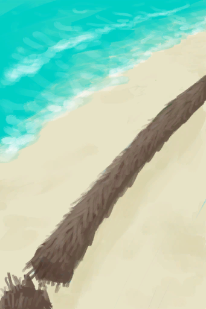

# Cleared Palm Tree  
> This palm tree no longer has any coconuts. They'll grow back eventually.  
  
<table class="table table-bordered" data-toggle="table"  data-show-header="false"><thead style="display:none"><tr ><th  style="width:50%;text-align:left;vertical-align:top;"  data-sortable="true"  >title</th><th  style="width:50%;text-align:left;vertical-align:top;"  ></th></tr></thead><tr ><td  style="width:50%;text-align:left;vertical-align:top;"  ></td><td  style="width:50%;text-align:left;vertical-align:top;"  >

<a href="PalmTreeCleared.md" style="color:black">Cleared Palm Tree</a>

</td></tr></tbody></table>  
  
## Got From  

Cleared

[Palm Tree](PalmTreeNew.md)

Transform

[Palm Tree](PalmTreeNew.md)

Cleared

[Palm Tree](PalmTreeNewMultiEventOld.md)

Transform

[Palm Tree](PalmTreeNewMultiEventOld.md)

Cleared

[Palm Tree](PalmTreeOld.md)(未实装)

Cleared

[Palm Tree](PalmTree_IH.md)(未实装)

Transform

[Palm Tree](PalmTree_Unique.md)(未实装)

  
  
## Action  

<table><tr><td rowspan="2" style="width:200px;text-align:center;font-size:1.3em;font-weight:bold">

Train Climbing

30m

</td><td>[“ClimbAction(Group)”](ClimbAction.md)</td></tr><tr><td></td></tr><tr><td colspan="2"><b>Require：</b>[

[Light](Light.md)](Light.md): <b>10-100</b>, [

[Stamina](Stamina.md)](Stamina.md): <b>11-32</b>, [Climb Modifier](ModifierClimb.md): <b>0-2</b></td></tr><tr><td colspan="2"><b>StatChange：</b>[

[Stamina](Stamina.md)](Stamina.md)<b>-6</b>, [

[Foot Damage](FootDamage.md)](FootDamage.md)<b>+8</b>, [

[Filth](Filth.md)](Filth.md)<b>+6</b>, [

[Climbing(Skill)](Skill_Climbing.md)](Skill_Climbing.md)<b>+1</b></td></tr><tr><td colspan="2">

<table style="margin-bottom:3px;"><tr><td rowspan=2 style="text-align:center" width="80px">
Base Weight

1
</td><td style="font-size:0.6em;line-height:0.6em;font-weight:bold">Fall - Abrasion</td></tr><tr><td>[

[Fall!(Event)](Event_FallAbrasion.md)](Event_FallAbrasion.md)(<b>+1</b>)</td></tr></table>

<table style="margin-bottom:3px;"><tr><td rowspan=2 style="text-align:center" width="80px">
Base Weight

1
</td><td style="font-size:0.6em;line-height:0.6em;font-weight:bold">Fall - Bruises</td></tr><tr><td>[

[Fall!(Event)](Event_FallBruise.md)](Event_FallBruise.md)(<b>+1</b>)</td></tr></table>

<table style="margin-bottom:3px;"><tr><td rowspan=2 style="text-align:center" width="80px">
Base Weight

8
</td><td style="font-size:0.6em;line-height:0.6em;font-weight:bold">Success</td></tr><tr><td></td></tr><tr><td colspan=2><li>[

[Climbing(Skill)](Skill_Climbing.md)](Skill_Climbing.md) in <b>0～150</b>, weight<b>+0～+150</b></li><li>[

[Rain Value](RainValue.md)](RainValue.md) in <b>1～5</b>, weight<b>-4～-25</b></li><li>[

[Rope](Rope.md)](Rope.md) On *Hand*，Weight<b>+6</b>,</li></td></tr></table>
<button class="btn btn-secondary btn-sm" style="" data-toggle="modal" onclick="setCollectionDataBase64('eyJ0aXRsZSI6IlNpbXVsYXRvcjogVHJhaW4gQ2xpbWJpbmcgKENsZWFyZWQgUGFsbSBUcmVlKSIsImNvbGxlY3Rpb25zIjpbeyJkcm9wIjoiPGRpdiBzdHlsZT1cIndpZHRoOjI1cHg7ZGlzcGxheTppbmxpbmUtYmxvY2s7dGV4dC1hbGlnbjpjZW50ZXJcIj48aW1nIGRlY29kaW5nPVwiYXN5bmNcIiBzcmM9XCJTcHJpdGUvV2VhdGhlclBhcnRpYWxseUNsb3VkeV9GdWxsLnBuZ1wiIGhyZWY9XCJhLm1kXCIgc3R5bGU9XCJtYXgtd2lkdGg6MjVweDttYXgtaGVpZ2h0OjI1cHg7XCI+PC9kaXY+RmFsbCEoRXZlbnQpIiwiYmFzZSI6MSwiY29uZGl0aW9uIjpbXX0seyJkcm9wIjoiPGRpdiBzdHlsZT1cIndpZHRoOjI1cHg7ZGlzcGxheTppbmxpbmUtYmxvY2s7dGV4dC1hbGlnbjpjZW50ZXJcIj48aW1nIGRlY29kaW5nPVwiYXN5bmNcIiBzcmM9XCJTcHJpdGUvV2VhdGhlclBhcnRpYWxseUNsb3VkeV9GdWxsLnBuZ1wiIGhyZWY9XCJhLm1kXCIgc3R5bGU9XCJtYXgtd2lkdGg6MjVweDttYXgtaGVpZ2h0OjI1cHg7XCI+PC9kaXY+RmFsbCEoRXZlbnQpIiwiYmFzZSI6MSwiY29uZGl0aW9uIjpbXX0seyJkcm9wIjoiLSIsImJhc2UiOjgsImNvbmRpdGlvbiI6W3sia2V5IjoiU2tpbGxfQ2xpbWJpbmciLCJ0aXRsZSI6IkNsaW1iaW5nKFNraWxsKSIsInR5cGUiOiJyYW5nZSIsIm1heCI6WzAsMTUwXSwicmFuZ2UiOlswLDE1MF0sIndlaWdodCI6WzAsMTUwXSwiZGVmYXVsdFZhbHVlIjowLCJ3aGVuT3V0T2ZSYW5nZSI6MH0seyJrZXkiOiJSYWluVmFsdWUiLCJ0aXRsZSI6IlJhaW4gVmFsdWUiLCJ0eXBlIjoicmFuZ2UiLCJtYXgiOlswLDVdLCJyYW5nZSI6WzEsNV0sIndlaWdodCI6Wy00LC0yNV0sImRlZmF1bHRWYWx1ZSI6MCwid2hlbk91dE9mUmFuZ2UiOjB9LHsia2V5IjoiUm9wZSIsInRpdGxlIjoiPGRpdiBzdHlsZT1cIndpZHRoOjIwcHg7ZGlzcGxheTppbmxpbmUtYmxvY2s7dGV4dC1hbGlnbjpjZW50ZXJcIj48aW1nIGRlY29kaW5nPVwiYXN5bmNcIiBzcmM9XCJTcHJpdGUvUm9wZS5wbmdcIiBocmVmPVwiYS5tZFwiIHN0eWxlPVwibWF4LXdpZHRoOjIwcHg7bWF4LWhlaWdodDoyMHB4O1wiPjwvZGl2PlJvcGUgT24gKkhhbmQq77yMIiwidHlwZSI6InRvZ2dsZSIsInJhbmdlIjpbMCwxXSwibWF4IjpbMCwxXSwid2VpZ2h0IjpbMCw2XSwiZGVmYXVsdFZhbHVlIjowLCJ3aGVuT3V0T2ZSYW5nZSI6MCwibWF4U3RhY2tHcm91cCI6IiJ9XX1dfQ==')" data-target="#modelCollectionSimulator">Simulator</button>
</td></tr></table>
  
  
  
## Drag With  

<table style="margin-bottom:0px;"><tr><td style="width:40%;text-align:left; background-color:#FEFEFE"><b>With：</b>[

[Stone Axe](StoneAxe.md)](StoneAxe.md)</td><td style="width:40%;font-size:1em;font-weight:bold;background-color:#FEFEFE">Cut Down (30m) [“HandAction(Group)”](HandAction.md)</td></tr><tr><td colspan="2"><b>Require：</b>[

[Light](Light.md)](Light.md): <b>10-100</b>, [

[Stamina](Stamina.md)](Stamina.md): <b>11-32</b>, [On Not Axe Adv](OnNotAxeAdv.md): <b>0-0</b></td></tr><tr style="background-color:#FFFFFF"><td style=""><b>Receiving：</b>Usage  <b>-3(-15%)</b></td><td style=""><b>Self：</b>Coconut Growth

  <b>-750(-26.04%)</b>, Cutting Pogress  <b>-10(-20%)</b></td></tr><tr><td colspan="2"><b>StatChange：</b>[

[Stamina](Stamina.md)](Stamina.md)<b>-8</b>, [

[Hand Damage](HandDamage.md)](HandDamage.md)<b>+80</b>, [

[Woodworking(Skill)](Skill_Woodworking.md)](Skill_Woodworking.md)<b>+0.5</b></td></tr></table>
  

<table style="margin-bottom:0px;"><tr><td style="width:40%;text-align:left; background-color:#FEFEFE"><b>With：</b>[“Hammer”](tag_AxeAdv.md)</td><td style="width:40%;font-size:1em;font-weight:bold;background-color:#FEFEFE">Cut Down (30m) [“HandAction(Group)”](HandAction.md)</td></tr><tr><td colspan="2"><b>Require：</b>[

[Light](Light.md)](Light.md): <b>10-100</b>, [

[Stamina](Stamina.md)](Stamina.md): <b>11-32</b></td></tr><tr style="background-color:#FFFFFF"><td style=""><b>Receiving：</b>Usage  <b>-1(-2%)</b></td><td style=""><b>Self：</b>Coconut Growth

  <b>-1500(-52.08%)</b>, Cutting Pogress  <b>-25(-50%)</b></td></tr><tr><td colspan="2"><b>StatChange：</b>[

[Stamina](Stamina.md)](Stamina.md)<b>-6</b>, [

[Hand Damage](HandDamage.md)](HandDamage.md)<b>+60</b>, [

[Woodworking(Skill)](Skill_Woodworking.md)](Skill_Woodworking.md)<b>+0.5</b></td></tr></table>
  
  
## Durability   

<table style="margin-bottom:0px;"><tr><td style="width:30%;text-align:left; background-color:#FEFEFE;font-size:1.3em;font-weight:bold;">

Coconut Growth</td><td style="font-size:1em;background-color:#FEFEFE">Starting：0 , Max：2880 +1/TP , Duration ：30d</td></tr><tr style="background-color:#FFFFFF"><td colspan=2>** On Full： ** Self: → [

[Palm Tree](PalmTreeNew.md)](PalmTreeNew.md)</td></tr></table>
  

<table style="margin-bottom:0px;"><tr><td style="width:30%;text-align:left; background-color:#FEFEFE;font-size:1.3em;font-weight:bold;">Cutting Pogress</td><td style="font-size:1em;background-color:#FEFEFE">Starting：50 , Max：50 -</td></tr><tr style="background-color:#FFFFFF"><td colspan=2>** On Zero： ** Self: → [

[Felled Palm Tree](PalmTreeFelled.md)](PalmTreeFelled.md) [

[Palm Fronds](PalmFronds.md)](PalmFronds.md)(<b>+8～+16</b>)</td></tr></table>
  

