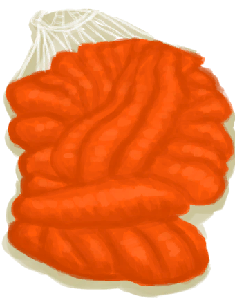

# Deployed Parachute  
> "My parachute  
  
<table class="table table-bordered" data-toggle="table"  data-show-header="false"><thead style="display:none"><tr ><th  style="width:50%;text-align:left;vertical-align:top;"  >title</th><th  style="width:50%;text-align:left;vertical-align:top;"  ></th></tr></thead><tr ><td  style="width:50%;text-align:left;vertical-align:top;"  >** Cannot Be Trashed **</td><td  style="width:50%;text-align:left;vertical-align:top;"  >

<a href="ParachuteDeployed.md" style="color:black">Deployed Parachute</a>

</td></tr></tbody></table>  
  
## Got From  

Perk Effect

[Parachute](Pk_1_Parachute.md)

  
  
## Drag With  

<table style="margin-bottom:0px;"><tr><td style="width:40%;text-align:left; background-color:#FEFEFE"><b>With：</b>[“Cutter”](tag_Cutter.md)</td><td style="width:40%;font-size:1em;font-weight:bold;background-color:#FEFEFE">Cut plastic sheet (30m) [“HandAction(Group)”](HandAction.md)</td></tr><tr><td colspan="2"><b>Require：</b>[

[Light](Light.md)](Light.md): <b>10-100</b></td></tr><tr style="background-color:#FFFFFF"><td style=""><b>Receiving：</b>Usage  <b>-1(-0.67%)</b></td><td style=""><b>Self：</b>Progress  <b>-1</b></td></tr><tr><td colspan="2"><b>StatChange：</b>[

[Weight](Weight.md)](Weight.md)<b>-1</b></td></tr><tr><td colspan="2">[

[Plastic Sheet](PlasticSheet.md)](PlasticSheet.md)(<b>+1</b>), [

[Rope](Rope.md)](Rope.md)(<b>+1</b>), [

[Fiber Cord](CordFiber.md)](CordFiber.md)(<b>+2</b>)</td></tr></table>
  
  
## Durability   

<table style="margin-bottom:0px;"><tr><td style="width:30%;text-align:left; background-color:#FEFEFE;font-size:1.3em;font-weight:bold;">Progress</td><td style="font-size:1em;background-color:#FEFEFE">Starting：2 -</td></tr><tr style="background-color:#FFFFFF"><td colspan=2>** On Zero： ** Self: →Dismiss</td></tr></table>
  

