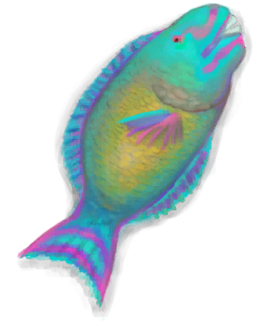

# Parasites  
  

<b>Base Value: </b> 0 
  

<b>Value Range: </b> 0 ~ 1500 
  

<b>Base Rate: </b> - 
  
## Statuses  

<table><tr style="height:2em;"><td style="background-color:#F0F0F0;text-align:center;width:180px;font-size:1.4em;font-weight:bold;vertical-align:middle;">
200 ～ 300

13% ～ 20%
</td><td colspan=2 style="font-size:1.1em;vertical-align:middle;background-color:#F9F9F9;">
<b></b>

</td></tr><tr><td colspan=2><b>Effect：</b>[

[Parasites](Parasites.md)](Parasites.md)addition<b>+1</b>, [

[Weight](Weight.md)](Weight.md)addition<b>-0.5</b>, [

[Immune System](ImmuneSystem.md)](ImmuneSystem.md), [

[Appetite](Appetite.md)](Appetite.md)<b>+25</b></td></tr><tr><td colspan=2></td></tr><tr style="height:2em;"><td style="background-color:#F0F0F0;text-align:center;width:180px;font-size:1.4em;font-weight:bold;vertical-align:middle;">
301 ～ 600

20% ～ 40%
</td><td colspan=2 style="font-size:1.1em;vertical-align:middle;background-color:#F9F9F9;">
<b></b>

</td></tr><tr><td colspan=2><b>Effect：</b>[

[Parasites](Parasites.md)](Parasites.md)addition<b>+2</b>, [

[Weight](Weight.md)](Weight.md)addition<b>-1</b>, [

[Immune System](ImmuneSystem.md)](ImmuneSystem.md)<b>-25</b>, [

[Appetite](Appetite.md)](Appetite.md)<b>+50</b></td></tr><tr><td colspan=2></td></tr><tr style="height:2em;"><td style="background-color:#F0F0F0;text-align:center;width:180px;font-size:1.4em;font-weight:bold;vertical-align:middle;">
601 ～ 900

40% ～ 60%
</td><td colspan=2 style="font-size:1.1em;vertical-align:middle;background-color:#F9F9F9;">
<b>

Rash</b>

&nbsp;&nbsp;I seem to have a bit of a rash.
</td></tr><tr><td colspan=2><b>Effect：</b>[

[Parasites](Parasites.md)](Parasites.md)addition<b>+3</b>, [

[Weight](Weight.md)](Weight.md)addition<b>-1.5</b>, [

[Immune System](ImmuneSystem.md)](ImmuneSystem.md)<b>-50</b>, [

[Appetite](Appetite.md)](Appetite.md)<b>+75</b></td></tr><tr><td colspan=2></td></tr><tr style="height:2em;"><td style="background-color:#F0F0F0;text-align:center;width:180px;font-size:1.4em;font-weight:bold;vertical-align:middle;">
901 ～ 1500

60% ～ 100%
</td><td colspan=2 style="font-size:1.1em;vertical-align:middle;background-color:#F9F9F9;">
<b>

Rash</b>

&nbsp;&nbsp;I seem to have a rash.
</td></tr><tr><td colspan=2><b>Effect：</b>[

[Parasites](Parasites.md)](Parasites.md)addition<b>+4</b>, [

[Weight](Weight.md)](Weight.md)addition<b>-2</b>, [

[Immune System](ImmuneSystem.md)](ImmuneSystem.md)<b>-75</b>, [

[Appetite](Appetite.md)](Appetite.md)<b>+100</b></td></tr><tr><td colspan=2></td></tr></table>
  
## Related Cards  
[Immune System](ImmuneSystem.md)  |  [Filth](Filth.md)  |  [Quinine](Quinine.md)  
## Change By  
<table class="table table-bordered" data-toggle="table"  ><thead style=""><tr ><th  style="text-align:left;vertical-align:top;"  >From</th><th  style="text-align:left;vertical-align:top;"  >Operation</th><th  style="text-align:left;vertical-align:top;"  data-sortable="true"  >Value</th></tr></thead><tr ><td  style="text-align:left;vertical-align:top;"  >[

[Macaque Meat](MacaqueMeat.md)](MacaqueMeat.md)</td><td  style="text-align:left;vertical-align:top;"  >Eat</td><td  style="text-align:left;vertical-align:top;"  >150 ~ 300</td></tr><tr ><td  style="text-align:left;vertical-align:top;"  >[

[Rotten Remains](RottenRemains.md)](RottenRemains.md)</td><td  style="text-align:left;vertical-align:top;"  >Eat</td><td  style="text-align:left;vertical-align:top;"  >50 ~ 100</td></tr><tr ><td  style="text-align:left;vertical-align:top;"  >[

[Bird Meat](BirdMeat.md)](BirdMeat.md)</td><td  style="text-align:left;vertical-align:top;"  >Eat</td><td  style="text-align:left;vertical-align:top;"  >0 ~ 150</td></tr><tr ><td  style="text-align:left;vertical-align:top;"  >[

[Boar Meat](BoarMeat.md)](BoarMeat.md)</td><td  style="text-align:left;vertical-align:top;"  >Eat</td><td  style="text-align:left;vertical-align:top;"  >0 ~ 150</td></tr><tr ><td  style="text-align:left;vertical-align:top;"  >[

[Bonefish Meat](BonefishMeat.md)](BonefishMeat.md)</td><td  style="text-align:left;vertical-align:top;"  >Eat Fish</td><td  style="text-align:left;vertical-align:top;"  >0 ~ 150</td></tr><tr ><td  style="text-align:left;vertical-align:top;"  >[

[Conch Meat](ConchMeat.md)](ConchMeat.md)</td><td  style="text-align:left;vertical-align:top;"  >Eat</td><td  style="text-align:left;vertical-align:top;"  >0 ~ 50</td></tr><tr ><td  style="text-align:left;vertical-align:top;"  >[

[Soft Conch Meat](ConchMeatSoft.md)](ConchMeatSoft.md)</td><td  style="text-align:left;vertical-align:top;"  >Eat</td><td  style="text-align:left;vertical-align:top;"  >0 ~ 50</td></tr><tr ><td  style="text-align:left;vertical-align:top;"  >[

[Crab](Crab.md)](Crab.md)</td><td  style="text-align:left;vertical-align:top;"  >Eat Crab</td><td  style="text-align:left;vertical-align:top;"  >0 ~ 100</td></tr><tr ><td  style="text-align:left;vertical-align:top;"  >[

[Fish Scraps](FishScraps.md)](FishScraps.md)</td><td  style="text-align:left;vertical-align:top;"  >Eat Scraps</td><td  style="text-align:left;vertical-align:top;"  >0 ~ 50</td></tr><tr ><td  style="text-align:left;vertical-align:top;"  >[

[Fish Slices](FishSlices.md)](FishSlices.md)</td><td  style="text-align:left;vertical-align:top;"  >Eat Slices</td><td  style="text-align:left;vertical-align:top;"  >0 ~ 25</td></tr><tr ><td  style="text-align:left;vertical-align:top;"  >[

[Goat Meat](GoatMeat.md)](GoatMeat.md)</td><td  style="text-align:left;vertical-align:top;"  >Eat</td><td  style="text-align:left;vertical-align:top;"  >0 ~ 150</td></tr><tr ><td  style="text-align:left;vertical-align:top;"  >[

[Goatfish](Goatfish.md)](Goatfish.md)</td><td  style="text-align:left;vertical-align:top;"  >Eat Fish</td><td  style="text-align:left;vertical-align:top;"  >0 ~ 150</td></tr><tr ><td  style="text-align:left;vertical-align:top;"  >[

[Herring](Herring.md)](Herring.md)</td><td  style="text-align:left;vertical-align:top;"  >Eat Fish</td><td  style="text-align:left;vertical-align:top;"  >0 ~ 150</td></tr><tr ><td  style="text-align:left;vertical-align:top;"  >[

[Lizard](Lizard.md)](Lizard.md)</td><td  style="text-align:left;vertical-align:top;"  >Eat</td><td  style="text-align:left;vertical-align:top;"  >0 ~ 100</td></tr><tr ><td  style="text-align:left;vertical-align:top;"  >[

[Lizard Meat](MonitorMeat.md)](MonitorMeat.md)</td><td  style="text-align:left;vertical-align:top;"  >Eat</td><td  style="text-align:left;vertical-align:top;"  >0 ~ 150</td></tr><tr ><td  style="text-align:left;vertical-align:top;"  >[

[Skinned Mouse](MouseSkinned.md)](MouseSkinned.md)(未实装)</td><td  style="text-align:left;vertical-align:top;"  >Eat</td><td  style="text-align:left;vertical-align:top;"  >0 ~ 100</td></tr><tr ><td  style="text-align:left;vertical-align:top;"  >[

[Mudskipper](Mudskipper.md)](Mudskipper.md)</td><td  style="text-align:left;vertical-align:top;"  >Eat</td><td  style="text-align:left;vertical-align:top;"  >0 ~ 100</td></tr><tr ><td  style="text-align:left;vertical-align:top;"  >[

[Oyster Meat](OysterMeat.md)](OysterMeat.md)</td><td  style="text-align:left;vertical-align:top;"  >Eat</td><td  style="text-align:left;vertical-align:top;"  >0 ~ 50</td></tr><tr ><td  style="text-align:left;vertical-align:top;"  >[

[Parrot Fish](ParrotFish.md)](ParrotFish.md)</td><td  style="text-align:left;vertical-align:top;"  >Eat Fish</td><td  style="text-align:left;vertical-align:top;"  >0 ~ 150</td></tr><tr ><td  style="text-align:left;vertical-align:top;"  >[

[Dead Chick](PartridgeChickDead.md)](PartridgeChickDead.md)</td><td  style="text-align:left;vertical-align:top;"  >Eat</td><td  style="text-align:left;vertical-align:top;"  >0 ~ 100</td></tr><tr ><td  style="text-align:left;vertical-align:top;"  >[

[Prawns](Prawns.md)](Prawns.md)</td><td  style="text-align:left;vertical-align:top;"  >Eat</td><td  style="text-align:left;vertical-align:top;"  >0 ~ 50</td></tr><tr ><td  style="text-align:left;vertical-align:top;"  >[

[Seahound Meat](Seahoundmeat.md)](Seahoundmeat.md)</td><td  style="text-align:left;vertical-align:top;"  >Eat</td><td  style="text-align:left;vertical-align:top;"  >0 ~ 75</td></tr><tr ><td  style="text-align:left;vertical-align:top;"  >[

[Shark Meat](SharkMeat.md)](SharkMeat.md)</td><td  style="text-align:left;vertical-align:top;"  >Eat</td><td  style="text-align:left;vertical-align:top;"  >0 ~ 150</td></tr><tr ><td  style="text-align:left;vertical-align:top;"  >[

[Skinned Snake](SnakeSkinned.md)](SnakeSkinned.md)</td><td  style="text-align:left;vertical-align:top;"  >Eat</td><td  style="text-align:left;vertical-align:top;"  >0 ~ 150</td></tr><tr ><td  style="text-align:left;vertical-align:top;"  >[

[Threadfin Meat](ThreadfinMeat.md)](ThreadfinMeat.md)</td><td  style="text-align:left;vertical-align:top;"  >Eat</td><td  style="text-align:left;vertical-align:top;"  >0 ~ 150</td></tr><tr ><td  style="text-align:left;vertical-align:top;"  >[

[Urchin Meat](UrchinMeat.md)](UrchinMeat.md)</td><td  style="text-align:left;vertical-align:top;"  >Eat</td><td  style="text-align:left;vertical-align:top;"  >0 ~ 75</td></tr><tr ><td  style="text-align:left;vertical-align:top;"  >[

[Unsafe Water](LQ_WaterUnsafe.md)](LQ_WaterUnsafe.md)</td><td  style="text-align:left;vertical-align:top;"  >Drink</td><td  style="text-align:left;vertical-align:top;"  >0 ~ 150</td></tr></tbody></table>  
  

