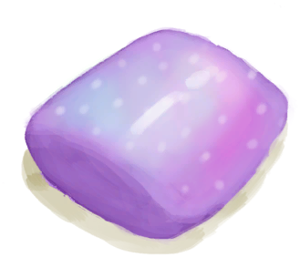

# Seahound Parasites  
  

<b>Base Value: </b> 0 
  

<b>Value Range: </b> 0 ~ 1500 
  

<b>Base Rate: </b> - 
  

<b>Require Perk: </b> 

[Seahounds](Pk_1_Seahounds.md)
  
## Statuses  

<table><tr style="height:2em;"><td style="background-color:#F0F0F0;text-align:center;width:180px;font-size:1.4em;font-weight:bold;vertical-align:middle;">
1 ～ 300

0% ～ 20%
</td><td colspan=2 style="font-size:1.1em;vertical-align:middle;background-color:#F9F9F9;">
<b>

</b>

</td></tr><tr><td colspan=2><b>Effect：</b>[

[Seahound Parasites](ParasitesSeahound.md)](ParasitesSeahound.md)addition<b>+1</b>, [

[Weight](Weight.md)](Weight.md)addition<b>-0.01</b>, [

[Immune System](ImmuneSystem.md)](ImmuneSystem.md), [

[Land Sickness](LandSickness.md)](LandSickness.md)addition<b>+1.5</b></td></tr><tr><td colspan=2></td></tr><tr style="height:2em;"><td style="background-color:#F0F0F0;text-align:center;width:180px;font-size:1.4em;font-weight:bold;vertical-align:middle;">
301 ～ 600

20% ～ 40%
</td><td colspan=2 style="font-size:1.1em;vertical-align:middle;background-color:#F9F9F9;">
<b>

</b>

</td></tr><tr><td colspan=2><b>Effect：</b>[

[Seahound Parasites](ParasitesSeahound.md)](ParasitesSeahound.md)addition<b>+2</b>, [

[Weight](Weight.md)](Weight.md)addition<b>-0.05</b>, [

[Immune System](ImmuneSystem.md)](ImmuneSystem.md)<b>-25</b>, [

[Appetite](Appetite.md)](Appetite.md)<b>+25</b>, [

[Land Sickness](LandSickness.md)](LandSickness.md)addition<b>+2.5</b></td></tr><tr><td colspan=2></td></tr><tr style="height:2em;"><td style="background-color:#F0F0F0;text-align:center;width:180px;font-size:1.4em;font-weight:bold;vertical-align:middle;">
601 ～ 900

40% ～ 60%
</td><td colspan=2 style="font-size:1.1em;vertical-align:middle;background-color:#F9F9F9;">
<b>

</b>

</td></tr><tr><td colspan=2><b>Effect：</b>[

[Seahound Parasites](ParasitesSeahound.md)](ParasitesSeahound.md)addition<b>+3</b>, [

[Weight](Weight.md)](Weight.md)addition<b>-0.125</b>, [

[Immune System](ImmuneSystem.md)](ImmuneSystem.md)<b>-50</b>, [

[Appetite](Appetite.md)](Appetite.md)<b>+50</b>, [

[Land Sickness](LandSickness.md)](LandSickness.md)addition<b>+3.5</b></td></tr><tr><td colspan=2></td></tr><tr style="height:2em;"><td style="background-color:#F0F0F0;text-align:center;width:180px;font-size:1.4em;font-weight:bold;vertical-align:middle;">
901 ～ 1500

60% ～ 100%
</td><td colspan=2 style="font-size:1.1em;vertical-align:middle;background-color:#F9F9F9;">
<b>

</b>

</td></tr><tr><td colspan=2><b>Effect：</b>[

[Seahound Parasites](ParasitesSeahound.md)](ParasitesSeahound.md)addition<b>+4</b>, [

[Weight](Weight.md)](Weight.md)addition<b>-0.25</b>, [

[Immune System](ImmuneSystem.md)](ImmuneSystem.md)<b>-75</b>, [

[Appetite](Appetite.md)](Appetite.md)<b>+75</b>, [

[Land Sickness](LandSickness.md)](LandSickness.md)addition<b>+5</b></td></tr><tr><td colspan=2></td></tr></table>
  
## Related Cards  
[Immune System](ImmuneSystem.md)  |  [Quinine](Quinine.md)  
## Change By  
<table class="table table-bordered" data-toggle="table"  ><thead style=""><tr ><th  style="text-align:left;vertical-align:top;"  >From</th><th  style="text-align:left;vertical-align:top;"  >Operation</th><th  style="text-align:left;vertical-align:top;"  data-sortable="true"  >Value</th></tr></thead><tr ><td  style="text-align:left;vertical-align:top;"  >[

[It got me...(Event)](Event_SeahoundFightBadFailure.md)](Event_SeahoundFightBadFailure.md)</td><td  style="text-align:left;vertical-align:top;"  >Continue</td><td  style="text-align:left;vertical-align:top;"  >800 ~ 1600</td></tr><tr ><td  style="text-align:left;vertical-align:top;"  >[

[The Seahound attacked!(Event)](Event_SeahoundFightFailedRetreat.md)](Event_SeahoundFightFailedRetreat.md)</td><td  style="text-align:left;vertical-align:top;"  >Continue</td><td  style="text-align:left;vertical-align:top;"  >400 ~ 1600</td></tr><tr ><td  style="text-align:left;vertical-align:top;"  >[

["I got it(Event)](Event_SeahoundFightMixedSuccess.md)](Event_SeahoundFightMixedSuccess.md)</td><td  style="text-align:left;vertical-align:top;"  >Continue</td><td  style="text-align:left;vertical-align:top;"  >400 ~ 800</td></tr><tr ><td  style="text-align:left;vertical-align:top;"  >[

[Seahound Meat](Seahoundmeat.md)](Seahoundmeat.md)</td><td  style="text-align:left;vertical-align:top;"  >Eat</td><td  style="text-align:left;vertical-align:top;"  >0 ~ 75</td></tr></tbody></table>  
  

