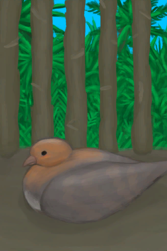

# Chick  
> A baby partridge.  
  
<table class="table table-bordered" data-toggle="table"  data-show-header="false"><thead style="display:none"><tr ><th  style="width:50%;text-align:left;vertical-align:top;"  >title</th><th  style="width:50%;text-align:left;vertical-align:top;"  ></th></tr></thead><tr ><td  style="width:50%;text-align:left;vertical-align:top;"  >** Can Be Renamed **  ** DoseNotPile **  **Weight：**50  **Tag：**	[“Feed”](tag_Meat.md), [“Partridge”](tag_PartridgeChick.md), [“Feed”](tag_Feed.md), [“Feed Weak”](tag_FeedWeak.md), [“Poor Proteins”](tag_ProteinsPoor.md)</td><td  style="width:50%;text-align:left;vertical-align:top;"  >

<a href="PartridgeChick.md" style="color:black">Chick</a>

"These animals can be seen in the <b>Jungles and Grasslands</b> of  the island.  They can be hunted for their meat</td></tr></tbody></table>  
  
## Got From  

Transform

[Fertilized Egg](EggPartridgeFertilized.md)

  
  
## Action  

<table><tr><td rowspan="2" style="width:200px;text-align:center;font-size:1.3em;font-weight:bold">

Kill

15m

</td><td></td></tr><tr><td><b>Self：</b>→ [

[Dead Chick](PartridgeChickDead.md)](PartridgeChickDead.md)</td></tr><tr><td colspan="2"><b>Require：</b>[

[Light](Light.md)](Light.md): <b>10-100</b></td></tr><tr><td colspan="2"><b>CardChanges：</b>所有[“Partridge”](tag_Partridge.md)

  <b>-250～-100(-25%～-10%)</b></td></tr></table>
  
  
  
## Drag With  

<table style="margin-bottom:0px;"><tr><td style="width:40%;text-align:left; background-color:#FEFEFE"><b>With：</b>[

[Fish Slices](FishSlices.md)](FishSlices.md) | [

[Cooked Fish Slices](FishSlicesCooked.md)](FishSlicesCooked.md) | [

[Prawns](Prawns.md)](Prawns.md) | [

[Roasted Prawns](PrawnsCooked.md)](PrawnsCooked.md) | [

[Fish Scraps](FishScraps.md)](FishScraps.md) | [

[Cooked Fish Scraps](FishScrapsCooked.md)](FishScrapsCooked.md)</td><td style="width:40%;font-size:1em;font-weight:bold;background-color:#FEFEFE">Feed (3m) </td></tr><tr style="background-color:#FFFFFF"><td style=""><b>Receiving：</b>→Dismiss</td><td style=""><b>Self：</b>

  <b>+288(100%)</b>, 

  <b>+250(25%)</b></td></tr></table>
  

<table style="margin-bottom:0px;"><tr><td style="width:40%;text-align:left; background-color:#FEFEFE"><b>With：</b>[“Rich Sugars”](tag_SugarsRich.md) | [“Medium Sugars”](tag_SugarsMedium.md) | [“Poor Sugars”](tag_SugarsPoor.md) | [“Rich Proteins”](tag_ProteinsRich.md) | [“Medium Proteins”](tag_ProteinsMedium.md) | [“Poor Proteins”](tag_ProteinsPoor.md) | [“Rich Processed”](tag_ProcessedRich.md) | [“Medium Processed”](tag_ProcessedMedium.md) | [“Poor Processed”](tag_ProcessedPoor.md)</td><td style="width:40%;font-size:1em;font-weight:bold;background-color:#FEFEFE">Feed (3m) </td></tr><tr style="background-color:#FFFFFF"><td style=""><b>Receiving：</b>→Dismiss</td><td style=""><b>Self：</b>

  <b>+288(100%)</b>, 

  <b>+250(25%)</b></td></tr></table>
  
  
## Drag To  

[Boar Feeder](BoarFeeder.md)

[Boar Feeder(Empty)](BoarFeederEmpty.md)

[Compost Bin](CompostBin.md)

[Partridge Feeder](PartridgeFeeder.md)

[Partridge Feeder(Empty)](PartridgeFeederEmpty.md)

[Trapped Macaque](CageTrapMacaque.md)

[Sow](BoarEnclosureFemale.md)

[Boar](BoarEnclosureMale.md)

[Piglet](BoarEnclosurePiglet.md)

[Sow](BoarTiedFemale.md)

[Boar](BoarTiedMale.md)

[Piglet](BoarTiedPiglet.md)

[Dog Friend](DogFriend.md)

[Macaque Friend](MacaqueFriend.md)

[Wounded Macaque](MacaqueWounded.md)

[Chick](PartridgeChick.md)

[Partridge](PartridgeFemaleEnclosure.md)

[Partridge](PartridgeFemaleLive.md)

[Male Partridge](PartridgeMaleEnclosure.md)

[Male Partridge](PartridgeMaleLive.md)

  
  
## Durability   

<table style="margin-bottom:0px;"><tr><td style="width:30%;text-align:left; background-color:#FEFEFE;font-size:1.3em;font-weight:bold;">

</td><td style="font-size:1em;background-color:#FEFEFE">Starting：288 , Max：288 -1/TP , Duration ：3d</td></tr><tr style="background-color:#FFFFFF"><td colspan=2>** On Zero： ** Self: → [

[Dead Chick](PartridgeChickDead.md)](PartridgeChickDead.md)</td></tr></table>
  

<table style="margin-bottom:0px;"><tr><td style="width:30%;text-align:left; background-color:#FEFEFE;font-size:1.3em;font-weight:bold;">

</td><td style="font-size:1em;background-color:#FEFEFE">Starting：0 , Max：672 +1/TP , Duration ：7d</td></tr><tr style="background-color:#FFFFFF"><td colspan=2>** On Full： ** Self: →Dismiss 

<table style="margin-bottom:3px;"><tr><td rowspan=2 style="text-align:center" width="80px">
Base Weight

3
</td><td style="font-size:0.6em;line-height:0.6em;font-weight:bold">Female</td></tr><tr><td>[

[Partridge](PartridgeFemaleEnclosure.md)](PartridgeFemaleEnclosure.md)(<b>+1</b>)</td></tr></table>

<table style="margin-bottom:3px;"><tr><td rowspan=2 style="text-align:center" width="80px">
Base Weight

1
</td><td style="font-size:0.6em;line-height:0.6em;font-weight:bold">Male</td></tr><tr><td>[

[Male Partridge](PartridgeMaleEnclosure.md)](PartridgeMaleEnclosure.md)(<b>+1</b>)</td></tr></table>

</td></tr></table>
  

<table style="margin-bottom:0px;"><tr><td style="width:30%;text-align:left; background-color:#FEFEFE;font-size:1.3em;font-weight:bold;">

</td><td style="font-size:1em;background-color:#FEFEFE">Starting：500 , Max：1000 -1/TP , Duration ：10d10h</td></tr><tr style="background-color:#FFFFFF"><td colspan=2></td></tr></table>
  
## Passive Effects  
<table class="table table-bordered" data-toggle="table"  ><thead style=""><tr ><th  style="text-align:left;vertical-align:top;"  >Name</th><th  style="text-align:left;vertical-align:top;"  >Condition</th><th  style="text-align:left;vertical-align:top;"  >Change(Each TP)</th><th  style="text-align:left;vertical-align:top;"  data-sortable="true"  >Status</th></tr></thead><tr ><td  style="text-align:left;vertical-align:top;"  >Feed</td><td  style="text-align:left;vertical-align:top;"  >** Require Durability：** 

: <b>1～1536(0.15%～228.57%)</b> ** Require Card：** [Partridge Feeder](PartridgeFeeder.md)</td><td  style="text-align:left;vertical-align:top;"  >

 +2(0.69%) 

+2(0.2%)</td><td  style="text-align:left;vertical-align:top;"  ></td></tr><tr ><td  style="text-align:left;vertical-align:top;"  >Overcrowding Large Animal</td><td  style="text-align:left;vertical-align:top;"  >** Require Durability：** 

: <b>1～1536(0.15%～228.57%)</b> ** Require Card(可叠加)：** [“Large Animal”](tag_LargeAnimal.md)</td><td  style="text-align:left;vertical-align:top;"  >

-0.1(-0.01%)</td><td  style="text-align:left;vertical-align:top;"  ></td></tr><tr ><td  style="text-align:left;vertical-align:top;"  >Overcrowding Partridge</td><td  style="text-align:left;vertical-align:top;"  >** Require Durability：** 

: <b>1～1536(0.15%～228.57%)</b> ** Require Card(可叠加)：** [“Partridge”](tag_Partridge.md)</td><td  style="text-align:left;vertical-align:top;"  >

-0.1(-0.01%)</td><td  style="text-align:left;vertical-align:top;"  ></td></tr></tbody></table>  
  

