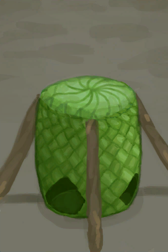
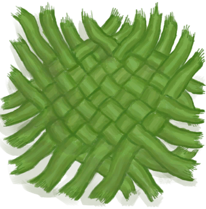
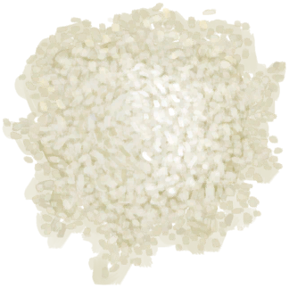

# Partridge Feeder  
> A device to feed partridges with minimal work.  
  
<table class="table table-bordered" data-toggle="table"  data-show-header="false"><thead style="display:none"><tr ><th  style="width:50%;text-align:left;vertical-align:top;"  >title</th><th  style="width:50%;text-align:left;vertical-align:top;"  ></th></tr></thead><tr ><td  style="width:50%;text-align:left;vertical-align:top;"  >**Weight：**750</td><td  style="width:50%;text-align:left;vertical-align:top;"  >

<a href="PartridgeFeederEmpty.md" style="color:black">Partridge Feeder</a>

This useful but simple device can be built with <b>Sticks and Woven Fronds</b> on an <b>Enclosure</b> to help you feed your <b>Partridges</b> more efficiently.  It can be filled with any type of food and with <b>Bird Feed</b> for even more efficiency.</td></tr></tbody></table>  
  
## Got From  

Transform

[Partridge Feeder](PartridgeFeeder.md)

Craft BluePrint

[Partridge Feeder(BluePrint)](Bp_PartridgeFeeder.md)

  
  
## Action  

<table><tr><td rowspan="2" style="width:200px;text-align:center;font-size:1.3em;font-weight:bold">

Dismantle

1h

</td><td></td></tr><tr><td><b>Self：</b>→Dismiss</td></tr><tr><td colspan="2">[

[Palm Weave](WeavePalm.md)](WeavePalm.md)(<b>+3</b>), [

[Fiber Cord](CordFiber.md)](CordFiber.md)(<b>+4</b>)</td></tr></table>
  
  
  
## Drag With  

<table style="margin-bottom:0px;"><tr><td style="width:40%;text-align:left; background-color:#FEFEFE"><b>With：</b>[

[Bird Feed](FeedBird.md)](FeedBird.md)</td><td style="width:40%;font-size:1em;font-weight:bold;background-color:#FEFEFE">Feed  </td></tr><tr style="background-color:#FFFFFF"><td style=""><b>Receiving：</b>→Dismiss</td><td style=""><b>Self：</b>→ [

[Partridge Feeder](PartridgeFeeder.md)](PartridgeFeeder.md), Food

  <b>+672(16.67%)</b></td></tr></table>
  

<table style="margin-bottom:0px;"><tr><td style="width:40%;text-align:left; background-color:#FEFEFE"><b>With：</b>[“Rich Sugars”](tag_SugarsRich.md) | [“Rich Proteins”](tag_ProteinsRich.md) | [“Rich Processed”](tag_ProcessedRich.md)</td><td style="width:40%;font-size:1em;font-weight:bold;background-color:#FEFEFE">Feed  </td></tr><tr style="background-color:#FFFFFF"><td style=""><b>Receiving：</b>→Dismiss</td><td style=""><b>Self：</b>→ [

[Partridge Feeder](PartridgeFeeder.md)](PartridgeFeeder.md), Food

  <b>+384(9.52%)</b></td></tr></table>
  

<table style="margin-bottom:0px;"><tr><td style="width:40%;text-align:left; background-color:#FEFEFE"><b>With：</b>[“Medium Sugars”](tag_SugarsMedium.md) | [“Medium Proteins”](tag_ProteinsMedium.md) | [“Medium Processed”](tag_ProcessedMedium.md)</td><td style="width:40%;font-size:1em;font-weight:bold;background-color:#FEFEFE">Feed  </td></tr><tr style="background-color:#FFFFFF"><td style=""><b>Receiving：</b>→Dismiss</td><td style=""><b>Self：</b>→ [

[Partridge Feeder](PartridgeFeeder.md)](PartridgeFeeder.md), Food

  <b>+192(4.76%)</b></td></tr></table>
  

<table style="margin-bottom:0px;"><tr><td style="width:40%;text-align:left; background-color:#FEFEFE"><b>With：</b>[“Poor Sugars”](tag_SugarsPoor.md) | [“Poor Proteins”](tag_ProteinsPoor.md) | [“Poor Processed”](tag_ProcessedPoor.md)</td><td style="width:40%;font-size:1em;font-weight:bold;background-color:#FEFEFE">Feed  </td></tr><tr style="background-color:#FFFFFF"><td style=""><b>Receiving：</b>→Dismiss</td><td style=""><b>Self：</b>→ [

[Partridge Feeder](PartridgeFeeder.md)](PartridgeFeeder.md), Food

  <b>+48(1.19%)</b></td></tr></table>
  
  
## Durability   

<table style="margin-bottom:0px;"><tr><td style="width:30%;text-align:left; background-color:#FEFEFE;font-size:1.3em;font-weight:bold;">

Food</td><td style="font-size:1em;background-color:#FEFEFE">Starting：0 , Max：4032 -1/TP , Duration ：42d</td></tr><tr style="background-color:#FFFFFF"><td colspan=2></td></tr></table>
  

