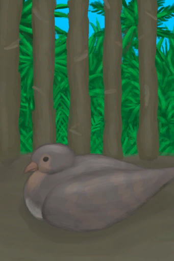
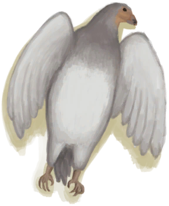
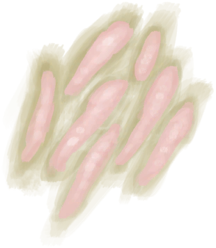

# Partridge  
> My own little partridge. Should feed it every day and check it for eggs.  
  
<table class="table table-bordered" data-toggle="table"  data-show-header="false"><thead style="display:none"><tr ><th  style="width:50%;text-align:left;vertical-align:top;"  >title</th><th  style="width:50%;text-align:left;vertical-align:top;"  ></th></tr></thead><tr ><td  style="width:50%;text-align:left;vertical-align:top;"  >** Can Be Renamed **  ** DoseNotPile **  **Weight：**150  **Tag：**	[“Large”](tag_Large.md), [“Feed”](tag_Meat.md), [“Partridge”](tag_Partridge.md)  **Slots：**1</td><td  style="width:50%;text-align:left;vertical-align:top;"  >

<a href="PartridgeFemaleEnclosure.md" style="color:black">Partridge</a>

"These animals can be seen in the <b>Jungles and Grasslands</b> of  the island.  They can be hunted for their meat</td></tr></tbody></table>  
  
## Got From  

Transform

[Chick](PartridgeChick.md)

Release in Enclosure

[Partridge](PartridgeFemaleLive.md)

  
  
## Action  

<table><tr><td rowspan="2" style="width:200px;text-align:center;font-size:1.3em;font-weight:bold">

Kill

15m

</td><td></td></tr><tr><td><b>Self：</b>→ [

[Dead Partridge](PartridgeDead.md)](PartridgeDead.md)</td></tr><tr><td colspan="2"><b>Require：</b>[

[Light](Light.md)](Light.md): <b>10-100</b></td></tr><tr><td colspan="2"><b>CardChanges：</b>所有[“Partridge”](tag_Partridge.md)

  <b>-250～-100(-25%～-10%)</b></td></tr></table>
  

<table><tr><td rowspan="2" style="width:200px;text-align:center;font-size:1.3em;font-weight:bold">

Pick Up

15m

</td><td></td></tr><tr><td><b>Self：</b>→ [

[Partridge](PartridgeFemaleLive.md)](PartridgeFemaleLive.md)</td></tr><tr><td colspan="2"><b>Require：</b>[

[Light](Light.md)](Light.md): <b>10-100</b></td></tr></table>
  
  
  
## Drag With  

<table style="margin-bottom:0px;"><tr><td style="width:40%;text-align:left; background-color:#FEFEFE"><b>With：</b>[

[Fish Slices](FishSlices.md)](FishSlices.md) | [

[Cooked Fish Slices](FishSlicesCooked.md)](FishSlicesCooked.md) | [

[Prawns](Prawns.md)](Prawns.md) | [

[Roasted Prawns](PrawnsCooked.md)](PrawnsCooked.md) | [

[Fish Scraps](FishScraps.md)](FishScraps.md) | [

[Cooked Fish Scraps](FishScrapsCooked.md)](FishScrapsCooked.md)</td><td style="width:40%;font-size:1em;font-weight:bold;background-color:#FEFEFE">Feed (3m) </td></tr><tr style="background-color:#FFFFFF"><td style=""><b>Receiving：</b>→Dismiss</td><td style=""><b>Self：</b>

  <b>+288(100%)</b>, 

  <b>+50(5%)</b></td></tr></table>
  

<table style="margin-bottom:0px;"><tr><td style="width:40%;text-align:left; background-color:#FEFEFE"><b>With：</b>[“Rich Sugars”](tag_SugarsRich.md) | [“Medium Sugars”](tag_SugarsMedium.md) | [“Poor Sugars”](tag_SugarsPoor.md) | [“Rich Proteins”](tag_ProteinsRich.md) | [“Medium Proteins”](tag_ProteinsMedium.md) | [“Poor Proteins”](tag_ProteinsPoor.md) | [“Rich Processed”](tag_ProcessedRich.md) | [“Medium Processed”](tag_ProcessedMedium.md) | [“Poor Processed”](tag_ProcessedPoor.md)</td><td style="width:40%;font-size:1em;font-weight:bold;background-color:#FEFEFE">Feed (3m) </td></tr><tr style="background-color:#FFFFFF"><td style=""><b>Receiving：</b>→Dismiss</td><td style=""><b>Self：</b>

  <b>+288(100%)</b>, 

  <b>+250(25%)</b></td></tr></table>
  

<table style="margin-bottom:0px;"><tr><td style="width:40%;text-align:left; background-color:#FEFEFE"><b>With：</b>[“Cutter”](tag_Cutter.md)</td><td style="width:40%;font-size:1em;font-weight:bold;background-color:#FEFEFE">Cut Open (30m) [“HandAction(Group)”](HandAction.md)</td></tr><tr><td colspan="2"><b>Require：</b>[

[Light](Light.md)](Light.md): <b>10-100</b></td></tr><tr style="background-color:#FFFFFF"><td style=""><b>Receiving：</b>Usage  <b>-1(-0.67%)</b></td><td style=""><b>Self：</b>→Dismiss</td></tr><tr><td colspan="2"><b>StatChange：</b>[

[Filth](Filth.md)](Filth.md)<b>+20</b></td></tr><tr><td colspan="2">[

[Bird Bones](BonesBird.md)](BonesBird.md)(<b>+2</b>), [

[Feathers](Feathers.md)](Feathers.md)(<b>+2～+4</b>), [

[Bird Meat](BirdMeat.md)](BirdMeat.md)(<b>+1</b>)</td></tr></table>
  
  
## Drag To  

[Dog Friend](DogFriend.md)

  
  
## Transform  

<table style="margin-bottom:0px;"><tr><td  colspan=2 style="font-size:1em;font-weight:bold;background-color:#FEFEFE">Lay Egg</td><td style="text-align:right; background-color:#FEFEFE"></td></tr><tr style="background-color:#FFFFFF"><td style="width:30%;font-size:1em;text-align:right;vertical-align:middle;"></td><td style="text-align:center;width:20%;vertical-align:middle;">
1d

Lay Egg
</td><td style="text-align:left;vertical-align:middle;"></td></tr><tr><td colspan="3">

<table style="margin-bottom:3px;"><tr><td rowspan=2 style="text-align:center" width="80px">
Base Weight

1000
</td><td style="font-size:0.6em;line-height:0.6em;font-weight:bold">Nothing</td></tr><tr><td></td></tr><tr><td colspan=2><li>

in<b>0～1000(0%～100%)</b>, weight<b>+0～-1000</b></li></td></tr></table>

<table style="margin-bottom:3px;"><tr><td rowspan=2 style="text-align:center" width="80px">
Base Weight

1000
</td><td style="font-size:0.6em;line-height:0.6em;font-weight:bold">Egg</td></tr><tr><td>[

[Egg](Egg.md)](Egg.md)(<b>+1</b>)</td></tr><tr><td colspan=2><li>

in<b>0～1000(0%～100%)</b>, weight<b>-1000～+0</b></li></td></tr></table>

<table style="margin-bottom:3px;"><tr><td rowspan=2 style="text-align:center" width="80px">
Base Weight

-1000
</td><td style="font-size:0.6em;line-height:0.6em;font-weight:bold">Fertilized Egg</td></tr><tr><td>[

[Fertilized Egg](EggPartridgeFertilized.md)](EggPartridgeFertilized.md)(<b>+1</b>)</td></tr><tr><td colspan=2><li>

in<b>0～1000(0%～100%)</b>, weight<b>-1000～+0</b></li>Max 99 of：<li>[

[Male Partridge](PartridgeMaleEnclosure.md)](PartridgeMaleEnclosure.md) On *Hand/Board*，Weight<b>+2000</b>,</li><li>[

[Partridge](PartridgeFemaleEnclosure.md)](PartridgeFemaleEnclosure.md) On *Hand/Board*，Weight<b>-100</b>,</li></td></tr></table>
<button class="btn btn-secondary btn-sm" style="" data-toggle="modal" onclick="setCollectionDataBase64('eyJ0aXRsZSI6IlNpbXVsYXRvcjogTGF5IEVnZyAoUGFydHJpZGdlKSIsImNvbGxlY3Rpb25zIjpbeyJkcm9wIjoiLSIsImJhc2UiOjEwMDAsImNvbmRpdGlvbiI6W3sia2V5IjoiUHJvZ3Jlc3MiLCJ0aXRsZSI6IjxkaXYgc3R5bGU9XCJ3aWR0aDoyMHB4O2Rpc3BsYXk6aW5saW5lLWJsb2NrO3RleHQtYWxpZ246Y2VudGVyXCI+PGltZyBkZWNvZGluZz1cImFzeW5jXCIgc3JjPVwiU3ByaXRlL0NvbnRlbnQucG5nXCIgaHJlZj1cImEubWRcIiBzdHlsZT1cIm1heC13aWR0aDoyMHB4O21heC1oZWlnaHQ6MjBweDtcIj48L2Rpdj4iLCJ0eXBlIjoicmFuZ2UiLCJtYXgiOlswLDEwMDBdLCJyYW5nZSI6WzAsMTAwMF0sIndlaWdodCI6WzAsLTEwMDBdLCJkZWZhdWx0VmFsdWUiOjAsIndoZW5PdXRPZlJhbmdlIjowfV19LHsiZHJvcCI6IjxkaXYgc3R5bGU9XCJ3aWR0aDoyNXB4O2Rpc3BsYXk6aW5saW5lLWJsb2NrO3RleHQtYWxpZ246Y2VudGVyXCI+PGltZyBkZWNvZGluZz1cImFzeW5jXCIgc3JjPVwiU3ByaXRlL0VnZy5wbmdcIiBocmVmPVwiYS5tZFwiIHN0eWxlPVwibWF4LXdpZHRoOjI1cHg7bWF4LWhlaWdodDoyNXB4O1wiPjwvZGl2PkVnZyIsImJhc2UiOjEwMDAsImNvbmRpdGlvbiI6W3sia2V5IjoiUHJvZ3Jlc3MiLCJ0aXRsZSI6IjxkaXYgc3R5bGU9XCJ3aWR0aDoyMHB4O2Rpc3BsYXk6aW5saW5lLWJsb2NrO3RleHQtYWxpZ246Y2VudGVyXCI+PGltZyBkZWNvZGluZz1cImFzeW5jXCIgc3JjPVwiU3ByaXRlL0NvbnRlbnQucG5nXCIgaHJlZj1cImEubWRcIiBzdHlsZT1cIm1heC13aWR0aDoyMHB4O21heC1oZWlnaHQ6MjBweDtcIj48L2Rpdj4iLCJ0eXBlIjoicmFuZ2UiLCJtYXgiOlswLDEwMDBdLCJyYW5nZSI6WzAsMTAwMF0sIndlaWdodCI6Wy0xMDAwLDBdLCJkZWZhdWx0VmFsdWUiOjAsIndoZW5PdXRPZlJhbmdlIjowfV19LHsiZHJvcCI6IjxkaXYgc3R5bGU9XCJ3aWR0aDoyNXB4O2Rpc3BsYXk6aW5saW5lLWJsb2NrO3RleHQtYWxpZ246Y2VudGVyXCI+PGltZyBkZWNvZGluZz1cImFzeW5jXCIgc3JjPVwiU3ByaXRlL0VnZy5wbmdcIiBocmVmPVwiYS5tZFwiIHN0eWxlPVwibWF4LXdpZHRoOjI1cHg7bWF4LWhlaWdodDoyNXB4O1wiPjwvZGl2PkZlcnRpbGl6ZWQgRWdnIiwiYmFzZSI6LTEwMDAsImNvbmRpdGlvbiI6W3sia2V5IjoiUHJvZ3Jlc3MiLCJ0aXRsZSI6IjxkaXYgc3R5bGU9XCJ3aWR0aDoyMHB4O2Rpc3BsYXk6aW5saW5lLWJsb2NrO3RleHQtYWxpZ246Y2VudGVyXCI+PGltZyBkZWNvZGluZz1cImFzeW5jXCIgc3JjPVwiU3ByaXRlL0NvbnRlbnQucG5nXCIgaHJlZj1cImEubWRcIiBzdHlsZT1cIm1heC13aWR0aDoyMHB4O21heC1oZWlnaHQ6MjBweDtcIj48L2Rpdj4iLCJ0eXBlIjoicmFuZ2UiLCJtYXgiOlswLDEwMDBdLCJyYW5nZSI6WzAsMTAwMF0sIndlaWdodCI6Wy0xMDAwLDBdLCJkZWZhdWx0VmFsdWUiOjAsIndoZW5PdXRPZlJhbmdlIjowfSx7ImtleSI6IlBhcnRyaWRnZU1hbGVFbmNsb3N1cmVfYW1vdW50IiwidGl0bGUiOiJNYWxlIFBhcnRyaWRnZSIsInR5cGUiOiJyYW5nZSIsInJhbmdlIjpbMCw5OV0sIm1heCI6WzAsOTldLCJ3ZWlnaHQiOlswLDE5ODAwMF0sImRlZmF1bHRWYWx1ZSI6MCwid2hlbk91dE9mUmFuZ2UiOjAsIm1heFN0YWNrR3JvdXAiOiJNQVhfU1RBQ0tfRmVydGlsaXplZCBFZ2cifSx7ImtleSI6IlBhcnRyaWRnZUZlbWFsZUVuY2xvc3VyZV9hbW91bnQiLCJ0aXRsZSI6IlBhcnRyaWRnZSIsInR5cGUiOiJyYW5nZSIsInJhbmdlIjpbMCw5OV0sIm1heCI6WzAsOTldLCJ3ZWlnaHQiOlswLC05OTAwXSwiZGVmYXVsdFZhbHVlIjowLCJ3aGVuT3V0T2ZSYW5nZSI6MCwibWF4U3RhY2tHcm91cCI6Ik1BWF9TVEFDS19GZXJ0aWxpemVkIEVnZyJ9XX1dfQ==')" data-target="#modelCollectionSimulator">Simulator</button>
</td></tr></table>
  

<table style="margin-bottom:0px;"><tr><td  colspan=2 style="font-size:1em;font-weight:bold;background-color:#FEFEFE">Hatch Egg</td><td style="text-align:right; background-color:#FEFEFE"></td></tr><tr style="background-color:#FFFFFF"><td style="width:30%;font-size:1em;text-align:right;vertical-align:middle;">[

[Fertilized Egg](EggPartridgeFertilized.md)](EggPartridgeFertilized.md)</td><td style="text-align:center;width:20%;vertical-align:middle;">
15m

Hatch Egg
</td><td style="text-align:left;vertical-align:middle;">Charges  <b>+1</b></td></tr></table>
  
## Durability   

<table style="margin-bottom:0px;"><tr><td style="width:30%;text-align:left; background-color:#FEFEFE;font-size:1.3em;font-weight:bold;">

</td><td style="font-size:1em;background-color:#FEFEFE">Starting：288 , Max：288 -1/TP , Duration ：3d</td></tr><tr style="background-color:#FFFFFF"><td colspan=2>** On Zero： ** Self: → [

[Dead Partridge](PartridgeDead.md)](PartridgeDead.md)</td></tr></table>
  

<table style="margin-bottom:0px;"><tr><td style="width:30%;text-align:left; background-color:#FEFEFE;font-size:1.3em;font-weight:bold;">

</td><td style="font-size:1em;background-color:#FEFEFE">Starting：500 , Max：1000 -1/TP , Duration ：10d10h</td></tr><tr style="background-color:#FFFFFF"><td colspan=2></td></tr></table>
  
## Passive Effects  
<table class="table table-bordered" data-toggle="table"  ><thead style=""><tr ><th  style="text-align:left;vertical-align:top;"  >Name</th><th  style="text-align:left;vertical-align:top;"  >Condition</th><th  style="text-align:left;vertical-align:top;"  >Change(Each TP)</th><th  style="text-align:left;vertical-align:top;"  data-sortable="true"  >Status</th></tr></thead><tr ><td  style="text-align:left;vertical-align:top;"  >Feed</td><td  style="text-align:left;vertical-align:top;"  >** Require Card：** [Partridge Feeder](PartridgeFeeder.md)</td><td  style="text-align:left;vertical-align:top;"  >

 +2(0.69%) 

+2(0.2%)</td><td  style="text-align:left;vertical-align:top;"  ></td></tr><tr ><td  style="text-align:left;vertical-align:top;"  >Overcrowding Large Animal</td><td  style="text-align:left;vertical-align:top;"  >** Require Durability：** Fuel: <b>1～1536</b> ** Require Card(可叠加)：** [“Large Animal”](tag_LargeAnimal.md)</td><td  style="text-align:left;vertical-align:top;"  >

-0.1(-0.01%)</td><td  style="text-align:left;vertical-align:top;"  ></td></tr><tr ><td  style="text-align:left;vertical-align:top;"  >Overcrowding Partridge</td><td  style="text-align:left;vertical-align:top;"  >** Require Durability：** Fuel: <b>1～1536</b> ** Require Card(可叠加)：** [“Partridge”](tag_Partridge.md)</td><td  style="text-align:left;vertical-align:top;"  >

-0.1(-0.01%)</td><td  style="text-align:left;vertical-align:top;"  ></td></tr></tbody></table>  
  

