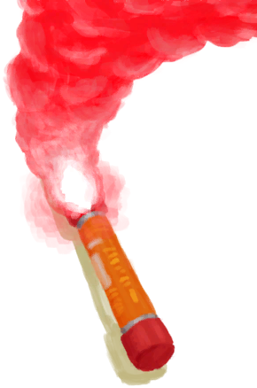
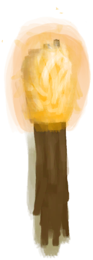
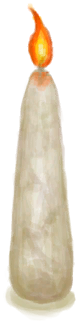
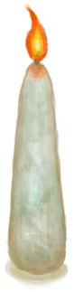
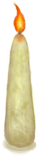
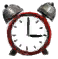

# Passing Ship  
> A passing Ship! If only I could catch its attention! A Flare or Torch would really help.  
  
<table class="table table-bordered" data-toggle="table"  data-show-header="false"><thead style="display:none"><tr ><th  style="width:50%;text-align:left;vertical-align:top;"  >title</th><th  style="width:50%;text-align:left;vertical-align:top;"  ></th></tr></thead><tr ><td  style="width:50%;text-align:left;vertical-align:top;"  >** Effect: ** [

[Discomfort](Discomfort.md)](Discomfort.md)<b>+500</b></td><td  style="width:50%;text-align:left;vertical-align:top;"  >

<a href="PassingShip.md" style="color:black">Passing Ship</a>

</td></tr></tbody></table>  
  
## Got From  

Continue

[A Passing Ship!(Event)](Event_Raft_PassingShip.md)

  
  
## Action  

<table><tr><td rowspan="2" style="width:200px;text-align:center;font-size:1.3em;font-weight:bold">

Wave hands & Scream!

15m

</td><td></td></tr><tr><td><b>Self：</b>Progress  <b>+1～+10(1%～10%)</b></td></tr></table>
  
  
  
## Drag With  

<table style="margin-bottom:0px;"><tr><td style="width:40%;text-align:left; background-color:#FEFEFE"><b>With：</b>[

[Burning Flare(On)](FlareHandOn.md)](FlareHandOn.md)</td><td style="width:40%;font-size:1em;font-weight:bold;background-color:#FEFEFE">Wave Flare! (15m) </td></tr><tr style="background-color:#FFFFFF"><td style=""><b>Receiving：</b></td><td style=""><b>Self：</b>Progress  <b>+25～+50(25%～50%)</b></td></tr></table>
  

<table style="margin-bottom:0px;"><tr><td style="width:40%;text-align:left; background-color:#FEFEFE"><b>With：</b>[

[Torch(On)](TorchOn.md)](TorchOn.md)</td><td style="width:40%;font-size:1em;font-weight:bold;background-color:#FEFEFE">Wave Torch! (15m) </td></tr><tr style="background-color:#FFFFFF"><td style=""><b>Receiving：</b></td><td style=""><b>Self：</b>Progress  <b>+15～+35(15%～35%)</b></td></tr></table>
  

<table style="margin-bottom:0px;"><tr><td style="width:40%;text-align:left; background-color:#FEFEFE"><b>With：</b>[

[Signaling Mirror](SignalingMirror.md)](SignalingMirror.md)</td><td style="width:40%;font-size:1em;font-weight:bold;background-color:#FEFEFE">Signal! (15m) </td></tr><tr style="background-color:#FFFFFF"><td style=""><b>Receiving：</b></td><td style=""><b>Self：</b>Progress  <b>+10～+30(10%～30%)</b></td></tr></table>
  

<table style="margin-bottom:0px;"><tr><td style="width:40%;text-align:left; background-color:#FEFEFE"><b>With：</b>[

[Candle(On)](CandleOn.md)](CandleOn.md) | [

[Jasmine Candle(On)](CandleJasmineOn.md)](CandleJasmineOn.md) | [

[Citronella Candle(On)](CandleCitronellaOn.md)](CandleCitronellaOn.md)</td><td style="width:40%;font-size:1em;font-weight:bold;background-color:#FEFEFE">Wave Candle! (15m) </td></tr><tr style="background-color:#FFFFFF"><td style=""><b>Receiving：</b></td><td style=""><b>Self：</b>Progress  <b>+5～+30(5%～30%)</b></td></tr></table>
  
  
## Durability   

<table style="margin-bottom:0px;"><tr><td style="width:30%;text-align:left; background-color:#FEFEFE;font-size:1.3em;font-weight:bold;">

Time Left</td><td style="font-size:1em;background-color:#FEFEFE">Starting：6 , Max：6 -1/TP , Duration ：1h30m</td></tr><tr style="background-color:#FFFFFF"><td colspan=2>** On Zero： ** Self: →Dismiss [

[Ship Missed(Event)](Event_ShipMissed.md)](Event_ShipMissed.md)(<b>+1</b>)</td></tr></table>
  

<table style="margin-bottom:0px;"><tr><td style="width:30%;text-align:left; background-color:#FEFEFE;font-size:1.3em;font-weight:bold;">Progress</td><td style="font-size:1em;background-color:#FEFEFE">Starting：0 , Max：100 -</td></tr><tr style="background-color:#FFFFFF"><td colspan=2>** On Full： ** Self: →Dismiss [

[Ship Rescue(Event)](Event_ShipRescue.md)](Event_ShipRescue.md)(<b>+1</b>)</td></tr></table>
  

