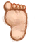

# Volcano  
> Move to the Volcano.  <b>(only cards on my hand row will be carried)</b>  
  
<table class="table table-bordered" data-toggle="table"  data-show-header="false"><thead style="display:none"><tr ><th  style="width:50%;text-align:left;vertical-align:top;"  >title</th><th  style="width:50%;text-align:left;vertical-align:top;"  ></th></tr></thead><tr ><td  style="width:50%;text-align:left;vertical-align:top;"  >** Unique On Board **  **Environment：**[Eastern Highlands(Environment)](Env_HighlandsEastern.md)</td><td  style="width:50%;text-align:left;vertical-align:top;"  >

<a href="Path_HighlandsEToVolcano.md" style="color:black">Volcano</a>

</td></tr></tbody></table>  
  
## Got From  

探索

[Eastern Highlands](HighlandsEastern.md)

Go

[To Eastern Highlands(Volcano)](Path_VolcanoToHighlandsE.md)

  
  
## Action  

<table><tr><td rowspan="2" style="width:200px;text-align:center;font-size:1.3em;font-weight:bold">

Go

15m

</td><td>[“LegAction(Group)”](LegAction.md), [“TravelAction(Group)”](TravelAction.md)</td></tr><tr><td></td></tr><tr><td colspan="2"><b>Require：</b>[

[Light](Light.md)](Light.md): <b>10-100</b>, [

[Stamina](Stamina.md)](Stamina.md): <b>11-32</b></td></tr><tr><td colspan="2"><b>StatChange：</b>[

[Foot Damage](FootDamage.md)](FootDamage.md)<b>+20</b>, [

[Stamina](Stamina.md)](Stamina.md)<b>-4</b>, [

[Stress](Stress.md)](Stress.md)<b>-10</b>, [

[Hunter's Proximity](HuntersProximity.md)](HuntersProximity.md)<b>-6</b></td></tr><tr><td colspan="2">[

[Volcano(Environment)](Env_Volcano.md)](Env_Volcano.md)(<b>+1</b>), [

[To Eastern Highlands(Volcano)](Path_VolcanoToHighlandsE.md)](Path_VolcanoToHighlandsE.md)(<b>+1</b>)</td></tr></table>
  
  
  

