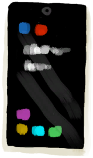
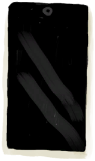
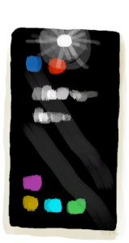

# Phone  
> "A source of light and entertainment  
  
<table class="table table-bordered" data-toggle="table"  data-show-header="false"><thead style="display:none"><tr ><th  style="width:50%;text-align:left;vertical-align:top;"  >title</th><th  style="width:50%;text-align:left;vertical-align:top;"  ></th></tr></thead><tr ><td  style="width:50%;text-align:left;vertical-align:top;"  >**Weight：**25</td><td  style="width:50%;text-align:left;vertical-align:top;"  >

<a href="PhoneOn.md" style="color:black">Phone</a>

</td></tr></tbody></table>  
  
## Got From  

Turn On

[Phone(Off)](PhoneOff.md)

Light Off

[Phone](PhoneOnLight.md)

Perk Effect

[Youtuber](Pk_2_Retromation.md)

  
  
## Action  

<table><tr><td rowspan="2" style="width:200px;text-align:center;font-size:1.3em;font-weight:bold">

Turn Off

</td><td></td></tr><tr><td><b>Self：</b>→ [

[Phone(Off)](PhoneOff.md)](PhoneOff.md)</td></tr></table>
  

<table><tr><td rowspan="2" style="width:200px;text-align:center;font-size:1.3em;font-weight:bold">

Play Game

30m

</td><td></td></tr><tr><td><b>Self：</b>Fuel  <b>-2(-0.69%)</b></td></tr><tr><td colspan="2"><b>StatChange：</b>[

[Morale](Morale.md)](Morale.md)<b>+5</b>, [

[Stress](Stress.md)](Stress.md)<b>-25～+5</b>, [

[Entertainment](Entertainment.md)](Entertainment.md)<b>+30</b></td></tr></table>
  

<table><tr><td rowspan="2" style="width:200px;text-align:center;font-size:1.3em;font-weight:bold">

Check Pictures

15m

</td><td></td></tr><tr><td><b>Self：</b>Fuel  <b>-1(-0.35%)</b></td></tr><tr><td colspan="2"><b>StatChange：</b>[

[Loneliness](Loneliness.md)](Loneliness.md)<b>-50</b>, [

[Stress](Stress.md)](Stress.md)<b>-10</b></td></tr></table>
  

<table><tr><td rowspan="2" style="width:200px;text-align:center;font-size:1.3em;font-weight:bold">

Light On

</td><td></td></tr><tr><td><b>Self：</b>→ [

[Phone](PhoneOnLight.md)](PhoneOnLight.md), Fuel  <b>-1(-0.35%)</b></td></tr></table>
  
  
  
## Durability   

<table style="margin-bottom:0px;"><tr><td style="width:30%;text-align:left; background-color:#FEFEFE;font-size:1.3em;font-weight:bold;">Fuel</td><td style="font-size:1em;background-color:#FEFEFE">Starting：288 , Max：288 -1/TP , Duration ：3d</td></tr><tr style="background-color:#FFFFFF"><td colspan=2>** On Zero：Battery Empty ** Self: → [

[Phone(Off)](PhoneOff.md)](PhoneOff.md)</td></tr></table>
  

