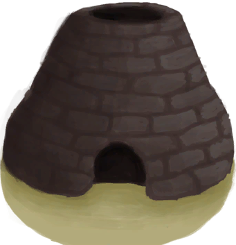

# Abandoned Farm  
> Start in an abandoned farm in the Secret Valley.  
  
<table class="table table-bordered" data-toggle="table"  data-show-header="false"><thead style="display:none"><tr ><th  style="width:15%;text-align:left;vertical-align:top;"  >名称</th><th  style="text-align:left;vertical-align:top;"  >值</th></tr></thead><tr ><td  style="width:15%;text-align:left;vertical-align:top;"  >Unlock By</td><td  style="text-align:left;vertical-align:top;"  >3🌙</td></tr><tr ><td  style="width:15%;text-align:left;vertical-align:top;"  >Score</td><td  style="text-align:left;vertical-align:top;"  >500</td></tr><tr ><td  style="width:15%;text-align:left;vertical-align:top;"  >Equipped Card</td><td  style="text-align:left;vertical-align:top;"  >

  
  
</td></tr><tr ><td  style="width:15%;text-align:left;vertical-align:top;"  >Extra Cards</td><td  style="text-align:left;vertical-align:top;"  >

  
  
</td></tr><tr ><td  style="width:15%;text-align:left;vertical-align:top;"  >Starting Status</td><td  style="text-align:left;vertical-align:top;"  >[

[Filth](Filth.md)](Filth.md)<b>-225</b></td></tr><tr ><td  style="width:15%;text-align:left;vertical-align:top;"  >Passive Status</td><td  style="text-align:left;vertical-align:top;"  >-</td></tr><tr ><td  style="width:15%;text-align:left;vertical-align:top;"  >Environment</td><td  style="text-align:left;vertical-align:top;"  >[

[Mud Hut(Environment)](Env_MudHutRuins.md)](Env_MudHutRuins.md)</td></tr></tbody></table>  
  

